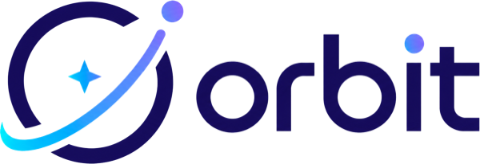
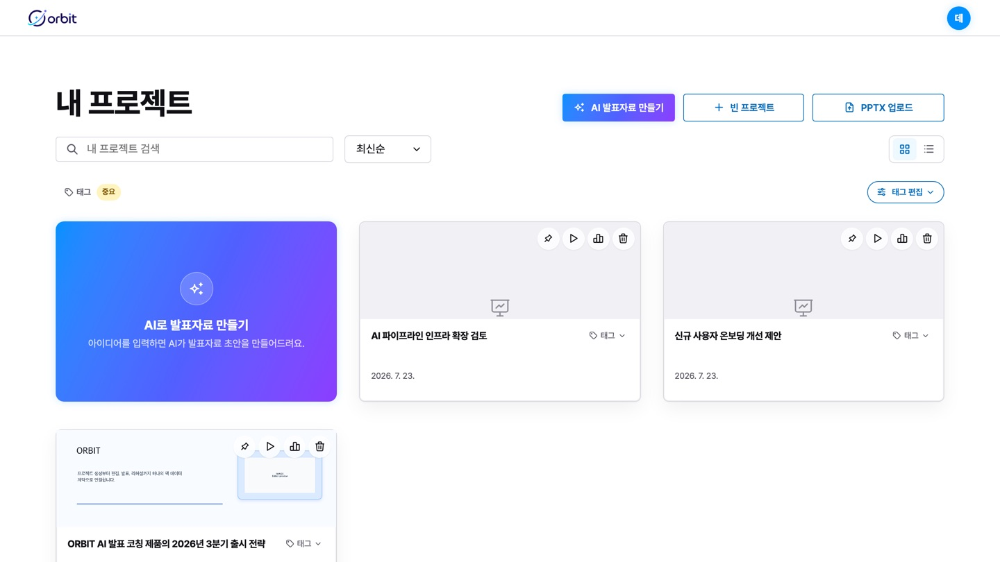
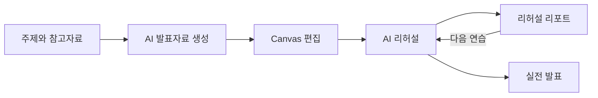
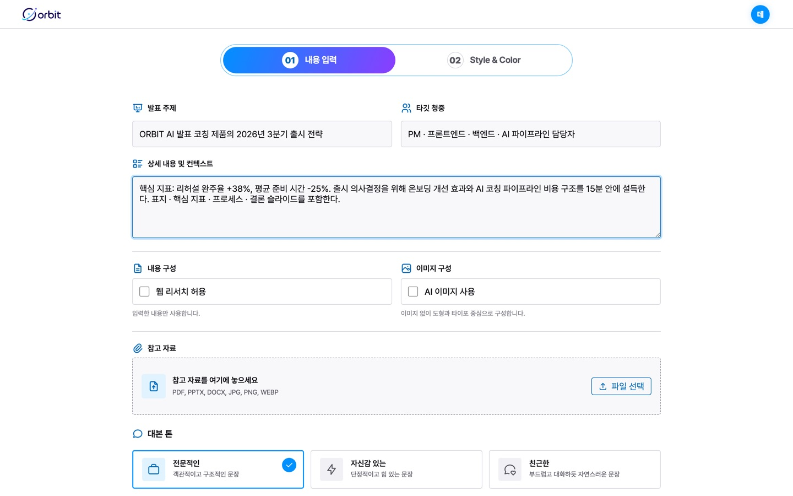
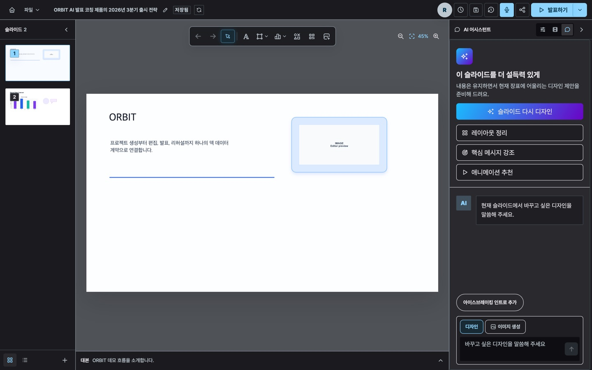
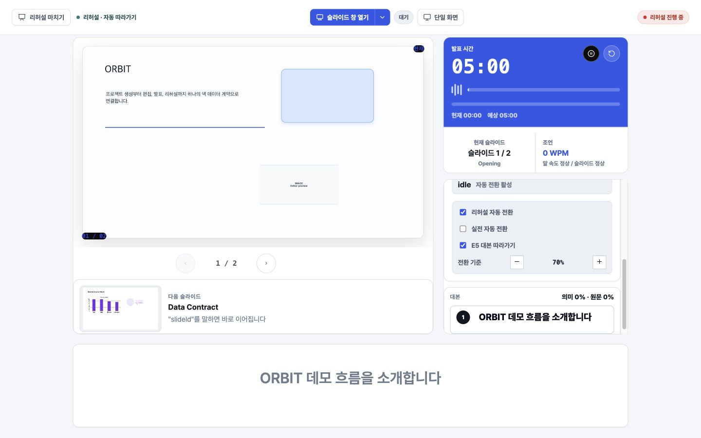
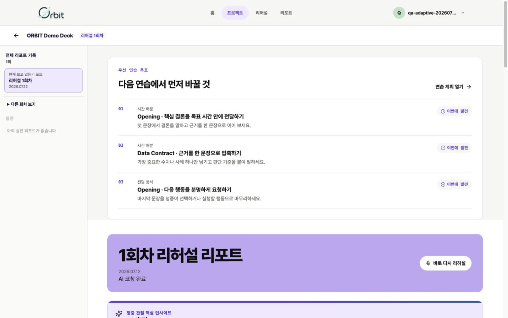
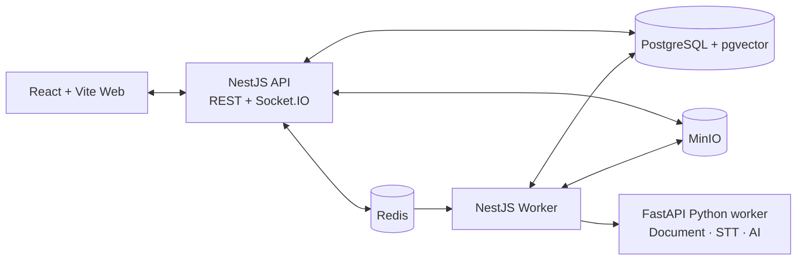

<div align="center">
  <picture>
    <source media="(prefers-color-scheme: dark)" srcset="./docs/assets/readme/orbit-logo-dark.png" />
    
  </picture>
  <h1>ORBIT</h1>
  <p><strong>발표를 만드는 순간부터, 무대에 오르는 순간까지.</strong></p>
  <p>
    AI 발표자료 생성, 편집, 리허설 코칭, 실전 발표를<br />
    하나의 로컬 우선 워크스페이스에서 연결합니다.
  </p>
  <p>
    <a href="#제품-둘러보기">제품 둘러보기</a> ·
    <a href="#빠른-시작">빠른 시작</a> ·
    <a href="#아키텍처">아키텍처</a> ·
    <a href="#개발-가이드">개발 가이드</a>
  </p>
  <p>
    <a href="https://github.com/na-man-mu-303-team2/Orbit/actions/workflows/typescript-ci.yml">
      
    </a>
    <a href="https://github.com/na-man-mu-303-team2/Orbit/actions/workflows/adaptive-coaching-ci.yml">
      
    </a>
    
  </p>
</div>

<p align="center">
  
</p>

ORBIT는 발표자료 제작과 발표 연습을 서로 분리하지 않습니다. 주제와 참고자료를 바탕으로 덱을 만들고, Canvas에서 편집하고, AI 코칭과 함께 리허설한 뒤, 발표자·청중 화면과 리포트까지 하나의 제품 흐름으로 이어갑니다.

이 저장소는 `pnpm` workspace와 Turborepo 기반 모노레포이며 Web, API, Worker, Python worker와 공통 계약 패키지를 함께 관리합니다.

## 제품 둘러보기



### 하나로 이어지는 발표 워크플로

<table>
  <tr>
    <td width="50%" valign="top">
      
      <br />
      <strong>AI 발표자료 생성</strong><br />
      발표 목적, 청중, 핵심 메시지와 참고자료를 입력해 Design Pack 기반의 Deck을 생성합니다. 기존 PPTX 가져오기나 빈 프로젝트로 시작할 수도 있습니다.
    </td>
    <td width="50%" valign="top">
      
      <br />
      <strong>Canvas 편집</strong><br />
      Konva 기반 에디터에서 슬라이드를 다듬고 AI 코치, 디자인, 발표 메모를 같은 작업 공간에서 관리합니다. 완성한 Deck은 PPTX로 내보낼 수 있습니다.
    </td>
  </tr>
  <tr>
    <td width="50%" valign="top">
      
      <br />
      <strong>AI 리허설</strong><br />
      Live STT, 말하기 속도, 핵심 키워드와 의미 단서를 바탕으로 발표 흐름을 점검하고 집중 연습으로 연결합니다.
    </td>
    <td width="50%" valign="top">
      
      <br />
      <strong>리허설 리포트</strong><br />
      리허설 종료 후 회차별 분석, 강점과 개선점, 다음 연습 목표를 확인합니다.
    </td>
  </tr>
</table>

준비가 끝난 Deck은 발표자 화면과 청중 화면에 동기화하고, QR로 입장한 청중과 실시간 투표·평점·자유 응답 같은 활동 슬라이드로 상호작용하며 실전 발표로 이어집니다. 만든 Deck은 커뮤니티 템플릿으로 공유하거나 갤러리에서 다른 사용자의 템플릿을 가져와 시작할 수 있습니다.

### 로컬 우선으로 설계했습니다

> `docker compose up --build` 한 번으로 Web, API, Worker, Python worker, PostgreSQL, Redis, MinIO를 함께 실행합니다.

- Deck, API, Job, WebSocket 데이터는 `packages/shared`의 Zod schema를 공통 계약으로 사용합니다.
- Storage, Job Queue, AI/STT/OCR은 port와 provider interface 뒤에 두어 로컬 환경과 운영 환경을 교체할 수 있습니다.
- 발표자 script, raw audio와 transcript 원문은 청중 API에 노출하지 않습니다.

## 빠른 시작

### 요구 사항

- Node.js `>=22.12`
- pnpm `10.12.4`
- Docker와 Docker Compose

### 전체 서비스 실행

```bash
corepack enable
corepack prepare pnpm@10.12.4 --activate
pnpm install
cp .env.example .env.local
node infra/scripts/check-env.mjs
docker compose up --build
```

브라우저에서 <http://localhost:5173>을 열면 ORBIT Web을 확인할 수 있습니다.

<details>
<summary><strong>로컬 서비스 주소 보기</strong></summary>

| 서비스               | 주소                           |
| -------------------- | ------------------------------ |
| Web                  | <http://localhost:5173>        |
| API health           | <http://localhost:3000/health> |
| API Swagger          | <http://localhost:3000/docs>   |
| Python worker health | <http://localhost:8000/health> |
| MinIO console        | <http://localhost:9001>        |

</details>

인프라와 migration을 포함한 개발 환경은 `pnpm dev:local`로도 시작할 수 있습니다. 자세한 내용은 [로컬 개발 Runbook](docs/runbooks/local-development.md)을 확인하세요.

## 아키텍처



| 영역                 | 주요 기술                                        |
| -------------------- | ------------------------------------------------ |
| Web                  | React 19, Vite 7, TanStack Query, Zustand, Konva |
| Realtime             | Socket.IO, Yjs                                   |
| API                  | NestJS 11, TypeORM, Swagger, Zod                 |
| Background jobs      | NestJS Worker, BullMQ, Redis                     |
| Python worker        | FastAPI, Pydantic, OpenAI SDK                    |
| Local infrastructure | PostgreSQL + pgvector, Redis, MinIO              |
| Production target    | AWS ECS Fargate, RDS, ElastiCache, S3, SQS       |

운영 매핑과 확장 원칙은 [로컬 우선 아키텍처](docs/architecture/local-first-stack.md), 정확한 버전은 [기술 스택 버전 기준](docs/architecture/tech-stack-versions.md)을 확인하세요.

<details>
<summary><strong>모노레포 구조 보기</strong></summary>

```text
apps/
  web/              Vite React client
  api/              NestJS REST API + Socket.IO gateway
  worker/           NestJS background worker
services/
  python-worker/    FastAPI document, speech, and AI worker
packages/
  shared/           Zod schemas and shared contracts
  config/           Environment validation and runtime config
  editor-core/      Deck and editor domain helpers
  realtime/         Realtime event helpers
  job-queue/        Job queue ports and adapters
  storage/          Storage ports and adapters
  ai/               LLM, STT, and OCR provider interfaces
infra/
  docker/           Service Dockerfiles
  scripts/          Environment and smoke-check scripts
docs/               Architecture, conventions, runbooks, and research
```

</details>

## 개발 가이드

변경 범위에 맞는 검증을 실행합니다.

| 명령                               | 용도                 |
| ---------------------------------- | -------------------- |
| `pnpm build`                       | workspace 전체 빌드  |
| `pnpm lint`                        | TypeScript lint      |
| `pnpm test`                        | workspace 테스트     |
| `pnpm typecheck`                   | TypeScript typecheck |
| `node infra/scripts/check-env.mjs` | 환경변수 계약 검증   |
| `docker compose config --quiet`    | Compose 구성 검증    |

Python worker를 변경한 경우 다음 검증을 추가합니다.

```bash
cd services/python-worker
uv sync
uv run ruff check .
uv run mypy app
uv run pytest
```

공통 계약을 바꾸는 작업은 기능 구현과 분리해 작게 진행하고 `packages/shared` schema와 [공통 계약 문서](docs/contracts.md)를 함께 갱신합니다.

### Git과 PR

GitHub Flow를 사용하며 `main`에 직접 커밋하지 않습니다. 목적이 드러나는 브랜치에서 작업하고 기본적으로 `develop` 대상 PR로 검증한 뒤 병합합니다.

브랜치 이름, 커밋 메시지, PR 작성과 병합 기준은 [Git과 PR 규칙](docs/git-rules.md)을 따릅니다.

## 문서

| 문서                                                    | 내용                              |
| ------------------------------------------------------- | --------------------------------- |
| [AGENTS.md](AGENTS.md)                                  | 저장소 최상위 작업 규칙           |
| [ORBIT Design System](docs/orbit-design-system.md)      | 제품의 시각·상호작용 기준         |
| [공통 계약](docs/contracts.md)                          | Deck, File, Job, WebSocket schema |
| [Demo ID 기준](docs/demo-standards.md)                  | 로컬·E2E Demo 식별자              |
| [로컬 개발 Runbook](docs/runbooks/local-development.md) | 실행, migration, smoke test       |
| [환경변수 규칙](docs/conventions/environment.md)        | 환경변수 이름과 관리 기준         |
| [서버 로그 규칙](docs/conventions/logging.md)           | 업무 이벤트와 민감정보 보호       |
| [AWS 배포 기준](docs/deployment.md)                     | ECS Fargate 기반 운영 목표        |
| [README 이미지 명세](docs/readme-assets.md)             | Hero와 제품 화면 캡처 기준        |
