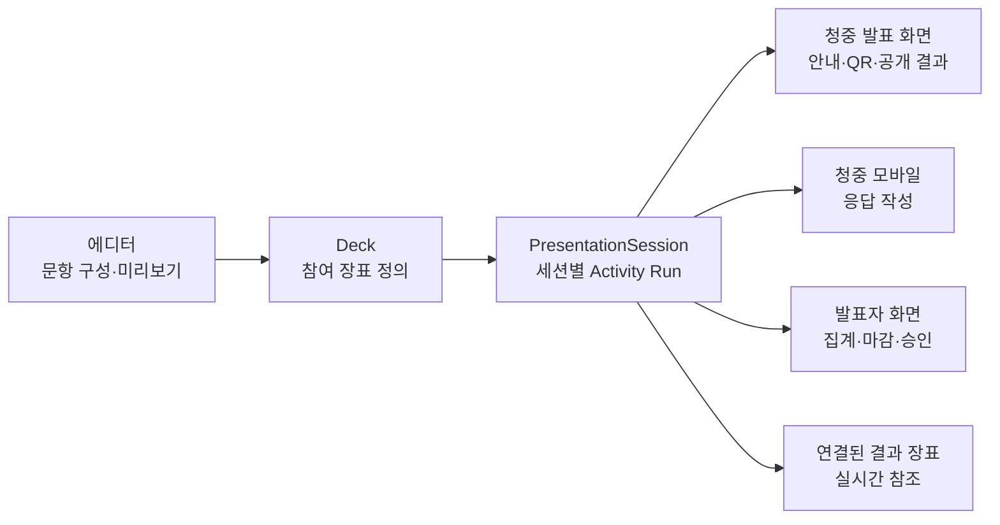

# 참여 장표: 질문·투표·설문을 덱 안에서 운영하기

## 문서 상태

- 상태: 제품 의도와 핵심 정책 확정
- 확정일: 2026-07-17
- 대상 환경: 10~200명 규모의 팀 발표, 강의, 세미나
- 주요 사용자: 발표자와 익명 또는 선택 이름 기반의 청중
- 관련 계약: `docs/contracts.md`, `packages/shared/src/deck/deck.schema.ts`, `packages/shared/src/presentation/presentation.schema.ts`, `packages/shared/src/realtime/websocket.schema.ts`
- 구현 계획: `docs/plans/activity-slides-implementation-plan.md`

## Problem Statement

발표자가 별도 설문 도구로 이동하지 않고 일반 슬라이드처럼 참여 장표를 추가해 사전 질문 수집, 발표 중 투표, 종료 후 만족도 조사, 실시간 집계와 결과 공개까지 운영할 수 있게 한다.

How might we 발표자가 발표 흐름을 깨뜨리지 않고 덱 안에서 청중 참여를 설계하고 운영하되, 청중 화면과 발표자 화면에는 각 역할에 필요한 정보만 안전하게 보여줄 수 있을까?

## Recommended Direction

`참여 장표(Activity Slide)`라는 공통 개념 아래 다음 템플릿을 제공한다.

1. 사전 질문 장표
2. 실시간 투표 장표
3. 만족도 조사 장표
4. 연결된 결과 장표

수집 장표는 `draft -> open -> closed -> results` 상태를 가지며, 같은 장표라도 `editor`, `audience-display`, `audience-mobile`, `presenter` 역할에 따라 다르게 렌더링한다.

결과 장표는 응답 데이터를 복사하지 않는다. 결과 장표 하나는 원본 수집 장표 하나의 `activityId`만 참조하고, 선택한 PresentationSession의 최신 집계를 실시간으로 보여준다. 여러 참여 장표를 비교하는 기능은 독립 결과 페이지가 담당한다. 이 원칙을 지켜야 원본과 결과 장표 사이의 데이터 불일치, 복제, 삭제 문제를 줄일 수 있다.

Deck에는 질문과 설문 정의만 저장하고 실제 응답은 PresentationSession별 Activity Run에 저장한다. 같은 덱을 여러 번 발표하더라도 각 발표의 결과가 섞이지 않아야 한다.



## Product Principles

- 참여 기능도 덱의 발표 흐름을 구성하는 장표로 취급한다.
- 설문 정의와 응답 데이터의 수명 주기를 분리한다.
- 청중 발표 화면, 청중 모바일, 발표자 화면의 권한과 payload를 분리한다.
- 장표별 고유 링크를 유지하되 청중의 반복 QR 스캔은 요구하지 않는다.
- 주관식 원문은 발표자가 개별 승인하기 전까지 청중에게 공개하지 않는다.
- 결과 장표는 원본 데이터를 참조하며 별도의 결과 사본을 만들지 않는다.
- 진행 중인 발표 세션은 재접속하고, 새 발표의 응답은 명시적으로 만든 새 세션에 격리한다.
- 문항의 의미와 응답이 연결된 뒤에는 기존 결과의 해석이 조용히 바뀌지 않게 한다.

## User Experience

### 에디터

기존 `새 슬라이드` 버튼을 split button으로 확장한다.

- 기본 슬라이드
- 사전 질문 장표
- 실시간 투표 장표
- 만족도 조사 장표
- 결과 장표 추가

참여 장표를 선택하면 우측 설정 패널에 다음 항목을 표시한다.

- 제목과 안내 문구
- 문항과 선택지 편집
- 필수 응답 여부
- 선택 이름 입력 허용 여부
- 현재 운영 상태와 열기·마감 제어
- 청중 결과 공개 여부
- 장표별 직접 링크 복사
- QR 코드 확인
- 연결된 결과 장표 추가

캔버스 상단에는 `청중 화면`과 `발표자 화면` 미리보기 전환을 둔다. 실제 결과를 미리 볼 때는 대상 PresentationSession을 선택한다.

참여 장표와 연결 결과 장표는 시스템 관리 장표로 취급한다. 일반 텍스트, 도형, 차트, 이미지, 애니메이션은 추가하거나 편집할 수 없고, 문항·운영 상태·결과 연결 같은 전용 설정만 우측 `장표 설정` 패널에서 관리한다. QR, 응답 수, 집계 차트처럼 runtime 데이터에 의존하는 컴포넌트도 잠긴 시스템 레이어로 렌더링한다.

### 청중 발표 화면

수집 중에는 다음 내용을 표시한다.

- 질문 또는 설문 제목
- 짧은 참여 안내
- 장표별 QR 코드
- 참여 URL 또는 입장 코드
- 현재 참여 인원 수

마감 후에는 발표자의 선택에 따라 감사 메시지 또는 공개 결과를 표시한다. 미승인 주관식 원문과 선택 이름은 표시하지 않는다.

### 청중 모바일

청중은 장표별 URL로 직접 접근할 수 있다.

```text
/audience/:sessionId/a/:activityId
```

각 장표는 고유 링크와 QR을 갖지만 청중은 PresentationSession에 한 번만 입장한다. 기존 signed audience cookie를 사용해 같은 세션 안의 다른 참여 장표에 접근한다. 세션별로 `비밀번호 필요`와 `공개 링크`를 선택할 수 있으며 기본값은 4자리 비밀번호가 필요한 보호 상태다.

발표자가 다음 참여 장표를 활성화하면 다음 규칙을 적용한다.

- 미작성 상태이면 새 활성 장표로 자동 전환한다.
- 미제출 입력이 있으면 즉시 이동시키지 않고 새 장표 알림을 표시한다.
- 사용자가 제출하거나 입력 폐기를 확인한 뒤 이동한다.
- 직접 링크로 진입한 사전·사후 응답자는 해당 장표에 그대로 진입한다.

### 발표자 화면

발표자 화면에는 청중에게 보이지 않는 운영 정보를 표시한다.

- 실시간 응답 수와 응답률
- 문항별 집계 차트
- 장표 열기, 마감, 결과 공개
- 주관식 답변 목록
- 주관식 답변 승인, 숨김, 답변 완료 처리
- 연결된 결과 장표 미리보기
- 전체 결과 페이지 열기

## Activity Templates

### 사전 질문

- 주관식 질문 1~5개
- 안내 문구 편집
- 선택 이름 입력
- 장표별 직접 링크
- 발표 전 수집 시작
- 질문별 `approved`, `hidden`, `answered` moderation 상태
- 승인된 질문만 결과 장표에 노출

### 실시간 투표

- 단일 선택형 1문항
- 선택지 최대 8개
- 실시간 득표 수와 비율
- 마감 전 결과 숨김 옵션
- 발표자가 선택한 시점에 결과 공개

### 만족도 조사

템플릿 편집형으로 최대 5문항을 지원한다.

- 5점 척도
- 단일 선택
- 복수 선택
- 주관식 의견
- 문항별 필수 여부
- 척도 양끝 라벨 편집

### 연결된 결과 장표

- 원본 `activityId` 참조
- 결과 장표 하나당 원본 참여 장표 하나만 연결
- 수치형 결과의 응답 수, 비율, 평균, 차트 표시
- 발표자가 승인한 주관식 응답 카드 표시
- PresentationSession별 실시간 갱신
- 원본 수집 장표로 이동
- 원본 삭제 시 연결 복구 안내
- 아직 Activity Run이 없거나 원본 장표보다 먼저 재생된 경우 결과 대기 placeholder 표시
- 청중 공개 전에는 발표자 화면에서만 실제 결과 표시

## Runtime State

장표 정의와 발표 세션의 실행 상태를 분리한다.

```ts
type ActivityRuntimeStatus =
  | "draft"
  | "open"
  | "closed"
  | "results";
```

- `draft`: 발표자만 설정하고 청중은 응답할 수 없다.
- `open`: 청중이 응답을 제출하거나 수정할 수 있다.
- `closed`: 신규 제출과 수정을 막는다.
- `results`: 발표자가 승인한 결과를 청중 화면에 공개한다.

MVP에서는 발표자가 개별 Activity Run의 상태를 수동으로 변경한다. 개별 질문과 설문의 예약 시작과 자동 마감은 후속 범위로 둔다.

### PresentationSession 수명 주기

- 발표자가 참여 가능 시작일과 종료일을 직접 설정한다.
- 기본 유효 기간은 14일이다.
- 최대 유효 기간은 30일이다.
- 세션 접근 가능 여부는 설정한 시작일과 종료일에 따라 자동으로 전환한다.
- 세션 유효 기간과 개별 Activity Run의 `open`, `closed` 상태는 서로 독립적이다.
- 유효한 진행 중 세션이 있으면 발표자 창 새로고침과 재실행 시 해당 세션에 재접속한다.
- 새로운 발표 결과가 필요하면 발표자가 `새 발표 세션 만들기`를 명시적으로 실행한다.
- 새 PresentationSession은 빈 Activity Run을 만들며 종료된 이전 세션의 응답을 합치지 않는다.

## Shared Contract Direction

현재 Slide schema에는 장표 종류를 구분하는 필드가 없다. 기존 Deck JSON과의 하위 호환을 위해 기본값이 있는 discriminator를 추가한다.

```ts
type SlideKind = "content" | "activity" | "activity-results";

type ActivityDefinition = {
  activityId: string;
  template: "pre-question" | "poll" | "satisfaction";
  title: string;
  description: string;
  questions: ActivityQuestion[];
  allowDisplayName: boolean;
};

type ActivityResultDefinition = {
  sourceActivityId: string;
  display: "live";
  layout: "summary" | "chart" | "approved-text";
};
```

`ActivityQuestion`은 다음 문항 타입의 discriminated union으로 정의하고 Zod로 검증한다.

- `rating`
- `single-choice`
- `multiple-choice`
- `free-text`

PresentationSession에서 참여 장표를 최초로 열 때 문항 정의를 snapshot으로 고정한다. 첫 응답이 제출된 뒤에는 질문 문구, 문항 타입, 선택지, 필수 여부처럼 응답 의미를 바꾸는 필드를 잠근다. 색상, 배치 등 시각 표현은 계속 편집할 수 있다. 문항 의미를 변경하려면 기존 결과를 보존하고 새 Activity Run 버전을 만든다.

```ts
type ActivityRun = {
  activityRunId: string;
  presentationSessionId: string;
  activityId: string;
  sourceSlideId: string;
  version: number;
  supersedesActivityRunId: string | null;
  definitionSnapshot: ActivityDefinition;
  status: ActivityRuntimeStatus;
  openedAt: string | null;
  closedAt: string | null;
  revealedAt: string | null;
};
```

현재 shared `presentationSessionSchema`와 실제 audience access DB 모델의 `deckId` 표현이 일치하지 않는다. 기능 구현 전에 PresentationSession을 특정 `deckId`와 `deck.version`에 명시적으로 연결한다.

## Response Identity and Deduplication

- signed audience cookie의 익명 `audienceId`를 사용한다.
- `activityRunId + audienceId` unique constraint를 둔다.
- 장표가 `open`인 동안 기존 응답을 수정할 수 있다.
- 이름은 선택 입력이며 이메일과 전화번호는 수집하지 않는다.
- cookie 삭제나 다른 브라우저를 이용한 재응답까지 막지는 않는다.
- 10~200명 환경에서는 브라우저 단위 soft deduplication을 MVP 기준으로 삼는다.
- 선택 이름, 주관식 원문, 개인 단위 수치 답변 row는 발표 종료 후 90일 동안 보관하고 이후 영구 삭제한다.
- 90일이 지나면 개인 단위 응답 대신 개인을 식별할 수 없는 문항별 수치 집계 snapshot만 프로젝트 결과로 유지한다.
- 프로젝트 소유자는 보관 기간이 끝나기 전에도 세션 응답 전체를 영구 삭제할 수 있다.

응답 원문, 선택 이름, 미승인 질문은 발표자 권한 API에서만 반환한다.

## API Direction

구체 endpoint 이름은 구현 명세 단계에서 shared schema와 함께 확정하되 다음 기능 경계를 유지한다.

### 발표자 API

- Activity Run 생성 또는 조회
- 상태를 `open`, `closed`, `results`로 변경
- 실시간 집계와 주관식 원문 조회
- 주관식 응답 승인, 숨김, 답변 완료 처리
- PresentationSession 전체 결과 조회
- PresentationSession 결과 영구 삭제

### 청중 API

- 공개 가능한 Activity Run 정의 조회
- 응답 제출 또는 마감 전 수정
- 공개된 집계와 승인된 주관식 결과 조회

응답 제출은 HTTP API로 처리한다. DB transaction commit 후 WebSocket으로 상태와 집계 변경을 알린다.

### 권한

- 프로젝트 발표자와 편집자는 응답 승인, 숨김, 답변 완료 등 moderation을 수행할 수 있다.
- PresentationSession 결과 전체의 영구 삭제는 프로젝트 소유자만 수행할 수 있다.
- 청중은 자신의 browser identity에 연결된 응답만 `open` 상태에서 수정할 수 있다.

## WebSocket Direction

필요 이벤트는 다음과 같다.

- `active-activity-changed`
- `activity-state-changed`
- 기존 `question-created`
- 기존 `poll-voted`
- 기존 `survey-submitted`
- `activity-results-updated`

모든 이벤트 payload는 `packages/shared/src/realtime`의 Zod schema로 검증한다.

청중 room에는 다음 정보만 전송한다.

- 현재 활성 `activityId`
- 공개 가능한 상태
- 공개된 수치 집계
- 발표자가 승인한 익명 주관식 응답

선택 이름, 미승인 주관식 원문, speaker notes, presenter script는 청중 room과 서버 로그에 전송하지 않는다.

## Results Experience

결과는 다음 세 위치에서 확인한다.

1. 에디터 우측 패널의 현재 장표 요약
2. 발표자 화면의 실시간 집계
3. 독립 결과 페이지

독립 결과 페이지의 경로 후보는 다음과 같다.

```text
/projects/:projectId/presentation-sessions/:sessionId/results
```

독립 페이지에서는 장표별 응답 수, 문항별 집계, 주관식 검토와 승인, 질문 답변 완료 상태를 제공한다. 덱을 재생하지 않고 결과만 검토할 때 사용하는 보조 화면이며, 설문 작성의 주 화면으로 확장하지 않는다.

## Duplication and Export

### Deck 복제

- 문항 설정과 시각 디자인만 복제한다.
- 복제된 모든 참여 장표에 새 `activityId`를 발급한다.
- 결과 장표의 `sourceActivityId`는 복제본 내부의 새 `activityId`로 재매핑한다.
- 기존 PresentationSession, 직접 링크, Activity Run, 응답은 복제하지 않는다.
- 결과 장표만 개별 복제하면 같은 원본 `activityId`를 계속 참조한다.

### 정적 내보내기

- PPTX와 정적 이미지의 수집 장표는 live QR이 없는 정적 안내 형태로 내보낸다.
- 사용자가 특정 PresentationSession을 명시적으로 선택한 경우에만 결과 장표를 export 시점 snapshot으로 포함한다.
- 세션을 선택하지 않으면 결과 장표는 실제 응답 대신 결과 placeholder를 표시한다.
- export 파일은 이후 live 응답 변경을 반영하지 않는다.

## Success Criteria

- 발표자가 에디터를 벗어나지 않고 3분 안에 참여 장표를 만들고 링크를 열 수 있다.
- 청중은 최초 입장 후 30초 안에 응답을 제출할 수 있다.
- 200명 동시 참여에서 집계가 발표자 화면에 2초 이내 반영된다.
- 같은 덱의 서로 다른 PresentationSession 결과가 섞이지 않는다.
- 원본 수집 장표와 결과 장표 사이에 응답 데이터 복제가 없다.
- 청중 DOM, API, WebSocket에 선택 이름, 미승인 주관식, speaker notes가 노출되지 않는다.
- 원본 장표 삭제나 복제 시 연결된 결과 장표가 조용히 잘못된 데이터를 보여주지 않는다.
- 선택 이름과 주관식 원문은 90일 보관 정책에 따라 삭제되고 익명 수치 집계만 유지된다.

## Key Assumptions to Validate

- [ ] 장표별 직접 링크와 발표 중 자동 전환이 함께 있어도 청중이 혼란스럽지 않다. 에디터·발표자·청중 모바일의 클릭 가능한 프로토타입으로 검증한다.
- [ ] 익명 응답에 선택 이름을 제공해도 응답률이 유의미하게 떨어지지 않는다. 소규모 발표 3회에서 익명과 선택 이름 사용률을 비교한다.
- [ ] 발표자가 10~200명의 주관식 응답을 개별 승인할 수 있다. 응답 50개 fixture로 moderation 완료 시간을 측정한다.
- [ ] 연결된 결과 장표가 별도 결과 대시보드보다 실제 발표 흐름에 충분한 가치를 제공한다. 발표자 5명에게 결과 공개 시나리오를 수행하게 한다.
- [ ] browser cookie 기반 soft deduplication이 초기 대상 환경에서 충분하다. 중복 제출 요구가 있는 운영 사례를 사용자 인터뷰로 확인한다.

## MVP Scope

- 종류별 참여 장표 추가
- 청중 화면과 발표자 화면 역할 분리 렌더링
- 사전 질문 1~5문항
- 단일 선택 투표 1문항
- 최대 5문항 만족도 조사
- 장표별 링크와 QR
- 한 번 입장한 청중의 활성 장표 자동 전환
- `draft`, `open`, `closed`, `results` 수동 상태 제어
- 세션별 응답 저장과 브라우저 단위 중복 제한
- 실시간 응답 수와 수치 집계
- 주관식 개별 승인
- 연결된 실시간 결과 장표
- 에디터 요약, 발표자 집계, 독립 결과 페이지
- 발표자가 직접 설정하는 기본 14일·최대 30일의 세션 유효 기간
- 세션별 공개 링크 또는 4자리 비밀번호 보호 선택
- 첫 응답 이후 문항 잠금과 새 Activity Run 버전 생성
- 편집자 moderation과 프로젝트 소유자 영구 삭제 권한 분리
- 정적 안내와 선택 세션 결과 snapshot 기반 export

## Not Doing (and Why)

- 자유형 폼 빌더: 초기 제품이 독립 설문 도구 수준으로 커지는 것을 막는다.
- 조건부 질문 분기와 행렬형 문항: 핵심 가정 검증에 필요하지 않고 계약과 UI 복잡도가 크다.
- 청중 계정 로그인과 조직 SSO: 익명 참여의 진입 마찰을 높이고 별도 identity 범위를 만든다.
- 미승인 주관식 자동 공개: 부적절한 내용과 개인정보 노출 위험이 있다.
- 자동 AI 질문 요약과 감성 분석: 수집과 운영 흐름이 검증되기 전에 결과 해석 기능을 추가하지 않는다.
- 여러 발표 세션을 합친 장기 통계: 세션별 데이터 격리를 먼저 안정화한다.
- 이메일 발송과 외부 CRM 연동: 외부 서비스와 개인정보 처리 범위를 넓힌다.
- 응답자별 상세 행동 분석: 발표 운영에 필요한 최소 데이터보다 과도하다.
- 개별 Activity Run의 예약 시작과 자동 마감: PresentationSession 접근 기간은 자동 적용하지만 각 질문과 설문의 `open`, `closed` 상태는 발표자가 수동 제어한다.
- 여러 참여 장표를 합친 결과 장표: 장표 하나는 하나의 원본만 참조하고 전체 비교는 독립 결과 페이지가 담당한다.

## Confirmed Decisions

- PresentationSession 유효 기간은 발표자가 직접 설정하며 기본 14일, 최대 30일이다.
- 진행 중 세션은 재접속하고 새 발표 결과는 명시적으로 만든 새 세션에 격리한다.
- 첫 응답 이후 문항 의미 필드를 잠그고 변경 시 새 Activity Run 버전을 만든다.
- 선택 이름, 주관식 원문, 개인 단위 수치 답변 row는 90일 후 삭제하고 익명 수치 집계 snapshot만 유지한다.
- 세션별로 공개 링크와 4자리 비밀번호 보호를 선택하며 기본은 비밀번호 보호다.
- 발표자와 편집자는 moderation을 수행하고 프로젝트 소유자만 결과를 영구 삭제한다.
- Deck 복제 시 설정만 새 `activityId`로 복제하고 세션, 링크, 응답은 복제하지 않는다.
- 결과 장표 하나는 참여 장표 하나만 참조한다.
- 정적 export는 live QR 없는 안내를 사용하고 명시적으로 선택한 세션 결과만 snapshot으로 포함한다.

## Codebase Touchpoints

- `packages/shared/src/deck/deck.schema.ts`: 참여 장표 정의와 Slide discriminator
- `packages/shared/src/presentation/presentation.schema.ts`: PresentationSession, Activity Run, response 계약
- `packages/shared/src/realtime/websocket.schema.ts`: 상태와 집계 이벤트 payload
- `docs/contracts.md`: Deck, PresentationSession, WebSocket 공통 계약
- `packages/editor-core/src/patches/slideOperations.ts`: 참여 장표와 결과 장표 추가·복제·삭제 patch
- `apps/web/src/features/editor/shell`: 에디터 추가 메뉴, 설정 패널, 역할별 미리보기
- `apps/web/src/features/rehearsal/presenter/AudienceOutputRenderer.tsx`: 청중 발표 화면 역할별 렌더링
- `apps/web/src/features/rehearsal/presenter/PresenterRemoteWindow.tsx`: 발표자 집계와 상태 제어
- `apps/web/src/features/audience`: 청중 모바일 응답 화면과 자동 전환
- `apps/api/src/presentation-sessions`: 세션 수명 주기, 접근 제어, Activity Run API
