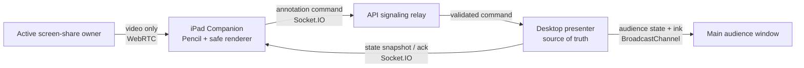

# iPad Presenter Companion

**Status:** Proposed

**Date:** 2026-07-23

**Target:** Desktop Chrome Stable presenter + one trusted iPad companion on the
current or previous stable iPadOS Safari, using a staging/production HTTPS
origin on the same network

## Problem Statement

How might we let a presenter use a separate iPad as a safe, touch-enabled mirror
of the audience output and show Apple Pencil annotations on the main audience
screen immediately, without exposing presenter-only data or making the iPad a
dependency of the presentation?

## Target User and Success

The target user is the presenter, using one trusted iPad as a companion device.
The iPad is not an audience collaboration surface.

The first version succeeds when:

- pairing takes less than 30 seconds;
- the presenter can pair and test the iPad before presenting, then reconnect or
  replace it from the live toolbar;
- iPad input appears on the main audience display within p95 300 ms on the same
  network;
- slide, animation step, black output, and screen-share output are represented
  correctly on the iPad;
- an iPad disconnect never pauses or changes the main presentation;
- an iPad reload or brief network interruption restores the current surface and
  its annotations in about 3 seconds;
- no speaker notes, transcript, raw audio, presenter script, or presenter debug
  state reaches the companion API, WebSocket payload, DOM, or logs.

## Recommended Direction

Use a **desktop-authoritative hybrid companion**.

For slide and black output, the iPad receives an audience-safe Deck snapshot and
the current slide/step state over Socket.IO, then renders the slide locally. For
screen-share output, only the active capture owner's video track is sent to the
iPad through WebRTC. The iPad sends annotation commands over Socket.IO to the
desktop authority; the desktop applies accepted operations and forwards the
result to the existing local audience window through the current
`BroadcastChannel` path.

The desktop remains the only source of truth. The iPad is an optimistic input
and display client. If it disappears, the presentation continues unchanged.
Socket.IO is the control plane; WebRTC is used only where media transport is
actually required.

Presenter mode creates or reuses one persisted `PresentationSession` and uses
its `sessionId` as the server-side live presentation identity. Audience entry
remains an opt-in capability of that session. Creating a session for the iPad
must not silently publish an audience URL or open audience access.

This direction builds on the existing boundaries:

- local presenter/audience synchronization in
  `apps/web/src/features/rehearsal/presenter/presentationChannel.ts`;
- presenter-safe audience projection in `createSlideWindowDeckSnapshot`;
- output modes and rendering in `AudienceOutputRenderer`;
- persisted `PresentationSession` and authenticated presenter/audience
  Socket.IO rooms;
- the current direct `MediaStream` bridge for same-device audience windows.

The local multi-window identifier and persisted `PresentationSession.sessionId`
remain distinct concepts. The server session authorizes companion traffic,
while the local identifier scopes `BroadcastChannel` traffic among desktop
windows. The desktop authority explicitly bridges the two. A random local
identifier must never be accepted as a server authorization identity.

## Presentation Session Contract

`PresentationSession` is the canonical identity for a live presentation,
whether or not ordinary audience entry is enabled.

- Entering presenter preflight creates or reuses the current
  `PresentationSession` for the exact `deckId` and `deckVersion`.
- Audience access is represented independently with
  `audienceAccessEnabled: boolean`.
- A companion-only presentation uses `audienceAccessEnabled: false`; its
  `audienceUrl` is not returned or displayed.
- Enabling an audience link configures the existing `passcode | public` policy
  and changes `audienceAccessEnabled` to `true`.
- Ending the `PresentationSession` revokes companion access, closes audience
  access, terminates WebRTC, and clears in-memory annotations.
- Reusing a session with a different Deck version is forbidden; presenter
  preflight creates a new session instead.

This is a common contract change. The schema, API response nullability, DB
migration, `docs/contracts.md`, and `packages/shared` tests must change together
before feature UI implementation.

## Pairing and Authorization

The companion must not reuse the ordinary audience passcode because it has
write capability.

1. The presenter selects `iPad 연결` in preflight or the live presenter toolbar.
2. The API creates a single-use pairing code scoped to the current project,
   deck, presentation session, and presenter.
3. A QR code opens the pairing route on the iPad.
4. The iPad exchanges the code for a short-lived, signed, HttpOnly companion
   credential; the code is then invalidated and removed from browser history.
5. The credential grants only `view-audience-output` and `write-annotation`.
6. Pairing a replacement iPad revokes the previous companion connection.
7. Ending the presentation or selecting `연결 해제` revokes the credential and
   clears all in-memory annotation state.

Use a dedicated companion room and role rather than treating the iPad as a full
presenter or a normal audience member.

The preflight flow includes a private connection check:

- connection and round-trip latency status;
- current slide preview;
- a Pencil/touch test pad that is never published to the audience;
- detected capabilities for pressure, hover, coalesced events, and WebRTC;
- a screen-share connection test that does not expose the actual presentation
  capture.

The live toolbar shows only connection health, reconnect/replace, and
disconnect. Pairing or replacing an iPad never pauses the presentation.

## Origin and Network Policy

The MVP uses the existing staging or production HTTPS origin for both desktop
and iPad. “Same network” is a media-path constraint, not a requirement to host
Orbit on the presenter's laptop. The public HTTPS origin provides trusted TLS,
secure cookies, and a resolvable QR URL, while WebRTC may still establish a
direct same-network media path.

- Physical iPad QA runs against an HTTPS staging environment.
- Desktop unit, integration, and browser E2E tests continue to run locally.
- The QR never contains `localhost`, `127.0.0.1`, a private development port, or
  a raw pairing credential after exchange.
- `orbit.local`, local certificate trust, Bonjour/mDNS discovery, and physical
  iPad access to Docker Compose are a follow-up development-experience project,
  not an MVP release condition.
- The MVP does not provision TURN.

If screen-share WebRTC fails, the companion connection stays alive. The iPad
shows `공유 영상을 연결하지 못했습니다`, disables drawing on that unavailable
screen-share surface, and automatically resumes normal slide mirroring and
annotation when the audience output returns to a slide. The desktop audience
output and capture continue unchanged.

## Live State and Annotation Model

Each visible output has a stable surface identity:

- slide: `slide:<slideId>`;
- screen share: `screen-share:<shareEpochId>`;
- black: no drawable surface.

Coordinates are normalized to the rendered audience content rectangle, not the
whole browser viewport. Letterbox and pillarbox regions are excluded, so the
same `[0, 1] × [0, 1]` point maps correctly on different aspect ratios.

The shared contract should describe bounded, strict operations such as:

- stroke begin, point batch, and stroke end;
- stroke delete;
- undo;
- clear current surface;
- laser move and laser hide;
- authoritative snapshot and operation acknowledgement;
- WebRTC offer, answer, and ICE signaling.

Every operation carries `sessionId`, `surfaceId`, `clientOperationId`, sequence,
and revision information. Stroke points include normalized `x`, `y`, pressure,
and relative time. Point batches are sent at animation-frame cadence with
explicit size limits and backpressure handling.

The iPad uses local echo for responsive drawing. The desktop assigns the
authoritative revision and returns an acknowledgement or corrected snapshot.
The server validates and relays operations but does not persist annotation
history.

### Annotation Lifetime

- Slide strokes are kept in desktop memory per `slideId`.
- Returning to a slide restores its strokes.
- Screen-share strokes are scoped to one `shareEpochId`.
- Ending screen share or starting a new share deletes the previous share's
  strokes.
- Black mode hides the overlay and disables drawing.
- Ending the presentation deletes all annotations.
- A desktop presenter reload may clear annotations in the MVP; the iPad must not
  become their only durable owner.

## iPad Interaction

The companion uses a landscape-first, full-screen canvas with an auto-hiding
toolbar.

The release policy supports the current and previous stable iPadOS Safari at
the time of release. Capability detection, not the operating-system version or
device name, controls enhanced Pencil behavior.

MVP tools:

- **Laser pointer:** Apple Pencil hover on supported hardware; contact-drag
  fallback otherwise. Laser state is transient, is not part of stroke history,
  and fades shortly after the last event.
- **Pen:** color, width, and pressure-sensitive stroke.
- **Highlighter:** color, width, and bounded opacity.
- **Eraser:** whole-stroke deletion in the MVP.
- **Undo:** undo the latest accepted annotation operation on the current
  surface.
- **Clear:** clear all annotations on the current slide or screen-share epoch.

Use Pointer Events and feature detection rather than user-agent detection.
Process coalesced points when available and fall back to the parent pointer
event. Touch scrolling and zooming are disabled only on the drawing surface.

Pencil and touch input are both baseline-supported:

- when `pointerType === "pen"` is active, unrelated touch pointers are ignored
  on the canvas to reduce accidental palm marks;
- without a pen, or when the user enables `손가락으로 그리기`, a primary touch
  pointer can use the selected drawing tool;
- toolbar interaction always accepts touch;
- hover changes only the laser preview and is never a release gate.

Apple recommends hover for non-destructive preview rather than committing an
action. The laser therefore uses a separate transient channel and never creates
or persists a stroke.

## Key Assumptions to Validate

- [ ] **Pencil input:** actual iPad Safari and Apple Pencil combinations provide
      usable hover, pressure, and coalesced points. Test supported and
      unsupported-hover hardware in a one-day spike.
- [ ] **Ink latency:** iPad-to-main-display annotation latency stays within p95
      300 ms during a 10-minute drawing session.
- [ ] **Media handoff:** both `slide-window` and `surface swap` modes can attach
      and replace the active screen-share video track on the iPad within 2
      seconds.
- [ ] **Reconnect:** Safari reload, iPad sleep/wake, and a brief Wi-Fi loss restore
      the authoritative current surface and annotations without changing the
      main output.
- [ ] **Coordinate parity:** slides and video with different aspect ratios map
      strokes to the same visual point on the iPad and audience display.
- [ ] **Privacy:** seeded private markers never appear in the companion HTTP
      response, WebSocket events, WebRTC metadata logs, or rendered DOM.
- [ ] **LAN entry:** the QR uses an origin resolvable and reachable from the iPad;
      the staging/production HTTPS origin is used and never emits a
      desktop-only `localhost` URL.
- [ ] **Progressive input:** current and previous stable iPadOS Safari support
      touch drawing and WebRTC receive; Pencil pressure and hover degrade
      independently through capability detection.
- [ ] **Failure isolation:** a failed screen-share peer connection disables only
      the unavailable video surface on iPad and never ends the companion,
      desktop capture, or presentation.

## MVP Scope

- preflight pairing and private input/capability test;
- live-toolbar status, replacement, reconnect, and disconnect;
- one trusted iPad per presentation session;
- persisted `PresentationSession` integration with opt-in audience access;
- audience-safe bootstrap snapshot;
- slide/step/black state synchronization;
- laser, pen, highlighter, stroke eraser, undo, and clear;
- per-slide temporary annotation restoration;
- screen-share video through WebRTC and per-share temporary annotations;
- reconnection snapshot and revision recovery;
- connection health UI that never blocks the main presenter controls;
- strict shared Zod schemas and the common WebSocket envelope;
- desktop Chrome + physical iPad Safari integration and E2E coverage.

Suggested implementation boundaries:

- `packages/shared/src/presentation`: pairing, companion access, safe audience
  snapshot, and annotation operation schemas;
- `packages/shared/src/realtime`: companion state and signaling event envelopes;
- `apps/api/src/presentation-sessions`: pairing exchange/revocation, scoped
  credential, room authorization, and signaling relay;
- `apps/web/src/features/presenter-companion`: iPad route, safe renderer, Pencil
  input, toolbar, and reconnect state;
- `apps/web/src/features/rehearsal/presenter`: desktop companion bridge,
  `AudienceAnnotationOverlay`, and screen-share media-owner handoff;
- `docs/contracts.md`: room names, events, payload limits, retention, and privacy
  rules.

## Delivery Checkpoints

1. **Hardware and network spike**
   - Pair desktop Chrome with physical iPad Safari through the HTTPS staging
     origin.
   - Measure Pencil events, LAN Socket.IO latency, WebRTC video, sleep/reload,
     and both presentation window modes.
   - Confirm current and previous stable iPadOS Safari baselines with hover
     treated as optional.
   - Stop if screen-share handoff or HTTPS origin access needs a materially
     different architecture.
2. **Slide vertical slice**
   - `PresentationSession` binding, opt-in audience access, pairing, safe
     snapshot, slide/step state, pen, clear, and one audience overlay.
   - Validate privacy and the 300 ms latency target before adding tools.
3. **Complete annotation MVP**
   - Laser hover/fallback, highlighter, stroke eraser, undo, per-slide restore,
     and reconnect snapshot.
4. **Screen-share parity**
   - WebRTC signaling, active media-owner handoff, share-epoch annotation
     lifetime, and the no-TURN video-only failure fallback.
5. **Hardening**
   - Token revocation, payload bounds, rate limits, stale-session cleanup,
     privacy regression tests, and physical-device QA.

## Not Doing (and Why)

- **Multiple iPads or audience collaborative drawing** — introduces identity,
  moderation, and conflict resolution outside the chosen presenter-companion
  job.
- **Permanent Deck storage, PPTX export, or report inclusion** — contradicts the
  temporary live-annotation assumption.
- **Slide navigation, timer, speaker notes, or STT controls on iPad** — turns the
  companion into a second presenter console and expands its privacy boundary.
- **Shapes, text, lasso, image insertion, or segment erasing** — requires an
  editor-grade vector model rather than a live annotation model.
- **Internet-wide connectivity and guaranteed TURN relay** — validate the same
  network experience first.
- **Physical iPad access to local Docker Compose** — staging HTTPS is the MVP
  physical-device path; `orbit.local` and trusted local certificates are a
  separate developer-experience project.
- **Screen-share audio** — preserves the current audience output policy.
- **Video streaming for ordinary slides** — wastes bandwidth, battery, and text
  quality.
- **Making iPad connectivity a presentation prerequisite** — the main
  presentation must survive every companion failure.

## Confirmed Product Decisions

- **Origin:** staging/production HTTPS first; physical local-LAN development is
  deferred.
- **Session:** presenter mode creates or reuses a persisted
  `PresentationSession`; ordinary audience access is opt-in.
- **Entry points:** pairing and private device checks are available in preflight;
  reconnect, replace, and disconnect remain available during presentation.
- **Support floor:** current and previous stable iPadOS Safari, with capability
  detection for Pencil pressure, coalesced events, and hover.
- **WebRTC fallback:** no TURN in the MVP; a failed screen-share connection is
  isolated to iPad video while slide mirroring and annotation recover
  automatically on the next slide surface.

## Deferred Questions After the Hardware Spike

These are measurement-driven implementation choices, not product blockers:

- the adaptive WebRTC maximum resolution, frame rate, and degradation profile;
- exact pairing-code and companion-credential lifetimes within the active
  presentation boundary;
- point-batch size, send cadence, and annotation bounds required to meet the
  latency and memory targets;
- whether measured same-network WebRTC failure rates justify adding managed
  TURN in a later release;
- whether demand for physical local-LAN testing justifies an `orbit.local` and
  trusted development-certificate runbook.

## References

- [Pointer Events Level 3](https://www.w3.org/TR/pointerevents3/)
- [WebRTC: Real-Time Communication in Browsers](https://www.w3.org/TR/webrtc/)
- [WebKit Features in Safari 16.1 — Apple Pencil hover](https://webkit.org/blog/13399/webkit-features-in-safari-16-1/)
- [Apple Pencil and Scribble — Hover guidance](https://developer.apple.com/design/human-interface-guidelines/apple-pencil-and-scribble)
- `docs/plans/presenter-audience-screen-share-mvp.md`
- `docs/plans/audience-mobile-access.md`
- `docs/contracts.md`
