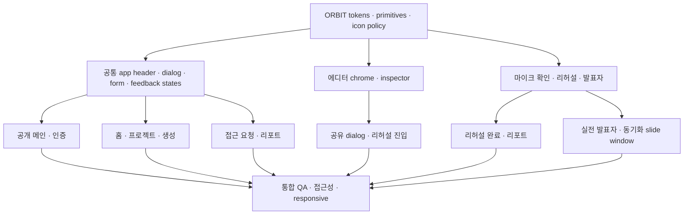

# ORBIT 디자인 시스템 및 UX/UI 현행 적용 계획

> 작성일: 2026-07-10  
> 대상: `apps/web`의 실제 사용자 화면  
> 디자인 기준: `docs/orbit-design-system.md`, `/design-system`, `/mockup/*`  
> 구현 기준: 실제 route, API hook, `packages/shared` schema, `docs/contracts.md`

## 1. 목적

현재 운영 코드의 기능과 데이터 계약을 유지하면서, 확정된 ORBIT 디자인 시스템과 목업 UX를 실제 화면에 단계적으로 적용한다.

이번 작업의 핵심은 목업을 그대로 복사하는 것이 아니라 다음 세 기준을 동시에 만족시키는 것이다.

1. 사용자는 `홈 → 프로젝트 → 편집 → 리허설/발표 → 리포트` 흐름을 짧고 일관되게 이동한다.
2. 실제 화면은 Ink, Lilac, Lime, Cream, Mint, Navy, Pretendard/Inter, Tabler icon, pill action이라는 현재 디자인 시스템을 사용한다.
3. Deck, Project, Job, Rehearsal, WebSocket, 권한 API의 기존 계약과 저장 동작은 바꾸지 않는다.

## 2. 적용 범위와 제외 범위

### 적용 범위

- 로그인 전 메인, 로그인, 회원가입
- 로그인 후 홈, 프로젝트 목록, AI 발표자료 생성
- 프로젝트 접근 요청·승인 대기
- 에디터 chrome, canvas 주변 UI, inspector, 공유 dialog
- 마이크 확인, 리허설, 발표자 화면, 리허설 완료
- 리포트 허브, 프로젝트 종합 리포트, 회차별 리포트
- 실전 발표자 화면, 동기화 slide window, 청중 입장 화면
- 공통 navigation, dialog, field, empty/loading/error state
- desktop 및 mobile/responsive 동작

### 제외 범위

- Deck JSON, File, Job, WebSocket payload 변경
- 새로운 OAuth, 비밀번호 재설정, 공개 링크 공유, PDF export API 구현
- 리허설 점수 산식 또는 신규 분석 지표 구현
- editor-core/Konva 편집 기능 재작성
- STT, 발표 동기화, 멀티 디스플레이 로직 재작성
- 목업 route를 실제 route로 redirect하거나 목업 component를 production component로 직접 재사용하는 방식

## 3. 조사 결과

### 3.1 현재 디자인 기준

현재 공식 source of truth는 다음 네 곳이다.

- `docs/orbit-design-system.md`
- `apps/web/src/design-system/tokens.ts`
- `apps/web/src/design-system/orbit-design-system.css`
- `apps/web/src/design-system/components.tsx`

`apps/web/src/main.tsx`는 이미 ORBIT 디자인 시스템 CSS를 전역으로 불러오고 있다. 따라서 새로운 전역 theme를 추가하기보다, 기존 화면의 자체 변수와 legacy selector를 화면 단위로 걷어내는 방식이 적절하다.

현재 primitive는 `OrbitButton`, `OrbitStatus`, `OrbitColorBlock` 중심이라서, 실제 화면 이전에 field, icon button, dialog, tabs, app header, empty state의 공통 규칙이 더 필요하다.

### 3.2 현행 화면의 구조적 차이

- 실제 로그인 화면은 중앙의 작은 card지만, 목업은 가치 제안과 form을 나눈 2열 구조다.
- 실제 product shell은 왼쪽 sidebar와 blue-gray active state를 사용하지만, 목업은 동일 높이의 상단 navigation과 흑백/Lilac 위계를 사용한다.
- 실제 프로젝트 목록은 template card와 project grid이며, 목업은 최근 작업 strip과 project table을 중심으로 한다.
- 실제 리포트 허브는 프로젝트별 최신 리허설로 진입하는 목록이고, 목업 `/mockup/reports`는 한 프로젝트의 회차 목록에 가깝다.
- 실제 editor와 rehearsal은 저장, 권한, STT, multi-window, 발표 동기화처럼 목업보다 훨씬 많은 상태를 가진다.
- `App.tsx`, `styles.css`, `EditorShell.tsx`, `RehearsalWorkspace.tsx`가 매우 크므로 한 번의 전면 교체는 회귀 위험이 높다.

### 3.3 그대로 적용하면 안 되는 목업 요소

| 목업 요소 | 현재 계약 | 적용 원칙 |
| --- | --- | --- |
| 리허설 종합 점수 `86` | `docs/contracts.md`는 프론트가 계약에 없는 0–100 점수를 공식 값처럼 계산하지 못하게 한다. | 공식 `metrics`, `coaching`, `aiSummary`, 시간/키워드/말버릇 지표로 대체한다. 점수 schema가 생길 때만 별도 계약 PR 후 표시한다. |
| Google 로그인/가입 | 현재 실제 인증은 email/password 흐름이다. | 시각 shell만 적용하고 Google action은 OAuth 계약이 생길 때까지 노출하지 않는다. |
| 비밀번호 찾기 | 현재 API 계약이 없다. | action을 숨기거나 비활성 placeholder로 두지 않고, 기능 PR이 준비될 때 추가한다. |
| 권한이 포함된 링크 복사 | 현재 공유 API는 초대, 역할 변경, 요청 승인/거절, 권한 회수만 지원한다. | 기존 member/request 기능만 새 dialog에 연결한다. 링크 공유는 별도 backend 계약 후 추가한다. |
| PDF 저장 | 실제 report export 계약과 동작이 없다. | 이번 시각 마이그레이션에서 제외한다. |
| 청중 화면의 발표자 script/raw audio | 공개 금지 계약이다. | audience component에 전달하지 않고, 발표 slide와 허용된 session 상태만 사용한다. |

## 4. 기본 제품 결정

계획을 바로 실행할 수 있도록 다음을 기본안으로 둔다. 제품 결정이 바뀌면 해당 task 시작 전에만 조정한다.

1. `/`는 인증 전에는 공개 메인, 인증 후에는 workspace home을 보여준다.
2. `/login`과 `/signup`을 직접 접근 가능한 route로 두되 기존 email/password API를 공유한다.
3. `/project`는 전체 프로젝트 탐색 화면, `/`는 최근 작업과 빠른 시작 중심으로 역할을 분리한다.
4. `/reports`는 프로젝트별 리포트 허브, `/reports/:projectId`는 프로젝트 종합/회차 목록, `/rehearsal/:projectId/report/:runId`는 회차 상세로 정보 수준을 구분한다.
5. editor, rehearsal, presenter는 desktop 기능을 우선 보존한다. mobile은 생성·검토·발표 전환을 우선하고 정밀 편집은 제한된 layout으로 제공한다.
6. 목업 component는 시각 명세로만 사용한다. 실제 화면은 기존 hook과 API function을 유지하고 production markup에 디자인 시스템을 입힌다.

## 5. 실제 route와 목표 목업 매핑

| 실제 경로/상태 | 현재 구현 | 목표 시각 기준 | 적용 메모 |
| --- | --- | --- | --- |
| `/` 인증 전 | 현재는 auth 실패 시 `/login` 이동 | `/mockup` | public landing을 실제 route에 추가한다. |
| `/login` | `LoginPage` in `App.tsx` | `/mockup/login` | email/password 동작만 연결한다. |
| `/signup` | 현재 별도 route 없음, login 내부 mode | `/mockup/signup` | 같은 auth API와 validation을 재사용한다. |
| `/` 인증 후 | `HomePage` + `AppFrame` | `/mockup/home` | 최근 작업, primary CTA, project table, 빠른 시작을 적용한다. |
| `/project` | `ProjectListPage` | `/mockup/home`의 table pattern | 전체 프로젝트 검색/필터와 빈 상태를 제공한다. |
| `/createdeck` | `GenerateDeckView` | `/mockup/create` | 기존 upload, extract, job polling 계약을 유지한다. |
| `/project/:projectId/request` | `ProjectAccessRequestPage` | `/mockup/project-request` | 요청 전/대기/오류/승인 redirect를 모두 보존한다. |
| `/project/:projectId` | `EditorShell` | `/mockup/editor` | Google Slides형 2단 chrome과 3영역 layout을 적용한다. |
| editor 공유 dialog | `ShareAccessModal` | `/mockup/editor`의 공유 dialog | 실제 member/request API 범위만 제공한다. |
| `/rehearsal/:projectId` 진입 전 | `RehearsalPreflightScreen` | `/mockup/microphone-check` | prompt/granted/denied/unsupported 상태를 모두 구현한다. |
| `/rehearsal/:projectId` 진행 중 | `RehearsalWorkspace` | `/mockup/rehearsal` | STT, timer, keyword, upload 동작을 그대로 유지한다. |
| rehearsal presenter/slide window | `PresenterRemoteWindow`, `SingleScreenPresenter`, `PresentWindow` | `/mockup/presenter` | multi-window와 display permission 흐름을 유지한다. |
| rehearsal 완료 상태 | `RehearsalCompletionScreen` | `/mockup/rehearsal-complete` | 공식 지표만 요약하고 report 준비 상태와 연결한다. |
| `/reports` | `RehearsalReportListPage` | `/mockup/reports`의 shell | 행 단위는 회차가 아니라 프로젝트다. |
| `/reports/:projectId` | `RehearsalProjectOverviewPage` | `/mockup/report-project` | 종합 요약과 회차 목록을 실제 summary schema에 맞춘다. |
| `/rehearsal/:projectId/report/:runId` | `RehearsalReportPage` | `/mockup/report` | 공식 report data만 렌더링한다. |
| `/presentation/:projectId` | `PresentationWorkspace` | `/mockup/live-presenter` | 현재 deck/timer/step navigation을 유지한다. 목업의 청중 수·질문은 실제 session 계약 전까지 제외한다. |
| `/present/:deckId` | `PresentWindow` | `/mockup/live` | BroadcastChannel 기반 slide window에 최소 chrome과 slide focus를 적용한다. |
| `/audience/:sessionId` | `AudienceSessionPage`, `AudienceEntrance` | 별도 목업 없음 | live palette와 auth field pattern으로 확장한다. |

## 6. 목표 구조와 의존성

### 구현 원칙

- API/hook/controller는 유지하고 view와 scoped style을 교체한다.
- 새 primitive는 `apps/web/src/design-system/index.ts`를 통해서만 import한다.
- 한 화면 안에서 Lucide와 Tabler를 혼용하지 않는다. 화면을 이전할 때 해당 화면의 icon을 함께 Tabler로 교체한다.
- `styles.css`에 새 화면 CSS를 계속 누적하지 않는다. 이전하는 화면은 가능한 한 feature-scoped stylesheet로 분리한다.
- dialog는 focus trap, `Escape`, 첫 focus, 닫힌 후 trigger focus 복귀를 갖춘다.
- loading, empty, error, disabled, permission denied까지 디자인 완료 상태로 간주한다.
- 목업의 demo copy와 숫자를 production fallback으로 사용하지 않는다.

## 7. 단계별 실행 계획

각 task는 5개 이하 파일을 직접 변경하는 크기로 제한한다. 큰 component는 behavior를 한 번에 옮기지 않고 view seam을 만든 뒤 단계적으로 스타일을 적용한다.

### Phase 0 — 계약과 QA 기준 고정

#### T0. 마이그레이션 기준선 고정 — S

- 설명: 실제 route, 목업 route, 계약 예외, desktop/mobile 기준을 QA checklist로 고정한다.
- 완료 기준:
  1. route별 정상/빈/오류/권한 상태가 표로 정리돼 있다.
  2. 점수, OAuth, 링크 공유 등 mock-only 기능이 implementation scope에서 분리돼 있다.
  3. 화면 비교 viewport가 desktop `1440×1024`, editor review `1984×1324`, mobile `390×844`로 고정돼 있다.
- 검증: 문서 review, `docs/contracts.md`와 대조.
- 선행 조건: 없음.
- 예상 파일: `docs/orbit-ui-migration-plan.md`, `design-qa.md`.

#### T1. production primitive 보강 — M

- 설명: 실제 화면에 반복되는 icon button, field, dialog shell, tabs, empty state를 ORBIT primitive로 추가한다.
- 완료 기준:
  1. control height, radius, focus ring, disabled/error state가 token으로 통일된다.
  2. dialog와 tabs가 keyboard/ARIA 요구사항을 만족한다.
  3. `/design-system`에서 모든 상태를 확인할 수 있다.
- 검증: primitive unit test, keyboard test, `/design-system` browser review.
- 선행 조건: T0.
- 예상 파일: `apps/web/src/design-system/components.tsx`, `apps/web/src/design-system/components.test.tsx`, `apps/web/src/design-system/orbit-design-system.css`, `apps/web/src/design-system/OrbitDesignSystemPage.tsx`, `docs/orbit-design-system.md`.

#### T2. 공통 product header와 page container 적용 — M

- 설명: 왼쪽 sidebar 기반 `AppFrame`을 목업의 상단 navigation과 1280px content rhythm으로 교체한다.
- 완료 기준:
  1. `홈 → 프로젝트 → 리허설 → 리포트`가 route마다 같은 위치와 active state를 가진다.
  2. 사용자 menu, logout, mobile compact navigation이 동작한다.
  3. route content와 navigation이 겹치거나 수평 overflow를 만들지 않는다.
- 검증: `App.test.tsx`, 실제 `/`, `/project`, `/reports`, `/createdeck` browser smoke.
- 선행 조건: T1.
- 예상 파일: `apps/web/src/App.tsx`, `apps/web/src/components/AppSidebar.tsx`, 신규 `apps/web/src/components/OrbitAppHeader.tsx`, `apps/web/src/styles.css`, `apps/web/src/App.test.tsx`.

**Checkpoint A:** 공통 token, focus, navigation, responsive shell을 사람 눈으로 review한 뒤 개별 화면 이전을 시작한다.

### Phase 1 — 공개 화면과 핵심 생성 흐름

#### T3. 공개 메인·로그인·회원가입 vertical slice — M

- 설명: auth 상태에 따라 `/`의 public/workspace 화면을 분기하고, login/signup에 목업의 2열 shell을 적용한다.
- 완료 기준:
  1. email/password login/register 성공·오류·제출 중 상태가 유지된다.
  2. mobile에서는 form이 첫 화면에 오고 가치 제안 영역이 축약된다.
  3. 미지원 Google/password-reset action은 노출되지 않는다.
- 검증: auth component test, `/`, `/login`, `/signup` desktop/mobile browser test.
- 선행 조건: T2.
- 예상 파일: `apps/web/src/App.tsx`, 신규 `apps/web/src/features/auth/OrbitAuthPage.tsx`, 신규 `apps/web/src/features/auth/orbit-auth-page.css`, `apps/web/src/App.test.tsx`.

#### T4. 로그인 후 홈·프로젝트 탐색 vertical slice — M

- 설명: `/`는 최근 작업과 빠른 시작, `/project`는 전체 검색/필터 table로 분리한다.
- 완료 기준:
  1. `AI 발표자료 만들기`가 화면당 단일 primary action이다.
  2. 실제 project query의 loading/empty/error/data 상태가 같은 table shell 안에서 표현된다.
  3. row의 편집, 리허설, 더보기 action이 행 이동과 충돌하지 않는다.
- 검증: project query mock unit test, route/browser interaction, mobile 핵심 열 우선순위 확인.
- 선행 조건: T2.
- 예상 파일: `apps/web/src/App.tsx`, 신규 `apps/web/src/features/projects/orbit-project-hub.css`, `apps/web/src/App.test.tsx`.

#### T5. AI 발표자료 생성 vertical slice — M

- 설명: 기존 `GenerateDeckView`의 upload/extract/job 흐름을 목업의 `입력 → 구성 확인 → 생성` 구조로 재배치한다.
- 완료 기준:
  1. 기존 payload, reference role, job polling, validation 동작이 바뀌지 않는다.
  2. 최종 primary action은 상태별로 하나만 존재한다.
  3. 실패·재시도·진행률·완료 후 editor 이동이 시각적으로 구분된다.
- 검증: 기존 `App.test.tsx` generation test 전체, 생성 E2E smoke, desktop/mobile overflow 확인.
- 선행 조건: T1, T2.
- 예상 파일: `apps/web/src/App.tsx`, 신규 `apps/web/src/features/projects/orbit-create-deck.css`, `apps/web/src/App.test.tsx`.

**Checkpoint B:** public → auth → home → create → editor 진입을 demo ID 기준 E2E로 통과시킨다.

### Phase 2 — 권한과 리포트 정보 구조

#### T6. 프로젝트 접근 요청·승인 대기 vertical slice — S

- 설명: 실제 접근 요청/대기/오류 상태에 `/mockup/project-request`의 2열 맥락을 적용한다.
- 완료 기준:
  1. `editor`/`viewer`는 native radiogroup으로 한 개만 선택된다.
  2. 미선택 표시는 회색 테두리 빈 원, 선택 시에만 브랜드 채움과 check를 사용한다.
  3. pending 상태에서 현재 지원되는 재확인과 프로젝트 목록 복귀가 명확하다. 요청 취소는 API 계약 전까지 추가하지 않는다.
- 검증: request submit/pending/accepted redirect unit test, keyboard radio test.
- 선행 조건: T1, T2.
- 예상 파일: `apps/web/src/App.tsx`, 신규 `apps/web/src/features/projects/orbit-project-access.css`, `apps/web/src/App.test.tsx`.

#### T7. 전역 리포트 허브 vertical slice — S

- 설명: `/reports`를 project 단위 진입점으로 유지하면서 목업의 navigation, summary, table 위계를 적용한다.
- 완료 기준:
  1. 각 행은 `/reports/:projectId`로 이동하며 회차 상세와 구분된다.
  2. loading/empty/error가 실제 fetch 결과로 표시된다.
  3. 공식 score가 없는 상태에서 가짜 score를 표시하지 않는다.
- 검증: report project aggregation test, empty/data browser test.
- 선행 조건: T2.
- 예상 파일: `apps/web/src/features/rehearsal/RehearsalReportListPage.tsx`, 신규 `apps/web/src/features/rehearsal/rehearsal-report-list.css`, 신규 `apps/web/src/features/rehearsal/RehearsalReportListPage.test.tsx`.

#### T8. 프로젝트 종합 리포트 vertical slice — M

- 설명: `/reports/:projectId`에 프로젝트 맥락, 공식 summary, 회차 추세, 회차 목록을 목업 순서로 배치한다.
- 완료 기준:
  1. 0회/1회/2회 이상 데이터에서 각각 적절한 정보 구조를 보인다.
  2. trend는 `RehearsalProjectSummary`의 실제 값만 사용한다.
  3. 회차 행은 `/rehearsal/:projectId/report/:runId`로 이동한다.
- 검증: summary fixture test, 0/1/multiple run browser test.
- 선행 조건: T7.
- 예상 파일: `apps/web/src/features/rehearsal/RehearsalProjectOverviewPage.tsx`, `apps/web/src/features/rehearsal/RehearsalRunNav.tsx`, `apps/web/src/features/rehearsal/ReportProgressCharts.tsx`, 신규 `apps/web/src/features/rehearsal/rehearsal-project-report.css`, 신규 `apps/web/src/features/rehearsal/RehearsalProjectOverviewPage.test.tsx`.

#### T9. 회차별 리포트 vertical slice — M

- 설명: 실제 `RehearsalReport`의 총평, metrics, slide analysis, 기록을 `/mockup/report`의 정보 위계로 재배치한다.
- 완료 기준:
  1. 공식 report field만 표시하고 frontend derived score를 만들지 않는다.
  2. `transcript_retained=false`일 때 transcript를 노출하지 않는다.
  3. 다음 연습 목표와 `다시 리허설`이 마지막 primary flow로 연결된다.
- 검증: 기존 report document/workspace test, `/report_mockup` browser review, retained transcript 경계 test.
- 선행 조건: T8.
- 예상 파일: `apps/web/src/features/rehearsal/RehearsalWorkspace.tsx`, `apps/web/src/features/rehearsal/RehearsalReportDocument.tsx`, 신규 `apps/web/src/features/rehearsal/rehearsal-report-detail.css`, `apps/web/src/features/rehearsal/RehearsalWorkspace.test.tsx`, `apps/web/src/features/rehearsal/RehearsalReportDocument.test.tsx`.

**Checkpoint C:** 리포트의 모든 숫자를 shared schema와 API response에 역추적하고, 가짜 score·demo copy·금지 데이터가 없는지 review한다.

### Phase 3 — 에디터

#### T10. editor document chrome vertical slice — L

- 설명: editor의 저장/undo/redo/menu/공유/리허설/발표 동작을 유지하면서 Google Slides형 2단 chrome을 적용한다.
- 완료 기준:
  1. 제목, 저장 상태, 메뉴, 문서 action이 첫 행에 정렬된다.
  2. 선택/텍스트/이미지/차트/레이아웃 도구가 neutral tool dock에 모인다.
  3. autosave, manual save, undo/redo, exit warning 동작이 유지된다.
- 검증: `EditorShell.test.tsx`, editor E2E, `1984×1324` visual comparison.
- 선행 조건: T1.
- 예상 파일: `apps/web/src/features/editor/shell/EditorShell.tsx`, 신규 `apps/web/src/features/editor/shell/components/EditorChrome.tsx`, `apps/web/src/features/editor/editor-shell.css`, `apps/web/src/features/editor/shell/EditorShell.test.tsx`.

#### T11. editor 3영역·inspector vertical slice — L

- 설명: slide rail, Konva canvas, AI/design/notes inspector의 기존 기능을 목업의 3영역 hierarchy에 맞춘다.
- 완료 기준:
  1. canvas가 가장 강한 focal point이고 rail/inspector는 보조 위계를 가진다.
  2. AI 제안 적용, design 편집, notes 저장이 기존 state와 API를 사용한다.
  3. dense UI text 하한과 mobile review-first layout을 지킨다.
- 검증: editor rendering/suggestion/notes test, desktop/mobile browser interaction.
- 선행 조건: T10.
- 예상 파일: `apps/web/src/features/editor/shell/EditorShell.tsx`, `apps/web/src/features/editor/suggestions/components/SuggestionPanel.tsx`, `apps/web/src/features/editor/editor-shell.css`, `apps/web/src/features/editor/shell/EditorShell.test.tsx`.

#### T12. 실제 공유 dialog vertical slice — M

- 설명: 공유 dialog를 목업처럼 정리하되 현재 member/request API만 연결한다.
- 완료 기준:
  1. 초대, role 변경, 권한 회수, 요청 승인/거절이 기존 API로 동작한다.
  2. owner만 관리할 수 있고 loading/error/success가 dialog 안에서 전달된다.
  3. link copy UI는 backend 계약 전까지 존재하지 않는다.
- 검증: modal keyboard test, hook API test, editor share smoke.
- 선행 조건: T1, T10.
- 예상 파일: `apps/web/src/features/editor/shell/components/ShareAccessModal.tsx`, `apps/web/src/features/editor/shell/hooks/useProjectShareAccess.ts`, `apps/web/src/features/editor/editor-shell.css`, 신규 `apps/web/src/features/editor/shell/components/ShareAccessModal.test.tsx`.

**Checkpoint D:** editor의 저장·편집·공유·리허설·발표 진입을 실제 API stub과 함께 회귀 검사한다. 이 시점까지 editor-core와 shared schema 변경은 없어야 한다.

### Phase 4 — 마이크, 리허설, 발표자

#### T13. 마이크 확인 vertical slice — M

- 설명: 기존 `RehearsalPreflightScreen`을 목업의 권한→장치→음량 점검 순서로 재구성한다.
- 완료 기준:
  1. prompt, granted, denied, unsupported 상태별 안내와 다음 action이 다르다.
  2. microphone permission은 사용자 click에서만 요청한다.
  3. 장치 선택과 level meter가 실제 media state를 반영한다.
- 검증: permission state unit test, browser permission 수동 test, mobile layout test.
- 선행 조건: T1.
- 예상 파일: `apps/web/src/features/rehearsal/RehearsalWorkspace.tsx`, 신규 `apps/web/src/features/rehearsal/rehearsal-preflight.css`, `apps/web/src/features/rehearsal/RehearsalWorkspace.test.tsx`.

#### T14. 리허설 진행·완료 vertical slice — L

- 설명: active rehearsal을 slide+script+AI coach 구조로 만들고 완료 상태를 공식 report 준비 흐름과 연결한다.
- 완료 기준:
  1. timer, recording, live STT, keyword, auto-advance, upload/job 동작이 유지된다.
  2. primary action은 진행 상태에 따라 시작/일시정지/완료 중 하나만 강조된다.
  3. 완료 화면은 공식 시간·키워드·말하기 지표와 report 준비 상태만 표시한다.
- 검증: 기존 rehearsal test 전체, 녹음→upload→job→report route E2E, denied/error state review.
- 선행 조건: T13.
- 예상 파일: `apps/web/src/features/rehearsal/RehearsalWorkspace.tsx`, `apps/web/src/features/rehearsal/panel/RehearsalPanel.tsx`, `apps/web/src/features/presenter-shell/PresenterScaffold.tsx`, 신규 `apps/web/src/features/rehearsal/rehearsal-workspace-orbit.css`, `apps/web/src/features/rehearsal/RehearsalWorkspace.test.tsx`.

#### T15. 화면 설정·발표자·슬라이드쇼 vertical slice — L

- 설명: 현재 multi-display 기능을 목업의 `발표자 모드/슬라이드쇼 화면` 선택 panel과 dark presenter shell에 연결한다.
- 완료 기준:
  1. radiogroup 선택, Window Management permission, popup fallback이 유지된다.
  2. presenter는 현재/다음 slide, notes, timer, controls를 유지한다.
  3. dark surface에서는 `orbit-logo-white.png`를 container 없이 사용하고 slide theme foreground를 침범하지 않는다.
- 검증: DisplayControls/Presenter test, multi-window browser smoke, dark/light slide contrast review.
- 선행 조건: T14.
- 예상 파일: `apps/web/src/features/rehearsal/presenter/DisplayControls.tsx`, `apps/web/src/features/rehearsal/presenter/PresenterRemoteWindow.tsx`, `apps/web/src/features/rehearsal/presenter/SingleScreenPresenter.tsx`, `apps/web/src/features/rehearsal/rehearsal-workspace-orbit.css`, `apps/web/src/features/rehearsal/presenter/DisplayControls.test.tsx`.

**Checkpoint E:** microphone permission, recording, multi-window, fullscreen은 실제 Chromium 환경에서 사람 검증을 거친다. 자동 test만으로 완료 처리하지 않는다.

### Phase 5 — 실전 발표와 청중

#### T16. 실전 발표자 vertical slice — L

- 설명: `PresentationWorkspace`와 `PresentationScreen`에 live presenter 목업의 시각 언어를 적용한다.
- 완료 기준:
  1. 발표자 화면의 deck loading, timer, slide/step navigation, keyboard, exit 동작이 유지된다.
  2. 현재 slide, 다음 slide, notes, timer가 dark presenter shell 안에서 glanceable하게 보인다.
  3. 청중 수, 질문, 발언 요청, 기록 저장은 실제 presentation session 계약 전까지 가짜 상태로 추가하지 않는다.
- 검증: `PresentationWorkspace.test.tsx`, presenter screen E2E, timer/navigation/exit browser test.
- 선행 조건: T15.
- 예상 파일: `apps/web/src/features/presentation/PresentationWorkspace.tsx`, `apps/web/src/features/presentation/PresentationScreen.tsx`, 신규 `apps/web/src/features/presentation/orbit-live-presentation.css`, `apps/web/src/features/presentation/PresentationWorkspace.test.tsx`.

#### T17. 동기화 slide window vertical slice — M

- 설명: `/present/:deckId`의 BroadcastChannel slide window에 live screen 목업의 최소 chrome과 dark surface를 적용한다.
- 완료 기준:
  1. session identity, heartbeat, reconnect, stale presenter 상태가 유지된다.
  2. 정상 연결 시 slide가 최우선이고 조작 chrome은 fallback 상황에서만 드러난다.
  3. 연결 전/실패/재연결 상태가 slide와 혼동되지 않는다.
- 검증: `PresentWindow.test.tsx`, slide-window E2E, reconnect/fullscreen browser test.
- 선행 조건: T15.
- 예상 파일: `apps/web/src/features/rehearsal/presenter/PresentWindow.tsx`, `apps/web/src/features/presentation/orbit-live-presentation.css`, `apps/web/src/features/rehearsal/presenter/PresentWindow.test.tsx`.

#### T18. 청중 입장 화면 vertical slice — M

- 설명: 별도 목업이 없는 audience entrance를 ORBIT live palette와 form primitive로 정리한다.
- 완료 기준:
  1. passcode 확인, room 선택, loading/error/verified 상태가 기존 API와 일치한다.
  2. 발표자 script, transcript, raw audio가 DOM이나 response mapping에 포함되지 않는다.
  3. mobile portrait에서 keyboard가 열린 상태에도 primary action이 접근 가능하다.
- 검증: audience API/component test, `/audience/:sessionId` mobile browser test, 금지 데이터 source review.
- 선행 조건: T1, T16.
- 예상 파일: `apps/web/src/features/audience/AudienceEntrance.tsx`, `apps/web/src/features/audience/audience.css`, `apps/web/src/pages/audience/AudienceSessionPage.tsx`, 신규 `apps/web/src/features/audience/AudienceEntrance.test.tsx`.

### Phase 6 — 정리와 점진 rollout

#### T19. legacy shell·CSS 정리 및 최종 rollout — M

- 설명: 모든 route 이전 후 사용되지 않는 sidebar/auth legacy markup과 중복 semantic variable을 제거한다.
- 완료 기준:
  1. production component가 mockup component/CSS를 import하지 않는다.
  2. 이전된 화면에 ORBIT token과 충돌하는 로컬 color/font/radius 선언이 남지 않는다.
  3. 전체 test/build/smoke와 design QA가 통과한다.
- 검증: `rg` dependency check, `pnpm typecheck`, `pnpm lint`, `pnpm test`, `pnpm build`, `pnpm test:smoke`, `git diff --check`.
- 선행 조건: T3–T18.
- 예상 파일: `apps/web/src/App.tsx`, `apps/web/src/components/AppSidebar.tsx`, `apps/web/src/features/auth/AuthPanel.tsx`, `apps/web/src/styles.css`, `design-qa.md`.

**Final Checkpoint:** product/design/engineering이 route별 desktop/mobile 비교와 핵심 E2E를 함께 확인한 뒤 legacy selector 제거 PR을 병합한다.

## 8. PR 분리 전략

한 개의 대형 PR 대신 다음 순서의 작은 PR을 권장한다.

1. `feature/orbit-ui-foundation`: T1–T2
2. `feature/orbit-ui-entry-flow`: T3–T5
3. `feature/orbit-ui-access-reports`: T6–T9
4. `feature/orbit-ui-editor`: T10–T12
5. `feature/orbit-ui-rehearsal`: T13–T15
6. `feature/orbit-ui-live`: T16–T18
7. `chore/orbit-ui-legacy-cleanup`: T19

각 PR은 시각 변경과 기능 확장을 섞지 않는다. shared schema나 API가 필요해지는 mock-only 기능은 별도 계약 PR로 먼저 처리한다.

## 9. 검증 매트릭스

### 자동 검증

- route parsing과 auth 분기: `apps/web/src/App.test.tsx`
- 생성 payload/job polling: 기존 home generation test
- editor 저장/undo/notes/share: `EditorShell.test.tsx` 및 dialog test
- microphone/STT/upload/report: `RehearsalWorkspace.test.tsx`
- display/window: presenter component test
- report contract: report document/project overview test
- live/audience: presentation/audience component test
- 전체: `pnpm typecheck`, `pnpm lint`, `pnpm test`, `pnpm build`, `pnpm test:smoke`

### 브라우저 검증

| 영역 | 필수 상태 |
| --- | --- |
| auth | login/signup, invalid input, server error, submitting, mobile keyboard |
| home/project | loading, empty, error, data, search/filter, row action |
| create | input, review, job running, failed, succeeded |
| access | request, pending, accepted redirect, fetch error |
| editor | save states, undo/redo, panel tabs, share dialog, exit warning, mobile review layout |
| microphone | prompt, granted, denied, unsupported, no input, active input |
| rehearsal | idle, recording, paused, STT error, upload/job progress, completed |
| presenter | single screen, presenter window, slide window, permission denied, fullscreen |
| reports | no run, one run, multiple runs, report loading/failed/ready |
| live | loading, ready, timer running/paused, slide step navigation, exit |
| slide window | waiting, connected, stale presenter, reconnecting, fullscreen |
| audience | passcode error, verified, room selection, disconnected |

### 접근성 기준

- 실제 조작 text는 12px 미만으로 사용하지 않는다.
- 모든 icon-only button에 `aria-label`을 제공한다.
- tab/radio/dialog/menu는 keyboard로 완결 가능해야 한다.
- focus ring은 제거하지 않는다.
- color만으로 selected/error/success를 전달하지 않는다.
- `prefers-reduced-motion`에서 불필요한 transition을 줄인다.
- dark presenter와 slide theme의 대비를 각각 검증한다.

## 10. 위험과 완화책

| 위험 | 영향 | 완화 |
| --- | --- | --- |
| 거대한 `App.tsx`/`styles.css`에서 selector 충돌 | 다른 route의 시각 회귀 | route root class와 feature-scoped CSS로 이전하고, global selector 추가를 금지한다. |
| editor/rehearsal markup 변경 중 behavior 회귀 | 저장, STT, multi-window 손상 | hook/controller를 유지하고 view seam 단위로 교체한다. 각 단계 후 기존 test를 전부 실행한다. |
| 목업 demo data가 실제 값처럼 노출 | 신뢰/계약 위반 | production은 query/API 값만 사용하고 demo fallback을 금지한다. |
| mock score를 공식 지표처럼 표시 | report contract 위반 | score 영역을 공식 metric summary로 대체하고 별도 계약 없이는 0–100을 표시하지 않는다. |
| icon package 혼용 | 통일성 저하, bundle 증가 | 화면 단위로 Tabler 전환하고 최종 cleanup에서 Lucide 잔존을 점검한다. |
| mobile editor에 desktop 기능을 그대로 압축 | 사용성/overflow 문제 | 검토·발표 우선 mobile policy와 sheet형 inspector를 사용한다. |
| browser permission/multi-window 자동 test 한계 | 실제 환경에서만 실패 | Chromium 수동 checkpoint를 병합 조건으로 둔다. |
| 기존 large bundle warning 악화 | 초기 로딩 저하 | PR마다 build output을 비교하고 큰 screen/icon import는 route lazy loading을 유지한다. |

## 11. 병렬화 가능한 작업

- T3 auth와 T6 access는 T1/T2 이후 서로 다른 화면 범위에서 병렬 진행 가능하다.
- T7–T9 report는 editor 작업 T10–T12와 병렬 진행 가능하다.
- T17 slide window와 T18 audience는 T16의 live visual language가 정해진 뒤 서로 병렬 진행 가능하다.
- T13–T15는 같은 `RehearsalWorkspace.tsx`와 CSS를 공유하므로 순차 진행한다.
- T10–T12는 같은 editor 파일을 공유하므로 순차 진행한다.

## 12. 완료 정의

한 화면의 마이그레이션은 다음을 모두 만족해야 완료다.

1. 목업의 시각 hierarchy와 핵심 이동 흐름을 실제 데이터로 구현했다.
2. 기존 API, state, keyboard, 권한, 저장 동작이 회귀하지 않았다.
3. loading/empty/error/disabled/permission denied가 설계돼 있다.
4. desktop/mobile에서 clipping과 global horizontal overflow가 없다.
5. 접근성 이름, focus, keyboard 동작을 검증했다.
6. mock-only 기능이나 demo 숫자를 production에 노출하지 않았다.
7. 해당 범위 test, typecheck, browser smoke, visual review를 통과했다.
8. 공통 규칙이 바뀌었다면 `docs/orbit-design-system.md`, token, CSS, component를 함께 갱신했다.

## 13. 구현 전 결정 확인 항목

아래 항목은 기본안을 이미 정했지만, 해당 task 착수 전에 product owner 확인이 필요하다.

| 항목 | 권장 기본안 | 결정 시점 |
| --- | --- | --- |
| 인증 전 `/`의 역할 | public landing을 표시하고 로그인 CTA로 연결 | T3 시작 전 |
| 회원가입 URL | `/signup` direct route를 추가하고 기존 register API 재사용 | T3 시작 전 |
| 리허설 0–100 점수 | 공식 schema가 생길 때까지 표시하지 않고 실제 metric summary로 대체 | T7 시작 전 |
| 링크 공유 | 기존 member/request 기능만 제공하고 public link는 제외 | T12 시작 전 |
| live 청중 수·질문·발언 요청 | 실제 presentation session API/WebSocket 계약 전에는 제외 | T16 시작 전 |
| mobile editor | 정밀 편집보다 검토, 메모, 리허설, 발표 진입을 우선 | T11 시작 전 |

## 14. 시작 권장 순서

첫 구현은 T1 `production primitive 보강`과 T2 `공통 product header`로 시작한다. 이 두 task가 끝나면 public/auth/home을 먼저 이전해 제품의 첫인상과 navigation을 안정시키고, 그 다음 report와 editor, 마지막으로 permission과 multi-window 의존성이 큰 rehearsal/live 화면을 옮긴다.

이 순서는 사용자에게 가장 빨리 일관된 경험을 제공하면서, 기능 회귀 위험이 큰 화면을 충분한 기반과 test 위에서 다루기 위한 것이다.
