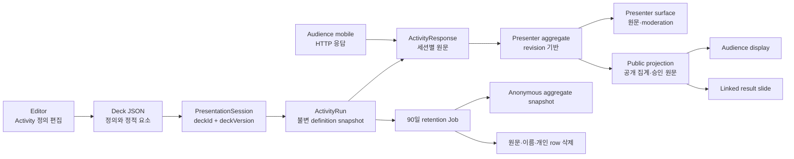

# 참여 장표 MVP 구현 계획

## 문서 상태

- 상태: 구현 준비 완료
- 작성일: 2026-07-17
- 기준 브랜치: `develop`
- 통합 브랜치: `feature/activity-slides-integration`
- 구현 범위: `docs/ideas/activity-slides.md`의 MVP 전체
- 기능 기준: `docs/ideas/activity-slides.md`
- 공통 계약 기준: `docs/contracts.md`, `packages/shared`
- 운영 디자인 기준: `docs/orbit-design-system.md`, `apps/web/src/design-system`
- 화면 흐름 참고: `prototypes/activity-slide-canvas-first`의 로컬 프로토타입과 `design-qa.md`

이 문서는 제품 의도를 실제 ORBIT 운영 코드로 옮기기 위한 실행 계획이다. 프로토타입은 화면 상태, 정보 위계, 상호작용 순서와 검수 기준만 제공하며 빌드, 런타임, 라우팅, API, 상태 관리의 의존성이 되어서는 안 된다.

## 1. 목표와 완료 정의

발표자는 에디터에서 일반 슬라이드처럼 사전 질문, 실시간 투표, 만족도 조사와 연결된 결과 장표를 추가하고 설정할 수 있어야 한다. 발표 세션을 열면 청중은 모바일에서 응답하고, 발표자는 별도 역할 화면에서 상태를 제어하고 결과를 확인한다. 청중 발표 화면에는 공개가 허용된 정보만 나타나야 한다.

다음 조건을 모두 충족해야 MVP가 완료된 것으로 본다.

- 에디터에서 네 종류의 장표를 추가하고 저장·복원할 수 있다.
- 참여 장표가 포함된 덱은 16:9 캔버스를 강제하고 편집·청중·발표자 미리보기 모두 같은 비율을 유지한다.
- `pre-question`, `poll`, `satisfaction` 정의는 Deck에, 응답은 PresentationSession의 Activity Run에 분리 저장한다.
- 같은 덱의 서로 다른 PresentationSession 응답이 섞이지 않는다.
- 청중은 세션에 한 번 입장한 뒤 장표별 직접 링크와 활성 장표 자동 전환을 사용할 수 있다.
- `draft`, `open`, `closed`, `results` 상태 전이가 서버에서 검증된다.
- 첫 응답 이후 Activity Run의 정의 snapshot은 변경되지 않고, 의미 변경은 명시적인 새 run version을 만든다.
- 발표자 화면과 독립 결과 페이지에서 실시간 집계와 주관식 moderation을 수행할 수 있다.
- 결과 장표는 원본 응답을 복제하지 않고 `sourceActivityId`로 한 참여 장표만 참조한다.
- 청중 API, WebSocket payload, DOM, 로그에 선택 이름, 미승인 주관식, 발표자 노트, 발표자 script가 나타나지 않는다.
- 200명 동시 응답에서 커밋부터 발표자 집계 렌더링까지 p95 2초 이내를 만족한다.
- 발표 종료 90일 후 개인 응답과 식별 가능 원문은 삭제되고 익명 집계 snapshot만 남는다.
- 선택한 PresentationSession이 없는 export는 live QR과 실제 결과를 포함하지 않는다.
- 관련 shared, editor-core, API, web, worker 테스트와 migration `run -> revert -> run` 검증을 통과한다.

## 2. 현재 저장소 기준선

새 기능은 이미 구현된 다음 기반을 확장한다.

| 기반 | 현재 위치 | 구현 시 처리 |
| --- | --- | --- |
| Deck 원본 계약 | `packages/shared/src/deck/deck.schema.ts` | legacy slide를 `content`로 정규화하고 Activity discriminator를 추가한다. |
| Deck 변경 기록 | `packages/shared/src/deck/patch.schema.ts`, `packages/editor-core` | Activity 전용 patch와 참조 안전 복제 연산을 추가한다. |
| 발표 세션·청중 cookie | `apps/api/src/presentation-sessions` | 기존 signed cookie의 `audienceId`를 유지하면서 deck/version/access 기간을 연결한다. |
| 청중 입장 UI | `apps/web/src/features/audience` | 기존 passcode 입장을 재사용하고 참여 허브와 장표 직접 링크를 연결한다. |
| 청중 링크/QR | `apps/web/src/features/editor/audience-link` | 2시간 링크 UI를 14일 기본·30일 최대의 PresentationSession 관리로 확장한다. |
| 발표자·청중 창 분리 | `AudienceOutputRenderer.tsx`, `PresenterRemoteWindow.tsx` | 같은 slide를 역할별 Activity projection으로 렌더링한다. |
| 서버 실시간 채널 | `apps/api/src/realtime`, `packages/realtime` | project room과 분리된 presentation audience/presenter room을 추가한다. |
| 운영 디자인 시스템 | `docs/orbit-design-system.md`, `apps/web/src/design-system` | 신규 production 화면은 이 token과 primitive를 사용한다. |
| 정적 내보내기 | `apps/worker/src/deck-export.processor.ts` | Activity가 있는 덱은 generic static projection을 거쳐 export한다. |

현재 `presentationSessionSchema`는 `deckId`를 요구하지만 실제 `presentation_sessions` 테이블과 audience access DTO에는 `deckId`와 `deckVersion`이 없다. 이 불일치는 응답 기능을 시작하기 전에 먼저 해소한다.

프로젝트 권한에는 별도 `presenter` 역할이 없다. MVP의 발표 운영·moderation 권한은 `owner | editor`, 원문 결과 열람도 `owner | editor`, 결과 영구 삭제는 `owner`로 확정한다. `viewer`는 원문 결과와 운영 명령에 접근할 수 없다.

## 3. 확정 아키텍처 결정

| ID | 결정 | 구현 이유 |
| --- | --- | --- |
| D1 | Deck에는 Activity 정의만, DB에는 세션별 실행과 응답만 저장한다. | 덱 복제와 반복 발표에서 결과가 섞이거나 복사되는 문제를 막는다. |
| D2 | Activity가 하나라도 있는 Deck은 `wide-16-9`만 허용한다. | 사용자가 확정한 편집 장표 16:9 조건을 계약, UI, export에서 동일하게 보장한다. |
| D3 | legacy slide는 parse 시 `kind: "content"`로 정규화한다. | 기존 Deck JSON과 snapshot을 깨지 않는다. |
| D4 | `slide.elements`는 사용자가 만든 정적 요소만 보관한다. QR, 참여 인원, 상태, 집계는 역할별 system layer가 렌더링한다. | runtime 데이터를 Deck에 역직렬화하거나 patch history에 복제하지 않는다. |
| D5 | `activity`, `activity-results` 장표는 일반 element 추가·선택·이동·애니메이션을 허용하지 않는 시스템 관리 장표다. 문항, 운영 상태, 원본 연결은 전용 `장표 설정`에서만 변경한다. | 역할별 렌더링과 Deck 정의의 소유권을 명확히 하고 빈 요소나 숨은 편집 결과가 생기는 것을 막는다. |
| D6 | 세션 생성은 항상 서버의 현재 Deck과 version을 조회해 연결한다. 클라이언트가 보낸 definition이나 deckVersion을 신뢰하지 않는다. | snapshot과 결과의 출처를 서버에서 검증한다. |
| D7 | `GET current`는 진행 중 세션 재접속, `POST`는 명시적 새 세션 생성이다. 새 세션 생성은 기존 활성 세션을 원자적으로 닫고 빈 결과로 시작한다. | 새 발표와 재접속의 의미를 API 수준에서 분리한다. |
| D8 | 한 PresentationSession에는 응답 가능한 `open` Activity Run이 최대 하나다. 새 run을 열면 이전 `open` run을 닫고 `activeActivityRunId`를 교체한다. | 청중 자동 전환의 단일 source of truth를 만든다. |
| D9 | 응답 쓰기는 HTTP transaction, WebSocket은 commit 후 상태·revision 알림에만 사용한다. | 재시도, 검증, 권한, idempotency를 보장하고 WebSocket 유실 시 HTTP refetch로 복구한다. |
| D10 | 발표자 DTO와 청중 DTO를 별도 Zod schema로 정의한다. 하나의 큰 DTO에서 민감 필드를 조건부로 제거하지 않는다. | 실수로 원문이나 이름이 청중 경계로 전달되는 것을 구조적으로 막는다. |
| D11 | Activity Run `version`은 정의 세대, `revision`은 상태·응답·moderation 변경 순서다. 클라이언트는 낮은 revision 이벤트를 무시하고 필요 시 refetch한다. | 동시 응답과 이벤트 역전에서 stale 집계를 방지한다. |
| D12 | 첫 응답 전에는 current run snapshot을 현재 Deck 정의에 동기화할 수 있다. 첫 응답 후에는 snapshot을 불변으로 유지하고 명시적 supersede만 허용한다. | 결과 해석을 바꾸지 않으면서 발표 전 수정은 허용한다. |
| D13 | 독립 결과 페이지 경로는 현재 저장소 관례에 맞춰 `/project/:projectId/presentation-sessions/:sessionId/results`로 확정한다. | 기존 `/project/:projectId` 라우팅과 권한 gate를 재사용한다. |
| D14 | 90일 보관 만료는 common Job과 Worker가 익명 집계 snapshot 생성과 원문 삭제를 한 transaction으로 처리한다. | 사용자 데이터 변경을 재시도 가능하고 관찰 가능한 작업으로 만든다. |
| D15 | Activity가 포함된 Deck은 imported OOXML package 직접 복사 경로를 사용하지 않는다. static export projection을 만든 뒤 generic exporter로 보낸다. | stale QR, 누락된 결과, live 데이터 포함을 막는다. |
| D16 | integration branch 자체가 미완성 기능의 격리 경계다. 부분 구현을 `develop`에 먼저 넣지 않는 한 별도 feature flag framework를 추가하지 않는다. | 사용되지 않는 flag와 이중 경로를 만들지 않는다. |

### 3.1 전체 데이터 흐름



## 4. 공통 계약

### 4.1 파일 배치

Deck과 presentation schema가 서로 import하는 순환을 피하기 위해 Activity 공통 계약은 새 중립 영역에 둔다.

```text
packages/shared/src/activity/
  activity-id.schema.ts
  activity-definition.schema.ts
  activity-runtime.schema.ts
  activity-api.schema.ts
  activity-results.schema.ts
```

`deck.schema.ts`는 definition만 import하고, `presentation.schema.ts`와 API schema는 runtime을 import한다. `packages/shared/src/index.ts`는 public export만 담당한다. 이 배치 원칙은 PR 1에서 `packages/shared/src/README.md`와 `docs/contracts.md`에 함께 기록한다.

### 4.2 ID와 입력 제한

| 필드 | 규칙 |
| --- | --- |
| `activityId` | `activity_` prefix, Deck 안에서 유일 |
| `questionId` | `question_` prefix, Activity 안에서 유일 |
| `optionId` | `option_` prefix, question 안에서 유일 |
| `activityRunId` | `activity_run_` prefix |
| `responseId` | `activity_response_` prefix |
| 제목 | trim 후 1~120자 |
| 설명 | 최대 500자 |
| 표시 이름 | 선택 입력, trim 후 1~40자, 이메일·전화번호 전용 필드 없음 |
| 주관식 답변 | 최대 2,000자, plain text로만 렌더링 |
| 선택지 | 2~8개, label 1~100자, 동일 question 내 label·ID 중복 금지 |
| 만족도 문항 | 1~5개 |
| 사전 질문 | `free-text` 1~5문항 |
| 실시간 투표 | `single-choice` 정확히 1문항 |
| 5점 척도 | 값 1~5, 양끝 label은 각각 최대 40자 |

API request schema는 `.strict()`를 사용하고, 선택지 답변은 label이 아니라 `optionId`를 저장한다. 주관식은 React text node로만 출력하고 `dangerouslySetInnerHTML`을 사용하지 않는다.

### 4.3 Slide 계약

```ts
type Slide =
  | ContentSlide
  | ActivitySlide
  | ActivityResultsSlide;

type ContentSlide = BaseSlide & {
  kind: "content";
};

type ActivitySlide = BaseSlide & {
  kind: "activity";
  activity: ActivityDefinition;
};

type ActivityResultsSlide = BaseSlide & {
  kind: "activity-results";
  activityResult: {
    sourceActivityId: string;
    display: "live";
    layout: "summary" | "chart" | "approved-text";
  };
};
```

검증 규칙은 다음과 같다.

- `kind`가 없는 legacy slide는 `content`로 정규화한다.
- `activity`와 `activity-results`가 있는 Deck은 `canvas.preset === "wide-16-9"`여야 한다.
- Activity ID는 Deck 안에서 유일해야 한다.
- 결과 장표에는 `sourceActivityId`가 정확히 하나만 존재한다.
- 원본 삭제 뒤 복구 안내를 제공해야 하므로 dangling `sourceActivityId` 자체는 Deck parse에서 허용한다. renderer와 editor validation이 `source-missing` 상태를 명시적으로 표시한다.
- 결과 데이터, QR data URL, audience URL, response count는 Deck JSON에 저장하지 않는다.

추가할 patch operation은 다음과 같다.

- `update_activity_definition`
- `update_activity_result_definition`

일반 `update_slide`나 `update_element_props`에 Activity 전체 객체를 넣지 않는다. Activity patch 적용 후 최종 Deck을 다시 `deckSchema`로 검증한다.

### 4.4 Activity Run 상태 전이

```text
draft --open--> open --close--> closed --reveal--> results
                  ^               |                  |
                  +----reopen-----+------hide--------+
```

허용 전이는 다음과 같다.

- `draft -> open`
- `open -> closed`
- `closed -> open`
- `closed -> results`
- `results -> closed`

`results -> open`은 한 번에 수행하지 않고 `results -> closed -> open`을 거친다. 이미 적용된 동일 명령은 idempotent success로 반환하고, 그 밖의 전이는 `409 ACTIVITY_INVALID_STATE_TRANSITION`으로 거절한다.

세션이 닫히거나 만료되면 응답 API가 즉시 거절되고 아직 `open`인 run은 서버 transaction 또는 retention reconciler에서 `closed`로 정규화한다. 세션 유효 기간과 run 상태는 별도 필드지만 둘 다 유효해야 응답할 수 있다.

### 4.5 정의 snapshot과 새 version

- 서버는 run 생성·open 시 저장된 Deck에서 `activityId`를 찾아 정의를 읽는다.
- client request에 ActivityDefinition 전체를 받지 않는다.
- semantic fingerprint에는 template, 제목·설명, 문항 순서, 문항 타입, 필수 여부, 선택지, rating label, `allowDisplayName`을 포함한다.
- 색, 위치, 장식 element, 결과 layout 같은 시각 속성은 fingerprint에 포함하지 않는다.
- 첫 응답 전 fingerprint가 달라지면 current run snapshot을 갱신할 수 있다.
- 첫 응답 후 fingerprint가 달라지면 `409 ACTIVITY_DEFINITION_LOCKED`와 current run metadata를 반환한다.
- 사용자가 `새 실행 버전 만들기`를 확인하면 이전 run을 `is_current = false`로 바꾸고 `version + 1`, `supersedesActivityRunId`를 가진 새 draft run을 만든다.
- 이전 run, 응답, 집계는 그대로 보존한다.

세션을 선택하지 않은 에디터에서의 정의 편집은 다음 발표를 위한 Deck 변경으로 허용한다. 세션을 선택했고 응답이 있는 current run을 보고 있다면 semantic control을 잠그고 새 version CTA를 제공한다. UI 잠금만 신뢰하지 않고 서버 snapshot 불변 조건을 함께 검증한다.

## 5. 데이터베이스 설계

### 5.1 `presentation_sessions` 확장

기존 table을 교체하지 않고 expand migration으로 다음 필드를 추가한다.

| 필드 | 의미 |
| --- | --- |
| `deck_id` | 세션이 실행한 Deck |
| `deck_version` | 세션 생성 시 서버가 조회한 Deck version |
| `access_mode` | `passcode | public` |
| `starts_at` | 청중 접근 시작 시각 |
| `expires_at` | 청중 접근 종료 시각 |
| `created_by` | 세션을 생성한 owner/editor |
| `updated_at` | 설정 변경 시각 |
| `closed_at` | 수동 종료 시각 |
| `active_activity_run_id` | 청중 자동 전환의 현재 run |
| `raw_responses_delete_after` | 종료 기준 90일 만료 시각 |
| `raw_responses_deleted_at` | retention 완료 시각 |
| `results_deleted_at` | owner의 조기 영구 삭제 시각 |

기존 row는 같은 `project_id`의 `decks` row로 `deck_id`, `deck_version`을 backfill한다. Deck이 없는 legacy row는 `closed`로 전환하고 nullable legacy 값은 활성 세션 query에서 제외한다. 활성 row에는 deck 연결이 반드시 존재하도록 CHECK를 둔다.

기존 `session_password_hash NOT NULL` 제약은 public mode를 위해 nullable로 확장한다. `access_mode = 'passcode'`일 때만 hash가 필수이고 `public`에서는 null이어야 한다는 CHECK를 새로 둔다. `expires_at > starts_at`, 유효 기간은 최대 30일을 DB와 Zod 양쪽에서 검증한다. 기본 14일은 서버 command에서 채운다.

### 5.2 신규 table

| table | 핵심 책임과 제약 |
| --- | --- |
| `activity_runs` | session/activity/version별 불변 snapshot, `is_current`, 상태, `revision`; `(session_id, activity_id) WHERE is_current` unique |
| `activity_responses` | run/audience별 한 row, answer JSON, 표시 이름, client mutation ID; `(activity_run_id, audience_id)` unique |
| `activity_text_entries` | response/question별 주관식 원문과 `pending | approved | hidden`, `answered_at`; `(response_id, question_id)` unique |
| `activity_result_snapshots` | retention 또는 export 시점의 익명 aggregate; raw response 삭제 후 결과 source |

모든 자식 관계는 `project_id`와 상위 ID를 함께 쓰는 tenant-safe composite FK를 우선한다. run 삭제는 response와 text entry를 cascade하지만 session metadata 삭제는 별도 owner command로만 수행한다.

`presentation_sessions.active_activity_run_id`는 먼저 nullable column으로 추가하고, `activity_runs` 생성 뒤 composite FK를 연결한다. 순환 FK 때문에 migration `down()`은 session의 active-run FK를 먼저 제거한 뒤 child table을 역순으로 삭제한다.

### 5.3 응답 transaction과 idempotency

청중 response request는 `clientMutationId`를 필수로 가진다.

1. signed audience cookie와 session access 기간을 검증한다.
2. current Activity Run row를 `FOR UPDATE`로 잠근다.
3. `status === "open"`과 definition snapshot을 검증한다.
4. 같은 audience의 `last_client_mutation_id`가 같으면 기존 결과를 그대로 반환한다.
5. answer를 question union에 맞춰 검증하고 response를 upsert한다.
6. 변경된 free text는 moderation을 `pending`으로 되돌린다.
7. run `revision`을 증가시키고 공개·발표자 aggregate를 계산한다.
8. transaction commit 후 `activity-results-updated`를 발행한다.

DB row lock 범위와 aggregate query 시간은 200명 load test에서 측정한다. p95가 기준을 넘으면 동일 계약을 유지한 채 question별 counter upsert로 최적화하고, client/API 계약을 바꾸지 않는다.

## 6. API 계약

### 6.1 발표 세션 API

| Method | Path | 권한 | 의미 |
| --- | --- | --- | --- |
| `GET` | `/api/v1/projects/:projectId/presentation-sessions/current?deckId=...` | owner/editor | 진행 중 세션 재접속 |
| `GET` | `/api/v1/projects/:projectId/presentation-sessions?deckId=...` | owner/editor | 결과 archive용 세션 목록 |
| `POST` | `/api/v1/projects/:projectId/presentation-sessions` | owner/editor | 서버 현재 Deck으로 명시적 새 세션 생성 |
| `PATCH` | `/api/v1/projects/:projectId/presentation-sessions/:sessionId/access` | owner/editor | 시작·종료·public/passcode 설정 변경 |
| `POST` | `/api/v1/projects/:projectId/presentation-sessions/:sessionId/close` | owner/editor | 세션 종료와 open run 마감 |
| `DELETE` | `/api/v1/projects/:projectId/presentation-sessions/:sessionId/results` | owner | raw response와 aggregate snapshot 영구 삭제 |

새 세션 생성 body는 `deckId`, 선택적 `startsAt`, `expiresAt`, `accessMode`, passcode만 받는다. `deckVersion`은 서버가 조회한다. 현재 session이 있으면 `POST` transaction이 기존 session을 닫은 뒤 새 session을 만든다. UI는 이 동작 전에 확인 dialog를 표시한다.

### 6.2 발표자 Activity API

| Method | Path | 의미 |
| --- | --- | --- |
| `PUT` | `/api/v1/projects/:projectId/presentation-sessions/:sessionId/activities/:activityId/current-run` | stored Deck 정의로 current run 생성·동기화 |
| `POST` | `/api/v1/projects/:projectId/presentation-sessions/:sessionId/activity-runs/:runId/supersede` | 응답이 있는 run을 새 version으로 교체 |
| `PATCH` | `/api/v1/projects/:projectId/presentation-sessions/:sessionId/activity-runs/:runId/status` | 상태 전이와 active run 변경 |
| `GET` | `/api/v1/projects/:projectId/presentation-sessions/:sessionId/activity-runs/:runId/results` | 발표자 full aggregate와 raw text 조회 |
| `GET` | `/api/v1/projects/:projectId/presentation-sessions/:sessionId/results` | 세션 전체 결과 조회 |
| `PATCH` | `/api/v1/projects/:projectId/presentation-sessions/:sessionId/text-entries/:entryId` | 승인·숨김·답변 완료 처리 |

모든 endpoint는 session의 `projectId`, `deckId`, run의 session 관계를 한 query 또는 transaction 안에서 함께 확인한다. path ID만으로 row를 읽은 뒤 별도 project check를 수행하는 TOCTOU 패턴을 사용하지 않는다.

### 6.3 청중 API

| Method | Path | 의미 |
| --- | --- | --- |
| `GET` | `/api/v1/audience-sessions/:sessionId/public` | 입장 전 공개 가능한 세션 제목·access mode·기간 조회 |
| `POST` | `/api/v1/audience-sessions/:sessionId/join` | optional passcode 검증 후 signed audience cookie 발급 |
| `GET` | `/api/v1/audience-sessions/:sessionId/access` | 기존 cookie 재접속 검증 |
| `GET` | `/api/v1/audience-sessions/:sessionId/active-activity` | 현재 활성 장표와 public 상태 조회 |
| `GET` | `/api/v1/audience-sessions/:sessionId/activities/:activityId` | public definition, own response, 공개 결과 조회 |
| `PUT` | `/api/v1/audience-sessions/:sessionId/activities/:activityId/response` | current run에 응답 생성 또는 수정 |

기존 유효 cookie로 같은 session에 다시 join하면 새 `audienceId`를 만들지 않고 기존 값을 유지한다. public session도 `join`을 거쳐 audience identity를 발급한다. 다른 session으로 이동할 때만 현재 cookie payload가 교체된다.

상태 변경 request는 same-origin `Origin` 검증, JSON content type, signed HttpOnly SameSite cookie를 요구한다. Redis 기반 제한은 passcode join을 session+HMAC IP 기준 10회/분, response mutation을 audience+run 기준 30회/분으로 시작한다. raw IP, cookie, audience ID는 로그에 기록하지 않는다.

## 7. WebSocket 계약

presentation room은 기존 project room과 이름·권한을 분리한다.

```text
presentation:{sessionId}:presenter
presentation:{sessionId}:audience
```

- presenter join은 signed auth session과 `assertCanWriteProject`를 검증한다.
- audience join은 signed audience cookie와 session access를 검증한다.
- audience ID는 room event payload에 포함하지 않는다.
- 응답 본문은 WebSocket으로 받지 않는다.

추가 event와 payload는 다음과 같다.

| event | 핵심 payload | audience room 허용 |
| --- | --- | --- |
| `active-activity-changed` | `sessionId`, `activityId`, `activityRunId`, `revision` | 허용 |
| `activity-state-changed` | public status, `revision` | 허용 |
| `question-created` | run ID와 새 공개 count | presenter만; 승인 전 원문 없음 |
| `poll-voted` | run ID, public 여부에 따른 aggregate, `revision` | 공개 상태일 때만 aggregate 허용 |
| `survey-submitted` | run ID, response count, `revision` | count만 허용 |
| `activity-results-updated` | run ID, sanitized aggregate 또는 refetch marker, `revision` | 공개 projection만 허용 |

event envelope은 기존 `roomId`, `sessionId`, `userId`, `payload`, `sentAt`를 유지한다. server broadcast의 `userId`는 raw audience identity 대신 `system`을 사용한다. 이벤트별 payload는 별도 Zod schema로 parse한다.

클라이언트는 WebSocket payload를 server state 자체로 보관하지 않는다. revision을 비교한 뒤 TanStack Query cache를 갱신하거나 invalidate한다. reconnect 시 HTTP snapshot을 다시 조회한다.

## 8. 역할별 projection과 privacy 경계

| 데이터 | Editor/Presenter | Audience display/mobile | 로그 |
| --- | --- | --- | --- |
| Activity definition | 전체 | public definition | 질문 원문 기록 금지 |
| 응답 수·수치 집계 | 전체 | `results` 또는 공개 설정일 때만 | count만 허용 |
| 선택 이름 | owner/editor만 | 금지 | 금지 |
| 미승인 주관식 | owner/editor만 | 금지 | 금지 |
| 승인 주관식 | owner/editor, public anonymous card | 익명 text만 | text 금지 |
| speaker notes/script | 발표자만 | 금지 | 금지 |
| audience ID/cookie | 서버 dedup만 | DOM 노출 금지 | 금지 |

다음 세 schema를 서로 독립적으로 정의한다.

- `ActivityPresenterResult`: raw text, optional display name, moderation metadata 포함
- `ActivityPublicResult`: 공개 수치 집계, 승인된 익명 text만 포함
- `ActivityEditorSummary`: 현재 slide의 status, count, selected session metadata만 포함

`createAudienceActivityProjection()`은 presenter result를 받아 public schema로 다시 parse한다. 알려진 sentinel 이름·미승인 문구·speaker note를 넣은 privacy 회귀 테스트에서 audience DOM, serialized channel message, API body에 해당 문자열이 없어야 한다.

## 9. Production UI와 디자인 구현

### 9.1 코드 구조

운영 기능은 mockup page가 아니라 다음 feature module에 둔다.

```text
apps/web/src/features/activity-slides/
  api/
  editor/
  rendering/
  audience/
  presenter/
  results/
  model/
```

기존 `EditorShell`, `AudienceOutputRenderer`, `PresenterRemoteWindow`, `App.tsx`에는 feature를 조립하는 얇은 접점만 추가한다. API 호출, schema 변환, aggregate 계산, Activity form 상태를 이 파일들에 직접 쌓지 않는다.

### 9.2 프로토타입 사용 규칙

허용되는 참고 범위는 다음뿐이다.

- 화면 상태와 이동 순서
- 정보 위계와 component anatomy
- UX copy 후보
- editor 16:9, audience 390px, results desktop의 QA viewport
- screenshot 기반 acceptance evidence

금지되는 사용은 다음과 같다.

- `prototypes/` 아래 JSX, CSS, state, fixture를 production에서 import
- prototype package를 workspace dependency나 production build input으로 추가
- prototype route를 `App.tsx` production route로 연결
- prototype component 안에 API, DB, auth, WebSocket, React Query 운영 로직 추가
- prototype의 local fake state를 실제 결과 fallback으로 사용
- `AiPptMockupPage.tsx`처럼 mockup 이름의 page를 실제 제품 route alias로 사용
- prototype CSS를 복사해 공식 token과 별도 시각 시스템 생성

프로토타입은 없어도 production build와 test가 동일하게 통과해야 한다. 구현 PR에는 `prototypes/` 파일을 포함하지 않는다. 디자인 비교가 필요하면 screenshot을 QA evidence로만 참조한다.

### 9.3 운영 디자인 source of truth

프로토타입과 운영 디자인 시스템이 충돌하면 다음 우선순위를 사용한다.

1. `docs/orbit-design-system.md`
2. `apps/web/src/design-system/tokens.ts`
3. `apps/web/src/design-system/components.tsx`
4. 프로토타입의 layout과 interaction evidence

신규 production UI는 `OrbitButton`, `OrbitField`, `OrbitInput`, `OrbitSelect`, `OrbitTextarea`, `OrbitTabs`, `OrbitDialog`, `OrbitStatus`, `OrbitEmptyState`를 우선 재사용한다. icon은 Tabler outline 한 family만 사용한다. mockup의 cobalt/lime 표현은 공식 Lilac/Lime/Ink/Surface semantic role로 번역한다.

### 9.4 Editor

- `슬라이드 추가`를 split button으로 확장하되 주 버튼은 기존 content slide 추가를 유지한다.
- 4:3 Deck에서는 Activity 항목을 disabled 처리하고 `참여 장표는 16:9 덱에서 사용할 수 있습니다`를 표시한다. 자동 비율 변환은 이 MVP에 포함하지 않는다.
- Activity slide 선택 시 오른쪽 panel은 `ActivitySlideInspector`를 표시하고 기존 AI panel state와 섞지 않는다.
- 캔버스 상단 `청중 화면 | 발표자 화면`은 `OrbitTabs`를 사용한다.
- 두 preview는 실제 `1920 / 1080` 좌표계를 동일하게 scale하며 container resize에도 ratio `1.77778`을 유지한다.
- QR, 참여 인원, 상태, chart는 `ActivitySystemLayer`로 렌더링하고 pointer event와 transformer target에서 제외한다.
- 실제 결과 preview는 session selector를 명시적으로 고른 경우에만 fetch한다. 선택하지 않았을 때 fixture 결과를 보여주지 않는다.
- response가 있는 run을 선택했을 때 semantic field는 잠그고 `새 실행 버전 만들기` 설명과 확인 dialog를 제공한다.

### 9.5 Audience display와 presenter

- `AudienceOutputRenderer`는 content slide면 기존 `SlideshowRenderer`, Activity면 `ActivityAudienceSlideRenderer`를 사용한다.
- presenter surface는 `ActivityPresenterPanel`을 별도 영역에 배치하고 current/next slide, timer 같은 기존 presenter 구조를 유지한다.
- presenter에서 `응답 열기`, `응답 마감`, `결과 공개`, `결과 숨기기`를 상태에 맞춰 하나의 primary command로 제공한다.
- 청중 display에는 QR, canonical activity URL, public count와 공개 결과만 전달한다.
- presenter full result를 audience renderer prop으로 넘기지 않고 public projection만 전달한다.

### 9.6 Audience mobile

- canonical 직접 경로는 `/audience/:sessionId/a/:activityId`다.
- `/audience/:sessionId` 입장 화면은 기존 passcode 흐름을 유지하되 입장 후 현재 활성 Activity 또는 참여 허브로 이동한다.
- 미작성 상태에서 새 Activity가 활성화되면 자동 이동한다.
- 미제출 draft가 있으면 현재 form을 유지하고 `새 참여 장표가 열렸습니다` banner와 이동·계속 작성 선택을 제공한다.
- 제출 완료 화면은 응답 수정, 다음 Activity 대기 상태를 제공한다.
- radio/checkbox는 label 전체가 최소 44px touch target이며 오류 summary와 각 field의 `aria-describedby`를 연결한다.
- chart와 rating 결과에는 text/table 대안을 제공하고 색만으로 결과를 표현하지 않는다.

### 9.7 독립 결과 페이지

- editor header와 presenter panel에서 `전체 결과 보기`로 진입한다.
- 왼쪽에는 session archive, 가운데에는 Activity 목록, 오른쪽 또는 main region에는 선택 Activity 상세를 둔다.
- 사전 질문의 승인·숨김·답변 완료, satisfaction 주관식 승인·숨김을 keyboard로 수행할 수 있다.
- owner에게만 `이 세션 결과 영구 삭제`를 표시하고 session 이름 재입력 확인을 요구한다.
- CSV export는 제품 명세 범위에 없으므로 prototype 버튼을 운영 화면에 가짜 action으로 두지 않는다.
- empty, loading, error, raw-retained, aggregate-only, results-deleted 상태를 demo fixture 없이 실제 API 상태로 렌더링한다.

## 10. 복제와 export

### 10.1 복제

`packages/editor-core`에 다음 pure operation을 추가한다.

- Activity slide 복제: 새 `slideId`, 새 `activityId`, 새 question/option ID 발급
- Deck 복제 projection: 모든 Activity ID map을 먼저 만든 뒤 result slide의 `sourceActivityId`를 새 ID로 remap
- Result slide만 개별 복제: 같은 `sourceActivityId` 유지
- session, run, response, audience URL은 입력과 출력에 존재하지 않음

현재 저장소에는 일반 Deck 복제 product flow가 없으므로 이번 기능이 별도 복제 route를 만들지는 않는다. 대신 향후 Deck 복제 구현이 반드시 호출할 수 있는 단일 pure helper와 contract test를 제공한다. slide 복제 UI가 추가되는 경우에도 같은 helper만 사용한다.

### 10.2 정적 export

`deckExportRequestSchema`에 optional `presentationSessionId`를 추가한다. API는 session이 같은 project/deck에 속하고 요청자가 owner/editor인지 검증한 뒤 Job payload에 ID만 넣는다.

Worker는 `buildActivityExportProjection()`으로 임시 content Deck을 만든다.

- 수집 장표: live QR, audience URL, 입장 code를 제거하고 정적 안내와 문항 요약을 표시
- 결과 장표 + 선택 session: export 시점의 공개 가능한 수치 집계와 승인 text snapshot 표시
- 결과 장표 + session 없음: `발표 세션을 선택하면 결과를 포함할 수 있습니다` placeholder 표시
- 원본 누락: 복구 안내 placeholder 표시
- projection에는 선택 이름, 미승인 text, audience ID가 들어가지 않음

Activity slide가 하나라도 있으면 stale imported OOXML package 복사 경로를 건너뛰고 generic exporter를 사용한다. projection은 `deckSchema`로 검증한 뒤 Python worker에 전달하고 원본 Deck을 변경하지 않는다.

## 11. Retention과 영구 삭제

세션 종료 시 `raw_responses_delete_after = endedAt + 90 days`를 기록한다. 수동 종료가 없으면 `expiresAt`을 종료 시각으로 사용한다.

`activity-response-retention` common Job은 다음 순서로 처리한다.

1. due session을 project/session 기준으로 claim한다.
2. 아직 raw response가 있으면 run별 익명 aggregate snapshot을 upsert한다.
3. 선택 이름, text entry, answer JSON을 포함한 개인 response row를 삭제한다.
4. `raw_responses_deleted_at`을 기록한다.
5. 식별자와 count만 포함한 업무 이벤트를 남긴다.

동일 Job 재실행은 이미 생성한 snapshot을 중복하지 않고 success여야 한다. snapshot 생성에 실패하면 raw data를 삭제하지 않는다. owner의 조기 영구 삭제는 snapshot까지 제거하고 `results_deleted_at`을 남기며 복구 불가 confirmation을 요구한다.

로그 event는 다음 이름을 사용한다.

- `presentation_session.created|closed|resumed`
- `activity_run.opened|closed|revealed|superseded`
- `activity_response.upserted`
- `activity_text.moderated`
- `activity_retention.queued|succeeded|failed`
- `activity_results.deleted`

로그에는 question text, answer JSON, 주관식 원문, 표시 이름, audience ID, passcode, cookie, QR URL을 포함하지 않는다.

## 12. 브랜치, 커밋, PR 운영

### 12.1 브랜치 구조

통합 브랜치 `feature/activity-slides-integration`은 `develop`에서 생성한다. 이 문서 작성 시점에 로컬 브랜치는 이미 생성했다.

```text
develop
  └─ feature/activity-slides-integration
       ├─ feature/activity-slides-contracts
       ├─ feature/activity-slides-session-runtime
       ├─ feature/activity-slides-satisfaction
       ├─ feature/activity-slides-templates
       ├─ feature/activity-slides-results
       └─ feature/activity-slides-hardening
```

각 child branch는 직전 PR이 integration에 merge된 뒤 최신 integration에서 만든다. PR base는 항상 `feature/activity-slides-integration`이다. child PR을 모두 검증한 뒤 마지막으로 integration에서 `develop`을 향한 최종 PR을 만든다.

```bash
git switch feature/activity-slides-integration
git pull --ff-only
git switch -c feature/activity-slides-contracts
```

공유된 child branch에는 rebase나 force push를 하지 않는다. integration의 새 변경이 필요하면 child branch에 merge하고, GitHub PR은 merge commit으로 integration에 합친다. 사용자가 별도로 요청하기 전에는 remote push나 PR 생성, 배포를 실행하지 않는다.

### 12.2 커밋 규칙

`commit-convention`에 따라 scope 없이 다음 형식을 사용한다.

```text
<type>: <한국어 제목>
```

한 커밋은 한 동작과 그 테스트를 함께 포함한다. compile을 깨는 중간 schema commit, 대량 formatting, prototype 파일과 production 파일 혼합 commit을 만들지 않는다.

권장 예시는 다음과 같다.

- `docs: 참여 장표 구현 계획 추가`
- `feat: 참여 장표 공통 계약 추가`
- `feat: 발표 세션에 덱 버전 연결`
- `feat: 만족도 응답 저장과 수정 구현`
- `feat: 청중 만족도 응답 화면 추가`
- `feat: 참여 결과 실시간 갱신 추가`
- `feat: 사전 질문 승인 흐름 추가`
- `feat: 연결된 결과 장표 렌더링 추가`
- `fix: 참여 집계 이벤트 순서 보장`
- `test: 참여 장표 개인정보 경계 검증`
- `docs: 참여 장표 공통 계약 갱신`

### 12.3 PR 규칙

각 PR 제목도 `<type>: <한국어 제목>`을 사용한다. 본문에는 다음을 반드시 남긴다.

- 변경 요약
- 수용 기준과 제외 범위
- shared/DB/API/WebSocket 계약 영향
- 개인정보·권한 경계
- 실행한 명령과 결과
- migration `run/revert/run` 결과가 해당되면 그 결과
- UI PR의 viewport별 screenshot과 keyboard/mobile 검증
- integration branch의 후속 의존성

최종 integration -> develop PR은 child PR 링크, 전체 E2E, 200명 load 결과, retention/export/privacy 결과를 한 번에 요약한다.

## 13. PR별 구현 작업

### PR 1 — 계약과 editor-core 기반

- branch: `feature/activity-slides-contracts`
- 목적: 다른 앱이 추측하지 않도록 Activity, Deck, API, WebSocket 계약을 먼저 고정한다.

#### C1. Activity 공통 schema (M)

- 작업: ID, template, question union, runtime, presenter/public result, request/response schema를 추가한다.
- 수용: 모든 limit, template별 문항 수, option uniqueness, strict request, sensitive public field 거절을 test한다.
- 예상 파일: `packages/shared/src/activity/*.ts`, `packages/shared/src/index.ts`, 인접 test.
- 검증: `pnpm --filter @orbit/shared test && pnpm --filter @orbit/shared build`.
- 커밋: `feat: 참여 장표 공통 계약 추가`

#### C2. Slide discriminator와 16:9 invariant (M)

- 작업: legacy preprocess, 세 종류 slide, Activity ID uniqueness, dangling result source 상태, 전용 patch를 추가한다.
- 수용: legacy Deck parse, 4:3 Activity 거절, result 단일 source, runtime field 저장 거절을 test한다.
- 예상 파일: `deck.schema.ts`, `patch.schema.ts`, 두 schema test.
- 검증: shared deck/patch test와 build.
- 커밋: `feat: 참여 장표 덱 계약 추가`

#### C3. Activity slide operation (M)

- 작업: template 생성, definition patch, result link, 복제/remap pure helper와 applyPatch 경로를 추가한다.
- 수용: 모든 생성 slide가 16:9 Deck에서 parse되고 Deck 복제 시 ID가 충돌하지 않으며 result만 복제하면 source를 유지한다.
- 예상 파일: `slideOperations.ts`, `applyPatch.ts`, `index.ts`, 인접 test.
- 검증: `pnpm --filter @orbit/editor-core test && pnpm --filter @orbit/editor-core build`.
- 커밋: `feat: 참여 장표 편집 연산 추가`

#### C4. Session·WebSocket 계약과 문서 (S)

- 작업: PresentationSession deck/version/access 기간, event payload schema, `docs/contracts.md`를 갱신한다.
- 수용: presenter/public payload가 서로 호환되지 않고 기존 event가 계속 parse된다.
- 예상 파일: `presentation.schema.ts`, `websocket.schema.ts`, `packages/realtime/src/index.ts`, `docs/contracts.md`.
- 검증: shared/realtime test·build, `git diff --check`.
- 커밋: `docs: 참여 장표 공통 계약 갱신`

#### Gate G1

- legacy Deck fixture 전체 parse
- 4:3 Activity fixture 거절
- public schema에 raw text/display name 주입 거절
- shared와 editor-core build/test 통과

### PR 2 — PresentationSession과 Activity Run runtime

- branch: `feature/activity-slides-session-runtime`
- dependency: PR 1
- 목적: 응답을 받기 전에 session, run, immutable snapshot, 권한, DB invariant를 완성한다.

#### S1. PresentationSession expand migration (M)

- 작업: deck/version/access mode/기간/retention 필드 backfill과 CHECK/index를 추가한다.
- 수용: legacy row가 안전하게 정규화되고 활성 session은 deck/version이 없을 수 없다.
- 예상 파일: 신규 migration, migration spec, `data-source.ts`, `data-source.spec.ts`.
- 검증: migration unit + PostgreSQL `run -> revert -> run`.
- 커밋: `feat: 발표 세션에 덱 버전 연결`

#### S2. Activity persistence migration (M)

- 작업: runs, responses, text entries, snapshots와 tenant-safe FK/index를 만든다.
- 수용: current run unique, open run unique, run+audience response unique, rollback drop 순서가 안전하다.
- 예상 파일: 신규 migration, migration spec, data source 등록.
- 검증: migration constraint fixture와 `run -> revert -> run`.
- 커밋: `feat: 참여 응답 저장 구조 추가`

#### S3. Session repository와 lifecycle service (M)

- 작업: 현재 raw SQL을 repository로 캡슐화하고 current/list/create/access/close command를 분리한다.
- 수용: `GET current`는 재사용하고 explicit `POST`만 기존 세션을 닫고 새 세션을 만든다. deck version은 server row에서 읽는다.
- 예상 파일: presentation session repository/service/controller와 test.
- 검증: API service/controller test.
- 커밋: `feat: 발표 세션 재접속과 새 세션 생성을 분리`

#### S4. Audience access identity 보강 (S)

- 작업: public/passcode join, startsAt/expiry 검증, 기존 audienceId 보존, session 교체를 구현한다.
- 수용: 같은 browser/session 재join은 같은 ID, 만료·closed·잘못된 passcode는 일반화된 오류를 반환한다.
- 예상 파일: audience controller, cookie helper, access service와 test.
- 검증: cookie/access test와 API build.
- 커밋: `feat: 청중 세션 재접속 식별자 유지`

#### S5. Activity Run lifecycle (M)

- 작업: server Deck lookup, fingerprint, current run ensure, 상태 전이, supersede, active run transaction을 구현한다.
- 수용: 첫 응답 전 sync, 첫 응답 후 snapshot immutable, illegal transition 409, 세션당 open run 하나를 보장한다.
- 예상 파일: activity module/service/repository/controller와 test.
- 검증: concurrency와 transition service test.
- 커밋: `feat: 참여 장표 실행 버전과 상태 전이 추가`

#### Gate G2

- 새 session 생성 시 이전 session close와 빈 run 확인
- 동일 run 동시 open에서 unique/transaction 보장
- 첫 응답 뒤 definition snapshot 변경 불가
- owner/editor/viewer 권한 matrix 통과
- API build/test와 migration roundtrip 통과

### PR 3 — 만족도 조사 vertical slice

- branch: `feature/activity-slides-satisfaction`
- dependency: PR 2
- 목적: rating과 free text를 포함한 만족도 조사를 editor -> audience -> presenter까지 실제 데이터로 완성한다.

#### V1. Response validator와 idempotent upsert (M)

- 작업: snapshot 기반 answer validation, required field, mutation ID, response 수정, text moderation reset, revision 증가를 구현한다.
- 수용: invalid question/option/type를 거절하고 동일 mutation retry가 response/revision을 중복 생성하지 않는다.
- 예상 파일: response validator/repository/service와 test.
- 검증: API unit/concurrency test.
- 커밋: `feat: 만족도 응답 저장과 수정 구현`

#### V2. Presenter/public result query (M)

- 작업: 수치 집계, 평균, response count, pending/approved text projection과 두 controller 경계를 만든다.
- 수용: public result schema에서 displayName과 pending text가 구조적으로 제거된다.
- 예상 파일: result repository/service/controllers와 test.
- 검증: API privacy fixture test.
- 커밋: `feat: 만족도 집계 조회 추가`

#### V3. Presentation realtime gateway (M)

- 작업: audience/presenter join 인증, room 분리, commit 후 event publish, revision refetch를 구현한다.
- 수용: 잘못된 cookie/member는 join할 수 없고 audience event에 raw identity/text가 없다.
- 예상 파일: activity realtime gateway/publisher, shared payload consumer, test.
- 검증: gateway auth·payload·out-of-order test.
- 커밋: `feat: 참여 결과 실시간 갱신 추가`

#### V4. Production activity feature shell (M)

- 작업: `features/activity-slides`의 api/model/rendering public boundary와 React Query key를 만든다.
- 수용: App/Editor/Presenter는 feature public API만 import하고 prototype import가 없다.
- 예상 파일: feature index, api client, query keys, projection/model test.
- 검증: web typecheck와 module-boundary test.
- 커밋: `feat: 참여 장표 운영 모듈 기반 추가`

#### V5. Editor satisfaction UI (M)

- 작업: split add button, 16:9 guard, Activity inspector, audience/presenter tabs, locked system layer를 추가한다.
- 수용: 1487x1058과 1024x768에서 두 canvas가 정확히 16:9이고 내부 overflow가 없다.
- 예상 파일: `SlideNavigatorPane`, Activity editor components, thin `EditorShell` integration, test/CSS.
- 검증: focused component test, browser screenshot, ratio measurement.
- 커밋: `feat: 에디터 만족도 조사 장표 추가`

#### V6. Audience satisfaction flow (M)

- 작업: direct route, join, rating/free-text form, receipt, response edit, unsaved draft auto-transition guard를 추가한다.
- 수용: 390x844에서 horizontal overflow 없이 30초 이내 응답 흐름이 가능하고 새 Activity 알림이 draft를 잃지 않는다.
- 예상 파일: audience route/page/form/API integration와 test/CSS.
- 검증: web unit + Playwright mobile flow.
- 커밋: `feat: 청중 만족도 응답 화면 추가`

#### V7. Audience display와 presenter control (M)

- 작업: role renderer, status command, live count/average, audience projection을 기존 presentation surface에 연결한다.
- 수용: presenter raw data가 audience prop/channel/DOM에 없고 상태 명령 뒤 2초 안에 화면이 갱신된다.
- 예상 파일: Activity renderer/presenter panel, `AudienceOutputRenderer`, `PresenterRemoteWindow`, test.
- 검증: two-window test와 privacy sentinel test.
- 커밋: `feat: 만족도 조사 발표자 운영 화면 추가`

#### Gate G3

- editor에서 만족도 조사 생성·저장·복원
- passcode/public 두 입장 방식
- audience create/update/idempotent retry
- presenter open/close/results와 실시간 aggregate
- audience/public privacy 회귀
- desktop 16:9, mobile 390px browser evidence

### PR 4 — 사전 질문·투표·설문 문항 확장

- branch: `feature/activity-slides-templates`
- dependency: PR 3
- 목적: 검증된 generic engine 위에 나머지 template과 moderation을 확장한다.

#### T1. Satisfaction 문항 union 완성 (M)

- 작업: single choice, multiple choice, 문항 reorder/add/delete, 최대 5개와 rating label 편집을 추가한다.
- 수용: 각 문항 type의 form과 aggregate가 동일 question ID 계약을 사용한다.
- 예상 파일: Activity question editor/model, audience form, aggregate test.
- 검증: shared/API/web parameterized test.
- 커밋: `feat: 만족도 조사 문항 유형 확장`

#### T2. 실시간 투표 template (M)

- 작업: 단일 선택 1문항, 최대 8개 선택지, 마감 전 결과 숨김, count/ratio chart를 추가한다.
- 수용: 공개 전 audience payload에 득표 분포가 없고 results 전환 후만 표시된다.
- 예상 파일: poll preset/editor/renderer와 projection test.
- 검증: API projection, editor/mobile/presenter test.
- 커밋: `feat: 실시간 투표 장표 추가`

#### T3. 사전 질문 template (M)

- 작업: free text 1문항, 선택 이름, 발표 전 open, 질문 목록을 추가한다.
- 수용: 제출 직후 presenter count는 늘지만 원문은 presenter endpoint에만 나타난다.
- 예상 파일: pre-question preset/editor/audience/presenter component와 test.
- 검증: direct-link pre-session E2E와 privacy test.
- 커밋: `feat: 사전 질문 장표 추가`

#### T4. Text moderation command (M)

- 작업: approve/hide/answered transition, optimistic UI rollback, public result invalidation을 구현한다.
- 수용: editor도 moderation 가능하고 viewer는 거절되며 text 수정 시 approval이 pending으로 돌아간다.
- 예상 파일: moderation service/controller, web mutation hook/list와 test.
- 검증: API authorization/state test와 web interaction test.
- 커밋: `feat: 참여 주관식 승인과 답변 처리 추가`

#### Gate G4

- 세 template 생성과 direct link
- template별 문항 제한
- 투표 공개 전 결과 차단
- 50개 text fixture keyboard moderation
- owner/editor/viewer 권한 matrix

### PR 5 — 연결 결과 장표와 결과 archive

- branch: `feature/activity-slides-results`
- dependency: PR 4
- 목적: 발표 흐름 안의 결과 장표와 발표 후 독립 결과 검토를 완성한다.

#### R1. Result slide editor flow (M)

- 작업: 원본 Activity 선택, layout, 원본 이동, session selector, missing source recovery를 추가한다.
- 수용: result 하나가 source 하나만 참조하고 response 데이터를 Deck patch에 포함하지 않는다.
- 예상 파일: result inspector/model, slide operation integration과 test.
- 검증: editor-core + web editor test.
- 커밋: `feat: 연결된 결과 장표 편집 추가`

#### R2. Role-aware result renderer (M)

- 작업: no-run, waiting, presenter-live, public-hidden, public-results, source-missing 상태를 구현한다.
- 수용: 공개 전 audience는 actual aggregate를 볼 수 없고 presenter는 selected session 결과를 본다.
- 예상 파일: result renderer/projection, presenter/audience integration과 test.
- 검증: renderer state matrix와 privacy test.
- 커밋: `feat: 연결된 결과 장표 렌더링 추가`

#### R3. Session archive route와 page (M)

- 작업: concrete route, App parser, ProjectAccessGate, session/activity navigation, result detail을 추가한다.
- 수용: 직접 URL reload, loading/error/empty/aggregate-only 상태가 동작한다.
- 예상 파일: `App.tsx`, `App.test.tsx`, Activity results page/API/CSS.
- 검증: `App.test.tsx`, page test, browser desktop/1024 evidence.
- 커밋: `feat: 발표 세션 결과 페이지 추가`

#### R4. Result page moderation과 hard delete (M)

- 작업: approve/hide/answered, owner-only delete dialog, results-deleted state를 연결한다.
- 수용: editor는 moderation 가능하지만 delete control이 없고 owner delete 후 public/presenter query가 모두 결과 없음으로 응답한다.
- 예상 파일: results controller/service, delete dialog/mutation과 test.
- 검증: API/web role test와 destructive confirmation test.
- 커밋: `feat: 세션 결과 관리와 영구 삭제 추가`

#### R5. Production design QA (S)

- 작업: prototype state와 production surface를 side-by-side로 검수하되 공식 token 차이를 기록한다.
- 수용: 16:9 editor, 390px audience, 1440/1024 results, focus/keyboard, no overflow에서 P0/P1/P2가 없다.
- 산출물: `docs/qa/activity-slides/`의 screenshot과 QA 기록. prototype code는 변경하지 않는다.
- 커밋: `test: 참여 장표 화면 디자인 검증`

#### Gate G5

- 원본 삭제·복제·no-run 상태
- 공개 전/후 결과 경계
- route reload와 session isolation
- owner delete 후 복구 불가 상태
- 디자인·접근성 QA 통과

### PR 6 — Retention, export, 성능·보안 마감

- branch: `feature/activity-slides-hardening`
- dependency: PR 5
- 목적: 데이터 수명 주기, 정적 산출물, 동시성, 전체 회귀를 완료한다.

#### H1. Retention common Job과 Worker (M)

- 작업: shared job type, queue adapter, due-session dispatcher, idempotent processor와 업무 로그를 추가한다.
- 수용: snapshot 성공 후에만 raw delete, 재실행 안전, failure retry, owner delete와 경쟁 안전을 보장한다.
- 예상 파일: shared job schema, job-queue adapter, worker processor/reconciler와 test.
- 검증: worker unit/integration, clock fixture, raw string absence.
- 커밋: `feat: 참여 응답 90일 보관 정책 구현`

#### H2. Static export projection (M)

- 작업: optional session request, API authorization, Worker projection, imported package bypass, Python generic export를 연결한다.
- 수용: QR 없음, session 미선택 placeholder, 선택 session snapshot, 민감 원문 없음, 원본 Deck 불변을 검증한다.
- 예상 파일: deck export schema/controller, worker projection/processor, Python exporter test.
- 검증: shared/API/worker/Python export test와 생성 PPTX inspection.
- 커밋: `feat: 참여 장표 정적 내보내기 추가`

#### H3. Rate limit과 입력 보안 (S)

- 작업: Redis counter, Origin/content-type check, fixed error, plain-text rendering 경계를 추가한다.
- 수용: 정상 200명 흐름을 방해하지 않고 brute-force/과다 mutation은 429로 제한한다.
- 예상 파일: audience rate-limit service/guard, controller integration과 security test.
- 검증: API security test와 로그 redaction test.
- 커밋: `feat: 청중 참여 요청 보안 강화`

#### H4. 200명 load와 revision 순서 (M)

- 작업: 200개 audience cookie/ID로 동시 submit harness를 만들고 p50/p95, DB lock, event-to-render를 측정한다.
- 수용: 응답 유실·중복 없음, final count 200, p95 2초 이내, lower revision event 무시를 확인한다.
- 예상 파일: load harness, API integration fixture, web revision consumer test, QA result 문서.
- 검증: 로컬 Docker Compose Postgres/Redis/Socket.IO integration.
- 커밋: `test: 참여 장표 200명 동시 응답 검증`

#### H5. 전체 E2E와 운영 문서 (M)

- 작업: create -> join -> respond -> moderate -> reveal -> result slide -> archive -> export -> retention 시나리오와 runbook을 추가한다.
- 수용: passcode/public, session isolation, refresh/reconnect, mobile/desktop, privacy 조건을 모두 통과한다.
- 예상 파일: Playwright story, smoke fixture, activity runbook, 최종 QA 기록.
- 검증: 아래 최종 명령과 Playwright full story.
- 커밋: `test: 참여 장표 전체 흐름 검증`

#### Gate G6

- retention snapshot/delete 재실행 안전
- static PPTX에 live QR·민감 원문 없음
- 200명 p95 2초 이내
- 전체 E2E와 기존 editor/presenter/audience 회귀 없음
- 최종 integration -> develop PR 준비 완료

## 14. 검증 전략

### 14.1 빠른 task 검증

각 task는 변경 package의 focused test, typecheck, build를 먼저 실행한다. 실패한 상태로 다음 commit을 만들지 않는다.

```bash
pnpm --filter @orbit/shared test
pnpm --filter @orbit/editor-core test
pnpm --filter @orbit/api test
pnpm --filter @orbit/web test
pnpm --filter @orbit/worker test
```

### 14.2 PR gate

```bash
pnpm build
pnpm lint
pnpm test
pnpm typecheck
node infra/scripts/check-env.mjs
docker compose config
```

DB PR에서는 다음을 추가한다.

```bash
docker compose up -d postgres redis
pnpm db:migration:run
pnpm db:migration:revert
pnpm db:migration:run
```

### 14.3 핵심 test matrix

| 영역 | 필수 시나리오 |
| --- | --- |
| Contract | legacy parse, template bounds, 16:9, sensitive field rejection |
| DB | tenant FK, unique current/open run, response dedup, migration rollback |
| Session | current resume, explicit new isolation, public/passcode, starts/expiry |
| Run | legal/illegal transition, first-response lock, supersede history |
| Response | required/type/option validation, idempotent retry, edit while open, closed rejection |
| Realtime | room auth, commit-after-publish, revision ordering, reconnect refetch |
| Privacy | name/pending text/speaker note sentinel absent from audience API/WS/DOM/log |
| Editor | split add, 4:3 disabled, exact 16:9, system layer locked, save/restore |
| Mobile | 390px, direct link, one-time join, unsaved draft guard, response edit |
| Presenter | count/aggregate, state commands, moderation, public projection |
| Results | source missing, no-run, session isolation, archive reload, owner delete |
| Export | no QR, placeholder, selected snapshot, original Deck unchanged |
| Retention | aggregate first, raw delete second, retry, early owner delete |
| Performance | 200 submit, final count, p95 2s, no event regression |

## 15. 안티패턴 방지 체크리스트

- [ ] prototype/mockup 코드에 운영 API·auth·WebSocket·DB 상태를 넣지 않았다.
- [ ] production code가 `prototypes/` 또는 `features/mockups`를 import하지 않는다.
- [ ] `ActivitySlidesMockupPage` 같은 우회 운영 page/route를 만들지 않았다.
- [ ] runtime response와 aggregate를 Deck JSON이나 `slide.elements`에 저장하지 않았다.
- [ ] 결과 장표가 응답 사본을 갖지 않고 `sourceActivityId`만 참조한다.
- [ ] presenter/public/editor DTO가 별도 strict schema다.
- [ ] client-only role check나 client-only sanitization에 의존하지 않는다.
- [ ] WebSocket을 write source of truth로 사용하지 않는다.
- [ ] raw text를 event, log, query key, analytics attribute에 넣지 않는다.
- [ ] QR base64와 absolute deployment URL을 DB/Deck에 저장하지 않는다.
- [ ] fake result가 production empty/error fallback으로 나타나지 않는다.
- [ ] 기존 `EditorShell`과 `PresenterRemoteWindow`에 feature 전체 로직을 누적하지 않는다.
- [ ] 새 전역 store로 React Query server state를 중복 저장하지 않는다.
- [ ] 첫 응답 이후 기존 run snapshot을 in-place update하지 않는다.
- [ ] explicit new session 요청을 current session 재사용으로 바꾸지 않는다.
- [ ] 4:3 Activity slide를 CSS로만 눌러 16:9처럼 보이게 하지 않는다.
- [ ] imported PPTX 직접 복사로 Activity export를 우회하지 않는다.
- [ ] 90일 raw delete 전에 익명 aggregate snapshot 성공을 확인한다.
- [ ] 관련 없는 리팩터링, 파일 이동, 대량 formatting을 같은 PR에 넣지 않는다.

## 16. 위험과 대응

| 위험 | 조기 검증 | 대응 |
| --- | --- | --- |
| Slide schema refactor가 legacy Deck을 깨뜨림 | PR 1에서 기존 fixture 전체 parse | preprocess default와 focused compatibility test |
| 200명 row lock이 2초를 넘김 | PR 3 repository benchmark, PR 6 full load | API 계약 유지, question counter upsert로 내부 최적화 |
| event 역전으로 이전 집계가 보임 | 모든 event에 monotonic revision | 낮은 revision 무시, reconnect HTTP refetch |
| presenter data가 audience prop으로 누출 | 별도 DTO와 sentinel test | public projection 외 prop type 금지 |
| semantic edit와 run snapshot 불일치 | fingerprint mismatch test | explicit supersede, 기존 snapshot 불변 |
| session migration에 deck 없는 legacy row | migration preflight fixture | row close 후 active query 제외, 활성 row CHECK |
| result source 삭제 후 Deck 저장 실패 | dangling reference contract test | parse 허용 + visible recovery state |
| imported OOXML export가 stale live UI를 보존 | Activity Deck export test | generic static projection 강제 |
| retention failure가 원문만 지움 | transaction failure injection | snapshot upsert 성공 전 delete 금지 |
| prototype 시각 언어가 공식 DS와 충돌 | PR 5 design QA | 공식 token 우선, prototype은 anatomy만 사용 |

## 17. Rollout과 종료 기준

child PR은 integration branch에서만 조합 검증한다. 최소 G3가 통과하기 전에는 공유 preview를 완료 기능으로 안내하지 않는다. 최종 merge 전에는 새 migration을 적용한 Docker Compose 환경에서 기존 content-only Deck, 기존 audience link, presenter/rehearsal 회귀를 함께 확인한다.

운영 배포 뒤 rollback은 애플리케이션 코드를 이전 버전으로 돌리더라도 신규 table을 즉시 삭제하지 않는 expand/contract 원칙을 사용한다. production에서 응답이 한 건이라도 저장된 뒤에는 migration `down()`으로 data table을 제거하지 않는다. `down()`은 로컬·CI roundtrip 검증용이며 실제 data rollback은 별도 승인 계획을 작성한다.

최종 integration -> develop PR을 merge할 조건은 다음과 같다.

- G1~G6 evidence가 PR 본문에 연결됨
- 제품 명세의 Success Criteria 전부 충족
- blocking open question 없음
- privacy, retention, export, 200명 load 결과 확인
- prototype/runtime import가 없음을 정적 검색으로 확인
- `pnpm build`, `pnpm lint`, `pnpm test`, `pnpm typecheck` 통과

## 18. 남은 질문

구현을 막는 제품 결정은 없다. 다음 항목은 기능 계약이 아니라 출시 후 검증할 제품 가정으로 남긴다.

- 선택 이름 허용이 실제 응답률에 미치는 영향
- 50~200개 주관식의 수동 moderation 완료 시간
- 연결 결과 장표의 발표 흐름상 사용 빈도
- browser cookie 기반 soft deduplication으로 부족한 운영 사례의 비율

이 가정은 telemetry에 원문이나 사용자 행동 상세를 추가해서 검증하지 않는다. 발표 단위 aggregate와 사용자 인터뷰로 확인하고, MVP 계약을 넓히려면 별도 제품 명세와 구현 계획을 만든다.
