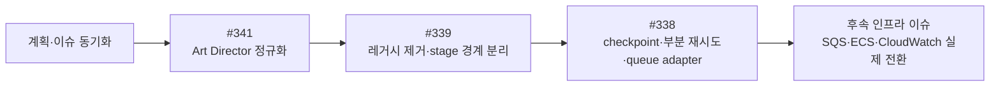

# AI PPT #341 → #339 → #338 통합 실행 계획

**작성일**: 2026-07-14

**상태**: 확정 · #341 완료 · #339 완료 · #338-0 완료·병합 · #338-1 구현 완료·병합 전 검증 중

**관련 이슈**: [#341](https://github.com/na-man-mu-303-team2/Orbit/issues/341) → [#339](https://github.com/na-man-mu-303-team2/Orbit/issues/339) → [#338](https://github.com/na-man-mu-303-team2/Orbit/issues/338)

**세부 계획**:

- `docs/plans/art-director-background-mode-normalization.md`
- `docs/plans/generate-deck-separation-before-issue-338.md`
- `docs/plans/ai-ppt-sqs-pipeline-refactoring.md`

## 1. 목표와 실행 게이트

세 이슈를 다음 순서로 완료한다.



구현 착수 전:

- 현재 세 계획 문서에 아래 확정사항을 반영하고 상태를 `확정 · 실행 전`으로 변경한다.
- GitHub 인증을 복구한 뒤 #341·#339·#338에 각 최신 계획 전문을 댓글로 남긴다. 기존 댓글은 기준으로 사용하지 않는다.
- 계획 문서의 Git 추적이 완료된 뒤 작업을 시작한다.
- 각 PR은 최신 `develop`에서 별도 브랜치로 시작하며, 선행 PR 병합 전 다음 의존 PR을 병합하지 않는다.

## 2. PR 실행 순서

### #341 — Art Director 정규화

| PR | 작업 | 종료 조건 |
| --- | --- | --- |
| `fix/art-director-background-normalization` | provider JSON을 `json.loads()`로 파싱하고 `slides[].backgroundMode`에서 `backgroundSequence`를 덮어쓴 뒤 Pydantic 검증한다. 불일치는 재호출하지 않고 enum/count/order/JSON 오류만 1회 내부 재시도한다. 오류 원문은 안전한 메시지로 치환하고 `docs/contracts.md`에 canonical 규칙을 추가한다. | mismatch가 첫 호출에서 복구되고 Python·Worker·Web 회귀 테스트가 통과한다. |

### #339 — 활성 경로 정리와 모듈 분리

| 순서 | PR 목표 | 핵심 결정 |
| --- | --- | --- |
| 339-0 | 현재 제품 경로 고정 | #341 수정 이후 `/createdeck → generate-deck → program-v2` 결과와 OCR·이미지·QA·publication 순서를 deterministic fixture로 고정한다. |
| 339-1 | 에디터 PPTX import 전환 | `/pptx-imports` 대신 `/pptx-ooxml-generations`에 `{ fileId }`만 전달한다. 구형 consumer는 아직 유지한다. |
| 339-2 | OOXML sync·export 완성 | imported Deck의 PUT과 patch 저장 모두 sync를 enqueue한다. `deckId` 기반 PostgreSQL advisory lock으로 sync를 직렬화하고 높은 `ooxmlSyncedDeckVersion`만 조건부 반영한다. export는 최신 sync가 아니면 retry하고, 최신 `currentPackageFileId`를 별도 export asset으로 복사한다. |
| 339-3 | 레거시 producer 중단 | `/pptx-imports`, `/mockup/ai-ppt`, 구형 HomePage·`GenerateDeckView`, `ai-template-deck-generation` 신규 enqueue를 중단한다. 기존 consumer는 drain을 위해 유지한다. |
| 339-4 | 레거시 제거와 배포 후 잔여 확인 | API·consumer·queue 등록·active schema 제거와 personal staging 자동 배포를 완료했다. 서버 HEAD `462702d39ec705453e11f4e12c6c3a7ead041ca7`에서 두 legacy queue의 `waiting`, `paused`, `delayed`, `prioritized`, `waiting-children`, `active`, `repeat`와 관련 DB Job의 queued/running이 모두 0임을 읽기 전용으로 확인했다. 사전 drain을 수행했다고 소급해서 기록하지 않으며 `historicalJobTypeSchema`는 과거 row 조회를 위해 유지한다. |
| 339-5 | OOXML 순수 변환 계약 | `PptxOoxmlGenerationRequest`를 strict `{ fileId }`로 축소하고 AI slot 생성, OpenAI 입력, apply-slot-text route를 제거한다. TemplateBlueprint mapping은 유지한다. |
| 339-6 | GenerateDeck `program-v2` 전용화 | public request에서 `generationMode`, `design.engineVersion`, recipe-v1 전용 `design.slidePresetId`, `designReferences`, `templateBlueprintId`를 제거하고 TypeScript/Python root·nested extra field를 거부한다. 호환 shim은 두지 않으며 `layoutVariant`, `slotPreset`, slide-preset registry/selector도 제거한다. 기존 Deck의 `metadata.createdFrom.designReferences` parsing과 PPTX용 `templateBlueprintSchema`, `templateBlueprintIdSchema`, `template_blueprints`, OOXML generation/sync/export mapping은 유지하되 일반 AI generation에서는 참조하지 않는다. |
| 339-7A | Python generation core 분리 | `deck_generation/` 아래 `models`, `source_grounding`, `content_planning`, `design_planning`, `layout_compiler`, `visual_requirements`, `quality`, `diagnostics`, `pipeline`으로 이동한다. 하위 stage는 상세 계획의 순환 없는 upstream helper DAG와 `models.py` DTO를 따르며 동기식 `pipeline.py`만 stage entrypoint 순서를 조립한다. #341 정규화는 기존 `design_program.py` 구현을 재사용해 design stage가 보장하고 공개 `/ai/generate-deck` 계약과 실패 정책은 바꾸지 않는다. |
| 339-7B | Worker 후처리 분리 | asset resolution, semantic quality, rendered visual quality, publication을 모듈로 추출하고 processor에는 payload 검증과 Job lifecycle만 남긴다. 동작과 실패 정책은 아직 변경하지 않는다. |
| 339-8 | #338 readiness 검증 | 전체 생성·PPTX round-trip·historical Job·reference extraction 회귀 행렬과 personal staging 자동 배포를 통과했다. 실제 배포 서버 HEAD, 339-4 legacy queue/DB 및 339-6 `generate-deck` queue/DB의 smoke 전후 잔여 상태 0과 GenerateDeck smoke 성공을 기록해 #339를 완료했다. |

PR 8의 로컬·required 자동 CI·personal staging 자동 배포와 운영 증거는 `docs/plans/generate-deck-separation-before-issue-338.md`의 PR 8 및 readiness checklist를 단일 기준으로 사용한다. 서버 HEAD 일치, smoke 전후 queue/DB 잔여 상태 0, 네 번째 GenerateDeck 성공을 모두 확인했다. 앞선 세 Job의 `PYTHON_WORKER_GENERATE_DECK_FAILED`는 #339의 기존 terminal baseline인 `WEB_RESEARCH_QUALITY_FAILED`로 분류됐으며 degraded success 전환 owner는 #338로 확정돼 있으므로 #338 구현을 시작할 수 있다.

### #338 — stage Job, checkpoint와 queue adapter

| 순서 | PR 목표 | 핵심 결정 |
| --- | --- | --- |
| 338-0 | stage 계약과 persistence | shared stage/message schema, optional `Job.error.failedStage`, `retryable`, diagnostics warning code를 additive하게 추가한다. `ai_deck_generation_stages` migration과 checkpoint repository를 구현하되 staged dispatcher와 새 실패 정책은 아직 활성화하지 않는다. |
| 338-1 | staged BullMQ coordinator와 OCR | 기존 monolith의 full-deck payload와 기본 실행을 유지한 채 staged BullMQ coordinator와 파일별 OCR만 활성화한다. OCR artifact, policy join, durable dispatch와 shard-only retry를 구현하고 `source-grounding` checkpoint는 만들되 338-2 전에는 dispatch하지 않는다. |
| 338-2 | Python planning stage 연결 | `source-grounding`, `content-planning`, `design-planning`, `layout-compile`을 독립 실행한다. research 실패 정책은 새 계약으로 변경하고 #341의 Art Director 정규화·terminal 정책은 보존하며 `docs/contracts.md`와 shared contract test를 갱신한다. |
| 338-3 | image·QA·publication 연결 | slide별 image fan-out, semantic quality, rendered visual quality, publication과 `failedStage` 기반 명시적 retry API를 연결한다. 로컬 기본 실행을 staged BullMQ로 전환하고 Visual QA unavailable 정책은 새 계약으로 변경하되, #339에서 고정한 optional image no-media fallback과 advisory Visual QA acceptance는 stage 경계에서도 보존한다. |
| 338-4 | SQS transport adapter | 다섯 SQS queue URL key를 추가하고 `@aws-sdk/client-sqs`를 이용해 동일 stage message의 send/receive/delete/visibility 연장을 구현한다. 다른 Job은 계속 `JOB_QUEUE_DRIVER=bullmq`를 사용한다. |
| 338-5 | monolith 제거와 인계 | staged BullMQ 전체 회귀와 SQS adapter parity test를 통과한 뒤 Worker의 기존 장기 `generate-deck` handler와 `monolith` 실행 모드를 제거한다. 실제 AWS 리소스 전환은 후속 인프라 이슈로 인계한다. |

338-1의 현재 실행 경계는 다음과 같다.

- `AI_DECK_EXECUTION_MODE=monolith`는 기존 `generate-deck` Job 이름과 request·DesignPack snapshot·image asset scope를 포함한 full-deck payload를 그대로 사용한다.
- `AI_DECK_EXECUTION_MODE=bullmq`만 `generate-deck-staged-coordinator`에 `{ jobId, projectId }`를 보내고, coordinator가 DB의 부모 Job payload를 읽어 uncovered `referenceFileIds`를 파일별 checkpoint로 만든다.
- Worker는 같은 `generate-deck` queue의 `generate-deck`과 `generate-deck-staged-coordinator`, 같은 `reference-extract` queue의 standalone `reference-extract`와 staged `reference-extract-file`을 `job.name`으로 구분한다.
- 338-1에서 실제 dispatch·consume하는 내부 stage는 `reference-extract-file`뿐이다. OCR skip 또는 policy join이 만든 `source-grounding` checkpoint는 durable하게 남지만 338-2 전에는 dispatch하지 않는다.
- standalone reference extraction API와 기존 `reference-extract` 다중 파일 계약은 바꾸지 않는다. 파일별 OCR·artifact·checkpoint는 AI PPT staged 경로에만 적용한다.
- 부모 실패 Job을 다시 시작하는 명시적 retry API는 338-1 범위가 아니며 338-3에서 `failedStage`와 shard invalidation 계약을 연결한다.

## 3. 확정 계약과 실패 정책

### Stage와 checkpoint

- 내부 message는 strict `{ pipelineJobId, projectId, stage, shardKey }`만 전달한다. binary, base64, 전체 Deck, provider 원문, 별도 checkpoint/asset ID는 넣지 않는다.
- stage는 `reference-extract-file`, `source-grounding`, `content-planning`, `design-planning`, `layout-compile`, `image-slide`, `semantic-quality`, `rendered-visual-quality`, `publication`으로 고정한다.
- `reference-extract-file`과 `image-slide`은 colon 없는 non-empty `shardKey`를 사용하고 나머지 singleton stage는 정확히 `""`를 사용한다. `pipelineJobId`에도 colon을 허용하지 않는다.
- BullMQ `opts.jobId`는 `${pipelineJobId}:${stage}:${shardKey}`로 만들어 정확히 세 segment를 유지한다. 이 ID는 message field가 아니며 SQS 중복 방지는 checkpoint 상태 전이에 맡긴다.
- consumer/repository는 parent row의 `jobs.job_id`, `jobs.project_id`, `jobs.type="ai-deck-generation"`을 message와 대조한다.
- `shard_key`는 `NOT NULL DEFAULT ''`이며 `(pipeline_job_id, stage, shard_key)`를 UNIQUE로 둔다. `pipeline_job_id`는 `jobs.job_id`를 `ON DELETE CASCADE`로 참조한다.
- 별도 join stage는 만들지 않는다. 마지막 OCR/image child가 종료될 때 전체 expected shard 상태를 트랜잭션으로 확인하고 다음 stage checkpoint를 `ON CONFLICT DO NOTHING`으로 생성한다.
- 338-1 OCR join은 기존 `referenceContext`와 파일별 artifact의 `usable`을 함께 계산한다. `research-first`는 OCR 실패를 허용하고, `references-first`는 usable source가 하나 이상일 때만 계속하며, `references-only`는 모든 필수 파일이 usable일 때만 계속한다. 허용되지 않는 조합은 `SOURCE_GROUNDING_REQUIRED`로 부모 Job을 종료한다.
- queued checkpoint 자체를 durable dispatch record로 사용한다. BullMQ enqueue 결과가 `waiting`, `delayed`, `prioritized`일 때만 같은 `attempt` generation의 `dispatched_at`을 기록한다. `active`, `completed`, `failed` 또는 알 수 없는 상태는 미전송 row로 남겨 dispatcher가 재확인한다.
- provider 호출은 crash 경계에서 재실행될 수 있으므로 exactly-once를 보장한다고 표현하지 않는다. 대신 checkpoint, 결정적 image object key와 publication 조건부 upsert로 중복 저장을 막는다.
- claim 시 `attempt`를 증가시키며 initial attempt를 포함해 총 5회만 시도한다. 1~4번째 retryable 실패는 해당 shard를 다시 queued로 만들고 5번째 종료 시 artifact가 있으면 그 `usable`, 없으면 unusable로 reference policy join을 실행해 계속 또는 terminal을 결정한다. DB lease는 10분, heartbeat는 60초이며 SQS visibility 연장은 338-4에서 5분 단위로 추가한다.
- claim은 stable worker ID에 UUID를 붙인 opaque `lease_owner` token을 매번 새로 발급하고 `attempt`를 lease generation fencing token으로 함께 사용한다. heartbeat·성공·실패·retry release는 claim이 반환한 `lease_owner`와 `attempt`가 모두 일치할 때만 허용하고, dispatcher도 조회 당시 `attempt`가 일치할 때만 `dispatched_at`을 기록한다.
- retry release와 expired lease는 `status='queued'`, `lease_owner=NULL`, `lease_expires_at=NULL`, `dispatched_at=NULL`로 되돌리고 기존 `attempt`는 유지한다. 338-1 reconciler가 이 전이를 실행한다. 5번째 attempt가 끝나면 OCR은 artifact가 있으면 그 `usable`, 없으면 unusable로 reference policy join을 실행하고 다른 필수 stage는 checkpoint와 부모 Job을 함께 `failed`로 종료한다.
- 338-0의 checkpoint reference allowlist는 비어 있었다. 338-1은 `ai_deck_reference_extraction_artifacts`에 파일별 정규화 OCR 결과와 `usable`을 저장하고 `reference-extract-file.result_ref_json`에는 strict `{ referenceExtractionArtifactId: uuid }` locator만 허용한다. 전체 Deck·content·binary/base64·provider raw response는 checkpoint에 저장하지 않는다.
- 실패 Job 재시도 API는 338-3에서 구현한다. 기록된 `failedStage`부터 시작하고 upstream 성공 checkpoint를 보존하며 OCR/image shard 실패는 해당 shard만 초기화하고 downstream checkpoint만 무효화하는 계약을 사용한다.

### 공개 및 shared 계약

- `/createdeck`, 공개 `/ai/generate-deck`, 최종 Deck schema와 부모 Job 상태 네 가지는 유지한다.
- `generateDeckResponse.warnings: string[]`는 사용자 메시지로 유지하고 `diagnostics.warningCodes`를 `^[A-Z][A-Z0-9_]*$` machine-readable code 배열, 기본값 `[]`로 추가한다.
- `visualQaStatus`는 기존 optional 계약을 유지하면서 `not-run | passed | failed | unavailable`을 허용한다.
- `Job.error`에는 optional `failedStage`와 `retryable`을 추가해 기존 Job row parsing을 깨뜨리지 않는다. `retryable`은 부모 Job의 명시적 retry API 허용 여부이며 자동 checkpoint 재시도는 `attempt < 5`로 별도 관리한다. shard 식별자는 Job error가 아니라 checkpoint key에 둔다.
- 338-0은 위 신규 값을 parse/round-trip할 기반만 추가한다. `WEB_RESEARCH_QUALITY_FAILED` warning은 338-2, Visual QA unavailable warning은 338-3에서 실제로 emit한다.
- AI PPT 전용 설정은 `AI_DECK_EXECUTION_MODE=monolith|bullmq|sqs`로 시작하고 338-5에서 `bullmq|sqs`만 남긴다. 338-1에서 기본값은 `monolith`이며 `sqs`는 API·Worker startup에서 fail-fast한다.
- `AI_DECK_WORKER_QUEUE=all|reference-extract|research-content|design-layout|image|qa-finalize`를 사용한다. 338-1은 `all`과 `reference-extract`만 실행 가능하고 나머지 stage role은 해당 owner PR 전까지 startup에서 거부한다.
- 다섯 SQS queue URL key와 send/receive/delete/visibility transport는 338-4에서 함께 추가하고 그때 `sqs` mode에서만 필수 검증한다. 전역 `JOB_QUEUE_DRIVER`는 다른 Job을 위해 `bullmq`로 유지한다.

### 최종 실패 정책

- `backgroundSequence` 불일치: `slides[].backgroundMode` 기준으로 즉시 복구하며 stage retry에 포함하지 않는다.
- `ART_DIRECTOR_INVALID_RESPONSE`: enum/count/order/JSON 오류가 내부 재시도 후 남으면 terminal.
- `WEB_RESEARCH_QUALITY_FAILED`: usable grounding 또는 사용자 입력이 있으면 warning/degraded success.
- `SOURCE_GROUNDING_REQUIRED`: strict policy에서 usable grounding이 전혀 없으면 terminal.
- `GENERATE_DECK_VISUAL_QA_UNAVAILABLE`: semantic/deterministic validation에 blocking issue와 unresolved placeholder가 모두 없으면 warning과 함께 publication.
- rendered Visual QA advisory: 남은 issue가 `BALANCE_WEAK`, `LAYOUT_REPETITIVE`, `BACKGROUND_RHYTHM_FLAT`, `CARD_OVERUSED`로만 구성되고 영향 slide 수가 `max(1, floor(slideCount * 0.2))` 이하면 현재 #339 baseline처럼 warning과 함께 publication.
- `GENERATE_DECK_VISUAL_QUALITY_GATE_FAILED`: 실제 visual blocking issue가 bounded repair 후에도 남으면 terminal.
- optional image 실패: 현재 #339 baseline처럼 no-media composition으로 결정론적으로 전환되고 blocking issue와 placeholder가 남지 않을 때만 degraded success. required asset 실패는 기존 quality gate terminal로 유지하고, optional no-media fallback request 실패만 `GENERATE_DECK_OPTIONAL_IMAGE_FALLBACK_FAILED` terminal로 분리하며 #338 stage 전환에서도 이 경계를 보존한다.
- V12의 반대되는 research·Visual QA unavailable 정책은 #338이 대체하며, optional image fallback과 advisory Visual QA acceptance는 #339 baseline을 보존한다. V12 자체는 과거 품질 승인 fixture만 보존한다.

## 4. 검증과 완료 기준

각 PR은 targeted test를 실행하고, 이슈 종료 PR에서 전체 검증을 실행한다.

```bash
pnpm --filter @orbit/shared test
pnpm --filter @orbit/web test
pnpm --filter @orbit/api test
pnpm --filter @orbit/worker test
pnpm test:coaching:migrations
pnpm test:coaching:integration
pnpm build
pnpm lint
node infra/scripts/check-env.mjs
docker compose config --quiet

cd services/python-worker
uv sync --locked
uv run ruff check .
uv run mypy app
uv run pytest
```

### 338-1 병합 전 증거 체크리스트

- [x] monolith enqueue가 기존 `generate-deck` full-deck payload를 유지하고 BullMQ staged enqueue만 ID-only coordinator payload를 사용하는 contract test
- [x] `job.name` 기준 coordinator·monolith 및 standalone·staged OCR routing과 미지원 worker role·`sqs` startup fail-fast test
- [x] OCR skip, uncovered file dedupe, 파일별 fan-out, `research-first`·`references-first`·`references-only` policy join test
- [x] `ai_deck_reference_extraction_artifacts`와 `{ referenceExtractionArtifactId }` locator의 migration·repository·atomic checkpoint completion test
- [x] initial 포함 총 5 attempts, shard-only retry, 60초 heartbeat, lease fencing, expired-lease reconciler test
- [x] BullMQ `waiting`·`delayed`·`prioritized`만 `dispatched_at`을 기록하고 duplicate enqueue·crash 복구가 가능한 durable dispatch test
- [x] `source-grounding` checkpoint가 생성되지만 338-1 dispatcher 대상에는 포함되지 않는 OCR-only 경계 test
- [x] standalone `reference-extract`와 monolith GenerateDeck 회귀 test, migration `run → 검증 → revert → run`, 전체 build·lint·test·env·Compose 검증
- [ ] PR required CI 성공과 병합 전 최신 `develop` 기준 diff·계약 정합성 검토

추가 필수 시나리오:

- #341 mismatch fixture가 provider 한 번만 호출하고 최종 Deck snapshot까지 일치한다.
- PPTX import → PUT/patch 편집 → sync → export → 재-import에서 최신 writable 요소가 유지된다.
- 레거시 consumer 제거와 personal staging 자동 배포를 완료했다. 실제 배포 서버 HEAD `462702d39ec705453e11f4e12c6c3a7ead041ca7`에서 legacy queue/DB 잔여 상태 0을 읽기 전용으로 확인했으며, 사전 drain을 수행했다고 소급 주장하지 않고 과거 Job row는 계속 조회한다.
- 339-6 계약은 `develop` merge 시 기존 personal staging workflow가 run 실행 시점의 최신 `develop` HEAD를 서버에 동기화한 뒤 그 HEAD에서 Web/API/Worker/Python worker 이미지를 빌드·교체하고 health check를 통과하는 방식으로 자동 배포됐다. workflow trigger SHA와 서버의 실제 `git rev-parse HEAD`가 일치했고, workflow를 중단하거나 required reviewer를 추가하지 않았다. smoke 전후 `generate-deck` queue/DB의 stuck Job이 0이고 네 번째 GenerateDeck 생성이 성공했다. 앞선 세 `WEB_RESEARCH_QUALITY_FAILED`는 #338의 degraded success 전환 대상으로 인계한다. production cutover는 별도 승인된 계획으로 다룬다.
- duplicate stage message, enqueue 직후 crash, provider 완료 직후 crash, lease 만료를 각각 재현한다.
- OCR 하나 또는 image 하나의 실패가 다른 shard와 이전 stage를 재실행하지 않는다.
- queue message에 bytes/base64가 없고 결정적 asset key와 publication upsert가 중복 결과를 막는다.
- research, Art Director, optional image, Visual QA의 degraded/terminal 경계를 shared·Worker·Web contract test로 고정한다.
- BullMQ와 mocked SQS adapter가 같은 message schema, checkpoint 상태 전이와 retry 결과를 만든다.
- migration은 `run → 검증 → revert → run`을 통과한다.

## 5. 운영 인계와 명시적 전제

- #338 범위는 application stage pipeline, BullMQ 실행, SQS adapter와 환경 계약까지다.
- 실제 다섯 SQS/DLQ, IAM, ECS service, autoscaling, CloudWatch alarm과 production cutover는 별도 인프라 이슈로 분리한다. 이 범위 변경을 #338 계획과 GitHub 댓글에 함께 반영한다.
- 후속 인프라 이슈가 완료되기 전 production의 `AI_DECK_EXECUTION_MODE=sqs`는 활성화하지 않는다.
- 외부 AWS 리소스 생성·배포·GitHub 원격 변경은 별도 사용자 승인 후 수행한다.
- `develop` merge의 personal staging 자동 배포는 팀의 고정 규칙이며 #339 때문에 workflow를 변경·중단하거나 required reviewer를 추가하지 않았다. #339 운영 증거로 자동 배포 성공, 서버의 실제 `git rev-parse HEAD`, 배포 후 읽기 전용 health·queue·DB 확인과 GenerateDeck smoke를 수집했고 workflow trigger SHA와 실제 서버 HEAD를 구분했다. production의 breaking cutover는 별도 승인된 배포 계획에서 ingress, drain, 동시 교체와 cache invalidation을 다룬다.
- #341 완료 전 #339 baseline을 만들지 않고, #339 readiness 완료 전 #338 persistence 작업을 병합하지 않는다.
