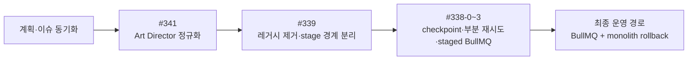

# AI PPT #341 → #339 → #338 통합 실행 계획

**작성일**: 2026-07-14

**상태**: 확정 · #341 완료 · #339 완료 · #338-0~338-3 완료·병합 · #338-4·338-5 취소

**관련 이슈**: [#341](https://github.com/na-man-mu-303-team2/Orbit/issues/341) → [#339](https://github.com/na-man-mu-303-team2/Orbit/issues/339) → [#338](https://github.com/na-man-mu-303-team2/Orbit/issues/338)

**세부 계획**:

- `docs/plans/art-director-background-mode-normalization.md`
- `docs/plans/generate-deck-separation-before-issue-338.md`
- `docs/plans/ai-ppt-sqs-pipeline-refactoring.md`

## 1. 목표와 실행 게이트

세 이슈를 다음 순서로 완료한다.



계획·이슈 동기화 상태:

- 이 로컬 통합 계획과 세부 계획을 현재 실행 기준으로 사용한다.
- 2026-07-16 팀 회의에서 SQS 도입을 취소했다. #338의 과거 SQS 확정 댓글은 현재 실행 기준으로 사용하지 않고 최신 취소 결정 댓글과 이 문서를 따른다.
- 각 PR은 최신 `develop`에서 별도 브랜치로 시작하며, 선행 PR 병합 전 다음 의존 PR을 병합하지 않는다.

## 2. PR 실행 순서

### #341 — Art Director 정규화

| PR                                          | 작업                                                                                                                                                                                                                                                                                         | 종료 조건                                                                 |
| ------------------------------------------- | -------------------------------------------------------------------------------------------------------------------------------------------------------------------------------------------------------------------------------------------------------------------------------------------- | ------------------------------------------------------------------------- |
| `fix/art-director-background-normalization` | provider JSON을 `json.loads()`로 파싱하고 `slides[].backgroundMode`에서 `backgroundSequence`를 덮어쓴 뒤 Pydantic 검증한다. 불일치는 재호출하지 않고 enum/count/order/JSON 오류만 1회 내부 재시도한다. 오류 원문은 안전한 메시지로 치환하고 `docs/contracts.md`에 canonical 규칙을 추가한다. | mismatch가 첫 호출에서 복구되고 Python·Worker·Web 회귀 테스트가 통과한다. |

### #339 — 활성 경로 정리와 모듈 분리

| 순서   | PR 목표                          | 핵심 결정                                                                                                                                                                                                                                                                                                                                                                                                                                                                                                                                                      |
| ------ | -------------------------------- | -------------------------------------------------------------------------------------------------------------------------------------------------------------------------------------------------------------------------------------------------------------------------------------------------------------------------------------------------------------------------------------------------------------------------------------------------------------------------------------------------------------------------------------------------------------- |
| 339-0  | 현재 제품 경로 고정              | #341 수정 이후 `/createdeck → generate-deck → program-v2` 결과와 OCR·이미지·QA·publication 순서를 deterministic fixture로 고정한다.                                                                                                                                                                                                                                                                                                                                                                                                                            |
| 339-1  | 에디터 PPTX import 전환          | `/pptx-imports` 대신 `/pptx-ooxml-generations`에 `{ fileId }`만 전달한다. 구형 consumer는 아직 유지한다.                                                                                                                                                                                                                                                                                                                                                                                                                                                       |
| 339-2  | OOXML sync·export 완성           | imported Deck의 PUT과 patch 저장 모두 sync를 enqueue한다. `deckId` 기반 PostgreSQL advisory lock으로 sync를 직렬화하고 높은 `ooxmlSyncedDeckVersion`만 조건부 반영한다. export는 최신 sync가 아니면 retry하고, 최신 `currentPackageFileId`를 별도 export asset으로 복사한다.                                                                                                                                                                                                                                                                                   |
| 339-3  | 레거시 producer 중단             | `/pptx-imports`, `/mockup/ai-ppt`, 구형 HomePage·`GenerateDeckView`, `ai-template-deck-generation` 신규 enqueue를 중단한다. 기존 consumer는 drain을 위해 유지한다.                                                                                                                                                                                                                                                                                                                                                                                             |
| 339-4  | 레거시 제거와 배포 후 잔여 확인  | API·consumer·queue 등록·active schema 제거와 personal staging 자동 배포를 완료했다. 서버 HEAD `462702d39ec705453e11f4e12c6c3a7ead041ca7`에서 두 legacy queue의 `waiting`, `paused`, `delayed`, `prioritized`, `waiting-children`, `active`, `repeat`와 관련 DB Job의 queued/running이 모두 0임을 읽기 전용으로 확인했다. 사전 drain을 수행했다고 소급해서 기록하지 않으며 `historicalJobTypeSchema`는 과거 row 조회를 위해 유지한다.                                                                                                                           |
| 339-5  | OOXML 순수 변환 계약             | `PptxOoxmlGenerationRequest`를 strict `{ fileId }`로 축소하고 AI slot 생성, OpenAI 입력, apply-slot-text route를 제거한다. TemplateBlueprint mapping은 유지한다.                                                                                                                                                                                                                                                                                                                                                                                               |
| 339-6  | GenerateDeck `program-v2` 전용화 | public request에서 `generationMode`, `design.engineVersion`, recipe-v1 전용 `design.slidePresetId`, `designReferences`, `templateBlueprintId`를 제거하고 TypeScript/Python root·nested extra field를 거부한다. 호환 shim은 두지 않으며 `layoutVariant`, `slotPreset`, slide-preset registry/selector도 제거한다. 기존 Deck의 `metadata.createdFrom.designReferences` parsing과 PPTX용 `templateBlueprintSchema`, `templateBlueprintIdSchema`, `template_blueprints`, OOXML generation/sync/export mapping은 유지하되 일반 AI generation에서는 참조하지 않는다. |
| 339-7A | Python generation core 분리      | `deck_generation/` 아래 `models`, `source_grounding`, `content_planning`, `design_planning`, `layout_compiler`, `visual_requirements`, `quality`, `diagnostics`, `pipeline`으로 이동한다. 하위 stage는 상세 계획의 순환 없는 upstream helper DAG와 `models.py` DTO를 따르며 동기식 `pipeline.py`만 stage entrypoint 순서를 조립한다. #341 정규화는 기존 `design_program.py` 구현을 재사용해 design stage가 보장하고 공개 `/ai/generate-deck` 계약과 실패 정책은 바꾸지 않는다.                                                                                 |
| 339-7B | Worker 후처리 분리               | asset resolution, semantic quality, rendered visual quality, publication을 모듈로 추출하고 processor에는 payload 검증과 Job lifecycle만 남긴다. 동작과 실패 정책은 아직 변경하지 않는다.                                                                                                                                                                                                                                                                                                                                                                       |
| 339-8  | #338 readiness 검증              | 전체 생성·PPTX round-trip·historical Job·reference extraction 회귀 행렬과 personal staging 자동 배포를 통과했다. 실제 배포 서버 HEAD, 339-4 legacy queue/DB 및 339-6 `generate-deck` queue/DB의 smoke 전후 잔여 상태 0과 GenerateDeck smoke 성공을 기록해 #339를 완료했다.                                                                                                                                                                                                                                                                                     |

PR 8의 로컬·required 자동 CI·personal staging 자동 배포와 운영 증거는 `docs/plans/generate-deck-separation-before-issue-338.md`의 PR 8 및 readiness checklist를 단일 기준으로 사용한다. 서버 HEAD 일치, smoke 전후 queue/DB 잔여 상태 0, 네 번째 GenerateDeck 성공을 모두 확인했다. 앞선 세 Job의 `PYTHON_WORKER_GENERATE_DECK_FAILED`는 #339의 기존 terminal baseline인 `WEB_RESEARCH_QUALITY_FAILED`로 분류됐으며 degraded success 전환 owner는 #338로 확정돼 있으므로 #338 구현을 시작할 수 있다.

### #338 — stage Job, checkpoint와 staged BullMQ

| 순서  | PR 목표                         | 핵심 결정                                                                                                                                                                                                                                                                                                                                  |
| ----- | ------------------------------- | ------------------------------------------------------------------------------------------------------------------------------------------------------------------------------------------------------------------------------------------------------------------------------------------------------------------------------------------ |
| 338-0 | stage 계약과 persistence        | shared stage/message schema, optional `Job.error.failedStage`, `retryable`, diagnostics warning code를 additive하게 추가한다. `ai_deck_generation_stages` migration과 checkpoint repository를 구현하되 staged dispatcher와 새 실패 정책은 아직 활성화하지 않는다.                                                                          |
| 338-1 | staged BullMQ coordinator와 OCR | 기존 monolith의 full-deck payload와 기본 실행을 유지한 채 staged BullMQ coordinator와 파일별 OCR만 활성화한다. OCR artifact, policy join, durable dispatch와 shard-only retry를 구현하고 `source-grounding` checkpoint는 만들되 338-2 전에는 dispatch하지 않는다.                                                                          |
| 338-2 | Python planning stage 연결      | `source-grounding`, `content-planning`, `design-planning`, `layout-compile`을 독립 실행한다. research 실패 정책은 새 계약으로 변경하고 #341의 Art Director 정규화·terminal 정책은 보존하며 `docs/contracts.md`와 shared contract test를 갱신한다.                                                                                          |
| 338-3 | image·QA·publication 연결       | slide별 image fan-out, semantic quality, rendered visual quality, publication과 `failedStage` 기반 명시적 retry API를 연결한다. 로컬 기본 실행을 staged BullMQ로 전환하고 Visual QA unavailable 정책은 새 계약으로 변경하되, #339에서 고정한 optional image no-media fallback과 advisory Visual QA acceptance는 stage 경계에서도 보존한다. |
| 338-4 | SQS transport adapter — 취소    | 팀 회의 결정으로 SQS를 도입하지 않는다. PR #397은 미병합 상태로 닫혔고 SQS SDK, queue URL, consumer와 parity test는 결과물에 포함하지 않는다.                                                                                                                               |
| 338-5 | monolith 제거와 인계 — 취소     | `monolith`는 호환·회귀·rollback 경로로 유지한다. SQS/DLQ, IAM, SQS consumer ECS, autoscaling, CloudWatch SQS 지표와 production SQS cutover를 구현하거나 후속 작업으로 인계하지 않는다.                                                                                        |

338-1의 병합 기준 실행 경계는 다음과 같다.

- `AI_DECK_EXECUTION_MODE=monolith`는 기존 `generate-deck` Job 이름과 request·DesignPack snapshot·image asset scope를 포함한 full-deck payload를 그대로 사용한다.
- `AI_DECK_EXECUTION_MODE=bullmq`만 `generate-deck-staged-coordinator`에 `{ jobId, projectId }`를 보낸다. public `references`와 `referenceFileIds`는 각각 최대 10개다. coordinator는 DB 부모 payload에서 non-empty `references`를 우선하고, 비어 있을 때만 `referenceFileIds`를 사용해 `selectedReferenceFileIds`를 만든다. `referenceContext`로 covered된 file을 제외한 `uncoveredReferenceFileIds`에만 파일별 checkpoint를 생성한다.
- Worker는 같은 `generate-deck` queue의 `generate-deck`과 `generate-deck-staged-coordinator`, 같은 `reference-extract` queue의 standalone `reference-extract`와 staged `reference-extract-file`을 `job.name`으로 구분한다.
- 338-1에서 실제 dispatch·consume하는 내부 stage는 `reference-extract-file`뿐이다. OCR skip 또는 policy join이 만든 `source-grounding` checkpoint는 durable하게 남지만 338-2 전에는 dispatch하지 않는다.
- standalone reference extraction API와 기존 `reference-extract` 다중 파일 계약은 바꾸지 않는다. 파일별 OCR·artifact·checkpoint는 AI PPT staged 경로에만 적용한다.
- 부모 실패 Job을 다시 시작하는 명시적 retry API는 338-1 범위가 아니며 338-3에서 `failedStage`와 shard invalidation 계약을 연결한다.

338-2의 병합 기준 구현 경계는 다음과 같다.

- `source-grounding`, `content-planning`, `design-planning`, `layout-compile`을 Python 내부 endpoint와 BullMQ stage consumer로 독립 실행한다.
- 각 stage의 큰 결과는 `ai_deck_planning_artifacts`에 저장하고 checkpoint에는 strict `{ planningArtifactId: uuid }`만 전달한다. tenant·pipeline·upstream stage identity를 조회 시 다시 검증한다.
- `research-content`, `design-layout` dedicated Worker role을 활성화하고 OCR과 네 planning stage만 dispatcher·stale dispatch·expired lease·final transport recovery 대상으로 확장한다. 338-3 stage는 아직 dispatch하지 않는다.
- `layout-compile` 이후 부모 Job은 progress 60의 `running`으로 유지하며 image·QA·publication은 338-3이 이어받는다. production 기본값 `monolith`와 `develop` 자동 배포 규칙은 변경하지 않는다.

338-3의 병합된 구현 경계는 다음과 같다.

- `layout-compile` artifact가 검증된 worker payload와 visual requirements를 함께 보존하고, 이미지가 필요한 slide만 `image-slide` checkpoint로 fan-out한다. 마지막 image child가 별도 join stage 없이 `semantic-quality`을 만들며 이미지가 없으면 직접 semantic stage로 진행한다.
- `ai_deck_execution_artifacts`와 strict `{ executionArtifactId: uuid }` locator로 image·semantic·rendered·publication 결과를 보존한다. tenant·pipeline·stage·shard identity를 조회 시 다시 검증하며 queue message shape은 바꾸지 않는다.
- `image`, `qa-finalize` dedicated Worker role과 9개 stage 전체 dispatcher·stale dispatch·expired lease·final transport recovery를 활성화한다. publication은 artifact, checkpoint, Deck upsert와 부모 Job 성공을 한 transaction으로 commit한다.
- `POST /api/v1/projects/:projectId/jobs/:jobId/retry`는 `retryable=true`와 `failedStage`가 있는 실패 Job만 재개한다. 성공한 upstream과 같은 OCR/image stage의 성공 shard를 보존하고 실패 shard와 downstream만 초기화하며 coordinator checkpoint가 없는 coordinator 실패만 ID-only coordinator를 다시 enqueue한다.
- 로컬 기본값과 `.env.example`은 `bullmq`로 전환한다. staging·production 예제의 명시적 `monolith` 값과 `develop` merge 자동 배포 workflow는 변경하지 않는다.

## 3. 확정 계약과 실패 정책

### Stage와 checkpoint

- 내부 message는 strict `{ pipelineJobId, projectId, stage, shardKey }`만 전달한다. binary, base64, 전체 Deck, provider 원문, 별도 checkpoint/asset ID는 넣지 않는다.
- stage는 `reference-extract-file`, `source-grounding`, `content-planning`, `design-planning`, `layout-compile`, `image-slide`, `semantic-quality`, `rendered-visual-quality`, `publication`으로 고정한다.
- `reference-extract-file`과 `image-slide`은 colon 없는 non-empty `shardKey`를 사용하고 나머지 singleton stage는 정확히 `""`를 사용한다. `pipelineJobId`에도 colon을 허용하지 않는다.
- BullMQ `opts.jobId`는 `${pipelineJobId}:${stage}:${shardKey}`로 만들어 정확히 세 segment를 유지한다. 이 ID는 message field가 아니며 중복 처리와 crash 복구는 checkpoint 상태 전이에 맡긴다.
- consumer/repository는 parent row의 `jobs.job_id`, `jobs.project_id`, `jobs.type="ai-deck-generation"`을 message와 대조한다.
- `shard_key`는 `NOT NULL DEFAULT ''`이며 `(pipeline_job_id, stage, shard_key)`를 UNIQUE로 둔다. `pipeline_job_id`는 `jobs.job_id`를 `ON DELETE CASCADE`로 참조한다.
- 별도 join stage는 만들지 않는다. 마지막 OCR/image child가 종료될 때 전체 expected shard 상태를 트랜잭션으로 확인하고 다음 stage checkpoint를 `ON CONFLICT DO NOTHING`으로 생성한다.
- 338-1 OCR join은 기존 `referenceContext`와 파일별 artifact의 `usable`을 함께 계산한다. `references-only`는 `selectedReferenceFileIds`가 하나 이상이고 선택한 모든 file이 기존 context로 covered됐거나 새 artifact에서 `usable=true`일 때만 계속한다. 선택되지 않은 context만으로 strict 조건을 대신할 수 없다. `references-first`는 usable source가 하나 이상일 때만 계속하고 `research-first`는 OCR 실패를 허용한다. 허용되지 않는 조합은 `SOURCE_GROUNDING_REQUIRED`, `retryable=false`로 부모 Job을 종료한다.
- `PYTHON_WORKER_EXTRACT_INVALID_RESPONSE` 같은 non-retryable provider schema 오류는 해당 shard를 artifact 없는 `failed`/`usable=false`로 끝내고 부모를 즉시 실패시키지 않은 채 같은 reference policy join에 합류시킨다. project·asset identity 위반만 active sibling과 부모를 즉시 terminal 처리한다.
- queued checkpoint 자체를 durable dispatch record로 사용한다. BullMQ enqueue 결과가 `waiting`, `delayed`, `prioritized`일 때만 같은 `attempt` generation의 `dispatched_at`을 기록한다. `active`, `completed`, `failed` 또는 알 수 없는 상태는 미전송 row로 남겨 dispatcher가 재확인한다.
- dispatcher는 `dispatched_at`이 15분 이상 지난 active parent의 queued 9-stage row를 매 회차 최대 100개 복구하고, partial index `idx_ai_deck_generation_stages_stale_dispatch`로 이 scan을 지원한다.
- BullMQ 최종 transport failure에서 OCR Job은 queued checkpoint의 `dispatched_at`만 복구하고 재시도 예산을 소진한 coordinator Job은 active checkpoint와 부모를 `AI_DECK_COORDINATOR_FAILED`, `retryable=true`로 atomic 종료한다. 단 `failedReason`이 BullMQ의 정확한 stall/started-limit transport reason이면 `attemptsMade`와 무관하게 coordinator transaction을 멱등 재실행하며, 그 외 예산을 소진한 entry만 terminal 복구한다. failed entry는 `removeOnFail=false`로 cap 없이 보존한다. maintenance는 opaque Redis `ZSCAN` cursor와 `pendingJobIds`로 회차당 기본 25개·최대 100개를 처리한다. resume 또는 terminal DB recovery가 failed parent를 반환하면 DB commit 이후에만 entry 제거를 시도하고 Worker가 표준 `job.failed`를 남기며, DB recovery 실패 entry는 full cursor cycle 뒤 재시도한다. BullMQ transport attempt와 DB checkpoint `attempt`는 서로 다른 재시도 층이다.
- provider 호출은 crash 경계에서 재실행될 수 있으므로 exactly-once를 보장한다고 표현하지 않는다. 대신 checkpoint, 결정적 image object key와 publication 조건부 upsert로 중복 저장을 막는다.
- claim 시 `attempt`를 증가시키며 initial attempt를 포함해 총 5회만 시도한다. 1~4번째 retryable 실패는 해당 shard를 다시 queued로 만들고 5번째 종료 시 artifact가 있으면 그 `usable`, 없으면 unusable로 reference policy join을 실행해 계속 또는 terminal을 결정한다. DB lease는 10분, heartbeat는 60초이며 BullMQ transport와 checkpoint lease를 최종 운영 계약으로 사용한다.
- claim은 stable worker ID에 UUID를 붙인 opaque `lease_owner` token을 매번 새로 발급하고 `attempt`를 lease generation fencing token으로 함께 사용한다. heartbeat·성공·실패·retry release는 claim이 반환한 `lease_owner`와 `attempt`가 모두 일치할 때만 허용하고, dispatcher도 조회 당시 `attempt`가 일치할 때만 `dispatched_at`을 기록한다.
- retry release와 expired lease는 `status='queued'`, `lease_owner=NULL`, `lease_expires_at=NULL`, `dispatched_at=NULL`로 되돌리고 기존 `attempt`는 유지한다. 338-1 reconciler가 이 전이를 실행한다. 5번째 attempt가 끝나면 OCR은 artifact가 있으면 그 `usable`, 없으면 unusable로 reference policy join을 실행하고 다른 필수 stage는 checkpoint와 부모 Job을 함께 `failed`로 종료한다.
- 338-0의 checkpoint reference allowlist는 비어 있었다. 338-1은 `ai_deck_reference_extraction_artifacts`와 strict `{ referenceExtractionArtifactId: uuid }`, 338-2는 `ai_deck_planning_artifacts`와 strict `{ planningArtifactId: uuid }`, 338-3은 `ai_deck_execution_artifacts`와 strict `{ executionArtifactId: uuid }` locator를 추가한다. 전체 Deck·content·binary/base64·provider raw response는 checkpoint에 저장하지 않는다.
- 실패 Job 재시도 API는 기록된 `failedStage`부터 시작하고 upstream 성공 checkpoint를 보존하며 OCR/image shard 실패는 실패 shard만 초기화하고 downstream checkpoint와 artifact만 무효화한다.

### 공개 및 shared 계약

- `/createdeck`, 공개 `/ai/generate-deck`, 최종 Deck schema와 부모 Job 상태 네 가지는 유지한다.
- `generateDeckResponse.warnings: string[]`는 사용자 메시지로 유지하고 `diagnostics.warningCodes`를 `^[A-Z][A-Z0-9_]*$` machine-readable code 배열, 기본값 `[]`로 추가한다.
- `visualQaStatus`는 기존 optional 계약을 유지하면서 `not-run | passed | failed | unavailable`을 허용한다.
- `Job.error`에는 optional `failedStage`와 `retryable`을 추가해 기존 Job row parsing을 깨뜨리지 않는다. `retryable`은 부모 Job의 명시적 retry API 허용 여부이며 자동 checkpoint 재시도는 `attempt < 5`로 별도 관리한다. shard 식별자는 Job error가 아니라 checkpoint key에 둔다.
- 338-0은 위 신규 값을 parse/round-trip할 기반만 추가했다. `WEB_RESEARCH_QUALITY_FAILED` warning은 338-2, Visual QA unavailable warning은 338-3에서 실제로 emit한다.
- AI PPT 전용 지원 모드는 `AI_DECK_EXECUTION_MODE=monolith|bullmq`다. 로컬 기본값은 `bullmq`이고 staging·production 예제는 명시적 `monolith`를 유지한다. `sqs`는 지원하지 않으며 API·Worker startup에서 fail-fast한다.
- `AI_DECK_WORKER_QUEUE=all|reference-extract|research-content|design-layout|image|qa-finalize`를 사용하고 338-3에서 모든 role을 실행 가능하게 한다.
- 전역 `JOB_QUEUE_DRIVER`와 AI PPT stage transport는 `bullmq`로 유지한다. SQS queue URL key, SDK와 transport는 추가하지 않는다.

### 최종 실패 정책

- `backgroundSequence` 불일치: `slides[].backgroundMode` 기준으로 즉시 복구하며 stage retry에 포함하지 않는다.
- `ART_DIRECTOR_INVALID_RESPONSE`: enum/count/order/JSON 오류가 내부 재시도 후 남으면 terminal.
- `WEB_RESEARCH_QUALITY_FAILED`: usable grounding 또는 사용자 입력이 있으면 warning/degraded success.
- `SOURCE_GROUNDING_REQUIRED`: strict policy에서 usable grounding이 전혀 없으면 terminal.
- `GENERATE_DECK_VISUAL_QA_UNAVAILABLE`: semantic/deterministic validation에 blocking issue와 unresolved placeholder가 모두 없으면 warning과 함께 publication.
- rendered Visual QA advisory: 남은 issue가 `BALANCE_WEAK`, `LAYOUT_REPETITIVE`, `BACKGROUND_RHYTHM_FLAT`, `CARD_OVERUSED`로만 구성되고 영향 slide 수가 `max(1, floor(slideCount * 0.2))` 이하면 현재 #339 baseline처럼 warning과 함께 publication.
- `GENERATE_DECK_VISUAL_QUALITY_GATE_FAILED`: 실제 visual blocking issue가 bounded repair 후에도 남으면 terminal.
- optional image 실패: 현재 #339 baseline처럼 no-media composition으로 결정론적으로 전환되고 blocking issue와 placeholder가 남지 않을 때만 degraded success. required asset 실패는 기존 quality gate terminal로 유지하고, optional no-media fallback request 실패만 `GENERATE_DECK_OPTIONAL_IMAGE_FALLBACK_FAILED` terminal로 분리하며 #338 stage 전환에서도 이 경계를 보존한다.
- V12의 반대되는 research·Visual QA unavailable 정책은 #338이 대체하며, optional image fallback과 advisory Visual QA acceptance는 #339 baseline을 보존한다. V12 자체는 과거 품질 승인 fixture만 보존한다.

## 4. 검증과 완료 기준

각 PR은 targeted test를 실행하고, 이슈 종료 PR에서 전체 검증을 실행한다.

```bash
pnpm --filter @orbit/shared test
pnpm --filter @orbit/web test
pnpm --filter @orbit/api test
pnpm --filter @orbit/worker test
pnpm test:coaching:migrations
pnpm test:coaching:integration
pnpm build
pnpm lint
node infra/scripts/check-env.mjs
docker compose config --quiet

cd services/python-worker
uv sync --locked
uv run ruff check .
uv run mypy app
uv run pytest
```

### 338-1 병합 전 증거 체크리스트

- [x] monolith enqueue가 기존 `generate-deck` full-deck payload를 유지하고 BullMQ staged enqueue만 ID-only coordinator payload를 사용하는 contract test
- [x] `job.name` 기준 coordinator·monolith 및 standalone·staged OCR routing과 338-1 당시 미지원 worker role·`sqs` startup fail-fast test
- [x] shared Zod·Python façade의 `references`/`referenceFileIds` 각각 최대 10개, `references` 우선·fallback, `selectedReferenceFileIds`/`uncoveredReferenceFileIds`, context-only `references-only` 거부, 파일별 fan-out과 policy join test
- [x] `PYTHON_WORKER_EXTRACT_INVALID_RESPONSE`가 부모를 즉시 실패시키지 않고 `research-first` policy join으로 진행하는 test
- [x] `ai_deck_reference_extraction_artifacts`와 `{ referenceExtractionArtifactId }` locator의 migration·repository·atomic checkpoint completion test
- [x] initial 포함 총 5 attempts, shard-only retry, 60초 heartbeat, lease fencing, expired-lease terminal parent의 표준 `job.failed` 로그 test
- [x] BullMQ `waiting`·`delayed`·`prioritized`만 `dispatched_at`을 기록하고 duplicate enqueue·crash 복구가 가능한 durable dispatch test
- [x] coordinator 재시도 소진의 atomic parent/checkpoint 종료, attempt 소진처럼 보이는 stall/started-limit `failedReason`의 멱등 resume, 즉시·지연 terminal recovery의 표준 `job.failed`, OCR 최종 transport failure의 `dispatched_at` 복구, 실제 Redis retained coordinator opaque `ZSCAN` 순회 test
- [x] 15분 stale queued dispatch의 bounded 복구와 `idx_ai_deck_generation_stages_stale_dispatch` migration·revert test
- [x] `source-grounding` checkpoint가 생성되지만 338-1 dispatcher 대상에는 포함되지 않는 OCR-only 경계 test
- [x] standalone `reference-extract`와 monolith GenerateDeck 회귀 test, migration `run → 검증 → revert → run`, 전체 build·lint·test·env·Compose 검증
- [x] PR required CI 성공과 병합 전 최신 `develop` 기준 diff·계약 정합성 검토

### 338-3 PR 검증 체크리스트

- [x] execution artifact shared locator, DB constraint, repository identity와 migration 등록 test
- [x] migration `run → revert → run` 실제 로컬 PostgreSQL 왕복과 최종 최신 상태 확인
- [x] layout worker payload, slide별 image fan-out, image 없는 semantic 직행과 마지막 child join test
- [x] deterministic image asset key/upsert, semantic·rendered·publication stage와 publication atomic/fencing test
- [x] Visual QA unavailable degraded publication, 실제 blocking issue terminal, advisory acceptance와 optional no-media fallback terminal 분리 회귀 test
- [x] `failedStage` retry의 upstream·성공 shard 보존, downstream invalidation과 coordinator-only 재enqueue test
- [x] 6개 Worker role, 9개 stage dispatcher·stale dispatch·lease·transport recovery test
- [x] API·Worker 전체 회귀, shared/job-queue contract, Python 493 passed·1 skipped, Web 병렬 timeout 단독 재검증, API·Worker·Web 직접 build, env·Compose 검증
- [x] PR required 자동 CI 성공과 사용자 병합

추가 필수 시나리오:

- #341 mismatch fixture가 provider 한 번만 호출하고 최종 Deck snapshot까지 일치한다.
- PPTX import → PUT/patch 편집 → sync → export → 재-import에서 최신 writable 요소가 유지된다.
- 레거시 consumer 제거와 personal staging 자동 배포를 완료했다. 실제 배포 서버 HEAD `462702d39ec705453e11f4e12c6c3a7ead041ca7`에서 legacy queue/DB 잔여 상태 0을 읽기 전용으로 확인했으며, 사전 drain을 수행했다고 소급 주장하지 않고 과거 Job row는 계속 조회한다.
- 339-6 계약은 `develop` merge 시 기존 personal staging workflow가 run 실행 시점의 최신 `develop` HEAD를 서버에 동기화한 뒤 그 HEAD에서 Web/API/Worker/Python worker 이미지를 빌드·교체하고 health check를 통과하는 방식으로 자동 배포됐다. workflow trigger SHA와 서버의 실제 `git rev-parse HEAD`가 일치했고, workflow를 중단하거나 required reviewer를 추가하지 않았다. smoke 전후 `generate-deck` queue/DB의 stuck Job이 0이고 네 번째 GenerateDeck 생성이 성공했다. 앞선 세 `WEB_RESEARCH_QUALITY_FAILED`는 #338의 degraded success 전환 대상으로 인계한다. production cutover는 별도 승인된 계획으로 다룬다.
- duplicate stage message, enqueue 직후 crash, provider 완료 직후 crash, lease 만료를 각각 재현한다.
- OCR 하나 또는 image 하나의 실패가 다른 shard와 이전 stage를 재실행하지 않는다.
- queue message에 bytes/base64가 없고 결정적 asset key와 publication upsert가 중복 결과를 막는다.
- research, Art Director, optional image, Visual QA의 degraded/terminal 경계를 shared·Worker·Web contract test로 고정한다.
- BullMQ duplicate delivery, enqueue 직후 crash와 expired lease가 같은 checkpoint 상태 전이로 수렴한다.
- migration은 `run → 검증 → revert → run`을 통과한다.

## 5. 최종 운영 경로와 명시적 전제

- #338의 최종 범위는 #338-0~338-3의 application stage pipeline, checkpoint와 BullMQ 실행 계약이다.
- staged BullMQ를 최종 stage transport로 사용하고 `monolith`를 호환·회귀·rollback 경로로 유지한다.
- SQS adapter와 실제 SQS/DLQ, IAM, SQS consumer ECS, autoscaling, CloudWatch SQS 지표와 production SQS cutover는 취소했으며 후속 인프라 작업으로 인계하지 않는다.
- staging·production의 명시적 `monolith`를 `bullmq`로 전환하려면 별도로 승인된 배포 계획과 smoke, queue/DB 잔여 상태 검증을 거친다.
- `develop` merge의 personal staging 자동 배포는 팀의 고정 규칙이며 #339 때문에 workflow를 변경·중단하거나 required reviewer를 추가하지 않았다. #339 운영 증거로 자동 배포 성공, 서버의 실제 `git rev-parse HEAD`, 배포 후 읽기 전용 health·queue·DB 확인과 GenerateDeck smoke를 수집했고 workflow trigger SHA와 실제 서버 HEAD를 구분했다. production의 breaking cutover는 별도 승인된 배포 계획에서 ingress, drain, 동시 교체와 cache invalidation을 다룬다.
- #341 완료 전 #339 baseline을 만들지 않고, #339 readiness 완료 전 #338 persistence 작업을 병합하지 않는다.
