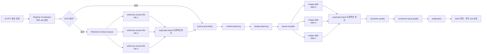
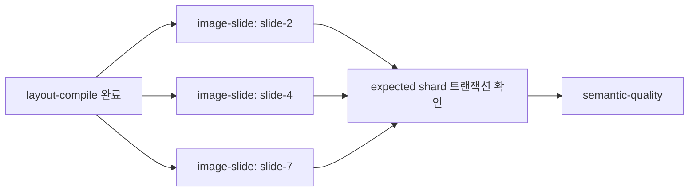
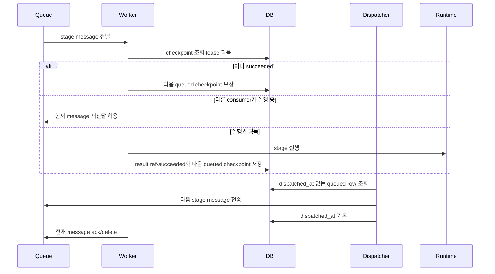
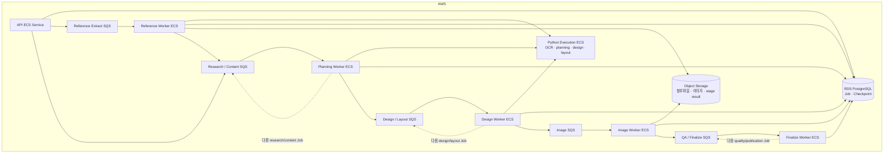

# AI PPT stage Job·SQS 파이프라인 전환 결정

**작성일**: 2026-07-14

**상태**: 확정 · 실행 전 (#339 완료 대기)

**실행 이슈**: [#338 PPT 생성 - AI PPT stage Job·SQS 파이프라인 전환](https://github.com/na-man-mu-303-team2/Orbit/issues/338)

**선행 이슈**: [#339 PPT 생성 - #338 선행 활성 경로 정리 및 generate_deck.py 분리](https://github.com/na-man-mu-303-team2/Orbit/issues/339)

**선행 버그 이슈**: [#341 Art Director 배경 모드 불일치 정규화](https://github.com/na-man-mu-303-team2/Orbit/issues/341)

**선행 문서**: `docs/plans/generate-deck-separation-before-issue-338.md`

> 이 문서는 확정된 #338 실행 계약이다. GitHub에서는 이 문서 전문을 최신 기준 댓글로 사용하며 기존 댓글은 기준으로 사용하지 않는다.

**결정 참여자**: ORBIT 개발팀, AWS 오피스아워 담당자

## 1. 문서 목적

이 문서는 #339 완료 후 AI PPT 생성의 각 stage를 독립 Job으로 실행하는 application pipeline과 transport 계약을 정의한다. staged BullMQ 경로를 먼저 완성하고 같은 stage message에 SQS transport adapter를 추가한다. 실제 AWS queue·DLQ·IAM·ECS·autoscaling·CloudWatch와 production cutover는 후속 인프라 이슈의 범위다.

#339에서 다음 작업은 이미 끝난 것으로 간주한다.

- 제품 생성 경로를 `design-pack + program-v2`로 단일화
- 레거시 UI, API, queue, `recipe-v1`, PPTX template 기반 AI 생성 제거
- PPTX OOXML import를 AI 생성과 분리된 순수 변환·sync·export 경로로 확정
- Python generation core를 명시적 Pydantic stage 경계로 분리
- TypeScript Worker의 asset resolution, semantic quality, rendered visual quality, publication 경계 분리
- `/ai/generate-deck`를 동기 호환 façade로 유지
- 기존 `reference-extract` OCR 동작과 결과 계약을 회귀 테스트로 고정
- `slides[].backgroundMode`를 canonical source로 사용하는 Art Director 정규화와 안전한 실패 계약

#338에서는 `generate_deck.py`를 다시 분리하거나 레거시 코드를 함께 제거하지 않는다. #339가 만든 stage 함수와 계약을 실행 단위로 사용해 부모 Job, checkpoint, 부분 재시도, fan-out/join, staged BullMQ 실행과 SQS transport adapter를 구현한다.

## 2. 배경과 해결할 병목

현재 AI PPT 생성은 하나의 긴 `generate-deck` Job이 Python `/ai/generate-deck` 호출과 이미지·QA·저장을 순서대로 수행한다. 후반 단계가 실패해도 앞선 provider 호출부터 다시 실행되며, consumer concurrency가 제한되면 여러 생성 요청이 전체적으로 직렬 대기한다.

첨부자료 OCR도 독립 병목이다. 현재 `reference-extract` BullMQ Job 하나에 최대 여러 파일과 `contentBase64`를 묶어 `/documents/parse`로 전달한다. 파일 하나의 실패가 Job 전체 재시도로 이어지고, 첨부 요청이 많으면 이후 생성 stage를 분리해도 OCR 앞에서 대기한다.

따라서 #338은 OCR을 포함한 전체 AI PPT pipeline을 다음 단위로 분리한다.

- 첨부파일별 OCR
- source grounding
- content planning
- design planning
- layout compile과 visual requirements
- 슬라이드별 image asset resolution
- semantic quality
- rendered visual quality와 제한된 repair
- publication

단순히 BullMQ를 SQS로 교체하거나 현재의 긴 handler를 그대로 SQS에 넣는 방식은 채택하지 않는다.

## 3. 결정

AI PPT 생성은 하나의 공개 부모 Job과 여러 내부 stage checkpoint로 관리한다. Job은 재시도와 멱등성의 경계이며, queue는 실행 자원·동시성·rate limit·autoscaling의 경계다.

BullMQ와 SQS transport가 공통으로 사용하는 다음 다섯 논리 queue group을 고정한다.

| Queue | Job | 실행 소유권 | 처리 범위 |
| --- | --- | --- | --- |
| `reference-extract` | `reference-extract-file` | TypeScript queue adapter → Python parser | 파일별 OCR·텍스트 추출 |
| `ai-deck-research-content` | `source-grounding`, `content-planning` | TypeScript queue adapter → Python stage runtime | 출처 조사·정규화·발표 흐름·슬라이드 내용 |
| `ai-deck-design-layout` | `design-planning`, `layout-compile` | TypeScript queue adapter → Python stage runtime | DesignPack·디자인 계획·편집 가능한 요소·visual requirements |
| `ai-deck-image` | `image-slide` | TypeScript Worker | 슬라이드별 이미지 검색·생성·Storage 저장·요소 적용 |
| `ai-deck-qa-finalize` | `semantic-quality`, `rendered-visual-quality`, `publication` | TypeScript Worker | 의미 검증·rendered visual review/repair·최종 Deck 저장 |

함수마다 queue를 만들지 않는다. 같은 자원과 제한을 공유하는 Job은 같은 queue를 사용하되 checkpoint와 결정적 Job ID는 stage별로 유지한다.

## 4. 목표 구조



`topic-only`, `user-input-only` 요청은 OCR child나 별도 join checkpoint를 만들지 않고 `source-grounding` checkpoint를 생성한다.

## 5. #339 stage와 #338 Job mapping

#339에서 추출한 Python module과 TypeScript module을 다음 Job에서 그대로 사용한다.

| #338 Job ID | #339 실행 경계 | 결과 |
| --- | --- | --- |
| `reference-extract-file` | 기존 Python `/documents/parse`의 파일 단위 호출 | 파일별 정규화 텍스트·keyword·warning |
| `source-grounding` | Python `source_grounding.py` | `SourceGroundingResult` |
| `content-planning` | Python `content_planning.py` | `ContentPlan` |
| `design-planning` | Python `design_planning.py` | `slides[].backgroundMode`에서 background sequence를 파생한 검증된 `DesignPlan` |
| `layout-compile` | Python `layout_compiler.py`, `visual_requirements.py` | `LayoutCompileResult`, `VisualRequirements` |
| `image-slide` | TypeScript `asset-resolution.ts` | slide별 asset 결과·warning |
| `semantic-quality` | TypeScript `semantic-quality.ts` | semantic/deterministic validation 결과 |
| `rendered-visual-quality` | TypeScript `rendered-visual-quality.ts` | render review·bounded repair 결과 |
| `publication` | TypeScript `publication.ts` | 최종 Deck·diagnostics·부모 Job result |

Python의 `quality.py`와 `diagnostics.py`는 Python stage 내부 content/layout validation과 diagnostics 조립에 사용한다. rendered visual QA와 최종 publication을 Python으로 옮기지 않는다.

`design_pack_recipes.py` 같은 `recipe-v1`로 오해할 수 있는 별도 module을 #338에서 다시 추가하지 않는다. DesignPack program-v2 helper는 #339에서 확정된 module 소유권을 그대로 따른다.

## 6. Runtime 소유권

queue 수신, checkpoint, Job 상태, 다음 stage enqueue는 `apps/worker`가 소유한다. Python은 generation과 document parsing의 순수 실행 경계를 소유한다.

- TypeScript Worker가 BullMQ/SQS 공통 stage message를 검증하고 checkpoint 실행권을 획득한다.
- OCR과 Python generation Job은 내부 Python stage adapter를 호출한다.
- Python `/ai/generate-deck`는 동일 stage 함수를 동기 호출하는 공개 호환 façade로 유지한다.
- 내부 stage adapter는 public API 계약에 포함하지 않으며 로컬 서비스 또는 후속 ECS 내부 네트워크에서만 접근한다.
- image, semantic quality, rendered visual quality, publication은 TypeScript Worker가 직접 실행한다.
- Worker image는 `AI_DECK_WORKER_QUEUE`에 따라 담당 queue만 소비할 수 있어야 하며 후속 ECS service가 같은 image를 사용한다.
- Python execution service의 독립 확장은 후속 ECS 인프라에서 OCR과 planning/design 부하에 맞춰 구성한다.

이 구조는 checkpoint와 DB 상태 변경을 TypeScript Worker 한 곳에 유지하고 Python에 별도 queue orchestration을 복제하지 않는다.

## 7. 부모 Job과 checkpoint

공개 API는 #339 완료 후 확정된 `program-v2` 전용 GenerateDeck request와 기존 부모 `ai-deck-generation` Job 상태를 유지한다.

- `generateDeckResponse.warnings: string[]`는 사용자 메시지 배열로 유지하고 `diagnostics.warningCodes`를 machine-readable code 배열로 추가한다.
- `visualQaStatus`에는 `unavailable`을 추가한다.
- `Job.error`에는 optional `failedStage`와 `retryable`을 추가하되 기존 Job row parsing을 깨뜨리지 않는다.
- 내부 stage는 `reference-extract-file`, `source-grounding`, `content-planning`, `design-planning`, `layout-compile`, `image-slide`, `semantic-quality`, `rendered-visual-quality`, `publication`으로 고정한다.

내부 stage는 다음 테이블에서 관리한다.

```text
ai_deck_generation_stages
- pipeline_job_id
- stage
- shard_key              # NOT NULL DEFAULT ''; fileId, slideId 또는 단일 stage의 빈 값
- status                 # queued | running | succeeded | failed
- attempt
- input_ref_json
- result_ref_json
- error_json
- lease_owner
- lease_expires_at
- dispatched_at
- created_at
- updated_at

UNIQUE (pipeline_job_id, stage, shard_key)
```

원칙:

1. 결정적 내부 Job ID는 `pipelineJobId:stage:shardKey` 형식으로 만든다.
2. consumer는 조건부 update로 checkpoint lease를 획득한 경우에만 provider를 호출한다.
3. 이미 `succeeded`인 checkpoint는 결과를 재사용하고 다음 stage dispatch만 보장한다.
4. transport 공통 message는 `{ pipelineJobId, projectId, stage, shardKey }`만 허용한다. binary, base64, 전체 Deck JSON, provider raw response, 별도 checkpoint ID와 asset ID를 넣지 않는다.
5. binary는 Storage에, 큰 stage 결과는 DB 또는 Storage에 두고 message의 네 key로 checkpoint와 asset reference를 조회한다.
6. 별도 join stage는 만들지 않는다. 마지막 OCR/image child가 종료될 때 expected shard 전체 상태를 트랜잭션으로 확인하고 다음 stage checkpoint를 `ON CONFLICT DO NOTHING`으로 생성한다.
7. queued checkpoint 자체를 durable dispatch record로 사용한다. 전송 성공 후 `dispatched_at`을 기록하고 dispatcher가 미전송 queued row를 재전송한다.
8. provider는 checkpoint 저장 전 crash 경계에서 재실행될 수 있으므로 exactly-once를 보장한다고 표현하지 않는다. checkpoint, 결정적 image object key와 publication 조건부 upsert로 중복 영속 결과를 막는다.
9. 최종 Deck은 publication에서 기존 shared Deck schema로 검증해 저장한다.

### 실행 모드와 transport 설정

- `AI_DECK_EXECUTION_MODE=monolith|bullmq|sqs`로 시작하고 338-5에서 `bullmq|sqs`만 남긴다.
- `AI_DECK_WORKER_QUEUE=all|reference-extract|research-content|design-layout|image|qa-finalize`를 사용한다. 로컬은 `all`을 사용하고 후속 AWS ECS 배포에서는 queue별 값을 사용한다.
- SQS mode에서만 다섯 queue URL을 필수 검증한다.
- 전역 `JOB_QUEUE_DRIVER`는 다른 Job을 위해 `bullmq`로 유지한다.

## 8. OCR file fan-out과 join

부모 request의 reference policy와 `referenceFileIds`를 기준으로 OCR child를 만든다.

1. 각 `fileId`마다 `stage=reference-extract-file`, `shardKey=fileId` checkpoint를 생성한다.
2. `reference-extract-file` consumer는 project ownership과 asset status를 검증한다.
3. Storage에서 파일을 읽어 Python parser에 파일 하나만 전달한다.
4. 성공 결과는 file checkpoint의 result ref로 저장한다.
5. retryable 오류는 해당 파일 message만 재시도한다.
6. 마지막으로 종료된 child는 같은 트랜잭션에서 UNIQUE child checkpoint의 terminal 상태를 조회해 모든 예상 fileId의 종료 여부를 판정한다. 중복 message마다 counter를 단순 증가시키지 않는다.
7. 별도 join stage 없이 `source-grounding` checkpoint를 `ON CONFLICT DO NOTHING`으로 생성하고 dispatcher가 전송한다.

reference policy별 처리:

- `topic-only`, `user-input-only`: OCR을 skip한다.
- `references-first`: usable file이 있으면 실패한 선택 파일을 warning으로 남기고 계속할 수 있다.
- `references-only`: 필수 파일이 usable source를 만들지 못하고 retry가 소진되면 terminal failure다.
- `research-first`: 첨부 실패는 warning으로 전달하고 web research를 계속할 수 있다.

기존 standalone reference extraction API의 공개 request/response는 유지한다. 다만 AI PPT pipeline 내부 실행은 파일별 stage Job과 checkpoint를 사용하며 다중 파일 base64 queue payload를 사용하지 않는다.

## 9. Image fan-out과 join

`layout-compile`이 반환한 `VisualRequirements`를 기준으로 이미지가 필요한 slide마다 `image-slide` child를 만든다.



마지막으로 종료된 child는 별도 join stage 없이 `semantic-quality` checkpoint를 `ON CONFLICT DO NOTHING`으로 생성한다. 중복 dispatch는 허용하며 checkpoint와 lease가 동시 중복 실행을 제한한다. crash 경계에서는 provider가 재실행될 수 있고, 결정적 image object key가 중복 asset 생성을 막는다.

## 10. 처리 순서와 멱등성



정상 완료 순서는 **현재 checkpoint 저장과 다음 queued checkpoint 생성 → dispatcher 전송과 `dispatched_at` 기록 → 현재 message ack/delete**다. process가 중간에 종료되면 현재 message 또는 미전송 queued checkpoint가 다시 처리된다. 현재 checkpoint가 이미 `succeeded`면 provider를 다시 호출하지 않고 다음 dispatch만 복구하며, provider 완료 후 checkpoint 저장 전 crash가 발생하면 provider 호출은 재실행될 수 있다.

BullMQ와 SQS의 duplicate delivery는 정상 상황으로 취급한다. message 자체의 중복 방지에 의존하지 않고 DB UNIQUE checkpoint, 조건부 lease, 결정적 asset key와 publication 조건부 upsert로 영속 부작용을 멱등하게 만든다.

## 11. 실패와 재시도 정책

### Retryable failure

- OCR, LLM, image provider timeout·rate limit·일시적 5xx
- 일시적 DB·Storage·내부 Python service 연결 실패
- Worker 종료와 SQS visibility timeout 만료

claim 시 `attempt`를 증가시키고 현재 file, stage 또는 slide message만 지수 backoff로 최대 5회 재시도한다. DB lease는 10분, heartbeat는 60초로 유지하고 SQS transport는 visibility를 5분 단위로 연장한다. 부모 Job과 성공한 checkpoint는 초기화하지 않는다.

expired lease는 reconciler가 queued로 되돌린다. 최대 시도 횟수를 초과하면 checkpoint와 부모 Job을 함께 `failed`로 종료한다. 실패 Job 재시도 API는 기록된 `failedStage`부터 시작하고 upstream 성공 checkpoint는 보존한다. OCR/image shard 실패는 해당 shard만 초기화하고 downstream checkpoint만 무효화한다.

Art Director의 `backgroundSequence`와 `slides[].backgroundMode` 불일치는 retry 대상이 아니다. `design-planning` adapter가 `slides[].backgroundMode`에서 sequence를 다시 만들어 첫 응답에서 복구한다.

현재 #339 baseline은 optional image 실패를 결정적 no-media composition으로 전환하고, bounded repair 후 남은 issue가 `BALANCE_WEAK`, `LAYOUT_REPETITIVE`, `BACKGROUND_RHYTHM_FLAT`, `CARD_OVERUSED`로만 구성되며 영향 slide 수가 `max(1, floor(slideCount * 0.2))` 이하이면 advisory warning과 함께 발행한다. #338은 이 두 동작을 새로 도입하지 않고 분산 stage에서도 동일하게 보존한다.

### Degraded success

- 일부 선택 첨부파일 OCR이 retry 한도를 초과했지만 reference policy상 계속할 수 있음
- web research가 실행됐으나 공식·독립 출처 다양성 기준을 충분히 만족하지 못함
- 선택적 이미지 생성 또는 필수가 아닌 visual repair가 실패함
- rendered Visual QA provider가 retry 한도를 초과했지만 semantic/deterministic validation에는 blocking issue가 없음

`WEB_RESEARCH_QUALITY_FAILED`는 usable source나 사용자 입력이 있으면 warning을 포함한 degraded success로 처리한다. 선택적 이미지는 현재 #339 baseline처럼 no-media composition으로 결정론적으로 전환하고 blocking issue와 placeholder가 남지 않을 때만 계속한다.

선택적 repair action 실패와 rendered QA의 `GENERATE_DECK_VISUAL_QA_UNAVAILABLE`은 semantic/deterministic validation에 blocking issue와 unresolved placeholder가 모두 없을 때 warning과 함께 publication을 계속한다. #339의 advisory allowlist와 영향 slide threshold는 그대로 유지하며, Visual QA가 그 기준을 넘는 실제 blocking issue를 반환했고 bounded repair 후에도 남아 있으면 degraded success로 낮추지 않는다.

### Terminal failure

- request 또는 checkpoint schema가 유효하지 않음
- 프로젝트나 파일에 접근할 권한이 없음
- `references-only`의 필수 파일이 usable source를 만들지 못하고 retry가 소진됨
- source가 반드시 필요한 정책에서 usable grounding이 전혀 없음
- Art Director가 한 번의 내부 provider 재시도 후에도 잘못된 enum, slide count, order 또는 JSON 구조를 반환함
- required image asset이 실패하거나 unresolved placeholder가 남음 (`GENERATE_DECK_QUALITY_GATE_FAILED`)
- 선택적 이미지의 no-media fallback request가 실패함 (`GENERATE_DECK_OPTIONAL_IMAGE_FALLBACK_FAILED`)
- rendered Visual QA의 blocking issue가 bounded repair 후에도 남아 있음
- 최종 Deck이 shared schema를 통과하지 못하고 bounded repair로도 복구되지 않음

출처 다양성 부족과 usable source 부재를 같은 오류로 처리하지 않는다.

- `WEB_RESEARCH_PROVIDER_FAILED`: retryable
- `WEB_RESEARCH_QUALITY_FAILED`: degraded success
- `SOURCE_GROUNDING_REQUIRED`: strict policy의 terminal failure
- `ART_DIRECTOR_INVALID_RESPONSE`: `design-planning`의 복구 불가능한 provider output terminal failure
- `GENERATE_DECK_VISUAL_QA_UNAVAILABLE`: deterministic validation 통과 및 unresolved placeholder 부재 시 degraded success warning
- `GENERATE_DECK_QUALITY_GATE_FAILED`: required asset 실패 또는 unresolved placeholder가 남은 terminal failure
- `GENERATE_DECK_OPTIONAL_IMAGE_FALLBACK_FAILED`: optional no-media fallback request 실패의 terminal failure
- `GENERATE_DECK_VISUAL_QUALITY_GATE_FAILED`: bounded repair 후 blocking visual issue가 남은 terminal failure

필수 stage가 최종 실패하면 부모 Job에 `failedStage`, `retryable`과 안전한 오류 코드만 기록한다. 이전 checkpoint는 보존하며 명시적 재시도 시 해당 stage부터 다시 시작한다.

SQS adapter는 DLQ/redrive 계약과 오류 처리를 지원하되 실제 다섯 DLQ와 redrive policy 생성은 후속 인프라 이슈에서 수행한다. DLQ는 자동 복구가 아니라 반복 실패 조사와 명시적 redrive에 사용한다.

### 계약 전환

#338은 기존 실패 정책을 유지하는 작업이 아니다. stage 경계 도입과 함께 `docs/contracts.md`, shared Job/validation schema와 관련 테스트를 위 정책으로 갱신한다.

- `research-first`의 출처 다양성 부족은 usable grounding이 있으면 blocking failure에서 warning으로 바꾼다.
- rendered Visual QA unavailable은 deterministic validation이 통과하고 unresolved placeholder가 없으면 terminal failure에서 warning으로 바꾼다.
- 현재 no-media fallback request 실패에 재사용되는 `GENERATE_DECK_VISUAL_QA_UNAVAILABLE`은 먼저 `GENERATE_DECK_OPTIONAL_IMAGE_FALLBACK_FAILED` terminal error로 분리한다.
- 실제 blocking visual issue가 bounded repair 후에도 남은 경우만 quality gate terminal failure로 유지한다.
- optional image no-media fallback과 advisory Visual QA allowlist·영향 slide threshold는 #339 baseline을 변경하지 않고 staged BullMQ와 SQS adapter에서 재검증한다.
- V12 등 기존 승인 문서의 반대되는 실패 정책은 #338이 대체하며, 해당 문서는 품질 기준과 과거 승인 근거만 보존한다.

## 12. 후속 인프라 목표 구조 (#338 비범위)

아래 구조는 #338의 SQS transport adapter가 인계할 후속 목표다. #338에서는 실제 SQS/DLQ, IAM, ECS service, autoscaling, CloudWatch alarm을 생성하거나 production을 cutover하지 않는다.



후속 인프라 전환에서 OCR이 없는 요청은 API가 Q0를 건너뛰고 Q1의 `source-grounding`을 enqueue한다. queue별 consumer concurrency, provider rate limit, visibility timeout, DLQ와 autoscaling을 독립적으로 설정한다.

후속 Worker ECS service는 같은 image를 사용하되 담당 queue만 소비하고, Python execution service는 Q0~Q2의 depth와 요청 latency를 함께 관찰해 확장한다. #338 로컬 Docker Compose에서는 같은 Worker와 Python image가 staged BullMQ의 여러 stage를 처리한다.

## 13. 전환 순서

### 338-0: #339 완료 확인, stage 계약과 persistence

- #341의 background 정규화와 안전한 실패 테스트가 #339 `design_planning.py`에 보존되어 있어야 한다.
- `program-v2` 전용 request와 stage DTO를 기준선으로 고정한다.
- Python/TypeScript stage module과 façade contract test가 통과해야 한다.
- #338에서 레거시 제거와 대형 파일 분리를 반복하지 않는다.
- shared stage/message schema, optional `Job.error.failedStage`, `retryable`, diagnostics warning code와 `visualQaStatus: "unavailable"`을 추가한다.
- `ai_deck_generation_stages` TypeORM migration을 추가한다.
- checkpoint repository, 결정적 Job ID, UNIQUE checkpoint, lease와 멱등 처리 규칙을 구현한다.

### 338-1: staged BullMQ coordinator와 OCR

- 기존 monolith를 기본값으로 유지한 채 staged BullMQ 경로를 추가한다.
- `reference-extract-file` message를 추가하고 base64 queue payload를 제거한다.
- fileId 기반 Storage 조회, 파일별 checkpoint, retry, join을 구현한다.
- queued checkpoint 기반 durable dispatch와 stage-only retry를 구현한다.
- OCR이 없는 request의 skip 경로를 검증한다.

### 338-2: Python planning stage 연결

- `source-grounding`, `content-planning`, `design-planning`, `layout-compile`을 독립 Job으로 연결한다.
- #339 stage module을 호출하는 내부 Python adapter를 구현한다.
- web research 실패 정책을 retryable, degraded success, terminal failure로 구분한다.
- #341의 Art Director 정규화와 안전한 `ART_DIRECTOR_INVALID_RESPONSE`를 보존한다.
- `docs/contracts.md`와 shared schema/test를 source-grounding의 새 실패 정책과 보존할 Art Director 정책에 맞춰 갱신한다.

### 338-3: image, quality와 publication 연결

- slide별 `image-slide`과 UNIQUE checkpoint join을 구현한다.
- `semantic-quality`, `rendered-visual-quality`, `publication`을 독립 Job으로 연결한다.
- Visual QA unavailable warning과 bounded repair 이후 blocking issue terminal 정책을 contract test로 고정한다.
- optional image의 결정적 no-media fallback과 advisory Visual QA acceptance를 #339 baseline 그대로 stage contract test로 고정한다.
- no-media fallback 실패를 `GENERATE_DECK_OPTIONAL_IMAGE_FALLBACK_FAILED` terminal로 분리해 rendered QA unavailable degraded 분기와 구분한다.
- 로컬 기본 실행을 staged BullMQ로 전환한다.

### 338-4: SQS transport adapter

- `@aws-sdk/client-sqs`로 동일 stage message의 send, receive, delete와 visibility 연장을 구현한다.
- staged BullMQ와 mocked SQS adapter가 같은 checkpoint 상태 전이와 retry 결과를 만드는 parity test를 추가한다.
- 다른 Job은 계속 `JOB_QUEUE_DRIVER=bullmq`를 사용한다.

### 338-5: monolith 제거와 인프라 인계

- staged BullMQ 전체 회귀와 SQS adapter parity test가 통과한 뒤 Worker의 기존 장기 `generate-deck` handler와 `monolith` 실행 모드를 제거한다.
- Python `/ai/generate-deck` 동기 호환 façade는 유지한다.
- 실제 AWS queue·DLQ, IAM, ECS, autoscaling, CloudWatch와 production cutover를 후속 인프라 이슈로 인계한다.
- 후속 인프라 이슈 완료 전 production에서 `AI_DECK_EXECUTION_MODE=sqs`를 활성화하지 않는다.

## 14. 호환성과 비목표

### 유지할 계약

- #339 완료 후 확정된 `program-v2` 전용 `/ai/generate-deck` request/response
- 사용자에게 노출되는 부모 Job의 `queued`, `running`, `succeeded`, `failed` 상태
- 최종 `packages/shared` Deck schema와 편집 가능한 Deck JSON
- DesignPack, palette/font override, reference, image와 bounded QA/repair 알고리즘. 실패 상태 전이는 11장의 새 정책을 따른다.
- standalone reference extraction API의 공개 request/response

### 변경하지 않을 영역

- PPTX OOXML generation, sync, import, export
- `TemplateBlueprint`, `template_blueprints`, source/current package와 요소 mapping
- 저장된 Deck의 historical metadata 계약
- BrandKit 또는 organization 기능 재도입

### 비목표

- PPT 생성 품질 알고리즘 전면 재작성
- 모든 서비스 queue의 일괄 SQS 전환
- 실제 SQS/DLQ, IAM, ECS service, autoscaling, CloudWatch alarm 생성과 production cutover
- AWS Step Functions 도입
- 함수별 microservice 또는 queue 생성
- 공개 `/ai/generate-deck` endpoint 분할

## 15. 완료 조건

1. staged BullMQ에서 첨부자료가 있는 요청 여러 개를 동시에 실행해도 다중 파일 OCR Job 하나 때문에 전체 요청이 직렬 대기하지 않는다.
2. OCR 파일 하나가 실패하면 해당 파일만 재시도하고 다른 파일 결과를 재사용한다.
3. BullMQ와 SQS의 공통 stage message가 `{ pipelineJobId, projectId, stage, shardKey }`만 포함하고 bytes나 base64를 포함하지 않는다.
4. 중간 stage 실패 시 해당 stage만 재실행되고 성공한 이전 provider 호출은 반복되지 않는다.
5. 한 slide의 이미지 실패가 다른 이미지 또는 content planning을 다시 실행하지 않는다.
6. web research 품질 미달만으로 생성이 중단되지 않고 warning이 전달된다.
7. strict reference policy에서 usable source가 전혀 없으면 안전한 terminal error를 반환한다.
8. Art Director background 중복 필드 불일치는 `design-planning` 실패나 재시도를 만들지 않는다.
9. Visual QA unavailable은 deterministic validation 통과 및 unresolved placeholder 부재 시 warning으로 발행되고, bounded repair 후 blocking issue가 남으면 terminal failure다.
10. optional image 실패는 #339 baseline처럼 no-media composition으로 전환되고 blocking issue와 placeholder가 남지 않을 때만 degraded success이며 required asset 또는 fallback 실패는 terminal이다.
11. BullMQ와 mocked SQS에서 동일 stage message가 중복 전달되어도 checkpoint, image object와 publication 결과가 중복 영속되지 않는다.
12. #339 완료 후 `/ai/generate-deck` contract와 최종 Deck schema가 유지된다.
13. `docs/contracts.md`와 shared contract test가 #338의 새 실패 정책을 반영한다.
14. staged BullMQ와 mocked SQS adapter가 같은 message schema, checkpoint 상태 전이와 retry 결과를 만든다.
15. migration이 `run → 검증 → revert → run`을 통과한다.
16. staged BullMQ 전체 회귀와 SQS adapter parity 후 Worker monolith handler와 `monolith` mode가 제거된다.
17. 실제 AWS 리소스와 운영 지표는 후속 인프라 이슈의 완료 조건으로 인계된다.
18. shared, API, Worker, Python contract와 통합 회귀 테스트가 통과한다.

## 16. 고려했지만 채택하지 않은 대안

### OCR을 기존 BullMQ에 영구 유지

- 첨부자료 요청은 OCR 앞에서 계속 대기한다.
- 여러 파일이 하나의 retry 단위로 남아 파일별 checkpoint와 부분 재시도를 구현할 수 없다.
- 전체 병목 해소 목표를 만족하지 못해 채택하지 않는다.

### 현재 구조에서 Worker 수만 증가

- 긴 handler의 전체 재시도와 단계별 장애 격리를 해결하지 못한다.
- stage와 queue 경계를 만든 뒤 자원별로 확장한다.

### BullMQ를 SQS로 단순 교체

- 하나의 큰 message와 장기 handler가 유지되면 병목과 전체 재시도 문제도 유지된다.
- stage, checkpoint, 멱등성과 함께 전환한다.

### 모든 단계를 별도 queue로 분리

- queue, ECS service, IAM과 모니터링 설정이 과도하게 늘어난다.
- Job은 세분화하되 queue는 자원 특성이 다른 다섯 그룹으로 유지한다.
