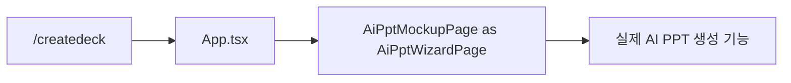
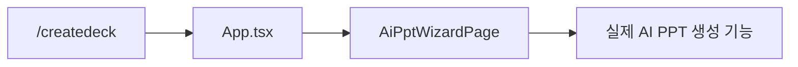

# AI PPT production 페이지 명칭 정리 이슈 초안

## 이슈 제목

`[PPT 생성] AiPptMockupPage production 명칭 정리`

## 선행 조건

- [ ] [#339](https://github.com/na-man-mu-303-team2/Orbit/issues/339) 완료
- [ ] [#338](https://github.com/na-man-mu-303-team2/Orbit/issues/338) 완료
- [ ] 기존 목업 파일 담당자에게 변경 범위 공유 및 확인

선행 조건이 완료되기 전에는 이 작업을 시작하지 않는다. 특히 담당자 확인 없이 파일명과 component export 이름을 변경하지 않는다.

## 배경

`apps/web/src/features/ai-ppt/AiPptMockupPage.tsx`는 ORBIT 디자인 시스템과 AI PPT 생성 UX를 검증하기 위해 만든 목업에서 시작했다. 이후 기능 구현 과정에서 별도의 production 페이지를 만들지 않고 이 파일에 다음 실제 기능이 직접 연결됐다.

- `/createdeck` production route
- AI PPT 생성 request 조립
- 프로젝트 생성과 참고자료 업로드
- 참고자료 OCR 및 Job polling
- DesignPack, 색상, 폰트 선택
- PPT Advisor
- 생성 Job 상태와 오류 처리
- 생성 완료 후 에디터 이동

현재 `App.tsx`도 `AiPptMockupPage`를 `AiPptWizardPage`라는 별칭으로 import해 `/createdeck`에 렌더링한다. 기능상 문제는 없지만 실제 production 페이지가 계속 `Mockup` 이름을 사용하여 다음 혼동이 발생한다.

- `/mockup/ai-ppt` 삭제 시 production 구현까지 삭제해도 되는 것으로 오해할 수 있다.
- 코드 검색에서 목업과 실제 기능의 경계가 불명확하다.
- AI PPT 생성 관련 후속 작업에서 잘못된 파일 소유권과 삭제 범위를 판단할 수 있다.

## 핵심 원칙

> 이 작업은 production 구현 삭제나 새 페이지 재작성 작업이 아니다. 현재 동작하는 구현을 유지하면서 파일, component export, 테스트와 stylesheet의 이름만 production 의미에 맞게 정리한다.

`AiPptMockupPage.tsx` 파일 자체를 삭제하면 `/createdeck`의 실제 생성 기능이 함께 삭제된다. 담당자가 삭제를 허용한 “목업”은 #339에서 제거하는 `/mockup/ai-ppt` route와 wrapper를 의미하며, production 구현은 유지해야 한다.

## 현재 구조



## 목표 구조



## 작업 내용

### 1. production 페이지 이름 변경

- `apps/web/src/features/ai-ppt/AiPptMockupPage.tsx`
  → `apps/web/src/features/ai-ppt/AiPptWizardPage.tsx`
- `AiPptMockupPage` component export
  → `AiPptWizardPage`
- `App.tsx`에서 `as AiPptWizardPage` import alias를 제거하고 새 이름을 직접 import한다.

기존 helper와 state 중 이미 `AiPptWizard` 이름을 사용하는 항목은 그대로 유지한다. 기능과 무관한 전체 symbol rename은 하지 않는다.

### 2. stylesheet 이름 변경

- `apps/web/src/features/ai-ppt/ai-ppt-mockup.css`
  → `apps/web/src/features/ai-ppt/ai-ppt-wizard.css`
- component의 stylesheet import 경로를 갱신한다.

CSS class는 `mockup` 명칭이 실제로 포함된 경우에만 필요한 범위에서 변경한다. production 의미와 무관한 class 전체 재작성이나 스타일 변경은 하지 않는다.

### 3. 테스트 이름과 import 변경

- `AiPptMockupPage.test.ts`
  → `AiPptWizardPage.test.ts`
- `AiPptMockupPage.ui.test.ts`
  → `AiPptWizardPage.ui.test.ts`
- 테스트의 component import와 render 대상을 `AiPptWizardPage`로 변경한다.
- 기존 payload, OCR, polling, DesignPack, Advisor, 오류 처리 assertion은 그대로 유지한다.

### 4. 남은 참조 정리

- production code에서 `AiPptMockupPage` import와 export를 제거한다.
- 활성 설계·실행 문서의 파일 경로와 component 이름을 갱신한다.
- #339에서 삭제한 `/mockup/ai-ppt`, `OrbitAiPptConnectedMockup`, mockup catalog 항목을 다시 추가하지 않는다.
- 과거 의사결정이나 목업 이력을 설명하는 문서는 역사적 문맥까지 일괄 치환하지 않는다. 깨진 현재 파일 경로가 있는 경우에만 새 경로 또는 이전 이름이었다는 설명을 추가한다.

## 변경하지 않을 내용

- AI PPT 생성 UI와 디자인
- component 내부 기능 또는 state 구조
- `GenerateDeckRequest`와 API 계약
- OCR, DesignPack, Advisor, Job polling 동작
- `/createdeck` route
- #338에서 정리한 stage, queue, checkpoint 구조
- component 분할 또는 신규 abstraction
- 목업 페이지 재생성

약 2,400줄인 component를 작은 component나 hook으로 분리하는 작업은 이 이슈에 포함하지 않는다. 명칭 변경과 구조 개선을 섞으면 rename 추적과 기능 회귀 검토가 어려워진다. 실제 유지보수 문제가 확인되면 별도 이슈로 진행한다.

## 완료 기준

- [ ] `/createdeck`가 `AiPptWizardPage`를 직접 렌더링한다.
- [ ] `AiPptMockupPage.tsx`와 `ai-ppt-mockup.css`가 production source에 남아 있지 않다.
- [ ] production code와 테스트에 `AiPptMockupPage` import/export가 남아 있지 않다.
- [ ] `/mockup/ai-ppt` route 또는 wrapper가 다시 추가되지 않는다.
- [ ] AI PPT 생성 payload와 사용자 흐름이 변경 전과 동일하다.
- [ ] Web test, typecheck, build가 통과한다.
- [ ] 담당자 확인 내용과 변경 범위를 PR 본문에 기록한다.

## 검증 명령

```bash
pnpm --filter @orbit/web test
pnpm --filter @orbit/web typecheck
pnpm --filter @orbit/web build
```

코드 참조는 다음 검색으로 확인한다.

```bash
rg "AiPptMockupPage|ai-ppt-mockup|/mockup/ai-ppt" apps/web/src
```

검색 결과가 남는 경우 #339에서 의도적으로 유지하기로 한 historical compatibility인지 확인하고, production import·route·stylesheet 참조는 모두 제거한다.

## PR 권장사항

- 별도 rename 전용 PR로 진행한다.
- `git mv`를 사용해 파일 이력을 보존한다.
- rename과 기능 변경을 같은 commit에 포함하지 않는다.
- 브랜치 이름 예시: `refactor/ai-ppt-wizard-page-name`
- PR 본문에 #339, #338 완료와 담당자 확인 여부를 연결한다.
