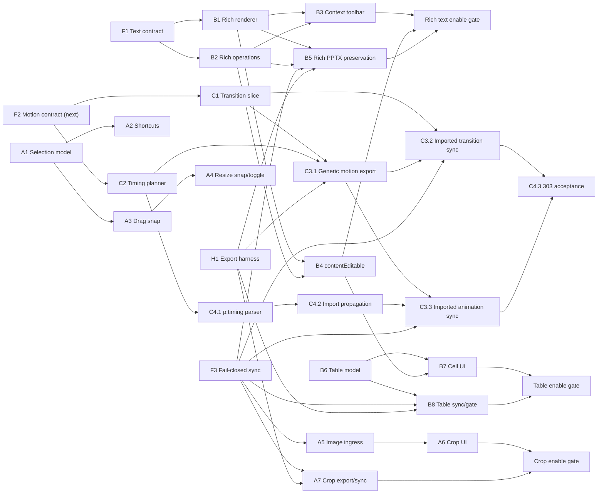

# ORBIT 에디터 경험 개선 2주 구현 계획

**Status:** Ready for implementation review

**Date:** 2026-07-17

**Source:** 첨부 문서 `editor-experience-gap-analysis-and-roadmap.md`

**Planning basis:** 2주, 3개 병렬 트랙, 3~4인일 flex 지원, PR 단위 상세 계획

## 1. 목표와 계획 해석

이 계획은 첨부 로드맵 중 사용자가 초단기 우선순위로 선택한 기능을 실제 저장소 구조에 맞춰 구현 가능한 PR로 분해한다. 선택된 기능은 모두 상세 계획에 포함하되, 3개 core 트랙 × 10영업일에 3~4인일의 flex 지원을 더한 용량 안에서 production 완료를 약속할 범위와 그 직후 이어갈 tail을 구분한다.

사용자가 선택한 **에디터 심화** 완료선을 사용한다.

- **2주 커밋 범위:** 선택·marquee·단축키·스냅, 이미지 drop/paste/crop, 텍스트 context toolbar와 부분 서식, table inline editing, export accuracy harness, 그리고 활성화한 편집값의 generic/OOXML 보존.
- **즉시 후속 범위:** slide transition, 4-mode animation timing, full `p:timing` animation import와 dynamic export/sync.
- 후속 범위도 이 문서에 PR, 파일, 수용 기준과 검증까지 적는다. 일정만 Day 10 release gate 밖이다.

기능을 보이는 UI만 추가하고 PPTX export에서 변경이 사라지는 상태는 완료로 보지 않는다. 활성화된 편집 기능은 일반 Deck의 generic exporter와 imported Deck의 preserved OOXML sync 중 적용되는 경로에서 반드시 보존되어야 한다.

## 2. 확정된 제품·기술 결정

| 결정 영역 | 확정 내용 |
| --- | --- |
| 일정 | 2주 타임박스 |
| 병렬화 | 3개 core 구현 트랙 + 병목 PR에 투입할 3~4인일 flex 지원 |
| 계획 단위 | 각 PR에 실제 파일, 계약, 수용 기준, 검증, 의존성을 기록 |
| rich text 원본 | `paragraphs[].runs[]`가 canonical. `text`는 plain-text projection, top-level `runs`는 legacy/single-paragraph 호환 |
| PPTX 보존 | 활성화한 rich text, crop, table cell, transition, timing 변경은 generic export 또는 OOXML sync에서 보존 |
| 2주 완료선 | 에디터 심화 |
| legacy animation | action 참조 group root는 `on-click`, 미참조 group root는 `on-slide-enter`; 같은 `order`의 follower는 기존 동시 재생을 보존하도록 `with-previous` |
| timing enum | `on-slide-enter | on-click | with-previous | after-previous` |
| transition | destination slide가 소유하고 이전 slide와 현재 slide를 cross-fade |
| split animation target | 한 PPTX shape가 여러 ORBIT element로 분리되면 deterministic synthetic group 생성 |
| marquee | 회전을 반영한 element AABB가 selection rect에 완전히 포함될 때 선택 |
| selection modifier | plain=교체, `Shift`=합집합, `Cmd/Ctrl`=membership toggle |
| image batch | 한 drop/paste에서 첫 번째 유효 이미지 1장만 추가하고 나머지는 안내 |
| 외부 이미지 drag | URL/HTML drag는 제외하고 로컬 JPG/PNG/WebP `File`만 허용 |
| orphan `after-previous` | 앞 effect가 없으면 destination transition을 implicit previous event로 보고 전환 종료 뒤 시작 |

## 3. 범위와 완료선

### 3.1 선택 기능 전체 매핑

아래 Task ID는 원문 로드맵의 A/B 번호를 재사용한 것이 아니라, 이번 구현 계획의 의존성과 PR 순서를 기준으로 새로 부여한 로컬 ID다.

| 기능 | 2주 완료선 | 상세 Task |
| --- | --- | --- |
| 스마트 가이드/스냅 | Commit | A3, A4 |
| 단축키 확장 | Commit | A2 |
| marquee selection | Commit | A1 |
| Shift/Cmd 다중 선택 UX | Commit | A1 |
| 이미지 drag-and-drop | Commit | A5 |
| 클립보드 이미지 붙여넣기 | Commit | A5 |
| 이미지 crop | Commit | A6, A7 |
| 텍스트 서식 context toolbar | Commit | B1~B4 |
| 인라인 부분 서식 | Commit | B2~B5 |
| 표 인라인 편집 | Commit | B6~B8 |
| slide transition + fade | Immediate next | C1, C3 |
| animation timing model | Immediate next | C2, C3 |
| PPTX animation import | Immediate next | C4 |
| export accuracy harness | Commit | H1 |

### 3.2 이번 계획에서 제외

- paragraph animation `bldP`의 정식 paragraph-range target. C4에서는 element/group 단위로 downgrade하고 warning을 남긴다.
- video/audio, `interactiveSeq`, `mediacall`, click-trigger media playback.
- merged/jagged table의 구조 편집과 imported table의 row/column 구조 sync.
- 균등 간격 smart guide, motion path, 강조 animation, 방향성 entrance.
- 여러 이미지 batch insert, 외부 URL image drag, 서식 복사, theme/layout UI.
- 전체 font catalog 번들링. 2주에는 실제 로드 가능한 Pretendard와 현재 imported font 표시만 안전하게 처리한다.

## 4. 현재 코드에서 확인한 기반과 gap

| 영역 | 이미 있는 기반 | 실제 gap |
| --- | --- | --- |
| selection | `selectedElementIds`, multi-node `Transformer`, group/distribute/nudge patch | Shift만 toggle, Cmd/Ctrl 없음, marquee 없음, background drag가 Stage를 가릴 수 있음 |
| keyboard | 순수 resolver `editorKeyboardCommands.ts`와 focused test | Cmd+A/G/Shift+G/[ ], B/I/U, 일관된 Escape ownership 없음 |
| drag/resize | `EditableElementNode`가 drag/transform 종료 시 frame patch | drag/resize 중 guide candidate 계산과 preview snap 없음 |
| image input | `useEditorFileTransfer`가 validation→upload→asset URL→add patch 수행 | file picker 전용 private 흐름, drop/paste adapter와 사용자-visible error 없음 |
| image crop | shared `imageCropSchema`, web renderer, OOXML `srcRect` import | generic export와 OOXML sync가 crop을 쓰지 않음 |
| text schema | text/paragraph/run, font/size/weight/color/bullet | italic/underline 없음, 세 표현의 canonical 동기화 규칙 없음 |
| rich renderer | paragraph/runs 분기 렌더 | paragraph의 첫 run style만 사용하고 실제 mixed run/wrap/underline을 잃음 |
| inline text | `InlineTextEditorOverlay` textarea | `props.text`만 읽고 쓰며 selection, runs, IME session, toolbar range 연결 없음 |
| table | schema, Konva renderer, raw TSV quick bar | cell hit/edit/menu 없음. TSV 재구성이 span/style/track을 훼손할 수 있음 |
| animation | 7개 effect, order/duration/delay/easing, action trigger | transition/startMode 없음. playback이 single animation 단위이고 action 참조 여부에 암묵 의존 |
| active PPTX import | OOXML vector importer→worker→Deck | Python model과 worker `buildOoxmlDeck`이 transition/animations를 전달하지 않음 |
| OOXML sync | element frame/props/add/delete, freshness gate | text/src 외 props와 slide motion을 skip해도 synced version으로 진행될 수 있음 |
| generic export | text/basic shapes/image/table/chart 등 | transition/timing/crop 미지원 |
| accuracy | PPTX→Deck→Konva import 방향 SSIM | Deck→PPTX→LibreOffice export 방향 baseline과 structural metric 없음 |

주요 근거 파일:

- `packages/shared/src/deck/slide-object.schema.ts`
- `packages/shared/src/deck/animation.schema.ts`
- `packages/shared/src/deck/deck.schema.ts`
- `packages/shared/src/deck/patch.schema.ts`
- `apps/web/src/features/editor/canvas/EditorCanvas.tsx`
- `apps/web/src/features/editor/canvas/components/EditableElementNode.tsx`
- `apps/web/src/features/editor/canvas/text/InlineTextEditorOverlay.tsx`
- `apps/web/src/features/editor/shell/editorKeyboardCommands.ts`
- `apps/web/src/features/editor/shell/hooks/useEditorFileTransfer.ts`
- `apps/web/src/features/slides/rendering/elementRendering.tsx`
- `packages/editor-core/src/playback/slidePlayback.ts`
- `services/python-worker/app/ai/pptx_ooxml_vector_importer.py`
- `services/python-worker/app/ai/pptx_ooxml_generation.py`
- `services/python-worker/app/ai/deck_pptx_export.py`
- `apps/worker/src/pptx-ooxml-generation.processor.ts`
- `apps/worker/src/pptx-ooxml-sync.processor.ts`
- `tools/pptx-accuracy/`

## 5. 아키텍처 원칙

### 5.1 Deck과 UI state 경계

- 저장 대상은 항상 shared Deck schema와 DeckPatch다. Konva node, DOM Range, marquee rect, guide line, crop draft는 UI state다.
- selection, snapping, rich text split/merge, table row/column 연산은 먼저 pure function으로 만들고 UI event handler는 입력 변환만 담당한다.
- 한 사용자 gesture는 한 DeckPatch로 commit한다. drag/resize/crop/edit session 중간 frame은 local draft이며 Undo history를 오염시키지 않는다.
- snapping toggle, active crop/table cell, saved DOM range는 `editorShellUiStore` 또는 component-local state에 두고 Deck JSON에 넣지 않는다.

### 5.2 rich text canonical 규칙

- `paragraphs`가 존재하면 authoritative source다.
- `text`는 paragraphs를 newline으로 이어 만든 projection이며 저장 전 항상 동기화한다.
- 단일 paragraph는 top-level `runs` mirror를 유지할 수 있다. 다중 paragraph는 top-level `runs`를 제거해 newline 의미 중복을 피한다.
- legacy plain/runs-only element는 edit session 시작 시 in-memory adapter로 paragraphs 형태로 바꾸고, 실제 commit 때 해당 element만 점진적으로 정규화한다.
- character style 적용은 UTF-16 logical offset으로 run을 split한 뒤 adjacent equal-style runs를 merge한다.
- paragraph align/bullet/lineHeight는 선택 범위가 닿은 paragraph에 적용한다.
- `italic`과 `underline`은 top-level props, paragraph, run에 optional boolean으로 추가한다. default materialization은 하지 않는다.

### 5.3 fail-closed OOXML 보존

- Python sync는 단순 warning만 반환하지 않고, 지원된 operation과 미지원 operation을 bounded reason code로 구분한다.
- 사용자에게 노출된 기능의 touched field가 하나라도 적용되지 않으면 Worker는 `ooxmlSyncedDeckVersion`을 올리지 않고 Job을 실패시킨다.
- export freshness gate는 이전 package를 성공으로 반환하지 않는다.
- 로그에는 ID, operation type, reason code, count만 남기고 text, image bytes, script 같은 사용자 내용을 기록하지 않는다.
- table 구조처럼 아직 sync하지 못하는 capability는 UI에서 disabled reason을 표시한다. warning-only 편집은 허용하지 않는다.

### 5.4 animation timeline

- `order`는 stable logical sequence만 나타낸다. 동시/연속 실행 의미는 `startMode`가 가진다.
- `on-slide-enter`는 slide 진입 timeline root다.
- `on-click`은 새 click step root다.
- `with-previous`는 직전 logical effect와 같은 base reference를 사용한다.
- `after-previous`는 직전 effect 종료를 base reference로 사용한다.
- 첫 effect가 `with-previous`이면 slide-entry start를, 첫 effect가 `after-previous`이면 destination transition end를 base reference로 사용한다. transition이 없으면 duration 0인 implicit event다.
- effective start는 mode가 만든 base reference에 해당 effect 자신의 `delayMs`를 더한 시각이다.
- cue/keyword `play-animation` action은 timing을 대체하지 않는 external trigger overlay다. follower를 가리키면 그 animation이 속한 root chain 전체를 실행한다.

### 5.5 transition과 motion export

- transition은 incoming/destination slide의 optional field다. field가 없으면 transition 없음이다.
- 첫 slide와 `prefers-reduced-motion`에서는 즉시 표시한다.
- generic exporter와 imported OOXML sync는 같은 motion serializer semantics를 사용한다.
- imported transition sync는 `p:timing`을 건드리지 않는다. Animation main-sequence authoring/sync는 C4 import coverage가 안전한 빈 상태인 `absent` 또는 완전 모델링된 `complete`인 slide에만 허용하고 `interactiveSeq`와 media timing branch는 보존한다.

### 5.6 image ingestion

- picker, drop, paste는 `useEditorFileTransfer`의 하나의 `insertImageFile` action을 공유한다.
- 기존 `uploadProjectAsset(..., "reference-material")` 흐름과 UploadedFile 계약을 재사용한다.
- URL/HTML drag를 fetch하지 않는다. 로컬 File만 validation 후 업로드한다.
- upload 성공 전에 DeckPatch를 만들지 않는다. 실패 시 Deck과 Undo history는 그대로다.

## 6. 의존성 그래프



## 7. 2주 병렬 실행안

| 기간 | Track A — 선택·이미지 | Track B — 텍스트·표 UI | Track C — PPTX 보존·측정 |
| --- | --- | --- | --- |
| Day 1 | A1 selection model 시작 | F1 text contract, B1 시작 | F3 provenance/capability 시작, H1 fixture 설계 |
| Day 2 | A1 marquee/modifier | B1 rich renderer | F3 finish, H1 pipeline 시작 |
| Day 3 | A2 shortcut/z-order/Escape | B2 rich operations | H1 pipeline, B5.1 시작 |
| Day 4 | A3 drag snapping | B3 context toolbar/shortcut | B5.1 finish, B5.2 시작 |
| Day 5 | A4 resize snap 시작 | B4 contentEditable 시작 | B5.2 sync/failure path, baseline |
| Day 6 | A4 finish, A5 시작 | B4 IME/range | rich round-trip, baseline rerun |
| Checkpoint 1 | selection/snap focused test | shared/render/toolbar test, B4 draft | baseline report와 rich text round-trip |
| Day 7 | A5 finish, A6 crop 시작 | B4 finish, B6 table model | A7 crop generic/OOXML 보존 |
| Day 8 | A6 crop integration | B7 cell overlay/menu | A7 crop test, B8 시작 |
| Day 9 | zoom/permission/manual QA | B7/B8 gate와 raw TSV 제거 | B8 table generic/imported export 검증 |
| Day 10 | 통합 E2E와 버그 버퍼 | 통합 E2E와 실제 IME | harness rerun, freshness, 회귀 버퍼 |

상세 Task의 예상 범위에는 focused test와 해당 PR의 검증을 포함한다. 합계는 Track A 9.5~10인일, Track B 10.5~12인일, Track C 11~12인일로 약 31~34인일이다. 사용자가 확정한 3~4인일 flex는 새 scope를 여는 네 번째 트랙이 아니라 기존 PR의 병목을 함께 처리하는 지원 용량이다.

- 기본 2인일: Track C의 F3/H1/B5 week-1 의존성 병목.
- 기본 1인일: Track B의 F1/B4 integration 병목.
- 조건부 4번째 인일: Day 3 forecast가 33인일을 넘으면 Track B의 B4/B7에 우선 배치한다. 당일 critical path가 달라지면 Track C와 교환하되 flex 총합은 4인일을 넘기지 않는다.
- Track A는 10인일 core capacity 안에서 수행한다. 낮은 추정치로 남는 flex만 A6/A7 crop 및 Day 10 regression에 재배치한다.
- Day 3 forecast가 총 33인일을 넘으면 4번째 flex day를 확정한다. Day 6 checkpoint 종료 시 잔여 작업은 12인일 이하여야 한다. flex를 확보하지 못하면 이 문서의 2주 Commit은 재승인이 필요하며 기능을 silent하게 축소하지 않는다.

### Checkpoint 1 — Day 6

- shared/editor-core/web focused test가 통과한다.
- selection과 rich text pure model이 UI 없이 검증된다.
- export accuracy harness baseline report가 생성되고 2회 rerun 결과가 결정적이다.
- rich text의 B/I/U·color가 generic/imported export에서 보존된다. Crop UI는 A7 보존 작업이 통과할 때까지 비활성 상태를 유지한다.

### Release gate — Day 10

- 2주 Commit 표의 모든 기능이 acceptance criteria를 만족한다.
- imported Deck에서 지원하지 않는 edit가 silent success로 저장되지 않는다.
- `pnpm lint`, `pnpm test`, `pnpm build`가 통과한다.
- Python worker `ruff`, `mypy`, `pytest`가 통과한다.
- Chrome macOS Korean IME와 Windows Korean IME를 수동 확인한다.
- LibreOffice/Browser font hash와 accuracy baseline environment를 기록한다.

### Day 10 직후 동적 콘텐츠 tail

- Contract: F2 transition/startMode contract.
- Track A: C1 destination cross-fade와 transition editor.
- Track B: C2 4-mode timing planner와 animation editor.
- Track C: C3.1 generic motion export와 C4.1/C4.2 full `p:timing` import를 병렬 진행한다.
- Imported transition sync C3.2는 timing XML을 건드리지 않고, imported animation sync C3.3은 C4.2가 `importedMainSequenceCoverage`를 만든 뒤에만 진행한다.
- C1/C2는 F2 이후 병렬 진행하고, C3/C4는 H1과 fail-closed F3을 재사용한다.

## 8. 상세 PR 계획 — 공통 기반

### Task F1: rich text contract와 canonical 정책

**목표:** context toolbar와 부분 서식이 같은 데이터 원본을 사용하도록 shared text 계약을 먼저 고정한다.

**구현:**

- `textElementPropsSchema`, `textElementParagraphSchema`, `textElementRunSchema`에 optional `italic`, `underline`을 추가한다.
- default는 넣지 않아 기존 Deck parse 결과와 hash/equality를 불필요하게 바꾸지 않는다.
- `paragraphs → text` projection, single-paragraph `runs` mirror, legacy plain/runs input 정규화 규칙을 `docs/contracts.md`에 기록한다.
- 기존 Deck, plain text, single/multi paragraph, mixed run의 parse/round-trip test를 추가한다.

**수용 기준:**

- 기존 필드가 없는 Deck이 동일하게 parse된다.
- mixed run의 italic/underline이 parse와 serialize 후 유지된다.
- multi-paragraph canonicalization 후 `text`가 paragraph text와 정확히 일치한다.
- schema change만으로 기존 Deck version을 증가시키지 않는다.

**검증:**

- `pnpm --filter @orbit/shared test -- slide-object deck.schema`
- `pnpm --filter @orbit/shared build`

**의존성:** 없음

**예상 범위:** S, 0.5~1일

**예상 파일:**

- `packages/shared/src/deck/slide-object.schema.ts`
- `packages/shared/src/deck/deck.schema.test.ts`
- `docs/contracts.md`

### Task F2: transition과 4-mode animation contract

**목표:** slide transition과 timing을 shared Deck/DeckPatch의 하위 호환 가능한 계약으로 만든다.

**구현:**

- optional `Slide.transition = { type: "fade", durationMs }`를 추가한다. absence는 transition 없음이다.
- `animationStartModeSchema`에 `on-slide-enter`, `on-click`, `with-previous`, `after-previous`를 정의한다.
- raw legacy Deck을 schema parse 전에 정규화한다.
  - 같은 legacy `order`를 하나의 group으로 먼저 묶는다.
  - group 안에서 `play-animation` action이 참조하는 항목이 있으면 group root → `on-click`.
  - 참조 항목이 없는 group root → `on-slide-enter`.
  - group의 나머지 follower → 기존 동시 재생을 보존하는 `with-previous`.
- 같은 `order` 사용은 이 one-time legacy migration의 입력 추론에만 쓰며, normalized timeline에서 duplicate `order` 자체는 동시성 의미를 갖지 않는다.
- 새 animation authoring default는 `on-click`으로 둔다.
- `update_slide_transition` patch와 `animationPatch.startMode`를 추가한다.
- add/update/delete/duplicate slide와 full Deck replacement가 신규 필드를 보존하도록 editor-core test를 갱신한다.

**수용 기준:**

- 기존 자동 entry animation이 click 대기로 바뀌지 않는다.
- explicit startMode는 migration이 덮어쓰지 않는다.
- transition이 없는 기존 slide는 즉시 전환된다.
- slide duplicate가 transition, animation startMode, action reference를 새 ID와 함께 보존한다.
- DB migration 없이 JSONB Deck을 읽고 다음 저장 시 normalized field가 영속화된다.

**검증:**

- `pnpm --filter @orbit/shared test -- animation deck patch`
- `pnpm --filter @orbit/editor-core test -- animation slideOperations applyPatch`
- `pnpm --filter @orbit/shared build`
- `pnpm --filter @orbit/editor-core build`

**의존성:** Day 10 직후 동적 콘텐츠 묶음의 첫 PR

**예상 범위:** M, 1~1.5일

**예상 파일:**

- `packages/shared/src/deck/animation.schema.ts`
- `packages/shared/src/deck/deck.schema.ts`
- `packages/shared/src/deck/patch.schema.ts`
- `packages/shared/src/deck/deck.schema.test.ts`
- `packages/editor-core/src/patches/applyPatch.test.ts`
- `docs/contracts.md`

### Task F3: OOXML sync fail-closed capability contract

**목표:** 지원하지 않는 편집을 warning 뒤 synced 처리해 export에서 잃는 경로를 차단한다.

**구현:**

- shared Deck 계약에 optional provenance capability를 추가한다.
  - element와 slide `ooxmlOrigin`: `imported | authored`.
  - element `ooxmlEditCapabilities.richText`: `none | style-only | full`.
  - element `ooxmlEditCapabilities.crop`: `none | picture | picture-fill`.
  - element `ooxmlEditCapabilities.tableCellText`: boolean.
  - slide `ooxmlMotionCapabilities.transitionWritable`: boolean.
  - slide `ooxmlMotionCapabilities.importedMainSequenceCoverage`: `unknown | absent | partial | complete`.
- `importedMainSequenceCoverage`는 현재 package의 가변 상태가 아니라 importer가 원본 main sequence를 얼마나 완전하게 이해했는지를 나타내는 immutable provenance다. `absent`는 원본에 sequence가 없었다는 안전 증거이므로 ORBIT가 새 sequence를 만든 뒤에도 writable 판정으로 유효하다.
- Python importer→template blueprint `elementSources`/slide result→Worker response validation→`buildOoxmlDeck` 순서로 capability를 Deck에 전달한다.
- importer가 만든 element/slide는 `ooxmlOrigin: imported`, imported Deck 안에서 ORBIT가 새로 만든 element/slide는 `ooxmlOrigin: authored`로 기록한다.
- Web은 하나의 `resolveOoxmlEditCapability`를 사용한다. manual/AI Deck은 generic exporter 지원 여부를 사용한다. Imported Deck에서는:
  - `origin=imported`: importer가 기록한 explicit capability를 사용한다.
  - `origin=authored`: 현재 OOXML add/update serializer support matrix로 capability를 계산한다.
  - origin 또는 capability가 누락된 legacy item: fail-closed로 비활성화한다.
- authored origin 자체를 지원 증거로 보지 않는다. 해당 element/slide type의 OOXML add/update serializer가 없으면 add/duplicate action도 disabled reason을 표시한다.
- add element/slide patch는 imported Deck에서 authored origin을 설정한다. imported item duplicate는 새 OOXML target이므로 source locator와 imported capability를 복사하지 않고 authored origin으로 재계산하며, group duplicate는 모든 descendant에 같은 규칙을 재귀 적용한다.
- sync가 authored item을 package에 추가하면 새 source locator를 `elementSources`에 기록하되 authored origin은 유지한다.
- Python sync response에 bounded `appliedOperations`와 `unsupportedOperations[{ operationType, reasonCode, slideId?, elementId? }]`를 추가한다.
- Worker는 touched capability가 unsupported이면 새 package와 `ooxmlSyncedDeckVersion`을 commit하지 않고 retry 불가 오류로 종료한다.
- 단순 fidelity warning과 data-loss unsupported operation을 구분한다.
- imported Deck export freshness 검사는 실패한 sync 뒤 이전 package를 반환하지 않는다.
- UI는 `metadata.sourceType === "import"`인데 capability가 누락된 경우 지원한다고 추정하지 않는다.

**수용 기준:**

- crop/table/rich/motion 미지원 patch가 synced version을 올리지 않는다.
- 실패 후 `currentPackageFileId`와 기존 package bytes가 바뀌지 않는다.
- export는 stale package 대신 명시적으로 실패한다.
- 로그와 Job error에는 ID/reason code만 있고 text, image bytes, signed URL이 없다.
- imported element/slide의 capability가 누락되거나 `unknown`/`partial`이면 관련 authoring control에 disabled reason이 표시된다. `absent` main sequence는 안전한 writable empty 상태다.
- imported Deck에 새로 추가한 supported text/image/table은 authored support matrix에 따라 편집 가능하고 OOXML sync된다.
- imported element/slide/group duplicate는 원본 source locator를 재사용하지 않으며 새 ID/source mapping을 가진다.
- legacy imported item의 provenance가 없을 때 imported로 추정해 enable하지 않는다.

**검증:**

- `pnpm --filter @orbit/worker test -- pptx-ooxml-sync.processor.spec.ts`
- `pnpm --filter @orbit/shared test -- deck template-blueprint`
- `pnpm --filter @orbit/web test -- editorOoxmlCapabilities`
- `cd services/python-worker && uv run pytest tests/test_pptx_ooxml_generation.py`

**의존성:** 없음. A5, A7, B5, B8, C3, C4보다 먼저 merge

**예상 범위:** L, 2~2.5일

**예상 파일:**

- `packages/shared/src/deck/slide-object.schema.ts`
- `packages/shared/src/deck/deck.schema.ts`
- `packages/shared/src/deck/template-blueprint.schema.ts`
- `docs/contracts.md`
- `services/python-worker/app/ai/pptx_ooxml_generation.py`
- `services/python-worker/tests/test_pptx_ooxml_generation.py`
- `apps/worker/src/pptx-ooxml-generation.processor.ts`
- `apps/worker/src/pptx-ooxml-sync.processor.ts`
- `apps/worker/src/pptx-ooxml-sync.processor.spec.ts`
- `packages/editor-core/src/patches/elementOperations.ts`
- `packages/editor-core/src/patches/slideOperations.ts`
- focused duplicate/add provenance tests
- `apps/web/src/features/editor/shell/editorOoxmlCapabilities.ts`
- focused shared/worker/web tests

### Task H1.1: deterministic export fixture와 pipeline

**목표:** Deck→PPTX export 결과를 LibreOffice와 Konva render로 비교할 재현 가능한 입력을 만든다.

**구현:**

- 고정 ID와 data URL asset을 가진 Deck fixture를 만든다.
- fixture는 rich text, shape, group, image crop, line/arrow, chart, table, unsupported element를 포함한다.
- Deck을 `deck_pptx_export.py`로 export하고 isolated LibreOffice profile로 slide PNG를 생성한다.
- 동일 Deck을 기존 `/__deck-render` route와 Playwright로 캡처한다.
- viewport, DPR, locale, timezone, font file hash를 manifest에 기록한다.

**수용 기준:**

- clean checkout에서 한 명령 흐름으로 PPTX와 두 render set이 생성된다.
- image/font load와 두 번의 animation frame 대기 뒤 screenshot을 찍는다.
- dimension mismatch를 resize로 숨기지 않고 실패한다.
- generated binary와 PNG는 `tmp/` 아래에만 생성되고 commit되지 않는다.

**검증:**

- `cd services/python-worker && uv run python ../../tools/pptx-accuracy/prepare_deck_pptx_export_accuracy.py`
- `node infra/scripts/run-playwright-test.mjs tests/e2e/pptx-konva-accuracy.spec.ts`

**의존성:** 없음

**예상 범위:** M, 1일

**예상 파일:**

- `tools/pptx-accuracy/prepare_deck_pptx_export_accuracy.py`
- `tools/pptx-accuracy/fixtures/export-fidelity-deck.json`
- `tests/e2e/pptx-konva-accuracy.spec.ts`
- `infra/scripts/run-pptx-export-accuracy.mjs`

### Task H1.2: score, structural diagnostic, baseline

**목표:** pixel fidelity와 구조적 탈락을 분리해 이후 export PR의 회귀 기준으로 사용한다.

**구현:**

- average/min/p50 SSIM, color MAE, evaluated/missing count를 계산한다.
- exporter warning을 element type과 `skipped | degraded | intentional-hidden`으로 집계한다.
- transition/timing/crop처럼 static SSIM으로 보이지 않는 항목은 OOXML semantic assertion으로 별도 집계한다.
- 동일 환경에서 두 번 실행해 checksum과 score 결정성을 검증한다.
- 최초 결과는 report-only baseline으로 저장하고, 이후 PR부터 baseline delta gate를 적용한다.

**수용 기준:**

- warning text regex 하나에 의존하지 않고 stable diagnostic code/count를 사용한다.
- baseline report에 tool/font/LibreOffice version과 fixture hash가 있다.
- 이후 export PR은 평균뿐 아니라 fixture별 regression을 확인할 수 있다.
- B1 자체는 새 기능 score 목표를 강제하지 않고 현재값을 정직하게 기록한다.

**검증:**

- `cd services/python-worker && uv run python ../../tools/pptx-accuracy/score_deck_pptx_export_accuracy.py`
- 같은 명령 2회 실행 후 report checksum 비교

**의존성:** H1.1

**예상 범위:** S~M, 1일

**예상 파일:**

- `tools/pptx-accuracy/score_deck_pptx_export_accuracy.py`
- `tools/pptx-accuracy/export_diagnostics.py`
- `docs/quality/pptx-export-baseline.md`
- focused Python test

## 9. 상세 PR 계획 — Track A 선택·스냅·이미지

### Task A1.1: 공통 selection semantics

**목표:** click, marquee, Cmd+A가 같은 eligibility와 modifier 규칙을 사용하게 한다.

**구현:**

- pure `canvasSelection` 모델에 selectable top-level element 계산, replace/union/toggle reducer를 둔다.
- visible top-level element만 대상으로 하고 group child는 제외한다.
- `locked`는 현재 계약상 편집 차단 필드가 아니므로 포함한다.
- plain click은 교체, Shift는 합집합, Cmd/Ctrl은 toggle이며 Shift+Cmd/Ctrl은 toggle을 우선한다.
- `role="background"`는 click 선택은 허용하되 drag 시작점에서는 marquee surface로 취급한다.

**수용 기준:**

- 선택 ID가 slide에 없는 값이나 group child를 포함하지 않는다.
- 같은 input과 modifier가 항상 같은 stable order 결과를 낸다.
- Shift로 이미 선택된 element를 다시 클릭해도 제거되지 않는다.
- Cmd/Ctrl은 선택 membership을 반전한다.

**검증:**

- `pnpm --filter @orbit/web test -- canvasSelection`

**의존성:** 없음

**예상 범위:** S, 0.5일

**예상 파일:**

- `apps/web/src/features/editor/canvas/utils/canvasSelection.ts`
- `apps/web/src/features/editor/canvas/utils/canvasSelection.test.ts`
- `apps/web/src/features/editor/canvas/components/EditableElementNode.tsx`
- `apps/web/src/features/editor/shell/EditorShell.tsx`

### Task A1.2: marquee interaction

**목표:** select tool에서 background drag로 완전 포함 marquee selection을 제공한다.

**구현:**

- pointer down/move/up을 canvas 좌표로 정규화하고 3px screen threshold 전에는 click으로 취급한다.
- 역방향 drag를 normalize한다.
- 회전된 element의 AABB가 marquee rect 안에 완전히 포함될 때 hit로 판정한다.
- drag 중 selection rect를 non-listening Konva overlay로 표시하고 pointer up에서 reducer를 한 번 적용한다.
- 현재 native background capture와 Stage handler의 중복 clear를 하나의 ownership으로 정리한다.
- inline text/custom shape/crop edit 중에는 marquee를 시작하지 않는다.

**수용 기준:**

- 네 방향 drag가 같은 결과를 낸다.
- 일부만 겹친 element는 선택되지 않는다.
- background element가 full canvas여도 marquee가 시작된다.
- zoom과 canvas offset에 관계없이 hit 결과가 같다.
- pointer cancel/Escape에서 draft만 사라지고 기존 selection은 보존된다.

**검증:**

- `pnpm --filter @orbit/web test -- useCanvasStageInteractions canvasBackground canvasSelection`
- Playwright: 50%, 100%, 200% zoom marquee

**의존성:** A1.1

**예상 범위:** M, 1일

**예상 파일:**

- `apps/web/src/features/editor/canvas/hooks/useCanvasStageInteractions.ts`
- `apps/web/src/features/editor/canvas/hooks/useCanvasBackgroundPointerCapture.ts`
- `apps/web/src/features/editor/canvas/EditorCanvas.tsx`
- focused hook/interaction test

### Task A2: 단축키, stable z-order, Escape ownership

**목표:** command table을 확장하고 UI별 Escape 충돌을 제거한다.

**구현:**

- `Cmd/Ctrl+A` 전체 선택, `Cmd/Ctrl+G` group, `Cmd/Ctrl+Shift+G` ungroup을 resolver에 추가한다.
- `Cmd/Ctrl+[`와 `Cmd/Ctrl+]`는 `event.code`의 `BracketLeft`/`BracketRight`로 한 단계 z-order 이동한다.
- zIndex ±1 대신 stable reorder helper가 top-level stacking order를 정규화한 단일 patch를 만든다.
- Escape 우선순위를 modal/menu → crop/custom-shape/text edit → insert tool → selection으로 고정한다.
- contentEditable/input에서는 Cmd+A가 native text selection으로 남는다.

**수용 기준:**

- 단축키는 Meta와 Ctrl 양쪽에서 동작한다.
- viewer/read-only, input, dialog, menu에서는 mutation command가 실행되지 않는다.
- zIndex 동률이 있어도 한 단계 앞/뒤 결과가 결정적이다.
- group/ungroup이 한 Undo entry를 만든다.
- Escape 한 번이 한 계층만 닫는다.

**검증:**

- `pnpm --filter @orbit/web test -- editorKeyboardCommands`
- `pnpm --filter @orbit/editor-core test -- elementOrder`
- `pnpm --filter @orbit/web test -- EditorShell`

**의존성:** A1.1

**예상 범위:** M, 1.5일

**예상 파일:**

- `apps/web/src/features/editor/shell/editorKeyboardCommands.ts`
- `apps/web/src/features/editor/shell/editorKeyboardCommands.test.ts`
- `apps/web/src/features/editor/shell/hooks/useEditorKeyboardShortcuts.ts`
- `packages/editor-core/src/patches/elementOrder.ts`
- `packages/editor-core/src/patches/elementOrder.test.ts`

### Task A3: drag smart guide와 snap

**목표:** element drag 중 다른 element와 slide 기준의 안내선·흡착을 제공한다.

**구현:**

- pure `canvasSnapping`에 moving AABB와 guide candidates를 입력해 snapped frame과 active guides를 반환하게 한다.
- candidate는 다른 top-level visible element의 left/center/right, top/middle/bottom과 slide edge/center/safe margin이다.
- 현재 moving/selected element는 candidate에서 제외한다.
- safe margin 기본값은 가로 5%, 세로 6.67%로 두되 한 상수 모듈에서 관리한다.
- screen 기준 5px tolerance를 `5 / stageScale` canvas unit으로 변환한다.
- drag move에는 Konva preview position만 반영하고 drag end에 frame patch 한 번을 commit한다.

**수용 기준:**

- 50%, 100%, 200% zoom에서 screen 체감 tolerance가 같다.
- x/y 축은 독립적으로 가장 가까운 candidate에 snap된다.
- guide는 `listening={false}`이며 drag end/cancel에 즉시 사라진다.
- drag gesture 하나가 Undo entry 하나를 만든다.

**검증:**

- `pnpm --filter @orbit/web test -- canvasSnapping EditableElementNode`
- manual: imported/manual Deck의 rotated element drag

**의존성:** A1.1

**예상 범위:** M, 1.5일

**예상 파일:**

- `apps/web/src/features/editor/canvas/utils/canvasSnapping.ts`
- `apps/web/src/features/editor/canvas/utils/canvasSnapping.test.ts`
- `apps/web/src/features/editor/canvas/components/EditableElementNode.tsx`
- `apps/web/src/features/editor/canvas/EditorCanvas.tsx`

### Task A4: resize snap과 toggle

**목표:** 같은 snap engine을 Transformer resize에 적용하고 사용자가 즉시 끌 수 있게 한다.

**구현:**

- `Transformer.boundBoxFunc`의 absolute box를 canvas 좌표로 변환해 A3 engine에 전달한다.
- resize handle 방향에 따라 움직이는 edge만 보정하고 반대 edge는 고정한다.
- toolbar에 guide toggle을 추가하고 Zustand UI state로 관리한다.
- toggle off에서는 line과 coordinate correction을 모두 끈다.
- Alt를 누른 gesture 동안 snap을 임시 bypass하는 보조 UX를 제공한다.

**수용 기준:**

- drag와 8개 resize handle이 같은 guide candidate를 사용한다.
- 최소 width/height 1 제약과 rotation snap이 깨지지 않는다.
- toggle/Alt bypass는 Deck과 Undo history를 바꾸지 않는다.
- multi-node Transformer는 기존 동작을 회귀시키지 않는다. atomic multi-drag 개선은 후속이다.

**검증:**

- `pnpm --filter @orbit/web test -- canvasSnapping editorShellUiStore`
- Playwright: resize, toggle, Alt bypass

**의존성:** A3

**예상 범위:** M, 1.5일

**예상 파일:**

- `apps/web/src/features/editor/canvas/EditorCanvas.tsx`
- `apps/web/src/features/editor/shell/editorShellUiStore.ts`
- `apps/web/src/features/editor/shell/editorShellUiStore.test.ts`
- `apps/web/src/features/editor/shell/components/EditorToolbar.tsx`

### Task A5.1: 공통 image insert action과 drop

**목표:** 기존 picker upload 흐름을 재사용해 canvas file drop을 안전하게 지원한다.

**구현:**

- private `handleImageFileSelection`을 `insertImageFile(file, target, placement?)` action으로 추출한다.
- picker/drop/paste가 같은 MIME/size/empty-file validation과 error state를 사용한다.
- drop의 첫 유효 JPG/PNG/WebP File만 선택한다. URL, HTML img, text payload는 무시한다.
- 여러 file이면 첫 이미지 1장을 처리하고 나머지 개수를 status로 안내한다.
- natural aspect ratio를 유지해 drop pointer 중심에 배치하고 canvas 안으로 clamp한다.
- upload 완료 뒤에만 `createAddElementPatch`를 만든다. Imported Deck에서는 F3이 element를 `ooxmlOrigin: authored`로 표시한다.
- imported Deck route는 image OOXML add serializer와 source mapping fixture가 통과할 때만 drop/paste를 enable한다.

**수용 기준:**

- upload 실패/취소 시 element와 Undo entry가 생기지 않는다.
- read-only, text edit, dialog 상태에서는 drop을 받지 않는다.
- picker와 drop의 생성 props와 error message가 일관된다.
- imported Deck에서 enabled drop은 sync→export 후 새 image가 유지된다.
- 사용자 파일 내용이나 URL이 로그에 남지 않는다.

**검증:**

- `pnpm --filter @orbit/web test -- useEditorFileTransfer editorFileValidation`
- Playwright: valid/invalid/multiple/read-only drop

**의존성:** F3. Imported Deck enable은 A7 image add/source mapping 검증과 합류

**예상 범위:** M, 1일

**예상 파일:**

- `apps/web/src/features/editor/shell/hooks/useEditorFileTransfer.ts`
- focused hook test
- `apps/web/src/features/editor/shell/components/EditorCanvasStage.tsx`
- `apps/web/src/features/editor/shell/EditorShell.tsx`
- `apps/web/src/features/editor/editor-shell.css`

### Task A5.2: clipboard image paste와 precedence

**목표:** canvas focus 상태에서 OS clipboard image를 기존 element clipboard와 충돌 없이 삽입한다.

**구현:**

- paste event에서 image File을 추출하는 pure adapter를 추가한다.
- contentEditable/input/dialog에서는 native paste를 유지한다.
- image File이 있으면 image paste를 우선하고, 없으면 기존 copied element paste를 사용한다.
- clipboard File name이 비어 있으면 MIME 기반 안전한 확장자를 만든다.
- canvas 중앙에 배치하고 A5.1 action으로 업로드한다.

**수용 기준:**

- screenshot copy→paste가 image element 한 개를 만든다.
- HTML과 remote image URL만 있는 clipboard는 fetch하지 않는다.
- text editor paste는 plain text editor 경로에 남고 image upload를 시작하지 않는다.
- 첫 유효 image 한 장 정책과 안내가 drop과 같다.

**검증:**

- `pnpm --filter @orbit/web test -- editorClipboard useEditorKeyboardShortcuts`
- Playwright: image clipboard, internal element clipboard, text paste precedence

**의존성:** A5.1

**예상 범위:** S, 0.5~1일

**예상 파일:**

- `apps/web/src/features/editor/shell/utils/editorClipboard.ts`
- `apps/web/src/features/editor/shell/utils/editorClipboard.test.ts`
- `apps/web/src/features/editor/shell/hooks/useEditorFileTransfer.ts`
- `apps/web/src/features/editor/shell/hooks/useEditorKeyboardShortcuts.ts`

### Task A6: image crop draft와 UI — 2주 Commit

**목표:** fixed frame 안에서 raster image를 pan/zoom하고 apply/cancel 가능한 non-destructive crop mode를 제공한다.

**구현:**

- single raster image selection에만 QuickBar `자르기` action을 노출한다. SVG는 제외하고, imported image는 F3 `crop` capability가 `picture` 또는 `picture-fill`일 때만 활성화한다.
- frame은 고정하고 image source rectangle을 pan/zoom하는 local draft를 만든다.
- renderer의 crop 계산을 pure `imageElementLayout`으로 추출해 display와 editor overlay가 공유한다.
- Apply는 `{ crop }` patch 한 번, Reset은 `{ crop: null }`, Escape/Cancel은 patch 없이 종료한다.
- `left + right < 1`, `top + bottom < 1`와 최소 visible area를 모든 pointer path에서 보장한다.
- image replace는 기존 crop을 보존하고 사용자가 Reset할 수 있게 한다.

**수용 기준:**

- Apply 한 번은 Undo 한 번으로 정확히 복구된다.
- Cancel/Escape는 Deck version과 Undo stack을 바꾸지 않는다.
- zoom/rotation에서도 overlay와 최종 renderer crop이 일치한다.
- A7이 merge되기 전에는 feature flag/capability gate로 사용자에게 노출하지 않는다.

**검증:**

- `pnpm --filter @orbit/web test -- imageElementLayout ImageCropOverlay`
- Playwright: apply/reset/cancel/undo/save/reload

**의존성:** A5.1, F3. A7과 함께 enable

**예상 범위:** M, 2일

**예상 파일:**

- `apps/web/src/features/slides/rendering/imageElementLayout.ts`
- focused test
- `apps/web/src/features/slides/rendering/ImageElementContent.tsx`
- `apps/web/src/features/editor/canvas/image/ImageCropOverlay.tsx`
- `apps/web/src/features/editor/shell/components/SelectionQuickBar.tsx`

### Task A7: crop generic export와 OOXML sync — 2주 Commit

**목표:** crop 편집이 신규 Deck export와 imported Deck round-trip에서 유지되게 한다.

**구현:**

- generic exporter에서 returned picture의 `crop_left/top/right/bottom`을 설정한다.
- OOXML sync는 capability에 따라 `p:pic/p:blipFill/a:srcRect` 또는 `p:sp/p:spPr/a:blipFill/a:srcRect`를 생성·수정·삭제한다.
- importer가 `p:pic`은 `crop: picture`, shape의 raster `picture_fill`은 `crop: picture-fill`, 안전한 source locator가 없으면 `crop: none`으로 기록한다.
- imported Deck에 새로 추가한 authored raster image는 OOXML add serializer가 `p:pic`과 새 source mapping을 만들므로 `picture` support matrix를 적용한다.
- fraction을 OOXML 100000 단위 `l/t/r/b`로 변환하고 clamp한다.
- `src`와 `crop`이 같은 props patch에 있어도 early return 없이 두 변경을 누적 적용한다.
- `crop:null`은 `srcRect`를 제거한다.

**수용 기준:**

- imported PPTX crop 수정/삭제 후 재-export한 `srcRect`가 예상값과 일치한다.
- manual/AI Deck generic export를 다시 열었을 때 crop fraction이 유지된다.
- crop-only patch가 F3 unsupported로 분류되지 않는다.
- imported `p:pic`과 `picture_fill` 각각에서 crop edit가 원래 source kind를 유지하며 round-trip된다.
- imported image의 crop capability가 없거나 `none`이면 QuickBar action이 disabled reason을 표시한다.
- imported Deck에 drop/paste한 authored image도 crop→sync→export round-trip된다.
- image add와 crop patch가 coalesce돼도 source mapping 생성 뒤 같은 Job에서 `srcRect`가 적용된다.
- H1 fixture의 image crop structural check와 SSIM이 baseline보다 회귀하지 않는다.

**검증:**

- `cd services/python-worker && uv run pytest tests/test_pptx_ooxml_generation.py`
- `cd services/python-worker && uv run pytest -k pptx_export`
- `pnpm --filter @orbit/worker test -- pptx-ooxml-sync.processor.spec.ts`
- H1 export accuracy run

**의존성:** 기존 shared crop schema, F3, H1. A6와 병렬 개발하고 둘이 모두 통과한 뒤 enable

**예상 범위:** M, 1.5일

**예상 파일:**

- `services/python-worker/app/ai/pptx_ooxml_generation.py`
- `services/python-worker/tests/test_pptx_ooxml_generation.py`
- `services/python-worker/app/ai/pptx_ooxml_vector_importer.py`
- `services/python-worker/app/ai/deck_pptx_export.py`
- focused exporter test

## 10. 상세 PR 계획 — Track B 텍스트·표

### Task B1: canonical rich text renderer

**목표:** editor, thumbnail, presenter가 mixed runs와 paragraph formatting을 동일하게 렌더하도록 한다.

**구현:**

- pure `richTextLayout`이 paragraphs/runs를 styled fragments와 line boxes로 변환하게 한다.
- paragraph별 indent, bullet prefix, align, lineHeight, spaceBefore/After와 body inset을 반영한다.
- run별 family, size, weight, italic, underline, color, baseline을 반영한다.
- wrap은 explicit newline과 word boundary를 처리하고, fragment 측정에 실제 loaded font를 사용한다.
- 현재 paragraph 첫 run만 사용하는 `layoutTextParagraphs`와 wrap 없는 `layoutTextRuns`를 교체한다.
- legacy plain text와 vertical writing mode는 기존 fallback을 유지한다.

**수용 기준:**

- 한 paragraph 안의 서로 다른 bold/italic/underline/color가 동시에 보인다.
- bullet/indent/alignment/lineHeight가 import fixture와 일치한다.
- editor canvas, read-only slide, thumbnail render가 같은 fragment 결과를 사용한다.
- plain text와 vertical text 기존 snapshot이 회귀하지 않는다.

**검증:**

- `pnpm --filter @orbit/web test -- richTextLayout ReadOnlySlideCanvas`
- H1 rich text fixture의 Konva render baseline

**의존성:** F1

**예상 범위:** M, 1.5~2일

**예상 파일:**

- `apps/web/src/features/slides/rendering/richTextLayout.ts`
- focused test
- `apps/web/src/features/slides/rendering/elementRendering.tsx`
- `apps/web/src/features/editor/canvas/text/textLayout.ts`
- `apps/web/src/features/slides/rendering/ReadOnlySlideCanvas.test.tsx`

### Task B2: rich text normalization과 range operation

**목표:** DOM이나 React에 의존하지 않는 deterministic character/paragraph formatting engine을 만든다.

**구현:**

- legacy plain/runs/paragraphs를 canonical paragraphs로 바꾸는 adapter를 추가한다.
- UTF-16 logical offset range로 run split, character style apply, equal-style neighbor merge를 구현한다.
- selected range의 mixed/effective style을 계산한다.
- touched paragraph에 align/bullet/lineHeight를 적용한다.
- edit 후 `text` projection과 single-paragraph legacy `runs` mirror를 생성한다.
- style-only props patch가 semantic cue를 stale 처리하지 않는 기존 규칙을 보존한다.

**수용 기준:**

- surrogate pair와 Korean text range에서 split offset이 어긋나지 않는다.
- 일부 문자열에 B/I/U/color/size를 적용해도 앞뒤 run style이 유지된다.
- 같은 style을 연속 적용해 불필요한 empty/duplicate run이 생기지 않는다.
- multi-paragraph range는 각 paragraph 경계와 newline을 보존한다.
- pure operation 결과가 shared schema를 통과한다.

**검증:**

- `pnpm --filter @orbit/editor-core test -- richTextOperations`
- `pnpm --filter @orbit/editor-core build`

**의존성:** F1

**예상 범위:** M, 1.5일

**예상 파일:**

- `packages/editor-core/src/text/richTextOperations.ts`
- `packages/editor-core/src/text/richTextOperations.test.ts`
- `packages/editor-core/src/index.ts`
- `packages/editor-core/src/patches/elementOperations.ts`

### Task B3.1: floating text context toolbar

**목표:** 선택 text element 또는 active text range 위에 Slides식 context formatting UI를 제공한다.

**구현:**

- toolbar를 stage 내부가 아닌 portal로 렌더해 `overflow:hidden` clipping을 피한다.
- rotation과 zoom을 반영한 selected element viewport AABB를 anchor로 사용한다.
- viewport clamp와 위 공간 부족 시 아래 flip을 지원한다.
- font family, size stepper, B/I/U, color, align, bullet을 제공한다.
- active range가 없으면 element/paragraph formatting, range가 있으면 B2 character/paragraph operation을 사용한다.
- mixed state를 명시적으로 표시하고 viewer/read-only에서는 렌더하지 않는다.
- font selector는 실제 loaded font와 current imported family만 보여 silent fallback을 피한다.

**수용 기준:**

- 50%, 100%, 200% zoom과 rotated text에서도 toolbar가 viewport 밖으로 나가지 않는다.
- mixed selection은 false로 오인 표시되지 않는다.
- unavailable imported font는 이름을 보존하되 사용 가능하다고 표시하지 않는다.
- 한 toolbar action은 patch 또는 edit draft action 하나다.

**검증:**

- `pnpm --filter @orbit/web test -- TextContextToolbar`
- Playwright: placement, flip, mixed state, read-only

**의존성:** B1, B2

**예상 범위:** M, 1일

**예상 파일:**

- `apps/web/src/features/editor/canvas/text/TextContextToolbar.tsx`
- focused component test
- `apps/web/src/features/editor/canvas/EditorCanvas.tsx`
- `apps/web/src/features/editor/editor-shell.css`

### Task B3.2: B/I/U shortcut와 local editing command

**목표:** canvas selection과 contentEditable range 모두에서 Cmd/Ctrl+B/I/U가 같은 operation을 실행하게 한다.

**구현:**

- editor command table에 format-bold/italic/underline을 추가한다.
- canvas text selection에서는 element/paragraph formatting patch를 만든다.
- contentEditable focus에서는 local edit session handler가 browser command보다 먼저 B2 operation을 적용한다.
- composition 중 formatting shortcut을 무시한다.
- Cmd/Ctrl+S는 contentEditable 안에서도 browser Save dialog 대신 editor save로 연결한다.

**수용 기준:**

- Meta/Ctrl 양쪽에서 B/I/U가 동작한다.
- non-text selection, read-only, dialog에서는 command가 실행되지 않는다.
- composition 중 shortcut으로 문자 중복이나 중간 commit이 발생하지 않는다.
- toolbar와 shortcut 결과 Deck JSON이 같다.

**검증:**

- `pnpm --filter @orbit/web test -- editorKeyboardCommands InlineTextEditorOverlay`

**의존성:** A2, B2

**예상 범위:** S, 0.5일

**예상 파일:**

- `apps/web/src/features/editor/shell/editorKeyboardCommands.ts`
- focused test
- `apps/web/src/features/editor/shell/hooks/useEditorKeyboardShortcuts.ts`
- `apps/web/src/features/editor/canvas/text/InlineTextEditorOverlay.tsx`

### Task B4: IME-safe contentEditable edit session

**목표:** textarea를 uncontrolled contentEditable session으로 교체하고 부분 selection formatting을 지원한다.

**구현:**

- React가 keystroke마다 DOM을 재생성하지 않는 uncontrolled edit surface를 만든다.
- React/text node로 paragraphs/runs DOM을 구성하고 `dangerouslySetInnerHTML`을 사용하지 않는다.
- `compositionstart/end`, `event.isComposing`, keyCode 229를 방어한다.
- `selectionchange`에서 logical UTF-16 range를 저장하고 toolbar pointer down 전에 range를 보존·복원한다.
- overlay와 toolbar를 하나의 edit composite로 취급해 toolbar focus를 blur commit으로 오인하지 않는다.
- paste는 HTML style을 버리고 plain text만 B2 operation으로 삽입한다.
- session 중 typing/format은 local draft에만 반영하고 blur/Cmd+Enter에서 patch 한 번을 commit한다.
- Escape는 session 시작 snapshot으로 취소한다.

**수용 기준:**

- 한 text box 일부에 B/I/U/color/size를 적용할 수 있다.
- Korean IME 조합 중 문자 누락·중복·중간 commit이 없다.
- edit session 전체가 Deck Undo 한 번으로 되돌아간다.
- Escape는 Deck version을 바꾸지 않는다.
- newline, paragraph style, runs가 save/reload 후 동일하다.
- pasted HTML/script는 Deck에 HTML로 저장되지 않는다.

**검증:**

- `pnpm --filter @orbit/web test -- InlineTextEditorOverlay richTextRange`
- Playwright: type/format/paste/undo/save/reload
- manual: macOS Chrome Korean IME, Windows Chrome Korean IME

**의존성:** B1, B2, B3

**예상 범위:** M, 2~2.5일

**예상 파일:**

- `apps/web/src/features/editor/canvas/text/InlineTextEditorOverlay.tsx`
- `apps/web/src/features/editor/canvas/text/contentEditableRange.ts`
- focused tests
- `apps/web/src/features/editor/canvas/EditorCanvas.tsx`
- `apps/web/src/features/editor/editor-shell.css`

### Task B5.1: rich text OOXML import와 generic export

**목표:** canonical paragraphs와 새 I/U style이 active importer와 generic PPTX exporter에서 보존되게 한다.

**구현:**

- vector importer가 run의 italic/underline을 읽고 paragraphs/runs에 기록한다.
- generic exporter는 top-level runs를 무시하지 않고 canonical paragraphs를 우선해 `a:p/a:r`를 만든다.
- paragraph bullet, align, indent, spacing, lineHeight와 run family/size/weight/italic/underline/color를 매핑한다.
- exporter output을 다시 import해 canonical Deck과 비교하는 round-trip test를 만든다.
- unsupported link/letter spacing은 임의 변환하지 않고 stable diagnostic을 남긴다.

**수용 기준:**

- B/I/U/color/size가 generic export→re-import 후 같은 run range에 남는다.
- bullet/paragraph 경계가 plain prefix text로 뭉개지지 않는다.
- unknown run property를 silently drop하지 않고 diagnostic으로 계수한다.
- H1 structural check와 rich text fixture SSIM이 baseline보다 회귀하지 않는다.

**검증:**

- `cd services/python-worker && uv run pytest tests/test_pptx_ooxml_generation.py -k text`
- `cd services/python-worker && uv run pytest -k pptx_export`
- H1 export accuracy run

**의존성:** F1, B1, H1

**예상 범위:** M, 1.5일

**예상 파일:**

- `services/python-worker/app/ai/pptx_ooxml_vector_importer.py`
- `services/python-worker/tests/test_pptx_ooxml_generation.py`
- `services/python-worker/app/ai/deck_pptx_export.py`
- focused exporter test

### Task B5.2: imported rich text targeted OOXML sync

**목표:** imported Deck에서 활성화된 rich text edit가 원본 package의 paragraph/run 구조에 반영되게 한다.

**구현:**

- `update_shape_props`의 plain `replace_shape_text` 경로를 canonical paragraph/run sync로 교체한다.
- style-only edit는 기존 `a:rPr`의 unknown attribute/child를 보존하면서 modeled property만 바꾼다.
- text edit는 paragraph/run을 logical offset으로 reconcile하고 새 run은 인접 run의 보존 가능한 rPr을 template로 사용한다.
- hyperlink, field, unsupported property를 안전하게 reconcile할 수 없는 element는 F3 unsupported reason으로 실패시킨다.
- importer는 text structure를 검사해 F3 `richText` capability를 `full | style-only | none`으로 기록한다.
- B3/B4는 공통 resolver로 capability를 확인해 unsupported element의 destructive edit를 열기 전에 차단한다.
- imported Deck에 새로 만든 authored text는 OOXML add serializer가 canonical paragraphs/runs와 새 source mapping을 생성한 뒤 `full` support matrix를 사용한다.

**수용 기준:**

- imported mixed run 일부 style 수정 후 재-export에서 변경과 기존 미선택 run style이 모두 유지된다.
- unsupported hyperlink/field가 있는 element를 destructive edit해 silent loss가 발생하지 않는다.
- supported style-only patch는 synced version을 올리고 unsupported patch는 올리지 않는다.
- imported Deck에 새로 추가하거나 imported text를 duplicate해 만든 authored text는 원본 locator를 재사용하지 않고 rich edit가 round-trip된다.
- user text나 run content를 sync log에 기록하지 않는다.

**검증:**

- `cd services/python-worker && uv run pytest tests/test_pptx_ooxml_generation.py -k rich_text_sync`
- `pnpm --filter @orbit/worker test -- pptx-ooxml-sync.processor.spec.ts`
- Playwright: imported rich edit→save→sync→export→re-import

**의존성:** F3, B2, B5.1. B4 UI와 병렬 개발하고 둘이 모두 통과한 뒤 enable

**예상 범위:** M~L, 2일

**예상 파일:**

- `services/python-worker/app/ai/pptx_ooxml_generation.py`
- `services/python-worker/tests/test_pptx_ooxml_generation.py`
- `services/python-worker/app/ai/pptx_ooxml_vector_importer.py`
- `apps/worker/src/pptx-ooxml-sync.processor.spec.ts`
- `apps/web/src/features/editor/canvas/text/InlineTextEditorOverlay.tsx`
- `apps/web/src/features/editor/canvas/text/TextContextToolbar.tsx`
- `apps/web/src/features/editor/shell/editorOoxmlCapabilities.test.ts`

### Task B6: deterministic table operation과 capability

**목표:** cell/row/column 편집이 style과 track을 보존하는 pure operation을 제공한다.

**구현:**

- cell text update, row insert/delete, column insert/delete operation을 editor-core에 추가한다.
- 새 row/column은 인접 cell style을 template로 복제하되 text와 span을 초기화한다.
- `rowHeights`와 `columnWidths`를 같은 index에 splice하고 전체 크기를 결정적으로 재분배한다.
- 마지막 row/column 삭제를 금지한다.
- jagged grid, track mismatch, `rowSpan/colSpan > 1`은 구조 편집 capability를 false로 반환한다.
- 기존 Deck 호환을 위해 global schema를 갑자기 rectangular-only로 좁히지 않는다.

**수용 기준:**

- cell text update가 다른 cell과 style/track을 바꾸지 않는다.
- row/column insert/delete가 rectangular grid와 track count를 함께 유지한다.
- 한 operation은 update_element_props patch 한 개와 Undo entry 한 개다.
- merged/jagged table은 crash하지 않고 disabled reason을 반환한다.

**검증:**

- `pnpm --filter @orbit/editor-core test -- tableOperations`
- `pnpm --filter @orbit/editor-core build`

**의존성:** 없음

**예상 범위:** M, 1일

**예상 파일:**

- `packages/editor-core/src/table/tableOperations.ts`
- `packages/editor-core/src/table/tableOperations.test.ts`
- `packages/editor-core/src/index.ts`

### Task B7.1: shared table layout과 cell inline overlay

**목표:** renderer와 hit testing이 같은 cell bounds를 사용하고 double click으로 한 cell만 편집하게 한다.

**구현:**

- table track distribution과 cumulative offset을 pure shared layout helper로 추출한다.
- 각 cell에 row/column index를 가진 transparent Konva hit rect를 둔다.
- double click cell은 rotation/zoom을 반영한 textarea overlay를 연다.
- IME-safe commit/cancel lifecycle은 B4의 session utilities를 재사용한다.
- selection Transformer와 cell edit mode의 pointer ownership을 분리한다.

**수용 기준:**

- 보이는 cell과 실제 hit target이 zoom/rotation에서 일치한다.
- cell 편집은 해당 cell text만 바꾸고 style을 보존한다.
- Escape는 취소, blur/Cmd+Enter는 patch 한 번이다.
- merged/jagged unsupported table은 element selection만 가능하고 cell edit가 안전하게 비활성화된다.

**검증:**

- `pnpm --filter @orbit/web test -- tableLayout TableCellEditorOverlay`
- Playwright: rotated/zoomed cell double click, IME, undo

**의존성:** B4, B6

**예상 범위:** M, 1.5일

**예상 파일:**

- `apps/web/src/features/slides/rendering/tableLayout.ts`
- focused test
- `apps/web/src/features/slides/rendering/elementRendering.tsx`
- `apps/web/src/features/editor/canvas/table/TableCellEditorOverlay.tsx`
- `apps/web/src/features/editor/canvas/components/EditableElementNode.tsx`

### Task B7.2: table context menu와 raw TSV 제거

**목표:** selected cell 기준 row/column action을 제공하고 손실 위험이 있는 raw editor를 제거한다.

**구현:**

- context menu state에 slide/element/row/column ID를 저장한다.
- 위/아래 row 추가, 왼쪽/오른쪽 column 추가, 현재 row/column 삭제 action을 B6에 연결한다.
- unsupported capability와 imported structural gate는 disabled reason으로 표시한다.
- `SelectionQuickBar`의 `표 내용` raw TSV textarea를 제거하되 border control은 유지한다.
- keyboard focus와 menu Escape behavior를 A2 규칙에 맞춘다.

**수용 기준:**

- menu action이 선택 cell 기준 정확한 index를 사용한다.
- 마지막 row/column delete와 unsupported structure action이 disabled다.
- raw TSV field가 없어 style/span을 우발적으로 재구성하지 않는다.
- 각 menu action이 Undo entry 하나다.

**검증:**

- `pnpm --filter @orbit/web test -- EditorContextMenus SelectionQuickBar table`

**의존성:** A2, B6, B7.1

**예상 범위:** S~M, 1일

**예상 파일:**

- `apps/web/src/features/editor/shell/editorShellUiStore.ts`
- `apps/web/src/features/editor/shell/hooks/useEditorCanvasCommands.ts`
- `apps/web/src/features/editor/shell/components/EditorContextMenus.tsx`
- `apps/web/src/features/editor/shell/components/SelectionQuickBar.tsx`
- focused test

### Task B8: table generic export, targeted sync, structural gate

**목표:** 지원한다고 표시한 table edit가 PPTX round-trip에서 유지되고 imported structural edit는 안전하게 차단되게 한다.

**구현:**

- generic exporter가 rectangular unmerged table의 cell style, row height, column width를 shared props에서 생성한다.
- OOXML sync의 shape lookup에 `p:graphicFrame` table을 포함한다.
- supported imported table cell text edit는 기존 `a:tc`와 cell formatting을 유지하며 target text만 갱신한다.
- importer가 stable `a:tc` locator와 unmerged rectangular grid를 확인한 table에만 F3 `tableCellText: true`를 기록한다.
- `ooxmlOrigin: imported` table의 row/column 구조 action은 이번 2주에는 비활성화한다.
- imported Deck에 새로 만든 `ooxmlOrigin: authored` rectangular table은 modeled table subtree를 안전하게 재생성할 수 있으므로 row/column 구조 action과 sync를 허용하고 source mapping을 갱신한다.
- targeted sync가 지원되지 않는 table은 cell edit 자체도 gate한다.
- F3을 통해 unsupported table patch가 synced version을 올리지 못하게 한다.

**수용 기준:**

- manual/AI rectangular table row/column edit가 generic export→re-import 후 유지된다.
- enabled imported table cell edit가 preserved package export에서 유지된다.
- imported merged/jagged table의 structure menu는 disabled reason을 표시한다.
- imported Deck 안의 authored rectangular table은 cell/row/column edit가 OOXML sync→export 후 유지된다.
- warning-only silent loss가 없다.
- H1 table structural count와 SSIM이 baseline보다 회귀하지 않는다.

**검증:**

- `cd services/python-worker && uv run pytest tests/test_pptx_ooxml_generation.py -k table`
- `cd services/python-worker && uv run pytest -k pptx_export_table`
- `pnpm --filter @orbit/worker test -- pptx-ooxml-sync.processor.spec.ts`
- Playwright: manual/imported table edit→undo→save→export
- H1 export accuracy run

**의존성:** F3, H1, B6. B7 UI와 병렬 개발하고 둘이 모두 통과한 뒤 enable

**예상 범위:** M~L, 2~2.5일

**예상 파일:**

- `services/python-worker/app/ai/pptx_ooxml_generation.py`
- `services/python-worker/tests/test_pptx_ooxml_generation.py`
- `services/python-worker/app/ai/pptx_ooxml_vector_importer.py`
- `services/python-worker/app/ai/deck_pptx_export.py`
- focused exporter test
- `apps/web/src/features/editor/shell/components/EditorContextMenus.tsx`
- `apps/web/src/features/editor/shell/editorOoxmlCapabilities.test.ts`

## 11. 상세 PR 계획 — Day 10 직후 동적 콘텐츠

C1/C2의 importer·planner·UI 코드는 C3/C4와 병렬 리뷰할 수 있지만, authoring control은 route별 preservation capability가 확인될 때까지 disabled 상태로 merge한다. Manual/AI Deck은 C3.1 generic export 뒤 transition/timing을 enable한다. Imported Deck은 transition은 C3.2, animation timing은 C4.2 import coverage와 C3.3 sync가 모두 통과한 뒤 각각 enable한다.

### Task C1.1: fade transition import와 editor authoring

**목표:** imported slide의 fade transition을 Deck에 복원하고 animation side panel에서 설정·삭제하게 한다.

**구현:**

- active OOXML importer가 `p:transition`의 fade와 duration을 읽는다.
- `mc:AlternateContent`는 supported Choice 하나만 선택하고 Fallback을 중복 순회하지 않는다.
- `p14:dur`을 우선하고 없으면 speed enum을 duration fallback으로 변환한다.
- Python imported slide model, worker response validation, `buildOoxmlDeck`이 transition을 명시적으로 전달한다.
- stable slide-part locator로 `p:transition`을 다시 쓸 수 있을 때만 F3 `transitionWritable: true`를 기록한다.
- editor의 active `AnimationSidePanel`에 transition type/duration control을 추가하되 C3 route capability 전에는 disabled reason을 표시한다.
- add/change/remove는 F2 `update_slide_transition` patch 한 번을 사용한다.

**수용 기준:**

- transition이 없는 slide는 field가 생기지 않는다.
- 303 fixture의 14개 Choice/Fallback pair가 14개 fade transition으로만 복원된다.
- explicit 700ms가 speed fallback보다 우선한다.
- editor에서 fade 설정/삭제가 Undo/Redo와 save/reload 후 유지된다.
- C3.1 전 manual/AI Deck, C3.2 전 imported Deck에서는 transition authoring이 활성화되지 않는다.
- orphaned `AnimationEditorModal.tsx`가 아닌 active side panel 경로에 UI가 있다.

**검증:**

- `cd services/python-worker && uv run pytest tests/test_pptx_ooxml_generation.py -k transition`
- `pnpm --filter @orbit/worker test -- pptx-ooxml-generation.processor.spec.ts`
- `pnpm --filter @orbit/web test -- AnimationSidePanel`

**의존성:** F2

**예상 범위:** M, 1일

**예상 파일:**

- `services/python-worker/app/ai/pptx_ooxml_vector_importer.py`
- focused Python test
- `apps/worker/src/pptx-ooxml-generation.processor.ts`
- `apps/web/src/features/editor/shell/components/animation/components/AnimationSidePanel.tsx`
- `apps/web/src/features/editor/shell/components/animation/components/AnimationTimingFields.tsx`

### Task C1.2: destination cross-fade playback

**목표:** presentation/rehearsal에서 incoming slide transition을 PowerPoint에 가까운 cross-fade로 재생한다.

**구현:**

- `SlideshowRenderer`가 이전 settled slide와 incoming slide를 transition 동안 함께 렌더한다.
- outgoing opacity는 `1-progress`, incoming은 `progress`로 적용한다.
- transition은 destination slide 설정을 사용한다.
- 최초 slide, reduced-motion, duration 0 fallback은 즉시 표시한다.
- rapid navigation 시 이전 transition을 취소하고 최신 destination으로 수렴한다.
- 이전 slide animation은 다시 실행하지 않고 settled state를 고정한다.
- `presentationChannel` snapshot에 transition을 포함한다.
- `on-slide-enter` root는 incoming fade와 동시에, 첫 `after-previous`는 transition 종료 후 시작하도록 C2 input port를 준비한다.

**수용 기준:**

- 이전 slide가 blank로 사라졌다가 나타나는 frame이 없다.
- first slide와 reduced-motion에서 transition이 실행되지 않는다.
- 빠른 next/previous 반복 후 잘못된 slide layer가 남지 않는다.
- presenter window와 rehearsal view가 같은 transition을 재생한다.

**검증:**

- `pnpm --filter @orbit/web test -- SlideshowRenderer presentationChannel`
- Playwright: cross-fade, rapid navigation, reduced-motion

**의존성:** C1.1

**예상 범위:** M, 1일

**예상 파일:**

- `apps/web/src/features/rehearsal/presenter/SlideshowRenderer.tsx`
- focused test
- `apps/web/src/features/rehearsal/presenter/presentationChannel.ts`
- focused channel test

### Task C2.1: deterministic 4-mode timeline planner

**목표:** click/entry/relative timing을 pure timeline으로 계산해 presenter와 editor preview가 공유하게 한다.

**구현:**

- animation을 `order, sourceIndex, animationId`로 stable sort한다.
- animation과 destination transition duration을 입력받아 root chain, click step, base reference, effective offset, total duration을 계산한다.
- `on-slide-enter`와 `on-click`이 root를 만들고 `with-previous`/`after-previous`가 직전 effect에 붙는다.
- 첫 `with-previous`는 slide-entry start를 base로, 첫 `after-previous`는 destination transition end를 implicit previous event로 사용하고 diagnostic을 만든다.
- 실제 `durationMs`와 `delayMs`를 존중하고 기존 강제 500ms 제한을 제거한다.
- duplicate order 자체를 동시성 의미로 사용하지 않는다.

**수용 기준:**

- 같은 input은 항상 같은 chain/offset/step을 만든다.
- with-previous는 직전 effect와 같은 base reference를 사용하고, 각 effect의 effective start는 그 reference에 자신의 `delayMs`를 더한다.
- after-previous는 이전 effect end를 base reference로 사용한다. 앞 effect가 없으면 destination transition end가 base reference다.
- equal order legacy input은 F2 migration 뒤 explicit mode로 표현된다.
- missing target은 crash하지 않고 bounded diagnostic을 만든다.

**검증:**

- `pnpm --filter @orbit/editor-core test -- animationTimeline`
- `pnpm --filter @orbit/web test -- slideshowStepModel animationPreviewPlayback`

**의존성:** F2

**예상 범위:** M, 1.5일

**예상 파일:**

- `packages/editor-core/src/playback/animationTimeline.ts`
- focused test
- `packages/editor-core/src/playback/slidePlayback.ts`
- `apps/web/src/features/rehearsal/presenter/slideshowStepModel.ts`
- focused web test

### Task C2.2: action compatibility와 timing editor

**목표:** 기존 cue/keyword action과 새 timing이 충돌하지 않게 하고 editor에 mode를 노출한다.

**구현:**

- 일반 Next는 다음 on-click root chain을 실행한다.
- cue/keyword action이 follower를 가리키면 소속 root chain을 실행한다.
- 이미 지난 step까지 state를 단조롭게 settle하고 follower chain을 중복 실행하지 않는다.
- action target은 원칙적으로 on-click root여야 하며 incompatible mode 변경을 UI에서 차단하거나 명확히 경고한다.
- active `AnimationTimingFields`에 startMode를 추가하고 relative mode의 선행 effect 요약을 표시한다.
- route별 C3/C4 preservation capability 전에는 timing authoring을 비활성화하고 이유를 표시한다.
- preview도 C2.1 planner를 사용한다.
- `legacyAiGeneratedAnimationRepair`가 새 user-authored animation을 오인 삭제하지 않도록 predicate를 보강한다.

**수용 기준:**

- 기존 keyword/cue animation이 동일 trigger에서 실행된다.
- root 실행 시 with/after follower가 자동 실행된다.
- action과 Next가 같은 chain을 두 번 재생하지 않는다.
- editor preview와 presenter playback order가 같다.
- mode 변경은 Undo/Redo와 save/reload 후 유지된다.
- C3.1 전 manual/AI Deck, C4.2+C3.3 전 imported Deck에서는 timing authoring이 활성화되지 않는다.

**검증:**

- `pnpm --filter @orbit/editor-core test -- slidePlayback actionOperations legacyAiGeneratedAnimationRepair`
- `pnpm --filter @orbit/web test -- AnimationTimingFields animationPreviewPlayback`

**의존성:** C2.1

**예상 범위:** M, 1일

**예상 파일:**

- `packages/editor-core/src/playback/slidePlayback.ts`
- `packages/editor-core/src/patches/actionOperations.ts`
- `packages/editor-core/src/patches/legacyAiGeneratedAnimationRepair.ts`
- `apps/web/src/features/editor/shell/components/animation/components/AnimationTimingFields.tsx`
- focused tests

### Task C3.1: shared PPTX motion serializer와 generic export

**목표:** generic PPTX export가 fade transition과 supported animation timeline을 OOXML로 기록하게 한다.

**구현:**

- element 생성 시 deterministic `elementId → shapeId[]` map을 만든다.
- 모든 shape 작성 뒤 shared motion serializer가 `p:transition`과 supported `p:timing` main sequence를 주입한다.
- fade-in/appear/zoom 계열과 4-mode timing을 OOXML node type과 duration으로 매핑한다.
- synthetic/manual group target은 가능한 group shape를 사용하고, 불가능하면 child targets로 flatten한다.
- flatten 시 첫 target만 원래 startMode, 나머지는 with-previous로 기록하고 diagnostic을 남긴다.
- static SSIM 외 H1 semantic assertion으로 transition/effect count/start mode/duration을 검증한다.

**수용 기준:**

- manual Deck의 transition/startMode가 exported OOXML semantic assertion에서 의미적으로 같다. 실제 re-import 통합은 C4.3에서 검증한다.
- shape target map이 array index나 비결정적 generated ID에 의존하지 않는다.
- unsupported effect/target은 silent drop이 아니라 structured diagnostic이다.
- 두 export 실행의 motion XML logical structure가 결정적이다.

**검증:**

- `cd services/python-worker && uv run pytest -k pptx_motion_export`
- H1 export accuracy와 motion semantic check

**의존성:** H1, C1, C2

**예상 범위:** M, 2일

**예상 파일:**

- `services/python-worker/app/ai/pptx_motion.py`
- focused test
- `services/python-worker/app/ai/deck_pptx_export.py`
- focused exporter test

### Task C3.2: imported transition targeted sync

**목표:** imported slide의 transition edit를 preserved package에 반영하면서 기존 `p:timing`을 전혀 건드리지 않는다.

**구현:**

- Worker가 transition patch가 닿은 slide ID와 최신 transition full-state만 Python에 전달한다.
- Python은 해당 slide의 `p:transition`만 생성·교체·삭제하고 `p:timing` subtree는 읽기 전후 checksum이 같게 유지한다.
- API full Deck diff도 transition 차이를 별도 touched field로 감지한다.
- imported slide는 F3 `transitionWritable`이 true일 때만 authoring을 enable한다.
- F3을 통해 partial apply가 package나 synced version을 갱신하지 못하게 한다.

**수용 기준:**

- imported transition 수정/삭제가 preserved package export에 반영된다.
- transition-only edit 전후 기존 `p:timing` subtree checksum과 logical effect count가 동일하다.
- sync 실패 시 package와 synced version이 바뀌지 않는다.

**검증:**

- `pnpm --filter @orbit/worker test -- pptx-ooxml-sync.processor.spec.ts`
- `cd services/python-worker && uv run pytest tests/test_pptx_ooxml_generation.py -k transition_sync`
- imported transition edit→sync→export→transition/timing XML assertion

**의존성:** F3, C3.1

**예상 범위:** M, 0.5~1일

**예상 파일:**

- `apps/worker/src/pptx-ooxml-sync.processor.ts`
- focused worker test
- `services/python-worker/app/ai/pptx_ooxml_generation.py`
- focused Python test
- `apps/api/src/decks/decks.service.ts`

### Task C3.3: imported animation main-sequence full-state sync

**목표:** C4가 안전한 빈 상태로 확인했거나 완전하게 모델링한 main entrance sequence만 Deck animation full-state로 쓰고 unsupported timing branch는 보존한다.

**구현:**

- Worker가 animation patch가 닿은 slide ID를 수집하고 최신 Deck animations를 `slide_motion.animations`로 전달한다.
- imported slide의 F3 `importedMainSequenceCoverage`가 `absent | complete`일 때만 UI authoring과 sync를 허용하고 `unknown | partial`은 fail-closed한다.
- `absent` slide의 첫 animation authoring은 `p:timing` 안에 supported main sequence timing tree(`p:cTn@nodeType="mainSeq"`)를 생성한다. Coverage는 immutable import provenance이므로 `absent`를 유지하며 후속 edit도 writable하다.
- C4.2가 가져온 logical effect와 source locator가 완전한 slide에서만 supported main entrance sequence를 원자적으로 교체한다.
- `interactiveSeq`, `mediacall`과 parser 범위 밖 branch는 원본 XML에서 그대로 유지한다.
- coalesced job은 요청 시점 snapshot이 아니라 최신 Deck version의 full-state만 반영한다.
- API full Deck diff가 animation 차이를 motion-touched slide로 감지한다.

**수용 기준:**

- imported startMode/effect 수정 후 preserved package export에 반영된다.
- `unknown`/`partial`/누락 coverage에서는 animation control이 disabled이고 강제 patch도 synced version을 올리지 않는다.
- `absent` fixture에서 첫 animation 생성과 두 번째 timing edit가 모두 sync되고, provenance가 stale 오류를 만들지 않는다.
- 기존 interactive/media branch checksum이 animation edit 전후 동일하다.
- `importedMainSequenceCoverage: complete` synthetic fixture에서 animation edit 전후 logical effect count가 유지되며 빈 배열로 교체되지 않는다.

**검증:**

- `pnpm --filter @orbit/worker test -- pptx-ooxml-sync.processor.spec.ts`
- `cd services/python-worker && uv run pytest tests/test_pptx_ooxml_generation.py -k animation_main_sequence_sync`
- imported animation edit→sync→export→XML assertion

**의존성:** F3, C3.1, C4.2

**예상 범위:** M~L, 1.5~2일

**예상 파일:**

- `apps/worker/src/pptx-ooxml-sync.processor.ts`
- focused worker test
- `services/python-worker/app/ai/pptx_ooxml_generation.py`
- focused Python test
- `apps/api/src/decks/decks.service.ts`

### Task C4.1: `p:timing` logical effect parser

**목표:** active importer가 entrance timing을 logical effect 단위로 읽고 중복 없이 DeckAnimation으로 변환하게 한다.

**구현:**

- main sequence timing tree의 `p:cTn@nodeType="mainSeq"` 아래 outer preset `cTn`을 logical effect root로 순회한다.
- 같은 logical effect 안 `p:set`과 `p:animEffect`가 반복하는 `spTgt`를 dedupe한다.
- duration은 effect behavior `cBhvr/cTn@dur`을 우선하고 `p:set dur="1"`이 덮지 못하게 한다.
- `clickEffect`, `withEffect`, `afterEffect`를 startMode에 매핑한다.
- 1차 preset table은 fade/appear/zoom entrance를 지원한다.
- `bldP`는 element/group target으로 downgrade하고 count warning을 남긴다.
- `interactiveSeq`와 media call은 entrance parser에서 제외하고 bounded warning을 남긴다.
- deterministic ID는 slide index와 outer `cTn@id`를 사용한다.
- `p:cTn@nodeType="mainSeq"` timing tree가 실제로 없으면 `importedMainSequenceCoverage: absent`, 모든 logical effect/target을 손실 없이 모델링했으면 `complete`를 만든다. unsupported preset, unresolved target, `bldP` downgrade가 하나라도 있으면 `partial`, parser가 source를 검사하지 못했으면 `unknown`이다.

**수용 기준:**

- 같은 target을 가진 set/animEffect가 animation 두 개를 만들지 않는다.
- unsupported preset/target은 element 전체 import를 실패시키지 않는다.
- warning은 visual quality score를 임의 차감하지 않고 별도 motion diagnostic count에 들어간다.
- parser fixture가 click/with/after, bldP, interactive exclusion을 각각 검증한다.
- `partial` coverage가 animation import 자체를 막지는 않지만 imported timing authoring은 막는다. `absent` fixture는 새 animation 생성이 가능하다.

**검증:**

- `cd services/python-worker && uv run pytest tests/test_pptx_ooxml_generation.py -k animation_timing`

**의존성:** F2, C2

**예상 범위:** M, 2일

**예상 파일:**

- `services/python-worker/app/ai/pptx_ooxml_vector_importer.py`
- focused Python test/fixture
- Python imported slide model

### Task C4.2: synthetic group target와 worker propagation

**목표:** 한 PPTX shape가 fill/text 등 여러 ORBIT element로 분리돼도 전체 shape가 함께 animate되게 한다.

**구현:**

- source shapeId가 여러 elementId에 매핑되면 deterministic synthetic group을 만든다.
- group frame은 child frame union, props는 child IDs, source mapping은 original shapeId를 유지한다.
- animation target은 synthetic group ID다.
- worker response validation과 `buildOoxmlDeck`이 transition/animations/group을 버리지 않고 Deck에 넣는다.
- C1.1/C4.1이 계산한 slide `transitionWritable`과 `importedMainSequenceCoverage`도 F3 shared field로 전달한다.
- snapshot fallback으로 elements가 사라진 slide에서는 dangling animation을 제거하고 summary warning을 남긴다.
- quality panel은 unsupported/downgraded/unresolved count를 표시한다.

**수용 기준:**

- split target animation에서 fill과 text가 동시에 움직인다.
- group child가 top-level에서 중복 렌더되지 않는다.
- deterministic import 두 번의 group/animation IDs가 같다.
- dangling target이 shared Deck validation을 깨뜨리지 않는다.
- capability가 Python result→Worker validation→persisted Deck을 지나도 동일하다.

**검증:**

- `cd services/python-worker && uv run pytest tests/test_pptx_ooxml_generation.py -k synthetic_animation_group`
- `pnpm --filter @orbit/worker test -- pptx-ooxml-generation.processor.spec.ts`
- `pnpm --filter @orbit/web test -- ReadOnlySlideCanvas`

**의존성:** C4.1

**예상 범위:** M, 1.5~2일

**예상 파일:**

- `services/python-worker/app/ai/pptx_ooxml_vector_importer.py`
- `apps/worker/src/pptx-ooxml-generation.processor.ts`
- focused tests
- `apps/web/src/features/editor/shell/components/PptxImportQualityPanel.tsx`

### Task C4.3: 303 Deck acceptance

**목표:** 실제 사용자 Deck에서 parser count와 timing semantics를 고정한다.

**Acceptance oracle:**

- 14/14 slide: fade transition 700ms.
- logical entrance effect: 정확히 20개이며 40개가 아니다.
- 20개 모두 fade-in, duration 500ms.
- startMode: with-previous 2개, on-click 18개.
- `bldP` 15개는 element/group downgrade warning.
- slide 8 media/interactive sequence는 entrance animation으로 오인하지 않는다.
- split fill/text target은 synthetic group을 가리킨다.
- unresolved target은 animation을 만들지 않고 bounded warning을 남긴다.
- `bldP` downgrade나 unresolved main effect가 있는 slide는 `importedMainSequenceCoverage: partial`이며 timing authoring이 비활성화된다.

**fixture 정책:**

- 22MB 실제 파일은 저장소에 commit하지 않는다.
- CI에는 동일 구조를 가진 최소 synthetic OOXML fixture를 commit한다.
- 실제 파일은 구현 검증 시 로컬 read-only acceptance input으로 제공받아 결과 report만 남긴다.

**검증:**

- C4 parser focused test
- local 303 import report와 expected count 비교
- import→ORBIT playback→unchanged export package의 transition/timing XML 확인

**의존성:** C4.1, C4.2, C3.2, C3.3

**예상 범위:** S, 0.5일

## 12. 통합 검증 계획

### Task V1: editor interaction regression

**자동 검증:**

- selection reducer, marquee geometry, snap candidate와 zoom tolerance.
- command resolver의 Meta/Ctrl, permission, editable target suppression.
- image validation/drop/paste precedence와 failed upload no-patch.
- rich text normalize/split/merge/mixed style.
- table operation/grid/track capability.
- one gesture/session = one Undo entry.

**수동 검증:**

- 50%, 100%, 200% zoom.
- rotated text/image/table.
- macOS/Windows Korean IME.
- read-only collaborator/viewer.
- Escape ownership 순서.

### Task V2: 저장·PPTX round-trip

두 export 경로를 분리해 검증한다.

| 경로 | 입력 | 필수 검증 |
| --- | --- | --- |
| Generic | manual/AI Deck | rich runs, crop, rectangular table, warning count, SSIM/color |
| Preserved OOXML | imported Deck | supported edit 반영, unknown content 보존, synced version freshness |

필수 시나리오:

- edit→Undo→Redo→save→reload.
- edit→background OOXML sync→export→re-import.
- unsupported imported edit의 UI gate.
- forced sync unsupported/failure에서 stale package export 거부.
- image upload 실패와 sync 실패 로그의 content-free 여부.

### Task V3: 전체 명령

2주 Release candidate에서 다음을 실행한다.

```bash
pnpm --filter @orbit/shared test
pnpm --filter @orbit/editor-core test
pnpm --filter @orbit/web test
pnpm --filter @orbit/worker test
pnpm lint
pnpm test
pnpm build

cd services/python-worker
uv run ruff check .
uv run mypy app
uv run pytest
```

추가:

- `node infra/scripts/check-env.mjs`
- `docker compose config`
- H1 export accuracy runner 2회.
- 실제 IME와 LibreOffice visual 결과는 자동 test만으로 대체하지 않는다.

## 13. 성공 지표

| 지표 | 2주 에디터 심화 목표 |
| --- | --- |
| marquee/modifier | 완전 포함, Shift union, Cmd/Ctrl toggle |
| snap | drag/resize, element/slide center/edge/margin, zoom-independent 5px |
| shortcut | Cmd/Ctrl+A/G/Shift+G/[ ], Escape, B/I/U 포함 15종+ |
| image input | picker/drop/paste 단일 validation·upload path, 첫 유효 1장 정책 |
| crop | Apply/Cancel/Reset/Undo와 generic, imported `p:pic`/`picture_fill` PPTX 보존 |
| text formatting | family/size/B/I/U/color/align/bullet, range·paragraph 단위 |
| inline editing | Korean IME-safe, one session/one Undo, save/reload |
| table | cell double click, simple row/column add/delete, raw TSV 제거 |
| imported table | supported cell text round-trip, structural action gate |
| silent data loss | unsupported OOXML edit가 synced success 되는 사례 0 |
| export harness | deterministic baseline, type별 skipped/degraded count |

Day 10 직후 동적 콘텐츠 목표:

- transition 14/14 복원.
- 4-mode timing과 legacy autoplay 보존.
- 303 entrance effect 정확히 20개 복원.
- dynamic generic export round-trip. Imported animation authoring/sync는 `importedMainSequenceCoverage: absent | complete` slide에서 round-trip하고 `unknown | partial` slide는 fail-closed한다.

## 14. 리스크와 완화

| 리스크 | 영향 | 완화 |
| --- | --- | --- |
| 에디터 심화 2주 범위가 3개 core 트랙을 초과 | 버퍼 부족 | 3인일 flex를 먼저 확보하고 Day 3 총 forecast가 33인일을 넘으면 4번째 인일 확정 |
| contentEditable Korean IME | 문자 중복·누락 | uncontrolled DOM, composition guard, 실제 macOS/Windows IME release gate |
| paragraphs/runs/text 불일치 | 렌더·export divergence | F1 canonical contract와 B2 pure normalization을 UI보다 선행 |
| imported rich unknown rPr | hyperlink/spacing 손실 | modeled property targeted update, unsafe structure edit capability gate, F3 fail-closed |
| table merged/jagged 구조 | 잘못된 row/column 재구성 | simple rectangular capability만 enable, imported structural edit 비활성화 |
| crop early-return sync | src만 반영되고 crop 소실 | props 누적 적용, src+crop 동시 test, A7 전 UI enable 금지 |
| Stage/background event 이중 ownership | marquee click/drag 충돌 | A1에서 capture와 Stage handler를 하나의 state machine으로 통합 |
| image clipboard가 text paste를 가로챔 | 편집 UX 회귀 | editable target 우선, image File 존재 시에만 upload |
| LibreOffice/font 비결정성 | SSIM false regression | isolated profile, font hash, fixed DPR/locale/timezone, 2회 checksum |
| OOXML warning-only sync | stale package를 최신으로 오판 | F3 unsupported result와 freshness fail-closed |
| motion full-state replace | import 전에 빈 Deck animations로 원본 main sequence 삭제 | transition-only sync는 timing을 불변으로 유지하고, animation sync는 C4.2 `importedMainSequenceCoverage: absent | complete` 뒤에만 허용 |
| synthetic group | 렌더/export target divergence | deterministic source mapping, group flatten diagnostic, grouped-child double render test |

## 15. PR merge 순서와 병렬화 규칙

1. F1, F3을 먼저 merge한다. H1.1/H1.2는 동시에 진행할 수 있다.
2. Track A는 A1→A2/A3→A4와 A5→A6을 병렬화한다. A7은 F3/H1 뒤 A6와 병렬 진행하고 enable gate에서 합친다.
3. Track B는 B1과 B2를 병렬 시작하고 B3/B4에서 합친다.
4. Track C 담당자는 2주 동안 B5/A7/B8의 Python·Worker 보존 작업을 맡는다.
5. B6 table model은 B4 후반과 병렬 가능하지만 B7은 shared table layout owner를 하나로 둔다.
6. Day 6 checkpoint 전에는 raw TSV를 제거하거나 crop UI를 enable하지 않는다.
7. Day 10 이후 F2를 merge한 뒤 C1/C2를 병렬로 진행한다.
8. C3.1 generic export와 C4.1/C4.2 import를 병렬로 진행한다. C3.2 transition sync는 `p:timing`을 건드리지 않는다.
9. C3.3 animation sync는 C4.2 coverage propagation 뒤에만 진행하고, C4.3 실제 Deck acceptance는 C3.2/C3.3 뒤에 실행한다.
10. Flex owner는 별도 scope를 맡지 않는다. 기본 2인일은 F3/H1/B5, 기본 1인일과 조건부 4번째 인일은 F1/B4/B7에 pair로 투입하고 Day 3 forecast에 따라 두 트랙 사이에서 재배치한다.

다음 파일은 충돌 hotspot이므로 같은 시점에 owner를 하나만 둔다.

- `apps/web/src/features/editor/canvas/EditorCanvas.tsx`
- `apps/web/src/features/editor/shell/EditorShell.tsx`
- `apps/web/src/features/editor/shell/editorKeyboardCommands.ts`
- `apps/web/src/features/slides/rendering/elementRendering.tsx`
- `services/python-worker/app/ai/pptx_ooxml_generation.py`
- `services/python-worker/app/ai/deck_pptx_export.py`
- `docs/contracts.md`

## 16. 구현 준비 체크리스트

- [ ] F1/F3/H1 PR owner가 정해졌다.
- [ ] 3개 트랙이 10영업일 동안 전담 가능하다.
- [ ] 3인일 flex 지원이 확정됐고 Day 3 조건부 4번째 인일 owner도 정해졌다.
- [ ] Korean IME 실제 검증용 macOS/Windows 환경이 있다.
- [ ] Browser와 LibreOffice에 같은 font file을 설치할 수 있다.
- [ ] imported rich text/table/crop test용 최소 PPTX fixture가 있다.
- [ ] Day 6 checkpoint에서 rich text round-trip 실패 시 rich text UI enable을 보류한다.
- [ ] Day 8 crop round-trip과 failure-path test가 통과하기 전에는 crop UI를 enable하지 않는다.
- [ ] unsupported OOXML capability는 warning-only가 아니라 disabled/failure다.
- [ ] imported element/slide capability가 Python→Worker→Deck→Web을 통과하는 contract fixture가 있다.
- [ ] 303 실제 PPTX는 C4 시작 전에 local read-only fixture로 다시 제공된다.
- [ ] 각 PR이 focused test와 실행한 검증 명령을 본문에 기록한다.
- [ ] 문서 계약과 shared schema가 같은 PR에서 변경된다.

## 17. 구현 시작 전 최종 승인 기준

이 계획은 **에디터 심화** 2주 완료선 기준으로 구현 준비가 됐다. 다음 조건을 만족하면 F1/F3/H1부터 시작한다.

- scope를 늘리지 않고 merged/jagged table, batch image, full font bundle은 제외한다.
- crop/rich/table은 대응 export/sync가 green이 되기 전에 사용자에게 enable하지 않는다.
- Day 6 checkpoint에서 잔여 작업이 12인일을 넘거나 한 트랙이 1일 이상 지연되면 polish가 아니라 해당 트랙의 마지막 UI enable을 미룬다.
- transition/timing/`p:timing`은 상세 계획을 유지하되 Day 10 release gate 이후 시작한다.
