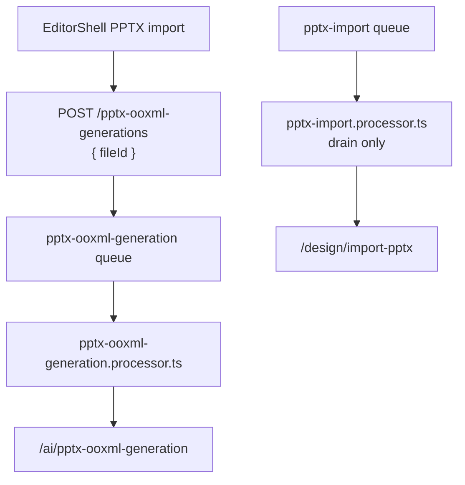
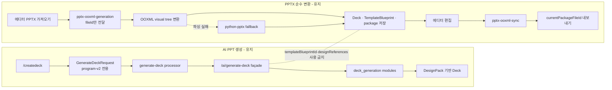
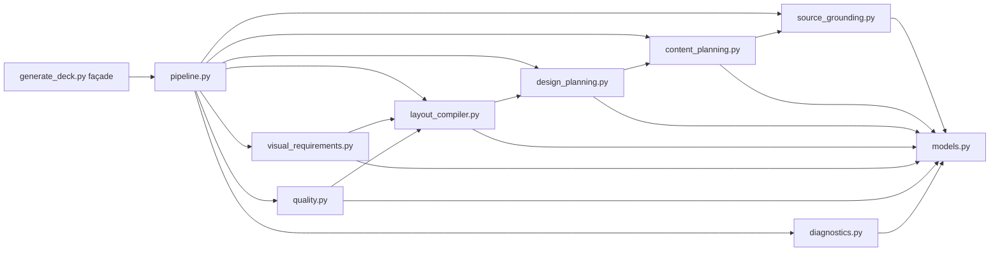
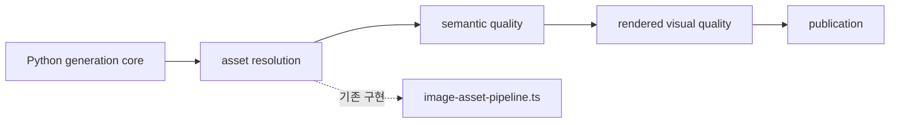
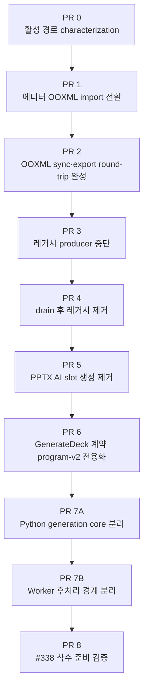
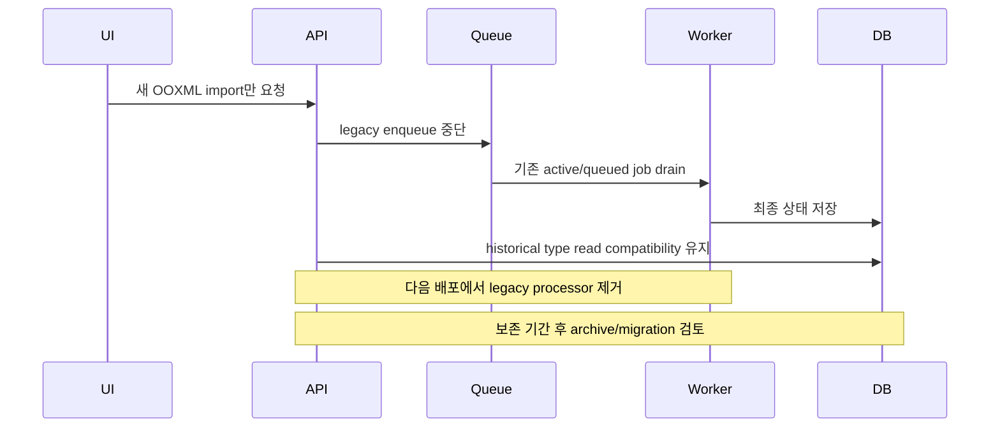
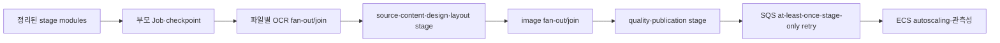

# Issue #338 선행 작업: AI PPT 활성 경로 정리와 `generate_deck.py` 분리 계획

**작성일**: 2026-07-14

**상태**: 확정 · 실행 중 (#341 완료)

**기준 브랜치**: 각 PR 시작 시점의 최신 `origin/develop`

**실행 이슈**: [#339 PPT 생성 - #338 선행 활성 경로 정리 및 generate_deck.py 분리](https://github.com/na-man-mu-303-team2/Orbit/issues/339)

**선행 버그 이슈**: [#341 Art Director 배경 모드 불일치 정규화](https://github.com/na-man-mu-303-team2/Orbit/issues/341)

**후속 이슈**: [#338 PPT 생성 - AI PPT stage Job·SQS 파이프라인 전환](https://github.com/na-man-mu-303-team2/Orbit/issues/338)

**선행 버그 수정 문서**: `docs/plans/art-director-background-mode-normalization.md`

**후속 설계 문서**: `docs/plans/ai-ppt-sqs-pipeline-refactoring.md`

> 이 문서는 확정된 #339 실행 계약이다. GitHub에서는 이 문서 전문을 최신 기준 댓글로 사용하며 기존 댓글은 기준으로 사용하지 않는다.

## 1. 문서 목적

이 문서는 이슈 #338의 staged BullMQ 기반 단계별 Job과 동일 계약의 SQS transport adapter를 구현하기 전에 반드시 끝내야 하는 선행 작업을 정의한다.

현재 `services/python-worker/app/ai/generate_deck.py`는 `origin/develop` 기준 약 1.4만 줄이며, 현재 UI에서 사용하는 `design-pack + program-v2` 경로와 더 이상 사용하지 않는 생성 경로가 같은 요청 계약·Worker processor·Python 분기 안에 섞여 있다. 이 상태에서 바로 stage job과 checkpoint를 도입하면 다음 문제가 생긴다.

- 실제 서비스 경로와 레거시 경로를 모두 stage 계약에 반영하게 되어 불필요한 호환성 비용이 커진다.
- PPTX를 원본에 가깝게 가져오는 순수 변환 기능과 PPTX 디자인에 AI 내용을 채우는 폐기 대상 기능의 경계가 다시 섞인다.
- 대형 파일을 이동하는 작업과 실행 의미를 바꾸는 작업이 동시에 일어나 회귀 원인을 찾기 어렵다.
- SQS의 at-least-once delivery, stage 재시도, checkpoint 멱등성을 검증하기 전에 현재 동작의 기준선부터 흔들린다.

따라서 #338에 앞서 아래 다섯 가지를 순서대로 완료한다.

1. #341에서 `slides[].backgroundMode`를 canonical source로 삼아 Art Director 배경 중복 필드를 정규화한다.
2. 실제 사용 중인 AI PPT 생성 경로를 `design-pack + program-v2` 하나로 확정한다.
3. PPTX import를 AI 생성과 분리된 OOXML 변환·편집·동기화·내보내기 파이프라인으로 확정한다.
4. 폐기 대상 UI, API, queue, processor, shared schema, Python 분기를 제거한다.
5. #341이 고친 `program-v2` 동작을 변경하지 않은 채 `generate_deck.py`를 #338의 stage 경계에 맞는 Python 모듈로 분리한다.

이 선행 작업에서는 SQS, stage checkpoint, 부모/자식 Job, image fan-out/join을 구현하지 않는다. 해당 기능은 경계가 정리된 뒤 #338에서 구현한다.

## 2. 확인된 현재 구조

### 2.1 현재 사용 중인 AI PPT 생성 경로

현재 제품 UI의 생성 요청은 아래 경로를 사용한다.

```mermaid
flowchart LR
    A["/createdeck"] --> B["AiPptMockupPage"]
    B --> C["POST /api/v1/projects/:projectId/jobs/generate-deck"]
    C --> D["generate-deck queue"]
    D --> E["generate-deck.processor.ts"]
    E --> F["POST /ai/generate-deck"]
    F --> G["generate_deck.py"]
    G --> H["design-pack + program-v2"]
    H --> I["이미지 asset 처리"]
    I --> J["semantic QA · visual QA · repair"]
    J --> K["Deck 저장"]
    K --> L["에디터"]
```



`AiPptMockupPage`는 요청에 `generationMode: "design-pack"`을 명시하고 `design.engineVersion: "program-v2"`를 사용한다. 다음 기능은 이 활성 경로의 일부이므로 유지해야 한다.

- Saved DesignPack CRUD와 snapshot 선택
- 색상 옵션과 폰트 추천
- PPT advisor와 presentation brief/coaching context
- 첨부자료 업로드, OCR, reference policy, web research
- 이미지 검색·생성·저장
- semantic QA, deterministic validation, rendered visual QA, repair
- 최종 `Deck` 저장과 에디터 진입
- `packages/shared`의 최종 Deck 및 Job 계약

### 2.2 현재 섞여 있는 레거시 경로

공통 요청 schema는 현재 다음 조합을 허용한다.

- `generationMode`: `legacy | design-pack`
- `design.engineVersion`: `recipe-v1 | program-v2`
- `designReferences`
- `templateBlueprintId`

Worker와 Python은 이 값을 기준으로 구형 recipe와 imported PPTX design/template 재사용 분기를 수행한다. 제품 UI가 더 이상 호출하지 않더라도 코드와 계약에 남아 있기 때문에 #338의 stage 입력을 설계할 때 잘못된 필수 요구사항으로 굳어질 위험이 있다.

### 2.3 PPTX import baseline과 현행 상태

아래 불일치는 계획 작성 당시 baseline이며 #339 PR 1~PR 3에서 해소되었다. 현재 에디터는 `{ fileId }`만 `POST /pptx-ooxml-generations`에 전달하고, 구형 `/pptx-imports` API module과 신규 enqueue helper는 해제되어 있다. 구형 queue consumer는 이미 queued/active인 Job drain을 위해 PR 4까지 유지한다.



`PptxOoxmlGenerationRequest`의 legacy optional AI 입력 축소는 PR 5에서 수행한다. 다만 활성 Editor click path는 이미 `{ fileId }`만 보내므로 import 중 AI 문구 교체를 요청하지 않는다.

PR 2부터 imported Deck export는 저장 version과 `ooxmlSyncedDeckVersion`이 일치하는 최신 `TemplateBlueprint.currentPackageFileId`를 별도 export asset으로 복사한다. 일반 Deck만 기존 `/ai/export-deck-pptx` 재구성 경로를 사용한다.

### 2.4 #338이 해결할 동시 처리·부분 재시도 문제와의 관계

현재 AI PPT 생성은 하나의 큰 `generate-deck` job이 Python `/ai/generate-deck` 호출과 후속 이미지·QA·저장을 오래 점유한다. 같은 queue에 요청이 여러 건 들어왔을 때 consumer concurrency가 제한되어 있으면 앞 요청 전체가 끝나기 전까지 다음 요청이 기다린다. 이 상태에서 Worker process 수만 늘리더라도 다음 병목이 그대로면 기대한 개선이 나오지 않는다.

- 하나의 job 안에 source grounding, content, design, layout, image, quality 작업이 묶여 있어 단계별 자원 배분을 할 수 없다.
- 실패 단위가 전체 `generate-deck`이므로 마지막 quality 단계의 실패도 앞선 LLM·이미지 작업을 다시 수행하게 한다.
- 이미지와 같은 병렬화 가능 작업이 하나의 긴 실행 흐름 안에서 join 지점을 명시하지 못한다.
- Python worker와 외부 provider의 동시성·rate limit이 queue 소비량과 분리되어 있지 않다.

AWS SQS는 이 문제를 해결하는 실행 기반이 될 수 있지만, 현재의 큰 job을 그대로 SQS로 옮기는 것만으로는 해결되지 않는다. #338의 핵심은 이 문서에서 준비한 stage 함수를 business checkpoint 단위 job으로 만들고, 자원 특성에 맞는 queue에 배치하며, 실패한 stage 또는 image slide만 다시 전달하는 것이다.

특히 web research 품질 게이트에서 “공식 출처와 독립 출처가 충분하지 않다”는 판정은 무조건 전체 생성 실패가 되어서는 안 된다. #338에서는 reference policy와 사용자 요청에 따라 다음 상태를 구분해야 한다.

- **retryable**: 일시적 검색/provider 오류이므로 해당 source-grounding job만 재시도한다.
- **degraded success**: 검색은 완료됐지만 출처 다양성이 부족하다. 확보한 근거와 warning을 다음 단계로 전달해 생성을 계속한다.
- **terminal failure**: `references-only`처럼 근거가 반드시 필요한 정책인데 사용 가능한 source가 전혀 없고, 정해진 재시도도 소진했다.

이 선행 작업은 위 상태 전이를 구현하지 않는다. 대신 `source_grounding.py`와 `SourceGroundingResult`가 source, 품질 판정, warning을 분리해 #338에서 전체 파이프라인을 다시 뜯지 않고 정책을 연결할 수 있게 한다.

현재 첨부자료 OCR도 `reference-extract` BullMQ Job 하나에 여러 파일과 `contentBase64`를 묶어 `/documents/parse`로 전달한다. 파일 하나의 실패가 요청 전체의 재시도로 이어지고, 첨부자료 요청이 몰리면 이후 stage를 분리해도 OCR이 앞단 병목으로 남는다. #339에서는 이 동작을 회귀 테스트로 고정해 삭제나 품질 회귀를 막고, 실제 전환은 #338의 staged BullMQ 경로에서 시작한 뒤 같은 stage 계약을 SQS transport adapter로 연결한다.

- `reference-extract-file`을 파일별 Job으로 fan-out한다.
- message에는 binary나 base64가 아니라 `{ pipelineJobId, projectId, stage: "reference-extract-file", shardKey: fileId }`만 전달한다.
- 각 파일 결과를 `stage=reference-extract-file`, `shardKey=fileId` checkpoint에 저장한다.
- 실패한 파일만 재시도하고 모든 필수 파일이 종료되면 `source-grounding`을 enqueue한다.
- `topic-only`, `user-input-only` 요청은 OCR stage를 즉시 skip한다.

## 3. 목표 경계

### 3.1 AI PPT 생성과 PPTX import를 분리한다



두 파이프라인은 최종 Deck schema, Project Asset, Job 상태 같은 공통 인프라는 공유할 수 있다. 그러나 AI 콘텐츠 생성 단계가 PPTX 원본 package 또는 content slot을 입력으로 사용해서는 안 된다.

### 3.2 Python 생성 코어의 목표 모듈 구조

선행 작업 완료 시 `/ai/generate-deck`와 공개 response 계약은 유지하고, Python 내부만 다음 구조로 정리한다.

```text
services/python-worker/app/ai/
├── generate_deck.py                 # 얇은 호환 façade와 공개 import
└── deck_generation/
    ├── __init__.py                  # 의도적으로 공개할 API만 export
    ├── models.py                    # Pydantic request/response 및 stage DTO
    ├── pipeline.py                  # 현재 동기식 program-v2 orchestration
    ├── source_grounding.py          # 첨부자료·웹 출처 정규화와 근거 묶음
    ├── content_planning.py          # 발표 흐름·슬라이드 내용 계획
    ├── design_planning.py           # DesignPack·색상·폰트·visual plan
    ├── layout_compiler.py           # composition 선택과 편집 가능한 요소 생성
    ├── visual_requirements.py       # 이미지가 필요한 element와 검색·생성 요구사항 작성
    ├── quality.py                   # Python 내부 content/layout validation과 repair primitive
    └── diagnostics.py               # warnings·validation·diagnostics 조립
```

모듈 이름과 소유권은 아래 구조로 고정하며 다음 의존 방향을 지켜야 한다.



`pipeline.py`만 전체 흐름을 조립한다. 하위 stage 모듈이 `pipeline.py`나 façade를 역으로 import하면 안 된다. mutable global state와 import 시점 side effect도 새 모듈로 옮기지 않는다.

Python은 이미지 요구사항을 만드는 데까지만 책임진다. 실제 이미지 검색·생성·storage 저장·Deck element 적용은 현재 `apps/worker/src/image-asset-pipeline.ts`에 있고, semantic QA와 rendered visual review/repair 및 최종 Deck 저장은 `apps/worker/src/generate-deck.processor.ts`에 있다. #338에서 queue adapter를 바로 연결하려면 Python 분리와 함께 TypeScript 후처리도 아래 경계로 추출해야 한다.

```text
apps/worker/src/generate-deck/
├── pipeline.ts                    # 현재 Worker 후처리 orchestration
├── asset-resolution.ts            # image-asset-pipeline 호출과 결과 적용
├── semantic-quality.ts            # semantic QA와 deterministic validation
├── rendered-visual-quality.ts     # render, visual review, repair loop
└── publication.ts                 # 최종 Deck·diagnostics·Job result 저장
```



이 TypeScript 모듈도 선행 작업에서는 현재 processor가 동기 호출한다. queue enqueue, checkpoint 저장, retry 정책은 #338에서 각 경계 바깥에 adapter로 추가한다.

## 4. 범위

### 4.1 반드시 유지할 기능

#### 일반 AI PPT 생성

- `/createdeck`의 현재 AI PPT 생성 UX
- `generate-deck` API, queue, processor
- Python `/ai/generate-deck`
- `design-pack + program-v2`
- Saved DesignPack
- 첨부자료 OCR, web research, reference policy
- 이미지 asset 처리
- semantic QA, rendered visual QA, repair
- Deck 저장과 에디터 연결

#### PPTX import 및 round-trip

- `pptx-ooxml-generation` API, queue, processor
- Python `/ai/pptx-ooxml-generation`
- `import_pptx_design_with_optional_ooxml_vector()`
- OOXML visual tree importer
- `python-pptx` fallback importer
- 이미지·표·차트·도형 fallback
- 슬라이드 PNG 렌더링
- `template_blueprints` DB 테이블
- `packages/shared/src/deck/template-blueprint.schema.ts`와 `templateBlueprintIdSchema`
- `sourcePackageFileId`, `currentPackageFileId`, `ooxmlSyncedDeckVersion`
- slide별 `elementSources`, `slidePart`, `shapeId`, `relationshipId`, `writable`, `fallbackReason`
- render asset ID
- 변환된 Deck과 source/current PPTX package asset 저장
- `pptx-ooxml-sync`
- 에디터의 PPTX import UI
- 일반 Deck 및 imported Deck의 PPTX export

`TemplateBlueprint`는 레거시 AI template 생성 기능과 이름이 비슷하지만 삭제 대상이 아니다. PPTX의 편집 가능한 Deck 요소를 원본 OOXML shape에 다시 매핑하는 round-trip 계약으로 유지한다.

### 4.2 제거할 기능

> **삭제 경계**: `TemplateBlueprint` 자체는 삭제하지 않는다. 제거 대상은 일반 AI PPT 생성 요청에서 기존 PPTX template을 불러오기 위한 `GenerateDeckRequest.templateBlueprintId` 필드와 그 필드를 처리하는 AI 생성 분기뿐이다. `templateBlueprintSchema`, `templateBlueprintIdSchema`, `template_blueprints` DB 테이블, PPTX OOXML 변환 결과의 `templateBlueprint`, 요소 매핑, generation/sync 기능은 모두 유지한다.

#### 구형 UI와 route

- `/mockup/ai-ppt`
- `HomePage`의 구형 AI PPT 생성기
- `GenerateDeckView`

#### 구형 생성 API와 queue

- `ai-template-deck-generation` API/module/service
- `ai-template-deck-generation` queue와 processor
- `packages/shared/src/deck/ai-template-deck-generation.schema.ts`와 해당 테스트

여기서 제거하는 shared schema는 `ai-template-deck-generation.schema.ts`만 의미한다. `packages/shared/src/deck/template-blueprint.schema.ts`와 해당 테스트는 삭제 대상이 아니다.

#### 일반 AI 생성기의 레거시 분기

- `generationMode: "legacy"`
- `design.engineVersion: "recipe-v1"`
- `legacy + recipe-v1`
- `design-pack + recipe-v1`
- `GenerateDeckRequest.designReferences`
- 일반 AI 생성 request의 `GenerateDeckRequest.templateBlueprintId` 필드만 제거
- 해당 request 필드를 사용해 PPTX template을 불러오는 `generate-deck.processor.ts`의 `resolveDesignTemplate()` 분기
- 일반 AI 콘텐츠를 imported PPTX design/template에 채우는 `generate_deck.py` 분기

위 세 항목은 일반 AI 생성기와 PPTX template 재사용 사이의 연결만 제거한다. `pptx-ooxml-generation`이 생성하는 TemplateBlueprint와 `pptx-ooxml-sync`가 사용하는 원본 OOXML 요소 매핑에는 영향을 주지 않는다.

#### PPTX OOXML의 AI 내용 삽입

- `PptxOoxmlGenerationRequest.topic`
- `PptxOoxmlGenerationRequest.prompt`
- Python endpoint의 OpenAI API key/model 전달
- `wants_ai` 분기
- `generate_content_slot_texts()`
- AI 문구를 원본 content slot에 삽입하는 처리
- `/ai/pptx-ooxml-apply-slot-texts`
- `apply_slot_texts_to_pptx_ooxml()`와 제거 후 호출되지 않는 slot overwrite helper

### 4.3 이 선행 작업에서 하지 않을 일

- SQS queue 생성 또는 BullMQ 전체 교체
- 부모/자식 Job, stage checkpoint 테이블 도입
- stage별 재시도와 DLQ 정책 구현
- image slide fan-out/join 구현
- ECS task autoscaling 변경
- AI 결과 품질 정책 자체의 재설계
- DesignPack 삭제 또는 BrandKit 재도입
- `TemplateBlueprint` 삭제
- 공개 `/ai/generate-deck` endpoint를 여러 endpoint로 분할
- `reference-extract`를 staged BullMQ 파일별 fan-out/join으로 전환하거나 SQS transport adapter를 구현하는 작업. 이 항목은 #338에서 수행한다.

BrandKit runtime과 organization 기반 기능은 이미 `origin/develop`의 활성 생성 경로에서 제거된 상태이므로 이 계획에서 다시 다루지 않는다. 과거 create migration과 이후 drop migration은 적용 이력 재현을 위해 유지하며 삭제하거나 수정하지 않는다. DesignPack은 현재 활성 기능이므로 모든 단계에서 보존한다.

## 5. 변경 불변조건

아래 조건은 모든 PR에서 유지되어야 한다.

1. `/createdeck`에서 생성한 동일한 유효 request는 분리 전후 동일한 공개 response schema를 만족한다.
2. 최종 Deck은 `packages/shared`의 `deckSchema`를 통과한다.
3. `DesignPack` 선택, palette/font override, reference, image, QA 동작을 파일 분리 과정에서 변경하지 않는다.
4. PPTX import request는 최종적으로 `{ fileId }`만 받으며 AI provider를 호출하지 않는다.
5. PPTX 변환은 vector importer 실패 시 `python-pptx` fallback을 유지한다.
6. imported Deck은 source/current package, 요소 매핑, render asset을 잃지 않는다.
7. imported Deck의 편집 후 `pptx-ooxml-sync` 결과가 export에 사용된다.
8. 기존 Job 상태값 `queued`, `running`, `succeeded`, `failed`와 공통 envelope를 유지한다.
9. 로그에 prompt 원문, 첨부자료 원문, API key, base64 파일을 새로 기록하지 않는다.
10. `GenerateDeckRequest.designReferences`와 `GenerateDeckRequest.templateBlueprintId`만 제거한다. 기존 저장 Deck의 `metadata.createdFrom.designReferences`와 OOXML이 사용하는 `templateBlueprintIdSchema`는 historical read 및 round-trip 계약이므로 유지한다.
11. 기존 `reference-extract` API·Job 결과 계약과 OCR 성공/부분 실패 동작은 #339에서 회귀 테스트로 보존한다. transport 공통 stage message와 파일별 checkpoint 계약은 #338에서 변경한다.
12. 이동과 의미 변경을 한 PR에 섞지 않는다. 먼저 제거·계약 정리, 그 다음 동작 보존형 모듈 이동을 한다.

## 6. 실행 의존성



PR은 위 순서대로 선형 진행한다. PR 3에서는 신규 enqueue만 중단하고 consumer를 유지하며, PR 4는 두 레거시 queue의 queued/active가 모두 0인 증거를 확인한 뒤 제거한다. `generate_deck.py`의 실제 대규모 이동은 모든 삭제와 계약 축소가 끝난 PR 7A에서만 수행한다.

각 PR은 최신 `develop`에서 `refactor/ai-ppt-pre-338-*` 형식의 독립 브랜치로 시작하고 GitHub Flow로 병합한다. 이미 push된 공유 브랜치에는 rebase 또는 force push를 하지 않는다. 선행 PR이 병합된 뒤 다음 PR 브랜치를 최신 `develop`에서 새로 만들면 선형 review 단위와 rollback 경계가 분명해진다.

## 7. PR 단위 실행 계획

### PR 0. 현재 활성 경로 고정과 회귀 기준선 작성

**선행 조건**: #341 완료

**목표**: 코드를 삭제하거나 이동하기 전에 #341이 고친 제품 경로의 입력·출력·provider 호출 순서를 테스트로 고정한다.

**주요 파일**

- `apps/web/src/features/ai-ppt/AiPptMockupPage.test.ts`
- `apps/api/src/generate-deck/generate-deck.service.spec.ts`
- `apps/worker/src/generate-deck.processor.spec.ts`
- `packages/shared/src/deck/generate-deck.schema.test.ts`
- `services/python-worker/tests/test_generate_deck_contract.py`
- 필요한 경우 작은 deterministic fixture

**작업**

1. `/createdeck` submit payload가 `design-pack + program-v2`인지 명시적으로 검증한다.
2. API가 request를 Job payload에 보존하고 `generate-deck` queue에 넣는 계약을 검증한다.
3. Worker가 Python `/ai/generate-deck`, 이미지 처리, QA/repair, Deck 저장을 수행하는 주요 시나리오를 고정한다.
4. Python에서 외부 provider를 mock한 deterministic request fixture를 선택한다.
5. fixture에 대해 response의 전체 byte equality 대신 아래 의미 필드를 snapshot 또는 명시 assertion으로 고정한다.
   - slide 수와 순서
   - slide/element ID 안정성
   - element type과 핵심 bounds/text
   - animation 배열
   - validation, warnings, diagnostics shape
6. 파일 분리 전 기준 결과를 저장하고, 이후 PR 7A와 PR 7B에서도 같은 fixture를 사용한다.
7. 현재 `reference-extract`의 단일 파일·다중 파일·부분 실패 결과 계약을 고정한다. #339에서는 queue 방식과 payload를 변경하지 않는다.
8. Art Director의 `backgroundSequence` 불일치가 `slides[].backgroundMode` 기준으로 한 번의 호출에서 정규화되는지 고정한다.
9. 정규화 후 design program snapshot과 slide별 `compositionPlan.backgroundMode`가 계속 일치하는지 검증한다.
10. 복구 불가능한 Art Director 응답만 안전한 사용자 오류로 실패하고 raw provider/Pydantic payload를 노출하지 않는지 검증한다.

**검증**

```bash
pnpm --filter @orbit/shared test
pnpm --filter @orbit/web test
pnpm --filter @orbit/api test
pnpm --filter @orbit/worker test
cd services/python-worker
uv run pytest tests/test_generate_deck_contract.py
```

**완료 기준**

- 제품 경로가 `program-v2`임을 테스트가 증명한다.
- `slides[].backgroundMode`가 Art Director 배경 모드의 canonical source임을 테스트가 증명한다.
- 모듈 이동 전후 비교에 사용할 deterministic fixture가 있다.
- 테스트를 통과하지 않은 기존 동작은 기준선으로 승인하지 않고 원인을 기록한다.

**롤백**: 테스트만 추가하므로 제품 동작 변경은 없다.

### PR 1. 에디터 PPTX import를 OOXML generation으로 전환

**의존성**: PR 0

**목표**: 에디터 버튼이 구형 `/pptx-imports`가 아니라 `/pptx-ooxml-generations`를 호출하도록 한다.

**주요 파일**

- `apps/web/src/features/editor/shell/EditorShell.tsx`
- 에디터 import 관련 테스트
- `apps/api/src/pptx-ooxml-generations/*`
- `apps/worker/src/pptx-ooxml-generation.processor.ts`
- `packages/shared/src/deck/pptx-ooxml-generation.schema.ts`

**작업**

1. 업로드된 PPTX의 `fileId`를 `/pptx-ooxml-generations`에 전달한다.
2. 생성된 Job을 기존 공통 Job polling 흐름으로 추적한다.
3. 성공 결과의 `deckId`로 에디터를 갱신하거나 진입한다.
4. 오류 메시지는 vector import 실패 자체가 아니라 최종 fallback까지 실패했을 때만 노출한다.
5. 아직 구형 endpoint를 삭제하지 않고 rollback 기간 동안 유지한다. 새 enqueue만 OOXML 경로로 전환한다.

**필수 테스트**

- UI가 `{ fileId }`로 OOXML endpoint를 호출한다.
- API가 프로젝트 소유권, asset status, MIME type, purpose를 검증한다.
- Worker가 `/ai/pptx-ooxml-generation`을 호출한다.
- vector importer 성공 결과가 편집 가능한 Deck 요소로 저장된다.
- vector importer 실패 시 `python-pptx` fallback이 동작한다.
- 이미지·표·차트·도형 fallback과 slide PNG가 보존된다.

**완료 기준**

- 에디터의 실제 import click path에서 `/pptx-imports` 요청이 발생하지 않는다.
- import 완료 후 Deck, TemplateBlueprint, source/current package, render asset이 모두 조회된다.
- 최소 1개의 vector 성공 fixture와 1개의 fallback fixture가 회귀 테스트를 통과한다.

**롤백**: UI endpoint만 구형 `/pptx-imports`로 되돌릴 수 있도록 이 PR에서는 구형 코드를 삭제하지 않는다.

### PR 2. imported Deck의 OOXML sync와 export round-trip 완성

**의존성**: PR 1

**목표**: 가져온 PPTX를 편집한 뒤 OOXML package에 동기화하고, export 시 재구성된 새 PPTX가 아니라 최신 `currentPackageFileId`를 사용한다.

**주요 파일**

- `apps/worker/src/pptx-ooxml-sync.processor.ts`
- `apps/worker/src/deck-export.processor.ts`
- 관련 API/service와 테스트
- `packages/shared/src/deck/template-blueprint.schema.ts`
- `packages/shared/src/deck/deck-export.schema.ts`

**작업**

1. imported Deck의 PUT 저장과 patch 저장 모두 sync를 enqueue하고 version을 비교한다.
2. `ooxmlSyncedDeckVersion === deck.version`이면 현재 package가 최신임을 보장한다.
3. 같은 Deck의 sync job은 `deckId` 기반 PostgreSQL advisory lock으로 직렬화해 여러 Worker process에서도 동시에 package를 쓰지 못하게 한다.
4. TemplateBlueprint 갱신은 `ooxmlSyncedDeckVersion`이 현재 저장값보다 큰 경우에만 성공하는 조건부 update로 만든다. 낮은 version의 stale 결과는 package와 blueprint를 덮어쓰지 않고 폐기한다.
5. 편집이 빠르게 연속 저장되면 pending sync를 최신 Deck version으로 coalesce하되, 실행 중 job의 결과가 최신 version을 역행시키지 않게 한다.
6. imported Deck export 분기를 추가한다.
   - 연결된 TemplateBlueprint와 `currentPackageFileId`가 있으면 최신 sync 완료를 확인한다.
   - 최신 sync가 아니면 stale package를 반환하지 않고 export Job을 retry한다.
   - 최신 `currentPackageFileId`의 asset을 별도 export asset으로 복사해 결과로 제공한다.
7. sync 실패 후 export는 오래된 package를 성공 결과로 내보내지 않고, 명시적인 retryable error 또는 사용자에게 설명 가능한 실패 상태를 반환한다.
8. 일반 AI 생성 Deck 또는 TemplateBlueprint가 없는 Deck은 기존 `/ai/export-deck-pptx` 경로를 유지한다.
9. project ownership과 asset status를 재검증한다.

**필수 테스트**

- import 직후 export가 current package를 반환한다.
- 텍스트·이미지 등 writable 요소 수정 후 sync된 package가 export된다.
- stale `ooxmlSyncedDeckVersion` 상태에서 이전 package를 잘못 내보내지 않는다.
- v2와 v3 sync 완료 순서가 역전돼도 최종 package와 `ooxmlSyncedDeckVersion`은 v3이다.
- sync 실패 후 export가 stale package를 성공으로 반환하지 않는다.
- export 대기 중 추가 편집이 발생하면 새 최신 version을 기준으로 완료 여부를 다시 판정한다.
- 일반 AI Deck export는 기존 Python exporter를 계속 사용한다.
- 다른 프로젝트의 `currentPackageFileId`를 사용할 수 없다.

**완료 기준**

- `PPTX import → edit → save → OOXML sync → export` 통합 테스트가 통과한다.
- exported PPTX를 재-import했을 때 수정된 writable 요소가 유지된다.
- 원본에서 fallback 처리된 비가역 요소는 문서화된 warning으로 남고 package 자체는 손상되지 않는다.

**롤백**: imported Deck export 분기만 비활성화하면 기존 generic exporter로 돌아간다. 단, round-trip 품질 저하는 명시적으로 허용한 상태에서만 롤백한다.

### PR 3. 레거시 producer 중단

**의존성**: PR 2

**목표**: `pptx-import`와 `ai-template-deck-generation`의 신규 enqueue를 모두 중단하되 기존 queued/active Job을 처리할 consumer는 유지한다.

**주요 파일**

- `apps/web/src/App.tsx`
- 구형 `HomePage`, `GenerateDeckView`, `/mockup/ai-ppt` 관련 파일
- `apps/api/src/pptx-imports/*`
- `apps/api/src/ai-template-deck-generation/*`
- `packages/shared/src/jobs/job.schema.ts`
- `packages/job-queue/src/index.ts`
- 관련 module 등록과 테스트

**작업**

1. production navigation과 direct route 참조를 다시 검색한다.
2. `/createdeck`와 `AiPptMockupPage`는 유지한다.
3. `/mockup/ai-ppt`, 구형 HomePage 생성 submit과 `GenerateDeckView` export를 제거한다.
4. `/pptx-imports`와 `ai-template-deck-generation` 생성 endpoint를 앱 module에서 해제해 신규 enqueue를 막는다.
5. `publicCreatableJobTypeSchema`와 신규 enqueue 함수에서 `pptx-import`, `ai-template-deck-generation`을 제거한다.
6. 두 queue의 consumer, processor, queue 등록과 active schema는 drain을 위해 그대로 유지한다.
7. `historicalJobTypeSchema`에는 두 type을 유지해 완료 이력을 계속 읽는다.

**필수 테스트**

- 에디터 import click path가 `/pptx-ooxml-generations`만 호출한다.
- removed UI route가 navigation에 노출되지 않는다.
- 두 레거시 endpoint와 신규 Job 생성 경로가 enqueue를 만들지 않는다.
- 기존 두 consumer와 historical Job parsing은 계속 동작한다.
- `/createdeck`와 PPTX OOXML generation/sync 회귀 테스트가 통과한다.

**완료 기준**

- 코드와 공개 route에서 두 레거시 Job의 신규 enqueue 경로가 없다.
- 두 queue consumer는 기존 queued/active Job의 drain을 위해 유지된다.

### PR 4. drain 후 레거시 제거

**의존성**: PR 3

**목표**: `pptx-import`와 `ai-template-deck-generation` queue가 모두 drain된 뒤 API 잔여 코드, consumer, queue 등록과 active schema를 제거한다.

**주요 파일**

- `apps/api/src/pptx-imports/*`
- `apps/api/src/ai-template-deck-generation/*`
- `apps/worker/src/pptx-import.processor.ts`
- `apps/worker/src/ai-template-deck-generation.processor.ts`
- `apps/worker/src/worker.service.ts`
- `packages/shared/src/deck/ai-template-deck-generation.schema.ts`
- `packages/shared/src/jobs/job.schema.ts`
- `packages/job-queue/src/index.ts`
- 관련 API/Worker module 등록과 테스트

**작업**

1. 두 queue의 queued/active가 모두 0이고 PR 3 이후 신규 enqueue가 없다는 운영 증거를 확인한다.
2. 두 레거시 controller, service, module, processor와 queue 등록을 제거한다.
3. active/create schema와 runtime dispatch에서 두 Job type을 제거한다.
4. `historicalJobTypeSchema`와 DB read 경로에는 두 type을 유지한다.
5. `packages/shared/src/deck/ai-template-deck-generation.schema.ts`와 실행 전용 request schema를 제거하되 TemplateBlueprint schema와 DB table은 유지한다.
6. 완료 이력의 보존 기간 이후 archive와 enum 축소는 별도 TypeORM migration 및 운영 계획으로 수행한다.

**필수 테스트**

- API와 Worker module이 두 레거시 경로 없이 기동한다.
- Worker가 두 레거시 queue를 구독하지 않는다.
- 과거 두 Job type row가 전체 Job 목록 parsing을 깨뜨리지 않는다.
- `/createdeck`, OOXML import·sync·export, TemplateBlueprint 테스트가 통과한다.

**완료 기준**

- 코드 검색에서 두 레거시 endpoint·queue·processor의 실행 참조가 없다.
- 두 queue의 drain 증거와 historical Job 처리 방침이 PR 본문에 기록된다.

### PR 5. PPTX OOXML의 AI slot 생성 제거와 request 축소

**의존성**: PR 4

**목표**: PPTX OOXML generation을 `{ fileId }`만 받는 순수 변환으로 만든다.

**주요 파일**

- `packages/shared/src/deck/pptx-ooxml-generation.schema.ts`
- `apps/api/src/pptx-ooxml-generations/*`
- `apps/worker/src/pptx-ooxml-generation.processor.ts`
- `services/python-worker/app/main.py`
- `services/python-worker/app/ai/pptx_ooxml_generation.py`
- `services/python-worker/tests/test_pptx_ooxml_generation.py`

**작업**

1. shared request를 strict `{ fileId }`로 축소해 `topic`, `prompt`와 모든 extra field를 거부한다.
2. API와 Worker가 Python form에 `topic`, `prompt`, OpenAI model/key 관련 값을 전달하지 않게 한다.
3. Python endpoint signature를 pure conversion 입력으로 축소한다.
4. `wants_ai`, `generate_content_slot_texts()`, AI text replacement를 제거한다.
5. `/ai/pptx-ooxml-apply-slot-texts`와 `apply_slot_texts_to_pptx_ooxml()`를 제거한다.
6. 제거 후 dead code가 된 slot overwrite helper와 import만 삭제한다.
7. slot metadata 자체는 TemplateBlueprint mapping에 필요할 수 있으므로, AI 문구 생성과 무관한 mapping 정보는 유지한다.

**필수 테스트**

- `topic` 또는 `prompt`가 전달되면 계약 수준에서 거부되거나 무시되지 않고 명확히 실패한다.
- OpenAI client를 제공하지 않아도 PPTX import가 성공한다.
- 변환된 텍스트가 원본과 동일하다.
- vector/fallback, package asset, mapping, render image 테스트 통과
- `/ai/pptx-ooxml-apply-slot-texts` route 미등록 확인

**완료 기준**

- PPTX import call graph에 LLM provider 호출이 없다.
- request의 유일한 비인프라 입력은 `fileId`다.
- import 결과의 content slot이 AI 생성 문구로 바뀌지 않는다.

### PR 6. 일반 AI 생성 계약을 `program-v2` 전용으로 정리

**의존성**: PR 5

**목표**: 일반 AI PPT 생성에서 레거시 mode/engine과 PPTX 디자인 재사용 입력을 제거한다.

**주요 파일**

- `packages/shared/src/deck/generate-deck.schema.ts`
- `packages/shared/src/deck/generate-deck.schema.test.ts`
- `apps/web/src/features/ai-ppt/AiPptMockupPage.tsx`
- `apps/api/src/generate-deck/*`
- `apps/api/src/saved-design-packs/saved-design-packs.service.ts`
- `apps/api/src/saved-design-packs/saved-design-packs.service.spec.ts`
- `apps/worker/src/generate-deck.processor.ts`
- `apps/worker/src/generate-deck.processor.spec.ts`
- `services/python-worker/app/ai/generate_deck.py`
- `services/python-worker/tests/test_generate_deck_contract.py`

**작업**

1. public request에서 `generationMode`를 제거하고 core에서는 `design-pack`을 내부 상수로 사용한다.
2. public request에서 `design.engineVersion`을 제거하고 core에서는 `program-v2`를 내부 상수로 사용한다.
3. `GenerateDeckRequest.designReferences`, `GenerateDeckRequest.templateBlueprintId`를 request와 Worker payload에서 제거한다. 저장된 Deck의 `metadata.createdFrom.designReferences`와 공용 `templateBlueprintIdSchema`는 삭제하지 않는다.
4. `resolveDesignTemplate()`와 관련 asset/template 조회 분기를 제거한다.
5. Python의 `legacy`, `recipe-v1`, imported design/template blueprint 분기와 전용 model/helper를 삭제한다.
6. `saved-design-packs.service.ts`의 `resolveGenerationRequest()`가 제거된 `generationMode`에 의존하지 않도록 program-v2 전용 계약으로 갱신한다.
7. DesignPack, palette/font override, style pack, composition, QA 관련 program-v2 코드는 유지한다.
8. 공통 계약 변경이므로 `docs/contracts.md`에 GenerateDeck request 경계를 갱신하고, 이 목표 계약과 반대되는 V12의 legacy/template 유지 결정을 #339가 대체했음을 표시한다.
9. TypeScript와 Python request schema를 strict하게 유지해 제거된 필드와 모든 extra field를 거부하며 호환 shim은 두지 않는다.

**필수 테스트**

- `legacy`, `recipe-v1`, `designReferences`, `templateBlueprintId` 입력 거부
- `program-v2` request/response contract 통과
- Saved DesignPack selection과 snapshot 적용
- `resolveGenerationRequest()`가 deprecated mode 없이도 Saved DesignPack snapshot을 복원
- 과거 저장 Deck의 `metadata.createdFrom.designReferences` parsing 유지
- PPTX OOXML의 `templateBlueprintIdSchema` parsing 유지
- reference policy, image asset, QA/repair, Deck 저장 회귀 테스트
- `generate_deck.py` 내부에서 TemplateBlueprint importer를 참조하지 않음

**완료 기준**

- 일반 AI 생성 call graph가 PPTX import 모듈이나 TemplateBlueprint DB를 사용하지 않는다.
- 활성 UI 요청에 deprecated field가 없다.
- shared TypeScript schema와 Python Pydantic model의 허용 필드가 일치한다.

### PR 7A. `generate_deck.py`의 Python generation core를 stage 경계로 분리

**의존성**: PR 6

**목표**: 동작을 바꾸지 않고 #338이 stage job을 연결할 수 있는 내부 모듈 경계를 만든다.

**분리 원칙**

- 한 번에 파일 전체를 기계적으로 옮기지 않는다.
- 순수 model/utility부터 이동하고 각 commit마다 Python 테스트를 통과시킨다.
- 공개 `generate_deck()` import와 `/ai/generate-deck` request/response는 유지한다.
- 함수 시그니처는 future queue message가 아니라 현재 in-process 호출에 맞춘다.
- stage 결과는 Pydantic model로 정의하되 DB checkpoint나 SQS envelope를 미리 넣지 않는다.
- 외부 provider, clock, ID generator, storage 접근은 명시적 dependency로 전달한다.

**권장 stage DTO**

| DTO | 최소 책임 | 금지 사항 |
| --- | --- | --- |
| `SourceGroundingResult` | 정규화된 첨부자료·웹 source, 인용 가능한 근거, warning | raw file/base64, API key 포함 |
| `ContentPlan` | 발표 narrative, slide별 objective·copy·source link | layout 좌표와 provider client 포함 |
| `DesignPlan` | DesignPack snapshot, palette/font, composition/visual intent, `slides[].backgroundMode`에서 파생한 background sequence | 최종 Deck element 직접 저장 |
| `LayoutCompileResult` | 편집 가능한 slide/element 초안과 image requirement | QA 성공으로 간주 |
| `VisualRequirements` | slide/element별 image 검색·생성 요구사항 | asset 검색·생성·DB 저장 수행 |
| `PythonQualityResult` | Python 내부 content/layout validation과 repair 결과 | rendered visual QA 또는 DB Job 상태 변경 |

이 DTO는 #338에서 checkpoint payload schema의 출발점이 되지만, 선행 PR에서는 프로세스 내부 객체로만 사용한다.

**이동 순서**

1. Pydantic model과 공통 type alias를 `models.py`로 이동한다.
2. side effect 없는 normalization·selection helper를 각 소유 stage로 이동한다.
3. source grounding을 추출하고 기존 fixture로 결과를 비교한다.
4. content planning을 추출하고 source attribution 보존을 확인한다.
5. design planning과 DesignPack 적용을 추출한다. #341의 background 정규화와 불변조건 테스트도 같은 module로 이동한다.
6. layout compiler와 editable element 생성을 추출한다.
7. image 요구 계획만 `visual_requirements.py`로 추출한다. 실제 asset 처리와 결과 적용은 Worker 소유로 유지한다.
8. Python 내부 content/layout validation과 repair primitive만 `quality.py`로 추출한다. Worker의 semantic/rendered visual QA를 옮기지 않는다.
9. warnings/validation/diagnostics 조립을 `diagnostics.py`로 추출한다.
10. `pipeline.py`가 위 단계를 현재와 같은 순서로 동기 호출하도록 한다.
11. `generate_deck.py`에는 공개 import, façade, 임시 re-export만 남긴다.
12. 모든 call site 전환 후 임시 re-export를 제거한다.

**commit 권장 단위**

- `refactor: 생성 모델 분리`
- `refactor: 출처와 콘텐츠 계획 단계 분리`
- `refactor: 디자인과 레이아웃 단계 분리`
- `refactor: 시각 자료 요구사항 분리`
- `refactor: 품질과 진단 단계 분리`
- `refactor: Deck 생성 호환 façade 정리`

PR은 하나로 유지할 수 있지만 각 commit은 독립적으로 테스트 가능해야 한다. diff review가 불가능할 정도로 move detection과 논리 수정이 섞이면 PR을 둘로 나눈다.

**필수 테스트**

- PR 0 deterministic fixture의 의미 결과가 분리 전후 동일
- 모든 Python contract test 통과
- DesignPack, reference, image, QA별 targeted test 통과
- Art Director background mismatch 정규화와 안전한 실패 테스트 통과
- `generate_deck()` 공개 import와 FastAPI endpoint contract 유지
- import cycle 검사와 mypy 통과
- 동일 request에서 의도하지 않은 animation 추가가 없음

**검증 명령**

```bash
cd services/python-worker
uv sync --locked
uv run ruff check .
uv run mypy app
uv run pytest
```

**완료 기준**

- `generate_deck.py`는 façade와 호환 import만 담당하며 orchestration 본문은 `pipeline.py`에 있다.
- 각 Python stage는 명시적 Pydantic 입력·출력으로 단독 테스트할 수 있다.
- 외부 provider 실패를 stage 함수 단위로 재현할 수 있다.
- 활성 `program-v2` 결과에 의도한 기능 변경이 없다.
- #338에서 Python stage 함수 주위에 queue adapter를 추가할 수 있고 함수 본문을 다시 분해할 필요가 없다.

**롤백**: commit 단위로 façade import를 기존 위치로 되돌릴 수 있어야 한다. 대규모 squash 후 롤백만 가능한 구조로 만들지 않는다.

### PR 7B. TypeScript Worker 후처리를 queue-ready 경계로 분리

**의존성**: PR 7A

**목표**: `generate-deck.processor.ts`에 남아 있는 이미지 asset, semantic QA, rendered visual review/repair, publication을 동작 변경 없이 함수·모듈 경계로 추출한다.

**주요 파일**

- `apps/worker/src/generate-deck.processor.ts`
- `apps/worker/src/image-asset-pipeline.ts`
- 신규 `apps/worker/src/generate-deck/*`
- `apps/worker/src/generate-deck.processor.spec.ts`

**작업**

1. Python response를 받은 이후의 처리 순서와 Job progress 갱신 지점을 characterization test로 고정한다.
2. image requirement를 asset으로 해소하고 Deck element에 적용하는 경계를 `asset-resolution.ts`로 추출한다.
3. semantic QA와 deterministic validation을 `semantic-quality.ts`로 추출한다.
4. render → visual review → repair loop를 `rendered-visual-quality.ts`로 추출한다.
5. 최종 Deck, diagnostics, Job result 저장을 `publication.ts`로 추출한다.
6. `pipeline.ts`가 기존과 같은 순서로 위 함수를 동기 호출하고 `generate-deck.processor.ts`는 Job lifecycle adapter만 담당하게 한다.
7. 각 함수는 입력을 변경하지 않고 새 결과를 반환하도록 하며 DB/Job update는 publication 또는 명시적 adapter로 제한한다.

**필수 테스트**

- 이미지 provider 전체 성공, 일부 실패, 전부 실패 시 기존 fallback 결과 유지
- semantic QA 실패와 repair 결과 유지
- rendered visual review/repair 반복 횟수와 종료 조건 유지
- 중간 단계 오류 시 현재 Job error code와 progress 유지
- publication 재호출 시 Deck/Job 결과 중복 저장에 대한 현재 동작을 명시적으로 고정

**완료 기준**

- `generate-deck.processor.ts`에는 payload validation, Job lifecycle과 `pipeline.ts` 위임만 남고 단계 orchestration은 `pipeline.ts`가 담당한다.
- asset, semantic quality, rendered quality, publication 경계를 각각 단독 테스트할 수 있다.
- PR 7A Python stage와 PR 7B Worker stage를 합쳐 #338의 queue/checkpoint 경계가 완성된다.
- 이 PR 자체에는 queue enqueue, checkpoint, retry 정책이 없다.

### PR 8. #338 착수 준비 검증

**의존성**: PR 7A, PR 7B

**목표**: 레거시 제거와 모듈 분리가 완료되었는지 통합 검증하고 #338의 입력 기준을 확정한다.

**검증 행렬**

| 시나리오 | 기대 결과 |
| --- | --- |
| topic만으로 AI PPT 생성 | `program-v2` Deck 저장 및 에디터 진입 |
| 첨부자료 포함 생성 | OCR/source grounding 결과가 content와 diagnostics에 반영 |
| 현재 reference extraction | 단일·다중 파일의 결과와 오류 계약이 유지되고 #338용 기준선이 확보됨 |
| web research 품질 부족 | #339 시점의 기존 실패 정책과 오류 계약을 그대로 보존하고 #338의 degraded success 전환은 적용하지 않음 |
| 이미지 provider 일부 실패 | 현재 합의된 fallback으로 Deck 생성 계속 |
| Saved DesignPack 선택 | snapshot 기반 palette/font/layout 적용 |
| PPTX vector import | 편집 가능한 요소, mapping, render, package 저장 |
| PPTX fallback import | snapshot/fallback warning과 유효 Deck 저장 |
| imported Deck 편집·export | 최신 OOXML sync package 반환 |
| 일반 AI Deck export | generic `/ai/export-deck-pptx` 사용 |
| 과거 Job 목록 조회 | 제거된 type row가 있어도 조회 실패 없음 |

**전체 검증 명령**

```bash
pnpm --filter @orbit/shared test
pnpm --filter @orbit/web test
pnpm --filter @orbit/api test
pnpm --filter @orbit/worker test
pnpm build
pnpm lint
cd services/python-worker
uv sync --locked
uv run ruff check .
uv run mypy app
uv run pytest
```

필요 시 Docker Compose에서 실제 Postgres, Redis, storage, Python worker를 사용한 import/generate smoke test를 추가한다. 외부 AI provider를 쓰는 테스트는 자동 검증의 필수 조건으로 두지 않고 mock 또는 deterministic fixture로 대체한다.

**완료 기준**

- 아래 9절의 readiness checklist를 모두 충족한다.
- known failure와 skipped test는 owner, 이유, 후속 이슈 없이 남기지 않는다.
- #338 구현 PR이 레거시 삭제를 함께 수행하지 않아도 된다.

## 8. 데이터와 배포 호환 전략

### 8.1 Job 이력

코드에서 queue와 processor를 제거해도 DB에는 `pptx-import`, `ai-template-deck-generation` Job row가 남아 있을 수 있다. 신규 enqueue 허용 타입과 이력 조회 허용 타입을 같은 enum 하나로 즉시 축소하면 Job 목록 전체 parsing이 실패할 수 있다.

이 계획에서는 다음 정책을 확정한다.

- `historicalJobTypeSchema`는 DB에 존재할 수 있는 과거 type인 `pptx-import`, `ai-template-deck-generation`을 계속 허용한다.
- `publicCreatableJobTypeSchema`와 queue enqueue 함수에서는 두 type을 제거한다.
- `jobSchema`의 DB read 경로는 historical schema를 사용하고, 신규 Job 생성 경로는 active/create schema를 사용한다.
- queue drain은 queued/active job을 끝내는 배포 절차이며, 이미 완료된 DB 이력의 parsing 호환성을 대신하지 않는다.
- 이력 보존 기간이 끝난 뒤의 archive와 enum 축소는 별도 TypeORM migration 및 운영 계획으로 수행한다.

적용 순서는 다음과 같다.



### 8.2 `template_blueprints` 데이터

`template_blueprints`는 삭제하지 않는다. AI template 생성에서 만들었던 row와 PPTX import row를 구분할 metadata가 없다면, 사용 여부를 추측해 일괄 삭제하지 않는다. 먼저 현재 PPTX import와 sync가 참조하는 row의 식별 조건을 확정하고, 고아 데이터 정리는 별도 migration/운영 작업으로 분리한다.

### 8.3 endpoint 이름

기능이 안정화되기 전에는 `/pptx-ooxml-generations`를 유지한다. 순수 import 의미를 더 명확히 하기 위한 `/pptx-ooxml-imports` rename은 별도 호환성 PR에서 처리한다. 이 선행 작업과 endpoint rename을 섞지 않는다.

## 9. #338 착수 준비 체크리스트

다음 항목이 모두 완료되어야 #338의 staged BullMQ/checkpoint 구현과 후속 SQS transport adapter 작업을 시작한다.

- [ ] 제품 AI PPT 생성 route가 `/createdeck` 하나로 정리되어 있다.
- [ ] #341의 `slides[].backgroundMode` canonical 규칙과 회귀 테스트가 `design_planning.py`에 보존되어 있다.
- [ ] 일반 AI 생성 request가 `program-v2` 전용이며 `legacy`, `recipe-v1` 분기가 없다.
- [ ] `designReferences`, `templateBlueprintId`가 일반 AI 생성 계약에 없다.
- [ ] DesignPack 기능과 기존 생성 품질 회귀 테스트가 통과한다.
- [ ] 에디터 PPTX import가 `/pptx-ooxml-generations`를 사용한다.
- [ ] PPTX OOXML request는 `{ fileId }`만 받고 LLM을 호출하지 않는다.
- [ ] TemplateBlueprint와 source/current package mapping이 유지된다.
- [ ] imported Deck의 edit → sync → export round-trip이 검증됐다.
- [ ] 구형 `pptx-import` 및 `ai-template-deck-generation` 신규 enqueue가 없다.
- [ ] historical Job row를 안전하게 읽을 수 있다.
- [ ] `generate_deck.py`가 façade 수준으로 축소됐다.
- [ ] Python의 source, content, design, layout, visual requirements, quality 단계가 명시적 DTO로 단독 테스트 가능하다.
- [ ] Worker의 asset resolution, semantic quality, rendered visual quality, publication 단계가 단독 테스트 가능하다.
- [ ] 현재 `reference-extract`의 단일·다중 파일 회귀 테스트가 통과하고, 파일별 staged BullMQ 전환과 SQS transport adapter는 #338 범위로 명시되어 있다.
- [ ] `/ai/generate-deck` 공개 계약과 최종 Deck schema가 유지된다.
- [ ] 전체 TypeScript/Python 검증이 통과한다.

이 체크리스트 이후 #338에서는 다음 작업에만 집중할 수 있어야 한다.

PR 7A와 PR 7B가 병합되면 #338 본문의 “Python stage 분리·단계별 입력/출력 계약” 항목은 선행 PR에서 완료된 것으로 이슈 본문에 표시한다. #338에서 동일한 파일 분리를 다시 수행하지 않고 부모 Job/checkpoint부터 시작한다.



## 10. 위험 요소와 방지책

| 위험 | 영향 | 방지책 |
| --- | --- | --- |
| 파일 이동과 알고리즘 변경을 동시에 수행 | 생성 품질 회귀 원인 추적 불가 | PR 0 fixture, 이동 PR에서 의미 변경 금지 |
| #341 이전 실패 동작을 기준선으로 고정 | 복구 가능한 Art Director 응답이 stage 분리 후 다시 전체 실패 | #341을 PR 0 선행 조건으로 두고 정규화 fixture를 이동 전후 재사용 |
| TemplateBlueprint까지 레거시로 판단해 삭제 | PPTX sync와 원본 package export 손상 | AI template job과 OOXML mapping 계약을 별도 취급 |
| 구형 Job type을 즉시 schema에서 삭제 | 과거 Job 목록 parsing 실패 | enqueue schema와 read schema 분리, drain 후 제거 |
| editor import만 전환하고 export는 generic 유지 | 원본 OOXML round-trip 품질 상실 | PR 2에서 current package export를 선행 조건으로 구현 |
| 모든 helper를 queue job 후보로 분리 | 과도한 queue, 직렬화 비용, 운영 복잡도 증가 | business checkpoint 단위 stage만 #338 job 후보로 사용 |
| future stage message에 Deck/base64 전체 포함 | message 크기 초과와 중복 전송 비용 | `{ pipelineJobId, projectId, stage, shardKey }`만 전달하고 DB checkpoint와 Storage는 해당 키로 조회 |
| stage module 간 순환 import | 분리 효과 상실, 테스트 곤란 | `models.py` 하향 의존과 `pipeline.py` 단방향 orchestration |
| 호환 façade가 영구적인 두 번째 구현이 됨 | 중복 로직과 수정 누락 | façade에는 validation·delegation만 허용 |
| web research 실패를 전체 실패로 고정 | 기존 UX 문제 반복 | #338에서 정책별 degraded success와 retryable error를 구분 |
| OCR을 기존 다중 파일 BullMQ Job으로 영구 유지 | 첨부자료 요청의 앞단 직렬 병목과 전체 재시도 유지 | #338에서 staged BullMQ 파일별 Job과 checkpoint join을 먼저 도입하고 동일 계약을 SQS adapter로 연결 |

## 11. 계획 변경 규칙

구현 중 이 문서와 다른 활성 경로 또는 숨은 호출자가 발견되면 즉시 삭제하지 않는다.

1. 호출 증거와 사용자 영향 범위를 이 문서의 해당 PR에 기록한다.
2. 유지·이관·제거 중 하나를 결정한다.
3. 공통 계약이 바뀌면 `docs/contracts.md`와 `packages/shared` 변경을 같은 PR에 포함한다.
4. PR 의존성이 바뀌면 6장의 Mermaid graph와 완료 기준을 함께 갱신한다.
5. #338 범위인 queue/checkpoint 구현이 필요해 보이더라도 선행 작업 PR에 섞지 않고 후속 이슈로 넘긴다.

## 12. 최종 권고

`generate_deck.py`를 먼저 여러 파일로 기계적으로 나누는 것은 충분하지 않다. 삭제 예정 경로까지 새 모듈에 옮기면 #338의 stage 계약이 다시 레거시 요구사항을 떠안게 된다.

가장 안전한 순서는 다음과 같다.

1. #341에서 Art Director background 중복 필드를 정규화하고 회귀 테스트를 통과시킨다.
2. 수정된 `program-v2` 결과를 characterization test로 고정한다.
3. 에디터 PPTX import를 OOXML generation으로 전환한다.
4. import → edit → sync → current package export를 완성한다.
5. 구형 PPTX import와 AI template 생성 경로를 drain 후 제거한다.
6. PPTX OOXML의 AI slot 생성과 일반 생성기의 PPTX 디자인 재사용을 제거한다.
7. `GenerateDeckRequest`를 `program-v2` 전용으로 축소한다.
8. 남은 활성 Python 코드와 TypeScript Worker 후처리를 stage 경계로 분리하고 `/ai/generate-deck`를 façade로 유지한다.
9. readiness checklist를 통과한 뒤 #338에서 checkpoint와 staged BullMQ 기반 파일별 OCR을 먼저 구현하고, stage-only retry와 image fan-out/join을 연결한 다음 같은 계약에 SQS transport adapter를 추가한다.

이 순서를 따르면 PPTX import의 원본 보존 능력과 DesignPack 기반 AI PPT 생성을 유지하면서, #338이 해결하려는 동시 처리·부분 재시도 구조를 불필요한 레거시 없이 설계할 수 있다.
