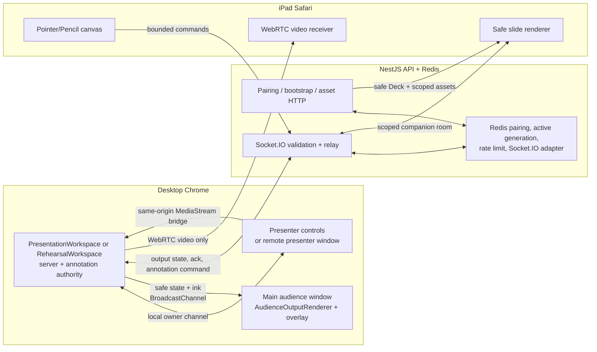
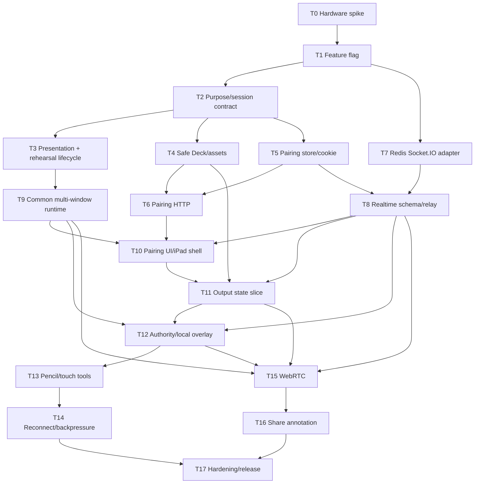

# iPad Presenter Companion 구현 계획

## 문서 상태

- 상태: 구현 승인 대기
- 작성일: 2026-07-23
- 제품 기준: `docs/ideas/ipad-presenter-companion.md`
- 공통 계약 기준: `docs/contracts.md`, `packages/shared`
- 선행 구현 기준: `docs/plans/presenter-audience-screen-share-mvp.md`
- 대상: 실전 발표 또는 리허설을 실행하는 Desktop Chrome Stable 발표자 +
  신뢰하는 iPad 1대
- 물리 기기 경로: 같은 네트워크에서 staging/production HTTPS origin 사용
- 예상 전달 단위: 로컬 구현 브랜치 1개, 최종 PR 1개, 6개 검증 checkpoint

이 문서는 승인된 제품 방향을 코드 변경 단위로 분해한 실행 계획이다.
구현자는 각 checkpoint의 승인 조건을 통과한 뒤 다음 단계로 진행한다.
물리 iPad staging 배포와 운영 배포는 별도의 배포 승인을 받아야 하며, 이
문서의 승인만으로 외부 배포를 수행하지 않는다.

## 1. 목표와 완료 정의

실전 발표 화면 `/presentation/:projectId`와 리허설 화면에서 발표자는 기존
멀티 윈도우 청중 출력과 별개로 iPad를 연결할 수 있어야 한다. iPad는
청중에게 보이는 슬라이드, 검은 화면, 화면 공유를 동일하게 표현하고,
Apple Pencil 또는 손가락으로 그린 임시 주석을 메인 청중 화면에 반영한다.
리허설 연결은 실제 발표 전 물리 기기와 네트워크를 검증하는 정식 테스트
경로이기도 하다.

다음 조건을 모두 만족해야 MVP가 완료된 것으로 본다.

- 실전 발표와 리허설 preflight에서 iPad를 30초 이내에 QR로 연결하고 비공개
  입력 테스트를 완료할 수 있다.
- server `PresentationSession`과 로컬 멀티 윈도우
  `BroadcastChannel` 식별자가 섞이지 않는다.
- companion-only 세션은 `audienceAccessEnabled: false`이며 일반 청중 URL을
  만들거나 표시하지 않는다.
- iPad가 받는 HTTP, Socket.IO, DOM, 로그에는 발표자 노트, script, transcript,
  raw audio, semantic cue, keyword, debug state가 없다.
- 슬라이드와 animation step은 iPad에서 로컬 렌더링되고, 화면 공유는 활성
  video track만 WebRTC로 전달된다.
- 펜, 형광펜, 레이저, 전체 stroke 지우개, undo, 현재 surface clear가
  동작한다.
- 슬라이드 주석은 슬라이드별로 복원되고 화면 공유 주석은 한
  `shareEpochId` 안에서만 유지된다.
- 같은 네트워크의 실제 기기 측정에서 iPad 입력부터 메인 청중 화면 표시까지
  p95 300ms 이내다.
- iPad reload, sleep/wake, 짧은 Wi-Fi 단절 후 약 3초 안에 현재 surface와
  주석이 권위 상태로 복구된다.
- iPad 연결, WebRTC, Pencil 기능이 실패해도 데스크톱 발표와 메인 청중
  화면은 중단되거나 전환되지 않는다.
- 화면 공유 WebRTC 실패는 iPad의 해당 surface에만 표시되고, 슬라이드로
  돌아오면 미러링과 그리기가 자동 복구된다.
- 세션 종료, 명시적 연결 해제, 기기 교체는 이전 companion 권한과 Socket.IO
  연결을 폐기하고 메모리 주석을 제거한다.
- shared, API, web unit/integration, 브라우저 E2E, migration
  `run -> revert -> run`, 물리 iPad QA를 통과한다.

## 2. 범위 밖

다음 항목은 이 계획에서 구현하지 않는다.

- iPad 여러 대 또는 청중 공동 그리기
- iPad에서 슬라이드 이동, 타이머, 발표자 노트, STT 제어
- Safari/PWA에서 Apple Pencil hardware double tap 감지
- 주석 영구 저장, Deck patch, PPTX export, 발표 report 포함
- 도형, 텍스트, lasso, 이미지 삽입, stroke 일부 지우기
- 일반 슬라이드의 video streaming
- 화면 공유 audio
- TURN 보장, 인터넷 원격 companion
- `orbit.local`, Bonjour/mDNS, 로컬 인증서 배포
- 물리 iPad에서 로컬 Docker Compose에 직접 접속하는 개발 경로

Apple Pencil hardware double tap은 native iPad app의
`UIPencilInteraction`이 필요하므로 이번 browser 구현 범위에서 제외한다.
화면을 Pencil tip으로 두 번 누르는 gesture도 drawing과 충돌하므로
fallback으로 사용하지 않는다.

## 3. 현재 저장소 기준선과 선행 격차

| 영역 | 현재 상태 | 이번 구현에서 필요한 변경 |
| --- | --- | --- |
| 실전 발표 | `PresentationWorkspace.tsx`가 persisted `PresentationSession`과 `PresentationRun`을 생성한다. | 세션 생성을 preflight로 앞당기고 run 생성과 분리한다. |
| 리허설 | `RehearsalWorkspace.tsx`가 멀티 윈도우와 화면 공유를 소유하지만 server 발표 세션은 만들지 않는다. | audience가 없는 rehearsal-purpose session을 만들어 같은 companion 기능을 테스트할 수 있게 한다. |
| 멀티 윈도우 | `RehearsalWorkspace.tsx`가 `PresentWindow`, `PresenterRemoteWindow`, `BroadcastChannel`, 화면 공유를 소유한다. | 검증된 primitive를 실전 발표에도 조합하고 두 모드에서 같은 companion bridge를 사용한다. |
| 발표 세션 | `PresentationSession`은 항상 `audienceUrl`과 `accessMode`를 전제로 하고 active session이 project 단위로 하나다. | `sessionPurpose`, `audienceAccessEnabled`, nullable `audienceUrl`을 추가하고 실전/리허설 active session을 분리한다. |
| 청중 Deck projection | `createSlideWindowDeckSnapshot`이 노트와 추적 정보를 빈 값으로 만든다. | server companion 경계용 별도 allowlist schema와 projection을 만든다. |
| asset | `/api/v1/projects/:projectId/assets/:fileId/content`는 발표자 프로젝트 인증이 필요하다. | companion credential과 현재 Deck 참조를 모두 확인하는 읽기 전용 asset 경로가 필요하다. |
| 발표 realtime | 발표자 room과 일반 청중 room이 있고 activity event만 전달한다. | 전용 companion room, strict command/state/signaling event가 필요하다. |
| Socket.IO scale-out | 운영 문서는 Redis adapter를 요구하지만 현재 gateway는 process-local room을 사용한다. | 두 API task에 연결된 데스크톱과 iPad도 통신하도록 Redis adapter를 연결한다. |
| 화면 공유 | 같은 origin 창 사이에서 `MediaStream` 객체를 직접 bridge한다. | bridge가 받은 현재 video stream을 companion WebRTC sender에도 전달한다. |
| 주석 | 주석 상태, surface identity, overlay가 없다. | 데스크톱 권위 store와 로컬 청중 overlay를 추가한다. |
| 라우팅 | 일반 audience route만 인증 없이 접근한다. | pairing exchange와 companion view route를 public auth 예외에 추가한다. |

companion은 실전 발표와 리허설 모두에 연결한다. 두 모드는 동일한 pairing,
safe projection, annotation, WebRTC 경로를 사용하되 별도의
`PresentationSession.sessionPurpose`로 분리한다. 이 분리가 없으면 리허설
테스트를 시작하는 순간 project의 활성 실전 발표 세션과 audience link가
닫힐 수 있기 때문이다. 리허설 session은 audience access와
`PresentationRun`을 만들지 않는 짧은 수명의 테스트 identity다.

## 4. 확정 아키텍처 결정

| ID | 결정 |
| --- | --- |
| D1 | 실제 발표 `/presentation/:projectId`와 리허설 화면 모두 server session과 companion의 데스크톱 권위를 소유할 수 있다. 한 시점의 companion authority는 해당 모드의 owner tab 하나다. |
| D2 | 리허설과 실전 발표가 같은 `features/rehearsal/presenter` 멀티 윈도우 primitive와 `features/presenter-companion` orchestration을 사용한다. 필요한 공통 helper만 `features/presenter-shell`로 작게 승격하고 대량 파일 이동은 하지 않는다. |
| D3 | persisted `PresentationSession.sessionId`, 로컬 `PresentationChannelIdentity.sessionId`, `companionId`는 서로 다른 식별자다. 각 payload에는 필요한 식별자만 포함한다. |
| D4 | 데스크톱 발표 owner가 output과 annotation의 유일한 권위다. API는 인증·검증·relay만 하고 annotation을 저장하지 않는다. |
| D5 | 일반 audience 권한과 companion 쓰기 권한은 별도 cookie, room, scope로 분리한다. |
| D6 | companion bootstrap Deck은 server allowlist projection으로 만들며 web용 `Deck` 타입을 그대로 노출하지 않는다. |
| D7 | 내부 project asset은 현재 session의 정확한 `deckId`와 `deckVersion`이 참조하는 file만 companion asset endpoint에서 읽을 수 있다. |
| D8 | slide/black은 Socket.IO 상태 + iPad 로컬 렌더링, screen-share는 WebRTC video-only를 사용한다. |
| D9 | slide annotation revision은 surface별, output state revision은 session별로 관리한다. iPad local echo는 권위 ack나 snapshot으로 교정한다. |
| D10 | 화면 공유를 실제로 시작한 창이 달라도 same-origin stream bridge를 통해 데스크톱 authority가 현재 video track을 관찰하고 하나의 WebRTC sender를 관리한다. |
| D11 | no-TURN 정책을 유지한다. WebRTC 실패는 iPad screen-share surface만 비활성화한다. |
| D12 | runtime feature flag가 꺼져 있으면 pairing endpoint는 fail-closed하고 UI entry point는 보이지 않는다. 기존 발표와 청중 기능은 그대로 동작한다. |
| D13 | `PresentationSession.sessionPurpose`는 `presentation | rehearsal`이다. 기존 row와 audience/activity session은 `presentation`, 리허설 companion test는 `rehearsal`이며 active session uniqueness와 close/reuse도 purpose별로 분리한다. |
| D14 | Apple Pencil hardware double tap은 Safari/PWA의 지원 capability로 간주하지 않는다. web Pointer Events나 `dblclick`을 hardware gesture의 대체 계약으로 사용하지 않는다. |

## 5. 전체 구조



### 5.1 식별자와 수명

| 식별자 | 생성 위치 | 범위 | 종료 |
| --- | --- | --- | --- |
| `PresentationSession.sessionId` | API/PostgreSQL | purpose별 권한, pairing, Socket.IO; 실전이면 presentation run | session close/expiry |
| local `PresentationChannelIdentity.sessionId` | desktop web | 같은 origin의 현재 멀티 윈도우 집합 | 창 집합 종료 |
| `authorityEpochId` | desktop authority mount | 현재 권위 presenter tab과 그 메모리 상태 | tab reload/종료 또는 lease 만료 |
| `companionId` | pairing exchange | 현재 연결된 iPad credential | 교체, 해제, session 종료 |
| `pairingGeneration` | Redis | 한 session에서 최신 iPad만 유효하게 함 | 새 pairing exchange 시 증가 |
| `surfaceId` | desktop authority | 현재 drawable output | slide는 재방문 유지, share는 epoch 종료 시 제거 |
| `shareEpochId` | desktop authority | 한 번의 화면 공유 capture | capture 종료 또는 새 capture |

서버 authorization에는 persisted `sessionId`만 사용한다. 로컬
`PresentationChannelIdentity.sessionId`는 URL과 `BroadcastChannel` 이름 밖으로
나가지 않는다.

### 5.2 권위 상태

데스크톱은 다음 상태를 메모리에 보관한다.

```ts
type PresenterCompanionAuthorityState = {
  authorityEpochId: string;
  outputRevision: number;
  output:
    | { mode: "slide"; slideId: string; slideIndex: number; stepIndex: number }
    | { mode: "screen-share"; shareEpochId: string }
    | { mode: "black" };
  surfaces: Map<
    string,
    {
      annotationRevision: number;
      strokes: Map<string, AcceptedStroke>;
      history: AcceptedHistoryEntry[];
    }
  >;
};
```

- slide surface는 `slide:<slideId>`다.
- screen-share surface는 `screen-share:<shareEpochId>`다.
- black에는 `surfaceId`가 없고 drawing command를 거부한다.
- output state와 annotation snapshot은 현재 surface만 companion으로 보낸다.
  데스크톱은 다른 slide의 state를 보관하고 해당 slide로 돌아갈 때 snapshot을
  보낸다.
- laser는 revision history와 snapshot에 포함하지 않는 transient state다.
- desktop authority는 Redis의 짧은 heartbeat lease를 획득한 presenter tab
  하나뿐이다. 같은 session을 다른 tab에서 열어도 companion command는 active
  authority room 하나로만 전달된다.
- desktop presenter reload는 새 `authorityEpochId`를 만든다. iPad는 epoch
  변경을 받으면 이전 optimistic/accepted annotation을 버리고 새 authority의
  snapshot을 따른다. MVP에서는 이때 주석이 비워질 수 있다.
- authority lease가 끊긴 동안 iPad는 마지막 safe output을 read-only로
  유지하고 새 drawing을 받지 않는다. iPad가 authority로 승격되는 경우는
  없다.

## 6. 공통 계약 변경

모든 request/response와 Socket.IO payload는 `packages/shared`의 strict Zod
schema를 기준으로 한다. `docs/contracts.md`는 schema 변경과 같은 PR에서
수정한다.

### 6.1 PresentationSession

`presentationSessionSchema`에 다음 필드를 추가한다.

```ts
sessionPurpose: "presentation" | "rehearsal";
audienceAccessEnabled: boolean;
```

응답은 다음 불변식을 가진다.

- `audienceAccessEnabled === false`이면 `audienceUrl === null`이다.
- `audienceAccessEnabled === true`이면 `audienceUrl`은
  `/audience/:sessionId`다.
- 기존 DB row는 `sessionPurpose: "presentation"`과
  `audienceAccessEnabled: true`로 backfill해 이미 발행된 링크를 보존한다.
- 신규 session create의 `audienceAccessEnabled` 기본값은 fail-closed인
  `false`다. 일반 audience link를 만드는 기존 web caller는 `true`를
  명시하도록 함께 수정한다.
- `sessionPurpose === "rehearsal"`이면 `audienceAccessEnabled`는 반드시
  `false`이고 `PresentationRun`과 Activity Run을 만들 수 없다.
- `accessMode`는 audience가 꺼져 있을 때 저장만 하고 효력이 없다.
- audience entry, public info, access cookie, audience Socket.IO join은 모두
  `audienceAccessEnabled === true`를 추가로 검사한다.
- DB의 passcode check constraint는
  `audience_access_enabled = false OR access_mode = 'public' OR session_password_hash IS NOT NULL`
  의미로 교체한다.
- 기존 project-wide active-session partial unique index는
  `(project_id, session_purpose)` 단위로 교체한다. `findCurrent`,
  `closeActive`, reuse도 같은 purpose만 대상으로 한다.

세션 생성 request는 다음 두 의미를 구분한다.

```ts
type CreatePresentationSessionRequest =
  | {
      deckId: string;
      reuseCurrent?: boolean;
      sessionPurpose?: "presentation" | "rehearsal";
      audienceAccessEnabled: false;
      startsAt?: string;
      expiresAt?: string;
    }
  | {
      deckId: string;
      reuseCurrent?: boolean;
      sessionPurpose?: "presentation";
      audienceAccessEnabled: true;
      accessMode: "passcode" | "public";
      passcode?: string;
      startsAt?: string;
      expiresAt?: string;
    };
```

`PATCH :sessionId/access`는 다음 discriminated union으로 변경한다.

```ts
type UpdatePresentationSessionAccessRequest =
  | { audienceAccessEnabled: false }
  | {
      audienceAccessEnabled: true;
      accessMode: "passcode" | "public";
      passcode?: string;
      startsAt: string;
      expiresAt: string;
    };
```

`sessionPurpose`의 하위 호환 기본값은 `presentation`이다. 다른 purpose 또는
deck version의 현재 session은 재사용하지 않는다. 같은 presenter, project,
`sessionPurpose`, `deckId`, `deckVersion`의 active session만 재사용한다.
`false`를 요청했는데 이미 사용자가 audience를 켠 동일 presentation session이
있으면 기존 opt-in을 보존하고 끄지 않는다. rehearsal session에는 이 예외를
적용하지 않고 audience를 항상 끈다.

### 6.2 Companion HTTP API

| Method | Path | 인증 | 용도 |
| --- | --- | --- | --- |
| `POST` | `/api/v1/projects/:projectId/presentation-sessions/:sessionId/companion-pairings` | presenter project write | single-use QR URL 생성 |
| `GET` | `/api/v1/projects/:projectId/presentation-sessions/:sessionId/companion-status` | presenter project write | 현재 연결/지연/세대 상태 조회 |
| `DELETE` | `/api/v1/projects/:projectId/presentation-sessions/:sessionId/companion` | presenter project write | credential 폐기와 socket disconnect |
| `POST` | `/api/v1/presentation-companion/pairings/:code/exchange` | public + same-origin POST | code 원자 소비, cookie 설정 |
| `GET` | `/api/v1/presentation-companion/:sessionId/bootstrap` | companion cookie | safe Deck과 session capability 반환 |
| `GET` | `/api/v1/presentation-companion/:sessionId/assets/:fileId/content` | companion cookie | 현재 Deck이 참조하는 render asset만 반환 |

pairing response는 raw secret을 별도 필드로 반환하지 않고 QR에 사용할
`pairingUrl`만 반환한다. URL의 code는 최소 192-bit CSPRNG base64url 값이고,
Redis에는 `SESSION_SECRET` HMAC digest만 저장한다.

`exchange`가 성공하면 브라우저 history를
`/companion/:sessionId`로 즉시 `replaceState`해 code를 주소창과 history에서
제거한다.

web public route는 두 개만 추가한다.

- `/companion/pair/:code`: exchange만 수행하는 일회성 진입 화면
- `/companion/:sessionId`: HttpOnly cookie로 bootstrap을 읽는 실제 companion
  화면

두 route는 일반 ORBIT 로그인 redirect 대상에서 제외하지만, 유효한 pairing
code 또는 companion cookie가 없으면 프로젝트나 Deck 정보를 렌더링하지
않는다.

### 6.3 Companion credential

별도 signed HttpOnly cookie를 사용한다.

- 이름: `orbit_presentation_companion`
- `HttpOnly`, `Secure`, `SameSite=Lax`
- payload: `companionId`, `sessionId`, `projectId`, `deckId`,
  `deckVersion`, `pairingGeneration`, `scopes`, `expiresAt`, user-agent hash
- scope: `view-audience-output`, `write-annotation`
- DB의 active session과 Redis의 최신 generation을 요청마다 함께 확인한다.
- 종료된 session, 다른 deck version, 이전 generation, 다른 user-agent는
  fail-closed한다.

`PresentationSessionsService`는 companion service를 역참조하지 않는다.
대신 같은 module의 작은 `PresentationCompanionStore.revokeSession`과
`PresentationCompanionPublisher.revokeSession` port를 호출해 transaction
commit 뒤 Redis generation/lease를 지우고 해당 rooms에 `revoked`를 보낸 뒤
socket을 끊는다. 이 순서는 module circular dependency를 만들지 않고 session
close와 active session replacement 모두에 적용한다.

초기 안전값은 다음과 같고 Task 0 측정 결과에서 상수만 조정한다.

- pairing URL TTL: 2분
- credential TTL: 4시간과 session expiry 중 이른 시점
- desktop authority lease: 10초, 3초 heartbeat
- companion presence lease: 15초, 5초 heartbeat
- disconnected reconnect grace 표시: 30초
- 한 session의 active companion: 1대

### 6.4 Safe Deck와 asset

`CompanionDeckSnapshot`은 `Deck`의 alias가 아닌 별도 allowlist schema다.

포함:

- `deckId`, `projectId`, `version`, `canvas`, `theme`
- slide의 `slideId`, `kind`, `order`, rendering에 필요한 `style`,
  `elements`, `animations`, 공개 activity projection
- companion endpoint로 치환된 내부 `thumbnailUrl`, background image,
  image/svg element URL

제외:

- `speakerNotes`, `keywords`, `semanticCues`, `actions`, `aiNotes`
- Deck `metadata.createdFrom`, generation prompt/quality/source 정보,
  source ledger
- transcript, raw audio, recording/run/report, presenter debug state

API는 현재 session의 `deckId`와 `deckVersion`을 다시 읽어 projection한다.
내부 asset URL은 `projectId`와 `fileId`를 추출해 companion asset URL로
치환한다. asset 요청 시 동일한 session Deck의 allowlisted render field가
해당 `fileId`를 실제로 참조하는지 다시 확인한다. project 안의 다른 파일은
유효한 companion cookie가 있어도 읽을 수 없다.

`data:`, `blob:`, `javascript:`와 알 수 없는 scheme은 projection에서
제외한다. 현재 Deck render field에 이미 저장된 external `https:` image만
그대로 허용하며 companion renderer는 `referrerPolicy="no-referrer"`를
사용한다. server가 임의 external URL을 대신 fetch하는 endpoint는 만들지
않는다.

web renderer는 safe snapshot을 받은 뒤 presenter-only field를 빈 값으로
materialize한 별도 adapter를 통해 기존 read-only renderer를 재사용한다.
원본 API payload에는 해당 field가 존재하지 않는다.

### 6.5 Socket.IO room

`packages/realtime`에 다음 room helper를 추가한다.

| Room | 구성원 | 권한 |
| --- | --- | --- |
| `presentation:<sessionId>:presenter` | 인증된 desktop presenter | 기존 activity event와 companion presence |
| `presentation:<sessionId>:companion-authority:<authorityEpochId>` | Redis lease를 가진 desktop tab 하나 | output/state publish, command receive |
| `presentation:<sessionId>:companion:<generation>` | 최신 iPad | safe state receive, command/signaling send |

일반 `presentation:<sessionId>:audience` room은 companion과 공유하지 않는다.
server는 client payload의 room, role, userId를 신뢰하지 않고 socket join
state로 덮어쓴다.

### 6.6 Socket.IO event

모든 server event는 공통 envelope인 `type`, `roomId`, `sessionId`, `userId`,
`payload`, `sentAt`을 사용한다. companion의 `userId`는 raw identifier 대신
`companion:<companionId>` 형식을 사용한다.

| Socket event | 방향 | 핵심 payload |
| --- | --- | --- |
| `presentation:companion:authority-claim` | presenter -> server | `sessionId`, `authorityEpochId` |
| `presentation:companion:authority-heartbeat` | presenter -> server | active epoch lease 갱신 |
| `presentation:companion:authority-changed` | server -> iPad/presenter | active epoch 또는 unavailable |
| `presentation:companion:join` | iPad -> server | `sessionId` |
| `presentation:companion:joined` | server -> iPad | capability, generation |
| `presentation:companion:heartbeat` | iPad -> server | presence lease와 RTT 갱신 |
| `presentation:companion:presence` | server -> presenter | connected/disconnected, RTT bucket |
| `presentation:companion:output-state` | presenter -> iPad | `outputRevision`, slide/step/mode, current surface |
| `presentation:companion:annotation-command` | iPad -> presenter | strict command union |
| `presentation:companion:annotation-ack` | presenter -> iPad | operation id, accepted/rejected, revision |
| `presentation:companion:annotation-snapshot` | presenter -> iPad | current surface accepted strokes and revision |
| `presentation:companion:snapshot-request` | iPad -> presenter | last output/surface revision |
| `presentation:companion:laser` | 양방향 relay | move/hide, sequence; history 없음 |
| `presentation:companion:signal` | presenter/iPad 양방향 relay | offer/answer/ICE/end, target generation |
| `presentation:companion:revoked` | server -> iPad | reason code |
| `presentation:error` | server -> caller | 공개 가능한 고정 error code/message |

`offer`, `answer`, ICE candidate는 strict size bound를 가지며 서버 로그에
payload를 남기지 않는다.

### 6.7 Annotation command와 초기 bound

`annotationCommandSchema`는 다음 discriminated union이다.

- `stroke-begin`
- `stroke-points`
- `stroke-end`
- `stroke-delete`
- `undo`
- `clear-surface`

모든 command는 `sessionId`, `authorityEpochId`, `surfaceId`,
`clientOperationId`, `baseRevision`, `sequence`를 가진다. server는 socket
session과 body `sessionId`가 다르거나 active authority epoch가 아니면
거부하고 relay 전에 schema를 다시 parse한다.

초기 bound:

- normalized coordinate: finite `0..1`
- pressure: finite `0..1`
- relative point time: `0..120_000ms`
- point batch: 최대 64 points
- stroke: 최대 4,096 points
- surface: 최대 500 strokes 또는 50,000 points
- `clientOperationId`, `strokeId`: 최대 64자
- accepted color: 제품 palette enum만 허용
- normalized width: `0.001..0.05`
- command JSON: 최대 32KiB
- drawing command: socket당 초당 120개, 순간 burst 180개
- laser: volatile, 초당 최대 60개

Task 0에서 p95 지연과 메모리를 측정한 뒤 batch와 rate만 조정할 수 있다.
surface/stroke 상한 변경은 계약 테스트도 함께 변경한다.

## 7. Web 런타임 경계

### 7.1 실전 발표와 리허설 lifecycle

현재 `createPresentationRuntime`가 session과 run을 한 번에 생성하는 흐름을
다음처럼 분리한다.

1. `PresentationWorkspace`가 preflight 진입 시 exact deck version의
   `sessionPurpose: "presentation"` session을 ensure한다.
   두 purpose session의 초기 `expiresAt`은 현재 시각부터 4시간이며 Task
   0에서 확정한 credential 수명과 함께 조정한다.
2. `RehearsalWorkspace`도 preflight에서
   `sessionPurpose: "rehearsal"`, `audienceAccessEnabled: false`인 exact deck
   version session을 ensure한다. API project/deck identity가 없는 local
   fixture와 mock route에서는 pairing UI를 표시하지 않는다.
3. 일반 audience가 필요하면 기존 audience link UI가 같은 presentation
   session의
   audience access를 명시적으로 enable한다.
4. 실전 발표 시작 시 이미 확보한 presentation `sessionId`로
   `PresentationRun`만 생성한다. rehearsal session에는 run을 만들지 않는다.
5. activity QR은 `audienceUrl !== null`일 때만 준비한다. audience access가
   꺼진 activity slide는 presenter에게 enable action을 보여주고 가짜 QR을
   만들지 않는다.
6. 사용자가 어느 모드의 preflight에서든 명시적으로 나가면 아직 run이 없는
   해당 purpose session도 close한다. 단순 reload/unload는 close로 간주하지
   않고 exact purpose session을 재사용한다.
7. 발표 종료는 run 완료 후 presentation session close를 호출하고, 리허설
   종료는 rehearsal session close를 호출한다. close 실패 시 완료
   화면에서 재시도하고, unload cleanup만으로 성공 처리하지 않는다.

### 7.2 멀티 윈도우

`PresentationWorkspace`와 `RehearsalWorkspace`가 같은 companion host hook을
사용한다. 실전 발표에는 기존 멀티 윈도우 조합을 추가하고, 리허설에는 이미
존재하는 조합을 adapter로 연결한다.

- local channel 생성과 safe local snapshot publish
- `slide-window`와 `surface swap` 열기
- output mode `slide | screen-share | black`
- active audience `MediaStream` 관찰
- companion authority controller 연결
- mode별 `PresentationSession.sessionPurpose`와 종료 lifecycle 연결

리허설의 기존 slide navigation, STT, recording 동작은 바꾸지 않는다.
중복을 피하기 위해 필요한 작은 pure helper나 hook만 `presenter-shell`로
승격하고, 검증되지 않은 대규모 추출은 별도 refactor로 미룬다.

### 7.3 Annotation overlay

`AudienceAnnotationOverlay`는 `AudienceOutputRenderer`의 절대 위치 sibling으로
렌더링한다.

- slide: Deck canvas aspect ratio로 content rect 계산
- screen-share: `videoWidth`, `videoHeight`로 content rect 계산
- black: overlay 미렌더링
- `ResizeObserver`로 viewport 변경 대응
- letterbox/pillarbox 바깥 pointer와 stroke는 clip
- main audience window는 accepted desktop state만 표시
- iPad는 local echo layer와 accepted layer를 분리해 ack 후 병합

`presentationChannel.ts`에는 고빈도 raw iPad command가 아니라 데스크톱이
accept한 annotation delta/snapshot만 추가한다. 새로 열린 청중 창은
`slide-window-ready` 뒤 현재 output snapshot과 현재 surface annotation
snapshot을 함께 받는다.

### 7.4 화면 공유 media handoff

기존 `audienceStreamBridge`가 `MediaStream`을 붙일 때 authority에
`onActiveStreamChange(stream | null)`을 알릴 수 있게 확장한다.

- 일반 slide-window: 원래 presenter 창의 capture stream을 사용한다.
- surface swap: `PresenterRemoteWindow`의 capture stream이 opener의
  `PresentWindowReceiver`에 붙을 때 같은 stream reference를 authority
  callback으로 전달한다.
- authority는 video track만 `RTCPeerConnection`에 `replaceTrack`한다.
- 새 capture는 새 `shareEpochId`와 새 peer negotiation을 시작한다.
- capture 종료, track `ended`, session close, companion revoke는 peer와
  share surface annotation을 정리한다.

## 8. 구현 작업

각 작업은 독립적으로 검증 가능한 최소 단위다. 예상 크기 `S`는 반나절
안팎, `M`은 1~2일 안팎의 구현 범위를 뜻하며 일정 약속은 아니다.

### Task 0 착수 준비물

- Chrome Stable desktop
- Pencil hover 지원 iPad
- hover 미지원 Pencil 또는 touch-only iPad
- release 시점 current/previous stable iPadOS Safari
- desktop과 iPad가 함께 접속하는 동일 Wi-Fi
- iPad에서 접근 가능한 HTTPS staging origin
- 단기 spike staging 배포 승인

current/previous stable과 hover 지원/미지원 조합을 한 기기로 모두 만족할 수
없으면 물리 기기를 나눠 사용한다. 원격 device farm은 Pointer/Pencil과
same-network WebRTC 합격 판정을 대신할 수 없다.

### Task 0. 물리 iPad hardware/network spike

- 설명: production 기능 코드에 앞서 staging HTTPS에서 Pointer Events,
  coalesced events, pressure, hover, Socket.IO RTT, WebRTC receive,
  sleep/reload, 실전 발표/리허설 host, 두 멀티 윈도우 모드를 측정한다.
  test-only spike 화면과 결과 문서를 만든다.
- 의존성: 없음. staging 배포는 별도 승인 필요.
- 예상 파일:
  - `apps/web/src/features/presenter-companion/spike/CompanionSpikePage.tsx`
  - `apps/web/src/features/presenter-companion/spike/companionSpike.ts`
  - `apps/api/src/presentation-sessions/presentation-companion-spike.gateway.ts`
  - `apps/api/src/presentation-sessions/presentation-sessions.module.ts`
  - `apps/web/src/features/presentation/PresentationWorkspace.tsx`
  - `apps/web/src/features/rehearsal/RehearsalWorkspace.tsx`
  - `apps/web/src/App.tsx`
  - `docs/spikes/ipad-presenter-companion.md`
- Acceptance:
  - spike harness는 단기 staging branch에서만 사용하고 PR 0에는 결과 문서만
    남긴다.
  - hover 지원/미지원 기기에서 touch drawing과 pressure fallback 결과가
    기록된다.
  - slide-window와 surface swap 각각의 WebRTC video 연결 시간, 10분 ink
    p50/p95, reload/sleep 복구 시간이 기록된다.
  - test harness가 실전 발표형 host와 리허설형 host 양쪽에서 같은 iPad
    renderer/input 경로를 구동할 수 있음이 기록된다.
  - media profile, batch cadence, TTL 상수의 최종값과 go/no-go가 문서에
    남는다.
- Verification:
  - `pnpm --filter @orbit/web test`
  - `pnpm --filter @orbit/web typecheck`
  - 물리 기기 QA 표와 브라우저 console error 첨부
- 예상 크기: M

### Checkpoint 0. 아키텍처 go/no-go

다음 중 하나라도 확인되면 이후 구현을 중단하고 아이디어 문서를 다시 연다.

- 같은 네트워크에서 no-TURN screen-share video가 두 창 모드 중 하나라도
  구조적으로 연결 불가능하다.
- current/previous stable iPadOS Safari 중 하나에서 Pointer Events touch
  drawing 또는 WebRTC receive가 불가능하다.
- measured ink p95가 batching 조정 후에도 300ms를 크게 넘는다.

### Task 1. runtime feature flag

- 설명: server env `IPAD_PRESENTER_COMPANION_ENABLED`와 API runtime config
  `ipadPresenterCompanionEnabled`를 추가하고 endpoint와 UI를 fail-closed한다.
- 의존성: Task 0.
- 예상 파일:
  - `packages/config/src/index.ts`
  - `packages/shared/src/config/runtime-config.schema.ts`
  - `apps/api/src/runtime-config/runtime-config.controller.ts`
  - `.env.example`
  - `docs/conventions/environment.md`
- Acceptance:
  - config schema와 `.env.example`의 기본값은 `true`다.
  - false일 때 pairing API는 고정 404/disabled error를 반환하고 presenter
    entry point가 보이지 않는다.
  - secret, Redis URL, TTL 내부값은 browser runtime config에 노출되지 않는다.
- Verification:
  - config/shared/API runtime config unit test
  - `node infra/scripts/check-env.mjs`
- 예상 크기: S

### Task 2. PresentationSession purpose/audience 계약과 migration

- 설명: `sessionPurpose`, `audienceAccessEnabled`, nullable `audienceUrl`,
  purpose별 active session과 create/update union을 shared, DB, repository,
  service, controller에 반영한다.
- 의존성: Task 1.
- 예상 파일:
  - `packages/shared/src/presentation/presentation.schema.ts`
  - `apps/api/src/database/migrations/2026072301000-AddPresentationSessionPurposeAndAudienceAccess.ts`
  - `apps/api/src/presentation-sessions/presentation-session.repository.ts`
  - `apps/api/src/presentation-sessions/presentation-sessions.service.ts`
  - `apps/api/src/presentation-sessions/presentation-sessions.controller.ts`
- Acceptance:
  - 기존 row는 presentation/audience enabled로 유지되고 신규 disabled
    session은 passcode hash 없이 생성된다.
  - presentation과 rehearsal active session은 같은 project에서 공존하며
    하나를 생성하거나 닫아도 다른 purpose를 변경하지 않는다.
  - disabled session의 public/join/access/Socket.IO audience join은 모두
    거부된다.
  - exact deck version reuse와 다른 deck version replacement가 transaction
    test로 고정된다.
- Verification:
  - shared schema tests
  - presentation session controller/service/repository specs
  - `docker compose up -d postgres`
  - `pnpm db:migration:run && pnpm db:migration:revert && pnpm db:migration:run`
- 예상 크기: M

### Task 3. 실전 발표·리허설 session lifecycle과 run 분리

- 설명: preflight에서 session을 ensure하고 발표 시작에서 run만 생성한다.
  리허설은 run 없는 rehearsal-purpose session을 사용한다. 일반 audience link
  caller와 activity QR의 nullable URL 처리를 갱신한다.
- 의존성: Task 2.
- 예상 파일:
  - `apps/web/src/features/presentation/presentationApi.ts`
  - `apps/web/src/features/presentation/PresentationWorkspace.tsx`
  - `apps/web/src/features/presentation/PresentationScreen.tsx`
  - `apps/web/src/features/rehearsal/RehearsalWorkspace.tsx`
  - `apps/web/src/features/editor/audience-link/audienceLinkApi.ts`
  - `apps/web/src/features/activity-slides/presenter/ActivityPresenterPanel.tsx`
- Acceptance:
  - preflight에서 같은 deck version session을 재사용하고 start 재시도는 run을
    중복 생성하지 않는다.
  - rehearsal preflight/session 종료가 presentation-purpose session과 audience
    link를 닫지 않는다.
  - companion-only 흐름에서 audience URL이나 QR이 나타나지 않는다.
  - activity가 audience access를 필요로 할 때 명시적 enable 안내가 나온다.
- Verification:
  - presentation/rehearsal API와 workspace lifecycle tests
  - audience-link와 ActivityPresenterPanel tests
  - 기존 presentation start/finish와 rehearsal regression
- 예상 크기: M

### Checkpoint 1. 세션 계약

- disabled session에서 일반 audience 진입이 HTTP와 Socket.IO 모두 차단된다.
- 같은 project의 presentation/rehearsal session이 동시에 유지되고 purpose별
  close/reuse가 서로 격리된다.
- 기존 audience link 생성과 activity audience 참여가 회귀하지 않는다.
- 두 모드의 preflight session, presentation run, purpose별 close 순서가 API
  test로 확인된다.

### Task 4. safe Deck projection과 scoped asset access

- 설명: 별도 companion Deck schema/projection, internal asset reference 추출,
  URL rewrite, scoped content endpoint를 구현한다.
- 의존성: Task 2.
- 예상 파일:
  - `packages/shared/src/presentation/presenter-companion.schema.ts`
  - `packages/shared/src/index.ts`
  - `apps/api/src/presentation-sessions/presentation-companion-projection.ts`
  - `apps/api/src/presentation-sessions/presentation-companion.controller.ts`
  - `apps/api/src/files/files.service.ts`
- Acceptance:
  - seeded private marker가 serialized bootstrap JSON에 존재하지 않는다.
  - 현재 Deck render field가 참조한 asset은 읽히고 같은 project의 미참조
    asset과 owner-only purpose는 404다.
  - session deck version이 바뀌거나 session이 끝나면 bootstrap과 asset이
    모두 거부된다.
- Verification:
  - shared projection allowlist tests
  - companion controller/service asset authorization tests
  - image, SVG, background, snapshot thumbnail fixture render test
- 예상 크기: M

### Task 5. Redis pairing/lease store와 companion cookie

- 설명: raw code를 저장하지 않는 single-use pairing store, 최신 generation,
  desktop authority 및 companion presence lease,
  credential sign/verify/revoke를 구현한다.
- 의존성: Task 2.
- 예상 파일:
  - `apps/api/src/presentation-sessions/presentation-companion.store.ts`
  - `apps/api/src/presentation-sessions/companion-access-cookie.ts`
  - `apps/api/src/presentation-sessions/presentation-companion.service.ts`
  - `apps/api/src/presentation-sessions/presentation-sessions.module.ts`
- Acceptance:
  - code consume는 Redis atomic operation이며 두 동시 exchange 중 하나만
    성공한다.
  - 새 exchange는 generation을 올려 이전 cookie를 즉시 무효화한다.
  - 두 presenter tab이 동시에 claim하면 하나의 `authorityEpochId`만 lease를
    얻고 만료 후에만 다른 tab이 takeover한다.
  - companion socket이 끊겨도 generation은 reconnect를 위해 유지되고
    presence lease만 만료된다.
  - token, code, cookie, user-agent 원문은 로그와 Redis key에 남지 않는다.
- Verification:
  - fake Redis pairing/authority concurrency, expiry, corrupt payload, revoke
    unit tests
  - cookie Secure/SameSite/expiry/user-agent binding tests
- 예상 크기: M

### Task 6. pairing/bootstrap HTTP flow

- 설명: presenter pairing 생성·상태·해제, public exchange, bootstrap, asset
  endpoint를 controller에 연결하고 same-origin POST와 rate limit를 적용한다.
- 의존성: Task 4, Task 5.
- 예상 파일:
  - `apps/api/src/presentation-sessions/presentation-companion.controller.ts`
  - `apps/api/src/presentation-sessions/presentation-sessions.controller.ts`
  - `apps/api/src/presentation-sessions/presentation-companion.service.ts`
  - `apps/api/src/presentation-sessions/presentation-companion-request-security.ts`
  - `apps/api/src/presentation-sessions/presentation-sessions.module.ts`
- Acceptance:
  - pairing URL은 HTTPS public origin만 사용하고 localhost/private port를
    만들지 않는다.
  - exchange 후 code 재사용, cross-origin POST, expired session은 거부된다.
  - disconnect와 session close가 active generation을 revoke한다.
- Verification:
  - controller integration tests
  - origin, client address, rate limit tests
  - bootstrap privacy snapshot test
- 예상 크기: M

### Checkpoint 2. pairing과 privacy

- QR exchange, reload cookie, replacement, disconnect를 API integration으로
  통과한다.
- private marker가 bootstrap, error body, server log에 없음을 확인한다.
- session과 다른 Deck의 asset을 읽을 수 없다.

### Task 7. Socket.IO Redis adapter

- 설명: Nest Socket.IO server를 `REDIS_URL` pub/sub adapter에 연결해 서로
  다른 API process의 room relay를 지원한다.
- 의존성: Task 1.
- 예상 파일:
  - `apps/api/src/realtime/redis-io.adapter.ts`
  - `apps/api/src/main.ts`
  - `apps/api/package.json`
  - `pnpm-lock.yaml`
  - `docs/architecture/local-first-stack.md`
- Acceptance:
  - adapter 연결 실패 시 production은 fail-closed하고 test/local 정책은
    명시적으로 검증된다.
  - 기존 project presence, canvas, activity room이 같은 adapter를 사용한다.
  - Redis client는 Nest shutdown에서 정리된다.
- Verification:
  - adapter lifecycle unit test
  - Redis가 있는 두 API process 간 room publish integration test
  - 기존 activity realtime gateway tests
- 예상 크기: M

### Task 8. companion realtime schema와 relay

- 설명: room helper, strict event schema, presenter/companion join, bounded
  annotation/signaling relay, presence/revocation을 전용 presentation companion
  gateway에 추가한다.
- 의존성: Task 5, Task 7.
- 예상 파일:
  - `packages/shared/src/realtime/websocket.schema.ts`
  - `packages/realtime/src/index.ts`
  - `apps/api/src/presentation-sessions/presentation-companion.gateway.ts`
  - `apps/api/src/presentation-sessions/presentation-companion.gateway.spec.ts`
  - `apps/api/src/presentation-sessions/presentation-companion.publisher.ts`
  - `apps/api/src/presentation-sessions/presentation-companion-rate-limit.service.ts`
  - `apps/api/src/presentation-sessions/presentation-sessions.module.ts`
- Acceptance:
  - 일반 audience cookie로 companion room에 들어갈 수 없다.
  - stale generation, body session mismatch, oversize point/SDP/ICE payload가
    relay 전에 거부된다.
  - companion command는 presenter room 전체가 아니라 Redis lease가 가리키는
    authority epoch room 하나에만 전달된다.
  - abrupt socket loss는 companion presence lease 만료로 presenter status에
    반영되며 credential generation은 reconnect에 재사용된다.
  - presenter와 companion이 다른 API process에 연결돼도 event와 revocation이
    전달된다.
- Verification:
  - shared event parse/fuzz boundary tests
  - socket.io-client presenter/companion integration tests
  - two-process relay/revoke test
- 예상 크기: M

### Task 9. 실전 발표·리허설 공통 멀티 윈도우 runtime

- 설명: `PresentationWorkspace`에 local audience window, surface swap, output
  mode, local channel identity를 조합하고 `RehearsalWorkspace`의 기존 runtime을
  같은 companion host adapter에 연결한다. persisted session ID는 별도
  prop으로 companion controller에만 넘긴다.
- 의존성: Task 3.
- 예상 파일:
  - `apps/web/src/features/presentation/useLivePresentationOutput.ts`
  - `apps/web/src/features/presentation/PresentationWorkspace.tsx`
  - `apps/web/src/features/presentation/PresentationScreen.tsx`
  - `apps/web/src/features/rehearsal/RehearsalWorkspace.tsx`
  - `apps/web/src/features/rehearsal/presenter/presentationChannel.ts`
  - `apps/web/src/features/rehearsal/presenter/DisplayControls.tsx`
- Acceptance:
  - 실제 발표와 리허설 모두 slide-window와 surface swap에서 같은
    slide/step/black/screen-share companion 결과를 보인다.
  - URL의 local session을 server pairing API에 사용하지 않는다.
  - iPad 기능 flag가 꺼져도 두 모드의 기존 멀티 윈도우 동작이 회귀하지
    않는다.
- Verification:
  - presentation/rehearsal workspace와 공통 host adapter component tests
  - presentationChannel identity tests
  - 기존 `presenter-screen.spec.ts`를 실제 presentation route에도 적용
- 예상 크기: M

### Checkpoint 3. realtime 기반

- persisted session, local window session, companion generation이 test fixture와
  로그에서 명확히 구분된다.
- 서로 다른 API process와 두 desktop window에서 state가 전달된다.
- 아직 annotation 없이도 iPad가 current slide/step/black을 3초 안에
  복구한다.

### Task 10. 두 모드의 pairing UI와 iPad shell

- 설명: 실전 발표와 리허설 preflight의 private device check, 각 runtime
  toolbar의 status/replace/disconnect, public pairing route와 authenticated
  companion shell을 구현한다.
- 의존성: Task 6, Task 8, Task 9.
- 예상 파일:
  - `apps/web/src/features/presenter-companion/PresenterCompanionSetup.tsx`
  - `apps/web/src/features/presenter-companion/PresenterCompanionStatus.tsx`
  - `apps/web/src/features/presenter-companion/CompanionPage.tsx`
  - `apps/web/src/features/presenter-companion/presenterCompanionApi.ts`
  - `apps/web/src/App.tsx`
- Acceptance:
  - preflight test pad의 stroke는 main audience channel로 publish되지 않는다.
  - 실전 발표와 리허설에서 같은 iPad route와 capability test를 사용하며
    현재 mode/purpose가 presenter 상태에 명확히 표시된다.
  - exchange 후 URL history에 code가 남지 않는다.
  - connection health 조회 실패나 iPad disconnect가 presenter navigation,
    timer, screen output을 disable하지 않는다.
- Verification:
  - route/auth bypass tests
  - setup/status component tests
  - QR exchange browser test
- 예상 크기: M

### Task 11. slide/step/black state 수직 슬라이스

- 설명: safe bootstrap을 local renderer에 materialize하고 output revision,
  current surface, reconnect snapshot을 동기화한다.
- 의존성: Task 4, Task 8, Task 10.
- 예상 파일:
  - `apps/web/src/features/presenter-companion/CompanionAudienceRenderer.tsx`
  - `apps/web/src/features/presenter-companion/companionDeckAdapter.ts`
  - `apps/web/src/features/presenter-companion/useCompanionSocket.ts`
  - `apps/web/src/features/presenter-companion/usePresenterCompanionAuthority.ts`
  - `apps/web/src/features/rehearsal/presenter/AudienceOutputRenderer.tsx`
- Acceptance:
  - iPad slide와 animation step이 desktop audience와 일치한다.
  - lower `outputRevision` event는 무시되고 gap은 snapshot request로 복구된다.
  - black에서 renderer와 drawing surface가 모두 비활성화된다.
- Verification:
  - revision reorder/gap unit tests
  - safe Deck image/animation render integration
  - slide/step/black Playwright multi-page test
- 예상 크기: M

### Task 12. 데스크톱 annotation authority와 local overlay

- 설명: per-surface store, command reducer, undo/clear, local
  BroadcastChannel delta/snapshot, `AudienceAnnotationOverlay`를 구현한다.
- 의존성: Task 8, Task 9, Task 11.
- 예상 파일:
  - `apps/web/src/features/presenter-companion/annotationAuthority.ts`
  - `apps/web/src/features/presenter-companion/annotationReducer.ts`
  - `apps/web/src/features/rehearsal/presenter/AudienceAnnotationOverlay.tsx`
  - `apps/web/src/features/rehearsal/presenter/presentationChannel.ts`
  - `apps/web/src/features/rehearsal/presenter/PresentWindow.tsx`
- Acceptance:
  - accepted command만 main audience overlay에 나타나고 invalid base revision은
    snapshot으로 교정된다.
  - slide 재방문은 해당 slide stroke를 복원하고 black은 숨긴다.
  - 새 audience window/reconnect는 현재 surface snapshot을 받는다.
  - desktop authority epoch가 바뀌면 이전 in-memory annotation을 복원하려
    하지 않고 iPad에 새 empty/current snapshot을 보낸다.
- Verification:
  - reducer invariant/property tests
  - BroadcastChannel malformed/reorder tests
  - overlay snapshot and cleanup component tests
- 예상 크기: M

### Task 13. iPad Pencil/touch tools

- 설명: local echo canvas, pointer capture, coalesced events, pressure,
  palm rejection, tool toolbar를 구현한다.
- 의존성: Task 12.
- 예상 파일:
  - `apps/web/src/features/presenter-companion/CompanionAnnotationCanvas.tsx`
  - `apps/web/src/features/presenter-companion/companionPointerInput.ts`
  - `apps/web/src/features/presenter-companion/CompanionToolbar.tsx`
  - `apps/web/src/features/presenter-companion/presenter-companion.css`
  - `apps/web/src/features/presenter-companion/annotationRender.ts`
- Acceptance:
  - pen/highlighter는 frame cadence batch와 local echo를 사용한다.
  - eraser는 hit stroke 전체를 삭제하고 undo/clear는 current surface에만
    적용된다.
  - pen pointer active 중 unrelated touch는 canvas mark를 만들지 않고
    toolbar touch는 유지된다.
- Verification:
  - synthetic PointerEvent/coalesced fallback tests
  - pressure/hover 미지원 fallback tests
  - touch-only browser test
- 예상 크기: M

### Task 14. laser, backpressure, reconnect reconciliation

- 설명: volatile laser, queue bound, command ack timeout, snapshot
  reconciliation, sleep/wake/online recovery를 완성한다.
- 의존성: Task 13.
- 예상 파일:
  - `apps/web/src/features/presenter-companion/useCompanionSocket.ts`
  - `apps/web/src/features/presenter-companion/annotationCommandQueue.ts`
  - `apps/web/src/features/presenter-companion/CompanionAnnotationCanvas.tsx`
  - `apps/web/src/features/presenter-companion/usePresenterCompanionAuthority.ts`
- Acceptance:
  - offline에서는 새 drawing을 받지 않고 연결 상태와 재시도만 표시한다.
  - desktop authority lease가 unavailable이면 iPad는 마지막 output을
    read-only로 표시하고 새 command를 queue하지 않는다.
  - queue가 상한을 넘으면 오래된 laser를 버리고 stroke command는 snapshot
    재동기화로 전환한다.
  - reload, sleep/wake, 3초 Wi-Fi 단절 뒤 current surface와 accepted stroke가
    중복 없이 복구된다.
- Verification:
  - fake timer ack timeout/queue tests
  - Socket.IO disconnect/reconnect E2E
  - 10분 synthetic drawing soak test
- 예상 크기: M

### Checkpoint 4. annotation MVP

- slide pen과 clear의 end-to-end p95가 300ms 안에 든다.
- 형광펜, 레이저, 전체 stroke 지우개, undo, slide restore가 실제 iPad에서
  확인된다.
- malformed command, flood, reconnect가 desktop presentation을 바꾸지 않는다.

### Task 15. active stream 관찰과 WebRTC screen-share

- 설명: 같은 origin stream bridge callback, `shareEpochId`, video-only sender와
  iPad receiver, strict signaling, failure isolation을 구현한다.
- 의존성: Task 8, Task 9, Task 11, Task 12.
- 예상 파일:
  - `apps/web/src/features/rehearsal/presenter/audienceStreamBridge.ts`
  - `apps/web/src/features/rehearsal/presenter/PresentWindow.tsx`
  - `apps/web/src/features/presentation/useLivePresentationOutput.ts`
  - `apps/web/src/features/presenter-companion/usePresenterCompanionWebRtc.ts`
  - `apps/web/src/features/presenter-companion/useCompanionWebRtc.ts`
- Acceptance:
  - slide-window와 surface swap에서 현재 video track이 iPad에 2초 안에
    나타난다.
  - audio track은 sender에 추가되지 않는다.
  - WebRTC 실패/ICE timeout은 iPad drawing만 비활성화하고 desktop capture와
    audience output을 유지한다.
- Verification:
  - peer port mock offer/answer/ICE/replaceTrack tests
  - Playwright fake media screen-share flow
  - physical iPad 두 window mode QA
- 예상 크기: M

### Task 16. share surface annotation과 lifecycle cleanup

- 설명: screen-share content rect mapping, share epoch store, end/restart cleanup,
  slide 자동 복귀를 완성한다.
- 의존성: Task 15.
- 예상 파일:
  - `apps/web/src/features/presenter-companion/surfaceGeometry.ts`
  - `apps/web/src/features/presenter-companion/annotationAuthority.ts`
  - `apps/web/src/features/presenter-companion/CompanionAudienceRenderer.tsx`
  - `apps/web/src/features/rehearsal/presenter/AudienceAnnotationOverlay.tsx`
- Acceptance:
  - 다른 aspect ratio video의 동일 시각점에 iPad와 main overlay stroke가
    겹친다.
  - share 종료와 새 share는 이전 epoch stroke를 제거한다.
  - slide로 돌아오면 slide annotation이 복원되고 iPad drawing이 자동
    재활성화된다.
- Verification:
  - contain rect geometry table tests
  - share epoch reducer tests
  - 16:9, 4:3, portrait source E2E screenshot/coordinate assertions
- 예상 크기: M

### Task 17. 보안, 관측, E2E, 운영 hardening

- 설명: privacy regression, abuse limits, structured business events,
  cleanup, feature rollout, 최종 물리 기기 QA를 통합한다.
- 의존성: Task 14, Task 16.
- 예상 파일:
  - `tests/e2e/ipad-presenter-companion.spec.ts`
  - `docs/runbooks/ipad-presenter-companion.md`
  - `docs/qa/ipad-presenter-companion.md`
  - `docs/contracts.md`
  - `docs/conventions/logging.md`
- Acceptance:
  - logs에는 code/token/cookie/SDP/ICE/point 배열/private marker가 없다.
  - session close, expiry, revoke 후 Redis ephemeral key와 peer/annotation
    memory가 정리된다. presenter unload만 발생하면 authority lease만 만료되고
    session은 제한 시간 안에 재접속할 수 있다.
  - flag off rollback과 flag on 상태 모두에서 기존 presentation, audience,
    activity, rehearsal smoke가 통과한다.
- Verification:
  - `pnpm build`
  - `pnpm lint`
  - `pnpm typecheck`
  - `pnpm test`
  - `pnpm test:smoke --grep "iPad presenter companion"`
  - `node infra/scripts/check-env.mjs`
  - `docker compose config`
  - physical iPad QA matrix
- 예상 크기: M

### Checkpoint 5. release 승인

- 기능 flag를 켠 staging에서 목표 지표와 privacy checklist를 통과한다.
- flag를 끈 즉시 pairing UI/API가 닫히고 기존 실전 발표와 리허설이 계속된다.
- 기본값이 `true`여도 운영 배포는 별도 승인과 관찰 시간을 둔 제한
  rollout으로 진행한다.

## 9. 의존성 그래프



## 10. 로컬 구현과 최종 PR 전달

Task 0 이후 Task 1~17은 최신 `develop`에서 만든 하나의 feature branch에서
끝까지 구현한다. 각 Task와 checkpoint마다 관련 테스트를 통과시키고
독립적으로 검토 가능한 단위로 자주 커밋하되, 중간 PR을 만들거나
`develop`에 병합하지 않는다.

모든 Task의 Acceptance와 Verification, Checkpoint 1~5, 최종 자기 리뷰가
완료된 뒤에만 branch를 push하고 `develop` 대상 PR 하나를 생성한다. 이
최종 PR에는 공통 계약 변경, `packages/shared` schema, 소비 코드, migration,
테스트, `docs/contracts.md`, 운영·QA 문서를 함께 포함한다. PR 생성 후
자동·수동 merge는 수행하지 않고 리뷰 가능한 open 상태로 인계한다.

feature flag 기본값은 `true`이므로 전체 release checkpoint를 통과하기 전
중간 상태를 staging이나 운영에 배포하지 않는다. 긴급 rollback은 운영
환경에서 flag를 `false`로 덮어써 pairing UI/API만 즉시 닫는다.

## 11. 테스트 전략

### 11.1 Shared contract

- strict object가 unknown key를 거부하는지 확인
- `sessionPurpose` 하위 호환 기본값, enum, audience enable/disable union과 URL
  nullability
- rehearsal-purpose session의 audience/run 금지 불변식
- surface ID, normalized point, revision, sequence, batch bound
- offer/answer/ICE 최대 길이와 enum
- safe Deck projection에 private marker가 없는지 serialized JSON 검사

### 11.2 API

- migration `run -> revert -> run`
- 같은 project에서 purpose별 active session 공존, close/reuse 격리
- purpose별 exact deck version session reuse와 replacement transaction
- rehearsal session의 audience enable, PresentationRun, Activity Run 생성 거부
- disabled audience endpoint와 room 차단
- pairing atomic consume, expiry, generation replacement, revoke
- 두 presenter tab의 authority lease 경쟁, heartbeat 만료, takeover
- companion cookie 위조, stale generation, user-agent mismatch
- scoped asset allowlist와 owner-only file purpose 차단
- same-origin exchange와 pairing/rate limit
- 두 API process 사이 relay와 disconnect
- payload를 기록하지 않는 structured log assertion

### 11.3 Web unit/integration

- output/annotation revision reorder, gap, duplicate command
- stroke begin/batch/end invariant와 undo/clear
- pointer capture, coalesced event, pressure fallback, palm rejection
- content rect와 coordinate mapping
- local channel identity와 persisted session identity 혼동 방지
- authority epoch 변경 시 iPad optimistic state 폐기
- screen-share stream attach/detach/replaceTrack
- iPad disconnect가 presenter controls를 바꾸지 않는지 확인

### 11.4 Browser E2E

- preflight QR exchange와 code history 제거
- 실전 발표와 리허설 각각의 pairing, reconnect, purpose별 close
- slide-window와 surface swap
- slide/step/black state
- pen/clear end-to-end overlay
- slide 이동 후 annotation 복원
- companion reload와 network disconnect/reconnect
- desktop authority reload와 두 presenter tab 경쟁
- screen-share video success와 forced ICE failure
- pairing replacement과 session close revoke
- private marker DOM/network response 부재

Playwright desktop E2E에서는 iPad viewport와 PointerEvent를 흉내 내되,
Apple Pencil pressure/hover와 Safari WebRTC 합격 판정은 물리 기기 QA로만
내린다.

### 11.5 물리 iPad QA matrix

| 축 | 최소 조합 |
| --- | --- |
| host mode | 실전 발표, 리허설 |
| iPadOS | release 시점 current, previous stable |
| 입력 | Pencil hover 지원, Pencil hover 미지원, touch-only |
| 창 모드 | slide-window, surface swap |
| output | slide 16:9, slide 4:3, black, 16:9 share, portrait share |
| 장애 | reload, sleep/wake, Wi-Fi 3초 차단, presenter 창 재연결, WebRTC 실패 |
| 시간 | 10분 연속 drawing, 30분 연결 유지 |

QA 문서에는 기기 모델, iPadOS/Safari build, 네트워크, p50/p95, 실패 원인
code만 기록한다. pairing code, credential, SDP, ICE candidate, private Deck
내용은 첨부하지 않는다.

## 12. 관측과 로그

허용하는 business event:

- `presentation_companion.pairing_created`
- `presentation_companion.pairing_exchanged`
- `presentation_companion.connected`
- `presentation_companion.disconnected`
- `presentation_companion.replaced`
- `presentation_companion.revoked`
- `presentation_companion.command_rejected`
- `presentation_companion.webrtc_failed`

허용 field:

- `projectId`, `presentationSessionId`, `sessionPurpose`, `deckId`
- hashed/opaque `companionId`
- generation, reason code, capability boolean
- RTT/latency bucket, command count, rejected count
- WebRTC state enum과 elapsed bucket

금지 field:

- pairing code/URL, cookie, signed token
- raw user-agent와 IP
- Deck JSON, slide text, speaker notes, script, transcript
- stroke point, color/width history
- SDP, ICE candidate, ICE username fragment
- raw error object에 포함된 media/network payload

client 측 p95 측정은 Socket.IO ping 왕복으로 iPad와 desktop의 clock
offset/uncertainty를 먼저 추정한 뒤, `clientOperationId`의 보정된 iPad send
time과 main audience overlay apply time을 같은 sample ID로 집계한다.
uncertainty가 큰 sample은 제외하고 staging 실제 기기 표본은 high-frame-rate
video로 교차 확인한다. 원시 point나 전체 sample history는 서버로 보내지
않고 bucket만 기록한다.

## 13. Rollout과 rollback

1. 기본 flag `true`로 구현하고 승인된 staging에서 실전 발표와 리허설
   경로를 모두 검증한다.
2. Task 0~17의 필수 checkpoint와 최종 PR 준비가 완료되기 전에는 중간
   구현을 staging이나 운영에 배포하지 않는다.
3. 운영 배포 전 purpose/audience migration과 Redis adapter readiness를
   확인한다.
4. 제한 rollout 중 pairing failure, command reject, WebRTC failure,
   annotation p95를 관찰한다.
5. 문제가 생기면 flag를 끈다. 이미 연결된 companion은 `revoked`를 받고
   disconnect되지만 desktop의 실전 발표와 리허설 기본 기능은 유지된다.
6. DB의 `session_purpose`와 `audience_access_enabled`는 additive field라
   rollback 중에도 기존 audience semantics를 보존한다. migration revert는
   운영 데이터가 생긴 뒤 자동 실행하지 않고 별도 승인한다.

## 14. Task 0 이후 확정할 구현 상수

다음 항목은 제품 결정을 다시 묻지 않고 Task 0 측정값으로 확정한다.

- WebRTC 최대 해상도, fps, `degradationPreference`
- point batch 크기와 rAF cadence
- pairing 2분/credential 4시간 초기값의 조정
- authority/presence heartbeat와 lease 간격
- reconnect grace와 snapshot timeout
- no-TURN 실패율과 follow-up TURN 검토 필요 여부

다음 상황은 측정값으로 결정하지 않고 제품 재승인을 요청한다.

- 한 대 제한을 여러 대로 확대해야 하는 경우
- iPad에 slide navigation이나 presenter-only 정보를 추가해야 하는 경우
- annotation을 저장/export해야 하는 경우
- 동일 네트워크가 아닌 인터넷 연결을 release requirement로 바꾸는 경우
- rehearsal companion을 테스트 경로가 아니라 별도 audience 공개 기능으로
  확장하려는 경우

## 15. 구현 시작 승인 조건

구현 전에 다음 세 가지를 사람이 확인한다.

- companion의 정식 진입점이 실제 발표 `/presentation/:projectId`와 리허설
  두 곳이라는 결정
- Task 0을 위한 지원 iPad/Pencil 조합과 승인된 staging 배포 경로
- feature flag 기본값 `true`와 additive
  `session_purpose`/`audience_access_enabled` migration 전략

승인 후에도 Task 0의 go/no-go가 먼저다. 이 계획은 Task 0 결과가 현재
desktop-authoritative hybrid 방향을 지지할 때만 Task 1 이후의 구현을
진행한다.
