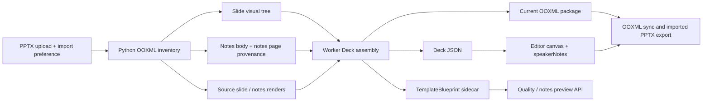
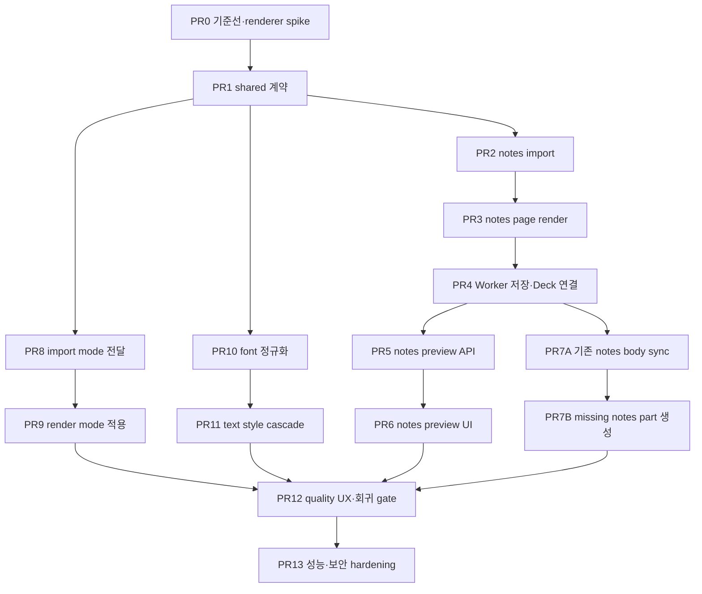

# PPTX 가져오기 시각 정합성·발표자 노트 구현 계획

작성일: 2026-07-22  
상태: 구현 전 승인 대기  
기준 파일: `07_21_발표본(기술적_챌린지_수정본).pptx`  
범위: 활성 `pptx-ooxml-generation` 가져오기, OOXML sync/export, Editor 가져오기 UX와 발표자 노트 패널

## 1. 목표

이 계획은 특정 PPTX에만 예외 처리를 추가하지 않고, 해당 파일을 회귀 기준으로 삼아 다음 사용자 결과를 보장한다.

1. 사용자가 PPTX를 가져올 때 `원본 외형 우선` 또는 `편집 가능성 우선`을 매번 선택할 수 있다.
2. 원본 외형 우선에서는 지원되지 않는 요소가 있어도 슬라이드가 깨져 보이지 않는다.
3. 편집 가능성 우선에서는 가능한 요소를 편집 가능한 Deck element로 유지하고, 손실·대체·fallback을 슬라이드별로 명시한다.
4. 발표자 대본은 문단·빈 줄·수동 줄바꿈을 보존해 `slide.speakerNotes`로 가져온다.
5. 노트 페이지의 이미지·도형·header/footer·slide image·notes master 스타일은 원본/current PPTX package에 보존하고 에디터에서 읽기 전용으로 미리본다.
6. 에디터에서는 발표자 대본 body만 편집하고, 수정 결과를 source-preserving OOXML sync와 PPTX export에 반영한다.
7. 발표자 노트와 노트 페이지 asset은 청중 API, 공개 snapshot, 서버 로그에 노출하지 않는다.

## 2. 확정된 제품 결정

| ID  | 결정                           | 적용 방식                                                                                                 |
| --- | ------------------------------ | --------------------------------------------------------------------------------------------------------- |
| D1  | 범용 PPTX 안정화               | 현재 파일은 회귀 fixture의 근거로 사용하고, 구현은 OOXML 관계·placeholder·capability 기반으로 일반화한다. |
| D2  | 가져오기마다 정책 선택         | `appearance-first`와 `editability-first` 중 하나를 UI에서 반드시 선택해 request에 포함한다.               |
| D3  | 전체 노트 페이지 보존          | notes slide, notes master, notes theme, media와 비본문 placeholder를 current package에 유지한다.          |
| D4  | 전체 노트 페이지는 읽기 전용   | Editor는 노트 페이지 render를 미리보기만 하고 body 발표 대본만 기존 패널에서 편집한다.                    |
| D5  | 발표 대본 원본                 | 발표·리허설·AI 보조 기능이 읽는 canonical text는 계속 `slide.speakerNotes`다.                             |
| D6  | 노트 시각 원본                 | notes page의 시각 구조 원본은 Deck element가 아니라 `currentPackageFileId`가 가리키는 OOXML package다.    |
| D7  | source package 불변            | `sourcePackageFileId`는 변경하지 않고, sync 결과는 새 `currentPackageFileId`로 저장한다.                  |
| D8  | 데이터 손실은 선택 대상이 아님 | `editability-first`에서도 unresolved media나 구조 손실 위험이 있으면 snapshot으로 fail-closed한다.        |

## 3. 현재 기준선

### 3.1 기준 PPTX

- 16:9, 8 slides, 8 notes slides
- 27개 PNG media
- `Pretendard`, `Pretendard Medium`, `Pretendard SemiBold`, `Pretendard ExtraBold`, `Pretendard ExtraLight`
- slides 2~8에 `700ms fade`
- table, chart, SmartArt, audio, video, OLE 없음
- slide 7에 현재 미지원 `wedgeRoundRectCallout` 존재
- slide 4 notes body는 여러 문단, 빈 문단, 구분자와 발표 지시문을 포함

### 3.2 현재 구현 결과

| 항목                 | 현재 결과                                                    | 목표                                                               |
| -------------------- | ------------------------------------------------------------ | ------------------------------------------------------------------ |
| 발표자 대본          | 8개 notes part가 있으나 0개 import                           | 8/8 body text import                                               |
| 원본 대비 Konva SSIM | 평균 `0.9148`                                                | 기준 미달을 숨기지 않고 정책에 따라 안전 render 선택               |
| `0.95` 통과 slide    | 3/8                                                          | appearance-first 8/8 안전 표시, editability-first는 실패 원인 표시 |
| import warning       | letter spacing 11건, unsupported callout 1건                 | slide별 code와 fallback 결과 제공                                  |
| quality report       | `compositeScore=82`, `editabilityCoverage=1.0`, pixel 미평가 | pixel 미평가와 편집 가능/정확도를 분리 표시                        |
| thumbnail/canvas     | thumbnail은 source render, canvas는 vector reconstruction    | 동일한 선택 render mode 사용                                       |

### 3.3 확인된 코드 공백

- `Deck`에는 `speakerNotes`가 있지만 Python import blueprint에 notes field가 없다.
- OOXML importer는 slide/layout/master만 순회하고 notes slide 관계를 읽지 않는다.
- generation Worker가 `speakerNotes: ""`를 하드코딩한다.
- `update_speaker_notes`는 OOXML package-neutral operation이라 current PPTX에 기록되지 않는다.
- `Pretendard SemiBold` 같은 이름을 browser font family로 그대로 전달해 fallback 가능성이 있다.
- placeholder text에 direct run size가 없을 때 layout/master의 effective style을 계산하지 않고 기본 크기를 사용한다.
- source render가 있어도 element가 하나라도 생성되면 editable canvas를 사용해 깨진 결과가 노출될 수 있다.

## 4. 범위와 비범위

### 4.1 이번 범위

- notes slide 관계 탐색과 body text import
- notes master를 포함한 전체 notes page 보존과 읽기 전용 preview
- body text OOXML sync와 source-preserving export
- import preference request와 선택 UI
- slide별 `editable | hybrid | snapshot` render mode
- font family/weight 정규화
- slide/layout/master/theme text style cascade
- 품질·fallback·font·notes 진단 UI
- 실제 PPTX 기반 회귀 fixture와 round-trip/SSIM gate
- 이미지 dedupe, bounded diagnostics, 외부 관계 차단

### 4.2 이번 비범위

- notes page의 이미지·도형·header/footer 직접 편집
- notes body의 임의 구간에 rich-text 스타일을 새로 부여하는 편집기
- SmartArt, OLE, 3D model, 고급 chart, audio/video, Morph와 복잡 animation의 native 편집 구현
- 일반 AI GenerateDeck 경로 변경
- 원본 21 MiB PPTX를 그대로 Git에 커밋

SmartArt·OLE·고급 motion 등은 이번 범위에서 삭제하거나 근사 변환하지 않는다. source/current package에 보존하고 `hybrid` 또는 `snapshot`으로 표시한다.

## 5. 목표 아키텍처



### 5.1 공통 계약

#### Import request

`pptxOoxmlGenerationRequestSchema`를 다음 strict 구조로 확장한다.

```ts
{
  fileId: string;
  importPreference: "appearance-first" | "editability-first";
}
```

- 신규 Editor 요청은 `importPreference`를 항상 보낸다.
- rolling compatibility 동안 서버 default는 기존 동작에 가까운 `editability-first`로 둔다.
- UI 기본 선택 강조는 안전한 `appearance-first`로 둔다.

#### Slide render mode

`Slide`에 imported deck 전용 optional field를 추가한다.

```ts
importRenderMode?: "editable" | "hybrid" | "snapshot";
```

- `editable`: Deck elements를 그대로 렌더링하고 편집한다.
- `hybrid`: 지원 요소는 Deck elements, 미지원 객체는 raster fallback element로 렌더링한다.
- `snapshot`: source slide render만 표시하고 element tree는 보존하되 canvas hit-test와 직접 편집을 비활성화한다.
- legacy Deck에는 field가 없으며 기존 렌더링을 유지한다.

#### Notes page sidecar

원문과 시각 object를 Deck에 복제하지 않고 `TemplateBlueprint.slides[].notesPage`에 locator와 asset ID만 저장한다.

```ts
{
  status: "absent" | "preserved" | "rendered" | "render-unavailable";
  sourceNotesPart?: string;
  sourceNotesMasterPart?: string;
  bodyShapeId?: string;
  bodyWritable: boolean;
  notesWidthEmu?: number;
  notesHeightEmu?: number;
  renderAssetFileId?: string;
  hasNonBodyContent: boolean;
}
```

다음 값은 sidecar와 quality report에 저장하지 않는다.

- 발표자 대본 원문
- notes image base64
- footer/header 실제 문구
- notes page 전체 XML

원문 대본은 `Deck.slide.speakerNotes`, OOXML과 media는 current package, preview bitmap은 보호된 project asset에만 존재한다.

#### Quality report

`qualityReport.slideReports[]`에 다음을 추가한다.

```ts
{
  selectedRenderMode: "editable" | "hybrid" | "snapshot";
  recommendedRenderMode: "editable" | "hybrid" | "snapshot";
  pixelEvaluation: "passed" | "failed" | "not-evaluated";
  unsupportedObjectCount: number;
  fontSubstitutionCount: number;
}
```

`qualityReport.notesDiagnostics`는 total, imported, rendered, writable, warning code와 count만 보존한다. notes text는 넣지 않는다.

### 5.2 가져오기 정책

| 조건                                   | `appearance-first`                         | `editability-first`                                  |
| -------------------------------------- | ------------------------------------------ | ---------------------------------------------------- |
| 지원 객체만 있고 CI fidelity 기준 통과 | `editable` 허용                            | `editable`                                           |
| 일부 객체만 안전하게 rasterize 가능    | `hybrid` 또는 `snapshot` 중 외형 보존 결과 | `hybrid`                                             |
| pixel 평가 불가                        | 기본 `snapshot`                            | capability상 안전하면 `editable/hybrid`, 미평가 경고 |
| unresolved media/relationship          | `snapshot`                                 | `snapshot`                                           |
| 데이터 손실 가능                       | `snapshot`                                 | `snapshot`                                           |

초기 구현에서는 runtime Konva candidate renderer가 없을 수 있으므로 `appearance-first`는 보수적으로 source snapshot을 사용한다. PR0의 production candidate-renderer spike가 통과한 경우에만 slide별 SSIM을 runtime 자동 선택에 사용한다. 통과하지 못하면 SSIM은 CI gate로 유지하고 runtime report에 `not-evaluated`를 정확히 표시한다.

### 5.3 발표자 노트 처리

#### Import

1. slide relationship에서 notes slide part를 찾는다.
2. notes slide의 direct shape 중 `p:ph type="body"`인 body placeholder를 식별한다.
3. `sldImg`, `sldNum`, `dt`, `hdr`, `ftr`와 notes master decoration은 speakerNotes에서 제외한다.
4. run text를 이어 붙이고 `<a:br>`는 줄바꿈으로, paragraph 경계는 `\n`으로 보존한다.
5. 빈 paragraph도 빈 줄로 보존하고 저장 경계의 line ending만 `\n`으로 통일한다.
6. 원문 Unicode를 임의 trim, 요약, 정규화하거나 길이 때문에 조용히 자르지 않는다.

#### Preview

- LibreOffice Impress PDF export의 `ExportNotesPages=true`, `ExportOnlyNotesPages=true` 경로를 우선 검증한다.
- page 수가 notes part 수와 일치할 때만 slide order와 매핑한다.
- 불일치하거나 renderer가 없으면 current package는 유지하고 `render-unavailable`로 기록한다.
- notes preview는 `notesSz` 비율을 사용하고 slide canvas 비율을 하드코딩하지 않는다.
- project owner/editor 권한이 있는 API를 통해서만 asset URL을 반환한다.

#### Body edit와 sync

- `update_speaker_notes`를 OOXML sync operation으로 승격하고 sync capability version을 올린다.
- notes part와 body shape locator가 유일하고 writable일 때만 targeted update한다.
- untouched notes part는 package entry를 byte-preserve한다.
- body 수정 시 body shape geometry, `bodyPr`, `lstStyle`, paragraph properties와 비본문 shape/relationship은 보존한다.
- 변경되지 않은 run formatting은 유지하고 새 text는 인접 run 또는 paragraph default style을 상속한다.
- body placeholder가 없는 경우에는 안전한 notes part 생성 경로가 검증되기 전까지 Deck 저장은 성공시키되 OOXML sync를 retryable failure로 표시한다. 후속 task에서 notes master와 관계를 포함한 생성 경로를 닫는다.

### 5.4 텍스트 fidelity

Effective text style은 다음 우선순위로 계산한다.

```text
run rPr
-> paragraph pPr / defRPr
-> shape txBody / lstStyle level
-> matching slide-layout placeholder
-> slide-master titleStyle/bodyStyle/otherStyle
-> theme font/color
-> Orbit fallback
```

다음 속성을 공통 text props로 변환한다.

- font family, size, weight, italic, underline, color
- paragraph align, bullet, indent, tab, line/paragraph spacing
- text body inset, vertical anchor, wrap
- `normAutofit`, `spAutoFit`, `fontScale`
- kerning, letter spacing, baseline

Pretendard variant는 family와 weight로 분리한다.

| PPTX family             | Orbit family | weight |
| ----------------------- | ------------ | ------ |
| `Pretendard ExtraLight` | `Pretendard` | 200    |
| `Pretendard Medium`     | `Pretendard` | 500    |
| `Pretendard SemiBold`   | `Pretendard` | 600    |
| `Pretendard ExtraBold`  | `Pretendard` | 800    |

font가 browser에서 실제 사용 불가능하면 대체 family와 영향을 받은 slide 수만 진단한다.

### 5.5 Thumbnail과 canvas 일치

- `snapshot` slide: rail, editor canvas, read-only canvas, PNG export preview가 같은 source render를 사용한다.
- `editable/hybrid` slide: rail thumbnail은 source render를 고정 사용하지 않고 현재 Deck canvas render를 사용한다.
- `metadata.thumbnailSource="import-render"` 하나로 deck 전체를 판단하지 않고 slide `importRenderMode`를 우선한다.
- snapshot에서 element tree는 저장·sync를 위해 남기지만 화면 렌더, selection, keyboard mutation 대상에서는 제외한다.

## 6. 의존성 순서



`PR2~PR7B`의 notes slice와 `PR8~PR11`의 visual-fidelity slice는 PR1 이후 일부 병렬 진행할 수 있다. 같은 shared schema를 수정해야 하는 작업은 PR1이 merge된 뒤 시작한다.

## 7. 구현 작업

### PR0: 실제 기준선 fixture와 renderer 위험 검증

**설명:** 원본 21 MiB 파일을 커밋하지 않고 문제를 재현하는 축소 fixture를 만든다. title placeholder 상속, Pretendard variant, letter spacing, unsupported callout, group/image, blank notes paragraph, notes master decoration을 포함한다. LibreOffice notes-only export와 production candidate renderer의 실행 가능성을 먼저 판정한다.

**완료 조건:**

- [ ] 축소 fixture가 현재 notes 유실과 text-size 오류를 재현한다.
- [ ] notes-only PDF/PNG가 slide order대로 생성되고 원본 notes page와 육안 비교된다.
- [ ] runtime candidate renderer의 cold/warm latency, peak memory, container 의존성을 기록하고 채택/기각 결정을 남긴다.

**검증:**

- [ ] `cd services/python-worker && uv run pytest tests/test_pptx_ooxml_generation.py`
- [ ] `node infra/scripts/run-playwright-test.mjs tests/e2e/pptx-konva-accuracy.spec.ts --workers=1`
- [ ] 기준 파일 수동 audit: 8 slides, 8 notes pages

**의존성:** 없음  
**예상 범위:** M  
**예상 파일:**

- `services/python-worker/tests/fixtures/pptx/import-fidelity-notes.pptx`
- `services/python-worker/tests/test_pptx_ooxml_generation.py`
- `tools/pptx-accuracy/prepare_pptx_konva_accuracy.py`
- `docs/qa/pptx-import-fidelity-baseline.md`

### PR1: 공통 import·notes·quality 계약 확장

**설명:** 구현보다 먼저 request preference, slide render mode, notes page sidecar와 bounded diagnostics를 shared Zod schema와 계약 문서에 추가한다. 기존 Deck과 rolling deployment를 위해 신규 field는 optional/default 호환을 유지한다.

**완료 조건:**

- [ ] strict generation request가 두 import preference만 허용한다.
- [ ] TemplateBlueprint가 notes locator/preview metadata를 raw notes 없이 검증한다.
- [ ] legacy Deck/quality result가 그대로 parse되고 신규 result의 bounds가 검증된다.

**검증:**

- [ ] `pnpm --filter @orbit/shared test`
- [ ] `pnpm --filter @orbit/shared build`
- [ ] schema test에서 raw notes/XML/base64 field 거부 확인

**의존성:** PR0  
**예상 범위:** M  
**예상 파일:**

- `packages/shared/src/deck/deck.schema.ts`
- `packages/shared/src/deck/template-blueprint.schema.ts`
- `packages/shared/src/deck/pptx-ooxml-generation.schema.ts`
- `packages/shared/src/deck/template-blueprint.schema.test.ts`
- `docs/contracts.md`

### PR2: OOXML notes body와 provenance import

**설명:** Python OOXML importer가 slide relationship을 따라 notes slide와 notes master를 찾고, body placeholder text와 locator를 추출한다. 파일명 suffix나 slide order로 notes part를 추정하지 않는다.

**완료 조건:**

- [ ] body paragraph, blank paragraph, `<a:br>`가 `speakerNotes` 문자열로 정확히 변환된다.
- [ ] `sldNum`, `sldImg`, header/footer와 notes master text가 speakerNotes에 섞이지 않는다.
- [ ] missing/multiple body placeholder를 fail-closed diagnostic으로 기록한다.

**검증:**

- [ ] `cd services/python-worker && uv run pytest tests/test_pptx_design_importer.py`
- [ ] 축소 fixture와 기준 파일에서 notes body 8/8 비교
- [ ] malformed relationship와 external relationship fixture 검사

**의존성:** PR1  
**예상 범위:** M  
**예상 파일:**

- `services/python-worker/app/ai/pptx_design_importer.py`
- `services/python-worker/app/ai/pptx_ooxml_vector_importer.py`
- `services/python-worker/tests/test_pptx_design_importer.py`

### PR3: 전체 notes page render asset 생성

**설명:** current package를 LibreOffice notes-only PDF로 변환하고 notes page별 bounded preview bitmap을 만든다. notes page count나 order를 증명하지 못하면 매핑하지 않는다.

**완료 조건:**

- [ ] `notesSz` 비율의 preview asset이 notes part별로 생성된다.
- [ ] notes master shape, slide image, body, footer/page number가 preview에 함께 보인다.
- [ ] renderer 미설치·timeout·page-count mismatch는 package를 손상하지 않고 `render-unavailable`로 종료한다.

**검증:**

- [ ] `cd services/python-worker && uv run pytest tests/test_pptx_ooxml_generation.py`
- [ ] LibreOffice subprocess timeout/cleanup test
- [ ] 기준 파일 notes page 1, 4, 8 수동 screenshot 비교

**의존성:** PR2  
**예상 범위:** M  
**예상 파일:**

- `services/python-worker/app/ai/pptx_ooxml_generation.py`
- `services/python-worker/app/ai/pptx_rendering.py`
- `services/python-worker/tests/test_pptx_ooxml_generation.py`
- `services/python-worker/tests/test_pptx_ooxml_sync_api.py`

### PR4: Worker Deck 조립과 notes asset 저장

**설명:** Python 결과의 speakerNotes와 notes preview asset을 저장하고, Deck·TemplateBlueprint·quality report 사이의 slide ID를 안전하게 연결한다. 현재 `speakerNotes: ""` 하드코딩을 제거한다.

**완료 조건:**

- [ ] imported Deck의 `speakerNotes`가 Python 결과와 slide별로 일치한다.
- [ ] notes preview는 `purpose=design-asset` project asset으로 저장되고 sidecar에는 file ID만 남는다.
- [ ] notes asset 저장 실패는 note text import를 롤백하지 않고 bounded warning을 반환한다.

**검증:**

- [ ] `pnpm --filter @orbit/worker test -- pptx-ooxml-generation.processor.spec.ts`
- [ ] `pnpm --filter @orbit/worker build`
- [ ] Worker integration에서 8 body/8 preview asset 연결 확인

**의존성:** PR3  
**예상 범위:** M  
**예상 파일:**

- `apps/worker/src/pptx-ooxml-generation.processor.ts`
- `apps/worker/src/pptx-ooxml-generation.processor.spec.ts`
- `apps/worker/integration/pptx-ooxml-roundtrip.integration.spec.ts`
- `packages/storage/src/index.ts`

### Checkpoint A: notes import 저장 경계

- [ ] 기준 파일 import 후 8개 speakerNotes가 저장·재조회된다.
- [ ] notes preview가 없어도 Deck 저장과 기존 Editor가 정상 동작한다.
- [ ] Deck/Job/TemplateBlueprint schema가 모두 통과한다.
- [ ] 로그와 Job result에 notes 원문이 없다.

### PR5: 권한이 적용된 notes preview 조회 API

**설명:** Editor가 전체 TemplateBlueprint나 package를 받지 않고 현재 slide의 notes preview 상태와 보호된 asset URL만 조회할 수 있게 한다. 기존 import-quality read model을 확장하되 audience/public projection에는 추가하지 않는다.

**완료 조건:**

- [ ] owner/editor만 slideId별 notes preview metadata를 조회한다.
- [ ] 다른 project, audience route, public snapshot에서 file ID와 URL이 노출되지 않는다.
- [ ] stale/missing asset은 `unavailable` 상태로 반환하고 raw storage error를 노출하지 않는다.

**검증:**

- [ ] `pnpm --filter @orbit/api test -- decks.service.spec.ts`
- [ ] project boundary와 권한 negative test
- [ ] response schema에 notes text/XML/base64가 없는지 검사

**의존성:** PR4  
**예상 범위:** M  
**예상 파일:**

- `packages/shared/src/deck/deck.schema.ts`
- `apps/api/src/decks/decks.service.ts`
- `apps/api/src/decks/decks.service.spec.ts`
- `apps/web/src/features/editor/shell/api/deckPersistenceApi.ts`

### PR6: Editor 전체 notes page 읽기 전용 preview

**설명:** Speaker Notes panel에 imported PPTX 전용 `노트 페이지` tab을 추가한다. 기존 `대본` tab만 편집 가능하고 preview는 읽기 전용 image로 표시한다.

**완료 조건:**

- [ ] imported slide에서 대본/노트 페이지를 전환하고 현재 slide preview만 표시한다.
- [ ] preview에 편집 affordance가 없고 keyboard/focus 접근성이 유지된다.
- [ ] sync pending/stale/render-unavailable 상태를 색상 외 text로 구분한다.

**검증:**

- [ ] `pnpm --filter @orbit/web test -- SpeakerNotesPanel.test.tsx`
- [ ] `pnpm --filter @orbit/web lint`
- [ ] slide 전환과 asset loading 실패 수동 확인

**의존성:** PR5  
**예상 범위:** M  
**예상 파일:**

- `apps/web/src/features/editor/shell/components/SpeakerNotesPanel.tsx`
- `apps/web/src/features/editor/shell/components/SpeakerNotesPageTab.tsx`
- `apps/web/src/features/editor/shell/components/SpeakerNotesPanel.test.tsx`
- `apps/web/src/features/editor/shell/EditorShell.tsx`
- `apps/web/src/features/editor/editor-shell.css`

### PR7A: 기존 notes part의 speakerNotes source-preserving OOXML sync

**설명:** `update_speaker_notes`를 package-neutral 목록에서 제거하고 targeted OOXML operation으로 전달한다. body만 변경하며 notes page의 비본문 object와 관계를 보존하고 preview를 재생성한다.

**완료 조건:**

- [ ] body locator가 유일한 slide는 edit → sync → export → reimport text가 동일하다.
- [ ] notes master, image, footer/page number와 비본문 shape의 semantic XML/relationship hash가 유지된다.
- [ ] locator가 없거나 모호하면 package 변경 없이 명시적 retryable/unsupported reason을 반환한다.

**검증:**

- [ ] `cd services/python-worker && uv run pytest tests/test_pptx_ooxml_generation.py tests/test_pptx_ooxml_sync_api.py`
- [ ] `pnpm --filter @orbit/worker test -- pptx-ooxml-sync.processor.spec.ts`
- [ ] `bash infra/scripts/test-adaptive-coaching-integration.sh`

**의존성:** PR4  
**예상 범위:** M  
**예상 파일:**

- `packages/shared/src/deck/pptx-ooxml-generation.schema.ts`
- `apps/worker/src/pptx-ooxml-sync.processor.ts`
- `apps/worker/src/pptx-ooxml-sync.processor.spec.ts`
- `services/python-worker/app/ai/pptx_ooxml_generation.py`
- `services/python-worker/tests/test_pptx_ooxml_generation.py`

### PR7B: notes part가 없는 imported slide에 notes page 생성

**설명:** 사용자가 notes slide가 없던 imported slide에 발표 대본을 처음 저장하는 경우, slide relationship·notes slide part·content type과 notes master 관계를 안전하게 생성한다. 기존 notes page가 하나 있으면 검증된 구조만 template로 사용하고, 없으면 최소 notes master/package 구조를 명시적으로 만든다.

**완료 조건:**

- [ ] notes part가 없던 slide에 대본 저장 후 PowerPoint/LibreOffice에서 notes page가 열린다.
- [ ] 새 notes part가 해당 slide와 notes master를 정확히 참조하고 다른 slide/package 관계를 변경하지 않는다.
- [ ] 안전한 notes master 생성이 불가능하면 package를 변경하지 않고 non-retryable capability failure를 반환한다.

**검증:**

- [ ] `cd services/python-worker && uv run pytest tests/test_pptx_ooxml_generation.py tests/test_pptx_ooxml_sync_api.py`
- [ ] `pnpm --filter @orbit/worker test -- pptx-ooxml-sync.processor.spec.ts`
- [ ] export → PowerPoint/LibreOffice open → reimport round-trip 확인

**의존성:** PR7A  
**예상 범위:** M  
**예상 파일:**

- `services/python-worker/app/ai/pptx_ooxml_generation.py`
- `services/python-worker/tests/test_pptx_ooxml_generation.py`
- `apps/worker/src/pptx-ooxml-sync.processor.ts`
- `apps/worker/src/pptx-ooxml-sync.processor.spec.ts`
- `apps/worker/integration/pptx-ooxml-roundtrip.integration.spec.ts`

### Checkpoint B: notes end-to-end

- [ ] 기준 파일 notes body 8/8 import
- [ ] notes page preview 8/8 또는 renderer unavailable의 명시적 진단
- [ ] slide 4의 빈 줄과 문단 경계 보존
- [ ] body 수정 후 PPTX 재개방 및 reimport 일치
- [ ] audience/public/log privacy test 통과

### PR8: import preference API 전달과 선택 dialog

**설명:** 파일 선택 후 upload/job 생성 전에 두 정책의 차이를 설명하는 dialog를 표시하고 선택값을 strict API request와 Worker payload까지 전달한다. 선택하지 않으면 import를 시작하지 않는다.

**완료 조건:**

- [ ] 매 import에서 두 정책 중 하나를 명시적으로 선택한다.
- [ ] request, API Job payload, Worker와 Python multipart 경계에서 동일 enum을 검증한다.
- [ ] legacy request default와 unknown enum 거부가 테스트된다.

**검증:**

- [ ] `pnpm --filter @orbit/web test -- useEditorFileTransfer.test.ts`
- [ ] `pnpm --filter @orbit/api test -- pptx-ooxml-generations.service.spec.ts`
- [ ] `pnpm --filter @orbit/worker test -- pptx-ooxml-generation.processor.spec.ts`

**의존성:** PR1  
**예상 범위:** M  
**예상 파일:**

- `apps/web/src/features/editor/shell/hooks/useEditorFileTransfer.ts`
- `apps/web/src/features/editor/shell/components/PptxImportPreferenceDialog.tsx`
- `apps/web/src/features/editor/shell/api/editorJobApi.ts`
- `apps/api/src/pptx-ooxml-generations/pptx-ooxml-generations.service.ts`
- `apps/worker/src/pptx-ooxml-generation.processor.ts`

### PR9: slide render mode 조립과 Editor 적용

**설명:** Worker가 preference와 capability inventory로 slide `importRenderMode`를 결정하고, Web renderer·selection·thumbnail이 같은 mode를 사용하도록 한다. snapshot에서도 element tree는 보존한다.

**완료 조건:**

- [ ] appearance-first는 pixel 평가가 없거나 실패한 slide를 source snapshot으로 표시한다.
- [ ] editability-first는 안전한 vector/hybrid를 표시하되 data-loss risk에서는 snapshot으로 fail-closed한다.
- [ ] rail thumbnail, main canvas, read-only canvas가 서로 다른 표현을 사용하지 않는다.

**검증:**

- [ ] `pnpm --filter @orbit/worker test -- pptx-ooxml-generation.processor.spec.ts`
- [ ] `pnpm --filter @orbit/web test -- ReadOnlySlideCanvas.test.tsx slideImageCache.test.ts`
- [ ] Playwright에서 두 preference의 기준 파일 screenshot 비교

**의존성:** PR8  
**예상 범위:** M  
**예상 파일:**

- `apps/worker/src/pptx-ooxml-generation.processor.ts`
- `apps/web/src/features/slides/rendering/ReadOnlySlideCanvas.tsx`
- `apps/web/src/features/slides/rendering/slideImageCache.ts`
- `apps/web/src/features/editor/shell/utils/slideRenderUtils.ts`
- `apps/web/src/features/editor/shell/utils/slideEditingPolicy.ts`

### PR10: PPTX font family/weight 정규화

**설명:** PPTX family alias를 Orbit font catalog의 canonical family와 numeric weight로 변환하고, browser font availability 진단을 추가한다. 이름이 유사하다는 이유만으로 임의 매핑하지 않고 명시적 alias table을 사용한다.

**완료 조건:**

- [ ] Pretendard 4개 variant가 base family와 200/500/600/800 weight로 변환된다.
- [ ] unknown font는 원래 이름과 fallback 진단을 유지하고 조용히 Pretendard로 바꾸지 않는다.
- [ ] CSS/font catalog가 필요한 weight 범위를 실제로 제공한다.

**검증:**

- [ ] `cd services/python-worker && uv run pytest tests/test_pptx_design_importer.py`
- [ ] `pnpm --filter @orbit/shared test`
- [ ] Chromium `document.fonts.check()` 통합 테스트

**의존성:** PR1  
**예상 범위:** S  
**예상 파일:**

- `services/python-worker/app/ai/pptx_ooxml_vector_importer.py`
- `services/python-worker/tests/test_pptx_design_importer.py`
- `packages/shared/src/deck/font-catalog.ts`
- `apps/web/src/fonts.css`

### PR11: slide/layout/master/theme effective text style

**설명:** placeholder의 direct formatting이 비어 있을 때 layout/master/theme까지 올라가 effective style을 계산한다. 한 번에 모든 DrawingML을 지원하지 않고 기준 파일에 영향을 주는 size, color, family, weight, paragraph spacing, body inset, autofit부터 닫는다.

**완료 조건:**

- [ ] slide 1 title처럼 direct `sz`가 없는 placeholder가 master title style의 크기·색을 사용한다.
- [ ] run별 direct color가 inherited color에 덮어써지지 않는다.
- [ ] letter spacing/autofit/body inset이 Deck text contract와 일관되게 변환된다.

**검증:**

- [ ] `cd services/python-worker && uv run pytest tests/test_pptx_design_importer.py tests/test_rich_text_pptx_io.py`
- [ ] 기준 파일 slides 1, 2, 3, 6, 7 screenshot 비교
- [ ] existing rich text/table/motion fixture 회귀 없음

**의존성:** PR10  
**예상 범위:** M  
**예상 파일:**

- `services/python-worker/app/ai/pptx_ooxml_vector_importer.py`
- `services/python-worker/app/ai/pptx_design_importer.py`
- `services/python-worker/tests/test_pptx_design_importer.py`
- `services/python-worker/tests/test_rich_text_pptx_io.py`

### PR12: 품질 패널과 실제 회귀 gate

**설명:** 전체 점수 하나 대신 slide별 mode, pixel 평가 여부, fallback 객체, font 대체, notes import/render/sync 상태를 보여준다. runtime candidate renderer가 기각되었으면 SSIM을 꾸며내지 않고 CI 결과와 capability 진단을 구분한다.

**완료 조건:**

- [ ] quality panel에서 slide별 selected/recommended mode와 모든 warning을 탐색할 수 있다.
- [ ] `editabilityCoverage=100%`가 text/pixel fidelity를 의미하는 것처럼 표시되지 않는다.
- [ ] 기준 fixture의 appearance-first와 editability-first 회귀 기준이 CI에서 자동 검증된다.

**검증:**

- [ ] `pnpm --filter @orbit/web test -- PptxImportQualityPanel.test.tsx`
- [ ] `node infra/scripts/run-playwright-test.mjs tests/e2e/pptx-konva-accuracy.spec.ts --workers=1`
- [ ] `cd services/python-worker && uv run python ../../tools/pptx-accuracy/score_pptx_konva_accuracy.py`

**의존성:** PR6, PR7B, PR9, PR11  
**예상 범위:** M  
**예상 파일:**

- `apps/web/src/features/editor/shell/components/PptxImportQualityPanel.tsx`
- `apps/web/src/features/editor/shell/components/PptxImportQualityPanel.test.tsx`
- `tests/e2e/pptx-konva-accuracy.spec.ts`
- `tools/pptx-accuracy/prepare_pptx_konva_accuracy.py`
- `tools/pptx-accuracy/score_pptx_konva_accuracy.py`

### Checkpoint C: 사용자 시나리오 승인

- [ ] appearance-first로 기준 파일을 가져오면 8장 모두 원본 외형으로 표시된다.
- [ ] editability-first에서 text style 개선과 unsupported object fallback이 확인된다.
- [ ] 두 정책 모두 notes body 8개와 notes page preview를 제공한다.
- [ ] thumbnail, canvas, PNG/PPTX export의 선택 mode가 설명과 일치한다.
- [ ] 품질 미평가와 실패가 성공 점수로 숨겨지지 않는다.

### PR13: asset 성능과 package 보안 hardening

**설명:** 이미지가 많은 실제 PPTX에서 import asset 증가와 decode 비용을 줄이고, notes media와 외부 관계까지 포함해 package 처리 경계를 강화한다.

**완료 조건:**

- [ ] 동일 media bytes는 content hash로 dedupe하고 slide/notes 관계는 같은 asset을 참조한다.
- [ ] notes preview와 source render는 bounded dimension·byte size·decode timeout을 적용한다.
- [ ] ZIP bomb, path traversal, external relationship, macro/active content를 fetch/execute하지 않고 code로 진단한다.

**검증:**

- [ ] `cd services/python-worker && uv run pytest`
- [ ] `pnpm test`
- [ ] 기준 21 MiB 파일의 import 시간, peak RSS, 저장 asset 수 전후 비교

**의존성:** PR12  
**예상 범위:** M  
**예상 파일:**

- `services/python-worker/app/ai/pptx_ooxml_generation.py`
- `services/python-worker/app/ai/pptx_ooxml_vector_importer.py`
- `apps/worker/src/pptx-ooxml-generation.processor.ts`
- `services/python-worker/tests/test_pptx_ooxml_generation.py`

## 8. 최종 승인 기준

### 기능

- [ ] 기준 파일에서 slide 8개와 speakerNotes 8개가 정확히 연결된다.
- [ ] slide 4 notes의 빈 문단과 줄바꿈이 보존된다.
- [ ] notes page 8개가 전체 화면 형태로 preview되거나 renderer 불가가 명시된다.
- [ ] speakerNotes 수정 후 source-preserving export와 reimport 결과가 동일하다.
- [ ] notes page 비본문 object와 관계는 body 수정 전후 보존된다.

### 시각 품질

- [ ] appearance-first screenshot은 source render 대비 slide별 SSIM `>= 0.99`다.
- [ ] editability-first는 기준 fixture에서 slide별 SSIM `>= 0.95` 또는 명시적 hybrid/snapshot reason을 가진다.
- [ ] thumbnail과 canvas가 같은 render mode를 표시한다.
- [ ] slide 1 inherited title style과 Pretendard weight가 원본과 일치한다.

### 계약·보안

- [ ] Deck, TemplateBlueprint, Job result를 shared Zod schema로 검증한다.
- [ ] notes 원문·XML·image base64가 Job result, quality report, 로그에 없다.
- [ ] audience/public projection에서 `speakerNotes`, notes preview ID/URL, notes provenance를 제거한다.
- [ ] 외부 notes media와 hyperlink를 자동 fetch하지 않는다.

### 운영

- [ ] 기존 imported Deck과 일반 Deck을 migration 없이 읽을 수 있다.
- [ ] rolling deployment 중 기존 request와 Job result가 parse된다.
- [ ] renderer unavailable일 때 import 자체가 실패하지 않고 안전 mode로 내려간다.
- [ ] `pnpm build`, `pnpm lint`, `pnpm test`, Python ruff/mypy/pytest가 통과한다.

## 9. 위험과 완화

| 위험                                            | 영향                                | 완화                                                                           |
| ----------------------------------------------- | ----------------------------------- | ------------------------------------------------------------------------------ |
| LibreOffice notes page render가 환경별로 다름   | preview 누락 또는 순서 오매핑       | PR0에서 실제 container 검증, page count 불일치 시 fail-closed                  |
| production Konva candidate renderer의 비용      | import latency와 Worker memory 증가 | 채택 gate를 두고 실패 시 explicit mode + CI SSIM으로 운영                      |
| notes body 수정이 기존 rich formatting을 깨뜨림 | body 안의 일부 서식 손실            | unchanged run 보존, 신규 text의 인접 style 상속, UI에 body-only 편집 범위 명시 |
| snapshot에 hidden element tree가 남음           | 사용자가 편집 가능하다고 오해       | canvas mutation 차단, mode badge와 전환 정책 표시                              |
| notes asset가 청중 경로로 유출                  | 발표자 정보 노출                    | sidecar 분리, project-auth API, audience/public projection negative test       |
| font가 서버와 browser에 다르게 설치됨           | 줄바꿈·크기 차이                    | canonical alias, document.fonts 진단, font substitution 표시                   |
| quality score가 미평가를 성공으로 보임          | 사용자 신뢰 저하                    | `not-evaluated`를 별도 상태로 유지하고 composite와 분리                        |
| notes preview 추가로 asset 수 증가              | 저장·decode 비용 증가               | content hash dedupe, bounded rendition, current±1 preload                      |

## 10. 구현 중 중단하고 재확인할 조건

다음 조건이 발생하면 임의로 범위를 넓히지 않고 사용자 결정을 다시 받는다.

1. notes page preview를 만들기 위해 production Worker image에 Chromium/LibreOffice 신규 대형 runtime을 추가해야 하고 기존 배포 이미지에서 재사용할 수 없는 경우
2. full notes page preview를 위해 notes 원문 또는 package XML을 Web API에 직접 노출해야 하는 경우
3. `speakerNotes` 문자열 계약만으로 body 편집 후 요구되는 rich-text fidelity를 만족할 수 없어 Deck schema에 rich-text notes 원문을 추가해야 하는 경우
4. appearance-first snapshot에서도 animation/audio/video 동작 재현을 요구하게 되는 경우
5. 실제 기준 파일을 Git LFS나 저장소 fixture로 직접 커밋해야만 재현 가능한 경우

## 11. 참고 규격

- [Microsoft: Working with notes slides](https://learn.microsoft.com/en-us/office/open-xml/presentation/working-with-notes-slides)
- [Microsoft: Structure of a PresentationML document](https://learn.microsoft.com/en-us/office/open-xml/presentation/structure-of-a-presentationml-document)
- [LibreOffice: PDF Export General — Export Notes Page](https://help.libreoffice.org/latest/en-GB/text/shared/01/ref_pdf_export_general.html)
- [LibreOffice: PDF CLI Parameters — ExportNotesPages](https://help.libreoffice.org/latest/is/text/shared/guide/pdf_params.html?DbPAR=BASIC%2F1000&System=UNIX)

## 12. 승인 후 첫 실행 단위

승인 후에는 PR0만 먼저 수행한다. PR0 결과에서 다음 두 결정을 문서에 확정한 뒤 PR1로 진행한다.

1. LibreOffice notes-only render를 production 경로에 채택할 수 있는가?
2. runtime Konva candidate renderer를 채택할 수 있는가, 아니면 SSIM은 CI-only로 둘 것인가?

PR0에서 기준을 통과하지 못해도 notes import나 appearance-first 구현을 중단하지 않는다. notes preview는 `render-unavailable`, appearance-first는 source slide snapshot으로 fail-closed할 수 있어야 한다.
