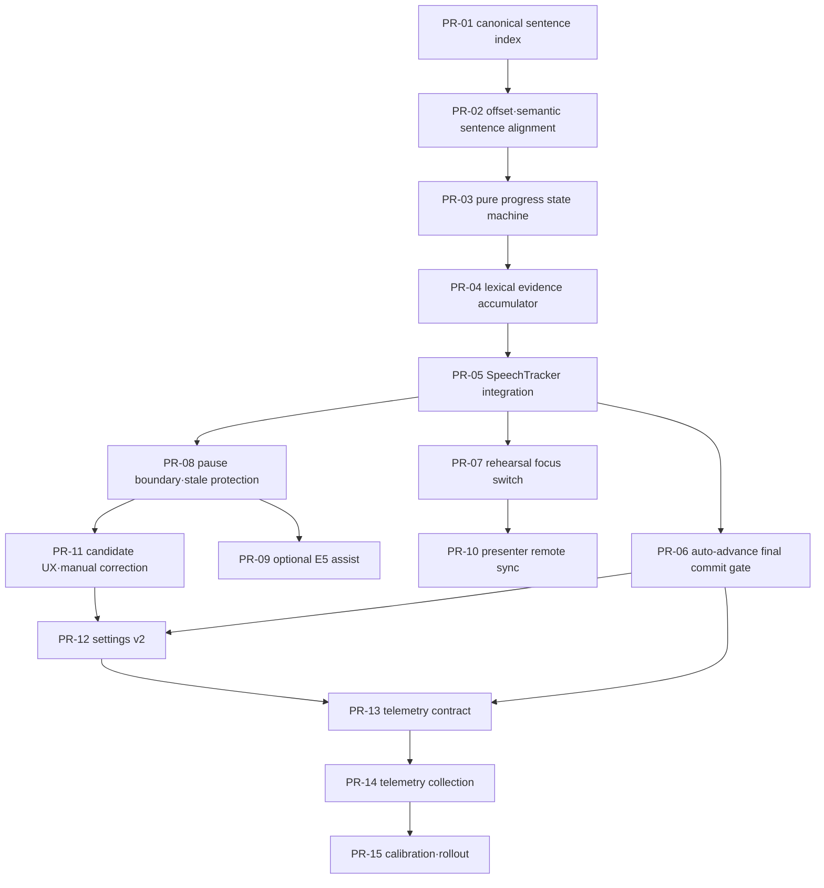

# Implementation Plan: NLI 없는 리허설 프롬프터 진행 v2

**상태:** Implementation review
**작성일:** 2026-07-14
**주요 소유 영역:** `apps/web/src/features/rehearsal`
**공통 계약 변경:** PR-13부터 `packages/shared`와 `docs/contracts.md`에 한해 사용
**DB migration:** 없음

## 1. 목적

리허설 모드에서 문장의 앞부분이나 짧은 대표 구절만 인식됐는데도 프롬프터가 다음 문장으로 이동하는 문제를 해결한다.

목표 동작은 다음과 같다.

- 문장 앞부분의 짧은 partial 전사는 현재 문장을 유지한 채 `candidate`만 만든다.
- 사용자가 대본을 완전히 그대로 읽지 않아도 핵심 내용과 문장 종료 경계가 확인되면 다음 문장으로 이동한다.
- NLI는 프롬프터 진행, 마지막 문장 완료, 자동 슬라이드 전환에 사용하지 않는다.
- 현재 코드의 NLI `off`/`shadow`, benchmark gate, `actionGate.allowed: false` 안전장치를 변경하지 않는다.
- 코칭·리포트의 `coveredSentenceIds`와 발표자 UI의 진행 상태를 분리한다.
- 한 번의 오인식이나 늦게 도착한 비동기 결과가 여러 문장을 건너뛰지 못하게 한다.

이 문서는 [Semantic Sentence Matching and Presenter Script UI](./semantic-sentence-presenter-matching.md)의 Task 2와 Task 7에 있는 “covered 즉시 다음 문장 포커스” 동작을 대체한다. 해당 문서의 문장 UI, 발표자 원격 창, 개인정보 경계는 계속 유효하다.

## 2. 관련 문서와 우선순위

- 발표자 화면 기준: [presenter-screen.md](../specs/presenter-screen.md)
- 기존 발표자 구현 분해: [presenter-screen-implementation-breakdown.md](./presenter-screen-implementation-breakdown.md)
- 기존 문장 의미 매칭 계획: [semantic-sentence-presenter-matching.md](./semantic-sentence-presenter-matching.md)
- NLI runtime의 역사적 설계와 중단 조건: [semantic-cue-nli-runtime-plan.md](./semantic-cue-nli-runtime-plan.md)
- 공통 계약: [contracts.md](../contracts.md)
- Git/PR 규칙: [git-rules.md](../git-rules.md)

규칙이 충돌하면 `AGENTS.md`가 최우선이고, 프롬프터의 진행 판정에 대해서는 이 문서가 기존 의미 매칭 계획보다 우선한다.

## 3. 범위

### 포함

- speaker notes의 canonical 문장 ID와 offset
- 프롬프터 전용 `tracking → candidate → committed` 상태 머신
- 현재 문장에 한정된 lexical evidence 누적
- STT `final` 또는 쉼을 이용한 commit boundary
- 이미 활성화된 경우에만 사용하는 선택적 E5 보조 판정
- 리허설 화면과 발표자 원격 창의 진행 상태 동기화
- candidate 표시, 수동 이전/다음, 자동 따라가기
- 마지막 문장 `committed` 기반 자동 슬라이드 전환 강화
- 프롬프터 민감도 preset과 `presenterSettings` v2 migration
- transcript/대본 원문 없는 계측과 정책 보정

### 제외

- NLI provider 활성화, 모델 교체, threshold 조정
- `VITE_SEMANTIC_CUE_NLI_*` 환경변수 변경
- `semanticCueRuntime.actionGate` 변경
- `semanticCueScoreCombiner`의 NLI 가중치를 0으로 만드는 우회
- STT 엔진 또는 모델 변경
- Deck JSON schema 변경
- 새로운 API endpoint 또는 DB migration
- audience/slide window로 speaker notes, transcript, 진행 evidence 전송
- 전역 `ArrowLeft`/`ArrowRight` 단축키 재정의
- 음성 명령으로 “대본 다음/이전”을 제어하는 기능

## 4. 현재 문제의 코드 흐름

| 영역                          | 현재 동작                                                                                   | 문제                                                                                                   |
| ----------------------------- | ------------------------------------------------------------------------------------------- | ------------------------------------------------------------------------------------------------------ |
| `phraseExtractor.ts`          | 문장별 2~4어절 대표 구절을 만든다.                                                          | 짧은 구절은 문장 전체 완료 근거로 부족하다.                                                            |
| `speechTracker.ts`            | 아직 covered되지 않은 모든 문장을 순회하고 후보 하나가 맞으면 `coverSentence()`를 호출한다. | partial 하나로 문장 전체가 covered될 수 있다.                                                          |
| `scriptProgressTracker.ts`    | 대본 내 문자 진행 offset을 계산한다.                                                        | 현재는 퍼센트 표시 보조에 가깝고 문장 commit에 사용되지 않는다.                                        |
| `rehearsalScriptPrompter.ts`  | 첫 번째 uncovered 문장을 `current`로 선택한다.                                              | 코칭 coverage가 UI 진행을 직접 움직인다.                                                               |
| `semanticUtteranceMatcher.ts` | E5로 슬라이드 문장 전체를 순위화한다.                                                       | 높은 유사도 하나가 먼 문장까지 covered시킬 수 있다.                                                    |
| `advanceController.ts`        | `effectiveCoverage`, `finalSentenceSpoken`, pause를 기준으로 countdown을 시작한다.          | 마지막 구절 일부만 인식돼도 slide eligibility가 생길 수 있다.                                          |
| `semanticCueRuntime.ts`       | lexical/concept/E5 basic decision과 NLI decision을 만든다.                                  | report용 basic threshold는 프롬프터 자동 진행에 느슨하며 runtime을 재호출하면 cue progress를 변경한다. |

현재 회귀 테스트도 이 동작을 고정한다.

- `speechTracker.test.ts`는 partial 대표 구절이 `sentence-covered`를 만드는 것을 기대한다.
- `RehearsalWorkspace.test.tsx`는 partial로 covered된 문장이 다음 문장 포커스를 만드는 것을 기대한다.
- `advanceController.test.ts`는 `finalSentenceSpoken=true`만으로 마지막 문장 조건을 충족한다.

이 테스트는 삭제하지 않고 각 PR에서 새로운 책임에 맞게 반전하거나 분리한다.

## 5. 아키텍처 결정

### 5.1 코칭 coverage와 프롬프터 진행 분리

`coveredSentenceIds`는 코칭, missed sentence, report 생성 계약으로 유지한다. 의미와 생성 시점을 이 작업에서 바꾸지 않는다.

프롬프터는 별도의 `PrompterProgressSnapshot`만 사용해 현재 문장을 선택한다.

```text
SpeechTracker coverage ───────────────> coaching/report

STT result
  ├─ lexical evidence accumulator
  ├─ optional existing E5 evidence
  └─ final/pause/manual boundary
          │
          v
PrompterProgressTracker ──────────────> rehearsal/presenter script focus
          │
          └─ finalSentenceCommitted ─> AdvanceController
```

### 5.2 commit은 상태가 아니라 원자적 전환

진행 흐름은 다음과 같다.

```text
tracking
  └─ 충분하지 않은 phrase/partial ─> candidate
candidate
  ├─ evidence 만료/문장 불일치 ────> tracking
  └─ evidence + boundary ───────────> committed
committed
  └─ 같은 transaction에서 다음 문장 tracking으로 이동
```

`committed`는 영구 UI 상태가 아니라 이벤트로 관찰 가능한 전환이다. snapshot에는 `lastCommittedSentenceId`, `lastCommitSource`, `committedSentenceIds`를 남긴다.

### 5.3 현재 문장 우선, 다음 문장은 preview만 허용

- commit 대상은 항상 `currentSentenceId`다.
- lookahead는 최대 1이며 다음 문장 match는 preview candidate로만 사용한다.
- 한 STT result 또는 pause boundary에서 최대 한 문장만 commit한다.
- 이미 지난 문장이나 다음다음 문장은 자동 commit하지 않는다.
- slide 변경, 수동 이전/다음, tracker reset마다 `revision`을 증가시킨다.
- 비동기 결과의 revision이 현재와 다르면 폐기한다.

### 5.4 E5는 선택적 보조 신호

E5는 NLI가 아니지만 문장 간 entailment, 부정, 인과관계를 판별하지 못한다. 따라서 다음 제약을 둔다.

- 기존 semantic matching 설정과 E5 service가 이미 사용 가능한 경우에만 보조 evidence를 만든다.
- semantic matching이 꺼져 있으면 E5를 위해 설정을 켜거나 index를 prewarm하지 않는다.
- E5 단독으로는 commit하지 않는다.
- E5 threshold는 기존 `SEMANTIC_OUTCOME_POLICY`를 변경하지 않고 프롬프터 전용 policy에 둔다.
- `semanticCueRuntime.evaluateFinalResult()`를 프롬프터에서 재호출하지 않는다.
- `semanticCueRuntime`의 basic/NLI decision과 debug event를 프롬프터 입력으로 사용하지 않는다.
- cue의 `negativeHints`나 관계 검증이 필요한 경우 semantic evidence로 commit하지 않는다.

### 5.5 자동 슬라이드 전환은 프롬프터 완료를 소비하되 semantic action gate를 우회하지 않는다

자동 전환의 마지막 문장 조건을 `finalSentenceSpoken`에서 `finalSentenceCommitted`로 강화한다.

기존 `semanticAutoActionAllowed`, remaining build, pause, countdown, last slide 정책은 유지한다. NLI/basic cue 결과가 `semanticAutoActionAllowed`를 true로 만들도록 변경하지 않는다.

### 5.6 개인정보

프롬프터 state, event, telemetry에는 다음 값을 저장하지 않는다.

- transcript 원문
- speaker notes 또는 sentence text
- semantic premise/hypothesis
- raw audio 또는 audio base64
- API key, token, cookie, password, credential, secret

브라우저 내부 matcher가 일시적으로 원문을 처리할 수는 있지만 persistent state와 server payload에는 식별자와 수치형 evidence만 남긴다.

## 6. 목표 타입과 정책

아래 타입은 설계 기준이며 실제 구현 시 이름은 기존 convention에 맞게 조정할 수 있다.

```ts
type PrompterProgressPhase = "tracking" | "candidate" | "committed";

type PrompterCommitSource = "lexical" | "semantic-assisted" | "manual";

type PrompterProgressSnapshot = {
  slideId: string;
  revision: number;
  phase: PrompterProgressPhase;
  currentSentenceId: string | null;
  candidateSentenceId: string | null;
  committedSentenceIds: string[];
  lastCommittedSentenceId: string | null;
  lastCommitSource: PrompterCommitSource | null;
  candidateSinceMs: number | null;
  finalSentenceCommitted: boolean;
  finalSentenceCommittedAtMs: number | null;
};

type PrompterEvidenceSnapshot = {
  sentenceId: string;
  lexicalRecall: number;
  sentenceProgressRatio: number;
  terminalAnchorMatched: boolean;
  meaningfulTokenCount: number;
  semanticSimilarity: number | null;
  semanticMargin: number | null;
  deterministicAnchorMatched: boolean;
  stableResultCount: number;
  updatedAtMs: number;
};

type PrompterBoundary =
  | { type: "stt-final"; atMs: number }
  | { type: "pause-started"; atMs: number; silenceDurationMs: number }
  | { type: "manual-next"; atMs: number }
  | { type: "manual-previous"; atMs: number };
```

### 6.1 초기 balanced policy

다음 값은 출시 확정값이 아니라 fixture와 telemetry로 보정할 시작값이다.

| 항목                          | 초기값 | 의미                                |
| ----------------------------- | -----: | ----------------------------------- |
| `lexicalRecallThreshold`      | `0.70` | 현재 문장의 의미 있는 어절 recall   |
| `terminalProgressThreshold`   | `0.85` | 현재 문장 후반부에 도달한 진행 비율 |
| `semanticSimilarityThreshold` | `0.92` | 프롬프터 전용 E5 최소 유사도        |
| `semanticMarginThreshold`     | `0.05` | top-1과 top-2의 최소 차이           |
| `candidateHoldMs`             |  `500` | partial candidate 안정화 시간       |
| `pauseCommitMs`               |  `600` | 문장 commit에 사용할 최소 쉼        |
| `maxEvidenceAgeMs`            | `1500` | 오래된 evidence 폐기 시간           |
| `lookahead`                   |    `1` | 다음 문장 preview 범위              |
| `maxCommitsPerBoundary`       |    `1` | 한 번에 여러 문장 점프 방지         |

### 6.2 commit 규칙

```text
freshBoundary =
  evidence age <= maxEvidenceAgeMs
  AND (STT final OR silence >= pauseCommitMs)

lexicalPath =
  lexicalRecall >= lexicalRecallThreshold
  AND (
    terminalAnchorMatched
    OR sentenceProgressRatio >= terminalProgressThreshold
  )

semanticAssistedPath =
  existingE5Available
  AND semanticSimilarity >= semanticSimilarityThreshold
  AND semanticMargin >= semanticMarginThreshold
  AND deterministicAnchorMatched
  AND meaningfulTokenCount >= 3

commit =
  freshBoundary
  AND stableCandidate
  AND (lexicalPath OR semanticAssistedPath)
```

추가 규칙:

- 의미 있는 token이 4개 이하인 짧은 문장은 대표 구절 하나만으로 commit하지 않는다.
- 짧은 문장의 lexical path는 terminal anchor와 전체 핵심 token 충족을 요구한다.
- E5 unavailable/error는 실패가 아니라 lexical-only degradation이다.
- `scriptProgress`와 terminal anchor는 단독 commit 근거가 아니다.
- keyword hit, semantic cue basic decision, NLI decision은 단독 또는 조합 commit 근거가 아니다.

## 7. PR 의존성



PR-01부터 PR-09까지는 순차 병합한다. PR-10은 PR-07 이후, PR-11은 PR-08 이후 준비할 수 있지만 동일 파일 충돌을 줄이기 위해 기본적으로 번호 순서대로 병합한다.

## 8. PR 단위 구현 계획

## PR-00: 구현 계획 문서

**브랜치:** `docs/rehearsal-prompter-progress-v2`
**제목:** `docs: NLI 없는 프롬프터 진행 구현 계획 추가`
**의존성:** 없음
**예상 크기:** XS

### 변경

- 이 구현 문서를 추가한다.
- 기존 immediate coverage focus 계획과의 우선순위를 명시한다.

### 완료 조건

- [ ] 모든 구현 PR에 의존성, acceptance criteria, 검증 명령이 있다.
- [ ] NLI와 개인정보 금지선이 명시되어 있다.
- [ ] 문서만 변경했으므로 코드 테스트 미실행 사실을 PR 본문에 남긴다.

## PR-01: canonical 문장 인덱스

**브랜치:** `feature/prompter-canonical-index`
**제목:** `refactor: 리허설 대본 문장 인덱스 통일`
**의존성:** PR-00
**예상 크기:** M
**사용자 동작 변경:** 없음

### 구현

- Web-local `canonicalScriptSentenceIndex.ts`를 추가한다.
- NFC, CRLF, 반복 공백을 결정론적으로 정규화한다.
- 명시적 비어 있지 않은 줄바꿈이 2개 이상이면 줄을 우선 tracking unit으로 사용한다.
- 줄바꿈이 없으면 `.`, `?`, `!`, `。`, `？`, `！`, `…`를 문장 경계로 사용한다.
- decimal period는 문장 경계로 처리하지 않는다.
- `sentence_<1-based index>` ID와 normalized source offset을 함께 만든다.
- `phraseExtractor`가 이 인덱스를 사용하되 기존 phrase candidate 출력은 유지한다.

### 예상 파일

- `apps/web/src/features/rehearsal/speech/canonicalScriptSentenceIndex.ts`
- `apps/web/src/features/rehearsal/speech/canonicalScriptSentenceIndex.test.ts`
- `apps/web/src/features/rehearsal/speech/phraseExtractor.ts`
- `apps/web/src/features/rehearsal/speech/phraseExtractor.test.ts`

### 완료 조건

- [ ] NFC/NFD, CRLF/LF 입력에서 같은 ID와 text를 만든다.
- [ ] 명시적 줄바꿈 우선 규칙이 `presenter-screen.md` D11과 일치한다.
- [ ] decimal, ellipsis, CJK punctuation fixture가 통과한다.
- [ ] 기존 phrase 후보 수와 final trigger 판정이 의도치 않게 바뀌지 않는다.

### 검증

```bash
pnpm --filter @orbit/web exec vitest run \
  src/features/rehearsal/speech/canonicalScriptSentenceIndex.test.ts \
  src/features/rehearsal/speech/phraseExtractor.test.ts
pnpm --filter @orbit/web typecheck
```

## PR-02: offset과 semantic 문장 정렬

**브랜치:** `feature/prompter-sentence-offsets`
**제목:** `refactor: 대본 진행 offset과 의미 문장 ID 정렬`
**의존성:** PR-01
**예상 크기:** M
**사용자 동작 변경:** 없음

### 구현

- `scriptProgressTracker`가 canonical sentence offset을 기준으로 현재 문장 진행률을 제공한다.
- `ScriptProgressSnapshot`에 `sentenceId`, `sentenceCharOffset`, `sentenceTotalChars`, `sentenceRatio`를 추가한다.
- `semanticSentenceSplitter`를 canonical index의 thin adapter로 전환한다.
- `semanticUtteranceMatcher`의 문장 ID가 phrase/progress 인덱스와 일치하는지 회귀 테스트를 추가한다.

### 예상 파일

- `apps/web/src/features/rehearsal/speech/scriptProgressTracker.ts`
- `apps/web/src/features/rehearsal/speech/scriptProgressTracker.test.ts`
- `apps/web/src/features/rehearsal/speech/semanticSentenceSplitter.ts`
- `apps/web/src/features/rehearsal/speech/semanticSentenceSplitter.test.ts`
- `apps/web/src/features/rehearsal/speech/semanticUtteranceMatcher.test.ts`

### 완료 조건

- [ ] 같은 speaker notes에서 phrase, script progress, E5 index가 같은 `sentenceId`를 사용한다.
- [ ] offset이 문장 경계를 넘을 때만 `sentenceId`가 바뀐다.
- [ ] 전체 `ratio`와 문장별 `sentenceRatio`가 각각 독립적으로 유지된다.
- [ ] offset은 evidence일 뿐 coverage나 프롬프터 focus를 변경하지 않는다.

### 검증

```bash
pnpm --filter @orbit/web exec vitest run \
  src/features/rehearsal/speech/scriptProgressTracker.test.ts \
  src/features/rehearsal/speech/semanticSentenceSplitter.test.ts \
  src/features/rehearsal/speech/semanticUtteranceMatcher.test.ts
pnpm --filter @orbit/web typecheck
```

## PR-03: 순수 프롬프터 진행 상태 머신

**브랜치:** `feature/prompter-progress-state`
**제목:** `feat: 프롬프터 진행 상태 머신 추가`
**의존성:** PR-02
**예상 크기:** S
**사용자 동작 변경:** 없음

### 구현

- `prompterProgressTracker.ts`와 전용 test를 추가한다.
- tracker는 UI, STT port, NLI, semantic runtime을 import하지 않는 순수 모듈로 만든다.
- `acceptEvidence`, `acceptBoundary`, `manualNext`, `manualPrevious`, `reset`, `snapshot` 인터페이스를 제공한다.
- commit 대상은 current sentence 하나로 제한한다.
- slide visit과 manual correction마다 revision을 증가시킨다.
- manual previous는 프롬프터 전용 committed state만 되돌리고 `coveredSentenceIds`는 변경하지 않는다.

### 예상 파일

- `apps/web/src/features/rehearsal/speech/prompterProgressTracker.ts`
- `apps/web/src/features/rehearsal/speech/prompterProgressTracker.test.ts`
- 필요 시 `apps/web/src/features/rehearsal/speech/prompterProgressTypes.ts`

### 완료 조건

- [ ] 초기 current는 첫 번째 matchable 문장이다.
- [ ] evidence는 `tracking → candidate`만 만든다.
- [ ] boundary 없는 candidate는 commit되지 않는다.
- [ ] commit 후 정확히 한 문장만 이동한다.
- [ ] stale revision evidence를 무시한다.
- [ ] 마지막 문장 commit에서만 `finalSentenceCommitted=true`가 된다.
- [ ] manual previous/next가 coaching coverage를 변경하지 않는다.

### 검증

```bash
pnpm --filter @orbit/web exec vitest run \
  src/features/rehearsal/speech/prompterProgressTracker.test.ts
pnpm --filter @orbit/web typecheck
```

## Checkpoint A: 기반 계약

- [ ] PR-01~PR-03이 순서대로 병합됐다.
- [ ] 기존 리허설 UI 동작은 아직 바뀌지 않았다.
- [ ] canonical sentence ID fixture가 세 tracker에서 일치한다.
- [ ] `pnpm --filter @orbit/web test`와 `pnpm --filter @orbit/web typecheck`가 통과한다.

## PR-04: lexical evidence 누적

**브랜치:** `feature/prompter-lexical-evidence`
**제목:** `feat: 문장별 lexical evidence 누적 추가`
**의존성:** PR-03
**예상 크기:** M
**사용자 동작 변경:** 없음

### 구현

- 현재 문장 전용 `prompterLexicalEvidence.ts`를 추가한다.
- 여러 partial/final 결과의 의미 있는 token coverage를 현재 문장 범위에서만 누적한다.
- 조사 제거와 정규화는 기존 `normalizeSpeechText`, `stripKoreanParticle`, `calculateWordMultisetRecall`을 재사용한다.
- 문장의 마지막 2~3개 의미 있는 token에서 terminal anchor를 만든다.
- `scriptProgressTracker.sentenceRatio`를 보조 evidence로 사용한다.
- commit 가능 여부를 반환하지 않고 evidence snapshot만 반환한다.

### 예상 파일

- `apps/web/src/features/rehearsal/speech/prompterLexicalEvidence.ts`
- `apps/web/src/features/rehearsal/speech/prompterLexicalEvidence.test.ts`
- `apps/web/src/features/rehearsal/speech/speechMatcher.ts`
- `apps/web/src/features/rehearsal/speech/speechMatcher.test.ts`

### 완료 조건

- [ ] 앞부분 2~4어절만 인식하면 recall은 증가하지만 terminal anchor는 false다.
- [ ] terminal anchor만 우연히 말해도 lexical recall이 부족하면 commit 조건이 되지 않는다.
- [ ] 여러 partial에 분산된 token을 현재 문장 안에서 누적한다.
- [ ] 다음 문장 token은 current evidence에 섞이지 않는다.
- [ ] commit/reset 이후 이전 문장의 누적 token을 제거한다.
- [ ] snapshot과 event에 원문 transcript를 노출하지 않는다.

### 검증

```bash
pnpm --filter @orbit/web exec vitest run \
  src/features/rehearsal/speech/prompterLexicalEvidence.test.ts \
  src/features/rehearsal/speech/speechMatcher.test.ts
pnpm --filter @orbit/web typecheck
```

## PR-05: SpeechTracker 통합

**브랜치:** `feature/prompter-speech-tracker`
**제목:** `feat: 발화 추적 스냅샷에 프롬프터 진행 연결`
**의존성:** PR-04
**예상 크기:** M
**사용자 동작 변경:** 없음

### 구현

- `SpeechTracker`가 coverage tracker와 별도로 `PrompterProgressTracker`를 소유한다.
- `acceptResult()`에서 lexical evidence를 갱신한다.
- STT final을 `stt-final` boundary로 전달한다.
- `SpeechTrackerSnapshot`에 `prompterProgress`와 `finalSentenceCommitted`를 추가한다.
- `acceptPrompterBoundary()`와 manual correction API를 추가한다.
- 기존 `coverSentence()`, `coveredSentenceIds`, `finalSentenceSpoken` 동작은 유지한다.

### 예상 파일

- `apps/web/src/features/rehearsal/speech/speechTrackingEvents.ts`
- `apps/web/src/features/rehearsal/speech/speechTracker.ts`
- `apps/web/src/features/rehearsal/speech/speechTracker.test.ts`
- `apps/web/src/features/rehearsal/speech/__fixtures__/p3SpeechFixture.ts`

### 완료 조건

- [ ] partial phrase가 기존 keyword/coverage event를 만들더라도 prompter는 candidate에 머문다.
- [ ] `coveredSentenceIds` 변화와 `currentSentenceId` 변화가 독립적이다.
- [ ] lexical 조건과 final boundary가 함께 있을 때만 commit한다.
- [ ] 같은 final을 중복 수신해도 한 번만 commit한다.
- [ ] semantic `acceptSemanticSentenceMatch()`는 코칭 coverage를 바꾸지만 prompter를 직접 commit하지 않는다.

### 검증

```bash
pnpm --filter @orbit/web exec vitest run \
  src/features/rehearsal/speech/speechTracker.test.ts \
  src/features/rehearsal/speech/prompterProgressTracker.test.ts \
  src/features/rehearsal/speech/prompterLexicalEvidence.test.ts
pnpm --filter @orbit/web typecheck
```

## PR-06: 마지막 문장 commit 기반 자동 전환

**브랜치:** `fix/auto-advance-final-commit`
**제목:** `fix: 자동 슬라이드 전환을 마지막 문장 확정 기준으로 강화`
**의존성:** PR-05
**예상 크기:** M
**사용자 동작 변경:** 마지막 구절 일부 인식으로 countdown이 시작되지 않음

### 구현

- `AdvanceControllerSnapshot`에 `finalSentenceCommitted`, `finalSentenceCommittedAtMs`를 추가한다.
- eligibility의 마지막 문장 조건을 `finalSentenceCommitted`로 변경한다.
- `finalSentenceSpoken`은 기존 코칭·진단 호환을 위해 유지하되 countdown 조건에 사용하지 않는다.
- 기존 `effectiveCoverage`, `policy.pauseMs`, countdown, remaining builds, last slide, manual cancel을 유지한다.
- `semanticAutoActionAllowed` gate를 유지한다.
- NLI/basic cue evidence를 새로운 auto-action 허가 신호로 연결하지 않는다.
- 기존 `LiveSttSlideAdvanceEvent.reason` 값은 공통 계약 변경을 피하기 위해 이 PR에서 변경하지 않는다.

### 예상 파일

- `apps/web/src/features/rehearsal/advance/advanceController.ts`
- `apps/web/src/features/rehearsal/advance/advanceController.test.ts`
- `apps/web/src/features/rehearsal/advance/__fixtures__/p4AutoAdvanceFixture.ts`
- `apps/web/src/features/rehearsal/RehearsalWorkspace.tsx`
- `apps/web/src/features/rehearsal/RehearsalWorkspace.test.tsx`

### 완료 조건

- [ ] `finalSentenceSpoken=true`, `finalSentenceCommitted=false`에서는 tracking을 유지한다.
- [ ] 마지막 phrase 일부만 말하면 countdown을 시작하지 않는다.
- [ ] 마지막 문장 lexical commit 후 pause에서만 countdown을 시작한다.
- [ ] 이후 semantic-assisted commit도 동일한 `finalSentenceCommitted` 계약만 사용한다.
- [ ] countdown 완료 전에는 slide를 이동하지 않는다.
- [ ] countdown 중 발화 재개 시 즉시 취소한다.
- [ ] remaining build와 last slide 동작이 유지된다.
- [ ] `semanticAutoActionAllowed=false`이면 기존처럼 자동 전환하지 않는다.

### 검증

```bash
pnpm --filter @orbit/web exec vitest run \
  src/features/rehearsal/advance/advanceController.test.ts \
  src/features/rehearsal/advance/AutoAdvanceStatus.test.tsx \
  src/features/rehearsal/RehearsalWorkspace.test.tsx
pnpm --filter @orbit/web typecheck
```

## PR-07: 리허설 프롬프터 focus 전환

**브랜치:** `fix/rehearsal-prompter-early-advance`
**제목:** `fix: coverage와 프롬프터 현재 문장 이동 분리`
**의존성:** PR-05
**예상 크기:** M
**사용자 동작 변경:** 첫 체감 수정

### 구현

- `createRehearsalScriptPrompterRows()`가 `PrompterProgressSnapshot`을 기준으로 current/next를 계산한다.
- `coveredSentenceIds`와 match kind는 covered/paraphrased badge 표현에만 사용한다.
- `RehearsalWorkspace`가 `p3PanelSnapshot.prompterProgress`를 panel에 전달한다.
- snapshot이 없는 preflight/legacy 렌더에서는 첫 matchable 문장을 current로 표시하고 coverage만으로 이동하지 않는다.
- 기존 “partial covered sentence가 다음 문장으로 이동” 테스트를 반대 기대값으로 바꾼다.

### 예상 파일

- `apps/web/src/features/rehearsal/panel/rehearsalScriptPrompter.ts`
- `apps/web/src/features/rehearsal/panel/rehearsalScriptPrompter.test.ts`
- `apps/web/src/features/rehearsal/RehearsalWorkspace.tsx`
- `apps/web/src/features/rehearsal/RehearsalWorkspace.test.tsx`

### 완료 조건

- [ ] coverage만 바뀌어도 current sentence는 유지된다.
- [ ] prompter commit 후에만 다음 문장이 current가 된다.
- [ ] 모든 문장이 commit된 뒤 마지막 문장을 focus로 유지한다.
- [ ] covered/paraphrased 시각 상태는 기존 코칭 결과를 유지한다.
- [ ] transcript 원문은 panel DOM에 렌더하지 않는다.

### 검증

```bash
pnpm --filter @orbit/web exec vitest run \
  src/features/rehearsal/panel/rehearsalScriptPrompter.test.ts \
  src/features/rehearsal/RehearsalWorkspace.test.tsx
pnpm --filter @orbit/web typecheck
```

## PR-08: pause boundary와 stale 보호

**브랜치:** `feature/prompter-pause-boundary`
**제목:** `feat: 프롬프터 쉼 확정과 stale 후보 보호 추가`
**의존성:** PR-05
**예상 크기:** M
**사용자 동작 변경:** final이 불안정한 STT에서도 자연스러운 쉼으로 진행 가능

### 구현

- 현재 무시되는 `PauseDetector.accept()` output을 `RehearsalWorkspace`에서 소비한다.
- `pause-started`를 P3 session의 `acceptPrompterBoundary()`에 전달한다.
- `speech-resumed`는 auto-advance countdown을 취소하되 이미 완료된 commit은 되돌리지 않는다.
- 한 번의 불안정한 인식만으로 commit하지 않는다. 동일한 `slideId`, `currentSentenceId`, `prompterRevision`의 유효한 candidate가 `candidateHoldMs=500` 이상 연속 유지된 경우에만 `stableCandidate`로 인정한다.
- candidate가 사라지거나 `commitEligible=false`가 되거나 sentence/revision이 바뀌면 `candidateSinceMs`를 즉시 초기화한다. 이후 다시 유효해지면 새 시각부터 유지 시간을 계산한다.
- `pause-started` boundary는 `silenceDurationMs >= pauseCommitMs`일 때만 commit에 사용할 수 있으며 기본값은 `pauseCommitMs=600`으로 한다.
- boundary 시각 기준 candidate evidence age가 `maxEvidenceAgeMs=1500`을 초과하면 폐기하고 commit하지 않는다.
- 현재 `slideId`, `currentSentenceId`, `prompterRevision`과 일치하지 않는 늦은 result/evidence/boundary는 commit 입력으로 사용하지 않는다. 이전 slide, 이미 commit된 sentence, 이전 revision의 결과도 모두 거부한다.
- 위 기본값은 PR-08에서 `candidateHoldMs=500`, `pauseCommitMs=600`, `maxEvidenceAgeMs=1500`으로 고정하고 후속 telemetry 기반 조정은 별도 PR로 분리한다.

### 예상 파일

- `apps/web/src/features/rehearsal/RehearsalWorkspace.tsx`
- `apps/web/src/features/rehearsal/RehearsalWorkspace.test.tsx`
- `apps/web/src/features/rehearsal/speech/p3RehearsalSession.ts`
- `apps/web/src/features/rehearsal/speech/p3RehearsalSession.test.ts`
- `apps/web/src/features/rehearsal/speech/prompterProgressTracker.ts`
- `apps/web/src/features/rehearsal/speech/prompterProgressTracker.test.ts`
- `apps/web/src/features/rehearsal/speech/pauseDetector.test.ts`

### 완료 조건

- [ ] lexical 조건 + 599ms 쉼에서는 commit하지 않는다.
- [ ] lexical 조건 + 600ms 이상 쉼에서 commit한다.
- [ ] 오래된 candidate가 뒤늦은 pause로 commit되지 않는다.
- [ ] 이전 slide, sentence, revision에서 도착한 pause/result가 현재 문장에 적용되지 않는다.
- [ ] 발화 재개 시 slide countdown은 취소된다.

### 필수 테스트

- [ ] 한 번만 commit 조건을 만족한 noisy result는 문장을 commit하지 않는다.
- [ ] 동일한 유효 candidate가 500ms 동안 연속 유지되면 boundary에서 commit할 수 있다.
- [ ] 599ms pause에서는 commit하지 않는다.
- [ ] 600ms pause에서는 commit한다.
- [ ] `maxEvidenceAgeMs=1500`을 초과한 오래된 candidate를 거부한다.
- [ ] 이전 slide의 결과와 이전 `prompterRevision`의 결과를 거부한다.
- [ ] candidate 유효성이 중간에 깨지면 `candidateSinceMs`가 초기화되고 500ms 유지 시간을 처음부터 다시 계산한다.

### 검증

```bash
pnpm --filter @orbit/web exec vitest run \
  src/features/rehearsal/speech/pauseDetector.test.ts \
  src/features/rehearsal/speech/prompterProgressTracker.test.ts \
  src/features/rehearsal/speech/p3RehearsalSession.test.ts \
  src/features/rehearsal/RehearsalWorkspace.test.tsx
pnpm --filter @orbit/web typecheck
```

## Checkpoint B: 조기 진행 수정

- [ ] PR-04~PR-08이 병합됐다.
- [ ] 앞부분 phrase partial만으로 현재 문장이 바뀌지 않는다.
- [ ] 앞부분 phrase partial만으로 slide countdown이 시작되지 않는다.
- [ ] 대본을 충분히 말한 final 또는 pause에서는 한 문장만 이동한다.
- [ ] lexical-only 경로로 전체 리허설이 가능하다.
- [ ] `pnpm --filter @orbit/web test`와 `pnpm --filter @orbit/web typecheck`가 통과한다.

## PR-09: 선택적 E5 보조 판정

**브랜치:** `feature/prompter-e5-assist`
**제목:** `feat: 기존 E5 기반 프롬프터 보조 판정 추가`
**의존성:** PR-08
**예상 크기:** M
**사용자 동작 변경:** 자연스러운 바꿔 말하기 일부 허용

### 구현

- `prompterSemanticEvidence.ts`를 추가한다.
- existing E5 matcher 결과를 프롬프터 evidence로 변환하되 current/next sentence로 후보를 제한한다.
- current sentence는 high similarity, margin, deterministic anchor, boundary가 모두 충족될 때만 commit할 수 있다.
- next sentence match는 preview candidate만 만들고 current를 건너뛰지 않는다.
- E5 result enqueue 시 `prompterRevision`을 캡처하고 apply 시 다시 검사한다.
- `semanticMatching=false` 또는 E5 unavailable이면 lexical-only로 계속 진행한다.

### 명시적 금지

- `semanticCueFeatureFlags.ts` 변경 금지
- `semanticCueScoreCombiner.ts` 변경 금지
- `semanticCueRuntime.ts`의 action/coverage mutation 경로 재사용 금지
- `SEMANTIC_OUTCOME_POLICY` 전역 threshold 변경 금지
- NLI type/provider import 금지

### 예상 파일

- `apps/web/src/features/rehearsal/speech/prompterSemanticEvidence.ts`
- `apps/web/src/features/rehearsal/speech/prompterSemanticEvidence.test.ts`
- `apps/web/src/features/rehearsal/speech/semanticUtteranceMatcher.ts`
- `apps/web/src/features/rehearsal/speech/semanticUtteranceMatcher.test.ts`
- `apps/web/src/features/rehearsal/speech/p3RehearsalSession.ts`

### 완료 조건

- [ ] E5 high 단독은 candidate만 만들고 commit하지 않는다.
- [ ] keyword/basic cue/NLI decision 단독은 commit하지 않는다.
- [ ] E5 high + margin + current anchor + final/pause에서만 semantic-assisted commit한다.
- [ ] top-1/top-2가 ambiguous하면 commit하지 않는다.
- [ ] 세 번째 이후 문장이 가장 높아도 commit 후보에 포함하지 않는다.
- [ ] E5 error가 lexical 진행과 STT session을 중단하지 않는다.
- [ ] NLI entailment 결과가 있어도 prompter state는 변하지 않는다.

### 검증

```bash
pnpm --filter @orbit/web exec vitest run \
  src/features/rehearsal/speech/prompterSemanticEvidence.test.ts \
  src/features/rehearsal/speech/semanticUtteranceMatcher.test.ts \
  src/features/rehearsal/speech/semanticUtteranceDecision.test.ts \
  src/features/rehearsal/speech/p3RehearsalSession.test.ts \
  src/features/rehearsal/speech/semanticCueRuntime.test.ts
pnpm --filter @orbit/web typecheck
```

## PR-10: 발표자 원격 창 동기화

**브랜치:** `feature/prompter-remote-sync`
**제목:** `feat: 원격 발표자에 프롬프터 진행 상태 동기화`
**의존성:** PR-07
**예상 크기:** M
**사용자 동작 변경:** presenter remote와 owner 화면의 focus 일치

### 구현

- `PresenterSpeechState` 안에 `prompterProgress`를 추가한다.
- `presentationChannel` runtime validator를 확장한다.
- `PresenterRemoteWindow`가 `coveredSentenceIds` 대신 `prompterProgress.currentSentenceId`를 focus에 사용한다.
- `createAudiencePresenterState()`가 기존처럼 `speech` 전체를 제거하는지 회귀 테스트한다.
- `PresentWindow`와 slide snapshot에는 새 state를 보내지 않는다.

### 예상 파일

- `apps/web/src/features/rehearsal/presenter/presenterStateStore.ts`
- `apps/web/src/features/rehearsal/presenter/presentationChannel.ts`
- `apps/web/src/features/rehearsal/presenter/presentationChannel.test.ts`
- `apps/web/src/features/rehearsal/presenter/PresenterRemoteWindow.tsx`
- `apps/web/src/features/rehearsal/presenter/PresenterRemoteWindow.test.tsx`

### 완료 조건

- [ ] owner와 presenter remote의 current/candidate/committed 상태가 일치한다.
- [ ] remote가 별도 STT/E5 session을 시작하지 않는다.
- [ ] audience state와 slide window에 prompter state, speaker notes, transcript가 포함되지 않는다.
- [ ] 이전 버전 message 또는 speech state 없음에 안전하게 fallback한다.

### 검증

```bash
pnpm --filter @orbit/web exec vitest run \
  src/features/rehearsal/presenter/presentationChannel.test.ts \
  src/features/rehearsal/presenter/PresenterRemoteWindow.test.tsx \
  src/features/rehearsal/presenter/PresentWindow.test.tsx
pnpm --filter @orbit/web typecheck
```

## PR-11: candidate UX와 수동 보정

**브랜치:** `feature/prompter-candidate-controls`
**제목:** `feat: 프롬프터 후보 표시와 수동 보정 추가`
**의존성:** PR-08, PR-10
**예상 크기:** M
**사용자 동작 변경:** 진행 예고와 복구 기능 제공

### 구현

- candidate 동안 current row를 유지한다.
- next row에만 낮은 강도의 preview 상태를 표시한다.
- commit 시 200~300ms 범위에서 부드럽게 scroll한다.
- 이전 문장을 DOM에 유지해 갑작스러운 점프 느낌을 줄인다.
- “이전 문장”, “다음 문장”, “따라가기” 버튼을 제공한다.
- interactive control focus 중 기존 slide shortcut이 실행되지 않게 한다.
- 일반 `ArrowLeft`/`ArrowRight`는 기존 slide/build navigation으로 유지한다.

### 예상 파일

- `apps/web/src/features/rehearsal/presenter/PresenterScriptList.tsx`
- `apps/web/src/features/rehearsal/panel/RehearsalPanel.tsx`
- `apps/web/src/features/rehearsal/panel/RehearsalPanel.test.tsx`
- `apps/web/src/features/rehearsal/RehearsalWorkspace.tsx`
- `apps/web/src/styles.css`

### 완료 조건

- [ ] candidate 중 현재 문장이 `aria-current`를 유지한다.
- [ ] commit 전에는 next row가 current가 되지 않는다.
- [ ] manual next/previous는 정확히 한 문장만 이동한다.
- [ ] manual previous는 coaching coverage를 삭제하지 않는다.
- [ ] 내부 E5 score, confidence, NLI 상태를 사용자에게 노출하지 않는다.
- [ ] reduced motion 환경에서는 smooth animation을 생략한다.

### 검증

```bash
pnpm --filter @orbit/web exec vitest run \
  src/features/rehearsal/panel/RehearsalPanel.test.tsx \
  src/features/rehearsal/presenter/PresenterRemoteWindow.test.tsx \
  src/features/rehearsal/presenter/usePresenterKeyboard.test.ts
pnpm --filter @orbit/web typecheck
```

수동 Chrome 검증:

- owner rehearsal과 presenter remote를 동시에 연다.
- partial → candidate → final/pause → commit을 확인한다.
- 수동 스크롤 후 `따라가기` 복구를 확인한다.
- 버튼 focus 상태에서 slide keyboard navigation이 오작동하지 않는지 확인한다.

## Checkpoint C: 자연 발화와 발표자 UX

- [ ] PR-09~PR-11이 병합됐다.
- [ ] E5가 꺼져 있어도 lexical-only 리허설이 정상 동작한다.
- [ ] E5가 켜져 있어도 단독 similarity로 문장을 넘기지 않는다.
- [ ] owner와 remote의 focus가 일치한다.
- [ ] audience/slide privacy 테스트가 통과한다.

## PR-12: 프롬프터 설정 v2

**브랜치:** `feature/prompter-settings-v2`
**제목:** `feat: 프롬프터 민감도 설정과 v2 마이그레이션 추가`
**의존성:** PR-06, PR-11
**예상 크기:** M
**사용자 동작 변경:** 진행 민감도 preset 선택 가능

### 구현

- `PresenterSettings`에 top-level `prompterProgress`를 추가한다.
- raw threshold 대신 `responsive | balanced | cautious` preset을 사용자에게 제공한다.
- 세부 threshold는 versioned `PrompterAdvancePolicy` resolver에 둔다.
- `advancePolicy.threshold`와 프롬프터 lexical threshold를 공유하지 않는다.
- storage key를 `orbit:presenter:global:v2`로 올리고 v1 migration을 추가한다.
- v1의 STT, recording, auto-advance 설정을 그대로 보존한다.

### 제안 preset

| mode         | lexical recall |     E5 | candidate hold | sentence pause |
| ------------ | -------------: | -----: | -------------: | -------------: |
| `responsive` |         `0.65` | `0.91` |        `350ms` |        `500ms` |
| `balanced`   |         `0.70` | `0.92` |        `500ms` |        `600ms` |
| `cautious`   |         `0.78` | `0.94` |        `700ms` |        `800ms` |

수치는 PR-15 calibration에서 변경할 수 있으며 policy version과 함께 기록한다.

### 예상 파일

- `apps/web/src/features/rehearsal/settings/presenterSettings.ts`
- `apps/web/src/features/rehearsal/settings/presenterSettings.test.ts`
- `apps/web/src/features/rehearsal/advance/AutoAdvanceSettings.tsx`
- `apps/web/src/features/rehearsal/advance/AutoAdvanceSettings.test.tsx`
- `docs/specs/presenter-screen.md`

### 완료 조건

- [ ] v1 저장값을 읽으면 기존 설정을 보존하고 `balanced`를 추가한다.
- [ ] 잘못된 mode는 `balanced`로 fallback한다.
- [ ] partial update가 다른 nested 설정을 덮어쓰지 않는다.
- [ ] localStorage 접근 실패 또는 corrupt JSON에서 기본값으로 복구한다.
- [ ] `advancePolicy.threshold` 변경이 프롬프터 정책을 바꾸지 않는다.

### 검증

```bash
pnpm --filter @orbit/web exec vitest run \
  src/features/rehearsal/settings/presenterSettings.test.ts \
  src/features/rehearsal/advance/AutoAdvanceSettings.test.tsx
pnpm --filter @orbit/web typecheck
```

## Checkpoint D: 자동 전환과 설정

- [ ] PR-06과 PR-12가 병합됐으며 이후 자동 전환 회귀가 없다.
- [ ] 마지막 문장 partial만으로 countdown이 시작되지 않는다.
- [ ] 세 preset 모두 fixture에서 예상 경계를 만족한다.
- [ ] v1 사용자 설정 migration이 검증됐다.
- [ ] NLI 관련 flag, action gate, provider code diff가 없다.

## PR-13: privacy-safe telemetry 계약

**브랜치:** `feature/prompter-telemetry-contract`
**제목:** `feat: 프롬프터 계측 공통 계약 추가`
**의존성:** PR-06, PR-11, PR-12
**예상 크기:** M
**사용자 동작 변경:** 없음
**공통 계약 변경:** 있음

### 구현

- `rehearsalRunMetaSchema`에 nullable/default `prompterProgress` 영역을 추가한다.
- event 수를 최대 200개로 제한한다.
- 과거 run은 `prompterProgress=null`로 parse한다.
- `docs/contracts.md`에 필드와 개인정보 금지 항목을 추가한다.
- API 저장/조회와 Worker parse 호환 테스트를 추가한다.
- `meta_json`을 사용하므로 DB migration은 만들지 않는다.

### 제안 schema

```ts
type RehearsalPrompterProgressMeta = {
  policyVersion: string;
  mode: "responsive" | "balanced" | "cautious";
  events: Array<{
    slideId: string;
    sentenceId: string;
    sentenceIndex: number;
    type:
      | "candidate-entered"
      | "candidate-expired"
      | "committed"
      | "manual-next"
      | "manual-previous";
    source: "lexical" | "semantic-assisted" | "manual";
    lexicalRecall?: number;
    sentenceProgressRatio?: number;
    terminalAnchorMatched?: boolean;
    semanticSimilarity?: number;
    semanticMargin?: number;
    candidateDurationMs?: number;
    silenceDurationMs?: number;
    at: string;
  }>;
} | null;
```

### 예상 파일

- `packages/shared/src/rehearsals/rehearsal.schema.ts`
- `packages/shared/src/rehearsals/rehearsal.schema.test.ts`
- `docs/contracts.md`
- `apps/api/src/rehearsals/rehearsals.service.spec.ts`
- `apps/worker/src/rehearsal-stt.processor.spec.ts`

### 완료 조건

- [ ] 기존 run meta payload가 변경 없이 parse된다.
- [ ] event 201개는 거부된다.
- [ ] `transcript`, `text`, `speakerNotes`, `script`, `premise`, `hypothesis`, `rawAudio` 필드를 nested level에서도 거부한다.
- [ ] API가 strict schema 검증 후 저장한다.
- [ ] Worker report 결과가 새 telemetry 유무와 관계없이 동일하다.
- [ ] DB migration이 추가되지 않는다.

### 검증

```bash
pnpm --filter @orbit/shared test
pnpm --filter @orbit/api test
pnpm --filter @orbit/worker test
pnpm typecheck
```

## PR-14: telemetry 수집과 저장 연결

**브랜치:** `feature/prompter-telemetry-collection`
**제목:** `feat: 프롬프터 계측 수집과 저장 연결`
**의존성:** PR-13
**예상 크기:** M
**사용자 동작 변경:** 없음

### 구현

- `RehearsalLogCollector`에 bounded prompter event recorder를 추가한다.
- P3 session이 progress transition을 privacy-safe projection으로 변환한다.
- run meta finalize와 기존 PATCH 흐름에 포함한다.
- 동일 revision의 중복 candidate/commit event를 제거한다.
- raw tracker object, semantic debug event, transcript를 spread하지 않는다.

### 예상 파일

- `apps/web/src/features/rehearsal/speech/rehearsalLogCollector.ts`
- `apps/web/src/features/rehearsal/speech/rehearsalLogCollector.test.ts`
- `apps/web/src/features/rehearsal/speech/p3RehearsalSession.ts`
- `apps/web/src/features/rehearsal/speech/p3RehearsalSession.test.ts`
- `apps/web/src/features/rehearsal/RehearsalWorkspace.test.tsx`

### 완료 조건

- [ ] candidate/commit/manual event를 중복 없이 최대 200개 기록한다.
- [ ] transcript와 speaker notes가 serialized meta에 포함되지 않는다.
- [ ] semantic premise/hypothesis를 새 telemetry에 복사하지 않는다.
- [ ] prompter telemetry만 있는 meta도 PATCH 대상이 된다.
- [ ] 기존 utterance outcome과 report 점수를 변경하지 않는다.

### 검증

```bash
pnpm --filter @orbit/web exec vitest run \
  src/features/rehearsal/speech/rehearsalLogCollector.test.ts \
  src/features/rehearsal/speech/p3RehearsalSession.test.ts \
  src/features/rehearsal/RehearsalWorkspace.test.tsx
pnpm --filter @orbit/shared test
pnpm --filter @orbit/web typecheck
```

## PR-15: calibration과 기본값 확정

**브랜치:** `test/prompter-policy-calibration`
**제목:** `test: 프롬프터 진행 정책 기본값 보정`
**의존성:** PR-14와 충분한 QA session
**예상 크기:** M
**사용자 동작 변경:** 검증된 threshold 조정 가능

### 구현

- 한국어 fixture를 문장 길이와 발화 스타일별로 확장한다.
- responsive/balanced/cautious matrix test를 추가한다.
- 빠른 진행 proxy와 느린 진행 proxy를 비교한다.
- threshold를 변경하면 `policyVersion`도 함께 올린다.
- 변경 근거와 fixture 결과를 이 문서 또는 별도 QA 결과 문서에 기록한다.

### 핵심 지표

- 너무 빠른 진행: automatic commit 후 2초 이내 `manual-previous`
- 너무 느린 진행: candidate 상태에서 `manual-next`
- 불안정: `candidate-expired` 비율
- slide 조기 전환: countdown 시작 후 발화 재개 취소 비율
- 자연 발화 수용: `semantic-assisted` commit 후 즉시 되돌림이 없는 비율

### 예상 파일

- `apps/web/src/features/rehearsal/speech/__fixtures__/p3SpeechFixture.ts`
- `apps/web/src/features/rehearsal/speech/prompterProgressTracker.test.ts`
- `apps/web/src/features/rehearsal/speech/prompterLexicalEvidence.test.ts`
- `apps/web/src/features/rehearsal/speech/prompterSemanticEvidence.test.ts`
- `apps/web/src/features/rehearsal/speech/speechTrackingConfig.ts` 또는 전용 policy 파일

### 완료 조건

- [ ] balanced가 앞부분 partial false positive를 모두 차단한다.
- [ ] balanced가 exact final과 충분한 pause를 정상 commit한다.
- [ ] E5-only, keyword-only, basic-cue-only, NLI-only가 commit되지 않는다.
- [ ] 각 preset이 명시된 방향으로만 민감도를 변경한다.
- [ ] 기본값 변경 근거가 fixture와 계측으로 재현 가능하다.

### 검증

```bash
pnpm --filter @orbit/web exec vitest run \
  src/features/rehearsal/speech/prompterProgressTracker.test.ts \
  src/features/rehearsal/speech/prompterLexicalEvidence.test.ts \
  src/features/rehearsal/speech/prompterSemanticEvidence.test.ts \
  src/features/rehearsal/speech/p3SpeechHarness.test.tsx
pnpm --filter @orbit/web test
pnpm --filter @orbit/web typecheck
```

## Checkpoint E: 계측과 rollout

- [ ] PR-13~PR-15가 병합됐다.
- [ ] persisted meta에 transcript/대본 원문이 없다.
- [ ] 기존 report 점수와 coaching 결과가 바뀌지 않았다.
- [ ] policy version과 preset이 run meta에 기록된다.
- [ ] balanced 기본값의 빠른/느린 진행 proxy가 허용 범위다.

## 9. 필수 회귀 행렬

| 시나리오                                   | 프롬프터                  | coverage/report                | 자동 슬라이드                       |
| ------------------------------------------ | ------------------------- | ------------------------------ | ----------------------------------- |
| 문장 앞 2~4어절 partial                    | `candidate`, current 유지 | 기존 규칙에 따른 coverage 가능 | 금지                                |
| keyword만 hit                              | current 유지              | keyword hit 기록               | 금지                                |
| terminal anchor만 발화                     | current 유지              | 기존 coverage와 독립           | 금지                                |
| lexical recall 충족, 후반 anchor 없음      | `candidate`               | 기존 coverage와 독립           | 금지                                |
| lexical recall + 후반 anchor + final       | 한 문장 commit            | 기존 coverage 유지             | 마지막 문장일 때만 eligibility 후보 |
| lexical recall + 후반 anchor + 600ms pause | 한 문장 commit            | 기존 coverage 유지             | 별도 slide pause/countdown 필요     |
| E5 high 단독                               | `candidate` 또는 유지     | semantic coaching 결과 가능    | 금지                                |
| E5 high + anchor + final/pause             | current 한 문장 commit    | semantic coaching과 독립       | 마지막 문장일 때만 eligibility 후보 |
| E5 top-1/top-2 ambiguous                   | current 유지              | 기존 semantic decision 유지    | 금지                                |
| 다음다음 문장이 top-1                      | current 유지              | 기존 debug 표시 가능           | 금지                                |
| 늦게 도착한 이전 revision E5               | 폐기                      | 기존 generation 정책 유지      | 금지                                |
| NLI entailment만 높음                      | 변화 없음                 | 기존 debug/meta 정책 유지      | 금지                                |
| `negativeHints`/관계 판별 필요             | lexical 또는 manual만     | 기존 cue 상태 유지             | semantic 근거로 금지                |
| manual next                                | 한 문장 이동              | coverage 불변                  | countdown reset                     |
| manual previous                            | 한 문장 복귀              | coverage 불변                  | countdown reset                     |
| countdown 중 발화 재개                     | current 유지              | coverage 불변                  | countdown 취소                      |

## 10. NLI 안전 회귀선

모든 checkpoint에서 다음 계약을 유지한다.

- `semanticCueFeatureFlags.test.ts`: off/shadow/benchmark gate
- `semanticCueRuntime.test.ts`: `nli-cannot-advance-slide-alone`
- `p3RehearsalSession.test.ts`: NLI evidence가 debug/meta에만 남는 경로
- provider unavailable/timeout/contradiction/shadow 관련 테스트
- `semanticMatching=false`일 때 cue embedding prewarm을 하지 않는 테스트

`git diff`에서 아래 파일이 나타나면 별도 설계 검토 없이 병합하지 않는다.

```text
apps/web/src/features/rehearsal/speech/semanticCueFeatureFlags.ts
apps/web/src/features/rehearsal/speech/semanticCueNliPolicy.ts
apps/web/src/features/rehearsal/speech/semanticCueNliProvider.ts
apps/web/src/features/rehearsal/speech/semanticCueScoreCombiner.ts
apps/web/src/features/rehearsal/speech/browserSemanticCueNliProvider.ts
```

`semanticCueRuntime.ts`는 일반 regression test 수정 외에는 프롬프터 구현을 위해 변경하지 않는다.

## 11. 전체 검증 순서

각 PR에서는 해당 targeted test를 먼저 실행하고 checkpoint마다 전체 Web 검증을 실행한다.

```bash
pnpm --filter @orbit/web test
pnpm --filter @orbit/web typecheck
```

공통 계약 PR 이후:

```bash
pnpm --filter @orbit/shared test
pnpm --filter @orbit/api test
pnpm --filter @orbit/worker test
```

최종 통합:

```bash
pnpm build
pnpm lint
pnpm test
pnpm test:smoke --grep "rehearsal prompter"
```

브라우저 수동 검증:

1. lexical-only 설정으로 리허설을 시작한다.
2. 앞부분만 말하고 현재 문장이 유지되는지 확인한다.
3. 문장을 자연스럽게 끝내고 final 또는 pause에서 한 문장 이동하는지 확인한다.
4. 기존 E5가 활성화된 환경에서 바꿔 말하기를 확인한다.
5. owner와 presenter remote의 focus를 비교한다.
6. manual previous/next와 `따라가기`를 확인한다.
7. 마지막 문장 partial에서는 countdown이 시작되지 않는지 확인한다.
8. 마지막 문장 commit 후 pause/countdown을 거쳐 정확히 한 슬라이드 이동하는지 확인한다.
9. audience/slide window에 speaker notes와 진행 evidence가 노출되지 않는지 확인한다.

## 12. PR 본문 템플릿

```markdown
## 무엇을 변경했나요?

-

## 왜 변경했나요?

-

## 어떻게 구현했나요?

-

## 테스트

- [ ] `pnpm --filter @orbit/web ...`
- [ ] 수동 검증: ...

## 영향 범위

- Web:
- Shared contract:
- API/Worker:
- DB migration: 없음

## 안전 경계

- [ ] NLI flag/provider/action gate를 변경하지 않음
- [ ] `coveredSentenceIds`의 코칭·리포트 의미를 변경하지 않음
- [ ] transcript/speaker notes/raw audio를 새 state 또는 telemetry에 저장하지 않음
- [ ] audience/slide window privacy test 통과

## 롤백

- 이 PR만 revert할 수 있는 이유와 fallback 동작을 작성
```

## 13. 위험과 대응

| 위험                                             | 영향   | 대응                                                                                   |
| ------------------------------------------------ | ------ | -------------------------------------------------------------------------------------- |
| canonical splitter 변경으로 sentence ID가 달라짐 | High   | PR-01/02에서 behavior-neutral parity fixture를 먼저 고정한다.                          |
| coverage와 progress가 다시 결합됨                | High   | UI current는 `PrompterProgressSnapshot`만 사용하고 coverage는 badge에만 사용한다.      |
| E5 false positive                                | High   | current-only, margin, deterministic anchor, boundary를 모두 요구한다.                  |
| NLI/basic runtime을 우회적으로 재활성화          | High   | 금지 파일과 safety regression suite를 checkpoint마다 검사한다.                         |
| pause event가 오래된 candidate를 commit          | High   | `maxEvidenceAgeMs`, revision, slide ID를 모두 검사한다.                                |
| 원격 상태가 audience로 유출                      | High   | `speech` nesting과 `createAudiencePresenterState` 회귀 테스트를 유지한다.              |
| 설정 migration이 기존 값을 덮어씀                | Medium | v1 fixture를 사용한 field-by-field migration test를 둔다.                              |
| telemetry에 원문 포함                            | High   | strict nested schema와 safe projection만 사용한다.                                     |
| 지나치게 보수적이어서 자주 수동 진행             | Medium | `manual-next while candidate` 지표로 preset을 보정한다.                                |
| 한 final에 여러 문장이 포함돼 진행이 늦음        | Medium | 첫 버전은 한 boundary당 한 문장으로 안전하게 제한하고 실제 지표 후 별도 PR로 검토한다. |

## 14. 완료 정의

- [ ] partial 대표 구절만으로 프롬프터가 이동하지 않는다.
- [ ] 사용자가 문장을 그대로 읽지 않아도 lexical 누적 또는 E5-assisted 경로로 진행할 수 있다.
- [ ] NLI가 꺼져 있거나 unavailable이어도 전체 리허설이 가능하다.
- [ ] 기존 NLI 안전장치와 semantic action gate가 변경되지 않았다.
- [ ] coaching/report coverage 계약이 유지된다.
- [ ] owner와 presenter remote의 현재 문장이 일치한다.
- [ ] 마지막 문장 commit 전에는 자동 slide countdown이 시작되지 않는다.
- [ ] manual correction과 auto-follow 복구가 가능하다.
- [ ] 새 telemetry에 transcript, speaker notes, raw audio가 없다.
- [ ] 전체 build, lint, test와 rehearsal prompter smoke test가 통과한다.
