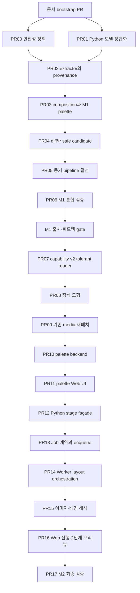

# 슬라이드 리디자인 Worktree·PR 실행 계획

작성일: 2026-07-22

기준 문서:

- `docs/plans/slide-redesign-implementation.md` — 기능 범위, 안전성 모델, 테스트 ID의 원본
- `docs/plans/slide-redesign-visual-upgrade.md` — 문제 진단과 목표 아키텍처
- `AGENTS.md` — 저장소 최상위 작업 규칙
- `docs/git-rules.md` — 브랜치, 커밋, PR 규칙

이 문서는 기준 문서의 설계를 바꾸는 새 명세가 아니라, **깨끗한 worktree에서 실제로 구현하고 자주 커밋하며 작은 PR로 순차 병합하기 위한 실행 문서**다. 기능·안전성 판단이 충돌하면 `AGENTS.md`와 `slide-redesign-implementation.md`를 우선하고, 작업 순서·worktree·커밋 경계는 이 문서를 따른다.

---

## 1. 실행 목표

현재 슬라이드 한 장을 대상으로 다음 기능을 점진적으로 제공한다.

1. 원문과 참조를 보존하면서 검증된 composition으로 재배치한다.
2. 장식 도형과 기존 이미지를 안전하게 재배치한다.
3. 사용자가 선택한 배색으로 proposal을 생성한다.
4. 미디어 슬롯에 필요한 이미지·배경을 비동기 Job에서 생성한다.
5. 단계별 진행과 2단계 프리뷰를 제공하고, 적용은 하나의 patch로 완료한다.
6. 이미지 생성 실패가 전체 리디자인 실패가 되지 않게 한다.

### 이번 실행 계획에서 하지 않는 것

- 전체 덱 일괄 리디자인
- 4:3·세로형 canvas 일반화
- chart/table/group/customShape의 구조 재작성
- LLM이 직접 좌표·크기·zIndex를 만드는 자유 배치 확대
- 여러 PR을 하나의 장기 브랜치에 누적
- 공유 브랜치 rebase 또는 force push
- 구현과 무관한 리팩터링·파일 이동·대량 포맷팅

---

## 2. 원문 v3에서 조정한 실행 순서

원문 v3의 안전성 결정 D1~D12와 테스트 기대값은 유지한다. 다만 실제 서비스 경계를 고려해 다음 구현 순서만 조정한다.

### 2.1 AI 이미지보다 비동기 기반을 먼저 만든다

원문은 AI 이미지 생성 PR 뒤에 비동기 Job PR을 둔다. 그러나 현재 동기 경로는 다음과 같이 분리되어 있다.

```text
Web → API DesignAgentService → Python /ai/design-agent/propose

Node Worker → image-asset-pipeline.ts → provider/storage/budget
```

Python 동기 요청 안에서 Node Worker의 private 예산·저장 함수를 직접 호출할 수 없다. 따라서 실행 계획은 다음 순서를 사용한다.

```text
media slot 계약
  → palette 선택
  → Python 내부 stage façade
  → slide-redesign Job/API
  → Worker layout orchestration
  → Worker 이미지 해석
  → Web 진행 UI
```

이 순서로 해야 이미지 생성이 처음 연결되는 PR부터 Job lifecycle, 예산 가드, storage provenance를 모두 사용할 수 있다.

### 2.2 배색 선택 뒤에 Job을 시작한다

공통 Job 상태는 `queued`, `running`, `succeeded`, `failed`이며 사용자 입력 대기 상태가 없다. 따라서 running Job을 배색 선택 때문에 멈추지 않는다.

```text
1차 요청                  → 배색 3안 반환, Job 없음
사용자 palette 선택       → selectedPaletteOptionId로 slide-redesign Job 생성
Job running               → 재배치·장식·이미지·검증
Job succeeded             → 최종 proposal
```

### 2.3 사용자 적용은 한 번만 한다

약 3초 시점의 `previewProposal`은 읽기 전용이다. 최종 이미지가 준비되기 전에 이를 적용하게 하면 layout patch와 image patch가 분리되어 undo가 두 번 필요해진다.

- 중간 프리뷰: 확인만 가능
- 최종 프리뷰: 적용 가능
- 최종 적용: `deckChangeRecord` 1건
- 복구: undo 1회

---

## 3. Worktree 운영 규칙

### 3.1 시작 전 필수 조건

현재 기본 worktree가 dirty여도 기존 변경을 stash하거나 정리하지 않는다. 구현은 항상 별도 worktree에서 시작한다.

PR00 전에 기준 문서 세 개가 `develop`에 존재해야 한다. 현재 문서가 untracked 상태라면 먼저 문서 전용 PR로 아래 파일을 병합한다.

```text
docs/plans/slide-redesign-visual-upgrade.md
docs/plans/slide-redesign-implementation.md
docs/plans/slide-redesign-worktree-pr-execution-plan.md
```

문서가 base branch에 없으면 새 worktree의 작업 에이전트가 명세를 읽을 수 없으므로 기능 PR을 시작하지 않는다.

현재 기본 worktree의 untracked 문서를 문서 전용 worktree로 옮겨 PR을 준비하는 예시는 다음과 같다. 대상 branch와 경로가 비어 있는지 먼저 확인한다.

```bash
git -C /Users/donghyunkim/Documents/Orbit fetch origin develop --prune
git -C /Users/donghyunkim/Documents/Orbit branch --list \
  docs/slide-redesign-implementation-plan
git -C /Users/donghyunkim/Documents/Orbit worktree add \
  -b docs/slide-redesign-implementation-plan \
  /private/tmp/orbit-slide-redesign-docs \
  origin/develop
cp /Users/donghyunkim/Documents/Orbit/docs/plans/slide-redesign-visual-upgrade.md \
  /private/tmp/orbit-slide-redesign-docs/docs/plans/
cp /Users/donghyunkim/Documents/Orbit/docs/plans/slide-redesign-implementation.md \
  /private/tmp/orbit-slide-redesign-docs/docs/plans/
cp /Users/donghyunkim/Documents/Orbit/docs/plans/slide-redesign-worktree-pr-execution-plan.md \
  /private/tmp/orbit-slide-redesign-docs/docs/plans/
git -C /private/tmp/orbit-slide-redesign-docs status --short
```

이 복사는 원본 dirty worktree의 다른 파일을 가져오지 않는다. 세 문서 외 변경이 보이면 stage하지 않고 원인을 확인한다.

### 3.2 PR마다 새 worktree를 만든다

아래 예시는 PR00 기준이다. 다른 PR은 §7의 branch와 worktree 경로로 바꾼다.

```bash
git -C /Users/donghyunkim/Documents/Orbit fetch origin develop --prune
git -C /Users/donghyunkim/Documents/Orbit branch --list feature/slide-redesign-safety-policy
git -C /Users/donghyunkim/Documents/Orbit worktree list
git -C /Users/donghyunkim/Documents/Orbit worktree add \
  -b feature/slide-redesign-safety-policy \
  /private/tmp/orbit-slide-redesign-pr00-safety \
  origin/develop
git -C /private/tmp/orbit-slide-redesign-pr00-safety status --short
```

중단 조건:

- branch가 이미 존재하면 `worktree add -b`를 실행하지 않는다. 기존 branch/worktree의 소유자와 상태를 확인한다.
- 대상 경로가 이미 존재하면 덮어쓰거나 삭제하지 않는다. 다른 명시적 경로를 정한다.
- `origin/develop` fetch가 실패하면 오래된 base로 진행하지 않는다.
- 생성 직후 `git status --short`가 비어 있지 않으면 구현을 시작하지 않는다.

### 3.3 다음 PR 시작 조건

기본 흐름은 완전 순차다.

1. 현재 PR의 required test가 모두 통과한다.
2. PR이 review를 거쳐 `develop`에 병합된다.
3. 원격 `develop`을 다시 fetch한다.
4. 다음 branch/worktree를 최신 `origin/develop`에서 새로 만든다.

PR00과 PR01만 코드 경로가 독립적이어서 병렬 가능하다. 기본 실행에서는 충돌과 검증 기준 혼선을 줄이기 위해 순차 진행한다.

### 3.4 PR 병합 후 worktree 정리

다음 명령은 PR 병합을 확인하고 worktree가 clean일 때만 실행한다.

```bash
git -C /private/tmp/orbit-slide-redesign-pr00-safety status --short
git -C /Users/donghyunkim/Documents/Orbit worktree remove \
  /private/tmp/orbit-slide-redesign-pr00-safety
git -C /Users/donghyunkim/Documents/Orbit branch -d \
  feature/slide-redesign-safety-policy
git -C /Users/donghyunkim/Documents/Orbit worktree prune --dry-run
```

- clean 여부를 확인하지 않고 worktree를 제거하지 않는다.
- `worktree remove --force`, `branch -D`, rebase, force push를 사용하지 않는다.
- PR이 아직 병합되지 않았거나 후속 수정이 남아 있으면 worktree를 유지한다.

---

## 4. 자주 커밋하는 규칙

### 4.1 커밋 크기

- 한 커밋은 하나의 동작 또는 하나의 계약만 다룬다.
- 목표는 커밋당 1~5개 파일, 약 100~300 changed lines다.
- fixture·migration처럼 기계적으로 큰 파일은 예외지만 동작 변경과 섞지 않는다.
- 구현 → focused test → diff 확인 → commit 순서를 반복한다.
- 실패하는 테스트만 추가한 중간 상태는 공유 branch에 commit하지 않는다.

### 4.2 stage 규칙

`git add .` 또는 `git add -A`를 사용하지 않는다. 아래처럼 이번 커밋 파일만 명시한다.

```bash
git add services/python-worker/app/ai/slide_redesign/safety.py
git add services/python-worker/tests/test_slide_redesign_safety.py
git diff --staged --stat
git diff --staged
git diff --cached --check
```

stage 후 확인한다.

- `.env`, token, credential, raw audio, transcript, speaker script가 포함되지 않았는가
- `dist`, `.turbo`, cache, test output, 이미지 생성 결과가 포함되지 않았는가
- unrelated formatting과 사용자 기존 변경이 포함되지 않았는가
- focused test 결과가 현재 staged 변경과 일치하는가

### 4.3 커밋 메시지

`docs/git-rules.md`에 따라 제목과 본문을 한국어로 작성한다.

```text
feat: 슬라이드 리디자인 안전 요소 판정 추가

전체 리디자인에서 데이터 손실 가능성이 있는 요소를 구분하고
미디어 슬롯 활성화 여부에 따라 image 정책을 전환하도록 구성
```

허용 type은 `feat`, `fix`, `refactor`, `docs`, `test`, `chore`, `style`, `perf`, `build`, `ci`, `revert`다.

### 4.4 커밋 직전 체크리스트

- [ ] `git status --short`로 범위를 확인했다.
- [ ] focused test가 통과했다.
- [ ] `git diff --cached --check`가 통과했다.
- [ ] `git diff --staged`를 처음부터 끝까지 읽었다.
- [ ] secret과 생성 산출물이 없다.
- [ ] commit message가 한 가지 이유를 설명한다.

---

## 5. 검증 프로필

각 PR의 커밋 단계에서는 focused profile을 실행하고, PR 제출 전에는 해당 PR에 적힌 full gate를 실행한다.

### V-PY-FOCUSED

```bash
cd services/python-worker
uv run ruff check app/ai/slide_redesign tests/test_slide_redesign_*.py
uv run mypy app
uv run pytest <해당 테스트 파일> -v
```

### V-PY-FULL

```bash
cd services/python-worker
uv sync --locked
uv run ruff check .
uv run mypy app
uv run pytest
```

### V-SHARED

```bash
pnpm --filter @orbit/shared test
pnpm typecheck
```

### V-API

```bash
pnpm --filter @orbit/api test
pnpm typecheck
```

### V-WORKER

```bash
pnpm --filter @orbit/worker test
pnpm typecheck
```

### V-WEB

```bash
pnpm --filter @orbit/web test
pnpm typecheck
pnpm lint
```

### V-REPO

```bash
pnpm build
pnpm lint
pnpm test
node infra/scripts/check-env.mjs
docker compose config
```

명령을 실행하지 못한 경우 PR 본문에 이유와 남은 검증 범위를 적는다. 외부 provider의 실제 호출은 단위 테스트의 필수 조건으로 삼지 않고, 별도의 승인된 수동 검증으로 기록한다.

---

## 6. 의존성 그래프와 milestone



### PR 요약

| PR | branch | worktree | 원문 v3 대응 | 예상 |
| --- | --- | --- | --- | --- |
| DOC | `docs/slide-redesign-implementation-plan` | `/private/tmp/orbit-slide-redesign-docs` | 문서 bootstrap | 0.5일 |
| PR00 | `feature/slide-redesign-safety-policy` | `/private/tmp/orbit-slide-redesign-pr00-safety` | PR0 | 1일 |
| PR01 | `feature/design-agent-element-model-alignment` | `/private/tmp/orbit-slide-redesign-pr01-model` | PR1 | 0.5일 |
| PR02 | `feature/slide-redesign-extractor` | `/private/tmp/orbit-slide-redesign-pr02-extractor` | PR2 | 2일 |
| PR03 | `feature/slide-redesign-composer` | `/private/tmp/orbit-slide-redesign-pr03-composer` | PR3 | 1.5일 |
| PR04 | `feature/slide-redesign-diff` | `/private/tmp/orbit-slide-redesign-pr04-diff` | PR4 | 2.5일 |
| PR05 | `feature/slide-redesign-endpoint` | `/private/tmp/orbit-slide-redesign-pr05-pipeline` | PR5 | 1일 |
| PR06 | `feature/slide-redesign-verification` | `/private/tmp/orbit-slide-redesign-pr06-verification` | PR6 | 1.5일 |
| PR07 | `feature/slide-redesign-capability-v2-reader` | `/private/tmp/orbit-slide-redesign-pr07-capability` | PR7 계약 선행부 | 0.5일 |
| PR08 | `feature/slide-redesign-ornaments` | `/private/tmp/orbit-slide-redesign-pr08-ornaments` | PR7 동작부 | 1.5일 |
| PR09 | `feature/slide-redesign-media-slots` | `/private/tmp/orbit-slide-redesign-pr09-media` | PR8 | 2일 |
| PR10 | `feature/slide-redesign-palette-contract` | `/private/tmp/orbit-slide-redesign-pr10-palette-api` | PR10 backend | 1.5일 |
| PR11 | `feature/slide-redesign-palette-ui` | `/private/tmp/orbit-slide-redesign-pr11-palette-ui` | PR10 Web | 1.5일 |
| PR12 | `feature/slide-redesign-stage-facade` | `/private/tmp/orbit-slide-redesign-pr12-stages` | PR11 선행 기반 | 1.5일 |
| PR13 | `feature/slide-redesign-job-contract` | `/private/tmp/orbit-slide-redesign-pr13-job-contract` | PR11 contract/API | 1.5일 |
| PR14 | `feature/slide-redesign-job-orchestration` | `/private/tmp/orbit-slide-redesign-pr14-job-worker` | PR11 Worker layout | 2일 |
| PR15 | `feature/slide-redesign-image-generation` | `/private/tmp/orbit-slide-redesign-pr15-images` | PR9 + PR11 illustrating | 2.5일 |
| PR16 | `feature/slide-redesign-progress-ui` | `/private/tmp/orbit-slide-redesign-pr16-progress-ui` | PR11 Web | 2일 |
| PR17 | `feature/slide-redesign-final-verification` | `/private/tmp/orbit-slide-redesign-pr17-verification` | M2 최종 검증 | 1.5일 |

M1은 약 10일, M2는 review·stage façade 보강을 포함해 약 18일이다. elapsed time은 PR review와 배포 gate에 따라 더 길 수 있다. 일정 단축을 위해 PR을 합치지 않는다.

---

## 7. PR별 실행 계획

## DOC — 기준 문서 bootstrap

**목표:** 모든 새 worktree가 같은 명세를 읽도록 기준 문서를 먼저 `develop`에 둔다.

**파일:**

- `docs/plans/slide-redesign-visual-upgrade.md`
- `docs/plans/slide-redesign-implementation.md`
- `docs/plans/slide-redesign-worktree-pr-execution-plan.md`

**권장 커밋:**

1. `docs: 슬라이드 리디자인 아키텍처와 안전성 계획 정리`
2. `docs: 슬라이드 리디자인 worktree 실행 계획 추가`

**완료 조건:**

- [ ] 세 문서의 상호 링크가 유효하다.
- [ ] 문서 간 우선순위가 명시되어 있다.
- [ ] 코드·설정·lockfile 변경이 없다.
- [ ] PR 본문에 문서-only라 코드 테스트를 실행하지 않았다고 기록한다.

---

## PR00 — 요소 보존 정책과 안전성 판정

**결과:** 아직 호출되지 않는 fail-closed 안전성 모듈과 테스트가 생긴다.

**주요 파일:**

- `services/python-worker/app/ai/slide_redesign/__init__.py`
- `services/python-worker/app/ai/slide_redesign/safety.py`
- `services/python-worker/tests/test_slide_redesign_safety.py`

**커밋 체크포인트:**

1. `feat: 슬라이드 리디자인 안전 요소 판정 추가`
   - `UNSAFE_ELEMENT_TYPES_BASE`, `MEDIA_ELEMENT_TYPES`, `find_unsafe_elements`
   - 확인: T0.1~T0.4c
2. `feat: 리디자인 요소 참조 제약 수집 추가`
   - animation/action/semanticCue/keyword/locked/group/ooxml 제약
   - 확인: T0.5~T0.9
3. `test: 리디자인 텍스트 보존 규칙 검증`
   - normalize, shorten 감지, element type coverage
   - 확인: T0.10~T0.12와 schema coverage

**PR gate:** `V-PY-FOCUSED`

**중단 조건:** shared의 실제 참조 필드를 확인할 수 없거나 새 element type coverage 테스트가 불완전하면 PR01 이후를 시작하지 않는다.

---

## PR01 — Python design-agent 모델 정합화

**결과:** `composition_library`의 role·fontWeight·slide style 값을 Python strict schema가 수용한다. shared capability 발행값은 여전히 version `1`이다.

**주요 파일:**

- `services/python-worker/app/ai/design_agent.py`
- `services/python-worker/tests/test_design_agent.py`

**커밋 체크포인트:**

1. `feat: 디자인 에이전트 요소 역할과 fontWeight 정합화`
   - text `highlight`, rect `media`, 문자열·정수 fontWeight
   - 확인: T1.1~T1.7
2. `feat: 디자인 에이전트 slide style 패치 정합화`
   - `layout`, `backgroundImage`, JSON schema 동기화
   - 확인: T1.8~T1.9
3. `test: 디자인 에이전트 capability v1 회귀 고정`
   - version과 addable type이 바뀌지 않았는지 검증
   - 확인: T1.10과 기존 `test_design_agent.py`

**PR gate:** `V-PY-FULL`, `V-SHARED`, `V-API`

---

## PR02 — 슬라이드 해석기와 provenance

**결과:** 현재 Slide에서 hierarchy, unique segment ID, `contentItemId → sourceElementId` map을 생성한다.

**주요 파일:**

- `services/python-worker/app/ai/slide_redesign/slide_extractor.py`
- `services/python-worker/tests/test_slide_redesign_extractor.py`
- `services/python-worker/tests/fixtures/slide_redesign/`의 extractor fixture

**커밋 체크포인트:**

1. `feat: 슬라이드 텍스트 위계와 읽기 순서 추론 추가`
   - visible/role/fontSize/y-band/leftover 처리
   - 확인: T2.1~T2.3, T2.6~T2.8
2. `feat: 불릿 segment provenance 생성 추가`
   - unique `::segment::` ID와 별도 map
   - 확인: T2.4~T2.5, T2.11
3. `feat: 슬라이드 유형 분류와 heuristic fallback 추가`
   - enum 밖 응답·provider 오류 폴백
   - 확인: T2.9~T2.10
4. `test: 슬라이드 extractor 골든 fixture 추가`
   - 5종 snapshot과 composition `_items()` 호환
   - 확인: T2.12

**PR gate:** `V-PY-FOCUSED`

**중단 조건:** T2.11이 실패하거나 provenance를 Deck element에 저장해야만 동작한다면 PR03을 시작하지 않는다.

---

## PR03 — composition 후보와 M1 palette

**결과:** 미디어 없이 안전하게 컴파일 가능한 후보와 접근성 palette를 결정하고, LLM은 후보 ID만 선택한다.

**주요 파일:**

- `services/python-worker/app/ai/slide_redesign/palette.py`
- `services/python-worker/app/ai/slide_redesign/composer.py`
- `services/python-worker/tests/test_slide_redesign_composer.py`

**커밋 체크포인트:**

1. `feat: 현재 테마 기반 리디자인 palette 생성 추가`
   - focal 유지, contrast 4.5 이상
2. `feat: 미디어 없는 composition 후보 필터 추가`
   - 16:9, item count, content support, required media 제외
3. `feat: 안전 후보 제한 composition 선택 추가`
   - strict ID selection, provider 실패 시 deterministic fallback
4. `test: 전체 M1 composition compile smoke 추가`

**PR gate:** `V-PY-FOCUSED`

---

## PR04 — provenance 매칭과 patch 생성

**결과:** 후보별 reversible/irreversible mapping을 분석하고 안전 후보만 남긴 뒤 Deck patch operation을 만든다.

**주요 파일:**

- `services/python-worker/app/ai/slide_redesign/diff.py`
- `services/python-worker/tests/test_slide_redesign_diff.py`

**커밋 체크포인트:**

1. `feat: sourceElementId 기준 cardinality 분석 추가`
   - 1:1, 1:N, N:1, 중복 문구 매칭
   - 확인: T4.1~T4.6, T4.15, T4.17
2. `feat: 후보별 참조 보존 안전성 필터 추가`
   - can_replace, text_preserved, locked/group/ooxml 처리
   - 확인: T4.7~T4.10
3. `feat: 리디자인 diff를 Deck patch로 변환`
   - style → update → add → delete 순서, text 수정 금지
   - 확인: T4.11~T4.14
4. `test: 리디자인 patch 라운드트립 검증 추가`
   - 확인: T4.16

**PR gate:** `V-PY-FOCUSED`

**필수 stop gate:** T4.16 또는 T4.17이 실패하면 PR05를 시작하지 않는다.

---

## PR05 — 동기 redesign pipeline 결선

**결과:** M1 `redesign-slide` 요청이 `applicable`, `fallback-allowed`, `refused-unsafe`로 동작한다. 국소 편집과 SmartArt 명시 요청은 기존 경로를 유지한다.

**주요 파일:**

- `services/python-worker/app/ai/slide_redesign/pipeline.py`
- `services/python-worker/app/ai/design_agent.py`
- `services/python-worker/tests/test_slide_redesign_pipeline.py`
- `services/python-worker/tests/test_design_agent.py`

**커밋 체크포인트:**

1. `feat: 슬라이드 리디자인 3분기 pipeline 추가`
   - 원문 v3 §9의 1~14 순서 그대로 구현
2. `feat: 디자인 에이전트에 전체 리디자인 경로 연결`
   - animation 다음, 기존 free-form 앞에 hook
3. `feat: 리디자인 구조화 진단 로그 추가`
   - 원문·prompt·speaker notes 없이 count/duration/outcome만 기록
4. `test: 전체 리디자인과 국소 편집 경계 회귀 검증`
   - T5.4와 T5.5를 같은 commit에서 확인

**PR gate:** `V-PY-FULL`, `V-API`

**필수 stop gate:** chart 전체 리디자인 거부와 chart 국소 편집 허용이 동시에 통과해야 한다.

---

## PR06 — M1 통합 검증과 출시 gate

**결과:** I1~I8, 14종 fixture, API proposal, apply/undo가 자동화되고 수동 시각 QA 표가 남는다. 동작 추가는 하지 않는다.

**주요 파일:**

- `services/python-worker/tests/fixtures/slide_redesign/`
- `services/python-worker/tests/test_slide_redesign_invariants.py`
- `apps/api/src/design-agent/design-agent.service.spec.ts`
- smoke test의 slide redesign scenario
- `docs/qa/slide-redesign-m1-qa.md`

**커밋 체크포인트:**

1. `test: 슬라이드 리디자인 불변식과 골든 fixture 추가`
2. `test: 디자인 proposal 적용과 빈 operation 경계 검증`
3. `test: 리디자인 적용 후 단일 undo 복구 검증`
4. `docs: 슬라이드 리디자인 M1 시각 QA 기록`

**PR gate:** `V-PY-FULL`, `V-API`, `V-WEB`, `pnpm test:smoke --grep "slide redesign"`

**M1 release gate:**

- [ ] I1~I8 전부 통과
- [ ] 원문 보존과 참조 보존 전 항목 통과
- [ ] `safe_candidate_count == 0`과 `refused-unsafe` 비율을 관측할 수 있음
- [ ] 실제 사용자 fixture에서 배치 품질을 검토함
- [ ] M2 진행 여부를 확인함

M1 피드백 없이 PR07을 자동으로 시작하지 않는다.

---

## PR07 — capability v2 tolerant reader

**결과:** Python과 shared schema가 version `1`, `2`를 읽을 수 있지만 API 상수는 아직 version `1`을 발행한다. 사용자 동작 변화는 없다.

**주요 파일:**

- `services/python-worker/app/ai/design_agent.py`
- `packages/shared/src/deck/design-agent.schema.ts`
- 양쪽 contract test
- `docs/contracts.md`

**커밋 체크포인트:**

1. `feat: 디자인 에이전트 capability v2 tolerant reader 추가`
2. `test: capability v1과 v2 양방향 호환 검증`
3. `docs: 디자인 에이전트 capability 배포 순서 기록`

**PR gate:** `V-PY-FULL`, `V-SHARED`, `V-API`

**배포 gate:** version `1` 요청과 응답이 계속 통과하고, API 상수의 발행값이 `1`인지 확인한다.

---

## PR08 — 장식 도형과 capability v2 발행

**결과:** 안전한 composition에 ellipse/line/polygon 장식을 최대 12개 추가하고 API가 capability version `2`를 발행한다.

**주요 파일:**

- `services/python-worker/app/ai/slide_redesign/ornament.py`
- `services/python-worker/app/ai/design_agent.py`
- `packages/shared/src/deck/design-agent.schema.ts`
- `services/python-worker/app/ai/slide_redesign/pipeline.py`
- 관련 Python/shared test

**커밋 체크포인트:**

1. `feat: composition별 장식 도형 생성 추가`
2. `feat: 디자인 에이전트 shape element 계약 확장`
3. `feat: 리디자인 pipeline에 장식 후처리 연결`
4. `test: 장식 겹침과 safe area 불변식 검증`

**PR gate:** `V-PY-FULL`, `V-SHARED`, `V-API`

**필수 조건:** T7.10 version `1` reader 호환을 유지한다. 장식 충돌 시 본문을 움직이지 않고 해당 장식을 버린다.

---

## PR09 — 미디어 슬롯과 기존 이미지 재배치

**결과:** image/svg를 삭제하지 않고 새 미디어 슬롯으로 이동한다. 생성이 필요한 빈 슬롯은 `needs_generation`으로 남긴다.

**주요 파일:**

- `services/python-worker/app/ai/slide_redesign/media.py`
- `services/python-worker/app/ai/slide_redesign/composer.py`
- `services/python-worker/app/ai/slide_redesign/diff.py`
- `services/python-worker/app/ai/design_agent.py`
- `packages/shared/src/deck/design-agent.schema.ts`
- 관련 test

**커밋 체크포인트:**

1. `feat: compiled composition 미디어 슬롯 탐지 추가`
2. `feat: 기존 이미지와 미디어 슬롯 안전 배정 추가`
3. `feat: image element 계약과 frame 재배치 operation 추가`
4. `test: 이미지 elementId와 참조 보존 검증`

**PR gate:** `V-PY-FULL`, `V-SHARED`, `V-API`

**필수 stop gate:** T8.6이 실패하거나 이미지 이동에 `delete_element`가 필요하면 PR10을 시작하지 않는다.

---

## PR10 — 배색 선택 backend 계약

**결과:** 첫 요청은 현재 테마 유지안과 대안 두 개를 반환하고, 선택된 option ID가 있을 때만 최종 proposal 준비를 계속한다. 아직 Web은 새 흐름을 사용하지 않는다.

**주요 파일:**

- `services/python-worker/app/ai/slide_redesign/palette.py`
- `packages/shared/src/deck/slide-redesign.schema.ts`
- `packages/shared/src/deck/design-agent.schema.ts`
- `apps/api/src/design-agent/design-agent.service.ts`
- 관련 Python/shared/API test
- `docs/contracts.md`

**커밋 체크포인트:**

1. `feat: 리디자인 배색 3안 생성과 대비 보정 추가`
2. `feat: 슬라이드 리디자인 palette 선택 계약 추가`
3. `feat: 디자인 에이전트 palette option 검증 추가`
4. `test: 현재 테마 유지안과 잘못된 option 경계 검증`
5. `docs: 슬라이드 리디자인 palette 계약 기록`

**PR gate:** `V-PY-FULL`, `V-SHARED`, `V-API`

**merge 안전성:** 기존 Web 요청에는 새 흐름을 강제하지 않는다. 새 request/response 필드는 optional 또는 별도 endpoint로 추가한다.

---

## PR11 — 배색 선택 Web UI

**결과:** 디자인 챗에 접근 가능한 radio group 형태의 배색 카드 3개가 표시되고, 선택 후 기존 proposal preview를 생성한다.

**주요 파일:**

- `apps/web/src/features/editor/design-agent/components/DesignPaletteOptions.tsx`
- 해당 component CSS
- component test
- `apps/web/src/features/editor/shell/components/AiChatPanel.tsx`
- `apps/web/src/features/editor/design-agent/designAgentApi.ts`

**커밋 체크포인트:**

1. `feat: 리디자인 배색 선택 카드 추가`
2. `feat: AI 채팅 palette 선택 흐름 연결`
3. `test: 배색 선택 접근성과 재요청 흐름 검증`

**PR gate:** `V-WEB`, `V-API`

**수동 확인:** 키보드만으로 세 option을 탐색·선택할 수 있고, `[0] 현재 테마 유지`가 기본 선택인지 확인한다.

---

## PR12 — Python 내부 stage façade

**결과:** Node Worker가 장시간 동기 `/propose` 하나에 의존하지 않고 단계별 artifact를 받아 이어갈 수 있다. 공개 API가 아닌 worker 내부 endpoint다.

**주요 파일:**

- `services/python-worker/app/ai/slide_redesign/stages.py`
- `services/python-worker/app/ai/slide_redesign/stage_models.py`
- `services/python-worker/app/main.py`
- `services/python-worker/tests/test_slide_redesign_stages.py`
- `packages/shared/src/deck/slide-redesign.schema.ts`

**내부 단계:**

1. `interpret` — 안전성 판정, hierarchy, summary, provenance
2. `compose` — palette 확인, safe candidate 선택, compile/diff, placeholder proposal
3. `ornament` — 장식 후처리; 동작이 작으면 compose 응답 안의 명시적 stage 결과로 합칠 수 있음
4. `verify` — 최종 operation schema와 apply preview 검증

중간 artifact는 최종 Deck에 저장하지 않는다. Node와 Python 사이를 건너므로 Zod와 Pydantic이 같은 JSON shape을 검증해야 한다.

**커밋 체크포인트:**

1. `feat: 슬라이드 리디자인 내부 stage artifact 계약 추가`
2. `refactor: 동기 리디자인 pipeline을 재사용 가능한 stage로 분리`
3. `feat: Python worker 내부 slide redesign stage endpoint 추가`
4. `test: 동기 pipeline과 stage pipeline 결과 동등성 검증`

**PR gate:** `V-PY-FULL`, `V-SHARED`

**필수 조건:** 기존 `/ai/design-agent/propose` 결과와 stage 조립 결과가 동일해야 한다. 이 PR에서는 기존 동기 endpoint를 제거하지 않는다.

---

## PR13 — slide-redesign Job 계약과 enqueue

**결과:** palette 선택이 완료된 요청은 전용 `slide-redesign` Job을 만들 수 있다. 기존 sync UI는 아직 이 endpoint를 사용하지 않는다.

**주요 파일:**

- `packages/shared/src/jobs/job.schema.ts`
- `packages/shared/src/deck/slide-redesign.schema.ts`
- `packages/shared/src/realtime/`의 기존 Job event 계약 확장 파일
- `apps/api/src/design-agent/design-agent.controller.ts`
- `apps/api/src/design-agent/slide-redesign-job.service.ts`
- 관련 shared/API test
- `docs/contracts.md`

**커밋 체크포인트:**

1. `feat: slide-redesign Job payload와 progress 계약 추가`
2. `feat: 디자인 에이전트 전용 리디자인 Job enqueue 추가`
3. `test: public Job 생성 차단과 baseVersion 검증 추가`
4. `docs: slide-redesign Job과 realtime payload 계약 기록`

**PR gate:** `V-SHARED`, `V-API`

**필수 조건:** `publicCreatableJobTypeSchema`에는 `slide-redesign`을 넣지 않는다. enqueue 시 prompt 원문이나 slide content를 로그에 남기지 않는다.

---

## PR14 — Worker layout Job orchestration

**결과:** Worker가 Python stage endpoint를 순서대로 호출해 이미지 없는 최종 proposal을 만들고 stage progress를 공통 WebSocket envelope으로 방출한다.

**주요 파일:**

- `apps/worker/src/slide-redesign.processor.ts`
- `apps/worker/src/slide-redesign-python.client.ts`
- `apps/worker/src/worker.service.ts`
- processor/client test
- 필요 시 stage artifact repository 파일 1개

**커밋 체크포인트:**

1. `feat: Worker slide redesign Python stage client 추가`
2. `feat: slide-redesign Job processor와 lifecycle 추가`
3. `feat: 리디자인 layout progress event 방출 추가`
4. `test: stage 순서와 실패 원자성 검증`

**PR gate:** `V-WORKER`, `V-PY-FULL`, `V-API`

**실패 정책:** stage 하나가 실패하면 부분 proposal을 적용 가능 상태로 저장하지 않는다. `refused-unsafe`는 API preflight에서 즉시 반환하거나 interpreting 직후 Job을 성공 메시지로 종료하되, 원문 v3 T11.9와 동일하게 사용자가 기다리지 않는 경로를 우선한다.

---

## PR15 — AI 이미지·배경 해석

**결과:** `needs_generation` 슬롯을 Worker가 기존 budget/storage/provider 경계 안에서 해석하고 최종 proposal에 연결한다. 이미지 실패 시 styled rect/no-media 결과로 성공한다.

**주요 파일:**

- `apps/worker/src/image-asset-pipeline.ts`
- `apps/worker/src/image-asset-pipeline.spec.ts`
- `apps/worker/src/slide-redesign.processor.ts`
- processor test
- `packages/shared/src/deck/design-agent.schema.ts`
- `docs/contracts.md`

**커밋 체크포인트:**

1. `feat: 단일 슬라이드 이미지 asset 해석 primitive 추가`
   - private budget/store/placeholder 함수를 같은 모듈 안에서 재사용
2. `feat: slide-redesign illustrating stage 연결`
   - atmosphere/evidence/decoration 라우팅, 슬라이드당 AI 1장
3. `feat: 디자인 에이전트 이미지 생성 capability 활성화`
4. `test: 이미지 예산 초과와 provider 실패 폴백 검증`
5. `docs: 리디자인 이미지 provenance와 실패 정책 기록`

**PR gate:** `V-WORKER`, `V-SHARED`, `V-API`, `V-PY-FULL`

**필수 stop gate:** T9.2, T9.3, T9.4가 모두 통과해야 한다. `evidence` 역할은 AI 생성으로 대체하지 않는다.

---

## PR16 — Web 진행 표시와 2단계 프리뷰

**결과:** Web이 palette 선택 후 Job을 시작하고 progress를 보여준다. 중간 프리뷰는 읽기 전용, 최종 프리뷰만 적용 가능하며 stale을 안내한다.

**주요 파일:**

- `apps/web/src/features/editor/design-agent/designAgentApi.ts`
- `apps/web/src/features/editor/design-agent/designProposalLifecycle.ts`
- `apps/web/src/features/editor/design-agent/components/DesignRedesignProgress.tsx`
- component CSS/test
- `apps/web/src/features/editor/shell/components/AiChatPanel.tsx`

**커밋 체크포인트:**

1. `feat: slide-redesign Job 조회와 progress client 추가`
2. `feat: AI 채팅 리디자인 단계 표시 추가`
3. `feat: 읽기 전용 중간 프리뷰와 최종 적용 경계 추가`
4. `test: stale과 실패 후 재시도 lifecycle 검증`

**PR gate:** `V-WEB`, `V-API`, `V-WORKER`

**필수 조건:** 중간 preview에 적용 버튼이 없어야 하고, final proposal 적용은 undo 1회로 복구되어야 한다.

---

## PR17 — M2 최종 검증과 rollout 문서

**결과:** 이미지 포함 전체 흐름, 2단계 프리뷰, stale, fallback, undo, 관측 로그를 한 번에 검증하고 운영 준비 상태를 문서화한다. 기능 추가는 하지 않는다.

**주요 파일:**

- Python/Worker/API/Web의 slide redesign integration test
- smoke test scenario
- `docs/qa/slide-redesign-m2-qa.md`
- `docs/runbooks/local-development.md`의 필요한 실행·확인 절차
- `docs/contracts.md` 최종 정합성 점검

**커밋 체크포인트:**

1. `test: 이미지 포함 리디자인 전체 흐름 검증`
2. `test: 리디자인 stale과 실패 폴백 회귀 검증`
3. `test: 최종 proposal 단일 undo 복구 검증`
4. `docs: 슬라이드 리디자인 M2 QA와 운영 절차 기록`

**PR gate:** `V-PY-FULL`, `V-SHARED`, `V-API`, `V-WORKER`, `V-WEB`, `V-REPO`, `pnpm test:smoke --grep "slide redesign"`

**release gate:**

- [ ] 구조 검증을 통과하지 않은 proposal 노출 0건
- [ ] optional 이미지 실패로 전체 redesign이 실패하는 경로 0건
- [ ] 원문·elementId·animation·semantic cue 보존 fixture 전부 통과
- [ ] intermediate preview 적용 불가
- [ ] final apply 후 undo 1회 복구
- [ ] `baseVersion` 변경 시 stale 처리
- [ ] 로그에 prompt, transcript, speaker notes, credential이 없음
- [ ] 실제 provider 수동 검증 결과와 비용·지연을 QA 문서에 기록

---

## 8. PR 작성과 인계 형식

### PR 제목

```text
[Slide Redesign PR00] 요소 보존 안전성 정책 추가
```

### PR 본문

```markdown
## 변경 요약
- 무엇을 가능하게 했는지
- 이전 PR과 다음 PR 사이에서 어떤 계약을 고정했는지

## 안전성·계약 영향
- Deck/shared schema 영향
- 기존 sync 경로 영향
- 하위 호환성과 배포 순서

## 검증
- `실행한 명령`: 통과/실패
- 수동 확인 결과
- 실행하지 못한 검증과 이유

## 영향 범위
- 변경한 앱/패키지
- 의도적으로 건드리지 않은 영역

## 다음 PR 인계
- 다음 PR이 사용할 API/함수/fixture
- 남아 있는 제한과 stop gate
```

### PR 제출 전 최종 확인

- [ ] branch가 해당 PR 전용이다.
- [ ] `origin/develop` 기반이고 이전 PR이 병합되어 있다.
- [ ] worktree가 현재 PR 파일만 포함한다.
- [ ] 커밋마다 focused test가 통과했다.
- [ ] PR full gate가 통과했다.
- [ ] `docs/contracts.md` 갱신이 필요한 계약 PR에서 누락되지 않았다.
- [ ] commit message와 PR 본문이 한국어다.
- [ ] push, PR 생성, 배포는 명시적 작업 범위 안에서만 수행한다.

---

## 9. 전체 중단 조건

아래 조건이 발생하면 다음 PR로 넘어가지 않고 현재 PR에서 원인과 영향 범위를 보고한다.

1. 기준 문서와 실제 schema가 충돌해 어느 쪽이 source of truth인지 결정할 수 없다.
2. 원문 텍스트 또는 element reference를 보존하지 못한다.
3. 안전 후보가 없는데 free-form fallback으로 보내야만 기능이 동작한다.
4. image relocation이 기존 elementId를 유지하지 못한다.
5. capability v1/v2 rolling deployment 호환 테스트가 실패한다.
6. image provider 실패가 Job terminal failure로만 표현된다.
7. 중간 preview와 최종 proposal을 하나의 undo 단위로 만들 수 없다.
8. Web/API/Worker/Python 중 둘 이상이 서로 다른 stage 또는 payload enum을 사용한다.
9. 테스트를 통과시키기 위해 chart/table/group 안전성 정책을 완화해야 한다.

이 경우 범위를 임의로 넓히거나 안전 조건을 낮추지 않는다. 필요한 계약 결정과 대안을 별도 문서 또는 후속 계획으로 제안한다.
