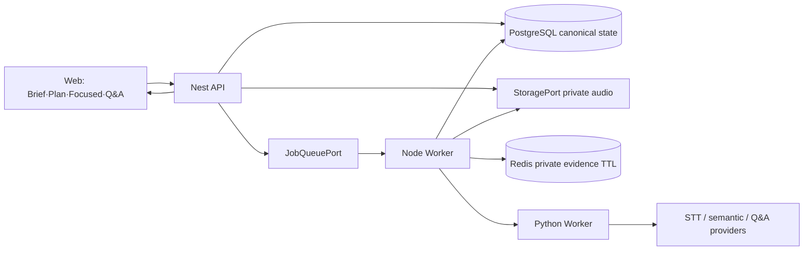
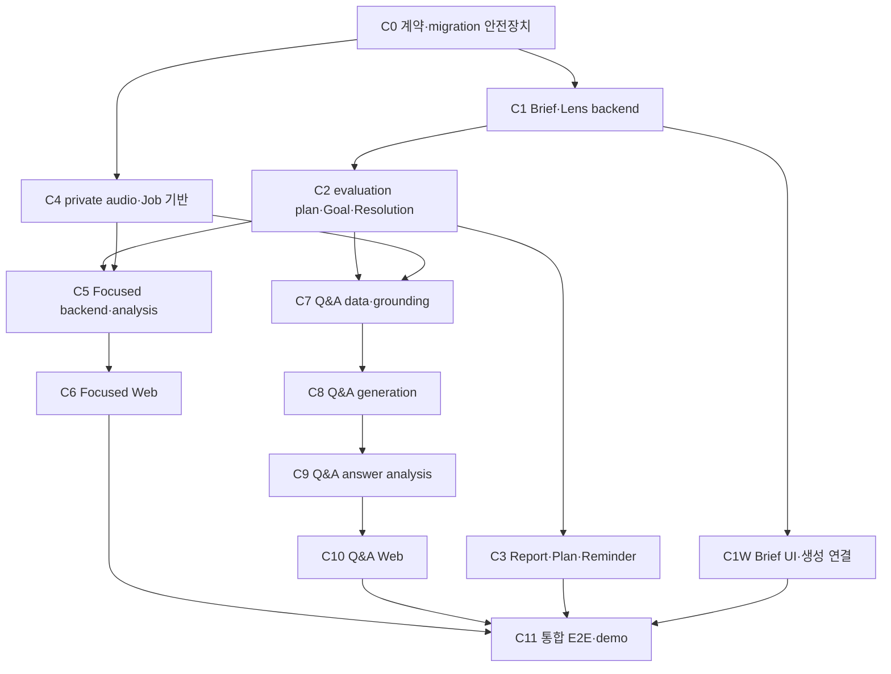

# ORBIT 제품 방향: Adaptive Rehearsal Coach

## 문서 정보

- 상태: `Confirmed — Milestone 1 구현 착수 가능`
- 작성일: 2026-07-11
- 적용 범위: Presentation Brief, Evaluator Lens, 전체 리허설, Top 3, 부분 반복 연습, 회차 비교, Challenge Q&A, 데모
- 목적: 코치 피드백을 제품 의사결정과 바로 구현 가능한 공통 계약·DB·API·Job·UI·테스트 계획으로 전환한다.
- 구현 기준일: 2026-07-11 저장소 상태
- 구현 마일스톤: `Milestone 1 — Adaptive Coaching Core`
- 핵심 질문: 사용자가 왜 ORBIT에서 반복해서 리허설해야 하는가?

관련 문서:

- [공통 계약](../contracts.md)
- [Demo ID와 데모 기준](../demo-standards.md)
- [리허설 리포트 정책](../rehearsal-report/report-policy.md)
- [리허설 리포트 파이프라인](../rehearsal-report/README.md)
- [로컬 우선 아키텍처](../architecture/local-first-stack.md)
- [서버 로그 정책](../conventions/logging.md)

문서 활용 방법:

- 제품 결정과 사용자 문제를 확인하려면 1~5장을 본다.
- 목표 사용자 경험과 기능 범위를 확인하려면 7~9장을 본다.
- shared schema, snapshot, 비교 경계를 설계하려면 10장을 본다.
- 확정된 Milestone 범위와 개발 순서를 확인하려면 11장을 본다.
- 발표 콘텐츠와 6분 데모를 준비하려면 12장을 본다.
- 성공 지표, 가정, 위험, 제외 범위를 검토하려면 13~18장을 본다.
- 개발자는 19장 이후의 계약, DB, API, Job, 화면 상태, PR 분할, 테스트 명세를 구현 기준으로 사용한다.

---

## 1. 결정 요약

ORBIT의 중심을 **AI 발표자료 생성기**에서 **반복할수록 사용자를 기억하고 다음 연습에서 실제 실수를 줄여주는 적응형 리허설 코치**로 전환한다.

제품의 한 문장 약속은 다음과 같다.

> ORBIT는 자료를 대신 만드는 AI가 아니라, 지난 발표의 실수를 기억하고 다음 리허설을 바꾸는 AI 코치다.

핵심 제품 루프는 다음과 같다.

```text
Presentation Brief
→ AI 생성·수정
→ 1차 기준선 리허설
→ 근거 기반 Top 3 처방
→ 이번 연습 플랜
→ 문제 구간 부분 반복 연습
→ 선택적 슬라이드 Q&A checkpoint
→ 2차 전체 검증 리허설
→ 개선 증명
→ 최종 Challenge Q&A 세션
```

제품의 핵심 데모 장면은 AI가 덱을 처음 생성하는 순간이 아니다. **평소 반복하던 실수를 한 화면에서 확인하고, 그 부분만 연속으로 다시 연습한 뒤, 전체 리허설과 Q&A에서 개선을 확인하는 순간**이다.

North Star Metric은 다음으로 정의한다.

> ORBIT가 추천한 Top 3 문제 중 다음 호환 가능한 전체 리허설에서 해결된 문제의 비율

우선순위 결론:

| 구분             | 당장 할 일                                                                                                    | 목적                                                                    |
| ---------------- | ------------------------------------------------------------------------------------------------------------- | ----------------------------------------------------------------------- |
| 새로 추가        | 이번 연습 플랜, `FocusedPracticeSession`, 같은 구간 반복 attempt, 슬라이드 Q&A checkpoint, 최종 Challenge Q&A | 전체 발표를 매번 반복하지 않고 문제를 교정한 뒤 질문 대응까지 연결한다. |
| 기존 기능 개선   | Brief/Lens의 실제 생성·평가 연결, 리포트 Top 3 우선 배치, 장표 reminder, 비교 오류 상태 분리                  | 현재 기능을 사용자의 다음 행동과 신뢰로 연결한다.                       |
| 다음 단계 고도화 | 자연어 AI 수정과 diff·되돌리기, 3~5회 추세 시각화, 용어·맥락 검증, 음향 trend, 반론형 후속 질문               | 누적 사용 가치와 코칭 정밀도를 높인다.                                  |
| 유지·데모 강화   | 직접 편집 가능한 텍스트·이미지 기반, run/report pipeline, frozen fixture와 reset                              | 팀의 구현 범위와 재현 가능한 하이라이트를 보여준다.                     |

---

## 2. 배경과 문제 정의

### 2.1 코치 피드백에서 드러난 문제

코치 피드백은 크게 일곱 가지 문제로 수렴한다.

1. 사용자가 현재 시스템에서 굳이 리허설해야 하는 이유가 불명확하다.
2. 기능은 많지만 사용자 시나리오와 페르소나가 아니라 기능 단위로 설명된다.
3. AI 생성과 키워드 감지는 예상 가능한 기능이라 제품의 새로움이 약하다.
4. 리포트가 이번 회차를 평가하는 데 그치고 다음 리허설을 실제로 바꾸지 못한다.
5. 데모에서 AI 결과만 보이면 팀이 직접 구현한 계약, 편집기, 리허설, 분석 파이프라인의 범위가 드러나지 않는다.
6. 매번 전체 발표를 처음부터 다시 해야 하면 작은 문제를 교정하기 위한 반복 비용이 너무 크다.
7. Q&A가 리허설 결과와 장표 근거에 연결되지 않으면 일반적인 예상 질문 생성에 머문다.

### 2.2 현재 리허설 가치가 약하게 느껴지는 원인

현재 제품은 다음과 같이 보일 가능성이 높다.

- AI가 PPT를 생성한다.
- 사용자가 에디터에서 내용을 수정한다.
- 리허설에서 키워드, 시간, 속도를 본다.
- 종료 후 리포트를 확인한다.
- 다시 연습하려면 전체 발표를 처음부터 반복한다.
- Q&A는 별도 기능으로 실행한다.

각 기능은 개별적으로 동작하지만, 사용자의 관점에서는 **리허설 전과 후에 무엇이 달라졌는지**, **왜 다시 연습해야 하는지**, **문제 구간만 어떻게 반복할지**, **어떤 장표를 근거로 질문에 답해야 하는지**가 한 흐름으로 연결되지 않는다.

### 2.3 해결할 문제

ORBIT가 해결할 문제는 일반적인 “발표를 잘하고 싶다”가 아니다.

> 중요한 평가 발표를 앞둔 사용자가 반복 연습을 해도 자신의 핵심 실패 지점과 다음 한 번의 연습에서 바꿀 행동을 알지 못한다.

ORBIT는 다음 다섯 가지 질문에 답해야 한다.

1. 이번 발표에서 무엇을 빠뜨렸는가?
2. 이전에도 같은 실수를 했는가?
3. 다음 연습에서는 정확히 무엇을 바꿔야 하는가?
4. 전체 발표를 다시 하기 전에 어느 부분을 반복해야 하는가?
5. 어떤 질문이 나올 수 있고 어느 슬라이드를 근거로 답해야 하는가?

### 2.4 해결하지 않을 문제

초기 제품은 다음 문제를 해결하려 하지 않는다.

- 모든 발표 유형을 위한 범용 발표 플랫폼
- PowerPoint나 Canva를 대체하는 완전한 편집기
- 검증되지 않은 감정, 자신감, 카리스마의 정량 평가
- 전문가 수준의 발음 교정
- 발표 영상 전체를 분석하는 시선과 자세 코칭
- 범용 팟캐스트 제작

---

## 3. 목표 사용자

### 3.1 Primary Persona

초기 핵심 사용자는 **48시간 안에 7~10분짜리 평가형 발표를 앞둔 대학생 팀의 대표 발표자**다.

- 캡스톤 또는 팀 프로젝트 최종 발표를 맡음
- 덱은 70~90% 완성했지만 전문 발표 코치는 없음
- 교수와 동료 학생 앞에서 제한 시간 안에 핵심 내용을 설명해야 함
- 혼자 2~4번 연습하지만 매번 같은 방식으로 처음부터 끝까지 읽음
- 교수나 심사위원이 무엇을 물어볼지 불안해함
- “더 멋지게 발표하고 싶다”보다 “감점, 누락, 답변 실패를 막고 싶다”는 동기가 강함

### 3.2 대표 사용 상황

- 수업 또는 캡스톤 프로젝트 최종 발표
- 공모전과 데모데이 심사 발표
- 사내 제안 또는 성과 보고
- 신입 또는 주니어의 교육 발표
- 제한 시간이 있는 면접 과제 발표

초기 데모와 사용자 검증은 **대학생 팀 프로젝트 평가 발표**에 고정한다. 사내 제안, 교육 발표, 면접 과제 발표는 핵심 루프 검증 후 확장 대상으로 둔다.

### 3.3 현재 사용자의 대안

사용자는 현재 다음 방법을 사용한다.

- 휴대폰으로 발표를 녹음하고 직접 다시 듣는다.
- PowerPoint 발표자 노트에 대본을 적는다.
- 타이머로 전체 시간만 확인한다.
- 친구나 팀원에게 한 번 봐달라고 부탁한다.
- 예상 질문 목록을 수동으로 작성한다.

따라서 ORBIT의 실제 경쟁자는 다른 AI 발표 앱만이 아니라 **기존의 수동 연습 조합**이다.

### 3.4 Jobs to Be Done

> 중요한 평가 발표를 앞두고 반복 연습할 때, 이번 발표의 구체적인 실패 지점과 다음 한 번의 연습에서 바꿀 행동을 알고 싶다. 그래야 실제로 좋아졌다는 증거를 확인하고 본 발표에서 같은 실수를 반복하지 않을 수 있다.

### 3.5 초기 타깃에서 제외하는 사용자

- 발표자료만 빠르게 생성하고 리허설하지 않는 사용자
- 전문 스피치 코치 수준의 음성학적 분석을 기대하는 사용자
- 발표보다 영상 제작과 편집이 주목적인 사용자
- 대규모 웨비나 운영과 청중 관리가 핵심인 사용자

---

## 4. 제품 포지셔닝과 원칙

### 4.1 기존에 보일 수 있는 포지셔닝

> 발표자료를 생성하고 편집하고 연습하는 올인원 AI 발표 도구

이 포지셔닝은 범위는 넓지만 차별점이 약하다. 사용자는 ORBIT를 Gamma, Canva, PowerPoint Copilot과 비교하게 된다.

### 4.2 변경할 포지셔닝

> 평가형 발표에서 반복 실수를 찾고, 다음 연습에서 고치게 만들며, 실제 개선 여부를 증명하는 누적 발표 코치

AI 자료 생성과 에디터는 이 제품 약속을 지원하는 수단이다. 제품의 주인공은 **반복 리허설 개선 루프**다.

### 4.3 제품 원칙

#### 지난 실수를 기억한다

두 번째 리허설은 첫 번째와 달라야 한다. 이전 회차 데이터가 다음 리허설 시작 화면, 장표별 주의점, 리포트 비교에 반영되어야 한다.

#### 판단 근거를 보여준다

모든 핵심 피드백은 가능하면 장표, 시점, 관측 신호와 연결한다. 근거 없는 AI 총평보다 사용자가 재현할 수 있는 사실을 우선한다.

#### 한 번에 고칠 행동을 좁혀준다

긴 피드백 목록보다 다음 연습에서 고칠 Top 3를 우선한다. 한 회차에서 모든 문제를 고치게 하지 않는다.

#### 작은 구간에서 반복하고 전체 흐름에서 검증한다

문제 장표, 오프닝, 클로징, 특정 설명 구간만 여러 번 반복할 수 있어야 한다. 다만 부분 연습의 성공을 전체 발표의 해결로 간주하지 않고, 다음 full run에서 다시 검증한다.

#### 반복할수록 코칭이 달라진다

단일 회차 점수보다 `해결됨`, `반복됨`, `새 문제`, `비교 불가`, `꾸준히 개선`, `갑자기 악화`를 보여준다.

#### AI 변경은 사용자가 검토하고 승인한다

AI가 에디터를 직접 바꾸더라도 변경 전후, 영향 범위, 적용과 되돌리기를 사용자가 통제해야 한다.

#### 측정하지 못한 항목은 감점하지 않는다

STT, 음향 분석, 의미 평가가 불완전하면 `unmeasured`로 표시한다. 신뢰할 수 없는 부정 판정을 만들지 않는다.

#### 리허설 중에는 최소한으로 개입한다

실시간 화면은 진단 대시보드가 아니다. 현재 장표에서 당장 필요한 한 가지 주의점만 보여준다.

사용자 화면에서는 `반복 실수 목록`보다 `이번 연습에서 놓치지 않을 것`처럼 행동 중심의 표현을 사용한다.

---

## 5. 방향 선택 근거

검토한 제품 방향은 다음 세 가지다.

| 방향                     | 사용자 가치                              | 차별성 | 데모 효과 | 판단                                                        |
| ------------------------ | ---------------------------------------- | ------ | --------- | ----------------------------------------------------------- |
| AI Deck Studio           | 생성 시간을 줄인다.                      | 낮음   | 높음      | 온보딩과 데모 도입부의 보조 기능으로 유지한다.              |
| Live Presenter Copilot   | 발표 중 키워드, 시간, 전환을 돕는다.     | 중간   | 매우 높음 | 기술 증거와 실행 레이어로 유지하되 메인 가치로 삼지 않는다. |
| Adaptive Rehearsal Coach | 과거 실수를 기억하고 다음 연습을 바꾼다. | 높음   | 매우 높음 | 핵심 제품 방향으로 선택한다.                                |

### 선택의 트레이드오프

Adaptive Rehearsal Coach는 사용자가 최소 두 번 연습해야 가치가 완전히 드러난다. 따라서 단일 사용의 화려함보다 재리허설 전환과 분석 신뢰도가 중요해진다.

이 선택으로 인해 다음과 같은 우선순위 변화가 발생한다.

- 생성 덱 수보다 2차 리허설 완료율을 중요하게 본다.
- 리포트의 정보량보다 다음 행동의 구체성을 중요하게 본다.
- 실시간 알림 수보다 오탐률과 집중 방해 여부를 중요하게 본다.
- 에디터 기능 수보다 AI 수정의 투명성과 리허설 피드백 연결을 중요하게 본다.

---

## 6. 현재 구현 기반과 핵심 격차

### 6.1 재사용할 구현 기반

현재 저장소에는 다음 기반이 이미 존재한다.

- `Deck` shared schema와 AI 생성 metadata
- 직접 텍스트, 이미지, 차트, 애니메이션을 편집하는 editor
- AI suggestion의 저장, 적용, 거절과 `DeckPatch` 적용 경계
- 리허설 run, 오디오 업로드, STT, worker 분석 파이프라인
- 속도, 말버릇, 멈춤, 키워드, 장표별 시간, 의미 전달 결과
- 직전 회차의 `improved`, `repeated`, `newIssues`, `incomparable` 비교
- 다음 리허설 Top 3 briefing
- 리허설 시작 전 비교 요약과 장표 진입 시 반복 이슈 알림
- 회차별 전체 시간과 장표별 평균 시간 요약

### 6.2 핵심 격차

#### 생성 입력의 개인화가 실제 계약에 연결되지 않는다

생성 UI는 주제, 프롬프트, 톤, 시간은 받지만 `audience`와 `purpose`는 기본값으로 고정한다. 따라서 설문 유무의 차이가 결과에서 선명하게 드러나지 않는다.

#### 평가자 관점이 공통 계약에 없다

오프닝, 클로징, 필수 주장, 예상 반론, 평가자 유형을 리허설 평가 기준으로 snapshot하는 구조가 없다.

#### 리포트가 다음 행동보다 총평을 먼저 보여준다

현재 리포트의 첫 핵심 섹션은 AI 총평이다. 제품 방향상 첫 화면은 `이번에 고칠 3가지`가 되어야 한다.

#### 회차 비교가 직전 회차 중심이다

직전 회차 비교는 구현되어 있지만 최근 3~5회 기반의 반복 고착, 개선 추세, 갑작스러운 악화는 아직 없다.

#### 문제 구간을 반복하는 별도 연습 경계가 없다

현재 run과 report는 전체 발표 측정을 전제로 한다. 같은 장표나 오프닝만 연속으로 재시도하는 session, attempt, 전용 결과가 없으며 이를 기존 run에 섞으면 회차 비교와 추세가 오염될 수 있다.

#### AI 편집이 자연어 요청과 시각적 diff로 이어지지 않는다

AI suggestion 저장과 적용 경계는 있지만, 사용자의 자연어 수정 요청을 patch로 생성하고 시각적으로 검토하는 제품 흐름은 부족하다.

#### 청중 Q&A 계약과 Challenge Q&A가 아직 분리되어 있지 않다

리포트에 청중 질문 aggregate용 `qnaSummary`가 있지만 실제 데이터 소스는 아직 연결되어 있지 않다. 평가자 시뮬레이션인 Challenge Q&A는 이 필드를 재사용하지 않고 별도 session 계약으로 설계해야 한다.

#### 고급 음향 평가는 아직 없다

음량, 에너지, pitch, prosody, 발음 분석은 현재 리포트의 신뢰 가능한 측정 범위가 아니다.

---

## 7. 목표 사용자 여정

| 단계                           | 사용자 질문                              | 핵심 입력                           | 핵심 출력                                      |
| ------------------------------ | ---------------------------------------- | ----------------------------------- | ---------------------------------------------- |
| Presentation Brief             | 누구에게 무엇을 남겨야 하지?             | 청중, 목적, 시간, 평가자, 필수 내용 | 발표 기준과 생성 방향                          |
| 생성·수정                      | 이 청중에게 맞는 자료인가?               | 주제, 참고자료, brief               | 덱, 발표 메모, 평가 Cue                        |
| 1차 리허설                     | 실제로 어디서 실패하지?                  | 음성, 장표 진행, 평가 snapshot      | 기준선 측정                                    |
| Top 3 처방                     | 다음 한 번에 무엇을 고쳐야 하지?         | 리포트와 비교 결과                  | 근거와 행동이 있는 연습 목표 3개               |
| 이번 연습 플랜                 | 최근 문제를 이번에는 어떻게 막지?        | 최근 호환 회차와 Top 3              | 지난 문제 또는 반복 패턴, 성공 조건, 연습 순서 |
| 부분 반복 연습                 | 문제 구간만 계속 다시 할 수 없을까?      | 선택한 목표와 target scope          | attempt별 미니 결과와 즉시 재시도              |
| 선택적 슬라이드 Q&A checkpoint | 이 장표에서 무엇을 물어볼까?             | evaluator lens, 목표, 장표 주장     | 예상 질문, 답변 가이드, 참고 슬라이드          |
| 2차 전체 검증                  | 부분 연습이 전체 발표에서도 효과가 있나? | 이전 목표와 새 full run             | 해결, 반복, 새 문제, 비교 불가                 |
| 최종 Challenge Q&A             | 발표 전체에서 가장 취약한 질문은?        | 전체 덱과 개선 결과                 | 질문 queue, 답변 평가, 재시도                  |

### 7.1 리허설 단계의 점진적 상승

리허설의 발전은 배지나 레벨 숫자가 아니라 실제 훈련 단계로 보여준다.

1. 기준선 전체 리허설
2. 이번 연습 플랜 확인
3. 문제 구간 부분 반복 연습
4. 선택적 슬라이드 Q&A checkpoint
5. 개선 확인 전체 리허설
6. 최종 Challenge Q&A
7. 발표 준비 완료 확인

---

## 8. Now: 핵심 개선 루프

### 8.1 Presentation Brief

#### 해결할 사용자 문제

사용자는 생성과 리허설 전에 청중, 목적, 평가 기준을 구조화하지 않는다. 그 결과 자료와 리포트가 일반적인 수준에 머문다.

#### 사용자 경험

긴 설문 대신 1분 안에 완료할 수 있는 입력을 제공한다.

| 필드                | 형식      | 필수 여부 | 초기 범위                                |
| ------------------- | --------- | --------- | ---------------------------------------- |
| 청중                | 선택      | 필수      | 초보자, 실무자, 의사결정자               |
| 발표 목적           | 선택      | 필수      | 설명, 설득, 교육, 보고                   |
| 평가자 관점         | 선택      | 필수      | 일반 청중, 의사결정자, 까다로운 심사위원 |
| 목표 시간           | 숫자      | 필수      | 1~120분                                  |
| 발표 후 원하는 결과 | 한 문장   | 필수      | 최대 240자                               |
| 반드시 전달할 내용  | 짧은 목록 | 선택      | 최대 3개                                 |
| 오프닝 조건         | 짧은 문장 | 선택      | 자기소개, 문제 제기 등                   |
| 클로징 조건         | 짧은 문장 | 선택      | 요약, CTA, 질의 안내 등                  |
| 걱정되는 질문       | 짧은 목록 | 선택      | 최대 3개                                 |

사용자는 brief를 건너뛸 수 있다. 단, 제품은 다음 차이를 명확히 설명한다.

- Brief 없음: 시간, 속도, 말버릇 등 일반 전달력 중심 분석
- Brief 있음: 필수 메시지, 오프닝, 클로징, 평가 관점, 예상 반론까지 분석

#### 데이터와 계약

- `PresentationBrief`는 project-level 공통 계약으로 정의한다.
- brief는 `briefId`, `projectId`, `revision`을 가진다.
- generation request는 brief 원문을 중복 전송하지 않고 `briefId`와 `expectedBriefRevision`을 참조한다.
- API는 해당 revision을 generation Job 입력에 snapshot하고 생성 결과에 brief provenance를 남긴다.
- `mustCover` 같은 slide-bound content requirement는 suggested Semantic Cue로 변환한다.
- 자기소개, 오프닝, 클로징, CTA처럼 run-level 또는 time-window requirement는 suggested `EvaluationCriterion`으로 변환한다.
- 두 종류 모두 즉시 승인된 기준으로 사용하지 않고 사용자가 scope와 문구를 검토·승인한 뒤 rehearsal snapshot에 포함한다.
- rehearsal run 생성 시 brief와 평가 기준을 immutable snapshot으로 저장한다.
- brief revision이 달라진 회차는 변경된 기준을 직접 비교하지 않는다.
- legacy project와 run은 `briefRef=null`, `mode=generic`으로 정규화한다.

#### 수용 기준

- 같은 주제에서 Brief 없음과 있음의 결과 차이가 최소 3개 보인다.
- 차이는 제목 프레이밍, 사례, CTA, 발표 메모, 필수 Cue 중 세 가지 이상에서 확인된다.
- Brief 적용 결과에 어떤 입력이 반영됐는지 표시한다.
- 사용자는 60초 안에 기본 Brief를 완료할 수 있다.
- 건너뛴 사용자는 어떤 분석이 제외되는지 알 수 있다.

#### 이번 단계에서 하지 않는 것

- 자유형 장문 인터뷰
- 직무별 수십 개 evaluator preset
- 기준별 복잡한 가중치와 종합점수

### 8.2 Evaluator Lens

#### 해결할 사용자 문제

같은 발표라도 교수, 임원, 기술 검토자, 초보 청중이 중요하게 보는 지점은 다르다. 현재 리포트는 이 차이를 구조적으로 반영하지 못한다.

#### 초기 preset

| Lens              | 우선 평가 관점                                     |
| ----------------- | -------------------------------------------------- |
| 일반·초보 청중    | 이해 가능성, 용어 설명, 핵심 메시지, 명확한 마무리 |
| 의사결정자        | 결론 우선, 근거 수치, 요청 사항, 시간 준수         |
| 까다로운 심사위원 | 주장과 근거, 누락된 전제, 반론 대응, 용어 정확성   |

#### 평가 기준 유형

- `delivery`: 속도, 시간, 말버릇, 멈춤
- `structure`: 오프닝, 클로징, CTA, 전환
- `content`: 필수 메시지, 필수 주장, 용어 설명
- `challenge`: 예상 반론과 Q&A 취약점
- `acoustic`: 음량, 에너지, pitch, prosody

초기에는 `delivery`, `structure`, `content` 중 현재 관측 가능한 항목만 평가한다. `acoustic`은 신뢰 가능한 측정 파이프라인이 준비되기 전까지 `unmeasured`로 둔다.

Lens는 원본 측정값을 바꾸지 않는다. 동일한 canonical fact 중 무엇을 중요하게 보고 Top 3에 먼저 배치할지만 결정한다.

#### 수용 기준

- 리포트가 어떤 Lens와 기준으로 평가했는지 표시한다.
- 각 핵심 결과에 criterion identity와 측정 상태가 있다.
- 같은 발화라도 Lens가 달라지면 우선순위가 달라지는 이유를 설명한다.
- 측정할 수 없는 기준은 누락 또는 실패로 오인되지 않는다.

### 8.3 근거 기반 Top 3 Practice Goals

#### 해결할 사용자 문제

긴 리포트를 읽어도 다음 연습에서 무엇을 바꿔야 하는지 알기 어렵다.

#### 사용자 경험

리포트 첫 화면에서 AI 총평보다 먼저 `이번에 고칠 3가지`를 보여준다.

각 목표는 다음 정보를 포함한다.

1. 문제
2. 장표 또는 구간
3. 관측 근거
4. 왜 중요한지
5. 다음 행동
6. 측정 상태

예시:

> 3번 장표에서 목표보다 32초 초과했습니다. 다음 연습에서는 핵심 단계 세 개만 설명해 55초 안에 마치세요.

> 3번 장표에서 `Pull Request review`의 목적을 설명하지 않았습니다. 다음 연습에서는 “합치기 전에 팀이 함께 변경 내용을 확인한다”는 문장을 포함하세요.

#### 우선순위 정책

첫 기준선 리허설과 재리허설의 ranking 정책을 분리한다.

첫 기준선 리허설:

1. 현재 발생한 core 의미 누락
2. evaluator lens의 필수 오프닝 또는 클로징 누락
3. 현재 장표 시간 초과 중 초과량이 큰 항목
4. 현재 전달 문제 중 관측값이 명확한 filler 또는 pause

재리허설:

1. 반복된 core 의미 누락
2. 현재 새로 발생한 core 의미 누락
3. 반복된 장표 시간 초과
4. 반복된 전달 문제
5. evaluator lens의 필수 오프닝 또는 클로징 누락

동일한 근거와 심각도를 가진 항목은 안정적인 정렬 기준을 사용해 같은 입력에서 같은 Top 3가 나오도록 한다.

#### 수용 기준

- 모든 Top 3 항목에 다음 행동이 있다.
- 가능한 경우 장표와 시점 또는 공식 관측 지표에 연결된다.
- 사용자가 리포트 첫 화면을 본 뒤 10초 안에 다음 연습 목표를 설명할 수 있다.
- `unmeasured` 항목은 Top 3의 부정 결과에 들어가지 않는다.
- Top 3에서 해당 장표의 표적 연습으로 이동할 수 있다.

### 8.4 실수 방지 브리핑과 부분 반복 연습

#### 해결할 사용자 문제

사용자는 리포트에서 문제를 확인해도 다음 연습에서 다시 같은 실수를 한다. 작은 문제 하나를 고치기 위해 전체 발표를 처음부터 반복하는 비용도 크다.

#### 이번 연습 플랜 화면

리포트 직후와 다음 리허설 시작 전에 **이번 연습 플랜** 화면을 제공한다. 사용자에게는 다음 제목을 사용한다.

> 이번 연습에서 놓치지 않을 3가지

재방문 사용자에게는 마이크·음성 인식 점검보다 이번 연습 플랜을 먼저 보여준다. 기기 점검은 접을 수 있는 보조 영역으로 내린다. 이전 이력이 없는 사용자는 기존 기준선 리허설 준비 화면을 본다.

각 목표 카드는 다음 정보를 보여준다.

- 호환 가능한 전체 리허설이 3회 이상이면 `반복 패턴`, 그보다 적으면 `지난 회차 문제` 또는 `최근 두 번 반복`
- 이번에 새로 발생한 문제인지 여부
- 영향을 받는 장표, 구간, 오프닝 또는 클로징
- 최근 근거: 예를 들어 `최근 3회 중 2회 누락`, `지난 회차 목표보다 27초 초과`
- 이번 attempt의 성공 조건
- 짧은 행동 힌트
- 관련 슬라이드 미리보기
- `이 부분만 연습`, `전체 리허설에서 확인` CTA

최근 호환 가능한 full run이 3회 미만이면 직전 회차와 현재 Top 3를 사용한다. 3회 이상이면 최근 최대 5개의 호환 run에서 계산한 `occurrenceCount`, `comparableRunCount`, `lastSeenAt`을 근거로 `persistent`, `improving`, `regressed` 추세를 우선한다. 이 최소 집계는 Sprint 1에 포함하고, 3~5회 추세 시각화와 개인 이력 분석은 Next에서 고도화한다.

- 이전 분석이 아직 처리 중이면 과거 문제를 확정적으로 표시하지 않는다. 이때의 자유 연습은 점수와 해결 판정을 만들지 않으며 canonical `FocusedPracticeSession`도 생성하지 않는다.
- category별 compatibility matrix에서 target slide identity·order, cue, criterion 또는 time-window binding이 달라진 goal은 reminder에서 제외하거나 `현재 자료와 비교 불가`로 표시한다. 관련 없는 visual-only 변경만으로 goal을 폐기하지 않는다.
- 모든 최근 goal이 해결됐다면 유지 연습과 최종 Challenge Q&A를 추천한다.

화면은 사용자를 비난하는 `실수 목록`이 아니라 실행 가능한 `주의할 패턴`과 `이번 목표`로 표현한다.

#### 부분 반복 연습 범위

사용자는 다음 단위 중 하나를 선택하거나 ORBIT의 추천을 받을 수 있다. Milestone 1에서 하나의 `FocusedPracticeSession`은 정확히 한 target scope만 소유한다.

- 슬라이드 한 장
- 연속된 2~3개 슬라이드 구간
- 오프닝
- 클로징
- 특정 `PracticeGoal`에 연결된 슬라이드 또는 time window
- 해당 장표 직후의 Q&A checkpoint

#### Focused Practice Loop

부분 연습은 한 번 실행하고 끝나는 기능이 아니라 같은 구간을 계속 반복할 수 있는 loop다.

```text
PracticeGoal 선택
→ 목표 구간과 성공 조건 확인
→ 1차 attempt
→ 미니 결과
→ 같은 부분 다시 연습
→ 2차 attempt
→ 준비됨 또는 추가 반복
→ 전체 검증 리허설 또는 Q&A checkpoint
```

미니 결과는 해당 goal에 필요한 정보만 보여준다.

- 목표 충족 여부
- 이전 attempt 대비 변화
- 아직 남은 한 가지
- `바로 다시`, `다음 목표`, `전체에서 확인`, `예상 질문 연습` CTA

사용자는 같은 session에서 횟수 제한 없이 같은 구간을 반복할 수 있다. 같은 goal을 측정 가능한 두 attempt에서 연속 통과하면 `연습에서 안정화됨`으로 표시한다. 이 상태도 공식 `resolved`는 아니다. 안정화 여부와 관계없이 사용자가 `연습 마치기`를 눌러야 session이 완료되며 자동 완료하지 않는다.

Focused Practice 화면 상태는 다음을 사용한다.

```text
setup
→ ready
→ recording
→ processing
→ result(passed | needs-retry | unmeasured)
→ repeat | qna | full-rehearsal | finish | exit
```

시간, filler, pause처럼 로컬 또는 구조화된 신호로 판단 가능한 결과는 빠르게 보여준다. post-run semantic 평가가 필요한 goal은 처리 상태를 표시하고 완료 전 부정 판정을 만들지 않는다.

#### 전체 리허설과의 관계

부분 연습 성공은 공식 `resolved` 판정이 아니다. 사용자가 짧은 구간에서는 성공해도 전체 흐름에서 다시 실패할 수 있기 때문이다.

- 부분 연습: 연습 진행 상태와 attempt별 변화 확인
- 다음 호환 가능한 full run: 공식 해결, 반복, 새 문제 판정

Focused Practice 결과를 full-run comparison, 장기 trend, North Star의 공식 해결 분모에 섞지 않는다.

#### 리허설 중 실수 방지 reminder

전체 검증 리허설에서는 이번 연습 플랜의 핵심 목표를 해당 장표에 진입할 때 한 번만 짧게 보여준다.

- 한 번에 하나만 노출한다.
- 장표당 최대 1개를 기본값으로 한다.
- 동일 항목은 한 rehearsal session에서 한 번만 노출한다.
- 사용자가 닫을 수 있다.
- 발표 중 계속 읽어야 하는 긴 문장을 사용하지 않는다.

#### Q&A로 이어지는 전환

부분 연습이 끝나면 두 가지 경로를 제안한다.

1. 해당 장표에 연결된 예상 질문 한 개를 연습하는 `슬라이드 Q&A checkpoint`
2. 선택한 goal을 전체 흐름에서 검증하는 `전체 리허설`

연습 시작 전 `이 구간 연습 후 예상 질문 1개 받기`를 선택할 수 있다. 선택했더라도 구간 결과 화면에서 사용자가 확인한 뒤 Q&A로 이동하며 자동으로 녹음을 시작하지 않는다.

Q&A는 active rehearsal 중간에 자동으로 끼어들지 않는다. 부분 연습 구간이 끝난 checkpoint에서 사용자가 선택해 시작한다.

Q&A 결과 화면에서는 `연결된 구간 다시 연습`으로 같은 Focused Practice Session에 돌아갈 수 있다.

#### 수용 기준

- 이번 연습 플랜이 최근 문제, 근거, 성공 조건을 한 화면에 표시하며, 호환 가능한 전체 리허설 3회 전에는 이를 `평소 반복 패턴`으로 단정하지 않는다.
- 사용자는 Top 3 또는 리포트 장표에서 바로 부분 연습을 시작할 수 있다.
- 같은 구간을 화면 이동 없이 두 번 이상 반복할 수 있다.
- attempt마다 이전 attempt 대비 변화와 남은 목표 한 가지를 확인할 수 있다.
- 측정 가능한 두 attempt를 연속 통과하면 `연습에서 안정화됨`이 표시된다.
- 부분 연습 결과가 full-run comparison과 trend를 오염시키지 않는다.
- 사용자는 부분 연습 뒤 Q&A checkpoint 또는 전체 검증 리허설을 선택할 수 있다.
- 전체 검증 리허설에서 해당 목표 reminder가 정확히 한 번 표시된다.
- 특정 criterion을 비교할 수 없으면 해당 항목만 `incomparable`로 분류하고 이유를 설명한다.

### 8.5 Milestone 2: 투명한 AI 편집

이 절은 제품 방향에는 포함하지만 **Milestone 1 구현 범위에서는 제외한다**. Milestone 1에서는 현재 제공하는 직접 편집과 이미 생성된 AI suggestion의 apply/reject 경계를 유지한다. 자연어 suggestion 생성, 시각적 diff, CAS-safe revert는 핵심 코칭 루프가 완성된 뒤 별도 계약과 마이그레이션으로 구현한다.

#### 해결할 사용자 문제

직접 편집은 가능하지만 시간이 오래 걸리고, AI 결과만 즉시 적용하면 사용자는 무엇이 바뀌는지 신뢰하기 어렵다.

#### 사용자 경험

사용자는 자연어로 현재 슬라이드 또는 선택 요소의 변경을 요청한다.

예시:

> 3번 슬라이드를 비개발자가 이해하도록 문장을 30% 줄이고, Pull Request 흐름 이미지를 넣어줘.

AI 수정 흐름:

1. 요청 범위 확인
2. schema-valid `DeckPatch` 생성
3. 변경 대상 요소와 요약 표시
4. 시각적 before/after 또는 overlay diff
5. 적용 또는 거절
6. 적용 후 안전한 되돌리기

#### 데이터와 계약

- 기존 AI suggestion과 `DeckPatch` 경계를 재사용한다.
- AI가 생성한 patch도 현재 deck version에 대해 검증한다.
- stale suggestion은 적용하지 않는다.
- 적용된 변경은 `source=ai`로 추적한다.
- 이미지 추가는 기존 파일 업로드와 `reference-material` 경계를 사용한다.
- 첫 범위는 단일 슬라이드의 텍스트, 기존 또는 업로드 이미지, speaker notes 수정으로 제한한다.
- 텍스트나 speaker notes 변경으로 Semantic Cue가 stale이 되면 재추출과 사용자 검토를 거친 뒤 리허설로 이동한다.
- 현재 editor undo stack에 의존하지 않고 inverse patch 또는 별도 CAS-safe revert 계약을 추가한다.
- suggestion apply와 상태 변경은 중복 요청에도 안전하도록 transaction과 idempotency를 검토한다.

#### 수용 기준

- 사용자가 적용 전에 변경 범위를 이해할 수 있다.
- 텍스트, 이미지, 발표 메모 변경이 각각 diff에서 구분된다.
- AI 수정이 직접 편집한 다른 요소를 덮어쓰지 않는다.
- stale deck version에서는 적용을 막고 다시 생성하도록 안내한다.
- 적용 직후 한 단계 CAS-safe revert가 동작한다.

#### 이번 단계에서 하지 않는 것

- 전체 덱을 한 번에 재디자인하는 자유형 agent
- 사용자의 확인 없는 자동 적용
- PowerPoint 전체 기능과 동일한 편집 범위
- 별도 이미지 생성 provider와 storage 경계가 필요한 생성형 이미지 제작

### 8.6 슬라이드 연결 Q&A 세션

#### 해결할 사용자 문제

사용자는 발표 내용은 연습하지만 어떤 장표에서 어떤 반론이 나올지, 답변할 때 어느 슬라이드의 근거를 참고해야 할지 알기 어렵다.

#### 두 가지 진입 방식

Q&A는 같은 계약을 사용하되 두 가지 UX로 진입한다.

1. `슬라이드 Q&A checkpoint`: 부분 연습의 슬라이드 구간 종료 후 관련 질문 한 개를 선택적으로 연습한다.
2. `최종 Challenge Q&A`: 전체 검증 리허설 후 발표 전체의 취약점을 기준으로 정확히 3개 질문을 순서대로 연습한다.

active rehearsal 도중 AI가 자동으로 질문해 발표 흐름을 끊지 않는다. 사용자가 checkpoint 또는 최종 세션을 명시적으로 시작한다.
Q&A 발화를 full run 안에 섞으면 발표 시간, WPM, filler, pause가 왜곡되므로 측정도 별도 session으로 분리한다. `중간 Q&A`는 발표 도중의 강제 중단이 아니라 사용자가 선택한 슬라이드 구간을 끝낸 직후 여는 checkpoint를 의미한다.

#### 질문 카드

각 질문은 다음 정보를 가진다.

- 질문
- 이 질문이 예상되는 이유
- 질문을 만든 Evaluator Lens
- 관련 `PracticeGoal`
- 근거가 되는 source slide
- 난이도와 질문 유형: clarification, evidence, objection, decision

source slide 연결은 항상 저장하지만 첫 답변 전 화면에서는 기본으로 숨긴다. 사용자가 `참고 슬라이드 보기`를 누르면 해당 slide를 먼저 열 수 있고, 이 attempt는 `slide-hint` 도움을 받은 시도로 기록한다.

#### 예상 답변 가이드

`예상 답변`은 외워 읽는 완성 문단보다 다음 구조의 `AnswerGuide`로 제공한다.

- 반드시 포함할 핵심 개념
- 권장 답변 순서
- 참고할 슬라이드 썸네일과 번호
- 참고자료 source가 있으면 해당 근거
- 단정하면 안 되는 caveat
- 근거 상태: `grounded` 또는 `insufficient`

기본 흐름에서는 사용자가 먼저 답한 뒤 AnswerGuide를 공개한다. 사용자가 막힌 경우에만 `힌트 보기`로 핵심 개념 한 개 또는 참고 슬라이드를 먼저 볼 수 있다.

#### 답변 반복 연습

사용자는 질문마다 답변을 다시 시도할 수 있다.

```text
질문 확인
→ 1차 답변
→ 빠진 핵심 개념과 참고 슬라이드 확인
→ 같은 질문 다시 답변
→ 답변 커버리지 개선 확인
→ 다음 질문 또는 전체 발표 준비 완료
```

초기 checkpoint session은 정확히 1개, final session은 정확히 3개 질문을 한 번에 하나씩 제공한다. final은 가능한 경우 `clarification`, `evidence`, `objection`을 한 개씩 배치한다. adaptive follow-up 질문은 Next 범위로 둔다.

#### 평가 범위

- 필수 개념 포함 여부
- 답변 구조와 명료성
- 청중 난이도 적합성
- 관련 슬라이드 근거 사용 여부
- 참고자료가 있는 경우에만 source-backed claim 확인

참고자료가 없으면 사실 정답을 판정한다고 표현하지 않는다. 이 경우에는 개념 포함과 답변 명료성만 평가한다.

source slide나 참고자료에서 답변 근거를 찾지 못하면 임의의 예상 답변을 만들지 않고 `현재 자료에서 답변 근거가 부족합니다`라고 표시한다.
`supportState=insufficient`인 AnswerGuide에는 확인된 개념만 제한적으로 남기고, 추가해야 할 근거 또는 보완할 슬라이드를 안내한다. 확인되지 않은 개념을 기대 답변으로 채우지 않는다.

#### 데이터와 보존

- 기존 `qnaSummary`는 청중 Q&A aggregate로 유지하고 Challenge Q&A 결과와 의미를 섞지 않는다.
- Challenge Q&A는 별도 `ChallengeQnaSession` 원본으로 저장한다.
- session은 `preparing`, `ready`, `active`, `completed`, `failed`, `cancelled` lifecycle과 idempotent Job 연결을 가진다.
- 재현성을 위해 정확한 질문 revision, source slide snapshot, linked goal, AnswerGuide, generator·model·schema·prompt template version을 project-private session에 frozen output으로 저장한다.
- 답변 attempt는 같은 question revision에 연결하고, 힌트·슬라이드·전체 가이드 공개 여부를 `assistanceLevel`로 남긴다.
- `qna-answer-audio`는 성공·실패·취소 terminal path에서 삭제를 시도하고 음성 transcript와 typed answer 원문은 영구 저장하지 않는다.
- Challenge 결과는 별도 session에 저장하고 이미 생성된 `RehearsalReport`를 사후 변경하지 않는다.
- 질문, AnswerGuide, 답변 원문은 청중 API나 서버 로그에 포함하지 않는다.

#### 수용 기준

- 질문이 특정 Lens, PracticeGoal, source slide에 연결된다.
- 사용자는 succeeded 부분 연습 후 정확히 한 질문의 checkpoint를 바로 시작할 수 있다.
- 최종 session은 succeeded compatible full run에서 시작하고 정확히 3개 질문을 한 번에 하나씩 제공한다.
- 첫 답변 후 핵심 개념, 권장 구조, 참고 슬라이드를 확인할 수 있다.
- 같은 질문을 다시 답하고 누락 개념이 줄었는지 확인할 수 있다.
- 힌트나 AnswerGuide를 본 attempt는 무도움 attempt와 명확히 구분된다.
- 답변 결과에서 참고 슬라이드를 열거나 연결된 부분 연습으로 돌아갈 수 있다.
- 답변 평가가 질문과 무관한 일반 코칭으로 흐르지 않는다.
- 답변 원문을 장기 보존하지 않아도 session의 취약 주제와 attempt별 변화가 생성된다.
- 일반 사용자 session에서 외부 AI가 실패하면 `failed`와 재시도 CTA를 명시하고 샘플 결과로 바꾸지 않는다.
- 고정 질문·AnswerGuide fallback은 server flag, Demo ID, server-only registry marker, environment allowlist가 모두 일치하는 isolated seed에서만 사용할 수 있다. client request로 demo mode를 선택할 수 없다.

### 8.7 데모 재현성

#### 해결할 문제

라이브 AI, STT, 네트워크, 생성 디자인에만 의존하면 데모에서 핵심 제품 가치가 재현되지 않을 수 있다.

#### 요구사항

- 고정 persona와 발표 주제
- 완성된 seed project와 deck
- 고정 이미지와 style pack
- 합성 음성 또는 사용 동의를 받은 샘플만 사용하는 1차·2차 리허설 오디오 fixture
- 기대 report와 comparison fixture
- source full run, failed·passed·passed Focused Practice attempt, checkpoint 질문·AnswerGuide·반복 answer attempt, `insufficient` final 질문을 포함한 frozen fixture
- 실제 pipeline과 fixture가 동일한 shared schema 사용
- deterministic seed 계약이 없는 생성 provider 대신 versioned frozen result로 Brief A/B를 재현
- 외부 AI 실패 시 `샘플 결과`임을 명시하는 fallback
- demo reset 절차

#### 수용 기준

- seed 초기화 후 전체 데모를 5회 연속 성공한다.
- 전체 데모는 6분 이내에 완료된다.
- 리포트 생성 대기 시간은 데모 환경에서 30초 이내를 목표로 한다.
- fixture와 실제 결과의 계약 차이가 없다.

---

## 9. 평가 항목과 측정 정책

| 평가 항목              | 우선순위 | 관측 신호                                           | 초기 결과                        | 오판 방지 정책                                                  |
| ---------------------- | -------- | --------------------------------------------------- | -------------------------------- | --------------------------------------------------------------- |
| 자기소개와 오프닝 누락 | Now      | Brief criterion, semantic evidence                  | covered, partial, missed         | 명시적 기준이 있을 때만 부정 판정한다.                          |
| 클로징과 CTA 누락      | Now      | Brief criterion, semantic evidence                  | covered, partial, missed         | 발표 종료 구간이 측정됐을 때만 판정한다.                        |
| 필수 메시지 누락       | Now      | approved Semantic Cue, post-run semantic evaluation | covered, partial, missed         | full measurement가 아닐 때 missed를 만들지 않는다.              |
| 전체·장표 시간 초과    | Now      | run duration, slide timeline                        | 목표 대비 초과량                 | 마지막 장표 시간이 없으면 추정하지 않는다.                      |
| 말 속도 변화           | Now      | timestamped STT segment                             | WPM, 구간별 변화                 | timestamp가 없으면 세부 속도를 추정하지 않는다.                 |
| 반복 단어와 말버릇     | Now      | transcript token과 phrase                           | 표현과 횟수                      | STT에 기록된 표현 범위에서만 계산한다.                          |
| 긴 멈춤                | Now      | segment gap                                         | 구간과 횟수                      | timestamp가 없으면 세부 pause를 만들지 않는다.                  |
| 중간 환기 포인트 누락  | Now      | user-defined must-cover criterion                   | covered, missed                  | 사용자가 기준을 설정한 경우에만 검사한다.                       |
| 용어 설명 오류         | Next     | 사용자 용어집, 참고자료, semantic contradiction     | correct, needs-review            | STT 오인식을 용어 오류로 단정하지 않는다.                       |
| 맥락과 맞지 않는 주장  | Next     | 덱, 참고자료, transcript evidence                   | supported, unclear, contradicted | 근거 source를 표시하고 confidence가 낮으면 needs-review로 둔다. |
| 음량과 에너지          | Next     | RMS, pitch range, prosody                           | trend, low-energy segment        | 기기와 환경 보정 없이는 절대 점수를 만들지 않는다.              |
| 발음                   | Later    | word/phoneme alignment와 사용자 용어집              | needs-practice                   | STT mismatch만으로 발음 오류를 판정하지 않는다.                 |

---

## 10. 데이터와 공통 계약 원칙

### 10.1 PresentationBrief 경계

`PresentationBrief`는 생성 UI의 임시 form state가 아니라 project-level 공통 계약이어야 한다.

Brief는 deck에 종속된 원문 metadata가 아니라 project sidecar로 관리한다. Deck metadata에는 `briefId`, `revision`, `mode=generic|briefed` 같은 provenance만 남긴다.

후보 필드:

- identity: `briefId`, `projectId`, `revision`
- audience: 대상 수준과 역할
- purpose: 설명, 설득, 교육, 보고
- desiredOutcome: 발표 후 청중이 이해하거나 행동해야 하는 결과
- targetDurationMinutes
- evaluatorLens
- mustCover criteria
- opening criteria
- closing criteria
- terminology entries
- challenge topics
- approved reference extraction refs, 최대 10개
- createdAt, updatedAt

구체적인 schema 확정 시 [공통 계약](../contracts.md)과 `packages/shared`를 함께 변경한다.

Brief 저장 API는 `expectedRevision` 기반 optimistic concurrency를 사용한다. generation request와 rehearsal run request도 기대 revision을 받아 저장 시점의 기준이 중간에 바뀌지 않았는지 검증한다.

### 10.2 Evaluator Lens와 Evaluation Plan 분리

평가자 preset 정의와 특정 run이 실제로 측정할 평가 계획을 분리한다.

- `EvaluatorLensDefinition`: 교수·심사위원, 의사결정자, 일반 청중 같은 versioned preset
- `RehearsalEvaluationPlan`: 특정 deck, brief, lens를 현재 slide, Semantic Cue, timing, delivery metric에 binding한 immutable 계획

run 생성 요청은 다음 기대값을 함께 검증해야 한다.

- `expectedDeckVersion`
- `expectedBriefRevision`
- `expectedEvaluatorLensRevision`

현재 측정할 수 없는 tone이나 pronunciation 기준은 initial plan에 넣지 않는다. 지원되지 않는 기준을 UI에 보여줘야 한다면 `unmeasured` 사유를 명시한다.

### 10.3 평가 기준 identity와 revision

- 각 criterion은 안정적인 `criterionId`를 가진다.
- 의미가 바뀌면 `revision`을 증가시킨다.
- criterion은 `scope=run|slide|time-window`를 가진다.
- criterion은 평가 방법, source, review status를 명시한다.
- 동일 `criterionId + revision`과 호환 가능한 평가 binding만 회차 간 직접 비교한다.
- 기준이 변경된 결과는 부정적으로 계산하지 않고 `incomparable`로 분류한다.

자기소개, 오프닝, 클로징 같은 run-level criterion은 필수 `slideId`에 억지로 연결하지 않는다. `scope=run` 또는 `scope=time-window`와 시작·종료 구간 binding으로 표현한다.

### 10.4 RehearsalRun snapshot

리허설 run은 생성 시점의 평가 기준을 immutable snapshot으로 보존해야 한다.

- deck version
- approved/excluded semantic cue
- brief identity와 revision
- evaluator lens와 재평가 가능한 materialized criterion 값·binding
- target duration

snapshot에는 raw audio, 전체 transcript, speaker notes 원문을 포함하지 않는다.

### 10.5 구조화된 Coaching Action

Top 3는 자연어 `reason`만 있는 임시 UI 조합이 아니라 canonical report fact에서 결정적으로 파생되는 shared `PracticeGoal`이어야 한다.

각 goal은 다음 정보를 가진다.

- 안정적인 `goalId`, `originFullRunId`, priority, createdAt
- 같은 문제를 회차 간 묶기 위한 deterministic `patternKey`
- `sourceIssueRefs`
- immutable `criterionBindingRef`: criterion identity·revision과 slide 또는 time-window scope
- category: semantic cue, timing, delivery, challenge Q&A
- optional target slide, time window, cue revision
- evidence kind와 공식 측정값
- 사용자가 다음 연습에서 실행할 `nextAction`
- goal 생성 시점의 `measurementState`
- practice scope: full run, slide only, challenge Q&A

LLM은 goal의 핵심 사실이나 우선순위를 임의로 만들지 않는다. canonical report fact로 goal을 결정한 뒤 사용자 친화적인 설명 문구를 만드는 데만 사용한다.

`PracticeGoalSet`과 goal row는 revision별 immutable이다. `RehearsalReport.report_json`은 기존 semantic retry가 terminal이 되기 전까지만 canonical semantic field를 갱신할 수 있고, terminal 이후에는 수정하지 않는다. report GET은 current goal set을 별도 join해 반환하며 `report_json`에 goal 사본을 중복 저장하지 않는다. 공식 해결 판정은 다음 full run 분석이 별도 project-private `PracticeGoalResolution`을 생성해 기록한다.

`patternKey`는 category, stable criterion identity, target slide 또는 time-window identity로 결정적으로 만든다. 자연어 설명과 관측값은 key에 넣지 않으며, 실제 집계 전에는 revision·binding compatibility를 별도로 통과해야 한다.

`PracticeGoalResolution` 후보 필드:

- `resolutionId`, `goalId`, `originFullRunId`, `evaluatedFullRunId`
- `criterionId`, `criterionRevision`, scope binding
- `measurementState=measured|unmeasured`
- `status=resolved|repeated|unmeasured|incomparable`
- 공식 관측값과 evidence refs
- evaluatedAt

`(goalId, evaluatedFullRunId)`는 unique하고 idempotent하게 생성한다. 회차 비교는 이 resolution을 읽고, 과거 report를 사후 변경하지 않는다. 반복 패턴은 자연어 문구가 아니라 `patternKey`와 호환 가능한 criterion binding으로 집계한다.

North Star는 각 goal 이후 가장 이른 호환 가능한 measured full run의 `resolved|repeated` outcome을 사용한다. `unmeasured`, `incomparable`, Focused Practice attempt 결과는 분모와 해결 수에서 제외한다.

### 10.6 FocusedPracticeSession과 Attempt

부분 반복 연습은 canonical `RehearsalRun`에 `targeted` mode를 추가하는 대신 별도 project-private aggregate로 관리한다. 반복 attempt가 full run 목록과 리포트를 오염시키지 않도록 하기 위한 결정이다.
MVP의 canonical session은 분석이 끝난 `PracticeGoal`에서 시작하는 goal-guided 연습만 지원한다. 분석 전 자유 연습은 저장·평가하지 않는 로컬 흐름이며 안정화, 비교, 해결 판정에 사용하지 않는다.

`FocusedPracticeSession` 후보 필드:

- `practiceSessionId`, `projectId`, `deckId`
- `sourceFullRunId`
- deck version, brief identity·revision, lens identity·revision snapshot
- 실제 측정에 사용한 immutable criterion binding snapshot
- 하나의 `targetScope`
- `status=active|completed|cancelled`
- `compatibilityState=current|stale`
- createdAt, updatedAt

`targetScope`는 안정적인 `scopeId`, 연결된 `goalIds`, criterion binding을 가지며 다음 strict discriminated union 중 하나다. 같은 scope에 해당하는 goal은 최대 3개까지 연결할 수 있지만 session이 여러 구간을 소유하지는 않는다.

- `type=slide`: 단일 `slideId`
- `type=slide-range`: 시작·종료 `slideId`를 가진 덱 순서상 연속 구간
- `type=opening`: 시작·종료 시점을 가진 opening time window
- `type=closing`: 시작·종료 시점을 가진 closing time window

`criterionId + revision`은 녹음 범위를 뜻하지 않으므로 독립적인 target scope로 만들지 않는다. 위 capture scope에 평가 기준 binding으로 연결한다.

각 `FocusedPracticeAttempt`는 다음 정보를 가진다.

- `attemptId`, `practiceSessionId`, `scopeId`, `attemptNumber`
- `status=created|uploading|processing|succeeded|failed|cancelled`
- `audioFileId`, `analysisJobId`, 제한된 `errorCode`, `rawAudioDeletedAt`
- `measurementState=measured|unmeasured`
- `result=passed|needs-retry|unmeasured`
- goal별 criterion identity·revision, 관측값, 성공 기준, bounded outcome
- createdAt, processingStartedAt, completedAt
- `captureMeta`: `recordingStartedAt`, `recordingEndedAt`, `durationMs`, optional `slideTimeline`

`slideTimeline`의 각 항목은 `slideId`, `enteredAtMs`, `exitedAtMs`를 가진다. slide와 slide-range scope에서는 timeline을 필수로 받고 다음을 runtime validation한다.

- offset은 `0..durationMs` 안에서 단조 증가하고 겹치지 않는다.
- slide ID와 순서는 frozen target scope와 정확히 일치한다.
- 마지막 slide의 `exitedAtMs`가 없으면 해당 장표 시간 결과를 추정하지 않고 `unmeasured`로 둔다.
- opening과 closing scope는 전체 `durationMs`와 time-window criterion으로 평가하고 slide timeline을 강제하지 않는다.

attempt의 aggregate `result`는 표시 편의를 위한 파생값이다. 연결된 goal outcome 중 하나라도 실패하면 `needs-retry`, 모두 통과하면 `passed`, 실패 없이 하나라도 측정 불가면 `unmeasured`로 계산한다. 안정화는 scope 전체가 아니라 goal별로 판정하며, 같은 scope·criterion revision의 두 attempt에서 해당 goal이 연속 통과해야 한다. 모든 goal이 안정화됐을 때만 scope를 `연습에서 안정화됨`으로 표시한다.

Focused Practice는 기존 STT provider, 분석 함수, storage cleanup 구성요소를 재사용할 수 있지만 기존 `rehearsal-stt` Job 계약은 재사용하지 않는다. 별도 `focused-practice-analysis` Job이 attempt 결과를 만들며 full `RehearsalReport`와 project rehearsal summary를 생성하거나 갱신하지 않는다. 자연어 `이전보다 좋아짐`은 저장된 canonical 관측값에서 파생한다.

- 같은 session에서 attempt를 여러 번 생성할 수 있다.
- 사용자에게 임의의 총횟수 제한을 두지 않되 같은 scope에는 non-terminal attempt를 한 개만 허용한다.
- MVP의 slide range는 덱 순서상 연속된 최대 3장으로 제한한다.
- 서버가 transaction 안에서 scope별 `attemptNumber`를 할당하고 `(practiceSessionId, scopeId, attemptNumber)` unique constraint와 idempotent complete·retry 경계를 적용한다.
- target slide identity, order, cue, criterion 또는 time-window binding이 바뀌면 `compatibilityState=stale`로 전이해 새 attempt를 막고 현재 기준으로 새 session을 만든다. 관련 없는 visual-only 변경은 category별 compatibility matrix를 통과하면 session을 폐기하지 않는다.
- stale session의 과거 결과는 owner가 계속 조회할 수 있다.
- raw audio와 transcript는 full rehearsal과 동일한 삭제·보존 정책을 따른다.
- session 성공을 공식 goal 해결로 승격하지 않는다.
- 다음 compatible full run만 `resolved` 여부를 확정한다.

### 10.7 단기 비교와 장기 추세 분리

- `RehearsalRunComparison`: 현재와 호환되는 직전 성공 full run의 pair comparison
- `RehearsalTrendSummary`: 최근 3~5회의 누적 추세

`RehearsalRunComparison`은 이전 goal에 대해 생성된 `PracticeGoalResolution`과 현재 run의 새 `PracticeGoal`을 조합한 read model이다. 과거 goal이나 report를 갱신하지 않는다.

호환 회차는 같은 `deckId`를 사용하고 관련 deck, brief, lens, criterion revision이 비교 가능한 full run 중에서 선택한다. `FocusedPracticeSession`과 attempt는 pair comparison과 전체 발표 trend에서 제외한다.

비교 가능성은 run 전체를 한 번에 통과시키는 단일 조건이 아니라 category별 matrix로 판단한다.

- semantic: 동일 cue identity와 revision, 호환 deck snapshot
- timing: 동일 slide identity와 target policy
- delivery: 동일 metric definition과 threshold version
- run-level structure: 동일 criterion identity, revision, time-window binding

한 criterion이 바뀌었다고 다른 호환 항목까지 모두 비교 불가로 만들지 않는다.

기존 comparison 상태는 유지한다.

- `improved`
- `repeated`
- `newIssues`
- `incomparable`

장기 추세에서는 다음 상태를 파생할 수 있다.

- `improving`: 여러 회차 연속 개선
- `regressed`: 해결됐던 문제가 다시 발생하거나 지표가 악화
- `persistent`: 최근 여러 회차에서 반복

`improving`, `persistent`는 최소 3개의 호환 가능한 full run에서만 표시한다. `regressed`는 직전 compatible run에서 해결/threshold 이내였다가 현재 다시 issue가 된 2회 pair에서도 표시한다.

### 10.8 Q&A Question, AnswerGuide, Checkpoint

`ChallengeQnaSession`은 audience 질문 집계인 기존 `qnaSummary`와 분리한 project-private aggregate다.

`ChallengeQnaSession` 후보 필드:

- `qnaSessionId`, `projectId`, `deckId`
- strict source union
  - `mode=checkpoint`: `sourcePracticeSessionId`, `sourceAttemptId`, `questionCount=1`
  - `mode=final`: `sourceFullRunId`, `questionCount=3`
- `status=preparing|ready|active|completed|failed|cancelled`
- `generationJobId`, 제한된 `errorCode`
- deck, brief, lens, criterion immutable snapshot

checkpoint source attempt는 `succeeded` 상태여야 하고 session과 같은 project, deck, compatible revision을 사용해야 한다. final source는 `succeeded` 상태의 compatible full run이어야 한다. 출처 없이 생성하는 범용 또는 manual session은 MVP 범위에 넣지 않는다.

checkpoint session은 정확히 1개, final session은 정확히 3개의 question을 순서대로 제공한다. 각 `ChallengeQuestion`은 생성 후 frozen output으로 보존하고, 재생성하면 기존 값을 덮어쓰지 않고 revision을 증가시킨다.

- `questionId`, `revision`, `sessionId`, order, question text
- `trigger=after-focused-practice|after-full-rehearsal`
- `linkedGoalIds`
- lens identity와 revision
- question type과 difficulty
- `sourceSlideRefs`: slide ID, deck version, order·title snapshot, 관련 cue revision, 연결 이유
- generator, model, schema, prompt template version

`AnswerGuide`는 다음 구조를 사용한다.

- 안정적인 `conceptId`를 가진 `mustIncludeConcepts`
- `suggestedStructure`
- concept별 실제 source slide 또는 reference material 근거
- optional `caveats`
- `supportState=grounded|insufficient`

AnswerGuide는 전체 모범 답안을 자유 생성하는 계약이 아니다. source slide와 Brief에서 사용자가 승인한 immutable 참고파일에서 근거를 찾을 수 있는 핵심 개념과 답변 구조를 제공한다. Brief snapshot의 `approvedReferences`에 없는 project 자료로 자동 대체할 수 없다.

각 답변은 `ChallengeQnaAnswerAttempt`로 저장한다.

- `answerAttemptId`, `questionId`, `questionRevision`, `attemptNumber`
- `status=created|uploading|processing|succeeded|failed|cancelled`
- strict input union
  - `inputMode=voice`: `audioFileId`, `analysisJobId`, `rawAudioDeletedAt`
  - `inputMode=text`: `analysisJobId`; answer 원문은 private TTL cache에만 저장
- 제한된 `errorCode`, createdAt, completedAt
- `assistanceLevel=none|concept-hint|slide-hint|full-guide`
- concept별 `covered|partial|missed|unmeasured`와 제한된 clarity·audience-fit 결과
- 같은 question에 여러 attempt를 연결할 수 있다.
- 음성·텍스트 답변 원문을 영구 저장하지 않아도 attempt별 bounded result는 유지한다.
- 힌트나 full guide를 본 attempt는 무도움 attempt와 구분해 표시하고 같은 개선으로 집계하지 않는다.
- 질문과 AnswerGuide는 project member 범위이며 audience channel에 전송하지 않는다. 생성·답변 command는 owner/editor만 수행한다.
- checkpoint는 active rehearsal을 자동 중단하지 않고 구간 종료 후 사용자 선택으로 열린다.
- Q&A 결과는 source practice session으로 돌아갈 수 있는 reverse link를 제공한다.

### 10.9 measured와 unmeasured

- 부정 판정은 정상적인 full measurement가 있을 때만 만든다.
- fallback은 positive evidence가 있을 때만 `covered` 또는 `partial`을 만들 수 있다.
- 측정 불가 이유를 사용자에게 설명한다.
- `unmeasured`는 Top 3 부정 이슈와 종합 평가 분모에서 제외한다.

### 10.10 개인정보, 로그, 보존

기존 정책을 유지하되 새 흐름의 terminal cleanup과 validator를 명시적으로 확장한다.

#### 파일과 업로드

- `filePurposeSchema`와 [공통 계약](../contracts.md)에 `focused-practice-audio`, `qna-answer-audio`를 함께 추가한다.
- 두 purpose는 기존 `allowedRehearsalAudioMimeTypes`만 허용하고 문서·이미지 MIME을 거부한다.
- byte 한도는 `REHEARSAL_AUDIO_MAX_BYTES`보다 클 수 없으며 OpenAI 경로의 현재 최대 25MB 경계를 유지한다.
- complete 요청에서 녹음 duration을 검증한다. MVP 상한은 Focused Practice 5분, Q&A 답변 2분이다.
- 두 audio purpose의 업로드 URL은 전용 attempt endpoint에서 owner/editor에게만 발급한다. 업로드 후 content read와 분석용 signed URL은 내부 worker만 사용하며 public·audience API로 노출하지 않는다.
- generic asset list/get/content API는 `rehearsal-audio|focused-practice-audio|qna-answer-audio` row와 URL을 반환하지 않는다. 내부 worker는 repository/StoragePort 경계로만 조회한다.
- private audio object는 전용 prefix/bucket policy를 사용하고 versioning·backup을 끈다. 공용 bucket versioning을 피할 수 없으면 non-current version까지 1일 이내 제거하는 lifecycle rule을 배포 검증에 포함한다.
- upload URL 발급 후 1시간 안에 complete되지 않은 pending audio는 `UPLOAD_EXPIRED`로 종료하고 cleanup 대상에 넣는다.

#### Job과 임시 원문

- 새 Job type은 `focused-practice-analysis`, `challenge-qna-generation`, `challenge-qna-answer-analysis`, `private-audio-cleanup`으로 분리하고 공통 `queued|running|succeeded|failed` lifecycle을 사용한다.
- Job payload와 `jobs.result`에는 session, attempt, question 같은 canonical record ID와 bounded 상태만 넣는다. 질문, AnswerGuide, transcript, typed answer 원문은 넣지 않는다.
- Focused Practice transcript는 `focused-practice:evidence:<attemptId>`, Q&A 음성·텍스트 원문은 `challenge-qna:answer-evidence:<answerAttemptId>` private cache에만 둔다.
- cache key에 원문을 넣지 않고 TTL은 최대 30분으로 제한하며 분석 완료 시 즉시 삭제한다. TTL은 비정상 종료 시의 최종 fallback이다.
- typed answer 입력은 trim 후 최대 8,000자로 제한하고 DB와 영구 object storage에 저장하지 않는다.
- full rehearsal transcript cache도 같은 private-evidence Redis로 옮긴다. `GET /rehearsals/:runId/report`는 더 이상 cache를 읽거나 transcript를 반환하지 않는다.
- backward compatibility를 위해 Milestone 1에서는 report response의 `transcriptRetained=false`, `transcript=null` field를 유지할 수 있지만 non-null 값은 schema와 API test에서 금지한다. web의 transcript 보기·DOCX export는 제거한다.
- private-evidence Redis는 main queue/cache Redis와 분리하고 RDB/AOF persistence, volume, managed backup을 모두 끈다.

#### 삭제와 보존

- full rehearsal, Focused Practice, Q&A voice answer의 raw audio는 분석 성공뿐 아니라 실패·취소를 포함한 모든 terminal path의 `finally` cleanup에서 삭제를 시도한다.
- pending upload는 1시간, uploaded 후 queued/processing raw audio는 최대 2시간의 absolute retention deadline을 가진다. deadline을 넘기면 분석보다 삭제를 우선하고 source를 bounded failure로 종료한다.
- 삭제 성공은 `rawAudioDeletedAt`과 file metadata `status=deleted`, `deletedAt`으로 남긴다.
- 삭제 실패는 결과 생성을 되돌리지 않고 `cleanupState=pending`과 bounded `RAW_AUDIO_DELETE_FAILED`를 기록한 뒤 ID 기반 idempotent cleanup Job을 enqueue한다. 최대 5회 exponential retry 후에도 실패하면 `cleanupState=exhausted`로 남기고 내부 경보를 발생시킨다. 오류 메시지에 storage key나 원문을 넣지 않는다.
- `FocusedPracticeSession`, bounded attempt 결과, `ChallengeQnaSession`, frozen Question·AnswerGuide, bounded answer 결과는 project-private로 project lifecycle 동안 보존하고 project 삭제 시 cascade delete한다. viewer는 bounded read만 가능하다.
- project 삭제는 storage metadata cascade 전에 `storage_deletion_outbox`를 transaction으로 생성해 raw/private object key를 잃지 않는다. DB child 삭제와 object 삭제가 분리돼도 outbox가 최대 5회 수렴한다.
- 음성 transcript와 typed answer 원문은 영구 저장하지 않는다.

#### 접근과 로그

- speaker notes와 발표자 script는 청중 API로 노출하지 않는다.
- 서버 로그에는 raw audio, transcript, typed answer, 발표자 script, Q&A 질문 원문, AnswerGuide, cookie, token, credential을 기록하지 않는다.
- Job enqueue, worker 처리, provider 호출, cleanup, 사용자 데이터 상태 변경은 업무 이벤트로 남기되 ID, count, bounded status·reason만 기록한다.
- Challenge Q&A는 audience용 `question-created` WebSocket event를 재사용하지 않는다.
- Brief 저장, Focused Practice·Q&A 생성과 실행은 project `owner|editor`에게 허용한다. `viewer`는 raw evidence가 제거된 bounded 결과만 읽을 수 있고 상태 변경·녹음·답변 제출은 할 수 없다.
- audience와 non-member는 Brief, Practice Goal, Focused Practice, Challenge Q&A API에 접근할 수 없다.
- Brief/report/plan/Focused/Q&A response는 `Cache-Control: private, no-store`와 `Vary: Cookie`를 사용한다.
- provider 계약은 가능하면 no-training/zero-retention mode를 사용하고, 지원하지 않는 provider는 production allowlist에 넣지 않는다. HTTP/APM/session-replay에서 request·response body capture를 끈다.

---

## 11. 실행 계획

아래 순서는 팀 규모와 일정에 따라 조정할 수 있지만 의존성 순서는 유지한다.

### 11.1 Sprint 0: 데모 기준선 고정

목표는 구현 전에 제품 이야기를 고정하고, 이후 변경을 판단할 기준을 만드는 것이다.

| 작업              | 산출물                                                           | 완료 기준                                                        |
| ----------------- | ---------------------------------------------------------------- | ---------------------------------------------------------------- |
| Persona 확정      | 1명 persona 카드                                                 | 발표 상황, 청중, 평가자, 시간, 불안 요소가 한 문단으로 설명된다. |
| 데모 주제 확정    | 5장 내외 콘텐츠 outline                                          | 외부 최신 정보 없이 이해할 수 있다.                              |
| 실패 시나리오     | 1차 리허설 의도적 오류 목록                                      | 현재 또는 Now 범위 분석으로 측정 가능하다.                       |
| 개선 시나리오     | 2차 리허설 변화 목록                                             | 해결, 반복, 새 문제 결과가 예상 가능하다.                        |
| Demo fixture 계약 | seed deck, audio, report, failed·passed·passed attempt, Q&A 목록 | 실제 shared schema를 통과한다.                                   |

### 11.2 Sprint 1: 핵심 개선 루프

| ID    | 작업                                                          | 주요 영역                                                           | 선행 작업    | 완료 기준                                                                                                                                                                                            |
| ----- | ------------------------------------------------------------- | ------------------------------------------------------------------- | ------------ | ---------------------------------------------------------------------------------------------------------------------------------------------------------------------------------------------------- |
| P0-01 | `PresentationBrief`와 criterion schema 정의                   | `packages/shared`, `docs/contracts.md`                              | Persona 확정 | parse, revision, snapshot 정책 테스트가 있다.                                                                                                                                                        |
| P0-02 | Brief 저장 API와 DB migration                                 | `apps/api`                                                          | P0-01        | project access boundary와 runtime validation을 통과한다.                                                                                                                                             |
| P0-03 | Brief 입력 UI와 generation 연결                               | `apps/web`, generation API/worker                                   | P0-01, P0-02 | `audience`, `purpose`, 필수 메시지가 실제 생성 결과에 반영된다.                                                                                                                                      |
| P0-04 | Brief 없음/있음 결과 비교                                     | `apps/web`                                                          | P0-03        | 동일 주제에서 최소 3개 차이를 보여준다.                                                                                                                                                              |
| P0-05 | 평가 기준 run snapshot                                        | `packages/shared`, `apps/api`, migration                            | P0-01, P0-02 | 저장된 brief revision을 참조해 run이 deck과 평가 기준을 immutable하게 고정한다.                                                                                                                      |
| P0-06 | shared `PracticeGoal`, `PracticeGoalResolution`, 리포트 Top 3 | `packages/shared`, `apps/worker`, `apps/api`, `apps/web`, migration | P0-05        | goal은 immutable하게 발행되고 다음 compatible full run이 별도 idempotent resolution을 생성한다.                                                                                                      |
| P0-07 | 호환 회차 선택과 이번 연습 플랜 화면                          | `apps/api`, `apps/web`                                              | P0-06        | `patternKey`와 compatible binding별 `occurrenceCount`, `comparableRunCount`, `lastSeenAt`을 계산하고, 3회 미만에는 반복 습관으로 단정하지 않으며, 근거·성공 조건·부분 연습 CTA를 한 화면에 보여준다. |
| P0-08 | preflight와 장표 reminder 연결                                | `apps/web`                                                          | P0-07        | 지난 Top 3와 장표별 한 번 알림이 동작한다.                                                                                                                                                           |

Sprint 1 종료 시 반드시 가능한 사용자 흐름:

```text
Brief 입력
→ 1차 리허설
→ Top 3 확인
→ 이번 연습 플랜 확인
→ 바로 다시 리허설
→ 지난 문제 안내
→ 개선 비교
```

### 11.3 Sprint 2: 표적 연습, Q&A, 데모 안정화

| ID    | 작업                                                          | 주요 영역                                                                                                                                                               | 선행 작업       | 완료 기준                                                                                                                                            |
| ----- | ------------------------------------------------------------- | ----------------------------------------------------------------------------------------------------------------------------------------------------------------------- | --------------- | ---------------------------------------------------------------------------------------------------------------------------------------------------- |
| P0-09 | `FocusedPracticeSession`, attempt, 전용 Job·file purpose 계약 | `packages/shared`, `docs/contracts.md`, `packages/job-queue`, `packages/storage`, `packages/config`, `packages/ai`, `apps/api`, `apps/worker`, Python worker, migration | P0-06           | capture timeline과 여러 attempt를 저장하고 `focused-practice-analysis` Job으로 처리하며 full run comparison·report·trend와 구조적으로 분리한다.      |
| P0-10 | 부분 반복 연습 UI와 미니 결과                                 | `apps/web`, `apps/api`, `apps/worker`, Python worker                                                                                                                    | P0-09           | 같은 구간을 반복하고 goal별 canonical 변화를 보여주며, 두 번의 연속 성공을 `연습에서 안정화됨`으로만 표시한다.                                       |
| P0-11 | Q&A session·Question·AnswerGuide·attempt 계약                 | `packages/shared`, `docs/contracts.md`, `packages/job-queue`, `packages/storage`, `packages/config`, `packages/ai`, `apps/api`, `apps/worker`, migration                | Evaluator Lens  | strict mode/source, 질문 revision, expected concept, 실제 참고 슬라이드, assistance level, 원문 비보존 정책을 검증한다.                              |
| P0-12 | 슬라이드 checkpoint와 최종 Q&A session                        | `apps/web`, `apps/api`, `apps/worker`, Python worker                                                                                                                    | P0-10, P0-11    | checkpoint 1문항과 final 3문항을 각각 올바른 source에서 시작하고, 첫 답변 후 가이드를 본 뒤 반복하며 assistance를 구분한다.                          |
| P0-13 | Demo seed와 reset                                             | API/DB/fixtures                                                                                                                                                         | Sprint 0 산출물 | 과거 full run, failed·passed·passed practice attempt, checkpoint answer 재시도, `insufficient` final 질문을 한 명령 또는 문서화된 절차로 초기화한다. |
| P0-14 | 전체 데모·계약 E2E                                            | web/API/worker/Python worker                                                                                                                                            | P0-01~14        | 핵심 계약 검증을 통과하고 데모를 5회 연속 6분 이내 완료한다.                                                                                         |

Sprint 2의 필수 계약 검증 범위:

- Focused Practice와 Q&A의 owner/editor write·viewer bounded read·audience 차단 및 project delete cascade
- checkpoint 1개·final 3개 source union과 question count validation
- attempt number transaction, idempotent complete·retry, 중복 Job 방지
- slide timeline과 frozen target scope 불일치 거부
- TTL 만료, 원문 DB·`jobs.result`·로그 비포함
- 분석 성공·실패·취소 각각의 raw audio 삭제와 cleanup 재시도
- Focused Practice attempt가 full report, comparison, trend, North Star에 포함되지 않음

Sprint 2 종료 시 반드시 가능한 사용자 흐름:

```text
Top 3
→ 이번 연습 플랜
→ 문제 구간 attempt
→ 같은 구간 바로 반복 ↺
→ 선택적 슬라이드 Q&A checkpoint
→ 전체 검증 리허설
→ 최종 Q&A session
```

### 11.4 Next: 제품 가치 고도화

- 자연어 AI suggestion generation, 시각적 diff, 승인, CAS-safe revert
- 최근 3~5회 label을 넘어서는 장기 trend chart와 기간 선택
- criterion별 개선 속도·변곡점 시각화
- 장표별 개인 이력과 다음 연습 계획
- 사용자 용어집 기반 용어 설명 검증
- 참고자료 기반 맥락과 모순 검사
- 음량, 에너지, pitch, prosody trend
- 여러 번 이어지는 반론형 Q&A
- 실제 청중 질문과 AI 예상 질문의 차이 비교

### 11.5 Later: 검증 비용이 큰 기능

- 신뢰할 수 있는 발음 평가
- 프로젝트를 넘어 누적되는 개인 발표 습관 프로필
- 문제 장표별 30~60초 모범 발화 오디오
- 전체 발표 팟캐스트
- 영상 기반 시선과 자세 분석

### 11.6 일정 부족 시 축소 가능한 표현 범위

다음 순서로 범위를 줄인다.

1. plan 카드의 상세 trend 시각화와 animation
2. slide preview의 고해상도·확대 기능
3. terminology 상세 입력의 별도 편집 UX
4. 데모 중 live A/B generation 실행. 사전 생성된 동일 계약 결과 비교로 대체 가능

다음 범위는 줄이지 않는다.

- Brief가 평가 기준에 실제로 반영되는 것
- 근거 기반 Top 3
- 이번 연습 플랜이 지난 문제와, 3회 이상일 때 검증된 반복 패턴·성공 조건을 보여주는 것
- 같은 부분을 결과 화면에서 바로 반복하는 loop
- 부분 연습 성공을 다음 full run에서 검증하는 것
- source slide와 AnswerGuide가 있는 checkpoint 1문항과 final 3문항
- 개선, 반복, 새 문제를 구분하는 것
- 재현 가능한 demo fixture

---

## 12. 데모 전략

### 12.1 데모 Persona

- 이름: 민지
- 역할: 캡스톤 프로젝트 팀의 대표 발표자
- 상황: 다음 날 비개발 전공 학생을 대상으로 7분 평가 발표
- 평가자: 담당 교수
- 청중: GitHub를 파일 저장소 정도로만 아는 비개발 전공 학생
- 불안: 기술 용어를 어렵게 설명하거나 핵심 PR review 흐름을 빠뜨릴 수 있음

### 12.2 데모 콘텐츠

발표 주제는 **비개발자를 위한 GitHub 협업 입문**으로 한다.

`2026 Market Trends` 같은 최신 정보 기반 주제는 외부 데이터와 사실 검증 때문에 데모 재현성이 낮다. GitHub 협업 입문은 개념이 안정적이고 청중 적합성의 차이를 보여주기 쉽다.

권장 슬라이드 구성:

| 순서 | 제목                                     | 핵심 메시지                 | 시각 자료                 |
| ---- | ---------------------------------------- | --------------------------- | ------------------------- |
| 1    | 왜 파일명이 `final_v3_진짜최종`이 되는가 | 협업 충돌이라는 익숙한 문제 | 파일 버전 혼란 일러스트   |
| 2    | GitHub를 폴더가 아닌 협업 기록으로 보기  | 저장소와 변경 이력의 역할   | 간단한 before/after 흐름  |
| 3    | Branch에서 Pull Request까지              | 작업 분리와 제안 흐름       | 3단계 프로세스 다이어그램 |
| 4    | Review가 필요한 이유                     | 품질 확인과 팀 지식 공유    | review comment 예시       |
| 5    | 오늘 첫 PR을 만드는 체크리스트           | 발표 후 행동 요청           | 체크리스트와 CTA          |

Brief 없음과 있음의 차이:

- Brief 없음: Git, branch, commit 정의 중심의 일반 기술 설명
- Brief 있음: 파일 충돌 사례, 비개발자 관점의 비유, PR 3단계, 첫 PR CTA 중심

### 12.3 1차 리허설에서 의도할 오류

데모 seed에는 같은 deck·brief·lens·criterion revision으로 수행한 과거 full run 두 개를 포함한다. 두 run 모두 `3번 장표 시간 초과`와 `PR review 목적 누락`을 보여주고, 데모에서 수행하는 1차 리허설이 세 번째 호환 run이 되게 한다. 따라서 화면은 일회성 문제를 과장하지 않고 두 항목을 실제 `반복 패턴`으로 표시할 수 있다.

- 자기소개 누락
- 3번 장표 목표 시간 초과
- Pull Request review의 목적 누락
- 특정 filler 표현 반복
- 마지막 CTA 누락

용어 오류와 발음 오류는 현재 신뢰 가능한 측정 범위를 넘어갈 수 있으므로 핵심 데모 판정에 사용하지 않는다.

### 12.4 2차 리허설의 변화

- 자기소개 추가
- 3번 장표 시간을 목표 범위로 단축
- PR review 목적 설명
- filler 감소
- CTA는 한 번 더 누락해 `반복됨`을 보여준다.

2차 전체 리허설 전에 다음 부분 연습을 보여준다.

1. 이번 연습 플랜에서 `3번 장표 시간 초과`와 `PR review 목적 누락`을 선택한다.
2. 3~4번 슬라이드만 1차 attempt한다.
3. `시간은 줄었지만 review 목적이 아직 누락됨` 미니 결과를 확인한다.
4. 같은 구간의 2차 attempt에서 시간과 review 목적을 모두 통과하고 `연속 통과 1/2`를 확인한다.
5. 3차 attempt에서 다시 통과해 goal별 `연습에서 안정화됨`을 확인한다.
6. 슬라이드 Q&A checkpoint를 거친 뒤 전체 리허설로 이동한다.

### 12.5 데모 Q&A 카드

대표 질문:

> Google Drive 대신 GitHub를 사용해야 하는 이유는 무엇인가요?

AnswerGuide:

- 반드시 포함할 개념: 작업 분리, 변경 이력, 합치기 전 review
- 권장 구조: 기존 파일 협업 문제 → GitHub의 해결 방식 → 팀에 주는 이점
- 참고 슬라이드: 2번 `GitHub를 협업 기록으로 보기`, 4번 `Review가 필요한 이유`
- caveat: 모든 파일 협업을 GitHub로 대체한다고 단정하지 않는다.

이 질문은 마지막 Focused Practice attempt 뒤 여는 checkpoint 1문항이다. 데모에서는 사용자가 먼저 짧게 답한 뒤 누락된 `review` 개념과 참고 슬라이드를 확인하고 같은 질문에 다시 답한다.

2차 full run 뒤에는 final Challenge Q&A의 다음 질문을 추가로 보여준다.

> GitHub 도입 효과를 어떤 지표로 검증할 건가요?

현재 덱에 효과 지표 근거가 없으므로 AnswerGuide는 답을 만들어내지 않고 `근거 부족`과 보완할 슬라이드 제안을 표시한다. 6분 데모에서는 final 질문 queue와 이 안전한 fallback까지만 보여주고 추가 답변은 생략한다.

### 12.6 6분 데모 시나리오

아래 시간은 실제 7분 발표 전체를 현장에서 두 번 수행하는 시간이 아니라 제품 흐름을 설명하는 시간이다. 데모에서는 동의받은 짧은 대표 발화로 녹음·장표 전환을 보여주고, 전체 run 분석은 같은 schema를 통과한 versioned frozen fixture로 이어서 보여준다. fixture 전환 시에는 `샘플 결과`임을 화면에 명시한다.

| 시간      | 장면                           | 전달할 메시지                                                                               | 실행 방식                                                      |
| --------- | ------------------------------ | ------------------------------------------------------------------------------------------- | -------------------------------------------------------------- |
| 0:00~0:20 | Persona와 문제                 | 자료는 있지만 무엇을 빠뜨릴지 모른다.                                                       | seed project와 과거 run fixture                                |
| 0:20~1:00 | Brief 없음/있음 비교           | 설문은 단순 입력이 아니라 생성과 평가 기준을 바꾼다.                                        | versioned frozen A/B 결과                                      |
| 1:00~1:40 | 직접 편집과 기존 AI suggestion | 텍스트·이미지·Cue를 직접 다룰 수 있고, 이미 생성된 suggestion을 검토해 적용/거절할 수 있다. | 실제 editor 조작과 기존 apply/reject                           |
| 1:40~2:20 | 1차 리허설                     | 현재 장표 성공 조건과 최소한의 실시간 보조를 보여준다.                                      | live 15~20초 발화 후 frozen succeeded run으로 전환             |
| 2:20~3:00 | Top 3와 이번 연습 플랜         | 세 번의 호환 run에서 확인된 반복 패턴, 근거, 성공 조건을 한 화면에 보여준다.                | precomputed report·pattern fixture                             |
| 3:00~4:00 | 3~4번 장표 부분 반복           | 실패 1회 뒤 성공 2회를 연속으로 확인하고 goal별 안정화를 보여준다.                          | failed·passed·passed attempt fixture를 `바로 다시`로 순차 재생 |
| 4:00~4:35 | 슬라이드 Q&A checkpoint        | 답변 후 예상 핵심 개념과 참고 슬라이드를 확인하고 다시 답한다.                              | 짧은 live 답변과 frozen bounded evaluation                     |
| 4:35~5:15 | 2차 전체 검증과 비교           | 부분 연습이 전체 흐름에서도 유지됐는지 확인한다.                                            | frozen full run과 precomputed comparison                       |
| 5:15~5:40 | 최종 Challenge Q&A             | 덱에 없는 근거를 만들지 않는 `insufficient` fallback을 보여준다.                            | frozen final question queue                                    |
| 5:40~6:00 | 결론                           | 평소 실수를 작은 구간에서 고치고 전체 발표와 Q&A에서 검증한다.                              | live 요약                                                      |

### 12.7 직접 구현한 범위를 보여주는 방법

AI 결과만 보여주지 않는다. 다음 기능을 짧게 먼저 보여준 뒤 AI의 편의성을 강조한다.

- Deck JSON 기반 편집
- 텍스트와 이미지 직접 수정
- 발표 메모와 평가 Cue
- run과 report 생성 상태
- 장표별 시간과 의미 평가
- 회차 비교와 reminder
- 이번 연습 플랜과 Focused Practice attempt
- slide-grounded Q&A AnswerGuide
- 기존 AI suggestion patch의 검토·적용·거절

### 12.8 데모 종료 메시지

> ORBIT는 발표를 한 번 평가하는 AI가 아니라, 평소 틀리던 부분만 반복해 고치고 전체 발표와 Q&A에서 준비됐음을 확인하게 하는 코치입니다.

---

## 13. 성공 지표

### 13.1 North Star

- 다음 호환 가능한 전체 리허설에서 해결된 추천 Top 3 문제 비율

계산식:

```text
각 PracticeGoal 이후 가장 이른 호환 가능한 measured full run에서
PracticeGoalResolution.status=resolved인 goal 수
÷ 같은 조건에서 status가 resolved 또는 repeated인 goal 수
```

`unmeasured`, `incomparable`, 아직 후속 measured full run이 없는 goal, Focused Practice attempt 결과는 분자와 분모에서 제외한다.

### 13.2 행동 지표

- 첫 리포트 이후 24시간 내 2차 리허설 완료율
- 리포트에서 `이번 연습 시작` CTA 전환율
- 이번 연습 플랜에서 부분 연습 시작률
- goal당 부분 연습 attempt 수와 `연습에서 안정화됨` 도달률
- 부분 연습 후 full run 재검증률
- 부분 연습에서 Q&A checkpoint 전환율
- Q&A 답변 재시도율과 assistance level별 핵심 개념 coverage 개선율
- AnswerGuide의 참고 슬라이드 열람률
- 최종 Challenge Q&A 완료율
- Brief 작성 후 첫 리허설 도달률

### 13.3 품질 지표

- 사람 코치와 ORBIT Top 3의 일치율
- 실시간 reminder 오탐률
- 기준 변경 시 `incomparable` 처리 정확성
- `unmeasured` 항목을 부정 결과로 오인하지 않는 비율
- 사용자가 10초 안에 다음 연습 행동을 설명할 수 있는 비율
- Focused Practice attempt가 full-run comparison과 trend에 섞이지 않는 정확성
- Q&A reference slide와 AnswerGuide의 source-grounded 비율
- 근거가 없을 때 `insufficient`로 표시하는 정확성

### 13.4 초기 검증 목표

아래 수치는 확정 SLA가 아니라 초기 제품 가설이다.

- 사용자 5~8명에게 각각 최소 2회 리허설을 요청한다.
- 다음 회차 Top 3 해결률 60% 이상을 목표로 한다.
- 부분 연습을 시작한 사용자의 과반이 같은 구간을 두 번 이상 반복하는 것을 목표로 한다.
- 부분 연습 사용자의 과반이 이후 full run에서 해당 goal을 다시 검증하는 것을 목표로 한다.
- Q&A 재시도 사용자의 다수에서 missing concept 수가 감소하는 것을 목표로 하되, 무도움과 가이드 사용 결과를 분리해 보고한다.
- 사람 검수 기준 Top 3 핵심 피드백 일치율 80% 이상을 목표로 한다.
- 실시간 reminder 오탐률 10% 미만을 목표로 한다.
- seed demo를 5회 연속 오류 없이 완료한다.

---

## 14. 핵심 가정과 검증 계획

| 가정                                               | 검증 방법                                                            | 성공 신호                                              | 실패 시 조치                                        |
| -------------------------------------------------- | -------------------------------------------------------------------- | ------------------------------------------------------ | --------------------------------------------------- |
| 구체적인 Top 3가 있으면 사용자는 다시 연습한다.    | 첫 리포트 후 행동 관찰                                               | 같은 날 또는 24시간 내 2차 리허설 시작                 | Top 3의 구체성과 CTA 위치를 재설계한다.             |
| 1분 Brief는 입력 비용보다 가치가 크다.             | Brief 작성·skip 비교 테스트                                          | 다수 사용자가 완료하고 결과 차이를 인지                | 필드 수를 줄이고 progressive disclosure를 적용한다. |
| 평가자 관점이 일반 분석보다 유용하다.              | Lens 적용 전후 blind 평가                                            | 사용자가 개인화 차이를 설명                            | preset과 결과 우선순위를 재설계한다.                |
| 사람 코치와 ORBIT가 핵심 문제에 대체로 동의한다.   | 동일 리허설을 사람과 ORBIT가 독립 평가                               | Top 3의 높은 중복                                      | 측정 항목을 좁히고 confidence 정책을 강화한다.      |
| 장표별 reminder가 집중을 방해하지 않는다.          | 사용성 테스트와 dismiss 관찰                                         | 발표 흐름 유지, 낮은 dismiss·오탐                      | 노출 빈도와 문구 길이를 줄인다.                     |
| 부분 연습은 전체 발표 반복보다 교정 비용이 낮다.   | 동일 goal을 전체 run과 Focused Practice로 연습                       | 더 많은 재시도와 짧은 교정 시간                        | target scope와 미니 결과를 단순화한다.              |
| 이번 연습 플랜이 최근 문제를 기억하게 한다.        | 화면 노출 후 비보조 회상 테스트                                      | 사용자가 Top 3와 성공 조건을 설명                      | 카드 수, 근거, 문구를 재설계한다.                   |
| AnswerGuide와 참고 슬라이드가 Q&A 답변을 개선한다. | 동일 질문의 무도움 1차, 가이드 사용 2차, 선택적 무도움 3차 답변 비교 | 누락 개념 감소, 답변 구조 개선, 도움 제거 후 일부 유지 | 가이드 공개 시점과 source slide 연결을 조정한다.    |
| 누적 데이터가 재사용 가치를 만든다.                | 3회 이상 사용자 인터뷰                                               | 이전 이력 때문에 다시 ORBIT를 사용                     | 단기 표적 연습 가치에 더 집중한다.                  |

---

## 15. 위험과 대응

### 리허설 중 과도한 개입

- 위험: 사용자가 화면을 읽느라 실제 발표 흐름을 잃는다.
- 대응: 장표당 한 가지, session당 한 번, 닫을 수 있는 짧은 reminder만 제공한다.

### STT와 의미 평가 오탐

- 위험: 실제로 말한 내용을 누락으로 잘못 판정해 제품 신뢰가 무너진다.
- 대응: full measurement일 때만 missed를 허용하고, 근거와 상태를 표시한다.

### 덱이나 평가 기준 변경 후 잘못된 비교

- 위험: 서로 다른 기준을 같은 문제로 비교한다.
- 대응: deck version과 criterion revision을 snapshot하고 변경된 항목은 `incomparable`로 둔다.

### 민감한 발표 데이터 노출

- 위험: 발표자 script, transcript, raw audio가 로그나 청중 API에 노출된다.
- 대응: 기존 보존·로그·접근 정책을 유지하고 새 API도 같은 경계를 따른다.

### 범용 에디터로의 범위 팽창

- 위험: 핵심 개선 루프보다 편집기 기능 경쟁에 시간을 사용한다.
- 대응: Milestone 1은 기존 직접 편집과 suggestion apply/reject를 유지하고 자연어 생성·AI diff·되돌리기는 Milestone 2로 분리한다.

### 외부 AI 의존으로 인한 데모 실패

- 위험: 네트워크, quota, latency, 결과 변동으로 하이라이트가 재현되지 않는다.
- 대응: 실사용에는 timeout 뒤 명시적 실패·재시도를 제공한다. server demo flag, Demo ID, registry marker, environment allowlist가 모두 일치할 때만 frozen fixture와 reset 절차를 사용한다.

### 음향 평가의 과도한 확신

- 위험: 기기와 환경 영향을 사용자의 발표 능력으로 오판한다.
- 대응: 초기에는 상대 trend 중심으로 제공하고 보정 전 절대 점수를 만들지 않는다.

### 부분 연습 결과의 과대평가

- 위험: 짧은 구간에서는 성공했지만 앞뒤 전환이나 전체 발표 흐름에서는 같은 문제를 다시 일으킬 수 있다.
- 대응: 부분 연습의 연속 성공은 `연습에서 안정화됨`으로만 표시한다. PracticeGoal의 공식 `resolved` 판정과 추세 반영은 같은 기준으로 수행한 다음 전체 리허설에서만 허용한다.

### 모범답안 의존과 암기식 Q&A

- 위험: 예상 답변을 먼저 보여주면 사용자가 자기 언어로 답하는 대신 문장을 외우게 된다.
- 대응: 첫 답변 전에는 질문과 선택적 힌트만 보여준다. AnswerGuide는 답변 후 핵심 개념, 권장 구조, 참고 장표만 공개하며 완성된 대본을 기본 제공하지 않는다.

### 근거 없는 Q&A 답변과 잘못된 참고 장표

- 위험: AI가 발표자료에 없는 사실을 답변 근거처럼 제시하거나 관련 없는 슬라이드를 연결한다.
- 대응: 질문과 AnswerGuide는 실제 deck version의 source slide에 연결한다. 충분한 근거가 없으면 답을 만들어내지 않고 `현재 자료에서 답변 근거가 부족합니다` 상태와 보완할 자료를 표시한다.

### 반복 실수 화면이 주는 낙인 효과

- 위험: `평소 실수`라는 표현이 사용자를 위축시키고 일시적인 오탐을 고정된 습관처럼 보이게 한다.
- 대응: 사용자 화면은 `이번 연습에서 놓치지 않을 3가지`처럼 행동 중심으로 표현한다. 반복 패턴은 호환 가능한 전체 리허설이 3회 이상 누적되고 근거가 충분할 때만 표시한다.

---

## 16. Not Doing

초기 방향을 지키기 위해 다음은 하지 않는다.

- 범용 text-to-deck 생성기를 메인 가치로 내세우기
- Canva 또는 PowerPoint 수준의 범용 에디터 경쟁
- 리허설 중 여러 실시간 알림을 동시에 표시하기
- 진행 중인 리허설을 AI가 임의로 끊고 Q&A를 삽입하기
- 근거 없는 0~100 종합 AI 점수
- 정확도 검증 전 감정, 자신감, 발음을 확정적으로 지적하기
- 부분 연습의 성공을 전체 리허설의 문제 해결로 간주하기
- 사용자가 답하기 전에 암기용 완성 답변을 기본 노출하기
- 발표자료에 근거가 없는 답변이나 참고 슬라이드를 생성하기
- 초기부터 모든 직무와 발표 유형을 지원하기
- 누적 개선 루프보다 청중 참여 기능을 먼저 확장하기
- 전체 발표 팟캐스트를 우선 개발하기
- 사용자 확인 없이 AI 변경을 자동 적용하기

Best-practice audio는 완전히 폐기하지 않는다. 핵심 루프가 검증된 뒤 **문제 장표를 목표 시간 안에 설명하는 30~60초 모범 발화**부터 검증한다.

---

## 17. 제품 방향 완료 정의

이 방향의 MVP는 다음 조건을 모두 만족할 때 완료로 본다.

- Brief 없음과 있음의 생성·평가 결과 차이가 사용자에게 즉시 보인다.
- 사용자가 Evaluator Lens를 선택하고 해당 기준을 리허설에 적용할 수 있다.
- 1차 리허설이 근거와 다음 행동이 있는 Top 3를 생성한다.
- 2차 연습 전에 `이번 연습에서 놓치지 않을 3가지` 화면에서 지난 문제 또는 검증된 반복 패턴, 최근 근거, 대상 구간, 성공 조건을 확인할 수 있다.
- 사용자가 Top 3에서 한 장, 연속 2~3장, 오프닝, 클로징 중 하나를 선택해 해당 부분만 바로 연습할 수 있다.
- 별도 화면 이동 없이 같은 구간을 두 번 이상 반복하고, 직전 시도 대비 포함·누락·시간 변화를 확인할 수 있다.
- 측정 가능한 두 번의 연속 성공은 `연습에서 안정화됨`으로 표시하되 공식 해결로 집계하지 않는다.
- 해당 장표에서 지난 핵심 문제가 한 번 안내된다.
- 다음 전체 리허설에서 부분 연습 목표를 다시 검증하고 immutable 과거 report를 수정하지 않은 채 별도 `PracticeGoalResolution`으로 해결, 반복, 비교 불가를 기록한다.
- 부분 연습 시도는 전체 리허설 비교, 추세, North Star 지표에서 제외된다.
- succeeded Focused Practice attempt 직후 정확히 1문항의 checkpoint Q&A를 시작할 수 있으며 진행 중인 발표를 자동으로 중단하지 않는다.
- succeeded compatible full run 직후 정확히 3문항의 final Challenge Q&A를 시작할 수 있다.
- Evaluator Lens와 PracticeGoal을 반영한 질문이 실제 참고 슬라이드와 연결되고, 사용자의 첫 답변 후 AnswerGuide가 공개된다.
- 같은 질문에 다시 답해 누락 개념의 감소를 확인하고, 필요하면 연결된 부분 연습으로 돌아갈 수 있으며, 힌트·가이드 사용 시도는 무도움 시도와 구분된다.
- 발표자료에 답변 근거가 부족한 질문은 임의 답변 대신 `근거 부족` 상태를 표시한다.
- Focused Practice와 Q&A의 생성·실행은 owner/editor, bounded 결과 조회는 viewer까지 허용하고, audience·non-member에는 노출하지 않으며 project 삭제 cascade를 지원한다.
- Focused Practice와 Q&A의 raw audio는 분석 성공·실패·취소 후 삭제되고 삭제 실패는 idempotent cleanup으로 재시도되며, transcript·typed answer 원문은 로그, Job 결과, 청중 API, 영구 저장소에 남지 않는다.
- seed 초기화 후 전체 데모를 5회 연속 6분 이내에 완료한다.

---

## 18. 확정 결정과 후속 마일스톤

Milestone 1 구현을 막는 제품 미결정 사항은 없다. 확정값은 다음과 같다.

| 항목                  | 확정 결정                                                                      |
| --------------------- | ------------------------------------------------------------------------------ |
| 1차 범위              | Brief/Lens → Top 3 → 부분 반복 → 전체 검증 → checkpoint/final Q&A              |
| Brief UX              | 맞춤 Brief 작성 후 기존 생성으로 이어지는 2단계. 일반 모드 건너뛰기 허용       |
| Brief 저장            | 별도 project sidecar table, project당 current row 1개, revision CAS            |
| Lens                  | DB가 아닌 revision이 있는 정적 preset registry 3개                             |
| Focused Practice 단위 | session당 target scope 정확히 1개, attempt는 반복 가능                         |
| Focused Practice 완료 | 사용자가 `연습 마치기`로 수동 완료                                             |
| 안정화                | 동일 goal의 인접한 measured attempt 2회 연속 통과. 공식 해결은 아님            |
| Q&A 입력              | 음성 우선, 텍스트 대체 입력 제공                                               |
| Q&A 개수              | checkpoint 1문항, final 3문항 고정                                             |
| Q&A 근거              | 현재 deck snapshot + Brief에서 승인한 참고자료만 사용                          |
| 실사용 AI 실패        | 명시적 실패와 재시도. 샘플 fallback 금지                                       |
| demo fixture          | server flag + Demo ID + registry marker + `APP_ENV` allowlist 일치 시만 허용   |
| 결과 보존             | bounded session/result는 project lifecycle 동안 보존, project 삭제 시 cascade  |
| 원문 보존             | raw audio·transcript·typed answer 원문은 분석 후 삭제, 영구 보존 금지          |
| cleanup 실패          | 결과 유지, 최대 5회 재시도, 소진 시 내부 경보                                  |
| 권한                  | owner/editor가 생성·실행, viewer는 bounded 결과 조회, audience·non-member 차단 |
| 자연어 AI 편집        | Milestone 2로 이동                                                             |

다음 항목은 Milestone 1의 기본값을 변경하지 않으며 후속 검증 대상으로 둔다.

- session 단위 조기 삭제 UX
- criterion별 안정화 threshold
- adaptive follow-up Q&A
- 음향 지표 수집 동의와 디바이스 보정
- 자연어 AI 편집 provider, timeout, diff, revert 계약
- 초기 사용자 테스트 모집 규모와 통계적 성공 기준

---

## 19. Milestone 1 구현 범위와 현행 코드 기준선

### 19.1 완료해야 하는 end-to-end 흐름

Milestone 1은 아래 흐름이 실제 API·DB·worker를 통과하고 새로고침 후에도 복구될 때 완료된다.

```text
Brief 작성 또는 일반 모드 선택
→ 기존 덱 생성
→ 기준선 full rehearsal
→ semantic 평가가 반영된 current Top 3
→ 이번 연습 플랜
→ 한 target scope의 Focused Practice를 2회 이상 반복
→ 사용자가 연습 마치기
→ 선택적 checkpoint Q&A 1문항
→ compatible full rehearsal
→ PracticeGoalResolution과 개선 비교
→ final Challenge Q&A 3문항
```

### 19.2 Milestone 1 포함·제외

| 포함                                           | 제외                                      |
| ---------------------------------------------- | ----------------------------------------- |
| Brief 별도 저장·revision CAS·생성 연결         | 자연어 AI 편집 생성                       |
| Lens preset 3개와 immutable evaluation plan    | AI 편집 visual diff·revert                |
| immutable `PracticeGoalSet`, Top 3, resolution | acoustic·발음·감정 평가                   |
| 한 구간 Focused Practice와 반복 attempt        | 여러 target scope를 묶은 session          |
| checkpoint 1문항, final 3문항                  | adaptive follow-up 질문                   |
| deck + 승인 참고자료 grounding                 | 웹 검색 또는 승인되지 않은 자료 grounding |
| 음성 우선·텍스트 대체 Q&A                      | 원문 답변·transcript 영구 보존            |
| demo fixture 전용 고정 output                  | 실사용 provider 실패를 fixture로 숨기기   |

### 19.3 현행 코드에서 유지할 것

| 영역           | 유지하는 기준선                                                    | 구현 원칙                                                       |
| -------------- | ------------------------------------------------------------------ | --------------------------------------------------------------- |
| Full rehearsal | `RehearsalWorkspace`, `RehearsalRun`, `rehearsal-stt`              | Focused Practice나 Q&A mode를 기존 run에 추가하지 않는다.       |
| Report         | `RehearsalReportDocument`, semantic/timing/delivery canonical fact | 기존 report를 삭제하지 않고 Top 3를 총평 앞에 추가한다.         |
| Deck·editor    | 현재 직접 편집, AI suggestion apply/reject                         | Milestone 1에서 편집 계약을 확장하지 않는다.                    |
| Storage        | `StoragePort`, asset upload lifecycle                              | 새 private audio purpose만 확장한다.                            |
| Queue          | 공통 Job 상태와 `JobQueuePort`                                     | 새 job payload는 canonical ID만 전달한다.                       |
| STT·semantic   | 현재 STT provider와 semantic grader                                | 분석 함수는 재사용하되 `rehearsal-stt` job은 재사용하지 않는다. |
| Audience Q&A   | 기존 `qnaSummary`                                                  | Challenge Q&A와 schema·DB·WebSocket을 섞지 않는다.              |

### 19.4 반드시 함께 고칠 현행 결함

1. shared schema와 entity는 `cancelled`를 허용하지만 기존 `rehearsal_runs.status` DB CHECK에는 빠져 있다. 첫 migration에서 CHECK를 교정한다.
2. 현재 comparison은 이전 run을 project/status/date 중심으로 선택한다. `deckId`, brief/lens/criterion compatibility를 적용한다.
3. web comparison fetch가 오류를 `null`로 바꿔 이력 없음과 서버 실패를 구분하지 못한다. `no-history`, `loading`, `error`, `ready`를 분리한다.
4. 현재 semantic retry가 `report_json` 일부를 갱신한다. Top 3 자체를 같은 row에서 수정하지 않고 immutable `PracticeGoalSet` revision을 새로 발행한다.
5. 공용 browser path `POST /api/jobs`(Nest controller `/jobs`)가 모든 `jobTypeSchema`를 받을 수 있다. 새 내부 job type은 `publicCreatableJobTypeSchema`에서 제외하고 controller에서도 거부한다.
6. 현재 generic asset upload는 audio purpose를 하나로 가정한다. private audio purpose 집합으로 validator를 일반화하고 generic upload endpoint에서는 세 private purpose를 모두 예약한다.
7. 현재 BullMQ enqueue가 canonical `jobId`를 Bull job ID로 고정하지 않는다. 새 job은 반드시 `{ jobId: input.jobId }`를 사용해 중복 소비를 막는다.
8. 현재 full report API는 Redis의 전체 transcript를 report response에 주입하고 project viewer도 읽을 수 있다. Milestone 1에서 API 노출과 web view/export를 제거한다.
9. 현재 Redis는 `/data` volume을 사용한다. transcript/typed answer cache를 main Redis에서 분리해 persistence와 backup이 꺼진 private-evidence Redis를 사용한다.
10. 현재 generic asset list가 uploaded asset의 URL을 반환한다. 세 private audio purpose는 list/get/content response에서 모두 필터링하고 전용 command 외에는 file metadata도 노출하지 않는다.

---

## 20. 목표 아키텍처와 불변 조건

### 20.1 컴포넌트 흐름



### 20.2 소유권 경계

- Web은 화면 상태와 녹음 capture만 소유한다. 분석 결과를 추정하거나 localStorage를 canonical history로 사용하지 않는다.
- API는 권한, runtime validation, idempotency, transaction, lifecycle 전이를 소유한다.
- PostgreSQL은 Brief, goal, bounded practice/Q&A result와 상태의 유일한 원본이다.
- Node worker는 Job orchestration, storage read/delete, private cache, canonical result 저장을 소유한다.
- Python worker는 STT·측정·semantic/Q&A provider 호출과 strict response validation을 소유한다.
- object storage는 분석 전 raw audio만 임시로 가진다.
- Redis는 transcript와 typed answer 같은 private evidence를 최대 30분 동안만 가진다.

### 20.3 구현 불변 조건

1. `RehearsalRun`, `FocusedPracticeSession`, `ChallengeQnaSession`은 서로 다른 aggregate다.
2. 부분 연습 성공은 `PracticeGoalResolution`을 만들지 않는다.
3. finalized `RehearsalReport`, `PracticeGoalSet` payload/goals, Question revision은 수정하지 않는다. current pointer와 pre-final analysis revision만 CAS로 전진한다.
4. 모든 비교·resolution은 동일 criterion identity/revision과 호환 scope를 확인한다.
5. transcript, typed answer, speaker notes, raw audio는 DB·Job payload/result·업무 로그·report/client response에 넣지 않는다. Question과 AnswerGuide 원문은 project-private canonical table에만 저장하고 Job payload/result·업무 로그에는 넣지 않는다.
6. raw audio 삭제 실패가 분석 결과를 실패로 되돌리지 않는다.
7. real-user provider 실패를 성공 fixture로 바꾸지 않는다.
8. 모든 write는 owner/editor, bounded read는 project member, audience·non-member는 거부한다.
9. session·attempt·question은 모두 project FK를 따라 cascade delete한다.
10. 같은 입력과 canonical facts는 같은 Top 3 순서와 `patternKey`를 만든다.

---

## 21. Shared 계약 명세

모든 schema는 `.strict()`를 사용하고 `packages/shared/src/index.ts`에서 export한다. 아래 이름과 enum 값은 구현 중 임의로 바꾸지 않는다. 변경이 필요하면 이 문서와 [공통 계약](../contracts.md)을 같은 PR에서 갱신한다.

### 21.1 파일 배치

```text
packages/shared/src/coaching/
├── presentation-brief.schema.ts
├── evaluator-lens.schema.ts
├── evaluation-criterion.schema.ts
├── practice-goal.schema.ts
├── focused-practice.schema.ts
├── challenge-qna.schema.ts
├── private-audio-cleanup.schema.ts
└── *.test.ts
```

### 21.2 공통 identity와 idempotency

기존 저장소 관례에 맞춰 ID는 UUID로 강제하지 않고 `z.string().trim().min(1).max(128)`을 사용한다. 새 API create request는 다음 필드를 가진다.

```ts
const clientRequestIdSchema = z.string().trim().min(8).max(128);

type IdempotentCreate = {
  clientRequestId: string;
};
```

- idempotency scope는 `actorUserId + endpoint kind + parent resource ID + clientRequestId`다.
- 서버는 정규화된 body를 `HMAC-SHA256(COACHING_IDEMPOTENCY_HMAC_SECRET, lengthPrefixedCanonicalBody)`로 계산한 `requestHash`와 `requestHashKeyVersion`을 저장한다. typed answer의 bare SHA-256을 DB에 남기지 않는다.
- key rotation 동안 current와 바로 이전 key/version을 모두 검증할 수 있다. 새 write는 current version만 사용하고 이전 key는 최대 idempotency 보존 기간 뒤 제거한다.
- client retry 보장 창은 24시간이며 previous key는 최소 48시간 유지한다. 그 이후 오래된 key의 재사용은 `409 IDEMPOTENCY_KEY_REUSED`로 닫고 client가 새 key로 새 command를 만들게 한다.
- 같은 key와 같은 hash는 기존 resource와 원래 HTTP 의미를 반환한다.
- 같은 key와 다른 hash는 `409 IDEMPOTENCY_KEY_REUSED`다.

### 21.3 Presentation Brief

```ts
type EvaluatorLensRef = {
  lensId: "general-novice" | "decision-maker" | "strict-reviewer";
  revision: 1;
};

type BriefRequirement = {
  requirementId: string;
  revision: number;
  kind: "must-cover" | "opening" | "closing";
  text: string; // trim, 1..240자
  reviewStatus: "approved" | "excluded";
};

type BriefRequirementInput = {
  requirementId?: string; // new item이면 생략
  expectedRevision?: number; // existing item이면 필수
  kind: BriefRequirement["kind"];
  text: string;
  reviewStatus: BriefRequirement["reviewStatus"];
};

type ApprovedReferenceSnapshotRef = {
  fileId: string;
  fileContentHash: string; // immutable uploaded object SHA-256
};

type PresentationBrief = {
  briefId: string;
  projectId: string;
  revision: number; // positive int
  audience: "novice" | "practitioner" | "decision-maker";
  purpose: "inform" | "persuade" | "teach" | "report";
  evaluatorLensRef: EvaluatorLensRef;
  targetDurationMinutes: number; // int, 1..120
  desiredOutcome: string; // 1..240자
  requirements: BriefRequirement[]; // 0..5, must-cover 최대 3
  terminology: Array<{ term: string; explanation: string }>; // 0..10, 각 120자
  challengeTopics: string[]; // 0..3, 각 120자
  approvedReferences: ApprovedReferenceSnapshotRef[]; // unique fileId, 0..10
  createdAt: string;
  updatedAt: string;
};
```

- PUT body는 identity/timestamp를 제외한 content와 `expectedRevision`을 받는다.
- 첫 저장의 `expectedRevision`은 `0`, 성공 revision은 `1`이다.
- requirement identity/revision은 server가 소유한다. 새 input은 ID 없이 보내면 server가 revision 1을 발급한다. existing input은 current ID와 expected revision을 요구하며 text/kind가 바뀌면 server가 revision을 1 올리고, 동일하면 유지한다. client가 output revision을 지정할 수 없다.
- 사용자 form에서 직접 입력한 requirement는 `approved`로 저장한다.
- AI가 추출한 Semantic Cue의 기존 review lifecycle은 그대로 유지하며 Brief 저장만으로 cue를 자동 승인하지 않는다.
- PUT input의 `approvedReferenceFileIds`는 같은 project의 `reference-material`, 추출 완료 file만 허용한다. API가 uploaded object의 content hash를 `ApprovedReferenceSnapshotRef`로 resolve해 저장하며 client가 hash를 지정하지 않는다.
- project asset은 같은 file ID로 내용을 교체할 수 없다. 재추출 구현 revision과 관계없이 Brief는 승인한 immutable file bytes를 가리킨다.

생성·리허설에서 사용하는 참조는 strict union이다.

```ts
type BriefRef =
  | { mode: "generic" }
  | { mode: "briefed"; briefId: string; expectedRevision: number };
```

### 21.4 Evaluator Lens와 Evaluation Plan

Lens는 DB row가 아니라 revision이 있는 code registry다. `GET /evaluator-lenses`는 registry를 shared response schema로 반환한다.

```ts
type EvaluatorLensDefinition = {
  ref: EvaluatorLensRef;
  label: string;
  description: string;
  priorityOrder: Array<"structure" | "semantic" | "timing" | "delivery">;
};
```

run snapshot에는 기존 deck/slides/cues와 함께 아래 nullable field를 추가한다.

```ts
type RehearsalEvaluationPlan = {
  planVersion: 1;
  briefRef:
    | { mode: "generic" }
    | { mode: "briefed"; briefId: string; revision: number };
  evaluatorLensRef: EvaluatorLensRef;
  targetDurationSeconds: number;
  criteria: EvaluationCriterion[];
  metricDefinitionVersions: {
    timing: 1;
    filler: 1;
    pause: 1;
    semantic: 1;
  };
  approvedReferences: ApprovedReferenceSnapshotRef[];
  practiceGoalSetRef: { goalSetId: string; revision: number } | null;
};
```

`RehearsalEvaluationSnapshot` top-level에는 `deckContentHash: string | null`과 `evaluationPlan`을 추가한다. 새 run은 canonical `DeckSchema` JSON의 SHA-256을 필수로 저장하고 legacy run은 두 field를 null로 읽는다. 기존 snapshot row를 backfill하지 않는다. hash가 없는 legacy run은 final Challenge Q&A source로 사용할 수 없고 새 full run을 안내한다.

`RehearsalRun` response에는 `analysisRevision: number`, `analysisFinalizedAt: string | null`을 추가한다. legacy row는 revision 0/null이며 새 report update는 revision CAS를 사용한다.

### 21.5 Evaluation Criterion

```ts
type CriterionScope =
  | { type: "run" }
  | { type: "slide"; slideId: string }
  | { type: "slide-range"; startSlideId: string; endSlideId: string }
  | { type: "time-window"; window: "opening" | "closing" };

type EvaluationCriterion = {
  criterionId: string;
  revision: number;
  category: "structure" | "semantic" | "timing" | "delivery";
  source: "brief" | "lens" | "deck-cue" | "system";
  scope: CriterionScope;
  label: string; // 1..160자
  measurement:
    | { type: "semantic-coverage"; expectedConceptIds: string[] }
    | { type: "max-duration-seconds"; maximum: number }
    | {
        type: "max-count";
        metric: "filler-word-count" | "pause-count";
        maximum: number;
      };
};
```

Milestone 1의 system threshold는 현재 report 정책을 그대로 version 1로 고정한다.

- 장표 timing issue: `actualSeconds > targetSeconds * 1.2`
- filler issue: scope 내 `fillerWordCount >= 2`
- pause issue: scope 내 `pauseCount >= 1`
- semantic: approved cue/Brief criterion의 canonical outcome이 `missed|not_covered|contradicted`

threshold를 바꾸면 기존 revision을 덮어쓰지 않고 `metricDefinitionVersions`와 criterion revision을 올린다.

### 21.6 Practice Goal Set, Goal, Resolution

semantic retry가 report facts를 갱신할 수 있으므로 한 run에는 여러 immutable goal set revision이 존재할 수 있다. API와 plan은 `isCurrent=true`인 최신 set만 기본 반환한다.

```ts
type PracticeGoalSet = {
  goalSetId: string;
  projectId: string;
  sourceFullRunId: string;
  revision: number;
  sourceAnalysisRevision: number;
  isCurrent: boolean; // head join에서 파생, goal set row column 아님
  analysisState: "partial" | "final";
  dataOrigin: "live" | "fixture";
  derivationVersion: 1;
  goals: PracticeGoal[]; // 0..3
  createdAt: string;
};

type BoundedObservation =
  | { kind: "duration-seconds"; value: number }
  | {
      kind: "count";
      metric: "filler-word-count" | "pause-count";
      value: number;
    }
  | {
      kind: "semantic";
      value: "covered" | "partial" | "missed" | "contradicted";
    }
  | { kind: "none" };

type BoundedThreshold =
  | { kind: "max-duration-seconds"; value: number }
  | {
      kind: "max-count";
      metric: "filler-word-count" | "pause-count";
      value: number;
    }
  | { kind: "semantic-required"; minimum: "partial" | "covered" }
  | { kind: "none" };

type PracticeGoalEvidenceRef =
  | {
      kind: "semantic-cue";
      slideId: string;
      cueId: string;
      outcome: "missed" | "not_covered" | "contradicted";
    }
  | {
      kind: "slide-timing";
      slideId: string;
      targetSeconds: number;
      actualSeconds: number;
    }
  | {
      kind: "delivery-count";
      slideId?: string;
      metric: "filler-word-count" | "pause-count";
      count: number;
    }
  | { kind: "structure"; criterionId: string; outcome: "partial" | "missed" };

type PracticeGoal = {
  goalId: string;
  goalSetId: string;
  projectId: string;
  originFullRunId: string;
  priority: 1 | 2 | 3;
  patternKey: string;
  category: "semantic" | "timing" | "delivery" | "structure";
  criterionRef: { criterionId: string; revision: number };
  targetScope: FocusedPracticeTargetScope | null;
  recommendedPracticeMode: "focused" | "full-run-only";
  evidenceRefs: PracticeGoalEvidenceRef[];
  problemLabel: string; // 1..240자, 원문 transcript 금지
  nextAction: string; // 1..240자
  successCondition: string; // 1..240자
  measurementState: "measured" | "unmeasured";
  createdAt: string;
};

type PracticeGoalResolution = {
  resolutionId: string;
  goalId: string;
  originFullRunId: string;
  evaluatedFullRunId: string;
  criterionRef: { criterionId: string; revision: number };
  status: "resolved" | "repeated" | "unmeasured" | "incomparable";
  measurementState: "measured" | "unmeasured";
  observation: BoundedObservation;
  reasonCode:
    | "PASSED"
    | "FAILED"
    | "NO_MEASUREMENT"
    | "DECK_CHANGED"
    | "BRIEF_CHANGED"
    | "CRITERION_CHANGED"
    | "SCOPE_CHANGED";
  evaluatedAt: string;
};
```

- `patternKey`는 `category + criterionId + scope identity`의 canonical JSON을 SHA-256하여 만든다. 자연어 label이나 관측값은 넣지 않는다.
- slide/opening/closing에 안전하게 binding할 수 있는 goal만 `recommendedPracticeMode=focused`와 non-null target scope를 가진다. slide가 없는 전체 filler/pause 같은 run-level goal은 `full-run-only`, target scope null이며 Focused CTA를 제공하지 않는다.
- `goalId`는 `goalSetId + priority + patternKey`, `resolutionId`는 `goalId + evaluatedFullRunId`의 deterministic ID다.
- ranking tie-break는 `lens priority → severity → slide order → patternKey` 순서다.
- goal set payload/goals는 immutable이며 current pointer는 별도 head row가 소유한다. set insert와 head CAS 전환은 한 transaction으로 처리한다.
- semantic 평가가 retryable이면 `analysisState=partial` revision을 만들 수 있지만 definitive Top 3와 practice CTA에는 사용하지 않는다. semantic 평가가 성공하거나 terminal unmeasured가 되면 새 `final` revision을 발행한다.
- old goal set에서 시작한 Focused/Q&A session은 frozen link를 유지한다. 새 plan만 current set을 사용한다.
- `(goal_id, evaluated_full_run_id)`는 unique다.

### 21.7 Focused Practice

```ts
type FocusedPracticeTargetScope =
  | { type: "slide"; scopeId: string; slideId: string }
  | {
      type: "slide-range";
      scopeId: string;
      startSlideId: string;
      endSlideId: string;
    }
  | { type: "opening"; scopeId: string }
  | { type: "closing"; scopeId: string };

type FocusedPracticeSessionStatus = "active" | "completed" | "cancelled";
type FocusedPracticeAttemptStatus =
  | "created"
  | "uploading"
  | "queued"
  | "processing"
  | "succeeded"
  | "failed"
  | "cancelled";

type CleanupState = "not-required" | "pending" | "deleted" | "exhausted";

type FocusedPracticeGoalOutcome = {
  goalId: string;
  criterionRef: { criterionId: string; revision: number };
  measurementState: "measured" | "unmeasured";
  outcome: "passed" | "failed" | "unmeasured";
  observation: BoundedObservation;
  threshold: BoundedThreshold;
  reasonCode:
    | "PASSED"
    | "THRESHOLD_EXCEEDED"
    | "CONCEPT_MISSED"
    | "TRANSCRIPT_INCOMPLETE"
    | "EVALUATION_UNAVAILABLE";
};

type FocusedPracticeSession = {
  practiceSessionId: string;
  projectId: string;
  deckId: string;
  sourceFullRunId: string;
  sourceGoalSetId: string;
  goalIds: string[]; // same target scope, 1..3
  targetScope: FocusedPracticeTargetScope;
  snapshot: {
    deckVersion: number;
    briefRef:
      | { mode: "generic" }
      | { mode: "briefed"; briefId: string; revision: number };
    evaluatorLensRef: EvaluatorLensRef;
    criterionRefs: Array<{ criterionId: string; revision: number }>;
  };
  compatibilityState: "current" | "stale";
  status: FocusedPracticeSessionStatus;
  dataOrigin: "live" | "fixture";
  createdBy: string;
  createdAt: string;
  completedAt: string | null;
};

type FocusedPracticeAttempt = {
  attemptId: string;
  projectId: string;
  practiceSessionId: string;
  attemptNumber: number;
  status: FocusedPracticeAttemptStatus;
  result: "passed" | "needs-retry" | "unmeasured" | null;
  audioFileId: string | null;
  analysisJobId: string | null;
  cleanupState: CleanupState;
  cleanupGeneration: number;
  rawAudioDeletedAt: string | null;
  rawAudioDeleteDeadlineAt: string;
  durationMs: number | null; // 1..300000
  slideTimeline: Array<{
    slideId: string;
    enteredAtMs: number;
    exitedAtMs: number | null;
  }>;
  goalOutcomes: FocusedPracticeGoalOutcome[];
  errorCode: CoachingErrorCode | null;
  createdAt: string;
  completedAt: string | null;
};
```

- 하나의 session에는 target scope가 하나뿐이다.
- `slide-range`는 frozen deck order에서 연속된 2~3장만 허용한다.
- `slide|slide-range` attempt는 정확한 slide timeline을 필수로 한다. opening/closing은 빈 배열이어야 한다.
- 마지막 timeline entry만 `exitedAtMs=null`을 허용한다. 이 경우 마지막 slide timing goal만 unmeasured이고 다른 측정 가능한 goal은 계속 분석한다. 중간 entry의 null은 400 validation error다.
- session당 non-terminal attempt는 최대 하나다.
- aggregate result는 하나라도 failed면 `needs-retry`, 전부 measured/pass면 `passed`, 실패 없이 unmeasured가 있으면 `unmeasured`다.
- 안정화는 같은 goal의 **인접한 두 terminal attempt**가 모두 measured/pass일 때만 true다. unmeasured나 failed attempt가 중간에 오면 다시 두 번 통과해야 한다.
- session 완료는 사용자의 명시적 command만 허용한다.

### 21.8 Challenge Q&A

```ts
type ChallengeQnaSourceSnapshot = {
  snapshotVersion: 1;
  projectId: string;
  deck: {
    deckId: string;
    deckVersion: number;
    deckContentHash: string;
    slides: Array<{
      slideId: string;
      order: number;
      title: string;
      visibleText: string; // speaker notes 제외, slide당 최대 12,000자
      contentHash: string;
    }>;
  };
  briefRef:
    | { mode: "generic" }
    | { mode: "briefed"; briefId: string; revision: number };
  evaluatorLensRef: EvaluatorLensRef;
  linkedGoalRefs: Array<{
    goalId: string;
    criterionId: string;
    criterionRevision: number;
  }>;
  approvedReferences: ApprovedReferenceSnapshotRef[];
  capturedAt: string;
};

type ChallengeQnaSource =
  | {
      mode: "checkpoint";
      sourcePracticeSessionId: string;
      sourceAttemptId: string;
      questionCount: 1;
    }
  | { mode: "final"; sourceFullRunId: string; questionCount: 3 };

type ChallengeQnaGroundingSnapshot = {
  snapshotVersion: 1;
  chunks: Array<{
    fileId: string;
    fileContentHash: string;
    chunkId: string;
    content: string; // worker-only, chunk당 최대 2,000자
    contentHash: string;
  }>;
  capturedAt: string;
};

type ChallengeQnaSessionStatus =
  | "preparing"
  | "ready"
  | "active"
  | "completed"
  | "failed"
  | "cancelled";
type AssistanceLevel = "none" | "concept-hint" | "slide-hint" | "full-guide";

type ChallengeQnaSession = {
  qnaSessionId: string;
  projectId: string;
  deckId: string;
  source: ChallengeQnaSource;
  sourceSnapshot: ChallengeQnaSourceSnapshot;
  groundingSnapshot: ChallengeQnaGroundingSnapshot | null;
  status: ChallengeQnaSessionStatus;
  generationRevision: number;
  generationJobId: string | null;
  activeQuestionOrder: number | null;
  executionMode: "provider" | "fixture";
  errorCode: CoachingErrorCode | null;
  createdBy: string;
  createdAt: string;
  completedAt: string | null;
};

type SourceReference =
  | {
      type: "slide";
      slideId: string;
      deckVersion: number;
      slideOrder: number;
      title: string;
      contentHash: string;
    }
  | {
      type: "reference";
      fileId: string;
      fileContentHash: string;
      chunkId: string;
      contentHash: string;
    };

type ChallengeQuestion = {
  questionId: string;
  projectId: string;
  qnaSessionId: string;
  revision: number;
  order: number;
  questionType: "clarification" | "evidence" | "objection" | "decision";
  difficulty: "standard" | "challenging";
  questionText: string; // project-private, 1..500자
  linkedGoalIds: string[];
  sourceRefs: SourceReference[];
  answerGuide: {
    supportState: "grounded" | "insufficient";
    mustIncludeConcepts: Array<{
      conceptId: string;
      label: string;
      sourceRefs: SourceReference[];
    }>;
    suggestedStructure: string[]; // 1..5, 각 240자
    caveats: string[]; // 0..3
    remediation: {
      message: string; // 1..240자
      suggestedSlideIds: string[]; // 0..3
      action: "add-reference" | "revise-slide" | "narrow-claim";
    } | null;
  };
  provenance: {
    generator: string;
    model: string;
    schemaVersion: 1;
    promptTemplateVersion: string;
  };
};

type ChallengeQnaAnswerAttempt = {
  answerAttemptId: string;
  projectId: string;
  qnaSessionId: string;
  questionId: string;
  questionRevision: number;
  attemptNumber: number;
  inputMode: "voice" | "text";
  assistanceLevel: AssistanceLevel;
  status:
    | "created"
    | "uploading"
    | "queued"
    | "processing"
    | "succeeded"
    | "failed"
    | "cancelled";
  analysisJobId: string | null;
  audioFileId: string | null;
  cleanupState: CleanupState;
  cleanupGeneration: number;
  rawAudioDeletedAt: string | null;
  rawAudioDeleteDeadlineAt: string | null;
  durationMs: number | null; // voice 1..120000, text null
  evidenceExpiresAt: string | null; // text는 createdAt+30분, voice는 transcript cache 저장 전 null
  conceptOutcomes: Array<{
    conceptId: string;
    outcome: "covered" | "partial" | "missed" | "unmeasured";
  }>;
  clarity: "clear" | "needs-focus" | "unmeasured" | null;
  audienceFit:
    | "appropriate"
    | "too-technical"
    | "too-vague"
    | "unmeasured"
    | null;
  errorCode: CoachingErrorCode | null;
  createdAt: string;
  completedAt: string | null;
};
```

Question identity는 `questionId = deterministicId(qnaSessionId, displayOrder)`, `revision = session.generationRevision`로 고정한다. generation retry는 같은 logical question ID의 새 revision을 만들고 old revision을 수정하지 않는다. progress와 answer attempt는 composite `(qnaSessionId, questionId, revision)`에 연결된다.

assistance는 `none < concept-hint < slide-hint < full-guide` 순서의 단조 level이다. `slide-hint` response에는 해당 source slide와 연결된 concept hint도 포함해 두 종류를 별도 조합 상태로 만들지 않는다.

session 생성 시 API는 `DecksService`의 patch/snapshot history로 source run의 exact deck version을 복원하고 `deckContentHash`를 검증한 뒤 visible text snapshot을 만든다. 첫 generation worker는 승인 file allowlist로 최대 20개·총 40,000자의 reference chunk를 검색하고 `groundingSnapshot`을 **한 번만** CAS 저장한다. 이후 generation retry는 current deck/Brief/reference DB를 다시 읽지 않고 두 frozen snapshot만 사용한다. source snapshot 전체 visible text 상한은 100,000자이며 초과하면 source를 거부하고 범위를 줄이도록 안내한다.

- checkpoint source는 `succeeded` attempt여야 한다. attempt result가 `passed`일 필요는 없다.
- final source는 `succeeded` compatible full run이어야 한다.
- final은 가능한 경우 question type을 clarification/evidence/objection 한 개씩 사용한다. 근거 부족 때문에 불가능하면 decision을 대체로 허용하되 3개를 모두 생성해야 `ready`가 된다.
- `supportState=grounded`는 source가 있는 concept 1~8개를 요구한다. `supportState=insufficient`는 확인된 concept 0~8개와 보완 안내만 남긴다.
- grounded guide의 `remediation`은 null, insufficient guide는 bounded remediation을 필수로 가진다.
- insufficient 질문의 concept가 0개여도 사용자는 답할 수 있지만 concept 평가는 `unmeasured`이고 clarity/audience-fit만 제한적으로 제공한다.
- 첫 succeeded answer 분석 전에는 full guide를 노출하지 않는다. 사용자가 명시적으로 hint를 요청한 경우 assistance level을 먼저 저장한다.
- voice 최대 2분, text trim 후 최대 8,000자다.

### 21.9 Error code

```ts
type CoachingErrorCode =
  | "VALIDATION_FAILED"
  | "PROJECT_ACCESS_DENIED"
  | "SOURCE_NOT_FOUND"
  | "SOURCE_NOT_READY"
  | "SOURCE_INCOMPATIBLE"
  | "REVISION_CONFLICT"
  | "IDEMPOTENCY_KEY_REUSED"
  | "INVALID_STATE_TRANSITION"
  | "ATTEMPT_ALREADY_ACTIVE"
  | "CANCELLED_BY_USER"
  | "UPLOAD_EXPIRED"
  | "AUDIO_TOO_LONG"
  | "TRANSCRIPTION_FAILED"
  | "ANALYSIS_FAILED"
  | "QNA_GENERATION_FAILED"
  | "REFERENCE_GROUNDING_FAILED"
  | "REFERENCE_IN_USE"
  | "RAW_AUDIO_RETENTION_EXPIRED"
  | "RAW_AUDIO_DELETE_FAILED"
  | "PROVIDER_UNAVAILABLE"
  | "INTERNAL_ERROR";
```

사용자 응답의 `message`는 안전한 고정 문구를 사용한다. provider 원문 오류, storage key, transcript, typed answer는 error response나 `jobs.error`에 복사하지 않는다.

---

## 22. PostgreSQL과 TypeORM migration 명세

### 22.1 공통 DB 규칙

- ID는 기존 ID factory가 생성한 `text`를 사용한다.
- 모든 시간은 `timestamptz`, JSON은 `jsonb`다.
- 모든 canonical child table은 `project_id → projects(project_id) ON DELETE CASCADE`를 직접 또는 부모 FK를 통해 보장한다.
- enum은 application schema와 CHECK constraint를 함께 둔다. PostgreSQL enum type은 사용하지 않아 rollback을 단순화한다.
- raw transcript, typed answer, speaker notes, audio bytes를 저장하는 column을 만들지 않는다.
- JSON column은 쓰기 전에 shared Zod schema로 검증하고 읽을 때도 parse한다.
- `request_hash`, `complete_request_hash`, `generation_request_hash`를 포함한 모든 `*_request_hash` column 옆에는 대응하는 `*_request_hash_key_version smallint NOT NULL`을 둔다.
- migration은 세 파일로 나누고 각 migration에 `down()`을 구현한다.

### 22.2 Migration A — `CreateAdaptiveCoachingCore`

#### `presentation_briefs`

| column         | type        | constraint                                  |
| -------------- | ----------- | ------------------------------------------- |
| `brief_id`     | text        | PK                                          |
| `project_id`   | text        | FK projects, UNIQUE, NOT NULL               |
| `revision`     | integer     | NOT NULL, CHECK > 0                         |
| `content_json` | jsonb       | NOT NULL. approved reference ID 목록은 제외 |
| `created_by`   | text        | NOT NULL                                    |
| `updated_by`   | text        | NOT NULL                                    |
| `created_at`   | timestamptz | NOT NULL                                    |
| `updated_at`   | timestamptz | NOT NULL                                    |

#### `demo_fixture_projects`

server seed만 쓸 수 있는 marker다.

| column            | type        | constraint                        |
| ----------------- | ----------- | --------------------------------- |
| `project_id`      | text        | PK, FK projects ON DELETE CASCADE |
| `fixture_version` | text        | NOT NULL                          |
| `created_at`      | timestamptz | NOT NULL                          |

일반 project API에는 marker write endpoint를 제공하지 않는다.

#### `presentation_brief_approved_references`

| column              | type    | constraint                               |
| ------------------- | ------- | ---------------------------------------- |
| `project_id`        | text    | FK projects ON DELETE CASCADE            |
| `brief_id`          | text    | FK presentation_briefs ON DELETE CASCADE |
| `file_id`           | text    | FK project_assets ON DELETE CASCADE      |
| `file_content_hash` | text    | immutable uploaded object SHA-256        |
| `display_order`     | integer | CHECK 1..10                              |

PK는 `(brief_id, file_id)`, unique는 `(brief_id, display_order)`다. PUT transaction에서 uploaded asset hash를 resolve해 join을 교체하고 response hydration 시 `approvedReferences`를 복원한다.

#### `practice_goal_sets`

| column                     | type        | constraint                          |
| -------------------------- | ----------- | ----------------------------------- |
| `goal_set_id`              | text        | PK                                  |
| `project_id`               | text        | FK projects ON DELETE CASCADE       |
| `source_full_run_id`       | text        | FK rehearsal_runs ON DELETE CASCADE |
| `revision`                 | integer     | CHECK > 0                           |
| `source_analysis_revision` | integer     | CHECK > 0                           |
| `derivation_version`       | integer     | 초기값 1                            |
| `analysis_state`           | text        | CHECK partial/final                 |
| `data_origin`              | text        | CHECK live/fixture                  |
| `created_at`               | timestamptz | NOT NULL                            |

- UNIQUE `(source_full_run_id, revision)`
- INDEX `(project_id, created_at DESC)`

#### `practice_goal_heads`

| column                      | type        | constraint                                      |
| --------------------------- | ----------- | ----------------------------------------------- |
| `project_id`                | text        | FK projects ON DELETE CASCADE                   |
| `source_full_run_id`        | text        | PK, FK rehearsal_runs ON DELETE CASCADE         |
| `current_goal_set_id`       | text        | UNIQUE, FK practice_goal_sets ON DELETE CASCADE |
| `current_analysis_revision` | integer     | CHECK > 0                                       |
| `updated_at`                | timestamptz | NOT NULL                                        |

head 전환은 새 `source_analysis_revision`이 current보다 클 때만 성공한다. API의 `isCurrent`는 이 join 결과에서 파생한다.

#### `practice_goals`

| column                      | type         | constraint                               |
| --------------------------- | ------------ | ---------------------------------------- |
| `goal_id`                   | text         | PK                                       |
| `goal_set_id`               | text         | FK practice_goal_sets ON DELETE CASCADE  |
| `project_id`                | text         | FK projects ON DELETE CASCADE            |
| `origin_full_run_id`        | text         | FK rehearsal_runs ON DELETE CASCADE      |
| `priority`                  | smallint     | CHECK 1..3                               |
| `pattern_key`               | text         | NOT NULL                                 |
| `category`                  | text         | CHECK semantic/timing/delivery/structure |
| `criterion_ref_json`        | jsonb        | NOT NULL                                 |
| `target_scope_json`         | jsonb        | nullable. focused mode만 NOT NULL 의미   |
| `recommended_practice_mode` | text         | CHECK focused/full-run-only              |
| `evidence_refs_json`        | jsonb        | NOT NULL                                 |
| `problem_label`             | varchar(240) | NOT NULL                                 |
| `next_action`               | varchar(240) | NOT NULL                                 |
| `success_condition`         | varchar(240) | NOT NULL                                 |
| `measurement_state`         | text         | CHECK measured/unmeasured                |
| `created_at`                | timestamptz  | NOT NULL                                 |

- UNIQUE `(goal_set_id, priority)`
- UNIQUE `(goal_set_id, pattern_key)`
- INDEX `(project_id, pattern_key, created_at DESC)`

#### `practice_goal_resolutions`

| column                  | type        | constraint                                      |
| ----------------------- | ----------- | ----------------------------------------------- |
| `resolution_id`         | text        | PK                                              |
| `project_id`            | text        | FK projects ON DELETE CASCADE                   |
| `goal_id`               | text        | FK practice_goals ON DELETE CASCADE             |
| `origin_full_run_id`    | text        | FK rehearsal_runs ON DELETE CASCADE             |
| `evaluated_full_run_id` | text        | FK rehearsal_runs ON DELETE CASCADE             |
| `criterion_ref_json`    | jsonb       | NOT NULL                                        |
| `status`                | text        | CHECK resolved/repeated/unmeasured/incomparable |
| `measurement_state`     | text        | CHECK measured/unmeasured                       |
| `observed_value_json`   | jsonb       | nullable                                        |
| `reason_code`           | text        | bounded enum CHECK                              |
| `evaluated_at`          | timestamptz | NOT NULL                                        |

- UNIQUE `(goal_id, evaluated_full_run_id)`
- INDEX `(evaluated_full_run_id, status)`

#### 기존 table 변경

- `rehearsal_runs.evaluation_snapshot_json`은 새 nullable `evaluationPlan`을 포함할 수 있게 shared parse만 확장한다. column migration은 필요 없다.
- `rehearsal_runs.status` CHECK를 `created|uploading|processing|succeeded|failed|cancelled`로 교체한다.
- `rehearsal_runs.analysis_revision integer NOT NULL DEFAULT 0`, `analysis_finalized_at timestamptz NULL`을 추가한다. report semantic update는 expected revision CAS와 `analysis_finalized_at IS NULL` 조건을 사용한다.
- `project_assets.content_hash text NULL`을 추가한다. 새 upload complete는 object bytes SHA-256을 저장하고, legacy reference는 Brief 승인 시 한 번 계산해 저장한다. 같은 file ID의 object 교체는 허용하지 않는다.
- durable coaching enqueue를 위해 `jobs`에 `dispatch_attempt_count integer NOT NULL DEFAULT 0`, `dispatch_after timestamptz NOT NULL DEFAULT now()`, `dispatched_at timestamptz NULL`, `last_dispatch_error_code text NULL`을 additive로 추가한다. 기존 Job 동작은 바꾸지 않고 새 네 coaching type만 이 column을 사용한다.

#### `storage_deletion_outbox`

project cascade 전에 object 삭제 의도를 보존하는 내부 table이다. project FK를 두지 않는다.

| column             | type        | constraint                               |
| ------------------ | ----------- | ---------------------------------------- |
| `deletion_id`      | text        | PK                                       |
| `project_id`       | text        | FK 없음, 조회/감사용 bounded ID          |
| `file_id`          | text        | NOT NULL                                 |
| `storage_key`      | text        | nullable. 성공 후 null로 지움            |
| `storage_key_hash` | char(64)    | NOT NULL                                 |
| `purpose`          | text        | NOT NULL                                 |
| `status`           | text        | CHECK pending/deleting/deleted/exhausted |
| `attempt_count`    | integer     | CHECK 0..5                               |
| `next_attempt_at`  | timestamptz | NOT NULL                                 |
| `last_error_code`  | text        | nullable, bounded                        |
| `created_at`       | timestamptz | NOT NULL                                 |
| `deleted_at`       | timestamptz | nullable                                 |

- UNIQUE `(storage_key_hash)`
- API response와 일반 repository에서 노출하지 않는다.
- project delete transaction은 모든 `project_assets`를 outbox에 먼저 insert한 뒤 project row를 삭제한다.
- worker outbox processor는 StoragePort delete 후 `storage_key=null`, status deleted로 바꾼다. 최대 5회 실패 시 exhausted/내부 경보다.
- 성공 tombstone은 30일 뒤 purge할 수 있다. storage key 원문은 성공 즉시 지운다.

### 22.3 Migration B — `CreateFocusedPractice`

#### `focused_practice_sessions`

| column                | type         | constraint                                     |
| --------------------- | ------------ | ---------------------------------------------- |
| `practice_session_id` | text         | PK                                             |
| `project_id`          | text         | FK projects ON DELETE CASCADE                  |
| `deck_id`             | text         | NOT NULL, project deck 검증은 service에서 수행 |
| `source_full_run_id`  | text         | FK rehearsal_runs ON DELETE CASCADE            |
| `source_goal_set_id`  | text         | FK practice_goal_sets ON DELETE CASCADE        |
| `target_scope_json`   | jsonb        | NOT NULL                                       |
| `snapshot_json`       | jsonb        | NOT NULL, focused practice frozen snapshot     |
| `compatibility_state` | text         | CHECK current/stale                            |
| `status`              | text         | CHECK active/completed/cancelled               |
| `data_origin`         | text         | CHECK live/fixture                             |
| `created_by`          | text         | NOT NULL                                       |
| `client_request_id`   | varchar(128) | NOT NULL                                       |
| `request_hash`        | char(64)     | NOT NULL                                       |
| `created_at`          | timestamptz  | NOT NULL                                       |
| `completed_at`        | timestamptz  | nullable                                       |

- UNIQUE `(created_by, project_id, client_request_id)`
- INDEX `(project_id, created_at DESC)`

#### `focused_practice_session_goals`

| column                | type     | constraint                                     |
| --------------------- | -------- | ---------------------------------------------- |
| `project_id`          | text     | FK projects ON DELETE CASCADE                  |
| `practice_session_id` | text     | FK focused_practice_sessions ON DELETE CASCADE |
| `goal_id`             | text     | FK practice_goals ON DELETE CASCADE            |
| `display_order`       | smallint | CHECK 1..3                                     |

PK는 `(practice_session_id, goal_id)`, unique는 `(practice_session_id, display_order)`다. service는 모든 goal의 target scope가 session scope와 동일한지 검증한다.

#### `focused_practice_attempts`

| column                         | type         | constraint                                     |
| ------------------------------ | ------------ | ---------------------------------------------- |
| `attempt_id`                   | text         | PK                                             |
| `practice_session_id`          | text         | FK focused_practice_sessions ON DELETE CASCADE |
| `project_id`                   | text         | FK projects ON DELETE CASCADE                  |
| `attempt_number`               | integer      | CHECK > 0                                      |
| `status`                       | text         | attempt lifecycle CHECK                        |
| `result`                       | text         | nullable, CHECK passed/needs-retry/unmeasured  |
| `audio_file_id`                | text         | nullable, FK project_assets ON DELETE SET NULL |
| `analysis_job_id`              | text         | nullable, FK jobs ON DELETE SET NULL           |
| `cleanup_state`                | text         | cleanup lifecycle CHECK                        |
| `cleanup_generation`           | integer      | NOT NULL DEFAULT 1, CHECK > 0                  |
| `raw_audio_deleted_at`         | timestamptz  | nullable                                       |
| `raw_audio_delete_deadline_at` | timestamptz  | NOT NULL, 생성 후 최대 2시간                   |
| `duration_ms`                  | integer      | nullable, CHECK 1..300000                      |
| `slide_timeline_json`          | jsonb        | NOT NULL DEFAULT `[]`                          |
| `goal_outcomes_json`           | jsonb        | NOT NULL DEFAULT `[]`                          |
| `error_code`                   | text         | nullable, bounded enum CHECK                   |
| `created_by`                   | text         | NOT NULL                                       |
| `client_request_id`            | varchar(128) | NOT NULL                                       |
| `request_hash`                 | char(64)     | NOT NULL                                       |
| `complete_request_hash`        | char(64)     | nullable, first audio complete에서 고정        |
| `created_at`                   | timestamptz  | NOT NULL                                       |
| `completed_at`                 | timestamptz  | nullable                                       |

- UNIQUE `(practice_session_id, attempt_number)`
- UNIQUE `(created_by, practice_session_id, client_request_id)`
- partial UNIQUE `(practice_session_id) WHERE status IN ('created','uploading','queued','processing')`
- partial UNIQUE `(audio_file_id) WHERE audio_file_id IS NOT NULL`
- partial UNIQUE `(analysis_job_id) WHERE analysis_job_id IS NOT NULL`

attempt number 할당은 session row를 `SELECT ... FOR UPDATE`한 transaction 안에서 `MAX(attempt_number)+1`로 수행한다.

### 22.4 Migration C — `CreateChallengeQna`

#### `challenge_qna_sessions`

| column                         | type         | constraint                                      |
| ------------------------------ | ------------ | ----------------------------------------------- |
| `qna_session_id`               | text         | PK                                              |
| `project_id`                   | text         | FK projects ON DELETE CASCADE                   |
| `deck_id`                      | text         | NOT NULL                                        |
| `mode`                         | text         | CHECK checkpoint/final                          |
| `source_practice_session_id`   | text         | nullable, FK focused sessions ON DELETE CASCADE |
| `source_attempt_id`            | text         | nullable, FK focused attempts ON DELETE CASCADE |
| `source_full_run_id`           | text         | nullable, FK rehearsal_runs ON DELETE CASCADE   |
| `question_count`               | smallint     | NOT NULL                                        |
| `status`                       | text         | session lifecycle CHECK                         |
| `generation_revision`          | integer      | CHECK > 0                                       |
| `generation_job_id`            | text         | nullable, FK jobs ON DELETE SET NULL            |
| `generation_client_request_id` | varchar(128) | NOT NULL                                        |
| `generation_request_hash`      | char(64)     | NOT NULL                                        |
| `source_snapshot_json`         | jsonb        | NOT NULL, `ChallengeQnaSourceSnapshot`          |
| `grounding_snapshot_json`      | jsonb        | nullable, worker-only frozen chunks             |
| `execution_mode`               | text         | CHECK provider/fixture                          |
| `error_code`                   | text         | nullable                                        |
| `active_question_order`        | smallint     | nullable                                        |
| `created_by`                   | text         | NOT NULL                                        |
| `client_request_id`            | varchar(128) | NOT NULL                                        |
| `request_hash`                 | char(64)     | NOT NULL                                        |
| `created_at`                   | timestamptz  | NOT NULL                                        |
| `completed_at`                 | timestamptz  | nullable                                        |

CHECK는 mode별 source와 개수를 강제한다.

```sql
(mode = 'checkpoint' AND source_practice_session_id IS NOT NULL
 AND source_attempt_id IS NOT NULL AND source_full_run_id IS NULL
 AND question_count = 1)
OR
(mode = 'final' AND source_practice_session_id IS NULL
 AND source_attempt_id IS NULL AND source_full_run_id IS NOT NULL
 AND question_count = 3)
```

- UNIQUE `(created_by, project_id, client_request_id)`
- INDEX `(project_id, created_at DESC)`

#### `challenge_qna_questions`

| column                | type         | constraint                                  |
| --------------------- | ------------ | ------------------------------------------- |
| `question_id`         | text         | composite PK part                           |
| `revision`            | integer      | composite PK part, CHECK > 0                |
| `project_id`          | text         | FK projects ON DELETE CASCADE               |
| `qna_session_id`      | text         | FK challenge_qna_sessions ON DELETE CASCADE |
| `generation_revision` | integer      | CHECK > 0                                   |
| `display_order`       | smallint     | CHECK 1..3                                  |
| `question_type`       | text         | bounded enum CHECK                          |
| `difficulty`          | text         | standard/challenging                        |
| `question_text`       | varchar(500) | NOT NULL, project-private                   |
| `source_refs_json`    | jsonb        | NOT NULL                                    |
| `answer_guide_json`   | jsonb        | NOT NULL, project-private                   |
| `provenance_json`     | jsonb        | NOT NULL                                    |
| `created_at`          | timestamptz  | NOT NULL                                    |

- UNIQUE `(qna_session_id, generation_revision, display_order)`
- old generation revision row는 삭제하지 않는다.

#### `challenge_qna_question_goals`

| column              | type    | constraint                    |
| ------------------- | ------- | ----------------------------- |
| `project_id`        | text    | FK projects ON DELETE CASCADE |
| `qna_session_id`    | text    | NOT NULL                      |
| `question_id`       | text    | NOT NULL                      |
| `question_revision` | integer | NOT NULL                      |
| `goal_id`           | text    | NOT NULL                      |

PK는 `(question_id, question_revision, goal_id)`다. Question과 goal 양쪽 모두 project ID를 포함한 composite FK를 사용한다.

#### `challenge_qna_question_progress`

| column                      | type        | constraint                                    |
| --------------------------- | ----------- | --------------------------------------------- |
| `project_id`                | text        | FK projects ON DELETE CASCADE                 |
| `qna_session_id`            | text        | FK challenge_qna_sessions ON DELETE CASCADE   |
| `question_id`               | text        | composite question FK part                    |
| `question_revision`         | integer     | composite question FK part                    |
| `revealed_assistance_level` | text        | CHECK none/concept-hint/slide-hint/full-guide |
| `visited_at`                | timestamptz | nullable                                      |
| `first_succeeded_answer_at` | timestamptz | nullable                                      |
| `updated_at`                | timestamptz | NOT NULL                                      |

PK는 `(qna_session_id, question_id, question_revision)`다. Question/AnswerGuide frozen row를 수정하지 않고 사용자 진행 상태만 이 table에서 갱신한다.

#### `challenge_qna_answer_attempts`

| column                         | type         | constraint                                     |
| ------------------------------ | ------------ | ---------------------------------------------- |
| `answer_attempt_id`            | text         | PK                                             |
| `project_id`                   | text         | FK projects ON DELETE CASCADE                  |
| `qna_session_id`               | text         | FK challenge_qna_sessions ON DELETE CASCADE    |
| `question_id`                  | text         | composite FK part                              |
| `question_revision`            | integer      | composite FK part                              |
| `attempt_number`               | integer      | CHECK > 0                                      |
| `input_mode`                   | text         | CHECK voice/text                               |
| `assistance_level`             | text         | bounded enum CHECK                             |
| `status`                       | text         | answer lifecycle CHECK                         |
| `analysis_job_id`              | text         | nullable, FK jobs ON DELETE SET NULL           |
| `audio_file_id`                | text         | nullable, FK project_assets ON DELETE SET NULL |
| `cleanup_state`                | text         | cleanup lifecycle CHECK                        |
| `cleanup_generation`           | integer      | NOT NULL DEFAULT 1, CHECK > 0                  |
| `raw_audio_deleted_at`         | timestamptz  | nullable                                       |
| `raw_audio_delete_deadline_at` | timestamptz  | nullable. voice만 NOT NULL 의미                |
| `duration_ms`                  | integer      | nullable, voice CHECK 1..120000                |
| `evidence_expires_at`          | timestamptz  | nullable                                       |
| `concept_outcomes_json`        | jsonb        | NOT NULL DEFAULT `[]`                          |
| `clarity`                      | text         | nullable, bounded enum CHECK                   |
| `audience_fit`                 | text         | nullable, bounded enum CHECK                   |
| `error_code`                   | text         | nullable                                       |
| `created_by`                   | text         | NOT NULL                                       |
| `client_request_id`            | varchar(128) | NOT NULL                                       |
| `request_hash`                 | char(64)     | NOT NULL                                       |
| `complete_request_hash`        | char(64)     | nullable, voice만 사용                         |
| `created_at`                   | timestamptz  | NOT NULL                                       |
| `completed_at`                 | timestamptz  | nullable                                       |

- UNIQUE `(question_id, question_revision, attempt_number)`
- UNIQUE `(created_by, question_id, question_revision, client_request_id)`
- partial UNIQUE `(question_id, question_revision) WHERE status IN ('created','uploading','queued','processing')`
- partial UNIQUE `(audio_file_id) WHERE audio_file_id IS NOT NULL`
- partial UNIQUE `(analysis_job_id) WHERE analysis_job_id IS NOT NULL`
- CHECK: voice는 terminal 전 `audio_file_id`를 가질 수 있고, text의 `audio_file_id`와 raw audio deadline은 항상 null이다.
- CHECK: text attempt의 `evidence_expires_at`은 NOT NULL이다. voice는 transcript cache 저장 전 null일 수 있고 저장 transaction에서 `now()+30분`으로 갱신한다.

### 22.5 Migration 적용·rollback 검증

각 migration PR은 다음을 자동 검증한다.

1. 빈 DB에 `up()` 3개 순차 적용
2. 대표 row와 제약 위반 fixture insert
3. `down()` 역순 실행
4. 다시 `up()` 실행
5. 기존 rehearsal fixture가 그대로 parse·조회됨
6. project 삭제 시 새 aggregate cascade
7. current Brief가 승인한 reference file의 사용자 soft-delete는 409로 차단되고 UI에서 먼저 승인 해제 안내

`project_assets`는 soft delete를 사용하므로 `FilesService`의 사용자 삭제 command가 `presentation_brief_approved_references`를 조회해 current Brief에서 승인된 file이면 `409 REFERENCE_IN_USE`로 막는다. project cascade와 내부 cleanup delete는 이 검사를 적용하지 않는다.

### 22.6 상태 전이와 row update 조건

```text
Focused session:
active → completed | cancelled
compatibility current → stale

Focused attempt:
created → uploading → queued → processing → succeeded | failed
created | uploading | queued | processing → cancelled

Q&A session:
preparing → ready | failed | cancelled
failed → preparing          // explicit generation retry, revision + 1
ready → active              // first answer attempt create
ready | active → completed | cancelled

Voice answer:
created → uploading → queued → processing → succeeded | failed
created | uploading | queued | processing → cancelled

Text answer:
created → queued → processing → succeeded | failed
created | queued | processing → cancelled
```

- normal voice create response는 이미 `uploading` 상태다. `created`는 transaction 내부 또는 upload URL 발급 실패 복구에만 존재한다.
- `succeeded` attempt만 non-null bounded result를 가진다.
- terminal 상태에서 다른 상태로 전이하지 않는다.
- 모든 worker update는 `WHERE status=<expected> AND analysis_job_id=<job>` 조건을 사용한다.
- cancel과 worker complete race에서는 먼저 row lock을 얻어 terminal 전이를 commit한 쪽이 이기고, 뒤의 작업은 no-op 후 cleanup만 확인한다.
- voice attempt는 생성 시 `cleanup_state=pending`, text answer는 `not-required`다.

### 22.7 tenant-safe composite FK

service 권한 검사 외에 DB가 cross-project link를 거부해야 한다.

- `project_assets`, `rehearsal_runs`, `presentation_briefs`, `practice_goal_sets`, `practice_goals`, `focused_practice_sessions`, `focused_practice_attempts`, `challenge_qna_sessions`에 각각 `UNIQUE(project_id, <id>)`를 둔다.
- Brief-reference join은 `(project_id, brief_id)`와 `(project_id, file_id)` composite FK를 사용한다.
- goal set→source run, goal→set/origin run, goal head→set/source run은 모두 project ID를 포함한 composite FK다.
- Focused session→source run/source goal set, session-goal→session/goal, attempt→session/audio asset도 project ID를 포함한다.
- Q&A session의 nullable source practice/session/attempt/full run FK도 project ID를 포함한다.
- Question은 `UNIQUE(project_id, qna_session_id, question_id, revision)`을 가진다. progress와 answer attempt는 `(project_id, qna_session_id, question_id, question_revision)` composite FK를 사용한다.
- answer attempt의 `qna_session_id`는 Question이 속한 session과 같아야 한다.
- migration integration test가 다른 project의 valid ID를 섞은 insert를 모두 거부하는지 확인한다.

---

## 23. REST API 명세

### 23.1 권한표

| 기능                                       | owner         | editor        | viewer | audience/non-member |
| ------------------------------------------ | ------------- | ------------- | ------ | ------------------- |
| Brief·Lens·plan 조회                       | 허용          | 허용          | 허용   | 거부                |
| Brief 저장                                 | 허용          | 허용          | 거부   | 거부                |
| Focused/Q&A session·attempt 생성과 command | 허용          | 허용          | 거부   | 거부                |
| Focused/Q&A bounded 결과 조회              | 허용          | 허용          | 허용   | 거부                |
| raw audio content/signed URL               | 내부 worker만 | 내부 worker만 | 거부   | 거부                |

controller는 기존 `assertCanReadProject`, `assertCanWriteProject`를 사용해 viewer read와 owner/editor write를 구분한다. audience WebSocket이나 audience controller에서 새 aggregate를 조회하지 않는다.

generic browser path `GET /api/jobs/:jobId`(Nest controller `/jobs/:jobId`)가 새 네 internal coaching type을 조회할 때는 project write 권한을 요구한다. viewer는 Job을 직접 poll하지 않고 session의 bounded status를 조회한다.

모든 API는 body, param, query, service 반환값을 shared schema로 parse한다. list endpoint 기본 `limit=20`, 최대 50이며 opaque cursor를 사용한다.

### 23.2 Brief와 Lens

#### `GET /api/v1/evaluator-lenses`

- 권한: 로그인 사용자
- 응답 `200`: `{ items: EvaluatorLensDefinition[] }`
- registry 순서는 `general-novice`, `decision-maker`, `strict-reviewer`로 고정한다.

#### `GET /api/v1/projects/:projectId/presentation-brief`

- 권한: project read
- 응답 `200`: `{ brief: PresentationBrief | null }`
- Brief가 없음을 404나 오류로 취급하지 않는다.

#### `PUT /api/v1/projects/:projectId/presentation-brief`

- 권한: project write
- 요청:

```ts
type PutPresentationBriefRequest = {
  expectedRevision: number; // first write 0
  audience: PresentationBrief["audience"];
  purpose: PresentationBrief["purpose"];
  evaluatorLensRef: EvaluatorLensRef;
  targetDurationMinutes: number;
  desiredOutcome: string;
  requirements: BriefRequirementInput[];
  terminology: PresentationBrief["terminology"];
  challengeTopics: string[];
  approvedReferenceFileIds: string[];
};
```

- 응답 `200`: `{ brief: PresentationBrief }`
- current revision이 다르더라도 ID/revision을 제외한 normalized requirement content와 나머지 requested content가 current content와 동일하면 이전 성공 응답의 retry로 보고 current Brief를 `200` 반환한다. 내용이 다르면 `409 REVISION_CONFLICT`와 안전한 current revision만 포함한다.
- PUT transaction 안에서 selected asset row를 `FOR SHARE`로 lock하고 같은 project, `purpose=reference-material`, uploaded, not-deleted, content hash 존재, 추출 완료 상태를 검증·snapshot한다. validation과 join 교체 사이에 soft-delete가 끼어들 수 없다.

### 23.3 기존 생성·리허설 API 변경

#### 덱 생성

public controller schema와 server/worker schema를 분리한다.

```ts
type GenerateDeckCommandRequest = Omit<
  GenerateDeckRequest,
  "metadata" | "targetDurationMinutes" | "referenceContext"
> & {
  tone: "professional" | "friendly" | "confident" | "concise";
  briefRef: BriefRef;
  genericContext?: {
    targetDurationMinutes: number;
    audience: "general" | "executive" | "technical" | "sales";
    purpose: "inform" | "persuade" | "teach" | "report";
  };
};

type GenerateDeckInternalRequest = GenerateDeckRequest & {
  briefSnapshot: null | {
    briefId: string;
    revision: number;
    evaluatorLensRef: EvaluatorLensRef;
    desiredOutcome: string;
    requirements: BriefRequirement[];
    challengeTopics: string[];
  };
};
```

- public body에 `briefSnapshot`이나 `referenceContext`가 들어오면 strict schema가 거부한다.
- generic mode는 `genericContext`를 필수로 하고 briefed mode는 이를 금지한다.
- briefed mode의 `targetDurationMinutes`, purpose와 audience는 API가 current exact Brief에서 materialize한다.
- audience mapping은 `novice→general`, `practitioner→technical`, `decision-maker→executive`로 고정한다. purpose enum은 1:1이다.
- `GenerateDeckBullMqPayload.request`와 Python request는 internal schema를 사용한다. worker가 다시 parse한 뒤 Brief context를 prompt에 구조화해 전달한다.
- `Deck.metadata.createdFrom`에 raw Brief가 아닌 `{ mode, briefId?, briefRevision?, evaluatorLensRef?, appliedRequirementIds[] }` provenance를 추가한다.

- `generic`: 기존 기본값 `audience=general`, `purpose=inform`을 사용하고 UI에 일반 모드로 표시한다.
- `briefed`: API가 current Brief와 expected revision을 검증한 뒤 generation Job payload에 **materialized brief snapshot**을 저장한다.
- briefed mode web은 `audience`와 `purpose`를 hard-code하지 않는다. generic mode는 기존 general/inform 기본값을 명시한다.
- 생성 결과 deck metadata는 앞서 정의한 `metadata.createdFrom` provenance 하나만 사용한다. Brief 원문이나 별도 축약 provenance를 중복 저장하지 않는다.

#### Full rehearsal 생성

`POST /api/v1/projects/:projectId/rehearsals` request에 다음 field를 추가한다.

```ts
type RehearsalEvaluationContext = {
  briefRef: BriefRef;
  evaluatorLensRef: EvaluatorLensRef;
  expectedDeckVersion: number;
  sourceGoalSetId: string | null;
};
```

API는 deck, Brief, Lens, approved cue, timing/delivery definition, optional goal set을 한 transaction에서 읽어 `evaluationSnapshot.evaluationPlan`을 materialize한다. briefed mode의 Lens는 Brief의 ref와 정확히 같아야 하고 generic mode는 기본 `general-novice@1`을 명시한다. request 이후 Brief가 바뀌어도 run 기준은 바뀌지 않는다. returning-user web flow는 plan의 current `sourceGoalSetId`를 전달하고, 첫 기준선 또는 사용자가 일반 새 기준선을 명시한 경우에만 null을 보낸다.

#### Report·comparison

- `GET /api/v1/rehearsals/:runId/report` response에 `currentPracticeGoalSet`을 추가하고 UI는 AI summary보다 먼저 렌더한다.
- `GET /api/v1/projects/:projectId/rehearsals/:runId/comparison`은 `PracticeGoalResolution[]`과 `comparisonState=ready|no-compatible-history`를 반환한다.
- 서버 오류는 `200 null`이 아니라 정상 HTTP 오류로 반환한다.

### 23.4 이번 연습 플랜

#### `GET /api/v1/projects/:projectId/practice-plan?sourceFullRunId=:runId`

- 권한: project read
- source는 같은 project의 `succeeded` full run이어야 한다.
- 응답:

```ts
type PracticePlanResponse = {
  sourceFullRunId: string;
  goalSet: PracticeGoalSet;
  goals: Array<
    PracticeGoal & {
      history: {
        label:
          | "current"
          | "last-run"
          | "recent-twice"
          | "persistent"
          | "improving"
          | "regressed";
        occurrenceCount: number;
        comparableRunCount: number;
        lastSeenAt: string;
      };
      canStartFocusedPractice: boolean;
      unavailableReason: "SOURCE_STALE" | "UNMEASURED" | "FULL_RUN_ONLY" | null;
    }
  >;
  fullRehearsalCta: { projectId: string; sourceGoalSetId: string };
};
```

- 최근 호환 full run은 최대 5개만 읽는다.
- `regressed`: 직전 compatible run에서 resolved/threshold 이내였고 현재 issue인 경우다.
- `persistent`: 최근 3개 compatible run 중 현재를 포함해 같은 pattern issue가 2회 이상인 경우다.
- `improving`: semantic/structure는 이전 2회 issue 후 현재 resolved, numeric metric은 최근 3개 normalized severity가 엄격히 감소하고 첫 값 대비 20% 이상 줄었을 때다.
- label precedence는 `regressed > persistent > improving > current`다. numeric normalized severity는 `max(0, (observed-threshold)/max(threshold,1))`다.
- compatible run 3개 미만에서는 persistent/improving을 만들지 않는다. regressed는 직전 1개와 비교 가능하면 표시한다.
- current goal set이 없거나 `analysisState=partial`이면 `409 SOURCE_NOT_READY`다.

### 23.5 Focused Practice API

#### `POST /api/v1/projects/:projectId/focused-practice-sessions`

```ts
type CreateFocusedPracticeSessionRequest = {
  clientRequestId: string;
  sourceFullRunId: string;
  sourceGoalSetId: string;
  goalIds: string[]; // 1..3
  targetScope: FocusedPracticeTargetScope;
};
```

- 새 session의 모든 goal은 `analysisState=final`, `isCurrent=true`인 동일 goal set에 속하고 measured, `recommendedPracticeMode=focused`, non-null target scope여야 한다. semantic retry로 set이 교체됐거나 full-run-only goal이면 `409 SOURCE_INCOMPATIBLE`로 plan을 새로고침한다. 이미 생성된 old session의 조회·반복 결과는 유지한다.
- 모든 goal scope가 request scope와 정확히 같아야 한다.
- 응답 `201`: `{ session: FocusedPracticeSessionView }`

#### `GET /api/v1/projects/:projectId/focused-practice-sessions`

- query: `cursor?`, `limit?`, `sourceFullRunId?`
- 응답: `{ items: FocusedPracticeSessionSummaryView[]; nextCursor: string | null }`

#### `GET /api/v1/focused-practice-sessions/:practiceSessionId`

- 응답: session, 최신 attempts 최대 20개, 전체 attempt count, goal별 stability와 allowed commands
- viewer response에도 raw audio/file/job ID는 포함하지 않는다.
- GET은 current deck/Brief/Lens를 frozen snapshot과 category matrix로 비교해 view compatibility를 계산한다. 불일치가 확인되면 `current→stale`를 CAS 저장하며 stale은 다시 current로 돌아가지 않는다.

전체 attempt history는 `GET /api/v1/focused-practice-sessions/:practiceSessionId/attempts?cursor&limit`로 cursor pagination한다.

#### `POST /api/v1/focused-practice-sessions/:practiceSessionId/attempts`

```ts
type CreateFocusedPracticeAttemptRequest = {
  clientRequestId: string;
  mimeType: AllowedRehearsalAudioMimeType;
  size: number;
};
```

- active session과 current compatibility를 검사한다.
- attempt create도 같은 compatibility를 transaction 안에서 재검사한다. semantic은 cue ID/revision+slide, timing은 slide ID/order+target policy, delivery는 metric definition version, structure는 requirement ID/revision+time window가 같아야 한다. 이 binding이 그대로인 visual-only 변경은 compatible이다.
- server가 `attemptId`와 `fileId`를 먼저 생성하고, attempt·`focused-practice-audio` pending asset metadata·1시간 뒤 expiry Job row를 한 DB transaction으로 insert한다. 이를 위해 FilesService에 caller-provided IDs와 `EntityManager`를 받는 private audio metadata helper를 추가한다.
- asset `original_name`은 MIME에 맞춰 server가 `focused-<attemptId>.<ext>`로 생성한다. browser file/path 이름을 request·DB·로그에 받지 않는다.
- commit 후 기존 pending asset에 대한 signed upload target을 만든다. 같은 idempotency retry가 `uploading` attempt를 만나면 새 file을 만들지 않고 기존 pending asset의 URL만 다시 서명한다.
- private asset의 `project_assets.url`에는 signed upload/read URL을 저장하지 않고 만료 토큰이 없는 internal marker만 저장한다. worker는 `storage_key`를 StoragePort 내부에서만 사용한다.
- 응답 `201`: `{ attemptId, attemptNumber, upload: AssetUploadUrlResponse }`
- non-terminal attempt가 있으면 `409 ATTEMPT_ALREADY_ACTIVE`다.

#### `POST /api/v1/focused-practice-attempts/:attemptId/audio/complete`

```ts
type CompleteFocusedPracticeAudioRequest = {
  fileId: string;
  durationMs: number;
  slideTimeline: Array<{
    slideId: string;
    enteredAtMs: number;
    exitedAtMs: number | null;
  }>;
};
```

- file/project/purpose/size/upload 상태와 duration/timeline을 검증한다.
- attempt를 `queued`로 바꾸고 DB Job 생성·enqueue를 한 command로 수행한다.
- first complete는 `{fileId,durationMs,slideTimeline}` canonical body HMAC을 `completeRequestHash`로 저장한다. 같은 hash의 retry는 기존 attempt/job을 반환하고 다른 body는 상태와 관계없이 `409 IDEMPOTENCY_KEY_REUSED`다.
- 응답 `202`: `{ attemptId, status: "queued", jobId }`

#### Commands

- `POST /api/v1/focused-practice-attempts/:attemptId/cancel`
- `POST /api/v1/focused-practice-sessions/:practiceSessionId/complete`
- `POST /api/v1/focused-practice-sessions/:practiceSessionId/cancel`

session complete는 non-terminal attempt가 없을 때만 허용한다. cancel은 active upload/audio cleanup을 요청하고 terminal attempt 결과는 유지한다.

session cancel은 session, active attempt, 연결된 DB Job row를 한 transaction에서 lock한다. session/attempt를 `cancelled`, 공통 Job을 `failed/CANCELLED_BY_USER`로 전이한 뒤 commit하고, private cache를 즉시 삭제하며 voice file cleanup을 enqueue한다. processor가 이미 실행 중이어도 parent/session과 child job ID를 다시 확인하므로 늦은 결과를 쓰지 못한다.

### 23.6 Challenge Q&A API

#### `POST /api/v1/projects/:projectId/challenge-qna-sessions`

```ts
type CreateChallengeQnaSessionRequest = {
  clientRequestId: string;
  source: ChallengeQnaSource;
};
```

- checkpoint는 succeeded attempt와 current practice compatibility를, final은 succeeded full run과 `analysisState=final` goal set을 요구한다. source, deck/Brief/Lens compatibility와 승인 참고자료를 snapshot한다.
- session과 generation Job을 생성하고 `202 { sessionId, status: "preparing", jobId }`를 반환한다.
- checkpoint/final question count를 client 값에 맡기지 않고 source union에서 1/3으로 검증한다.

#### Read와 generation retry

- `GET /api/v1/projects/:projectId/challenge-qna-sessions?cursor&limit&mode?`
- `GET /api/v1/challenge-qna-sessions/:qnaSessionId`
- `GET /api/v1/challenge-qna-sessions/:qnaSessionId/questions/:questionId/answer-attempts?cursor&limit`
- `POST /api/v1/challenge-qna-sessions/:qnaSessionId/retry-generation`

session GET은 첫 succeeded answer 분석 전 `answerGuide` 전체를 내려주지 않고 현재 공개된 concept/slide hint만 반환한다. `firstSucceededAnswerAt` 이후에만 full guide를 응답할 수 있다. generation retry request는 `{ clientRequestId, expectedGenerationRevision }`를 필수로 받는다. `failed` session row를 lock하고 expected revision이 일치할 때만 `generationRevision+1`과 새 deterministic Job을 만든다. 동일 client key/hash retry는 current Job을 반환하고 다른 stale request는 `409 REVISION_CONFLICT`다. 기존 Question revision은 삭제하지 않는다. 일반 사용자 retry도 provider를 다시 호출하며 fixture로 전환하지 않는다.

#### Assistance

`POST /api/v1/challenge-qna-sessions/:qnaSessionId/questions/:questionId/assistance`

```ts
type RevealAssistanceRequest = {
  questionRevision: number;
  level: "concept-hint" | "slide-hint" | "full-guide";
};
```

서버는 현재 공개된 assistance보다 낮은 level로 되돌리지 않는다. 첫 succeeded answer 분석 전에는 `concept-hint|slide-hint`만 허용하고 `full-guide`는 `409 INVALID_STATE_TRANSITION`으로 거부한다. 첫 succeeded answer 뒤 full guide를 열 수 있다. command 성공 후 이후 attempt는 최소 해당 level을 기록한다.

voice attempt가 아직 `created|uploading`이면 assistance command가 active attempt의 assistance도 같은 transaction에서 단조 증가시킨다. `audio/complete`가 progress를 다시 읽어 최종 assistance를 snapshot한 뒤에는 바뀌지 않는다. `queued|processing|terminal` attempt에 나중에 연 hint를 소급 적용하지 않는다.

#### Answer attempt — voice

`POST /api/v1/challenge-qna-sessions/:qnaSessionId/questions/:questionId/answer-attempts`

```ts
type CreateVoiceAnswerAttemptRequest = {
  clientRequestId: string;
  questionRevision: number;
  inputMode: "voice";
  mimeType: AllowedRehearsalAudioMimeType;
  size: number;
};
```

- 응답 `201`: `{ answerAttemptId, attemptNumber, upload }`
- upload purpose는 `qna-answer-audio`다.
- asset name은 server가 `qna-answer-<answerAttemptId>.<ext>`로 생성한다.
- voice도 Focused와 동일하게 answerAttempt·pending asset·expiry Job을 한 transaction으로 만들고 retry 시 기존 pending asset URL만 다시 서명한다.
- 완료 endpoint: `POST /api/v1/challenge-qna-answer-attempts/:answerAttemptId/audio/complete`
- complete body: `{ fileId, durationMs }`, 최대 120000ms
- complete transaction은 server Question progress의 최신 assistance를 attempt에 최종 snapshot한다.
- first complete는 body HMAC을 `completeRequestHash`로 저장한다. 같은 hash만 idempotent response를 받고 다른 file/duration 재전송은 409다.
- 완료 응답 `202`: `{ answerAttemptId, status: "queued", jobId }`

#### Answer attempt — text

같은 create endpoint에 strict union의 text body를 보낸다.

```ts
type CreateTextAnswerAttemptRequest = {
  clientRequestId: string;
  questionRevision: number;
  inputMode: "text";
  answerText: string; // trim 1..8000
};
```

API는 server-side Question progress의 현재 `revealedAssistanceLevel`을 attempt에 snapshot하고, client가 assistance 값을 정하게 하지 않는다. text answer 원문을 private cache에 쓴 뒤 Job을 enqueue한다. 어느 단계든 실패하면 attempt를 bounded error로 종료하고 cache를 지운다. response, DB, Job payload에는 `answerText`를 넣지 않는다.

text create는 DB와 Redis 사이 crash를 복구할 수 있어야 한다. 같은 idempotency key/hash의 existing attempt가 `created`면 재전송된 request의 `answerText`로 cache write와 enqueue를 이어서 수행하고, `queued|processing|terminal`이면 원문을 다시 저장하지 않고 기존 bounded resource를 반환한다.

client 재전송이 없어도 `evidenceExpiresAt`을 넘긴 `created` text attempt는 `CoachingAttemptReconciler`가 `failed/ANALYSIS_FAILED`로 CAS 전이하고 cache를 삭제한다. 이로써 question별 active-attempt partial unique를 영구 점유하지 않는다.

#### Q&A commands

- `POST /api/v1/challenge-qna-answer-attempts/:answerAttemptId/cancel`
- `POST /api/v1/challenge-qna-sessions/:qnaSessionId/advance` with `{ expectedQuestionOrder }`
- `POST /api/v1/challenge-qna-sessions/:qnaSessionId/complete`
- `POST /api/v1/challenge-qna-sessions/:qnaSessionId/cancel`

answer attempt는 server의 `activeQuestionOrder`와 일치하는 질문에만 만들 수 있다. `advance`는 현재 질문에 succeeded attempt가 한 개 이상 있을 때 다음 order로 이동하고 다음 progress의 `visitedAt`을 설정한다. 마지막 질문에서는 advance하지 않고 `canComplete=true`를 반환한다. succeeded attempt가 없어도 사용자는 session을 cancel할 수 있다. complete는 모든 질문을 방문했고 각 질문에 succeeded attempt가 한 개 이상 있을 때 허용한다.

Q&A session cancel은 session, current generation Job, current non-terminal answer attempt/Job을 한 transaction에서 lock해 모두 cancelled/failed로 전이한다. text cache는 commit 직후 삭제하고 voice cleanup을 enqueue한다. generation/answer processor는 parent session status와 자신의 job ID/revision을 결과 저장 직전에 다시 확인한다.

### 23.7 View schema와 민감 정보 제거

member용 response schema는 entity schema를 그대로 반환하지 않는다.

```ts
type FocusedPracticeAttemptView = Omit<
  FocusedPracticeAttempt,
  | "audioFileId"
  | "analysisJobId"
  | "rawAudioDeletedAt"
  | "rawAudioDeleteDeadlineAt"
  | "cleanupState"
  | "cleanupGeneration"
> & {
  cleanupStatus: "complete" | "pending-internal";
};

type ChallengeQnaAnswerAttemptView = Omit<
  ChallengeQnaAnswerAttempt,
  | "audioFileId"
  | "analysisJobId"
  | "rawAudioDeletedAt"
  | "rawAudioDeleteDeadlineAt"
  | "evidenceExpiresAt"
  | "cleanupState"
  | "cleanupGeneration"
> & {
  cleanupStatus: "complete" | "pending-internal";
};

type ChallengeQnaSessionView = Omit<
  ChallengeQnaSession,
  "sourceSnapshot" | "groundingSnapshot" | "generationJobId"
> & {
  groundingState: "deck-only" | "reference-grounded";
  sourceSummary: {
    deckId: string;
    deckVersion: number;
    approvedReferenceCount: number;
  };
};

type ChallengeQuestionView = Omit<
  ChallengeQuestion,
  "answerGuide" | "sourceRefs"
> &
  (
    | {
        guideState: "locked";
        answerGuide: null;
        sourceRefs: SourceReference[]; // 공개한 slide-hint가 없으면 []
        revealedConceptHint: { conceptId: string; label: string } | null;
      }
    | {
        guideState: "available";
        answerGuide: ChallengeQuestion["answerGuide"];
        sourceRefs: SourceReference[];
        revealedConceptHint: null;
      }
  );
```

`cleanupStatus=complete`는 canonical state가 `not-required|deleted`일 때, `pending-internal`은 `pending|exhausted`일 때 반환한다. 어느 값도 분석 결과 조회를 막지 않으며 exhausted의 상세 사유와 운영 alert는 사용자 payload에 노출하지 않는다.

canonical Question entity를 controller에서 직접 직렬화하지 않는다. session GET은 반드시 `ChallengeQuestionView` redactor를 거쳐 첫 succeeded answer 전 guide/source를 잠근다. Question과 공개 가능한 AnswerGuide는 project member에게 보이지만 audience route, WebSocket payload, 로그에는 포함하지 않는다.

### 23.8 HTTP 상태와 오류 매핑

| HTTP | 사용 조건                                                                      |
| ---- | ------------------------------------------------------------------------------ |
| 400  | Zod validation, duration/timeline/strict union 위반                            |
| 401  | 로그인 없음                                                                    |
| 403  | project role 부족                                                              |
| 404  | project/source/session/attempt/question이 없거나 다른 project라 숨겨야 함      |
| 409  | revision, state transition, active attempt, source readiness, idempotency 충돌 |
| 413  | audio size 초과                                                                |
| 422  | 업로드 내용이 선언한 MIME/duration과 불일치                                    |
| 500  | 예상하지 못한 내부 오류. bounded `INTERNAL_ERROR`만 반환                       |

비동기 provider 실패는 create/complete 요청의 5xx로 소급하지 않는다. 해당 session/attempt와 Job이 `failed`로 전이하고 조회 화면에 재시도 command를 제공한다.

### 23.9 승인 참고자료 검색 경계

내부 reference search request에 단순 `fileIds`가 아니라 승인 시점의 `(fileId, fileContentHash)` 목록을 필수로 전달한다.

```ts
type ApprovedReferenceSearchRequest = {
  projectId: string;
  query: string;
  references: ApprovedReferenceSnapshotRef[];
  limit: number; // 1..10
};
```

- reference extraction은 각 chunk `metadata_json.sourceFileContentHash`에 immutable object hash를 기록한다. 이 값이 없는 legacy reference는 Brief 승인 전에 한 번 재추출한다.
- API/worker SQL에서 먼저 `project_id`, `file_id`, `sourceFileContentHash` pair allowlist를 적용한다.
- Python/vector provider가 반환한 chunk의 file ID, source file hash, chunk content hash를 allowlist와 다시 대조한다.
- 빈 allowlist면 reference search를 호출하지 않고 deck visible text만 사용한다.
- speaker notes와 발표자 script는 grounding source에 넣지 않는다.
- source ref에는 chunk ID와 content hash만 장기 저장하고 전체 chunk 원문은 Question row에 복제하지 않는다.

---

## 24. Job, Worker, Python, private evidence 명세

### 24.1 Job type과 payload

`jobTypeSchema`와 `packages/job-queue`에 아래 네 type을 추가한다. payload와 result는 `.strict()` schema로 검증한다.

| Job type                        | payload                                                                           | 성공 result                                           |
| ------------------------------- | --------------------------------------------------------------------------------- | ----------------------------------------------------- |
| `focused-practice-analysis`     | `{ jobId, projectId, attemptId }`                                                 | `{ attemptId, result }`                               |
| `challenge-qna-generation`      | `{ jobId, projectId, qnaSessionId, generationRevision }`                          | `{ qnaSessionId, generationRevision, questionCount }` |
| `challenge-qna-answer-analysis` | `{ jobId, projectId, answerAttemptId }`                                           | `{ answerAttemptId, measuredConceptCount }`           |
| `private-audio-cleanup`         | `{ jobId, projectId, fileId, subjectType, subjectId, reason, cleanupGeneration }` | `{ fileId, cleanupState }`                            |

`subjectType`은 `rehearsal-run|focused-practice-attempt|challenge-qna-answer-attempt`, `reason`은 `terminal-delete-retry|pending-upload-expiry`만 허용한다.
cleanup result의 `cleanupState`는 `deleted|not-required`만 허용한다.

payload/result에 넣지 않는 값:

- audio object key, signed URL, bytes
- transcript, typed answer
- Question text, AnswerGuide, reference chunk content
- speaker notes, 발표자 script
- provider raw error

새 네 type은 generic public Job create schema에서 제외한다. 기능 service만 canonical source를 검증한 뒤 생성할 수 있다.

### 24.2 BullMQ 이름·중복 방지·retry

queue name과 job name은 Job type 문자열과 동일하게 사용한다. 아래 값은 DB `jobs.job_id`와 BullMQ `jobId`에 똑같이 사용한다. BullMQ 예약 문자를 피하기 위해 resource ID 원문을 붙이지 않고 SHA-256 앞 32자를 사용한다.

현재 random ID만 만드는 `EnqueueJobInput`/`DbJobQueue`를 확장해 optional caller-provided `jobId`를 받는다. 기존 Job은 생략 시 random ID를 유지하고 새 coaching service는 deterministic ID를 필수로 전달한다. DB insert는 same ID/same strict payload면 existing row를 반환하고 payload가 다르면 충돌시킨다.

```text
job_fpa_<sha256(attemptId)[0..31]>
job_qg_<sha256(canonicalTuple(qnaSessionId, generationRevision))[0..31]>
job_qa_<sha256(answerAttemptId)[0..31]>
job_cleanup_<sha256(canonicalTuple(fileId, reason, cleanupGeneration))[0..31]>
```

`canonicalTuple`은 각 값의 type과 byte length를 포함한 canonical JSON이다. 단순 문자열 이어붙이기는 사용하지 않는다.

| Job                   | attempts | backoff          | processor timeout     |
| --------------------- | -------- | ---------------- | --------------------- |
| focused analysis      | 2        | exponential 10초 | STT 120초 + 분석 60초 |
| Q&A generation        | 2        | exponential 10초 | 60초                  |
| Q&A answer analysis   | 2        | exponential 10초 | STT 120초 + 분석 60초 |
| private audio cleanup | 5        | exponential 30초 | storage delete 30초   |

- processor에는 Bull `attemptsMade`, configured `maxAttempts`를 전달한다. `isFinalAttempt = attemptsMade + 1 >= maxAttempts`로 계산한다.
- retryable provider 오류가 final attempt 전 발생하면 source/DB Job을 terminal로 만들거나 evidence/audio를 지우지 않고 같은 `analysisJobId`의 재실행을 허용한다. processor는 오류를 throw해 Bull retry를 사용한다.
- success, non-retryable failure, final retry exhaustion, user cancel에서만 source/Job terminal state와 evidence/audio cleanup을 수행한다.
- 재실행 claim은 `queued`뿐 아니라 같은 `analysisJobId`의 `processing` source도 허용한다. 다른 jobId는 거부한다.
- processor 전체 claim/early-return/provider/result 경로를 `try/finally`로 감싼다. cancelled/terminal early-return도 `ensureTerminalCleanup`을 통과해 cache/audio 삭제를 건너뛰지 않는다.
- 결과 commit 직전에 parent session status, child status, job ID, generation/analysis revision을 다시 검사한다. parent가 cancelled/completed이거나 ID/revision이 바뀌면 결과 write는 no-op다.
- API command는 source 전이와 deterministic DB Job row 생성을 같은 transaction에서 commit한다. commit 뒤 즉시 Bull enqueue를 시도하되 실패했다고 source를 곧바로 terminal 실패로 만들지 않는다.
- `CoachingJobDispatcher`가 30초마다 `status=queued`, `dispatched_at IS NULL`, `dispatch_after <= now()`인 새 coaching Job을 `FOR UPDATE SKIP LOCKED`로 claim해 enqueue한다. Bull `jobId=jobs.job_id`이므로 immediate enqueue와 중복돼도 한 Job으로 수렴한다.
- enqueue 성공 시 `dispatched_at`, 실패 시 `dispatch_attempt_count`와 bounded error code를 기록한다. 5회 실패하면 Job/source를 `failed`로 전이하고 private evidence cache를 삭제하며 voice source에는 즉시 cleanup Job을 만든다.
- pending upload expiry Job은 `dispatch_after=createdAt+1시간`으로 같은 transaction에 미리 만든다.
- `PrivateAudioReconciler`가 15분마다 private audio asset과 source를 조회해 1시간 지난 pending upload, 2시간 absolute deadline을 넘긴 non-terminal audio, terminal `cleanupState=pending`을 cleanup queue에 수렴시킨다. `exhausted`는 자동 재시도하지 않고 내부 운영자가 별도 조치한다. Question/answer 원문은 조회하지 않는다.
- processor는 시작 시 source row를 lock하고 이미 terminal이면 현재 bounded result를 반환한다.
- Bull retry가 같은 processor를 다시 호출해도 attempt number, Question, result row를 중복 생성하지 않는다.
- 5번째 cleanup 실패 시 Bull failed event handler가 source의 `cleanup_state=exhausted`를 기록하고 내부 `private_audio.cleanup_exhausted` 이벤트를 발생시킨다.

### 24.3 `packages/ai` provider port

worker가 provider 구현에 직접 결합되지 않도록 아래 port를 `packages/ai`에 추가하고 `apps/worker`가 `@orbit/ai`에 의존한다.

```ts
interface FocusedPracticeAnalysisProvider {
  analyze(
    input: FocusedPracticeAnalysisInput,
  ): Promise<FocusedPracticeAnalysisOutput>;
}

interface ChallengeQnaGenerationProvider {
  generate(
    input: ChallengeQnaGenerationInput,
  ): Promise<ChallengeQnaGenerationOutput>;
}

interface ChallengeQnaAnswerAnalysisProvider {
  analyze(
    input: ChallengeQnaAnswerAnalysisInput,
  ): Promise<ChallengeQnaAnswerAnalysisOutput>;
}
```

port input/output도 shared 또는 `packages/ai` Zod schema로 runtime validation한다. OpenAI/Python adapter 실패는 `ProviderError`의 bounded `code`, `retryable`로만 worker에 전달한다.

### 24.4 private evidence cache

기존 rehearsal transcript cache와 별도로 delete가 필수인 작은 port를 둔다.

```ts
interface PrivateEvidenceCache {
  set(key: string, value: PrivateEvidence, ttlSeconds: number): Promise<void>;
  get(key: string): Promise<PrivateEvidence | null>;
  delete(key: string): Promise<void>;
}
```

구현은 `PRIVATE_EVIDENCE_REDIS_URL`만 사용한다. Docker Compose에는 volume 없이 `--save "" --appendonly no`로 실행하는 별도 `redis-private-evidence` service를 추가한다. 운영 managed Redis도 persistence와 backup이 비활성화된 전용 instance/cluster를 사용한다. main `REDIS_URL` fallback은 production에서 허용하지 않고 startup validation으로 실패시킨다.

키와 TTL:

```text
focused-practice:evidence:<attemptId>                    TTL 1800초
challenge-qna:answer-evidence:<answerAttemptId>         TTL 1800초
```

- Redis value는 transcript/segments 또는 typed answer만 포함한다.
- Q&A text는 attempt 생성 시 `evidenceExpiresAt=createdAt+30분`을 고정한다. voice는 STT 결과를 cache에 넣는 transaction에서 `evidenceExpiresAt=cacheWrittenAt+30분`을 기록하며, 그전에는 null이다.
- cache value, key 전체, cache miss 시 원문을 로그에 남기지 않는다.
- 성공·실패·취소 모두 `finally`에서 즉시 delete한다.
- cache write 후 enqueue 실패 시 API가 즉시 delete한다.
- cache miss는 추정 결과를 만들지 않고 `ANALYSIS_FAILED`로 종료한다.
- 기존 `RedisRehearsalTranscriptCache`도 이 connection으로 이동하고 report GET에서 읽는 경로는 제거한다. semantic processor 내부 evidence 용도로만 사용한다.

### 24.5 Full-run Goal·Resolution integration

기존 full-run processor에 공통 `publishPracticeGoalSetAndResolutions` service를 연결한다.

1. `rehearsal-stt`가 report를 저장할 때 `analysisRevision`을 CAS 증가한다. semantic 결과가 retryable이면 현재 canonical facts로 같은 source analysis revision의 `partial` goal set을 발행한다. UI는 분석 중으로만 표시하고 practice CTA를 열지 않는다.
2. 같은 processor에서 semantic 결과가 terminal이면 `analysisFinalizedAt`을 설정하고 `final` goal set을 발행한다.
3. `rehearsal-semantic-evaluation` retry는 `WHERE analysis_revision=:expected AND analysis_finalized_at IS NULL`로 report semantic fields와 analysis revision을 갱신하고 같은 transaction에서 더 높은 source analysis revision의 goal set/head를 발행한다. 이전 report revision의 stale worker는 0 row CAS로 중단하며 이전 set/goal row는 수정하지 않는다.
4. `final` revision을 발행할 때 run snapshot의 `practiceGoalSetRef`가 있으면 그 source goals를 현재 final canonical facts와 비교해 resolution을 idempotent하게 생성한다.
5. source goal별 measurement가 아직 retryable이면 resolution을 만들지 않는다. terminal measurement에서만 resolved/repeated/unmeasured/incomparable 중 하나를 만든다.
6. report revision 저장, goal set/head 전환, resolution insert, Job terminal update는 같은 DB transaction에서 수행한다. transaction 실패 시 기존 processor retry가 전체 단위를 다시 실행하고 deterministic ID/unique constraint로 수렴한다.

semantic evidence TTL 만료, non-retryable provider failure, retry exhaustion은 report를 retryable로 방치하지 않는다. `semanticMeasurement=unmeasured`와 bounded terminal reason을 새 analysis revision으로 CAS 저장하고 `analysisFinalizedAt`을 설정한 뒤 delivery/timing 기준의 final GoalSet을 발행한다. 이 terminalization은 processor final failure와 `SemanticAnalysisReconciler`가 idempotent하게 보장한다.

delivery-only run은 semantic criterion을 terminal `unmeasured`로 다루고 delivery/timing 기준으로 `final` goal set을 만들 수 있다.

### 24.6 Focused Practice processor

`focused-practice-analysis.processor.ts` 순서는 다음과 같다.

1. payload parse, Job/source project 일치 확인
2. attempt row lock, `queued → processing`; cancelled/terminal이면 멱등 반환
3. associated file의 project, purpose, uploaded 상태 검증
4. StoragePort로 private audio reference 준비
5. Python `/audio/transcribe-private` 호출
6. transcript/segments를 Focused cache에 저장
7. snapshot criterion만 포함해 `/focused-practice/analyze` 호출
8. output parse 후 `goal_outcomes_json`, aggregate result, attempt `succeeded`, Job `succeeded`를 transaction으로 저장
9. success, non-retryable failure, final retry exhaustion, cancel 경로에서만 evidence cache delete와 raw audio delete
10. audio delete 실패 시 성공/실패 분석 결과를 유지하고 `cleanupState=pending`, cleanup Job enqueue

retryable 분석 실패는 final Bull attempt 전에는 `processing`을 유지한다. non-retryable 또는 retry 소진 시에만 attempt와 Job을 safe error code로 `failed`로 만들고 raw audio를 삭제한다. 이미 cancel된 attempt를 processor가 완료해도 succeeded로 덮어쓰지 않는다.

Focused 분석은 full `RehearsalReport`, project rehearsal summary, comparison, resolution을 생성하거나 수정하지 않는다.

### 24.7 Q&A generation processor

`challenge-qna-generation.processor.ts` 순서는 다음과 같다.

1. `status=preparing AND generation_job_id=:jobId AND generation_revision=:revision`인 session만 lock/claim
2. frozen deck의 visible text, cue, goal, Lens만 수집
3. `groundingSnapshot`이 null이면 source snapshot의 `approvedReferences[]` file ID+hash allowlist로 reference chunk를 검색·대조한 뒤 `status/jobId/generationRevision` 조건으로 bounded chunk snapshot을 한 번만 CAS 저장
4. 이미 grounding snapshot이 있으면 current reference table을 읽지 않고 그대로 사용
5. Question/AnswerGuide provider 호출
6. 응답 개수, type, source ref, concept source를 strict validation
7. 모든 Question revision과 progress row를 insert하고 같은 CAS 조건으로 session을 `ready`로 바꾸는 작업을 한 transaction에서 수행
8. checkpoint 1개 또는 final 3개가 모두 저장되고 CAS update가 정확히 1 row일 때만 commit
9. Job 성공 결과에는 개수만 저장

provider가 일부 질문만 반환하거나 source ref가 allowlist를 벗어나면 전체 generation revision을 실패시킨다. 부분 결과를 ready로 노출하지 않는다. demo fixture는 server flag, Demo ID, registry marker, environment allowlist가 모두 일치할 때 provider adapter 선택 단계에서만 사용하며 일반 session과 DB 계약은 동일하다. client body에는 demo flag를 받지 않는다.

current generation revision이 아닌 Question은 history 조회만 가능하고 answer attempt·assistance·advance 대상이 될 수 없다. 늦게 끝난 old worker의 insert/update는 CAS 0 row로 rollback한다.

### 24.8 Q&A answer processor

`challenge-qna-answer-analysis.processor.ts` 순서는 다음과 같다.

1. answer attempt/question revision/assistance snapshot 확인
2. voice면 private audio를 STT하고 cache에 저장, text면 API가 저장한 cache 읽기
3. frozen Question과 AnswerGuide concept만 사용해 `/challenge-qna/analyze-answer` 호출
4. concept별 bounded outcome, clarity, audienceFit parse
5. attempt와 Job succeeded state를 transaction으로 저장하고 첫 성공 분석이면 Question progress의 `firstSucceededAnswerAt`을 설정
6. success, non-retryable failure, final retry exhaustion, cancel에서 evidence cache와 voice audio 삭제
7. retryable non-final failure는 evidence/audio를 유지하고 throw, audio 삭제 실패는 cleanup Job으로 분리

grounded 답변의 분모는 `mustIncludeConcepts.length`다. insufficient이면서 concept가 0개면 concept score를 만들지 않고 `unmeasured`로 둔다. provider가 unknown concept ID를 반환하거나 required concept를 누락하면 output을 거부한다. transcript/answer 원문은 결과 문구 생성에도 장기 복사하지 않는다.

### 24.9 private audio cleanup

private audio 생성 시 signed upload URL은 현재 정책대로 15분 만료를 사용한다. 동시에 `pending-upload-expiry` cleanup Job을 1시간 delay로 예약한다.

cleanup processor는 source와 file row를 lock하고 다음과 같이 동작한다.

| 상태                                             | 동작                                                                                |
| ------------------------------------------------ | ----------------------------------------------------------------------------------- |
| file already deleted                             | `not-required` 성공                                                                 |
| source가 `created` 또는 `uploading`, 1시간 경과  | source `failed/UPLOAD_EXPIRED`, object delete                                       |
| source가 `queued` 또는 `processing`, deadline 전 | expiry Job은 no-op. terminal processor가 cleanup 소유                               |
| source가 `queued` 또는 `processing`, deadline 후 | source/Job을 `failed/RAW_AUDIO_RETENTION_EXPIRED`로 CAS 전이, cache와 object delete |
| source terminal, object 존재                     | idempotent delete 후 metadata와 cleanup state 갱신                                  |
| storage delete 실패                              | safe error로 throw하여 최대 5회 retry                                               |

full rehearsal cancel/delete 실패도 같은 cleanup helper와 Job으로 이관한다. 기존 성공 경로 동작은 유지한다.

5회 소진 후 자동 재시도는 멈춘다. 운영자가 storage 상태를 확인한 뒤 명시적으로 retry할 때만 source의 `cleanupGeneration`을 증가시키고 새 deterministic Job을 만든다. 기존 failed Bull job ID를 재사용하지 않는다.

`PrivateAudioReconciler`는 `raw_audio_delete_deadline_at <= now()`인 non-terminal attempt와 `project_assets.created_at + 2시간`을 넘긴 full rehearsal audio도 조회한다. deadline cleanup과 늦은 worker 완료가 경합하면 source/job ID CAS로 cleanup 전이가 이기며 worker 결과는 no-op가 된다. 이 경우에도 worker의 terminal early-return은 cleanup `finally` 내부에서 실행한다.

project delete는 개별 source/file row가 사라진 뒤에도 동작해야 하므로 `storage_deletion_outbox`를 별도로 처리한다. outbox processor는 `deletionId`만 로그에 남기고 storage key를 payload·로그에 넣지 않는다.

### 24.10 Python endpoint

#### `POST /audio/transcribe-private`

```ts
type PrivateTranscribeRequest = {
  projectId: string;
  subjectType: "focused-practice-attempt" | "challenge-qna-answer-attempt";
  subjectId: string;
  audio: AudioReference;
};
```

기존 STT provider를 재사용하되 `runId`를 요구하지 않는다. response는 subject IDs, language/provider/model, duration, transcript, segments를 내부 worker에만 반환한다.

#### `POST /focused-practice/analyze`

입력: `attemptId`, duration, segments, frozen target scope, goal criterion, slide timeline. 출력: goal ID별 measured state/outcome/observed/threshold/reason. delivery·timing 함수와 semantic grader는 재사용하지만 전체 코칭 LLM 문단은 생성하지 않는다.

#### `POST /challenge-qna/generate`

입력: session mode, question count, Lens, linked goals, visible slide source, approved reference chunks. 출력: strict Question/AnswerGuide array. 입력 source 밖의 citation을 허용하지 않는다.

#### `POST /challenge-qna/analyze-answer`

입력: Question revision, must-include concepts, answer transcript/text. 출력: concept별 coverage, clarity, audience fit. 완성 답변이나 transcript 요약을 반환하지 않는다.

각 endpoint는 Pydantic `extra="forbid"`를 사용하고 오류 응답에 입력 원문을 echo하지 않는다.

### 24.11 업무 이벤트와 redaction

필수 업무 이벤트:

```text
presentation_brief.saved
practice_goal_set.published
practice_goal_resolution.created
focused_practice.session_created|attempt_queued|attempt_completed|session_completed
challenge_qna.session_created|generation_completed|answer_completed|session_completed
private_audio.cleanup_scheduled|cleanup_completed|cleanup_exhausted
provider.call_started|call_completed|call_failed
```

허용 field는 event, projectId, resource IDs, jobId, status, count, durationMs, bounded reasonCode, provider name/model version이다.

logging redaction key에 다음을 추가한다.

```text
questionText, answerText, typedAnswer, answerGuide, mustIncludeConcepts,
suggestedStructure, sourceContent, transcript, speakerNotes, objectKey,
storageUrl, uploadUrl, audioBase64
```

---

## 25. Web route, 화면, 상태 명세

### 25.1 Route

현재 `apps/web/src/App.tsx`의 수동 route union/parser에 다음 route를 추가한다.

| route name         | URL                                                 |
| ------------------ | --------------------------------------------------- |
| `practice-plan`    | `/rehearsal/:projectId/plan/:sourceRunId`           |
| `focused-practice` | `/rehearsal/:projectId/practice/:practiceSessionId` |
| `challenge-qna`    | `/rehearsal/:projectId/qna/:qnaSessionId`           |

- 세 regex는 generic `/rehearsal/:projectId`보다 먼저 parse한다.
- 집중 화면이므로 세 route 모두 app frame을 숨기고 전용 back/exit를 제공한다.
- 새로고침·직접 URL 접근 시 API에서 session을 복구한다. router state에만 필요한 값을 두지 않는다.
- 기존 full rehearsal와 report route는 유지한다.

### 25.2 파일 경계

```text
apps/web/src/features/brief/
├── api/presentationBriefApi.ts
├── PresentationBriefPanel.tsx
├── PresentationBriefForm.tsx
├── PresentationBriefSummary.tsx
└── presentationBriefFormModel.ts

apps/web/src/features/rehearsal/plan/
├── api/practicePlanApi.ts
├── PracticePlanPage.tsx
├── PracticeGoalCard.tsx
├── PracticeGoalsSection.tsx
└── practicePlanViewModel.ts

apps/web/src/features/rehearsal/focused/
├── api/focusedPracticeApi.ts
├── FocusedPracticeWorkspace.tsx
├── FocusedPracticeSetup.tsx
├── FocusedPracticeStage.tsx
├── FocusedPracticeResult.tsx
├── FocusedPracticeAttemptHistory.tsx
├── focusedPracticeMachine.ts
└── focusedPracticeViewModel.ts

apps/web/src/features/rehearsal/qna/
├── api/challengeQnaApi.ts
├── ChallengeQnaWorkspace.tsx
├── ChallengeQuestionCard.tsx
├── QnaAnswerInput.tsx
├── QnaAttemptResult.tsx
├── AnswerGuidePanel.tsx
├── ReferenceSlideDrawer.tsx
├── challengeQnaMachine.ts
└── challengeQnaViewModel.ts

apps/web/src/features/rehearsal/audio/
├── MicrophoneReadinessPanel.tsx
└── useAudioCapture.ts
```

`RehearsalWorkspace.tsx`에 focused/Q&A mode 분기를 추가하지 않는다. 기존 6천 줄 이상 workspace를 이 마일스톤에서 재구성하지 않고, 새 aggregate는 별도 workspace에 둔다.

### 25.3 Brief → 생성 2단계

기존 생성 화면 앞에 step을 하나 추가한다.

```text
Step 1: 발표 기준 설정
  맞춤 Brief 저장 → Step 2
  일반 모드로 건너뛰기 → Step 2
Step 2: 기존 덱 생성 form
  current Brief summary 또는 일반 모드 badge 표시
```

필수 UX:

- Brief form은 60초 이내 입력 가능한 progressive disclosure다.
- 기본 화면에는 청중, 목적, Lens, 시간, 원하는 결과만 보인다.
- 필수 내용·오프닝/클로징·질문·참고자료는 `상세 기준`에서 편집한다.
- 참고자료는 project의 추출 완료 reference만 다중 선택한다.
- revision conflict면 사용자 입력을 버리지 않고 최신 Brief와 충돌 안내를 표시한다.
- 생성 완료 화면에 `맞춤 반영` 요약을 표시한다. 일반 모드에는 제외된 분석 범위를 설명한다.
- 기존 topic/prompt/tone/time form은 Step 2에서 유지한다.

### 25.4 Report와 이번 연습 플랜

`RehearsalReportDocument`의 첫 콘텐츠 순서는 다음과 같다.

1. `이번에 고칠 3가지`
2. comparison 상태와 개선/반복/새 문제
3. 기존 AI summary
4. 상세 timing/delivery/semantic 결과

goal card는 문제, 최근 근거, target scope, 다음 행동, 성공 조건, 측정 상태와 `이 부분만 연습` CTA를 가진다. `unmeasured`는 실패 색상으로 표시하지 않는다.

리포트 CTA와 returning-user 리허설 진입은 `practice-plan` route로 연결한다. plan에서 `전체 리허설에서 확인`을 누르면 기존 full route로 이동하며 run create body의 `sourceGoalSetId`를 설정한다. 이전 이력이 없으면 바로 기존 device preflight를 보여준다.

comparison fetch 화면 상태:

```text
loading → ready | no-compatible-history | error
```

error를 no-history로 바꾸지 않는다. error에는 retry 버튼을 제공한다.

### 25.5 장표 reminder

별도 pure model `practiceGoalReminderModel.ts`가 frozen `practiceGoalSetRef`의 goal을 현재 slide에 매핑한다.

- slide 진입 때 장표당 최대 하나, run당 goal당 한 번만 표시
- priority가 낮은 숫자를 먼저 선택
- opening/closing은 해당 window 진입/종료 시 한 번 표시
- stale/incomparable/unmeasured goal은 reminder에서 제외
- 내용은 `nextAction`을 120자 이하로 잘라 사용하고 원문 transcript를 표시하지 않음
- reminder 닫기는 발표 진행을 막지 않음

현재 semantic cue 한 종류에 한정된 reminder logic은 goal category 공통 모델로 교체하되 presenter renderer 자체는 변경하지 않는다.

### 25.6 Focused Practice 화면 상태 머신

```text
loading
→ setup
→ ready
→ recording
→ uploading
→ processing
→ result(passed | needs-retry | unmeasured | failed)
→ ready(repeat) | qna | full-rehearsal | completing
→ completed
```

상태 전이 규칙:

- `setup`: target scope, 최대 3개 goal, 성공 조건, slide preview를 확인한다.
- `ready`: mic 준비 후 사용자 click으로만 녹음을 시작한다.
- `recording`: 항상 보이는 `녹음 끝내기`를 제공하고 자동 종료하지 않는다. 5분에 도달하면 안전하게 중지한다.
- `uploading|processing`: 중복 시작을 막고 서버 status를 poll한다.
- `result`: goal별 outcome과 직전 인접 attempt 대비 canonical 변화만 표시한다.
- `바로 다시`: 같은 session에서 새 attempt를 만든다.
- `예상 질문 연습`: succeeded attempt로 checkpoint session을 생성한다.
- `전체에서 확인`: current session을 완료할지 확인한 뒤 full rehearsal로 이동한다.
- `연습 마치기`: 사용자가 눌렀을 때만 session complete command를 보낸다.
- failed analysis는 raw audio가 삭제되므로 `다시 녹음`을 안내한다. 같은 audio 분석 재시도는 제공하지 않는다.

`연습에서 안정화됨`은 goal별 인접 measured pass 2회를 서버 결과에서 계산해 표시한다. 브라우저가 local attempt history로 재계산하지 않는다.

### 25.7 Challenge Q&A 화면 상태 머신

```text
preparing
→ ready(question 1)
→ answering.voice | answering.text
→ uploading | processing
→ result
→ repeat | next-question | linked-practice
→ completed

preparing → failed → retry-generation
```

필수 UX:

- 기본 input tab은 음성, 같은 화면에 `텍스트로 답하기` 대체 수단을 둔다.
- 한 번에 질문 하나만 보여준다.
- 사용자가 답하기 전 AnswerGuide 전체는 접힌 상태다.
- 첫 답변 전에는 `개념 힌트`, `참고 슬라이드`만 제공한다. 이를 여는 즉시 assistance command를 먼저 저장한다.
- 첫 succeeded answer 분석 뒤 `답변 구조`와 full guide를 열 수 있으며, 열기 전에 `full-guide` assistance command를 저장한다.
- 결과는 concept covered/partial/missed와 clarity/audience-fit만 보여주며 답변 원문을 재표시하지 않는다.
- checkpoint는 질문 1개에 succeeded attempt가 생긴 뒤 완료, final은 질문 3개를 방문하고 각 질문에 succeeded attempt가 있을 때 완료 가능하다.
- `다음 질문`은 server advance command를 호출하며 active order를 client-only state로 관리하지 않는다.
- `연결된 구간 다시 연습`은 checkpoint source practice session 또는 linked goal의 새 practice session으로 이동한다.
- generation failure는 오류와 retry를 표시한다. 일반 사용자 화면에서 demo fixture 선택지를 제공하지 않는다.
- `supportState=insufficient`는 실패 점수 대신 `자료 보완 필요`와 source 추가 CTA를 표시한다.

### 25.8 Server state와 민감한 client state

React Query key를 다음으로 고정한다.

```ts
["presentation-brief", projectId][
  ("practice-plan", projectId, sourceFullRunId)
][("focused-practice-session", practiceSessionId)][
  ("challenge-qna-session", qnaSessionId)
];
```

- command 성공 시 해당 resource key와 관련 list key만 invalidate한다.
- non-terminal 상태는 1초 polling, 10초 이후 2초 polling으로 낮추고 terminal에서 중지한다.
- 화면 전이는 reducer/state machine으로 관리하고 서버 resource를 reducer에 복제하지 않는다.
- audio Blob은 component ref에만 두고 upload/cancel 후 URL revoke와 ref clear를 수행한다.
- typed answer는 controlled component local state에만 두고 `202` 수신 직후 덮어쓴 뒤 clear한다.
- text submit은 `answerText`를 React Query MutationCache variables/devtools에 남기지 않는 one-shot fetch 경계를 사용한다. session replay는 answer input과 recording 영역을 mask한다.
- raw answer/audio/transcript를 React Query cache, localStorage, URL, error telemetry에 넣지 않는다.
- logout, 401, project role 403을 받으면 해당 project의 Brief/plan/Focused/Q&A query cache를 즉시 purge한다.
- 이전 회차 summary의 canonical source로 localStorage를 사용하지 않는다.

### 25.9 접근성

- route 진입 시 H1에 focus하거나 route announcer로 화면명을 알린다.
- processing 영역은 `aria-busy`, 결과 변경은 적절한 `aria-live`를 사용한다.
- 녹음 시작·종료·다시 연습·연습 마치기는 button element이며 키보드로 접근 가능하다.
- 상태를 색만으로 표현하지 않고 icon+text를 함께 사용한다.
- result 진입 시 결과 heading으로 focus를 이동한다.
- AnswerGuide toggle은 `aria-expanded`/`aria-controls`를 가진다.
- ReferenceSlideDrawer는 focus trap, Escape 닫기, trigger focus 복귀를 지원한다.
- slide thumbnail에는 제목 기반 alt text를 제공한다.
- reduced-motion 설정에서는 결과·drawer transition을 제거한다.
- recording/uploading 중 route 이탈은 native-compatible confirm과 명확한 cancel 선택지를 제공한다.

### 25.10 화면별 필수 오류 상태

| 화면       | 오류                                                                                   | 사용자 행동                           |
| ---------- | -------------------------------------------------------------------------------------- | ------------------------------------- |
| Brief      | revision conflict, reference removed                                                   | 입력 유지 후 새로고침·재저장          |
| Plan       | source processing, no goal, fetch error                                                | 대기·전체 연습·retry                  |
| Focused    | mic denied, upload expired, analysis failed, stale source                              | 권한 안내·재녹음·새 plan              |
| Q&A        | generation failed, reference insufficient, voice upload failed, answer analysis failed | generation retry·자료 보완·새 attempt |
| Comparison | no compatible run, server error                                                        | 설명·retry                            |

빈 화면이나 generic toast만으로 끝내지 않는다. error code별 copy는 view model에서 중앙 관리한다.

---

## 26. 개발 Epic과 PR 분할

### 26.1 의존성 그래프



### 26.2 작업 단위

| ID  | 범위                   | 핵심 산출물                                                                                                                                           | 선행          | 예상    |
| --- | ---------------------- | ----------------------------------------------------------------------------------------------------------------------------------------------------- | ------------- | ------- |
| C0  | 계약 기준선            | shared coaching schema, file/job enum, `docs/contracts.md`, cancelled/analysis revision/content hash/outbox migration test                            | 없음          | 3~4인일 |
| C1  | Brief·Lens backend     | migration A 일부, entity/service/controller, revision CAS, approved refs                                                                              | C0            | 3~4인일 |
| C1W | Brief web·generation   | 2단계 form, generic skip, generation snapshot/provenance                                                                                              | C1            | 3~4인일 |
| C2  | Evaluation plan·Goal   | run snapshot, immutable goal set revision, deterministic Top 3, resolution, compatibility                                                             | C1            | 5~6인일 |
| C3  | Report·Plan·Reminder   | Top 3 우선, plan API/page, error 분리, full reminder                                                                                                  | C2            | 4~5인일 |
| C4  | private audio·Job 기반 | purpose validator, reserved upload, 4 queue type, durable dispatcher/reconciler, non-persistent cache, deadline/outbox cleanup, full-run cleanup 보완 | C0            | 6~8인일 |
| C5  | Focused backend·worker | migration B, API, processor, Python private STT/focused analysis, tests                                                                               | C2,C4         | 5~6인일 |
| C6  | Focused web            | route/workspace, audio capture, repeat/result/manual finish, reload recovery                                                                          | C5            | 4~5인일 |
| C7  | Q&A data·grounding     | migration C, API skeleton, reference allowlist filter, source snapshot                                                                                | C2,C4         | 3~4인일 |
| C8  | Q&A generation         | provider port/adapter, Python generate, revision retry, demo-only fixture                                                                             | C7            | 4~5인일 |
| C9  | Q&A answer             | voice/text private evidence, answer analysis, cleanup, assistance progress                                                                            | C8            | 4~5인일 |
| C10 | Q&A web                | route/workspace, voice+text, guide/drawer, repeat/3-question completion                                                                               | C9            | 4~5인일 |
| C11 | 통합·demo·hardening    | feature flags/allowlist, CI 4-gate, seed/reset, 권한/security E2E, 5회 demo run                                                                       | C1W,C3,C6,C10 | 5~7인일 |

예상 총량은 약 **53~69인일**이다. 이는 자연어 AI 편집과 음향 평가를 제외한 값이다. 2명이 병렬로 작업하면 단순 나눗셈보다 통합 의존성을 고려해 약 6~8주를 계획한다.

### 26.3 각 PR의 필수 완료 조건

모든 PR은 다음을 지킨다.

- 하나의 표 주요 작업만 소유하고 unrelated refactor를 포함하지 않는다.
- shared 계약 변경 시 `docs/contracts.md`와 schema test를 포함한다.
- DB 변경 시 migration `up/down`과 실제 PostgreSQL integration test를 포함한다.
- Job 추가 시 enqueue, 중복 소비, terminal retry, 로그 redaction test를 포함한다.
- 사용자 command 추가 시 권한, validation, idempotency, invalid transition test를 포함한다.
- UI 추가 시 loading/empty/error/stale/permission 상태와 keyboard test를 포함한다.
- PR 본문에 영향 aggregate와 raw evidence 보존 여부를 명시한다.

### 26.4 병렬 작업 경계

- Lane A: shared, migration, API entity/service/controller
- Lane B: queue, Node worker, Python worker, provider adapter
- Lane C: web route, API client, 화면, 접근성

동시에 수정 충돌이 큰 파일은 순차 merge한다.

```text
packages/shared/src/index.ts
packages/shared/src/jobs/job.schema.ts
packages/shared/src/files/file.schema.ts
packages/job-queue/src/index.ts
apps/api/src/app.module.ts
apps/api/src/database/data-source.ts
apps/worker/src/worker.service.ts
apps/web/src/App.tsx
services/python-worker/app/main.py
docs/contracts.md
```

각 lane은 새 module/file에서 먼저 작업하고 위 integration file 변경은 해당 작업의 마지막 commit으로 제한한다.

### 26.5 구현 순서의 gate

| Gate             | 통과 조건                                                   | 다음 허용 작업             |
| ---------------- | ----------------------------------------------------------- | -------------------------- |
| G0 Contract      | shared schema + contracts + enum compatibility test         | migration/API 시작         |
| G1 Core data     | Brief CAS, evaluation snapshot, goal set/resolution DB 통과 | Plan·Focused·Q&A 시작      |
| G2 Privacy       | private purpose, cache delete, cleanup 5회 test 통과        | 음성 attempt 활성화        |
| G3 Focused       | 반복 attempt가 full run 통계를 바꾸지 않음                  | checkpoint Q&A 활성화      |
| G4 Q&A grounding | 승인 file allowlist와 source validation 통과                | Question generation 활성화 |
| G5 Integration   | 전체 흐름 E2E와 권한/security 통과                          | demo/내부 사용자 rollout   |

---

## 27. 테스트와 수용 기준

### 27.1 Shared schema test

신규 `*.schema.test.ts`는 최소 다음 경계를 검증한다.

- Brief first revision, 120분/240자/requirements/reference 개수 경계
- duplicate approved reference ID 거부
- unknown Lens/revision 거부
- generic/briefed strict union의 잘못된 조합 거부
- evaluation plan legacy null parse와 new non-null parse
- target scope union과 slide-range 최대 3장
- one-scope session에 복수 scope field가 들어오면 unknown key 거부
- Focused duration 5분, Q&A voice 2분, text 8,000자 경계
- checkpoint `questionCount=1`, final `questionCount=3` 이외 거부
- answer input voice/text 잘못된 조합 거부
- 새 private audio MIME/size 허용, 문서 MIME 거부, generic upload에서 purpose 예약
- 네 Job payload에 원문 field가 들어오면 strict parse 실패
- public Job create schema가 네 internal Job type을 거부

### 27.2 API/service test

| 영역            | 필수 test                                                                                      |
| --------------- | ---------------------------------------------------------------------------------------------- |
| Brief           | create/update CAS, same retry, stale revision 409, cross-project ref 404, 추출 전 ref 거부     |
| Run snapshot    | 요청 중 Brief 변경 race, exact revision materialize, legacy generic                            |
| Goal set        | 동일 report retry의 deterministic 결과, semantic 변경 시 revision 증가, current partial unique |
| Resolution      | compatible resolved/repeated, category별 incomparable, unique retry, focused attempt 제외      |
| Plan            | 0/1/2/3/5 history label, source pending, no goals, error                                       |
| Focused session | owner/editor write, viewer read-only, one scope, same-scope goal, stale block                  |
| Focused attempt | concurrent create 한 개만 성공, attempt number lock, complete idempotency, timeline validation |
| Q&A source      | checkpoint/final strict source, wrong project/deck, final count 3                              |
| Q&A answer      | voice/text union, assistance server value, one active attempt, no raw text DB column           |
| Cleanup         | expiry, already deleted, failure pending, fifth failure exhausted                              |
| Asset privacy   | generic list/get/content에서 private purpose와 signed URL 비노출, 원본 이름 미저장             |
| Project delete  | asset cascade 전 deletion outbox 생성, object 삭제 수렴, 5회 실패 alert                        |
| Idempotency     | complete body 불일치 409, HMAC current/previous key 검증, 24시간 지난 key 재사용 409           |
| Report privacy  | 모든 role에서 transcript null, transcript view/export route 제거                               |
| Audience        | 모든 새 endpoint와 payload 접근 거부                                                           |

controller test는 authentication/authorization을, service integration test는 PostgreSQL constraint와 transaction race를 각각 검증한다.

### 27.3 Worker test

각 processor spec은 success만이 아니라 다음 failure path를 포함한다.

1. duplicate Bull delivery가 result를 한 번만 저장한다.
2. cancelled source를 늦은 worker가 succeeded로 되돌리지 않는다.
3. provider timeout 첫 retry 후 성공한다.
4. retry 소진 후 bounded error만 Job/source에 저장한다.
5. Zod/Pydantic output mismatch를 실패로 처리한다.
6. cache miss에서 추정 결과를 만들지 않는다.
7. 성공·실패·취소 모두 evidence cache delete를 호출한다.
8. audio delete 실패가 분석 성공을 되돌리지 않는다.
9. cleanup fifth failure가 exhausted event를 한 번만 만든다.
10. Job result와 captured log에 transcript/answer/question/guide/object key가 없다.
11. Focused processor가 `rehearsal_runs`, report, project summary를 수정하지 않는다.
12. Q&A source ref가 approved file allowlist 밖이면 generation 전체를 거부한다.
13. retryable non-final failure는 evidence/audio를 유지하고 같은 Job의 다음 attempt가 성공할 수 있다.
14. cancel 또는 2시간 deadline 이후의 늦은 worker는 terminal source를 덮어쓰지 못하고 cleanup만 수렴시킨다.
15. 과거 Q&A generation worker와 과거 revision question command는 current generation을 변경하지 못한다.

### 27.4 Python test

`services/python-worker`에 다음 test module을 추가한다.

```text
tests/test_private_audio_transcribe.py
tests/test_focused_practice.py
tests/test_challenge_qna_generation.py
tests/test_challenge_qna_answer.py
```

필수 fixture:

- timestamp가 있는/없는 transcript
- slide timeline 마지막 exit 누락
- semantic covered/partial/missed
- filler 1/2, pause 0/1, timing 1.2x 경계
- approved deck-only source와 approved reference source
- allowlist 밖 source를 반환하는 악성 provider
- `supportState=insufficient`
- unknown/missing concept ID output
- provider 429/timeout/invalid JSON

Python request/response 로그에 Pydantic payload repr가 자동 출력되지 않는지도 검증한다.

### 27.5 Web component·integration test

- Brief keyboard flow, progressive section, revision conflict에서 form 유지
- report에서 Top 3가 AI summary보다 먼저 렌더됨
- plan의 `loading|ready|no goal|stale|error` 구분
- comparison fetch error가 no-history copy로 변환되지 않음
- reminder가 slide당/goal당 한 번만 표시됨
- Focused reducer의 모든 valid/invalid transition
- recording stop이 항상 keyboard accessible
- failed → passed → passed에서 안정화, passed → unmeasured → passed는 안정화 아님
- processing 중 reload 후 같은 attempt 복구
- manual `연습 마치기` 전 session 자동 완료 안 됨
- Q&A voice 기본·text 대체, text submit 후 input clear
- 첫 answer 전 full guide hidden, assistance command 후 reveal
- Reference drawer focus trap/Escape/focus return
- final 질문 3개 순차 완료
- provider failure에 fixture UI가 나타나지 않음
- bounded view는 canonical `cleanupState`, raw retention/evidence deadline, generation Job ID, source/grounding snapshot을 노출하지 않음
- role revoke 또는 logout 직후 민감 query cache와 녹음 상태 제거
- reduced-motion과 route announcer

### 27.6 필수 E2E

#### E2E-01 Briefed generation

```text
Brief 저장
→ generation request의 exact revision 확인
→ 생성 deck provenance 확인
→ generic seed deck과 title/case/CTA 중 3개 차이 확인
```

#### E2E-02 Baseline to Top 3

```text
full run upload/complete
→ STT·semantic 완료
→ current goal set revision 생성
→ report 첫 화면 Top 3
→ plan API reload 복구
```

#### E2E-03 Semantic retry race

```text
delivery-only goal set r1
→ semantic retry 완료
→ goal set r2 current
→ r1 immutable
→ r1 기반 기존 practice session은 계속 조회 가능
```

#### E2E-04 Focused repeat

```text
goal CTA
→ 한 scope session
→ failed → passed → passed
→ 안정화 표시
→ manual complete
→ full run 목록·summary·North Star 분모 변화 없음
```

#### E2E-05 Full verification

```text
plan에서 full run 시작
→ goal reminder 정확히 한 번
→ compatible result
→ immutable resolution
→ resolved/repeated/new/incomparable 분리
```

#### E2E-06 Checkpoint Q&A

```text
succeeded focused attempt
→ Question 1개
→ voice answer
→ guide 공개
→ text 대체 answer
→ assistance 구분
→ 연결된 practice로 복귀
```

#### E2E-07 Final Q&A

```text
succeeded full run
→ Question 3개
→ clarification/evidence/objection
→ approved reference source만 노출
→ insufficient 질문은 자료 보완 안내
→ 명시적 session complete
```

#### E2E-08 Security·cleanup

```text
viewer write 403 / bounded read 200
audience·non-member 403 또는 숨김 404
→ raw evidence가 API/DB/Job/log에 없음
→ storage delete 4회 실패 후 5회 성공
→ 결과 유지와 cleanup 완료
→ 5회 모두 실패 fixture에서는 exhausted alert
```

### 27.7 요구사항 추적표

| 제품 약속            | 구현 산출물                        | 검증          |
| -------------------- | ---------------------------------- | ------------- |
| 평소 실수를 기억     | goal set/pattern/resolution/plan   | E2E-02,03,05  |
| 부분만 반복          | one-scope session/multiple attempt | E2E-04        |
| 점진적 향상          | baseline→practice→full→Q&A route   | E2E-02~07     |
| 질문과 슬라이드 연결 | source refs/approved search/drawer | E2E-06,07     |
| 원문 비보존          | private cache/cleanup/redaction    | E2E-08        |
| 데모 재현성          | seed/reset/demo-only fixture       | 5회 smoke run |

### 27.8 Definition of Done

- 관련 `pnpm build`, `pnpm lint`, `pnpm test` 통과
- Python 변경 시 `uv run ruff check .`, `uv run mypy app`, `uv run pytest` 통과
- `node infra/scripts/check-env.mjs`, `docker compose config` 통과
- migration up/down/up와 project cascade test 통과
- API·Job·DB payload의 shared runtime parse 통과
- 새 업무 이벤트와 redaction test 통과
- keyboard-only 핵심 흐름과 screen reader 상태 안내 확인
- feature flag off에서 기존 생성/full rehearsal/report 회귀 없음
- 데모 reset 후 전체 시나리오 5회 연속 6분 이내 완료

### 27.9 CI 실행 계약

현재 `pnpm test`만으로 PostgreSQL, Python, Playwright 검증이 실행되지 않으므로 다음 script와 workflow를 추가한다.

```text
pnpm test:coaching:migrations
pnpm test:coaching:integration
pnpm test:coaching:e2e
pnpm test:coaching:python
```

- migration script는 `postgres`를 올리고 migration A/B/C up → down 역순 → up을 실행한 뒤 constraint fixture를 검증한다.
- integration script는 `postgres`, main `redis`, non-persistent `redis-private-evidence`, `minio`, `minio-init` health를 기다린 뒤 API/worker integration suite를 실행한다.
- E2E script는 `docker compose up --build`로 web/API/worker/Python stack을 올리고 `pnpm test:smoke -- --grep "adaptive coaching"`을 실행한다.
- root `test:coaching:python` script와 Python CI job은 `services/python-worker/**` path도 trigger하고 해당 디렉터리에서 `uv sync --locked`, `uv run ruff check .`, `uv run mypy app`, `uv run pytest`를 실행한다.
- `.github/workflows/adaptive-coaching-ci.yml`에 unit/contracts, DB integration, Python, E2E 네 job을 두고 모두 required check로 설정한다.
- E2E의 audio/text는 합성 fixture만 사용한다. 실패 artifact에 answer/transcript/network body가 포함되지 않도록 해당 test의 trace 첨부를 끄거나 artifact scrubber를 적용한다.

---

## 28. Feature flag, 배포, rollback

### 28.1 환경변수와 runtime config

`packages/config`, `.env.example`, 환경 문서에 다음 feature flag와 private evidence connection을 추가한다.

```text
ADAPTIVE_REHEARSAL_COACH_ENABLED
FOCUSED_PRACTICE_ENABLED
CHALLENGE_QNA_ENABLED
DEMO_COACHING_FIXTURE_ENABLED
DEMO_FIXTURE_ENV_ALLOWLIST
ADAPTIVE_COACHING_PROJECT_ALLOWLIST
PRIVATE_EVIDENCE_REDIS_URL
COACHING_IDEMPOTENCY_HMAC_SECRET
COACHING_IDEMPOTENCY_HMAC_KEY_VERSION
COACHING_IDEMPOTENCY_HMAC_PREVIOUS_SECRET
COACHING_IDEMPOTENCY_HMAC_PREVIOUS_KEY_VERSION
```

- 앞의 네 feature flag는 boolean이며 기본값은 false다. project/environment allowlist는 comma-separated 값이다. `ADAPTIVE_COACHING_PROJECT_ALLOWLIST`가 비어 있으면 모든 project를 거부하고, 값 `*`는 전체 project를 의미한다. 그 외에는 exact project ID만 허용한다.
- `DEMO_FIXTURE_ENV_ALLOWLIST`는 기존 `APP_ENV` 값과 exact match한다. private Redis URL과 HMAC secret은 browser runtime config에 노출하지 않는다. production HMAC secret은 최소 32자다. key version은 1..32767 정수이며 previous secret과 previous key version은 rotation 기간에 함께 설정하거나 함께 비워야 하고 current version과 달라야 한다.
- API와 worker는 server config를 직접 사용한다.
- web에는 기존 `/api/v1/runtime-config`를 통해 앞의 세 safe boolean만 노출한다.
- `DEMO_COACHING_FIXTURE_ENABLED`는 client에 노출하지 않는다.
- startup validation은 Focused 또는 Challenge Q&A 중 하나라도 켜졌으면 Adaptive core도 켜져 있어야 한다고 강제한다.
- `GET /api/v1/projects/:projectId/coaching-capabilities`는 `global flag AND project allowlist`를 적용한 세 기능 boolean만 반환한다. project read 권한이 없으면 capability 자체를 반환하지 않는다. web은 이 응답으로 CTA를 숨긴다.
- production에서는 `PRIVATE_EVIDENCE_REDIS_URL`이 없거나 `REDIS_URL`과 같으면 startup을 실패시킨다.
- demo fixture adapter는 flag가 true이고 project가 `demoIds.projectId`일 때만 선택된다.
- demo fixture adapter는 추가로 `demo_fixture_projects` marker와 current environment allowlist가 모두 일치해야 한다. production environment에서는 항상 비활성화한다.
- production에서 demo fixture flag가 true이면 Demo ID 일치 여부와 무관하게 startup을 실패시킨다.

### 28.2 배포 순서

1. shared/schema와 additive migration 배포, flags off
2. 새 queue를 이해하는 worker/Python worker 배포
3. 새 API module 배포, flags off
4. web route/UI 배포, runtime flag off에서는 기존 흐름 유지
5. 내부 Demo project에서 Adaptive core enable
6. cleanup·권한·E2E 확인 후 Focused enable
7. Q&A grounding/answer 확인 후 Challenge Q&A enable
8. 내부 사용자 → 소규모 pilot → 일반 사용자 순으로 확대

API가 새 Job을 만들기 전에 해당 queue worker가 준비됐는지 health check로 확인한다. mixed-version 상태에서 old worker가 unknown queue를 소비하지 않도록 queue를 분리한다.

### 28.3 Rollback

- 사용자 영향이 있으면 해당 feature flag를 먼저 끈다.
- flag/allowlist off는 새 session·attempt·generation command만 막고 기존 bounded 결과 GET, running worker, private cache/audio cleanup, outbox/reconciler는 계속 동작한다.
- queued private audio Job은 drain하거나 cleanup으로 전환한 뒤 worker를 내린다.
- additive table과 data는 즉시 삭제하지 않는다.
- production data가 생긴 뒤 migration `down()`을 rollback 수단으로 사용하지 않고 forward fix를 적용한다.
- web rollback 후에도 새 API/schema는 backward-compatible하게 유지한다.
- cleanup 문제 발생 시 분석 feature를 끄더라도 cleanup worker는 계속 실행한다.

### 28.4 Rollout 관측 지표

원문 없이 다음 지표를 수집한다.

```text
brief_save_success_rate
practice_goal_set_publish_latency_ms
focused_attempt_success_rate
focused_repeat_rate
focused_stabilization_rate
qna_generation_success_rate
qna_answer_analysis_success_rate
provider_latency_ms{operation,provider}
private_audio_cleanup_pending_count
private_audio_cleanup_exhausted_count
source_incompatible_rate
```

초기 stop 조건:

- cleanup exhausted가 1건 이상이면 새 음성 session 생성을 중단하고 원인을 확인한다.
- provider operation별 실패율이 15분 동안 20%를 넘으면 해당 기능 flag를 내린다.
- audience/non-member 접근 성공이 보안 test나 로그에서 한 건이라도 발견되면 즉시 전체 coaching flag를 내린다.

---

## 29. Demo fixture와 reset 명세

### 29.1 고정 Persona와 콘텐츠

- Persona: 7분 캡스톤 프로젝트 평가 발표를 앞둔 팀 대표 민지
- 주제: 비개발자를 위한 GitHub 협업 흐름
- deck: 5장, 외부 최신 정보 없이 이해 가능
- Lens: `strict-reviewer@1`
- Brief: `audience=novice`, `purpose=persuade`, 필수 메시지 3개

### 29.2 고정 상태

seed는 실제 shared schema를 통과하는 다음 상태를 만든다.

| 상태                 | fixture                                                           |
| -------------------- | ----------------------------------------------------------------- |
| generic/briefed 비교 | 동일 주제 2개 deck 또는 versioned snapshot, title/case/CTA 차이   |
| full run 1           | slide 3 semantic 누락, slide 3 timing 1.2x 초과, closing CTA 누락 |
| Goal Set             | Top 3와 compatible history 3회, persistent label 1개              |
| Focused              | 동일 slide-range의 `failed → passed → passed` attempts            |
| checkpoint Q&A       | 질문 1개, 첫 attempt concept missed, 두 번째 covered              |
| full run 2           | goal 2개 resolved, 1개 repeated, 새 문제 1개                      |
| final Q&A            | 질문 3개, 그중 approved reference 기반 1개와 insufficient 1개     |

합성 음성 또는 명시적으로 동의받은 sample만 fixture로 사용한다. raw fixture audio가 필요하면 demo asset 경계에 두고 실제 사용자 storage와 섞지 않는다.

### 29.3 reset command

`pnpm demo:adaptive-coaching:reset` script를 추가한다.

- target은 `demoIds.projectId` 하나로 고정한다.
- 다른 project ID를 인자로 받지 않는다.
- isolated local/staging demo tenant와 `demo_fixture_projects` marker를 모두 요구한다.
- 기존 demo coaching child row와 demo private asset만 지우고 seed를 transaction으로 다시 넣는다.
- destructive 범위를 실행 전 출력하고 production environment에서는 어떤 override 변수로도 실행할 수 없게 hard-fail한다.
- 생성된 Brief, run, goal, practice, Q&A ID는 [Demo ID와 데모 기준](../demo-standards.md)과 shared `demoIds`에 함께 기록한다.
- reset 완료 후 schema parse와 expected row count를 검증한다.

### 29.4 demo 표시 규칙

- frozen full-run/report 결과로 전환할 때 화면에 `샘플 결과` badge를 표시한다.
- fixture row는 `dataOrigin=fixture` 또는 `executionMode=fixture`를 저장하고 North Star, 실사용 product metric, live `PracticeGoalResolution` 집계에서 제외한다.
- live로 실행한 attempt와 seed attempt를 같은 시각 언어로 보이되 provenance badge를 숨기지 않는다.
- 실제 provider가 실패해도 일반 project에는 sample 결과가 나타나지 않는다.
- 6분 시나리오는 Brief 차이 40초, Top 3 60초, 부분 반복 60초, full 개선 50초, Q&A 80초, 구현 범위 40초를 목표로 한다.

---

## 30. 예상 변경 파일

아래 목록은 구현 이슈를 만들 때의 기본 경계다. 실제 이름을 바꿔야 하면 PR 설명에서 이유와 새 경계를 기록한다.

### 30.1 기존 파일 수정

```text
docs/contracts.md
docs/demo-standards.md
docs/conventions/environment.md
.env.example
package.json
docker-compose.yml
docker-compose.staging.yml

packages/shared/src/index.ts
packages/shared/src/config/runtime-config.schema.ts
packages/shared/src/deck/generate-deck.schema.ts
packages/shared/src/deck/generate-deck.schema.test.ts
packages/shared/src/deck/deck.schema.ts
packages/shared/src/deck/deck.schema.test.ts
packages/shared/src/files/file.schema.ts
packages/shared/src/jobs/job.schema.ts
packages/shared/src/rehearsals/rehearsal.schema.ts
packages/shared/src/rehearsals/rehearsal-evaluation-snapshot.ts
packages/job-queue/src/index.ts
packages/config/*

apps/api/src/app.module.ts
apps/api/src/database/data-source.ts
apps/api/src/decks/decks.service.ts
apps/api/src/files/files.controller.ts
apps/api/src/files/files.service.ts
apps/api/src/jobs/db-job-queue.ts
apps/api/src/jobs/jobs.service.ts
apps/api/src/generate-deck/generate-deck.service.ts
apps/api/src/jobs/jobs.controller.ts
apps/api/src/references/references.schema.ts
apps/api/src/references/references.service.ts
apps/api/src/projects/projects.controller.ts
apps/api/src/projects/projects.service.ts
apps/api/src/rehearsals/rehearsals.controller.ts
apps/api/src/rehearsals/rehearsals.service.ts
apps/api/src/rehearsals/rehearsal-transcript-cache.ts
apps/api/src/runtime-config/runtime-config.controller.ts

apps/worker/package.json
apps/worker/src/worker.service.ts
apps/worker/src/generate-deck.processor.ts
apps/worker/src/generate-deck.processor.spec.ts
apps/worker/src/reference-extract.processor.ts
apps/worker/src/reference-extract.processor.spec.ts
apps/worker/src/rehearsal-stt.processor.ts
apps/worker/src/rehearsal-transcript-cache.ts
apps/worker/src/logging.ts

apps/web/src/App.tsx
apps/web/src/features/rehearsal/RehearsalWorkspace.tsx
apps/web/src/features/rehearsal/RehearsalReportDocument.tsx
apps/web/src/features/rehearsal/reportApi.ts
apps/web/src/features/rehearsal/rehearsalRunComparisonModel.ts

services/python-worker/app/main.py
services/python-worker/app/ai/generate_deck.py
services/python-worker/app/references.py
```

### 30.2 신규 shared/API 파일

```text
packages/shared/src/coaching/*.schema.ts
packages/shared/src/coaching/*.schema.test.ts

apps/api/src/presentation-briefs/*
apps/api/src/evaluator-lenses/*
apps/api/src/practice-goals/*
apps/api/src/focused-practice/*
apps/api/src/challenge-qna/*

apps/api/src/database/migrations/*-CreateAdaptiveCoachingCore.ts
apps/api/src/database/migrations/*-CreateFocusedPractice.ts
apps/api/src/database/migrations/*-CreateChallengeQna.ts
```

### 30.3 신규 worker/Python 파일

```text
apps/worker/src/audio/private-evidence-cache.ts
apps/worker/src/audio/private-audio-cleanup.ts
apps/worker/src/coaching-job-dispatcher.ts
apps/worker/src/coaching-attempt-reconciler.ts
apps/worker/src/private-audio-reconciler.ts
apps/worker/src/semantic-analysis-reconciler.ts
apps/worker/src/storage-deletion-outbox.processor.ts
apps/worker/src/focused-practice-analysis.processor.ts
apps/worker/src/challenge-qna-generation.processor.ts
apps/worker/src/challenge-qna-answer-analysis.processor.ts
apps/worker/src/*.processor.spec.ts

services/python-worker/app/focused_practice.py
services/python-worker/app/challenge_qna.py
services/python-worker/tests/test_private_audio_transcribe.py
services/python-worker/tests/test_focused_practice.py
services/python-worker/tests/test_challenge_qna_generation.py
services/python-worker/tests/test_challenge_qna_answer.py
```

### 30.4 신규 web 파일

25.2의 Brief, Plan, Focused, Q&A, audio 폴더를 그대로 생성한다. test는 각 model/machine/component 옆에 두고 E2E는 저장소의 기존 E2E 위치와 naming convention을 따른다.

```text
tests/e2e/presentation-brief.spec.ts
tests/e2e/adaptive-rehearsal-loop.spec.ts
tests/e2e/challenge-qna.spec.ts
tests/e2e/adaptive-coaching-security.spec.ts
```

### 30.5 신규 CI·검증 파일

```text
.github/workflows/adaptive-coaching-ci.yml
infra/scripts/test-adaptive-coaching-migrations.mjs
infra/scripts/test-adaptive-coaching-integration.mjs
infra/scripts/test-adaptive-coaching-e2e.mjs
```

---

## 31. 개발 착수 체크리스트

첫 구현 PR 전에 다음을 확인한다.

- [ ] C0 작업자가 shared schema 이름과 enum을 이 문서와 맞췄다.
- [ ] `docs/contracts.md` 업데이트 범위를 별도 commit으로 식별했다.
- [ ] migration A가 기존 cancelled 상태 결함을 함께 고친다.
- [ ] new internal Job이 generic `POST /api/jobs`에서 차단된다.
- [ ] private audio가 generic asset upload/content API에서 예약된다.
- [ ] demo fixture flag가 client body로 전달되지 않는다.
- [ ] 각 lane의 integration file 담당자를 정했다.
- [ ] raw evidence가 들어갈 수 있는 DB/Job/log field가 없음을 schema review했다.
- [ ] Focused/Q&A가 기존 full-run report·summary query에 포함되지 않음을 query review했다.
- [ ] 권한 test에 owner/editor/viewer/audience/non-member 다섯 actor가 있다.

Milestone 1 완료 시 다음을 확인한다.

- [ ] Brief revision이 생성과 full run snapshot에 실제 반영된다.
- [ ] semantic retry 후 immutable goal set revision이 동작한다.
- [ ] 같은 부분을 새로고침 가능한 session에서 반복할 수 있다.
- [ ] 사용자가 직접 `연습 마치기`를 눌러 완료한다.
- [ ] checkpoint 1개, final 3개가 고정된다.
- [ ] Q&A가 deck과 승인 참고자료만 인용한다.
- [ ] voice와 text answer가 같은 bounded result 계약을 사용한다.
- [ ] raw audio 삭제 실패가 결과를 잃지 않고 최대 5회 재시도된다.
- [ ] viewer는 bounded 결과만 읽고 command는 실행하지 못한다.
- [ ] 실사용 provider 실패가 sample success로 보이지 않는다.
- [ ] 전체 데모가 reset 후 5회 연속 재현된다.
