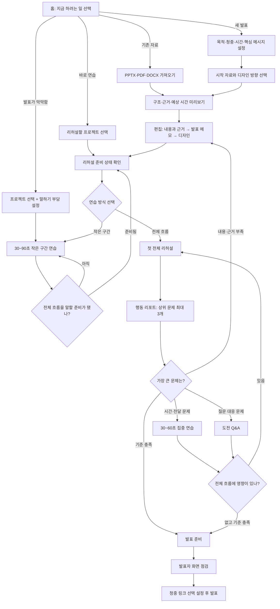

# ORBIT 사용자 여정 설계

> 기준 문서: [ORBIT 서비스 소개](./service-features-overview.md)  
> 설계 근거: 사용자 페르소나 에이전트 3명과의 모의 인터뷰, 현재 Web 화면과 라우트 검토

## 결론

ORBIT의 기능은 모든 사용자가 같은 순서로 전부 사용하는 긴 단계형 마법사가 아니라, 다음의 **공통 뼈대와 선택 분기**로 이어지는 것이 가장 자연스럽습니다.

> 목적과 제약 설정 → 시작 자료 선택 → 구조와 근거 확인 → 편집 → 부담에 맞는 첫 연습 → 상위 개선 행동 → 필요한 분기 연습 → 최종 확인 → 발표

핵심은 기능을 많이 보여주는 것이 아니라, 사용자의 현재 상태에 맞는 **다음 행동 하나**를 분명하게 제시하는 것입니다.

---

## 인터뷰에 참여한 사용자 페르소나

| 페르소나 | 대표 상황 | 성공 기준 | 가장 큰 불안 | 우선 기능 |
| --- | --- | --- | --- | --- |
| 정수진, B2B SaaS 프로덕트 매니저 | 2시간 안에 15분 경영진 보고 준비 | 수치와 결론이 정확하고 제한 시간 안에 끝남 | AI가 근거 없는 내용을 추가해 검증 시간이 늘어남 | 참고자료 활용, 핵심 메시지, 시간 점검, 단축 리허설 |
| 이준호, 스타트업 사업개발 리드 | 팀과 함께 20분 투자·고객 제안 준비 | 설득 흐름과 브랜드가 일관되고 어려운 질문에 답함 | 여러 사람이 수정해 최신 메시지와 기준 버전이 흔들림 | 협업, 버전 복원, 전체 리허설, 집중 연습, 도전 Q&A |
| 최유나, 사내 교육 담당자 겸 강사 | 기존 PPTX로 매달 40분 교육 반복 | 초보 청중도 이해하고 핵심 설명을 빠뜨리지 않음 | 기존 자료가 예상과 다르게 바뀌거나 연습 종료 시점을 모름 | PPTX 가져오기, 발표 메모, 장표별 시간, 반복 연습 |
| 한지우, 발표 경험이 적은 대학생 | 전공 수업에서 처음으로 7분 발표 | 대본을 그대로 읽지 않고 핵심 내용을 끝까지 전달함 | 첫 연습부터 전체 발표를 녹음·채점받는 느낌 | 쉬운 구성, 핵심 단어, 30초 연습, 단계형 리허설 |
| 오민재, 입사 8개월 차 사회초년생 | 상사 앞에서 처음으로 10분 성과 보고 | 결론부터 말하고 핵심 수치를 빠뜨리지 않음 | 낮은 점수나 연습 결과가 동료에게 공개되는 상황 | 짧은 반복, 결론형 답변, 개인 기록, 선택 공유 |
| 박성호, 말하기 부담이 있는 기술 책임자 | 고객 대상 25분 기술 설명 | 자기 속도로 핵심 세 가지를 분명히 전달함 | 음성 인식 오류와 멈춤이 능력 부족으로 평가됨 | 분석 선택권, 전사 확인, 개인 기준, 수동 진행 |

여섯 페르소나는 직무와 나이보다 서로 다른 사용 목적과 발표 부담을 대표합니다.

- **빠르게 완성해야 하는 사용자**
- **팀과 함께 고관여 설득을 준비하는 사용자**
- **반복 연습으로 전달력을 높이는 사용자**
- **어디서부터 연습해야 할지 모르는 발표 초보**
- **평가와 공개에 대한 부담이 큰 사회초년생**
- **말의 유창함보다 자기 속도와 정확한 전달이 중요한 사용자**

---

## 페르소나 1: 마감형 실무자 정수진

### 모의 인터뷰

**Q. ORBIT를 처음 열면 무엇부터 하고 싶나요?**  
A. “경영진 대상 15분 성과 보고”라는 목적과 시간부터 입력하고, 기존 PDF와 지난 분기 PPTX를 바로 올리고 싶습니다. 디자인보다 핵심 결론과 반드시 포함할 수치를 먼저 정해야 안심됩니다.

**Q. 어떤 결과가 보여야 계속 사용하겠나요?**  
A. 15분 분량의 목차와 장표별 핵심 메시지가 먼저 보여야 합니다. 각 수치와 결론이 어느 참고자료에서 왔는지 확인할 수 있어야 AI 결과를 신뢰할 수 있습니다.

**Q. 첫 리허설 전에 반드시 끝내야 하는 일은 무엇인가요?**  
A. 슬라이드 순서, 핵심 결론, 수치와 비교 기간만 확정하면 됩니다. 디자인과 애니메이션이 완벽해질 때까지 리허설을 미루고 싶지는 않습니다.

**Q. 리포트 다음에는 무엇을 원하나요?**  
A. “2분 초과”, “3번 장표의 핵심 수치 누락”, “마무리가 길다”처럼 가장 중요한 문제 세 개를 원합니다. 문제마다 해당 장표 편집이나 30~60초 연습으로 바로 이동하고 싶습니다.

**Q. 발표까지 30분밖에 없다면 무엇을 남기겠나요?**  
A. 목적과 자료 입력 → 초안의 결론 확인 → 수치와 근거 검증 → 전체 흐름 1회 점검 → 발표 화면 확인만 남깁니다. 팀 검토, 세부 디자인, 애니메이션, 상세 리포트, Q&A는 과감히 생략합니다.

### 정수진의 최적 경로

1. 발표 목적·청중·15분 제한 설정
2. PDF·PPTX 추가
3. 목차와 핵심 결론 미리 확인
4. AI 초안 생성
5. 수치·기간·근거만 우선 검증
6. 팀장에게 핵심 결론 검토 요청
7. 전체 리허설 1회
8. 상위 문제만 수정하거나 짧게 연습
9. 발표자 화면과 타이머 점검 후 발표

**생략 가능:** 세부 디자인, 애니메이션, 도전 Q&A, 두 번째 전체 리허설  
**신뢰 조건:** 참고자료와 생성 결과의 연결을 확인할 수 있어야 함

---

## 페르소나 2: 고관여 설득형 팀 리드 이준호

### 모의 인터뷰

**Q. ORBIT를 처음 열면 무엇부터 하고 싶나요?**  
A. 투자자와 고객에게 어떤 결정을 받아낼지 먼저 정하고, 제품 소개서와 시장 자료를 한곳에 모으고 싶습니다. 공동창업자와 디자이너도 초대해 하나의 최신 자료를 기준으로 이야기해야 합니다.

**Q. 어떤 초안이 유용한가요?**  
A. 단순 요약보다 고객 문제 → 해결책 → 성과 근거 → 제안과 요청으로 이어지는 20분 설득 구조가 필요합니다. 주장과 자료의 충돌 여부, 브랜드 분위기도 함께 확인하고 싶습니다.

**Q. 첫 리허설의 시작 조건은 무엇인가요?**  
A. 발표 순서와 핵심 숫자에 팀 합의가 끝나고 기준 버전이 저장되어야 합니다. 장표별 핵심 메시지, 간단한 발표 메모, 시간 배분까지 있으면 디자인이 완벽하지 않아도 시작할 수 있습니다.

**Q. 리포트에서 여러 문제가 동시에 나오면 무엇부터 해결하나요?**  
A. `빠진 핵심 근거 보완 → 초과 구간 집중 연습 → 예상 질문 대응` 순서입니다. 내용이 약한 상태에서 말하기와 Q&A를 연습해도 발표의 중심이 흔들리기 때문입니다.

**Q. 언제 전체 리허설을 다시 해야 하나요?**  
A. 핵심 근거나 발표 흐름을 편집했다면 반드시 다시 해야 합니다. 부분 연습과 Q&A만 했다면 결과가 전체 20분 흐름에서도 유지되는지 마지막으로 확인하고 싶습니다.

### 이준호의 최적 경로

1. 발표 목표·청중·원하는 결정 작성
2. 기존 자료 추가와 디자인 팩 선택
3. 설득 구조와 근거 충돌 확인
4. AI 초안 생성
5. 팀원 초대와 역할 설정
6. 내용 검토 후 기준 버전 저장
7. 발표 메모와 시간 배분 확정
8. 전체 리허설 1회
9. 문제 유형에 따라 편집·집중 연습·도전 Q&A 수행
10. 최종 전체 리허설
11. 발표자 화면과 청중 입장 링크 점검 후 발표

**생략 가능:** 핵심 메시지가 확정되기 전의 애니메이션과 음성 자동 전환  
**신뢰 조건:** 최신 버전, 변경 내용, 근거 출처를 팀이 함께 확인할 수 있어야 함

---

## 페르소나 3: 반복 성장형 교육 발표자 최유나

### 모의 인터뷰

**Q. ORBIT를 처음 열면 무엇부터 하고 싶나요?**  
A. 새 자료를 만들기보다 지난달 PPTX를 먼저 가져오고 싶습니다. 신입사원 대상 40분 교육이라는 조건만 추가해 기존 내용을 살리며 시작하고 싶습니다.

**Q. 어떤 결과가 보여야 계속 사용하겠나요?**  
A. 기존 내용과 순서를 보존하면서 설명이 너무 긴 장표와 핵심 메시지가 부족한 장표를 알려주면 좋겠습니다. 수정 이유와 예상 발표 시간까지 보여야 결과를 믿을 수 있습니다.

**Q. 첫 리허설의 최소 준비 상태는 무엇인가요?**  
A. 슬라이드 순서와 각 장표에서 반드시 말할 내용, 권장 시간이 있으면 충분합니다. 문장을 완벽하게 다듬기보다 마이크와 타이머만 확인하고 먼저 끝까지 말해보고 싶습니다.

**Q. 리포트 다음에는 무엇을 원하나요?**  
A. 어느 장표에서 말이 빨라졌고 어떤 설명을 빠뜨렸는지 알고 싶습니다. 중요한 개선 항목 세 개에서 해당 장표의 30~60초 연습으로 바로 이어져야 합니다.

**Q. 두 번째 전체 리허설은 언제 필요하나요?**  
A. 내용을 수정했거나, 핵심 설명을 놓쳤거나, 목표 시간을 넘겼거나, 앞뒤 장표 연결이 불안하면 필요합니다. 자료를 바꾸지 않았고 취약 구간을 연속 두 번 통과했으며 나머지 기준도 이미 충족했다면 바로 발표 준비로 가도 됩니다.

### 최유나의 최적 경로

1. 기존 PPTX 가져오기
2. 청중·40분 목표·교육 핵심 내용 설정
3. 내용 순서와 발표 메모 점검
4. 첫 전체 리허설
5. 장표별 시간·말하기 속도·누락 메시지 확인
6. 취약 구간을 30~60초 단위로 반복
7. 필요할 때만 두 번째 전체 리허설
8. 예상 질문 연습
9. 다음 장표와 타이머를 확인한 뒤 발표

**생략 가능:** 협업, 화려한 디자인, 애니메이션, 청중 링크  
**신뢰 조건:** 기존 PPTX가 보존되고 변경 이유와 연습 종료 기준이 명확해야 함

---

## 페르소나 4: 발표가 처음인 대학생 한지우

### 모의 인터뷰

**Q. 첫 화면에서 어떤 도움을 제안받아야 하나요?**  
A. “발표가 처음인가요? 주제와 발표 시간만 알려주면 순서부터 같이 잡아드릴게요”라고 말해주면 시작할 수 있습니다. 팀 자료를 올리면 7분 안에 말할 쉬운 순서와 장표마다 한 가지 핵심 내용부터 정리하고 싶습니다.

**Q. 처음부터 전체 리허설을 하면 왜 부담스러운가요?**  
A. 아직 대본도 정리하지 못했는데 7분 전체를 녹음하고 평가한다고 생각하면 시작을 미루게 됩니다. 처음 결과에 문제가 많이 나오면 “나는 발표를 못한다”는 생각부터 들 것 같습니다.

**Q. 10분 동안 할 수 있는 가장 작은 연습은 무엇인가요?**  
A. 첫 장에서 인사하고 발표 주제를 소개하는 30초만 연습하고 싶습니다. 문장 전체 대신 핵심 단어 세 개를 보고, 두 번째에는 화면을 조금 덜 보면서 말해보면 좋겠습니다.

**Q. 어떤 피드백이 다시 연습하게 만드나요?**  
A. “첫 문장에서 목적이 잘 전달됐어요. 다음에는 마지막 단어 뒤에 1초만 쉬어보세요”처럼 잘된 점과 바꿀 행동 하나를 알려주면 좋습니다. “전달력이 낮습니다”, “평균보다 부족합니다” 같은 평가는 포기하게 만듭니다.

**Q. 언제 전체 리허설로 넘어갈 수 있나요?**  
A. 도입 30초를 대본 없이 두 번 말하고, 가장 어려운 장표를 한 문장으로 설명하고, 막혀도 핵심 단어를 보며 다음 장표로 이어갈 수 있을 때입니다. 이때 **처음부터 끝까지 편하게 말해보기**라고 제안하면 부담이 덜합니다.

### 한지우의 최적 경로

1. 팀 자료 추가
2. 청중·7분 제한·핵심 내용 한 문장 설정
3. 쉬운 발표 순서와 장표별 핵심 단어 확인
4. 도입부 30초를 두 번 연습
5. 가장 어려운 장표 한 개 연습
6. 장표 사이 연결 연습
7. 준비됐을 때만 첫 전체 리허설
8. 잘한 점과 바꿀 행동 한 개 확인
9. 필요한 구간만 다시 말한 뒤 발표 화면 점검

**생략 가능:** 상세 분석, 비교 점수, 애니메이션, 전체 리허설 반복  
**신뢰 조건:** 작은 성공을 먼저 만들고 다른 사람과 비교하지 않아야 함

---

## 페르소나 5: 평가가 부담스러운 사회초년생 오민재

### 모의 인터뷰

**Q. 첫 화면에서 어떤 도움을 원하나요?**  
A. “처음 하는 업무 보고, 10분 안에 준비하기”처럼 내 상황을 바로 고르고 싶습니다. 핵심 성과 세 가지와 상사에게 전달할 결론을 먼저 정리한 뒤, 오늘은 자료를 다듬을지 10분만 연습할지 선택하고 싶습니다.

**Q. 가장 작은 첫 연습은 무엇인가요?**  
A. 첫 장에서 “이번 보고의 결론은 무엇인지” 30초 동안 말하는 것부터 시작하고 싶습니다. 이어서 예상 질문 하나에 `결론 → 이유 → 근거` 순서로 1분 안에 답하는 연습이면 충분합니다.

**Q. 어떤 피드백 표현이 도움이 되나요?**  
A. “평소보다 조금 빨랐어요. 첫 문장 뒤에 2초만 쉬어보세요”처럼 한 가지 행동을 제안하면 좋습니다. 낮은 등급, 다른 사람과의 순위, 문제 개수로 평가받고 싶지는 않습니다.

**Q. 나아졌다는 기준은 무엇인가요?**  
A. 첫 문장에서 결론을 말하고, 질문을 받았을 때 바로 긴 설명을 시작하지 않고 잠깐 생각할 수 있으면 좋아진 것입니다. 완벽한 속도보다 이전보다 천천히 말했고 핵심 수치를 빠뜨리지 않은 것이 중요합니다.

**Q. 연습 결과는 어떻게 다뤄져야 하나요?**  
A. 녹음과 말하기 피드백은 기본적으로 나만 볼 수 있어야 합니다. 연습 뒤에 **지금 삭제**, **나만 보관**, **선택한 결과만 공유** 중 직접 고르고, 공유하더라도 내가 선택한 성취만 보낼 수 있어야 안심됩니다.

### 오민재의 최적 경로

1. 기존 업무 자료 추가
2. 핵심 성과 세 가지와 보고 결론 설정
3. 발표 메모를 짧은 말투로 정리
4. 도입부 30초 연습
5. 어려운 장표 한두 개 연습
6. 예상 질문에 `결론 → 이유 → 근거`로 답하기
7. 전체 10분 흐름 1회 확인
8. 바꿀 행동 한 개만 다시 연습
9. 첫 문장·핵심 수치·예상 질문을 확인한 뒤 발표

**생략 가능:** 세부 디자인, 공개 공유, 많은 지표, 반복 전체 리허설  
**신뢰 조건:** 연습 결과는 기본 비공개이며 저장·삭제·공유를 직접 선택해야 함

---

## 페르소나 6: 자기 속도로 말하고 싶은 기술 책임자 박성호

### 모의 인터뷰

**Q. 어떤 설정이 있어야 안심하고 시작하나요?**  
A. 발표 목적과 25분 제한을 정한 뒤 **내 속도로 연습하기**, **음성 분석 없이 시작하기**, **10분만 연습하기**를 선택하고 싶습니다. 녹음과 전사 내용이 언제 삭제되는지도 시작 전에 알아야 합니다.

**Q. 음성 인식에서 가장 걱정되는 것은 무엇인가요?**  
A. 전문용어를 잘못 받아 적고 그 오류를 내 전달력 문제로 판단하는 상황입니다. 생각을 정리하려고 멈춘 시간이나 말이 잠시 막힌 순간을 곧바로 나쁜 습관으로 감점하지 않았으면 합니다.

**Q. 10분 동안 어떤 연습을 하겠나요?**  
A. 첫 두 장의 도입부를 60~90초 동안 말하고, 고객에게 꼭 전달할 핵심 문장 두 개가 들어갔는지만 확인하겠습니다. 처음부터 말의 속도와 멈춤 횟수를 모두 평가할 필요는 없습니다.

**Q. 존중받는다고 느끼는 피드백은 무엇인가요?**  
A. 말 더듬음이나 침묵 횟수보다 핵심 메시지 전달 여부, 목표 시간, 이전 연습과의 변화를 보고 싶습니다. “말을 잘 못했습니다”가 아니라 “이 구간은 핵심 결론이 더 분명하면 좋습니다”처럼 내용과 구간을 알려주면 좋습니다.

**Q. 인식 결과가 틀렸을 때 무엇을 할 수 있어야 하나요?**  
A. **인식 오류로 표시해 평가에서 제외**, **해당 구간 다시 말하기**, **음성 분석 없이 계속하기**를 즉시 선택할 수 있어야 합니다. 더듬은 횟수, 침묵 감점, 유창성 단일 점수, 다른 사용자와의 비교는 기본 화면에서 숨겨야 합니다.

### 박성호의 최적 경로

1. 기존 기술 자료 추가
2. 고객·25분 제한·핵심 메시지 세 가지 설정
3. 전문용어 설명과 이야기 순서 확인
4. 장표별 핵심 문장과 짧은 발표 메모 작성
5. 음성 분석 없이 전체 흐름 먼저 확인
6. 원하는 경우에만 음성 인식 사용
7. 인식이 불확실한 구간 확인·제외·재시도
8. 도입부·장표 전환·마무리를 짧게 반복
9. 고객 질문 연습
10. 최종 전체 리허설 후 발표자 화면 점검

**생략 가능:** 음성 분석, 유창성 평가, 자동 전환, 비교 지표  
**신뢰 조건:** 말하기 특성을 결함으로 판단하지 않고 분석 범위를 사용자가 통제해야 함

---

## 여섯 인터뷰에서 확인된 공통 요구

### 1. 기능이 아니라 목적을 먼저 물어야 합니다

첫 화면에서 사용자가 선택할 것은 기능 목록이 아니라 지금 하려는 일입니다.

- **새 발표자료 빠르게 만들기**
- **기존 자료 가져와 다듬기**
- **만들어 둔 자료로 연습하기**

현재 홈에는 AI 발표자료 생성과 리허설 진입이 이미 있습니다. 여기에 **기존 자료로 시작하기**를 같은 수준의 진입점으로 제공하면 여러 시작 경로를 수용할 수 있습니다. 발표 부담이 큰 사용자를 위해서는 **발표가 막막해요**라는 보조 진입점도 필요합니다.

### 2. AI 초안보다 먼저 구조와 근거를 확인해야 합니다

사용자들은 완성된 디자인보다 목차, 핵심 메시지, 시간 배분, 참고자료 반영 결과를 먼저 보고 싶어 했습니다. 따라서 생성 버튼을 누른 직후 바로 편집기로 보내기보다, 다음 내용을 확인하는 짧은 중간 단계가 필요합니다.

- 전체 이야기 순서
- 장표별 핵심 메시지
- 예상 발표 시간
- 반드시 포함할 내용
- 참고자료에서 가져온 근거

### 3. 편집이 끝날 때까지 리허설을 기다리게 하면 안 됩니다

첫 리허설은 완성도 검사가 아니라 방향 검사입니다. 슬라이드 순서와 핵심 메시지만 준비되면 전체 흐름을 한 번 말해보고, 그 결과로 편집 우선순위를 다시 정하는 편이 효율적입니다.

### 4. 리포트는 점수판이 아니라 다음 행동 선택기여야 합니다

리포트 첫 화면에는 모든 지표를 나열하기보다 다음 세 가지를 먼저 보여줘야 합니다.

1. 가장 중요한 문제 최대 3개
2. 그렇게 판단한 장표와 근거
3. 바로 실행할 다음 행동 버튼

### 5. 모든 사용자가 두 번째 전체 리허설을 할 필요는 없습니다

핵심 내용이나 슬라이드 순서를 바꿨다면 다시 전체 흐름을 확인해야 합니다. 반면 자료를 바꾸지 않았고 취약 구간을 안정적으로 통과했다면 바로 발표 준비로 이동할 수 있어야 합니다.

### 6. 발표 초보에게는 전체 리허설보다 작은 성공이 먼저입니다

발표가 익숙하지 않은 사용자에게 첫 과제가 전체 발표라면 시작 자체가 어려워집니다. 다음의 **안심 연습 사다리**를 제공해야 합니다.

1. 도입부 30초
2. 가장 어려운 장표 한 개
3. 장표 사이 연결
4. 짧은 구간 묶음
5. 준비됐을 때 전체 리허설

### 7. 사람을 평가하지 말고 다음 행동을 안내해야 합니다

“전달력이 낮습니다”, “평균 이하입니다”처럼 사람의 능력을 단정하는 표현을 피합니다. 피드백은 **잘된 점 한 가지 + 다음에 바꿀 행동 한 가지**를 기본으로 하고, 문제 개수나 낮은 점수를 앞세우지 않습니다.

### 8. 절대 기준보다 개인의 이전 결과와 비교해야 합니다

말하기 속도와 멈춤은 발표 유형과 개인에 따라 다릅니다. 다른 사용자와의 순위보다 핵심 메시지 전달, 목표 시간, 메모 의존도, 이전 연습 대비 변화를 우선합니다.

### 9. 음성 인식은 평가자가 아니라 보조 도구여야 합니다

음성 인식이 불확실한 구간은 사용자가 확인하고 평가에서 제외하거나 다시 말할 수 있어야 합니다. 언제든 음성 분석을 끄고 타이머·장표·핵심 메시지만으로 연습을 계속할 수 있어야 합니다.

### 10. 연습 기록은 기본적으로 개인에게만 보여야 합니다

프로젝트를 팀과 공유해도 개인의 녹음과 말하기 피드백이 자동 공유되어서는 안 됩니다. 사용자가 연습 후 **지금 삭제**, **나만 보관**, **선택한 결과만 공유**를 직접 결정하도록 합니다.

---

## 말하기 부담이 있는 사용자를 위한 피드백 원칙

ORBIT는 말 더듬음, 긴 멈춤, 느린 속도를 없애야 할 결함으로 정의하지 않습니다. 사용자가 자기 속도로 핵심 내용을 전달하도록 돕고, 음성 인식 결과를 절대적인 평가 근거로 사용하지 않는 것이 원칙입니다.

| 피해야 할 표현·방식 | 권장 표현·방식 | 이유 |
| --- | --- | --- |
| 전달력 42점 | 핵심 메시지 3개 중 2개를 전달했어요 | 사람 대신 전달 결과에 집중 |
| 평균보다 느립니다 | 목표 시간보다 1분 길었어요 | 다른 사람이 아닌 발표 목적과 비교 |
| 침묵이 8회 발생했습니다 | 길게 멈춘 두 구간을 확인해 볼까요? | 생각을 위한 멈춤과 어려운 구간을 구분 |
| 더듬은 횟수 강조 | 잠시 멈춘 뒤 핵심 문장을 이어갔어요 | 유창함보다 회복과 전달을 인정 |
| 문제 12개 발견 | 다음에는 첫 문장 뒤에 2초 쉬어보세요 | 한 번에 실행할 행동 하나 제안 |
| 전사 결과를 그대로 평가 | 인식이 불확실한 구간을 확인해 주세요 | 음성 인식 오류가 사용자 평가로 이어지는 것을 방지 |
| 팀 프로젝트이므로 자동 공유 | 이 연습 결과는 나에게만 공개됩니다 | 연습의 심리적 안전 확보 |

피드백 화면의 기본 순서는 다음과 같습니다.

1. 이번 연습에서 잘된 점 한 가지
2. 사용자가 전달한 핵심 내용
3. 다음에 바꿀 행동 한 가지
4. **한 번 더 연습하기** 또는 **오늘 연습 마치기**
5. 기록의 삭제·보관·공유 선택

---

## 권장하는 최적 사용자 흐름

---

## 단계별 제품 설계

### 0단계. 목적 기반 빠른 시작

홈에서는 다음 세 버튼을 동일한 중요도로 제공하고, 발표 자체가 부담스러운 사용자를 위한 보조 진입점을 둡니다.

| 사용자 의도 | 기본 버튼 | 연결 결과 |
| --- | --- | --- |
| 새 자료가 필요함 | AI 발표자료 만들기 | 최소 브리프와 자료 추가 |
| 기존 자료가 있음 | 기존 자료로 시작하기 | PPTX 가져오기 또는 참고자료 기반 구성 |
| 이미 자료가 준비됨 | 리허설 시작하기 | 프로젝트 선택 후 마이크 점검 |
| 어디서부터 해야 할지 모름 | 발표가 막막해요 | 프로젝트 선택 후 30~90초 안심 연습 |

사용자가 마지막으로 하던 작업이 있다면 **이어서 편집하기**, **이어서 연습하기**를 가장 먼저 보여줍니다.

### 1단계. 최소 발표 브리프

처음부터 많은 항목을 요구하지 않고 다음 네 가지만 필수로 받습니다.

1. 누구에게 발표하는가
2. 무엇을 얻고 싶은가
3. 발표 시간은 얼마인가
4. 반드시 전달할 내용은 무엇인가

분위기, 글꼴, 색상, 예상 질문, 세부 디자인은 선택 항목으로 뒤에 둡니다.

### 2단계. 시작 방식 선택

- 주제만으로 시작
- 참고자료를 바탕으로 시작
- 기존 PPTX를 그대로 가져와 개선
- 빈 프로젝트에서 직접 시작

어떤 방식을 선택해도 최종적으로 같은 프로젝트 편집기로 합류해야 합니다. 사용자가 시작 방식을 바꾸더라도 입력한 브리프와 자료는 유지합니다.

### 3단계. 생성 전 구조 확인

전체 초안을 만들기 전에 이야기 순서, 핵심 메시지, 예상 시간을 먼저 보여줍니다. 사용자는 이 단계에서 순서를 바꾸고, 빠진 근거를 추가하고, 불필요한 장표를 제거할 수 있습니다.

기본 버튼은 **이 구성으로 초안 만들기**이며, 빠른 사용자를 위해 **바로 초안 만들기**도 제공합니다.

### 4단계. 목적이 있는 편집

편집기는 기능 도구를 나열하기보다 다음 순서로 완료 상태를 안내합니다.

1. 내용과 근거 확인
2. 장표별 핵심 메시지 확인
3. 발표 메모와 시간 배분 확인
4. 디자인과 애니메이션 보완

첫 세 항목이 준비되면 디자인이 완벽하지 않아도 **첫 리허설로 흐름 확인하기**를 제안합니다.

### 5단계. 리허설 준비 확인

리허설 직전에는 긴 설정 화면 대신 다음만 점검합니다.

- 마이크와 음성 인식 상태
- 목표 발표 시간
- 현재 슬라이드 순서
- 핵심 메시지와 발표 메모 준비 여부
- 연습 결과의 공개·보관 범위

사용자는 **전체 흐름 연습**, **작은 구간부터 연습**, **음성 분석 없이 연습** 중에서 선택할 수 있어야 합니다. 음성 분석을 원하지 않는 사용자는 기본 타이머와 수동 진행만으로도 연습할 수 있어야 합니다.

### 5-1단계. 안심 연습 사다리

전체 리허설이 부담스러운 사용자에게는 한 번에 한 단계만 제안합니다.

1. **도입부 30초:** 핵심 단어 세 개를 보며 첫 문장 말하기
2. **한 장 60초:** 가장 어려운 장표를 한 문장으로 설명하기
3. **장표 연결:** 이전 장표의 결론과 다음 장표의 첫 문장 이어보기
4. **짧은 구간:** 도입부나 핵심 구간을 2~3장 묶어 말하기
5. **전체 흐름:** 준비됐을 때 처음부터 끝까지 편하게 말해보기

각 연습 뒤에는 점수 대신 **잘된 점 한 가지**와 **다음에 바꿀 행동 한 가지**만 기본으로 보여줍니다. 사용자가 오늘 연습을 끝내도 실패로 처리하지 않습니다.

### 6단계. 첫 전체 리허설

첫 리허설의 목표는 완벽한 발표가 아니라 가장 큰 문제를 찾는 것입니다. 발표 초보에게는 안심 연습 사다리를 통과한 뒤 전체 리허설을 제안합니다. 진행 중에는 현재·다음 장표, 발표 메모, 타이머, 핵심 메시지 누락 정도만 보여주고 상세 평가는 끝난 뒤 제공합니다.

### 7단계. 행동 중심 리포트

리포트 상단에는 다음 형태의 행동 카드를 최대 세 개만 노출합니다.

| 발견된 문제 | 우선 행동 | 버튼 예시 |
| --- | --- | --- |
| 전체 발표 시작이 부담스러움 | 작은 구간부터 시작 | 도입부 30초 말해보기 |
| 장표나 메모에 핵심 근거가 없음 | 편집기로 이동 | 빠진 핵심 근거 보완하기 |
| 근거는 있지만 발표에서 누락 | 해당 구간 반복 | 3번 장표 60초 연습하기 |
| 목표 시간 초과 | 초과 장표 반복 | 초과 구간 3분 줄여보기 |
| 반론 대응이 불안정 | 도전 Q&A | 예상 질문 3개에 답해보기 |
| 기준 충족 | 발표 준비 | 발표 화면 점검하기 |

### 8단계. 문제 유형별 분기

다음 행동은 낮은 점수순이 아니라 문제의 원인순으로 정합니다.

1. **전체 발표 시작이 부담스러움:** 30~90초 안심 연습으로 이동
2. **내용과 근거 문제:** 편집기로 돌아가기
3. **시간과 전달 문제:** 집중 연습으로 이동
4. **반론과 질문 대응 문제:** 도전 Q&A로 이동

내용이 바뀌면 기존 전달 연습 결과의 신뢰도가 낮아지므로, 편집 후에는 전체 리허설을 다시 권장합니다.

### 9단계. 재리허설 판단

다음 중 하나라도 해당하면 전체 리허설을 다시 권장합니다.

- 핵심 내용이나 슬라이드 순서를 수정함
- 필수 메시지를 아직 놓침
- 목표 시간을 벗어남
- 앞뒤 장표 연결이 불안정함
- 집중 연습 결과가 일관되지 않음

다음 조건을 모두 만족하면 바로 발표 준비로 이동할 수 있습니다.

- 자료를 수정하지 않음
- 모든 필수 핵심 메시지를 전달함
- 목표 시간 범위 안에 들어옴
- 우선 개선 구간을 연속 두 번 통과함
- 새롭게 악화된 문제가 없음

발표 초보는 전체 리허설에 앞서 다음 세 조건만 충족해도 충분합니다.

- 도입부 30초를 두 번 말해봄
- 가장 어려운 장표의 핵심을 한 문장으로 설명함
- 막혔을 때 핵심 단어를 보고 다시 이어갈 수 있음

이때 **전체 흐름 최종 확인하기**와 **연습 완료하고 발표 준비하기**를 함께 제공하되, 시스템이 권장하는 선택을 한 개의 기본 버튼으로 표시합니다.

### 10단계. 발표 준비

마지막 화면에서는 새 기능을 학습시키지 않고 다음만 확인합니다.

- 발표자 화면과 슬라이드 전용 화면 연결
- 현재·다음 장표와 발표 메모 표시
- 타이머와 키보드 진행
- 필요한 경우에만 청중 링크·QR·비밀번호 설정

기본 버튼은 **발표 시작**입니다.

---

## 준비 시간과 발표 부담에 따른 네 가지 경로

### 10분 안심 시작 경로

목적과 시간 설정 → 핵심 메시지 한 문장 → 도입부 30초 → 어려운 장표 한 개 → 잘된 점과 다음 행동 하나

- 발표를 처음 하거나 녹음·평가가 부담스러운 사용자에게 추천
- 전체 리허설을 완료 조건으로 강제하지 않음
- 기본 버튼은 **30초 한 번 더 연습하기**, 보조 버튼은 **오늘 연습 마치기**

### 30분 빠른 경로

목적과 자료 입력 → 핵심 결론·수치 확인 → 전체 흐름 1회 점검 → 발표 화면 확인 → 발표

- 상세 디자인과 애니메이션 생략
- 상세 리포트와 맞춤 연습 생략
- 문제를 발견해도 발표 실패에 직접 연결되는 내용만 수정

### 표준 경로

브리프 → 자료와 초안 → 편집 → 전체 리허설 → 상위 3개 개선 → 필요한 분기 연습 → 발표 준비

- 대부분의 개인 사용자에게 기본 추천
- 전체 리허설은 1회, 필요할 때만 재실행

### 고관여 경로

브리프 → 자료 통합 → 협업·기준 버전 → 편집 → 전체 리허설 → 편집·집중 연습·Q&A → 최종 전체 리허설 → 청중 입장 준비 → 발표

- 투자, 영업, 중요한 의사결정 발표에 추천
- 핵심 내용 수정 후 재리허설 필수

---

## 현재 화면 구조와의 연결

현재 코드에는 최적 경로를 구성하는 주요 화면이 이미 분리되어 있습니다.

| 사용자 단계 | 현재 화면·라우트 |
| --- | --- |
| 홈과 빠른 시작 | `/` |
| AI 발표자료 생성 | `/createdeck` |
| 프로젝트 선택 | `/project` |
| 리허설할 프로젝트 선택 | `/project?intent=rehearsal` |
| 편집 | `/project/:projectId` |
| 발표 브리프 | `/project/:projectId/brief` |
| 버전 기록 | `/project/:projectId/history` |
| 전체 리허설 | `/rehearsal/:projectId` |
| 리허설 리포트 | `/rehearsal/:projectId/report/:runId` |
| 맞춤 연습 계획 | `/rehearsal/:projectId/plan/:sourceFullRunId` |
| 집중 연습 | `/rehearsal/:projectId/focus/:goalId` |
| 도전 Q&A | `/rehearsal/:projectId/challenge/:sourceFullRunId` |
| 발표 실행 | `/presentation/:projectId` |

현재의 집중 연습 화면은 짧은 구간 연습에 활용할 수 있지만, 전체 리허설 결과가 있어야만 접근하는 흐름에 가깝습니다. 발표 초보를 위해서는 전체 리허설 전에도 같은 연습 방식을 시작할 수 있는 진입점과 개인 연습 상태가 추가로 필요합니다.

새 화면을 많이 만드는 것보다, 각 화면의 완료 시점에 **맥락에 맞는 다음 행동 버튼**을 연결하는 작업이 우선입니다.

---

## 구현 우선순위 제안

### P0. 하나의 연결된 여정 만들기

1. 홈에 **기존 자료로 시작하기** 추가
2. 홈에 **발표가 막막해요** 보조 진입점 추가
3. 프로젝트에 현재 여정 상태와 다음 행동 저장
4. 편집기에서 **첫 리허설로 흐름 확인하기**와 **작은 구간부터 연습하기** 연결
5. 리포트 상단에 문제별 다음 행동 최대 3개 제공
6. 편집·집중 연습·Q&A 후 전체 리허설 필요 여부 판단
7. 발표 준비 완료 기준과 **발표 시작** 연결
8. 연습 결과를 기본 비공개로 두고 삭제·보관·선택 공유 제공

### P1. 페르소나별 경로 최적화

1. 안심 시작·빠른·표준·고관여 경로 추천
2. 30~90초 안심 연습 사다리 제공
3. 음성 인식 오류 표시·평가 제외·재시도 지원
4. 참고자료와 생성 내용의 연결 표시
5. 팀 기준 버전과 검토 완료 상태 제공
6. 반복 발표용 이전 자료·리허설 결과 이어쓰기

### P2. 개인화 강화

1. 사용자가 자주 생략하는 단계를 다음 프로젝트에 반영
2. 발표 유형별 준비 체크리스트 제공
3. 이전 리허설 변화에 따라 다음 연습 난이도 조정
4. 개인별 말하기 속도·멈춤 허용 범위 설정
5. 사용자가 선택한 지표만 리포트에 표시

---

## 반드시 지켜야 할 흐름 원칙

- 한 화면의 기본 버튼은 가능하면 하나만 둡니다.
- 사용하지 않은 기능이 있어도 여정을 완료할 수 있어야 합니다.
- 리포트는 설명보다 행동을 먼저 보여줍니다.
- 발표 초보에게 전체 리허설을 첫 과제로 강제하지 않습니다.
- 사람을 낮은 점수, 등급, 순위로 규정하지 않습니다.
- 기본 피드백은 잘된 점 한 가지와 다음 행동 한 가지입니다.
- 말 더듬음이나 긴 멈춤을 곧바로 능력 부족으로 판단하지 않습니다.
- 음성 인식이 불확실한 구간은 사용자가 평가에서 제외할 수 있어야 합니다.
- 녹음과 개인 피드백은 기본적으로 본인에게만 공개합니다.
- 내용이 바뀌면 연습 결과의 유효성을 다시 확인합니다.
- AI 결과에는 사용자가 확인할 근거와 변경 이유가 있어야 합니다.
- 발표 직전에는 새 기능을 권하지 않고 안정적인 실행만 돕습니다.

최종적으로 ORBIT가 사용자에게 반복해서 답해야 하는 질문은 하나입니다.

> 지금 이 발표를 더 좋아지게 만들기 위해, 다음으로 해야 할 가장 작은 행동은 무엇인가?
