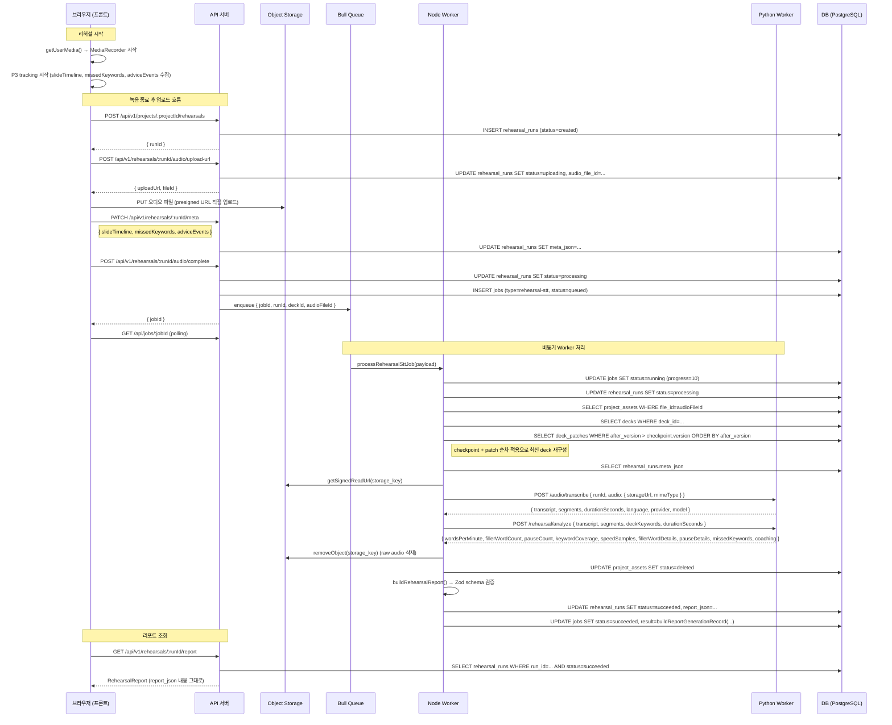
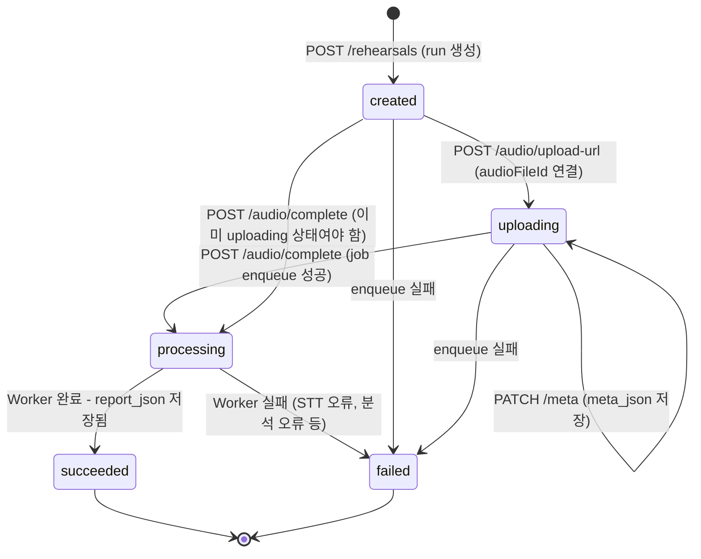
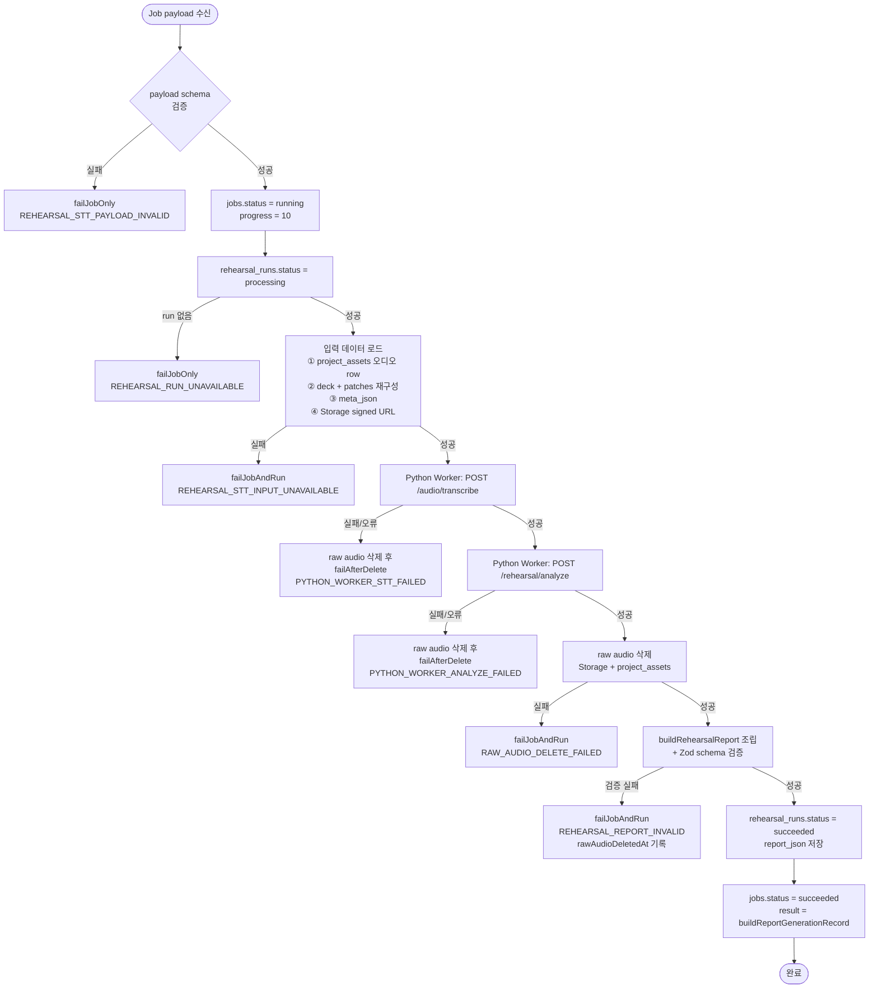
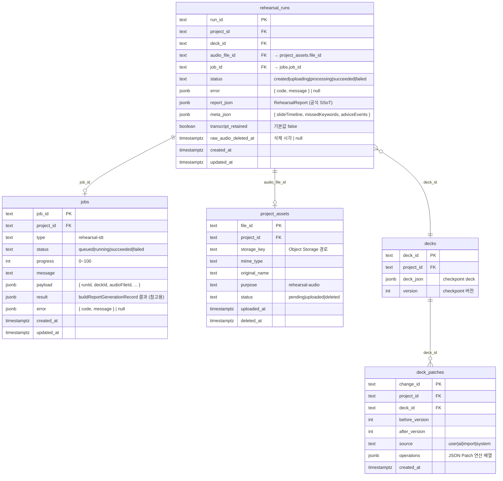

# Rehearsal Report 파이프라인 전체 가이드

리허설을 실행하고 녹음 파일을 업로드한 뒤 서버가 리포트를 생성해서 화면에 보여주는 흐름을 처음부터 끝까지 설명한다.

---

## 목차

1. [핵심 개념 빠르게 잡기](#1-핵심-개념-빠르게-잡기)
2. [전체 파이프라인 흐름](#2-전체-파이프라인-흐름)
3. [RehearsalRun 상태 전이](#3-rehearsalrun-상태-전이)
4. [Worker 처리 순서 상세](#4-worker-처리-순서-상세)
5. [데이터베이스 테이블 구조](#5-데이터베이스-테이블-구조)
6. [각 계층별 책임 정리](#6-각-계층별-책임-정리)
7. [report_json 구조](#7-report_json-구조)
8. [수정할 때 같이 봐야 하는 곳](#8-수정할-때-같이-봐야-하는-곳)
9. [현재 구조의 주요 리스크](#9-현재-구조의-주요-리스크)
10. [코드 읽는 순서](#10-코드-읽는-순서)

---

## 1. 핵심 개념 빠르게 잡기

### Live STT vs Rehearsal Report STT — 완전히 다른 흐름이다

| | Live STT | Rehearsal Report STT |
|---|---|---|
| 실행 시점 | 발표 **중** 실시간 | 녹음 **완료 후** 비동기 |
| 실행 위치 | 브라우저 내부 | 서버 (Python Worker) |
| 목적 | 발표 진행 보조 | 리포트 생성을 위한 전사/분석 |
| Provider | `LIVE_STT_PROVIDER=sherpa` | `REPORT_STT_PROVIDER=openai\|whisperx` |

### 도메인 객체 4개

```
RehearsalRun          ← 리허설 한 번 실행의 단위 (canonical row)
  ├─ Job              ← 비동기 작업 상태 추적 (보조)
  ├─ RehearsalRunMeta ← 프론트가 수집한 보조 메타데이터 (meta_json)
  └─ RehearsalReport  ← 서버 분석 확정 결과 (report_json) ← 공식 SSoT
```

**중요**: 공식 리포트 SSoT는 `jobs.result`가 아니라 `rehearsal_runs.report_json`이다.

---

## 2. 전체 파이프라인 흐름



---

## 3. RehearsalRun 상태 전이



**Job 상태는 별도로 추적된다**:

```
queued → running → succeeded
                 → failed
```

Job 상태와 RehearsalRun 상태는 쌍으로 움직이지만, 공식 결과 판정은 `rehearsal_runs.status`를 기준으로 한다.

---

## 4. Worker 처리 순서 상세

`apps/worker/src/rehearsal-stt.processor.ts`의 `processRehearsalSttJob()` 함수가 전체 오케스트레이션을 담당한다.



### deck 재구성 로직이 중요한 이유

Worker는 단순히 `decks.deck_json`만 읽지 않는다. checkpoint deck를 읽고 그 이후의 `deck_patches`를 버전 순서대로 모두 적용해서 분석 시점의 최신 deck를 만든다.

```
decks.deck_json (v5)
  + deck_patches v5→v6
  + deck_patches v6→v7
  = 최신 deck (v7)
```

리포트에서 `slideTimings`, `missedKeywords`, `keywordCoverage`는 이 최신 deck 기준으로 계산되기 때문에, 중간에 patch chain이 끊기면 Worker가 에러를 던지고 리포트 생성이 막힌다.

---

## 5. 데이터베이스 테이블 구조



### 테이블 역할 한 줄 요약

| 테이블 | 역할 |
|---|---|
| `rehearsal_runs` | 리허설 실행의 canonical row. `report_json`이 공식 리포트 |
| `jobs` | 비동기 작업 상태 추적 (보조) |
| `project_assets` | raw audio 라이프사이클 추적 (업로드 → 삭제) |
| `decks` | 분석 컨텍스트 공급 (checkpoint) |
| `deck_patches` | 분석 시점 최신 deck 재구성을 위한 변경 이력 |

---

## 6. 각 계층별 책임 정리

### 6.1 프론트 (`apps/web/src/features/rehearsal/`)

```
startRecording()
  └─ getUserMedia() + createRecordingSession()
  └─ startP3Tracking(stream)
       └─ slideTimeline 수집 (슬라이드 이동 시각)
       └─ missedKeywords 수집 (Live STT 기반 누락 키워드)
       └─ adviceEvents 수집 (pace-too-fast, slide-overtime 등)

stopRecording() → submitRecording(activeDeck, audioFile)
  └─ runRehearsalUploadFlow()
       1. createRehearsalRun()         → POST /projects/:id/rehearsals
       2. requestAudioUploadUrl()      → POST /rehearsals/:runId/audio/upload-url
       3. uploadRehearsalAudio()       → Storage 직접 PUT
       4. updateRehearsalRunMeta()     → PATCH /rehearsals/:runId/meta
       5. completeRehearsalAudioUpload() → POST /rehearsals/:runId/audio/complete
       6. pollRehearsalJob()           → GET /jobs/:jobId (완료까지 polling)
       7. fetchRehearsalReport()       → GET /rehearsals/:runId/report
```

**주의**: 프론트가 수집한 `meta_json`은 보조 입력이지만, `slideTimings`와 `missedKeywords` UX에 실질적으로 영향을 준다. 프론트 tracking 로직이 바뀌면 서버 리포트 내용도 바뀐다.

### 6.2 API (`apps/api/src/rehearsals/`)

| 엔드포인트 | 역할 |
|---|---|
| `POST /projects/:id/rehearsals` | run 생성 (`status=created`) |
| `POST /rehearsals/:runId/audio/upload-url` | presigned URL 발급, `status=uploading` |
| `PATCH /rehearsals/:runId/meta` | meta_json 저장 (created/uploading 상태만 허용) |
| `POST /rehearsals/:runId/audio/complete` | job 생성 + enqueue, `status=processing` |
| `GET /rehearsals/:runId` | run 상태 조회 |
| `GET /rehearsals/:runId/report` | report 조회 (succeeded + report_json 있을 때만 반환) |

**enqueue 실패 시**: API가 raw audio를 직접 삭제하고 run/job을 실패 처리한다.

### 6.3 Worker (`apps/worker/src/rehearsal-stt.processor.ts`)

- 전체 비동기 처리 오케스트레이션
- 입력 데이터 로드 (오디오, 최신 deck, run meta)
- Python Worker 호출 (전사 → 분석)
- raw audio 삭제 (분석 완료 후 또는 STT/분석 실패 후)
- `buildRehearsalReport()`: 모든 결과 조합 + Zod schema 검증
- DB 상태 업데이트 (raw SQL)

### 6.4 Python Worker (`services/python-worker/app/rehearsal.py`)

| 엔드포인트 | 입력 | 출력 |
|---|---|---|
| `POST /audio/transcribe` | storageUrl, mimeType | transcript, segments, durationSeconds |
| `POST /rehearsal/analyze` | transcript, segments, deckKeywords, durationSeconds | metrics, speedSamples, pauseDetails, coaching |

**coaching 생성**: OpenAI Responses API를 사용해 `summary`, `strengths`, `improvements`, `nextPracticeFocus`를 생성한다. transcript가 비어 있으면 skip/unavailable 처리한다.

---

## 7. report_json 구조

`rehearsal_runs.report_json`에 저장되는 `RehearsalReport`의 주요 필드:

```typescript
{
  reportId: string,           // "report_{runId}"
  runId: string,
  projectId: string,
  deckId: string,
  transcriptRetained: false,  // DB report_json 기준, API 응답에서는 Redis TTL 캐시가 있으면 true
  transcript: null,           // DB에는 저장하지 않고 API 응답에서만 Redis cache 값을 주입

  metrics: {
    durationSeconds: number,
    wordsPerMinute: number,
    fillerWordCount: number,
    pauseCount: number,
    keywordCoverage: number   // 0~1
  },

  speedSamples: [{ startSecond, endSecond, wordsPerMinute }],
  fillerWordDetails: [{ word, count }],
  pauseDetails: [{ startSecond, endSecond, durationSeconds }],

  missedKeywords: [{ slideId, keywordId, text }],
  // Python worker 분석 결과. 중복 제거됨.

  slideTimings: [{ slideId, targetSeconds, actualSeconds }],
  // deck.estimatedSeconds + runMeta.slideTimeline으로 Worker가 계산

  qnaSummary: { questionCount: 0, questionSummary: "", unclearTopics: [] },
  // 현재 기본값 성격이 강함

  coaching: { summary, strengths, improvements, nextPracticeFocus } | null,
  generatedAt: string         // raw audio 삭제 시각
}
```

**`slideTimings` 계산 방식**:

```
runMeta.slideTimeline = [
  { slideId: "s1", enteredAt: "2026-01-01T10:00:00Z" },
  { slideId: "s2", enteredAt: "2026-01-01T10:01:30Z" },   ← s1의 exitedAt
  { slideId: "s3", enteredAt: "2026-01-01T10:03:00Z" }    ← s2의 exitedAt
]

s1 actualSeconds = (s2.enteredAt - s1.enteredAt) / 1000 = 90
s1 targetSeconds = slide.estimatedSeconds
                   ?? (deck.targetDurationMinutes * 60 / slides.length)
```

마지막 슬라이드는 `nextEntry`가 없으므로 `slideTimings`에 포함되지 않는다.

---

## 8. 수정할 때 같이 봐야 하는 곳

### `report_json` shape 변경 (공식 지표 추가/수정)

1. `packages/shared/src/rehearsals/rehearsal.schema.ts` (Zod schema)
2. `services/python-worker/app/rehearsal.py` (분석 로직)
3. `apps/worker/src/rehearsal-stt.processor.ts` (`buildRehearsalReport`)
4. `apps/web/src/features/rehearsal/RehearsalWorkspace.tsx` (렌더링)
5. `docs/contracts.md`

### `meta_json` shape 변경 (수집 메타데이터 변경)

1. `packages/shared/src/rehearsals/rehearsal.schema.ts`
2. `apps/web/src/features/rehearsal/speech/p3RehearsalSession.ts`
3. `apps/web/src/features/rehearsal/speech/rehearsalLogCollector.ts`
4. `apps/api/src/rehearsals/rehearsals.service.ts` (`updateRunMeta`)
5. `apps/worker/src/rehearsal-stt.processor.ts` (`loadRehearsalRunMeta` 이후 계산)

### raw audio 보존 정책 변경

1. `docs/contracts.md`
2. `apps/worker/src/rehearsal-stt.processor.ts` (`deleteRawAudio`, `failAfterDelete`)
3. `apps/api/src/files/files.service.ts`

### API 요청/응답 변경

1. `packages/shared/src/rehearsals/rehearsal.schema.ts`
2. `apps/api/src/rehearsals/rehearsals.service.ts`
3. 프론트 fetch 코드
4. `docs/contracts.md`

---

## 9. 현재 구조의 주요 리스크

| 리스크 | 이유 |
|---|---|
| `report_json` schema 변경 영향이 크다 | Worker가 raw SQL로 직접 저장하므로 컬럼명·shape 변경 시 영향 범위가 넓다 |
| deck patch chain 끊기면 리포트 생성 막힘 | Worker가 순차 적용 중 version 불일치 감지 시 즉시 에러 |
| 프론트 meta 수집 품질이 리포트에 직결 | `slideTimings`, `missedKeywords`는 프론트 tracking 결과에 의존 |
| `qnaSummary`는 아직 기본값 | questionCount, questionSummary, unclearTopics 모두 빈 값 |
| 마지막 슬라이드 timing 미수집 | `buildSlideTimings`에서 nextEntry 없는 마지막 항목은 제외됨 |
| transcript 미보존 | 한번 삭제된 audio와 미저장 transcript는 복구 불가 |

---

## 10. 코드 읽는 순서

### 계약 (shared schema)

```
packages/shared/src/rehearsals/rehearsal.schema.ts   ← 가장 먼저
packages/shared/src/rehearsals/live-stt.schema.ts
packages/shared/src/jobs/job.schema.ts
```

### 프론트

```
apps/web/src/App.tsx                                        ← 라우트 구조
apps/web/src/features/rehearsal/RehearsalWorkspace.tsx      ← 핵심 (큰 파일)
apps/web/src/features/rehearsal/speech/p3RehearsalSession.ts
apps/web/src/features/rehearsal/speech/rehearsalLogCollector.ts
apps/web/src/features/rehearsal/panel/rehearsalTiming.ts
```

### 백엔드

```
apps/api/src/rehearsals/rehearsals.controller.ts     ← 엔드포인트 목록
apps/api/src/rehearsals/rehearsals.service.ts        ← API 로직
apps/api/src/rehearsals/rehearsal-run.entity.ts      ← DB entity
apps/worker/src/rehearsal-stt.processor.ts           ← Worker 핵심 (처음 끝까지 읽기)
services/python-worker/app/rehearsal.py              ← 분석/코칭
```

### DB migration

```
apps/api/src/database/migrations/2026062700200-CreateJobs.ts
apps/api/src/database/migrations/2026062901000-CreateRehearsalRuns.ts
apps/api/src/database/migrations/2026062903000-AddRehearsalReportColumns.ts
apps/api/src/database/migrations/2026070301000-AddRehearsalRunMetaJson.ts
apps/api/src/files/project-asset.entity.ts
```

---

## 관련 문서

- [P0 리허설 코칭 공통 계약 가이드](./p0-core-contract-guide.md) — 공통 fixture와 P0 계약의 의미, 보안 경계, 구현 범위를 쉽게 설명한다.
- `docs/rehearsal/backend.md` — API, Worker, Python Worker 책임 상세
- `docs/rehearsal/frontend.md` — 화면, 라우트, 녹음/업로드/리포트 조회 흐름
- `docs/rehearsal/database.md` — 테이블, 컬럼, 상태 전이, 저장 규칙
- `docs/contracts.md` — 계약 원문
- `docs/conventions/environment.md` — 환경변수 규칙
- `docs/specs/whisperx-report-stt-provider.md` — WhisperX STT provider 스펙
