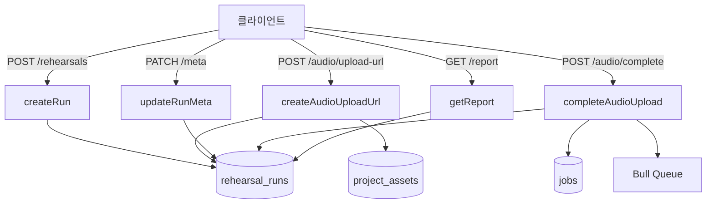
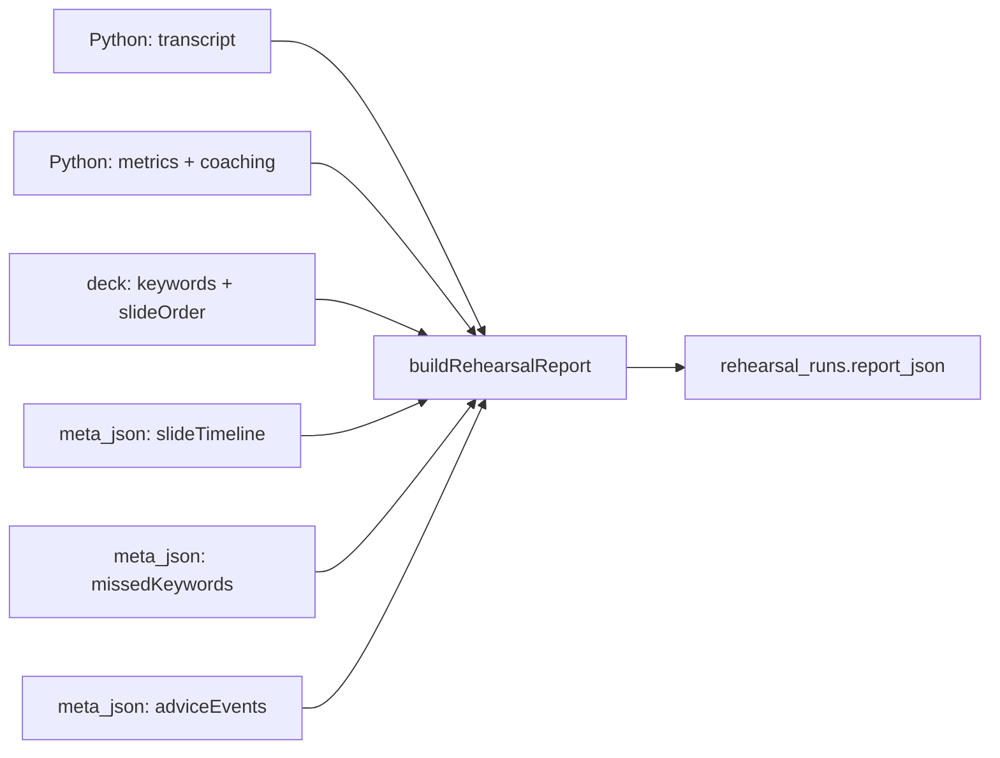
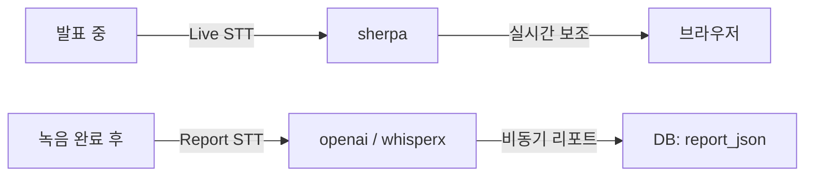

# Rehearsal Report Backend

## 1. 서버 영역 구성

리허설 리포트는 단일 서버에서 끝나지 않는다.

- API: run 생성, 업로드 제어, meta 저장, report 조회
- Worker: 비동기 orchestration, DB update, storage 정리
- Python worker: STT 후처리, 지표 계산, 코칭 생성

관련 구현 위치:

- API: `apps/api/src/rehearsals`
- Worker: `apps/worker/src/rehearsal-stt.processor.ts`
- Python worker: `services/python-worker/app/rehearsal.py`

## 2. API 계층

### 컨트롤러

`apps/api/src/rehearsals/rehearsals.controller.ts`

노출 엔드포인트:

- `POST /api/v1/projects/:projectId/rehearsals`
- `POST /api/v1/rehearsals/:runId/audio/upload-url`
- `POST /api/v1/rehearsals/:runId/audio/complete`
- `PATCH /api/v1/rehearsals/:runId/meta`
- `GET /api/v1/rehearsals/:runId`
- `GET /api/v1/rehearsals/:runId/report`

### 서비스

`apps/api/src/rehearsals/rehearsals.service.ts`

핵심 책임:

- request schema 검증
- project/deck 접근 검증
- `rehearsal_runs` row 생성/갱신
- `project_assets` 업로드 흐름 제어
- `jobs` row 생성
- queue enqueue
- enqueue 실패 시 raw audio cleanup

## 3. API 단계별 동작

### 3.1 `createRun`

- `deckId`가 현재 project deck과 맞는지 확인
- `rehearsal_runs`에 새 row 생성
- 초기값:
  - `status = created`
  - `audioFileId = null`
  - `jobId = null`
  - `rehearsalReport = null`
  - `metaJson = {}`
  - `transcriptRetained = false`

### 3.2 `createAudioUploadUrl`

- run 상태가 `created` 또는 `uploading`인지 확인
- `FilesService.createUploadUrl()` 호출
- purpose는 반드시 `rehearsal-audio`
- 성공 시 run에 `audioFileId` 저장, 상태를 `uploading`으로 변경

### 3.3 `updateRunMeta`

- run 상태가 `created` 또는 `uploading`일 때만 허용
- 프론트가 만든 `slideTimeline`, `missedKeywords`, `adviceEvents`를 `metaJson`으로 저장
- processing 이후에는 수정 금지

### 3.4 `completeAudioUpload`

- 상태가 `uploading`인지 확인
- 요청 `fileId`와 run의 `audioFileId`가 일치하는지 확인
- 업로드 완료 확인 후 `rehearsal-stt` job 생성
- DB claim을 통해 run 상태를 `processing`으로 먼저 바꾼다
- enqueue 성공 시 jobId를 run에 저장
- enqueue 실패 시 raw audio 삭제 후 run/job을 실패 처리

### 3.5 `getReport`

- run 조회 후 project 접근권한 확인
- `run.status === "succeeded"`이고 `rehearsalReport`가 있을 때만 report 반환
- 그 외에는 `report: null`

## 4. Worker 계층

`apps/worker/src/rehearsal-stt.processor.ts`

이 파일이 서버측 리허설 리포트 파이프라인의 중심이다.

### 입력 payload

- `jobId`
- `projectId`
- `runId`
- `deckId`
- `audioFileId`

### 처리 순서

1. job payload schema 검증
2. job 상태를 `running`으로 업데이트
3. run 상태를 `processing`으로 보정
4. `project_assets`에서 rehearsal audio row 읽기
5. `decks`, `deck_patches`를 읽어 최신 deck context 재구성
6. `rehearsal_runs.meta_json` 읽기
7. storage signed read URL 발급
8. Python worker `/audio/transcribe` 호출
9. Python worker `/rehearsal/analyze` 호출
10. raw audio 삭제 및 `project_assets.status=deleted` 반영
11. `RehearsalReport` 조립 및 schema 검증
12. `rehearsal_runs.report_json` 저장
13. run 상태를 `succeeded`로 변경
14. job 상태를 `succeeded`로 변경

## 5. deck를 최신 상태로 읽는 방식

worker는 단순히 `decks.deck_json`만 읽지 않는다.

- checkpoint deck를 읽고
- `deck_patches`를 순서대로 적용해
- 분석 시점의 최신 deck를 재구성한다

이유:

- 키워드, slide order, estimatedSeconds 같은 값이 리포트 계산에 직접 영향이 있기 때문이다.

즉 리포트는 "run 생성 시점의 deck snapshot"이 아니라 "worker가 읽은 최신 patch 반영 deck" 기반이다.

## 6. report 조립 로직

worker는 최종적으로 다음 값들을 조합한다.

- transcription 결과
- Python metric/coaching 분석 결과
- deck keyword 정보
- `meta_json.slideTimeline`
- `meta_json.missedKeywords`
- `meta_json.adviceEvents`

최종 산출 주요 필드:

- `metrics`
- `speedSamples`
- `fillerWordDetails`
- `pauseDetails`
- `missedKeywords`
- `slideTimings`
- `qnaSummary`
- `coaching`
- `generatedAt`

현재 구현에서:

- DB `report_json`의 `transcriptRetained`는 `false`
- DB `report_json`의 `transcript`는 `null`
- API 응답의 `transcriptRetained`와 `transcript`는 Redis TTL 캐시가 살아 있을 때만 채워진다.
- `qnaSummary`는 기본값 성격이 강함

## 7. Python worker 역할

`services/python-worker/app/rehearsal.py`

주요 함수:

- `analyze_rehearsal_metrics`
- `generate_rehearsal_coaching`
- `analyze_keywords`
- `find_pause_details`
- `build_speed_samples`

### 계산하는 지표

- `wordsPerMinute`
- `fillerWordCount`
- `pauseCount`
- `keywordCoverage`
- `speedSamples`
- `fillerWordDetails`
- `pauseDetails`
- `missedKeywords`

### 코칭 생성

- transcript와 metrics를 바탕으로 OpenAI Responses API를 사용
- JSON schema 형태로 `summary`, `strengths`, `improvements`, `nextPracticeFocus` 생성

중요한 제약:

- unsupported detail을 지어내지 않도록 prompt가 제한돼 있다
- transcript가 비어 있으면 coaching을 skip/unavailable 처리한다

## 8. STT provider 분리

리포트 STT는 Live STT와 별개다.

- Live STT: `LIVE_STT_PROVIDER=sherpa`
- Report STT: `REPORT_STT_PROVIDER=openai | whisperx`

관련 문서:

- `docs/contracts.md`
- `docs/conventions/environment.md`
- `docs/specs/whisperx-report-stt-provider.md`

이 분리를 깨면 안 되는 이유:

- 지연시간 요구가 다름
- privacy/retention 정책이 다름
- 서버 업로드 여부가 다름

## 9. 리포트 기능 수정 시 서버에서 함께 바꿔야 하는 곳

### API request/response 변경

1. `packages/shared/src/rehearsals/rehearsal.schema.ts`
2. `apps/api/src/rehearsals/rehearsals.service.ts`
3. 프론트 fetch 코드
4. 필요 시 `docs/contracts.md`

### 새 공식 지표 추가

1. shared schema
2. Python worker metric/coaching 계산
3. worker report assembly
4. 프론트 render
5. 테스트

### raw audio 보존 정책 변경

1. `docs/contracts.md`
2. `apps/worker/src/rehearsal-stt.processor.ts`
3. `apps/api/src/files/files.service.ts`
4. privacy/logging 문서

## 10. 현재 구조에서 기억할 리스크

- 공식 report source가 `rehearsal_runs.report_json`이라 schema 호환성이 중요하다.
- worker가 raw SQL로 상태를 업데이트하므로 컬럼명 변경 영향이 크다.
- deck patch 재구성 실패 시 report 생성이 막힌다.
- 리포트 정확도는 프론트 meta 수집 품질에도 의존한다.
- `meta_json`은 보조 입력이지만 slide timing, missed keyword UX에는 실질 영향이 크다.
