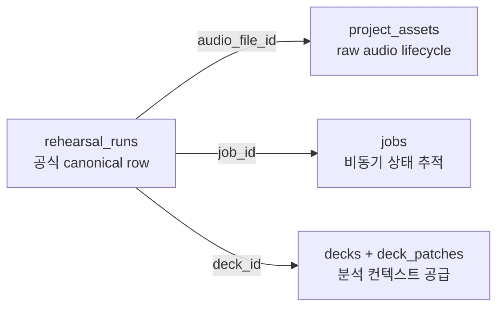
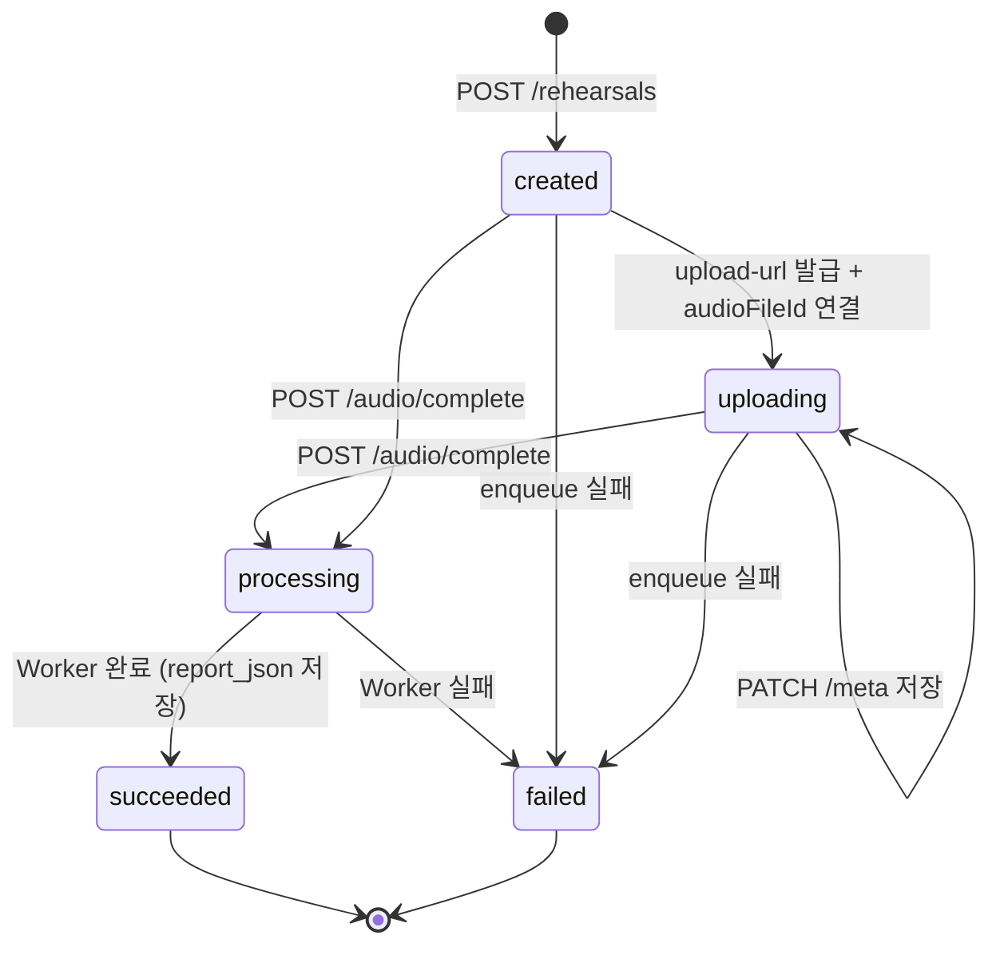
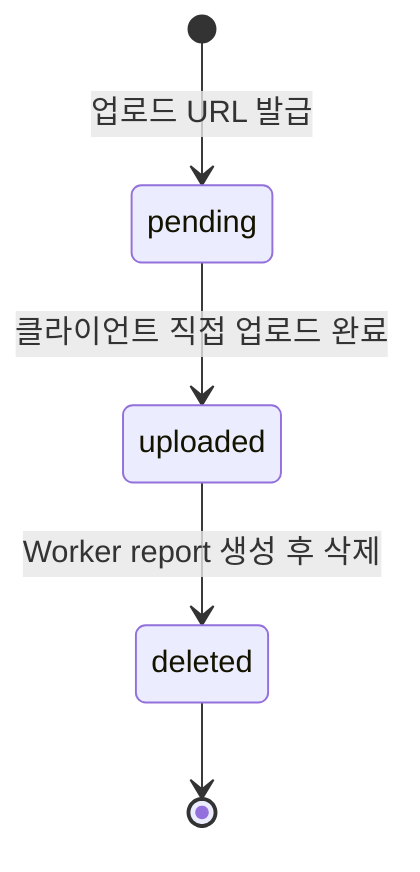

# Rehearsal Report Database

## 1. 핵심 테이블

리허설 리포트에서 꼭 알아야 할 테이블은 네 개다.

- `rehearsal_runs`
- `jobs`
- `project_assets`
- `decks` / `deck_patches`

중요한 점:

- 별도의 `rehearsal_reports` 테이블은 없다.
- 공식 report는 `rehearsal_runs.report_json`에 저장한다.

## 2. `rehearsal_runs`

생성 migration:

- `apps/api/src/database/migrations/2026062901000-CreateRehearsalRuns.ts`
- `apps/api/src/database/migrations/2026062903000-AddRehearsalReportColumns.ts`
- `apps/api/src/database/migrations/2026070301000-AddRehearsalRunMetaJson.ts`

entity:

- `apps/api/src/rehearsals/rehearsal-run.entity.ts`

### 주요 컬럼

- `run_id`
  - 리허설 실행 ID
- `project_id`
  - 프로젝트 소유자
- `deck_id`
  - 어떤 deck 기준으로 실행했는지
- `audio_file_id`
  - `project_assets.file_id` 참조
- `job_id`
  - 연결된 async job ID
- `status`
  - `created | uploading | processing | succeeded | failed`
- `error`
  - `{ code, message }`
- `report_json`
  - 공식 report 저장 위치
- `meta_json`
  - 프론트가 저장한 보조 메타데이터
- `transcript_retained`
  - transcript 원문 보존 여부
- `raw_audio_deleted_at`
  - raw audio 삭제 시각
- `created_at`, `updated_at`

### 상태 전이

- `created`
  - run만 생성된 상태
- `uploading`
  - 오디오 업로드 URL이 발급되고 `audioFileId`가 연결된 상태
- `processing`
  - 업로드 완료 후 job이 돌아가는 상태
- `succeeded`
  - `report_json` 저장 완료
- `failed`
  - 어느 단계에서든 실패

## 3. `meta_json` 구조

shared schema 기준:

- `slideTimeline`
- `missedKeywords`
- `adviceEvents`

예시 의미:

- `slideTimeline`
  - 슬라이드 진입 시각 배열
- `missedKeywords`
  - 프론트 speech tracking 기준 최종 누락 keyword
- `adviceEvents`
  - pacing/overtime 이벤트 이력

주의:

- transcript, raw audio, speaker notes 원문을 저장하는 용도가 아니다.
- 서버는 이 값을 읽어 `slideTimings` 같은 report 필드를 계산한다.

## 4. `report_json` 구조

shared schema 기준 위치:

- `packages/shared/src/rehearsals/rehearsal.schema.ts`

주요 필드:

- `reportId`
- `runId`
- `projectId`
- `deckId`
- `transcriptRetained`
- `transcript`
- `metrics`
- `speedSamples`
- `fillerWordDetails`
- `pauseDetails`
- `missedKeywords`
- `slideTimings`
- `qnaSummary`
- `coaching`
- `generatedAt`

이 JSON이 API의 `GET /api/v1/rehearsals/:runId/report` 응답 source of truth다.

## 5. `jobs`

생성 migration:

- `apps/api/src/database/migrations/2026062700200-CreateJobs.ts`

역할:

- 비동기 작업 공통 상태 저장

리허설 관련 주요 값:

- `type = rehearsal-stt`
- `status = queued | running | succeeded | failed`
- `payload`
  - `runId`, `deckId`, `audioFileId` 등 worker 입력
- `result`
  - worker 완료 결과 요약
- `error`
  - 실패 코드와 메시지

중요:

- `jobs.result`는 참고용 결과다.
- 공식 리허설 report 원본은 `rehearsal_runs.report_json`이다.

## 6. `project_assets`

entity:

- `apps/api/src/files/project-asset.entity.ts`

리허설 리포트와 연결되는 방식:

- 업로드 오디오는 `purpose = rehearsal-audio`
- 업로드 상태:
  - `pending`
  - `uploaded`
  - `deleted`

관련 컬럼:

- `file_id`
- `project_id`
- `storage_key`
- `mime_type`
- `purpose`
- `status`
- `uploaded_at`
- `deleted_at`

privacy 정책상 worker는 report 생성 후 storage object를 삭제하고:

- `project_assets.status = deleted`
- `project_assets.deleted_at = <timestamp>`
- `rehearsal_runs.raw_audio_deleted_at = <timestamp>`

를 남긴다.

## 7. `decks` / `deck_patches`

리허설 report의 DB 문맥에서 이 테이블들은 "분석 컨텍스트 공급자"다.

worker가 쓰는 이유:

- slide order
- `estimatedSeconds`
- keyword 목록
- speaker-facing 구조

특히 `deck_patches`는 최신 변경을 반영하기 위해 worker가 순차 적용한다. 따라서 리포트는 deck snapshot을 대충 읽는 구조가 아니다.

## 8. DB 관점에서 자주 보는 질의 패턴

### run 상세 보기

- `rehearsal_runs`에서 `run_id` 조회

### 오디오 자산 확인

- `project_assets`에서 `file_id`, `project_id`, `purpose = rehearsal-audio` 확인

### job 추적

- `jobs`에서 `job_id` 조회

### 공식 리포트 확인

- `rehearsal_runs.report_json IS NOT NULL`

### raw audio 삭제 확인

- `rehearsal_runs.raw_audio_deleted_at IS NOT NULL`
- `project_assets.status = deleted`

## 9. schema 변경 시 체크리스트

### `report_json` shape 변경

반드시 같이 확인:

1. shared Zod schema
2. worker report assembly
3. Python 분석 결과 shape
4. 프론트 렌더링
5. 계약 문서

### `meta_json` shape 변경

반드시 같이 확인:

1. shared Zod schema
2. 프론트 `P3RehearsalSession` / `rehearsalLogCollector`
3. API `updateRunMeta`
4. worker `loadRehearsalRunMeta` 이후 계산

## 10. 지금 구조의 결론

- 리허설 리포트의 canonical row는 `rehearsal_runs`다.
- `jobs`는 상태 추적용 보조 축이다.
- `project_assets`는 raw audio lifecycle 추적용이다.
- `decks`와 `deck_patches`는 리포트 계산 컨텍스트를 공급한다.
- 따라서 리포트 담당 변경은 대부분 `rehearsal_runs.report_json` 중심으로 사고하면 된다.
