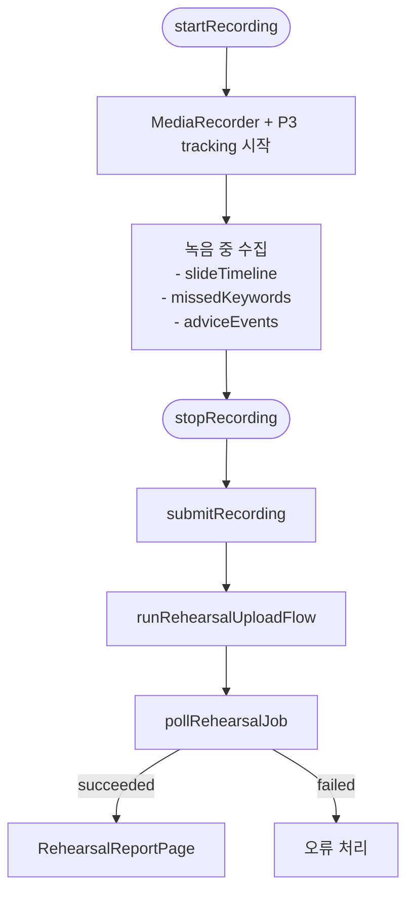
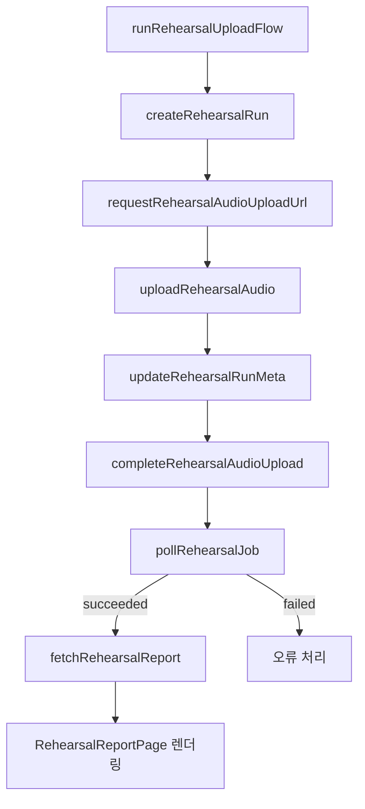
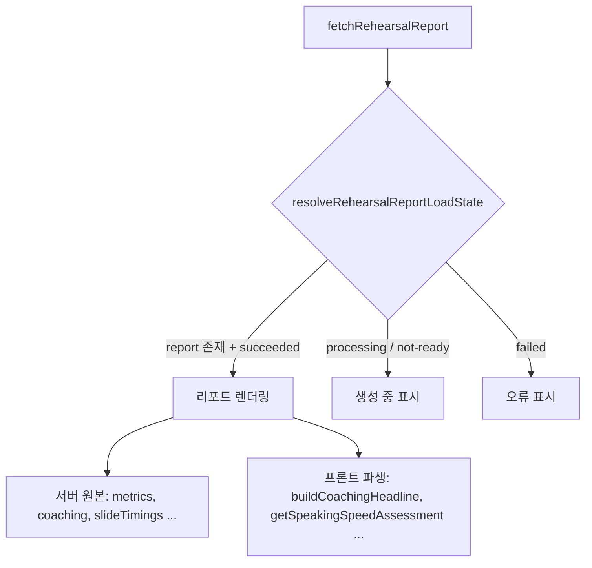

# Rehearsal Report Frontend

## 1. 진입 라우트

리허설 관련 화면 진입점은 `apps/web/src/App.tsx`에 있다.

- `/rehearsal/:projectId` -> `RehearsalWorkspace`
- `/rehearsal/:projectId/report/:runId` -> `RehearsalReportPage`

현재 구조상 리허설 실행 화면과 리포트 화면은 모두 `apps/web/src/features/rehearsal/RehearsalWorkspace.tsx` 안에 있다. 파일이 크기 때문에 기능별 책임을 나눠서 읽는 것이 좋다.

## 2. 프론트의 역할

프론트는 단순히 리포트를 렌더링만 하지 않는다. 리포트 생성 전에 필요한 메타데이터 일부를 직접 만든다.

주요 책임:

- deck 로드
- 마이크 녹음 시작/정지
- Live STT 또는 P3 speech tracking 실행
- 슬라이드 이동 이력, 키워드 누락, advice event 수집
- 녹음 파일 업로드
- run 생성 및 job polling
- report 페이지 이동과 결과 렌더링

## 3. 핵심 함수 맵

`apps/web/src/features/rehearsal/RehearsalWorkspace.tsx`

- `createRehearsalRun`
  - `POST /api/v1/projects/:projectId/rehearsals`
- `requestRehearsalAudioUploadUrl`
  - `POST /api/v1/rehearsals/:runId/audio/upload-url`
- `uploadRehearsalAudio`
  - presigned URL로 storage 직접 업로드
- `updateRehearsalRunMeta`
  - `PATCH /api/v1/rehearsals/:runId/meta`
- `completeRehearsalAudioUpload`
  - `POST /api/v1/rehearsals/:runId/audio/complete`
- `pollRehearsalJob`
  - `/api/jobs/:jobId` polling
- `fetchRehearsalRun`
  - `GET /api/v1/rehearsals/:runId`
- `fetchRehearsalReport`
  - `GET /api/v1/rehearsals/:runId/report`
- `runRehearsalUploadFlow`
  - 위 단계들을 한 번에 묶는 업로드 오케스트레이션 함수

## 4. 실행 흐름

### 4.1 리허설 시작

`startRecording()`

- deck 존재 여부 확인
- `getUserMedia`로 마이크 stream 획득
- `createRecordingSession()`으로 `MediaRecorder` 세션 생성
- `startP3Tracking(stream)`으로 Live STT/P3 tracking 시작
- UI phase를 `recording`으로 변경

### 4.2 리허설 중 메타데이터 수집

P3 tracking 관련 핵심 파일:

- `apps/web/src/features/rehearsal/speech/p3RehearsalSession.ts`
- `apps/web/src/features/rehearsal/speech/rehearsalLogCollector.ts`

수집 내용:

- `slideTimeline`
  - 슬라이드 진입 시각
- `missedKeywords`
  - 최종적으로 말하지 않은 keyword
- `adviceEvents`
  - `pace-too-fast`, `pace-too-slow`, `slide-overtime` 같은 조언 이벤트

여기서 중요한 점:

- 이 메타데이터는 리포트 품질을 높이기 위한 보조 입력이다.
- transcript 원문 자체를 프론트가 report API에 보내는 구조는 아니다.

### 4.3 녹음 종료 후 업로드

`stopRecording()` 후 `submitRecording(activeDeck, audioFile)`가 이어진다.

`submitRecording()` 내부 흐름:

1. P3 세션에서 최종 `runMeta` 확보
2. `runRehearsalUploadFlow()` 호출
3. `run` 생성
4. 오디오 업로드 URL 발급
5. storage 업로드
6. `runMeta` 저장
7. audio complete 호출로 job 생성
8. job polling
9. 완료 후 report 페이지 데이터 로드

## 5. report 페이지 구조

`RehearsalReportPage`

역할:

- 필요 시 deck 조회
- `fetchRehearsalReport(runId)` 호출
- `resolveRehearsalReportLoadState()`로 상태 판정
- 공식 report가 있으면 화면에 렌더링

현재 표시 항목:

- `metrics.durationSeconds`
- `metrics.wordsPerMinute`
- `metrics.fillerWordCount`
- `metrics.pauseCount`
- `metrics.keywordCoverage`
- `missedKeywords`
- `slideTimings`
- `qnaSummary`
- `coaching`

주의:

- 평균 속도 게이지, completion percent, headline 일부는 UI helper가 만드는 파생 표시값이다.
- 공식 데이터 원본은 어디까지나 server report다.
- 계약상 없는 `score`류 필드는 저장하지 않으며, 프론트도 공식 점수처럼 보이면 안 된다.

## 6. 리포트 화면에서 파생 계산하는 값

이 값들은 서버 원본을 가공해서 보여주는 프론트 표현 로직이다.

- `buildCoachingHeadline`
- `buildCoachingDetail`
- `getSpeakingSpeedAssessment`
- `formatRehearsalCompletionPercent`
- `buildMissedKeywordRows`

즉, UI 문구와 정렬은 프론트 책임이지만, 공식 지표의 source of truth는 서버다.

## 7. 리포트 담당자로서 수정 포인트

### UI만 바꾸는 경우

- `RehearsalReportPage`
- report 관련 helper 함수
- 필요한 경우 report 전용 컴포넌트 분리

### 공식 필드를 추가하는 경우

반드시 같이 봐야 한다.

1. `packages/shared/src/rehearsals/rehearsal.schema.ts`
2. `services/python-worker/app/rehearsal.py`
3. `apps/worker/src/rehearsal-stt.processor.ts`
4. `apps/web/src/features/rehearsal/RehearsalWorkspace.tsx`
5. 필요하면 `docs/contracts.md`

## 8. 현재 구조의 특징과 주의점

- 리허설 실행과 리포트 화면이 한 파일에 같이 있어 응집도가 높다.
- 회차 목록은 UI에 보이지만 현재는 사실상 단일 run 상세 보기 구조다.
- report 페이지는 기본적으로 1회 fetch 후 상태를 보여준다.
- `not-ready` 상태는 "생성 중"으로 표현되지만 별도 지속 polling UI는 강하지 않다.
- 리포트 메타 일부는 프론트가 만들기 때문에, 프론트 로직 변경이 server report 내용에도 영향을 준다.
