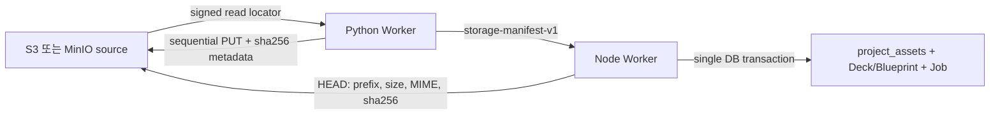

# PPTX OOXML Worker 메모리 장애 Runbook

## 장애 판정

`PPTX OOXML generation job timed out.`는 원인 오류가 아니라 Web polling의 최종 증상일 수 있다. 아래 조건이 함께 확인되면 Node Worker OOM을 원인으로 판정한다.

1. Python Worker가 `/ai/pptx-ooxml-generation` 또는 `/ai/pptx-ooxml-sync` 요청에 `200`을 반환했다.
2. 직후 `orbit-worker` 프로세스가 `SIGKILL`로 종료됐다.
3. `docker inspect`에서 `State.OOMKilled=true`가 확인된다.
4. DB의 `jobs.status`가 `running`에 남았고 Web은 terminal 상태를 받지 못했다.

```bash
docker inspect orbit-worker-1 --format '{{json .State}}'
docker stats --no-stream
docker top orbit-worker-1 -eo pid,ppid,rss,vsz,comm,args
```

로그나 오류 응답에 signed URL, storage key, base64, 발표자 script 등 사용자 원문을 출력하지 않는다.

## 근본 원인

기존 경로는 Python이 package, slide render, embedded image를 하나의 JSON 응답에 `contentBase64`로 모아 반환했다. Node는 `response.json()`으로 모든 base64 문자열을 보유한 상태에서 각 asset을 `Buffer.from(..., "base64")`로 다시 복사했다.

raw asset 합계가 `N`일 때 base64 자체가 약 `1.33N`이다. JSON 응답 buffer, 파싱된 V8 문자열, decoded `Buffer`가 겹치면 asset 데이터만으로 대략 `2.3N` 이상이 동시에 존재할 수 있다. source PPTX `arrayBuffer`, Deck/blueprint JSON, Nest watch compiler와 다른 queue의 메모리가 여기에 추가됐다. Docker VM 3.8 GiB 환경에서는 기본 서비스와 Python Worker 사용량을 제외한 headroom이 이 peak보다 작았다.

Web의 120초 timeout은 Worker가 terminal DB 상태를 기록하지 못한 결과였다. 따라서 timeout 연장만으로는 해결되지 않는다.

## 적용된 데이터 경로



`storage-manifest-v1` asset은 아래 필드만 허용한다.

```json
{
  "assetId": "current_package",
  "fileName": "current.pptx",
  "mimeType": "application/vnd.openxmlformats-officedocument.presentationml.presentation",
  "storageKey": "projects/.../jobs/.../pptx-ooxml/...",
  "size": 1234,
  "sha256": "64-character-lowercase-hex"
}
```

- Python은 asset을 S3-compatible storage에 순차 업로드하고 `orbit-sha256` metadata를 기록한다.
- Node response schema는 `contentBase64`를 거부한다.
- Node는 Job별 prefix, 중복 ID/key, 총 512 MiB 제한, `HEAD`의 크기·MIME·digest를 검증한다.
- `fileId`는 project와 storage key로 결정되어 같은 Job retry가 asset row를 중복 생성하지 않는다.
- sync source package와 project image는 Node가 읽지 않고 signed locator로 Python에 전달한다.
- Python은 locator host를 구성된 storage endpoint로 제한하고 선언 크기, PPTX ZIP 구조, raster/SVG 형식을 검증한다.

## 프로세스와 Job 복구

- Worker image는 `nest start --watch`가 아니라 compiled `apps/worker/dist/main.js`를 실행한다.
- Compose는 Worker `768m`, Python Worker `1024m`를 기본 ceiling으로 사용하며 두 service를 `unless-stopped`로 재시작한다.
- OOXML BullMQ Job은 최대 5회 exponential backoff를 사용하고 failed entry를 보존한다.
- OOXML Worker는 최대 4회의 stalled 복구를 허용한다.
- 최종 attempt 또는 stalled 한도 초과 시 DB의 `queued`/`running` Job을 `*_WORKER_TERMINATED` 오류로 `failed` 전환한다.
- Web polling 기본 제한은 10분이며 DB의 `succeeded`/`failed` 상태를 우선한다.

Worker Job 로그에는 다음 memory field가 포함된다.

- `memoryRssBytes`
- `memoryHeapUsedBytes`
- `memoryExternalBytes`
- `memoryArrayBuffersBytes`
- `memoryMaxRssBytes`

`memoryExternalBytes`와 `memoryArrayBuffersBytes`가 asset 크기에 비례해 계속 증가하면 Node 경계에서 bytes가 다시 materialize되는 회귀를 의심한다.

## 검증 절차

```bash
docker compose config --quiet
node infra/scripts/check-env.mjs
docker compose build worker

cd services/python-worker
uv run ruff check .
uv run mypy app
uv run pytest
```

큰 PPTX 회귀 검증에서는 generation과 sync 각각에 대해 다음을 확인한다.

1. Python 응답 JSON에 `contentBase64`가 없다.
2. manifest의 모든 object가 Job prefix 아래에 있다.
3. Node의 `external`/`arrayBuffers` peak가 raw asset 총량에 비례하지 않는다.
4. 성공 시 package와 render asset이 다운로드 가능하다.
5. Worker 강제 종료 시 BullMQ가 재처리하며, 최종 실패 시 DB Job이 `running`에 남지 않는다.

## 남은 개선 과제

현재 Python의 OOXML 생성 core는 일부 asset을 먼저 base64 Pydantic model로 만든 뒤 storage adapter가 decode하여 업로드한다. Node OOM과 네트워크 증폭은 제거됐지만, Python peak를 더 낮추려면 생성기 자체를 file-backed asset sink로 변경해야 한다.

다음 순서로 진행한다.

1. `ImportedDesignAsset.content_base64` 대신 temporary file descriptor를 생산하는 sink 도입
2. slide render와 package를 생성 즉시 업로드하고 참조 해제
3. Job prefix에 `committed` marker를 기록하고 TTL cleanup scanner 추가
4. DB transaction 실패 또는 최종 Job 실패 시 uncommitted prefix 삭제
5. production에서 RSS 70% 경고, 85% critical, `OOMKilled`, stalled count, `*_WORKER_TERMINATED` alert 구성
6. 최대 허용 PPTX와 render 조합을 사용한 반복 부하 테스트 및 peak RSS budget gate 추가

memory limit 증설은 rollout 안전망일 뿐 데이터 경로 개선을 대체하지 않는다.
