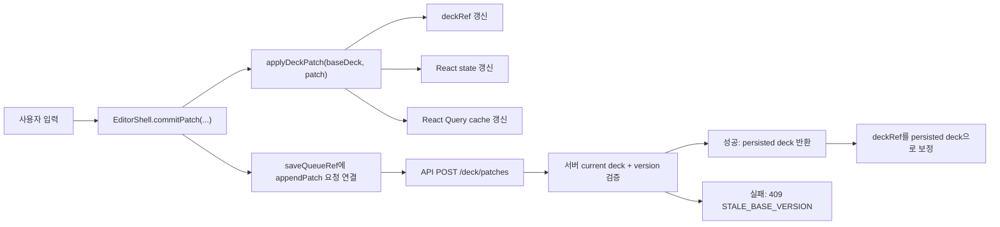
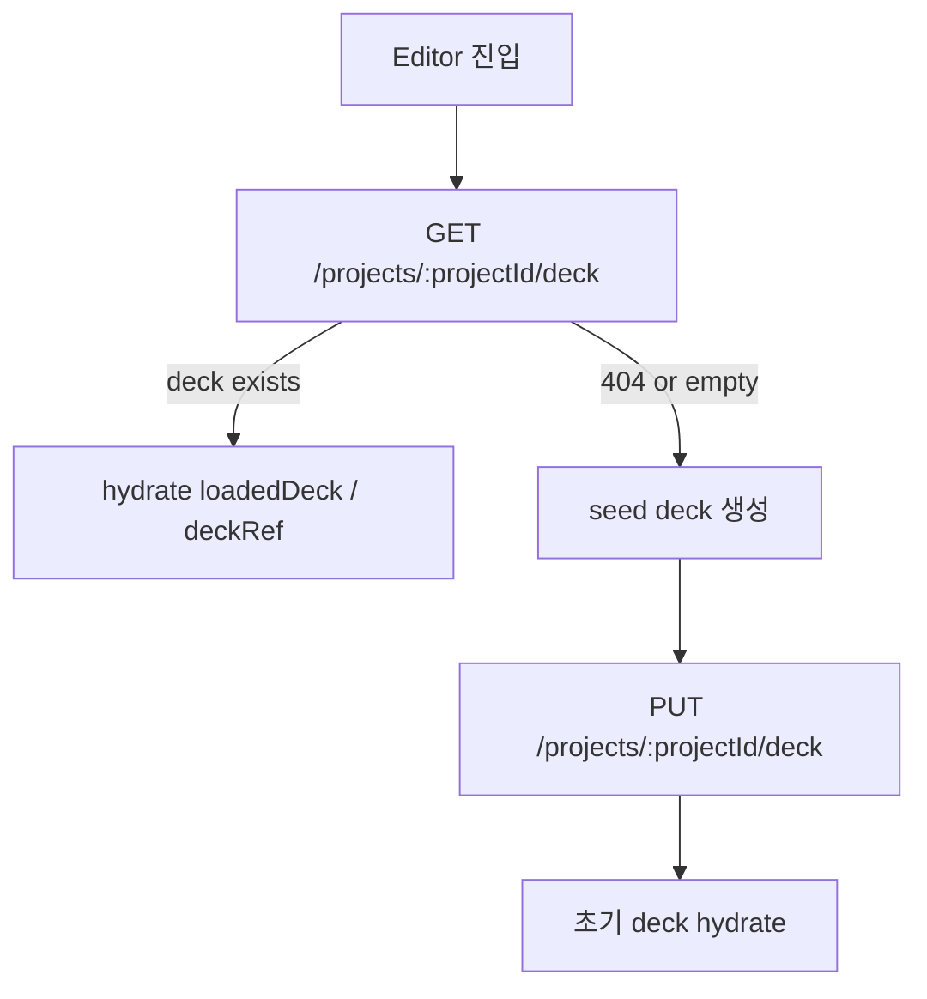
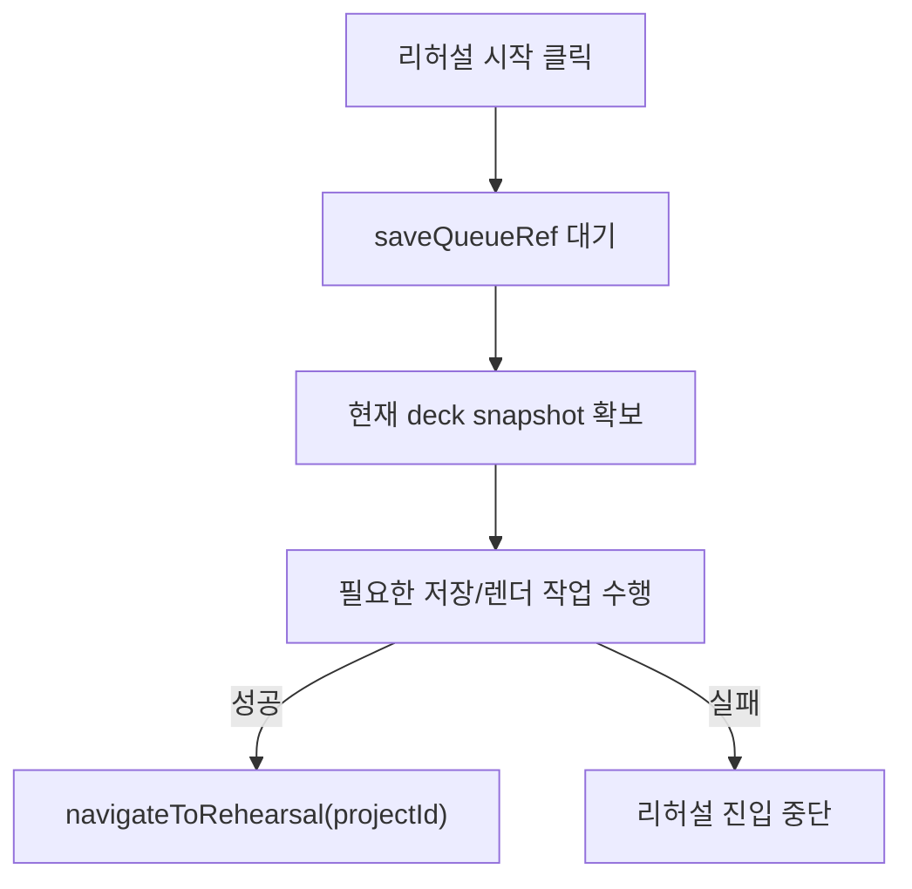
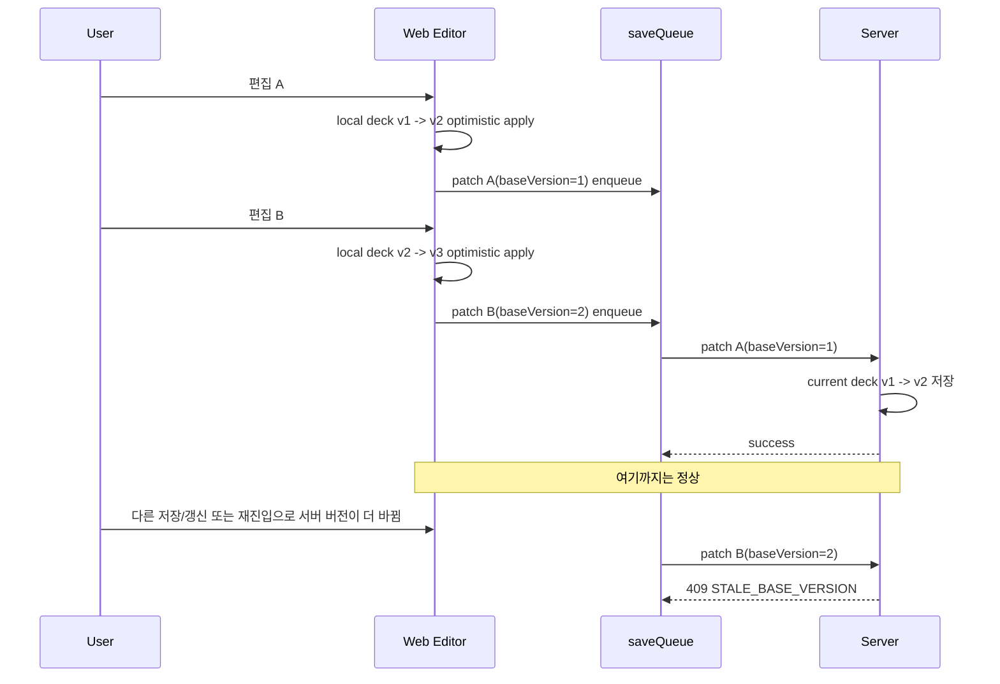

# ORBIT-251 Editor Deck 상태/저장 흐름 정리

## 목적

이 문서는 현재 ORBIT 에디터가 덱 상태를 어디서 들고 있고, 어떤 순서로 저장하며, 왜 `409 STALE_BASE_VERSION` 충돌이 날 수 있는지를 빠르게 파악하기 위한 스파이크 문서다.

이 폴더 안에서 바로 도움이 되는 내용만 남긴다.

- 에디터 상태의 실제 소스가 무엇인지
- 저장이 optimistic patch 기준으로 어떻게 흐르는지
- 수동 저장과 리허설 시작이 어떤 저장 경계를 타는지
- 지금 구조에서 어디가 취약하고 어디를 먼저 손봐야 하는지

## 한 줄 요약

현재 에디터는 `Deck JSON`을 원본 상태로 들고, 브라우저에서 먼저 patch를 적용한 뒤 서버에 직렬 저장하는 optimistic update 구조다. 문제의 핵심은 서버 버전 체크 자체보다, 클라이언트가 들고 있는 `baseVersion`과 서버 current version이 save queue 동안 어긋날 수 있다는 점이다.

이후 구조 개선을 거치면서 현재는 아래 두 방향으로 안정화가 진행된 상태다.

- 클라이언트: `persisted base`와 `working deck`을 분리하고, auto save / manual save / conflict recovery 상태를 코드로 구분한다.
- 서버: `deck_json` 전체 upsert 빈도를 줄이기 위해 checkpoint + patch replay 구조로 바꾸고, patch chain 무결성을 별도로 검증한다.

## 핵심 파일 지도

### Web editor

- `apps/web/src/features/editor/shell/EditorShell.tsx`
- `apps/web/src/features/editor/canvas/EditorCanvas.tsx`
- `apps/web/src/features/editor/shared/editorAssetUrl.ts`

### 공통 계약

- `packages/shared/src/deck/deck.schema.ts`
- `packages/shared/src/deck/patch.schema.ts`
- `packages/shared/src/deck/deck-api.schema.ts`

### patch 엔진

- `packages/editor-core/src/patches/applyPatch.ts`

### API 저장 계층

- `apps/api/src/decks/decks.controller.ts`
- `apps/api/src/decks/decks.service.ts`
- `docs/api/deck-persistence.md`

## 상태 관리 구조

### 상태 원본은 Konva가 아니라 Deck JSON

에디터의 저장 원본은 canvas 내부 상태가 아니라 `Deck` JSON이다. Konva는 렌더링과 인터랙션 엔진이고, 저장 가능한 문서 구조는 `Deck`이다.

즉 역할은 이렇게 나뉜다.

- `Deck JSON`: 저장, 복원, 리허설, API 계약의 원본
- `Konva stage`: 화면 렌더와 드래그/선택/변형 처리
- `React UI state`: 패널 열림, 선택 도구, 임시 입력 상태

### EditorShell에서 중요한 상태

현재 에디터를 읽을 때 가장 먼저 봐야 할 상태는 아래다.

- `deckRef`: 현재 로컬에서 authoritative하게 쓰는 deck
- React state의 `loadedDeck` 계열 값: 화면 렌더용 동기화 상태
- React Query cache: 서버 deck 응답 캐시
- `saveQueueRef`: patch 저장 직렬화 큐

실제 의미는 아래와 같다.

- `deckRef`는 patch 계산과 후속 저장의 기준이 된다.
- React state는 화면을 다시 그리기 위한 subscribe 지점이다.
- React Query cache는 프로젝트 deck 조회 결과와 맞물린다.
- `saveQueueRef`는 patch 요청이 서버에 순서대로 가도록 막아 준다.

### 지금은 persisted base와 working deck을 분리한다

초기 구조는 `deckRef + React state + query cache` 중심이라 로컬 작업 상태와 서버 정본 상태가 섞여 보였다. 지금은 저장 책임을 더 분명히 나눴다.

- `workingDeckRef`: 현재 화면에서 편집 중인 로컬 작업본
- `persistedBaseDeckRef`: 서버에서 마지막으로 알고 있는 persisted base
- `lastAckedDeckRef`: 서버가 마지막으로 ack한 deck
- `pendingPatchInputsRef`: 아직 ack되지 않은 patch 입력
- `hasUnackedLocalChangesRef`: 로컬 미확정 변경 존재 여부

이 분리가 필요한 이유는 아래와 같다.

- 자동 저장과 수동 저장의 경계를 분리하기 위해
- `409 STALE_BASE_VERSION` 이후 refetch/rebuild/retry를 같은 상태 모델 안에서 처리하기 위해
- 나중에 협업용 `acked/unacked/remote` 레이어를 붙일 수 있게 하기 위해

## 상태 흐름 시각화

## 에디터 진입 흐름

에디터 진입 시 기본 흐름은 단순하다.

1. `GET /deck`으로 기존 deck을 조회한다.
2. 있으면 해당 deck으로 hydrate 한다.
3. 없으면 seed deck을 만들고 `PUT /deck`으로 첫 deck을 저장한다.

즉 빈 프로젝트에 들어가면 에디터가 최초 deck 생성을 같이 맡는다.

## 일반 편집 저장 흐름

### optimistic patch 저장

일반 편집은 전체 덱 저장이 아니라 patch append 중심이다.

순서는 아래다.

1. 현재 `deckRef` 또는 전달된 `baseDeck` 기준으로 patch를 만든다.
2. 브라우저에서 `applyDeckPatch`로 먼저 적용한다.
3. 그 결과를 `deckRef`, React state, React Query cache에 반영한다.
4. 같은 patch를 `saveQueueRef`에 넣고 서버 `POST /deck/patches`를 호출한다.
5. 서버가 성공 응답을 주면 persisted deck으로 다시 한 번 보정한다.

장점:

- 입력 반응이 빠르다.
- 서버 응답을 기다리지 않고 바로 화면이 바뀐다.

주의점:

- patch 생성 시점의 `baseVersion`이 서버 저장 시점에는 이미 stale일 수 있다.
- queue는 요청 순서를 보장하지만, patch의 `baseVersion` 자체를 재계산해 주지는 않는다.

### 지금 적용된 개선점

초기에는 patch 하나마다 바로 서버로 보내는 구조에 가까웠다. 이 방식은 입력이 몰릴 때 patch 수만큼 네트워크 요청과 DB write가 발생하고, 오래된 `baseVersion`이 queue 안에 쌓이기 쉬웠다.

현재는 아래처럼 바뀌었다.

1. patch 입력은 먼저 `pendingPatchInputsRef`에 모은다.
2. flush 시점에 `persistedBaseDeckRef` 기준으로 patch batch를 다시 구성한다.
3. `409 STALE_BASE_VERSION`이 나면 최신 deck을 다시 받아 batch를 재구성하고 한 번 더 저장한다.
4. 충돌 복구가 성공하면 상태 코드는 `conflict-recovered`로 남는다.

즉 queue의 역할이 "요청 직렬화"에서 끝나지 않고, "최신 persisted base 기준 batch 재구성"까지 포함하게 됐다.

## 수동 저장 흐름

수동 저장은 patch가 아니라 full deck overwrite 쪽에 가깝다.

현재 문맥에서 보면 수동 저장은 보통 아래 단계를 탄다.

1. 저장 대기 중인 patch queue를 먼저 기다린다.
2. 현재 `deckRef` 기준으로 전체 deck을 `PUT /deck` 저장한다.
3. 썸네일 렌더 결과를 deck에 반영한다.
4. 필요하면 썸네일이 반영된 deck을 다시 `PUT /deck` 저장한다.

즉 수동 저장은 경우에 따라 full deck write가 2번 발생할 수 있다.

이 경로는 의도적으로 patch append와 다르게 유지한다. 이유는 다음과 같다.

- 사용자가 명시적으로 누른 저장은 전체 문서 checkpoint를 남기는 의미가 강하다.
- 썸네일 렌더 결과처럼 patch보다 full overwrite가 더 자연스러운 저장이 있다.
- 이후 patch compaction이 일어나면 단일 사용자 장기 사용에서도 replay 길이를 줄일 수 있다.

## 리허설 시작 흐름

리허설 시작 버튼은 단순 라우팅이 아니라, 저장 준비 절차가 선행된다.

중요한 점은 `navigateToRehearsal(...)`보다 앞 단계가 실패하면 페이지 이동도 일어나지 않는다는 것이다.

따라서 사용자가 보기에는 "버튼이 안 먹는다"처럼 보여도, 실제 원인은 직전 patch 저장 충돌일 수 있다.

## 서버 저장 경계

서버의 공식 persistence boundary는 `DecksService`다.

주요 endpoint:

- `GET /api/v1/projects/:projectId/deck`
- `PUT /api/v1/projects/:projectId/deck`
- `POST /api/v1/projects/:projectId/deck/patches`
- `GET /api/v1/projects/:projectId/snapshots`
- `POST /api/v1/projects/:projectId/snapshots/:snapshotId/restore`

`appendPatch()`는 아래 역할을 한다.

1. 현재 deck row를 `FOR UPDATE`로 잠근다.
2. checkpoint deck과 그 이후 patch tail을 읽어 최신 deck을 재구성한다.
3. patch chain이 checkpoint와 연속적으로 이어지는지 검증한다.
4. `applyDeckPatch(currentDeck, patch)`를 호출한다.
5. version이 맞으면 patch log를 남기고, 필요할 때만 checkpoint deck을 갱신한다.
6. version이 다르면 `409 STALE_BASE_VERSION`으로 실패시킨다.

즉 서버는 "낙관적 동시성 제어를 엄격하게 수행하는 쪽"이다.

### 왜 deck_json 전체 upsert 구조를 바꿨는가

초기 서버 구조는 patch를 받아도 매번 `decks.deck_json` 전체를 upsert했다. 이 방식의 문제는 아래였다.

- 요소 수가 많아질수록 write payload가 계속 커진다.
- patch log를 따로 남기는데도 current deck 전체를 매번 다시 써야 한다.
- 일반 편집이 잦을수록 `deck_json` 전체 write가 과도하게 발생한다.

그래서 현재는 서버를 아래처럼 바꿨다.

- `decks`: 주기적 checkpoint deck
- `deck_patches`: checkpoint 이후 patch tail
- `deck_snapshots`: 복원/이력용 snapshot

조회 시에는 `checkpoint + patch replay`로 최신 deck을 재구성하고, 저장 시에는 patch log를 우선 기록한다. checkpoint는 아래 시점에만 갱신한다.

- full deck 저장(`PUT /deck`)
- snapshot/restore 계열 저장
- patch가 일정 개수 이상 누적된 시점

이 구조로 바꾸면서 일반 patch 저장의 DB write 비용은 `deck_json 전체 upsert` 중심에서 `patch insert 중심`으로 내려갔다.

### 지금 서버에서 추가로 강해진 무결성 규칙

서버 patch chain은 이제 그냥 "쌓인 로그"가 아니라 검증 대상이다.

- 첫 patch의 `before_version`은 checkpoint deck version과 같아야 한다.
- 각 patch는 `after_version = before_version + 1` 이어야 한다.
- 이전 patch의 `after_version`과 다음 patch의 `before_version`은 연속이어야 한다.
- patch apply 결과 `deck.version`은 row의 `after_version`과 같아야 한다.
- patch row의 `project_id`, `deck_id`는 checkpoint deck과 같아야 한다.

이 규칙을 만족하지 않으면 서버는 아래 에러 코드로 실패시킨다.

- `PATCH_CHAIN_INVALID`
- `PATCH_CHAIN_CHECKPOINT_MISMATCH`

또한 DB에는 `(project_id, deck_id, after_version)` unique index를 추가해서 같은 deck에 같은 `after_version` patch가 중복 저장되지 않게 했다.

## 409 충돌이 나는 이유

### 직접 원인

`patch.baseVersion !== current deck.version`

이 조건이 맞으면 `applyDeckPatch()`가 `BASE_VERSION_MISMATCH`를 반환하고, API는 이를 `409 STALE_BASE_VERSION`으로 변환한다.

### 실제로 자주 발생하는 상황

핵심은 queue가 있어도 `patch를 만든 시점의 baseVersion`은 고정이라는 점이다. 서버 current version이 그 사이 달라지면 충돌한다.

### 지금은 어떻게 복구하는가

현재는 `409 STALE_BASE_VERSION`이 나면 바로 실패로 끝나지 않는다.

1. 최신 persisted deck을 다시 읽는다.
2. pending patch batch를 최신 persisted base 기준으로 다시 만든다.
3. 재생성한 patch로 한 번 더 저장한다.

즉 단일 사용자 편집에서 흔한 stale save는 자동 복구가 가능하다. 다만 이 구조는 "협업 merge"까지는 아니고, "같은 사용자의 저장 직렬화 중 어긋난 baseVersion 복구"에 초점을 둔다.

## 지금 구조에서 바로 유용한 진단 포인트

### 1. 먼저 볼 것

- `commitPatch()`가 어떤 `baseDeck`으로 patch를 생성하는지
- `saveQueueRef`가 실패 이후 어떤 상태로 남는지
- `persistedDeck.version >= deckRef.current.version` 보정이 충분한지
- 리허설 시작 전에 queue 실패를 삼키는지, 아니면 흐름을 끊는지

### 2. 콘솔/네트워크에서 의미 있는 신호

- `POST /deck/patches`의 `409 Conflict`
- 같은 프로젝트에서 연속 patch 요청이 밀려 있는지
- 직전 `PUT /deck` 이후 오래된 patch가 뒤늦게 도착하는지

### 3. 증상과 원인 연결

- "리허설 시작이 안 됨" -> 저장 준비 단계 실패 가능성
- "저장은 된 것 같은데 다시 꼬임" -> optimistic local state와 persisted state 불일치 가능성
- "처음엔 안 되고 새로고침 후 됨" -> refetch 이후 version 정합성이 복구된 가능성

## 지금 구조의 장점

- `Deck JSON`을 원본으로 삼아서 editor, API, rehearsal이 같은 문서를 본다.
- patch 규칙이 `shared`와 `editor-core`에 있어서 서버/클라 규칙이 맞춰져 있다.
- 서버가 version 검증을 강하게 해서 잘못된 덱 덮어쓰기를 막는다.

## 지금 구조의 취약점

- 협업용 `remote change` 레이어는 아직 없다.
- `saveQueueRef`는 단일 사용자 안정화에는 충분하지만, 다중 사용자 merge 전략까지 포함하지는 않는다.
- 리허설 시작은 여전히 저장 준비 단계에 묶여 있어서, 저장 실패가 곧 이동 실패로 보일 수 있다.
- checkpoint 간격과 replay 길이 상한은 아직 더 운영적으로 다듬을 여지가 있다.

## 어떤 구조적 문제가 있었고 어떻게 해결했는가

### 1. 로컬 작업본과 서버 정본이 섞여 보이던 문제

문제:

- 화면에서 쓰는 deck
- 서버가 마지막으로 ack한 deck
- 아직 저장 안 된 변경

이 세 가지가 코드상으로 분명히 나뉘지 않았다.

해결:

- `workingDeckRef`
- `persistedBaseDeckRef`
- `lastAckedDeckRef`
- `pendingPatchInputsRef`

로 분리해서 상태 책임을 명확히 했다.

### 2. stale patch가 queue 안에서 쌓이던 문제

문제:

- patch를 만든 시점의 `baseVersion`이 queue 안에서 오래된 채 남을 수 있었다.
- 저장 요청 순서만 맞고, 저장 시점 기준 재구성은 없었다.

해결:

- pending patch를 batch로 모으고
- flush 시점의 `persisted base` 기준으로 patch를 다시 만들고
- `409` 시 refetch + rebuild + retry를 넣었다.

### 3. patch를 받아도 매번 deck_json 전체를 쓰던 문제

문제:

- 일반 편집이 많아질수록 `deck_json` 전체 upsert가 과도했다.
- patch log가 있는데도 매 저장마다 full document write가 필요했다.

해결:

- `checkpoint + patch replay` 구조로 바꿨다.
- 일반 편집은 patch insert 중심으로 저장한다.
- full save/checkpoint 시 patch compaction을 수행한다.

### 4. patch chain이 조용히 깨질 수 있던 문제

문제:

- patch gap
- duplicate after_version
- checkpoint와 안 맞는 첫 patch

가 있어도 서버가 무조건 믿으면 잘못된 deck을 복원할 수 있었다.

해결:

- replay 시 version 연속성 검증
- checkpoint 경계 검증
- `(project_id, deck_id, after_version)` unique 제약
- 무결성 테스트 추가

## 어떤 성능 문제가 있었고 어떻게 해결했는가

### 성능 문제

- 일반 편집 patch마다 `decks.deck_json` 전체 upsert
- patch log insert와 full deck write가 동시에 발생
- 장기 사용 시 patch tail 또는 full write 비용이 한쪽으로 계속 커질 위험

### 해결

- patch 저장은 `deck_patches` insert 중심으로 전환
- `decks`는 checkpoint 시점에만 갱신
- full save/checkpoint 후 patch compaction으로 tail 길이를 줄임
- 무결성 검증은 replay 경로 안에서 수행해 추가 오버헤드를 최소화

## 우선순위 기준으로 보면

### 먼저 리팩토링할 곳

- web editor의 deck 동기화와 충돌 복구 로직
- `commitPatch` 이후 save queue error handling
- stale patch 재시도 또는 refetch/rebase 전략

### 나중에 리팩토링할 곳

- 서버 `DecksService` 파일 분리
- snapshot 정책 정교화
- patch apply의 대형 deck 성능 최적화

즉 현재 우선순위는 서버보다 클라이언트 저장 흐름이다.

## 바로 쓸 수 있는 개선 아이디어

### 선택지 1. 409 시 refetch 후 사용자에게 재시도 유도

가장 단순하다. 구현 부담이 낮다. 다만 입력이 많은 상황에서는 UX가 거칠다.

### 선택지 2. save queue에서 409 시 최신 deck refetch 후 patch 재적용

실무적으로 더 낫다. 다만 patch 재적용 가능 범위를 잘 따져야 한다.

### 선택지 3. patch 자체가 아니라 "의도"를 queue에 넣고 전송 직전에 patch 생성

구조적으로 가장 건강하다. 현재 local optimistic 구조와 저장 구조를 다시 정리해야 한다.

## 지금 이 문서를 읽고 바로 확인할 코드 포인트

- `apps/web/src/features/editor/shell/EditorShell.tsx`
- `packages/editor-core/src/patches/applyPatch.ts`
- `apps/api/src/decks/decks.service.ts`

아래 순서로 보는 것이 가장 빠르다.

1. `EditorShell`의 `deckRef`, `saveQueueRef`, `commitPatch`
2. 리허설 시작 핸들러의 queue 대기와 navigation 호출 위치
3. `applyDeckPatch()`의 `baseVersion` 검증
4. `DecksService.appendPatch()`의 409 변환 경로

## 저장 UX 설계

자동 저장이 있더라도 저장 버튼과 마지막 저장 시각은 유지하는 편이 맞다. 현재 구조는 patch 저장, full deck 저장, 썸네일 저장, 리허설 준비 저장이 섞여 있어서 사용자가 "지금 진짜 저장됐는가"를 직관적으로 알기 어렵다.

저장 버튼은 단순한 중복 기능이 아니라 아래 역할을 가진다.

- 사용자가 현재 상태를 명시적으로 확정 저장할 수 있는 액션
- 자동 저장 실패 시 재시도 진입점
- 저장 상태를 눈으로 확인하는 기준점

### 권장 UI 요소

- `저장` 버튼
- `마지막 저장: HH:mm:ss` 문구
- 상태 배지 또는 상태 텍스트
- 필요하면 `자동 저장 켜짐` 표시

### 상태 모델

현재 코드에는 이미 `saveState`, `saveStatusLabel`, `lastPatchLabel`이 있다. 이 값들을 더 명확한 저장 UX로 연결하는 방향이 적합하다.

권장 상태는 아래 정도면 충분하다.

- `저장됨`
- `저장 중...`
- `저장 대기 중`
- `저장 실패`
- `충돌 발생`
- `마지막 저장: 14:32:10`

### 상태 의미

- `저장 대기 중`
  로컬 optimistic 변경은 반영됐지만 서버 확정 저장은 아직 끝나지 않은 상태
- `저장 중...`
  patch queue 또는 수동 저장이 실제 네트워크 요청을 수행 중인 상태
- `저장됨`
  현재 화면 상태와 서버 확정 상태가 일치한다고 판단되는 상태
- `저장 실패`
  네트워크 실패, validation 실패, 권한 실패 등으로 저장이 중단된 상태
- `충돌 발생`
  `409 STALE_BASE_VERSION`처럼 버전 충돌이 발생해 자동 복구나 재시도가 필요한 상태

### 마지막 저장 시각 갱신 기준

`마지막 저장 시각`은 로컬 수정 시각이 아니라 `서버가 확정 저장을 완료한 시각` 기준으로 갱신하는 것이 맞다.

즉 아래 시점에만 갱신한다.

- `POST /deck/patches` 성공 응답을 받은 시점
- `PUT /deck` 성공 응답을 받은 시점
- 리허설 준비 저장까지 모두 성공해 최종 deck이 확정된 시점

아래 시점에는 갱신하면 안 된다.

- 사용자가 로컬에서 편집만 한 시점
- queue에 patch가 쌓인 시점
- 렌더/썸네일 저장이 아직 끝나지 않은 중간 시점

### 버튼 동작 권장안

- 기본 상태: `저장`
- 저장 중: 버튼 비활성화, 라벨은 `저장 중...`
- 실패 상태: 버튼 활성화, 라벨은 `다시 저장`
- 충돌 상태: 버튼 활성화, 라벨은 `동기화 후 다시 저장` 또는 `다시 저장`

### 자동 저장과 수동 저장의 관계

자동 저장이 있더라도 수동 저장은 남기는 편이 좋다.

- 자동 저장은 사용자의 입력 손실을 줄인다.
- 수동 저장은 사용자가 "이 시점 상태를 확정한다"는 신뢰 포인트가 된다.
- 동시 편집이 붙으면 수동 저장 버튼은 사실상 `동기화 상태 확인 + 재시도` UI 역할도 하게 된다.

### 현재 구조에 맞는 최소 적용안

지금 구조를 크게 바꾸지 않고도 아래 정도는 바로 적용할 수 있다.

- 상단에 `저장` 버튼 유지
- 버튼 옆에 `saveStatusLabel` 기반 상태 문구 노출
- 별도 상태로 `마지막 저장 시각` 추가
- `409` 발생 시 일반 `저장 실패`와 구분된 `충돌 발생` 상태 노출
- `lastPatchLabel`은 디버그/개발자 정보로 두고, 사용자 메시지는 더 단순하게 정리

### 동시 편집을 고려한 이유

나중에 동시 편집을 붙일수록 아래 정보가 중요해진다.

- 내가 본 화면이 서버 최신 상태와 얼마나 동기화돼 있는지
- 저장이 끝났는지, 아직 대기 중인지
- 실패가 네트워크 문제인지, 버전 충돌인지

즉 저장 UX는 단순한 장식이 아니라, 저장 구조의 안정성과 협업 확장성을 사용자에게 설명하는 인터페이스다.
